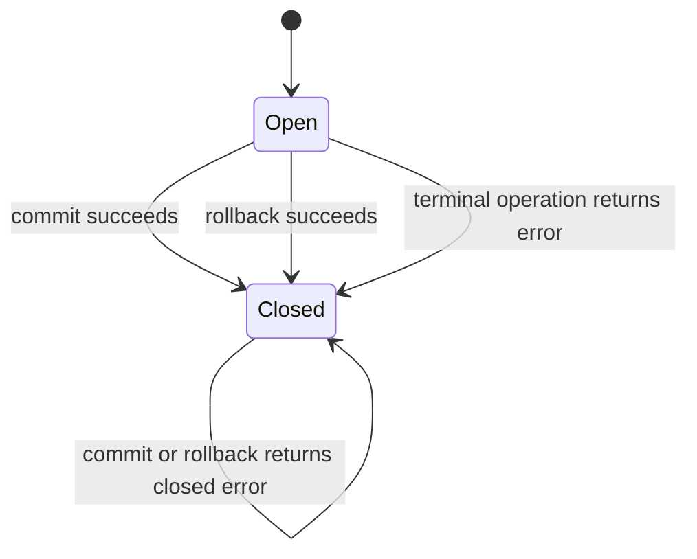
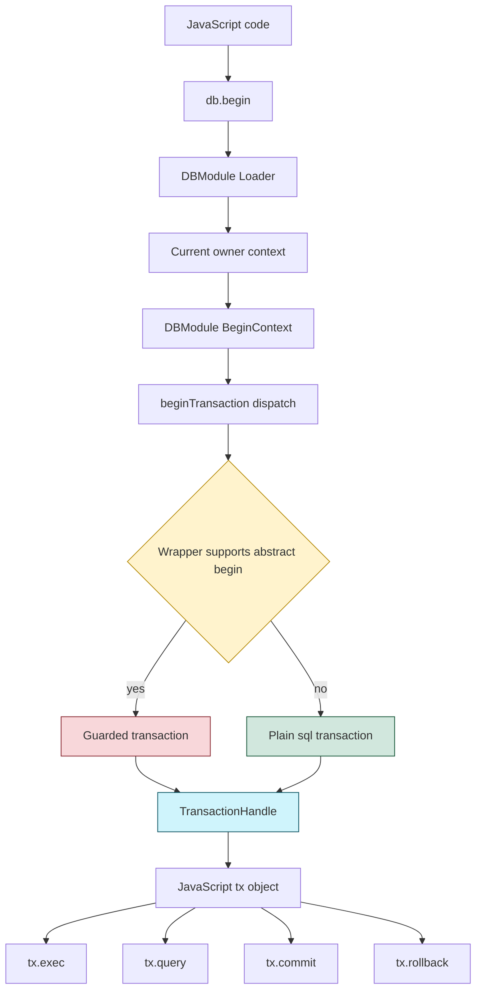

# go-go-goja: Adding Transaction Support to the Goja DB Module

This report explains how transaction support was added to the `go-go-goja` database module. The feature looks small from JavaScript — `const tx = db.begin()` — but the implementation has to preserve several important properties at once: compatibility with `database/sql`, support for Go-provided database wrappers, context propagation through the Goja runtime owner, guarded write policy for jsverbs, and useful TypeScript declarations for generated applications.

> [!summary]
> - The new JavaScript API is explicit: `db.begin()` returns a transaction object with `query`, `exec`, `commit`, and `rollback`.
> - The Go implementation uses wrapper-friendly transaction interfaces instead of hard-coding only `*sql.Tx`.
> - The guarded jsverbs database wrapper now returns guarded transaction handles, so `tx.exec(...)` cannot bypass read-only mode.
> - The main implementation commit is `1b40ae1` in `/home/manuel/workspaces/2026-05-27/rag-evaluation-system/go-go-goja`.

## Why this change exists

Before this change, JavaScript code running inside a Goja runtime could call `db.exec(...)` and `db.query(...)`, but it could not group several statements into one atomic unit of work. Each statement was sent independently through Go's `database/sql` API. That is acceptable for read-only queries and single-row writes, but it is not enough for scripts that create a parent row, insert children, update an index, and then discover that the final validation step failed.

A transaction is the database mechanism that gives those operations a single commit point. If all statements succeed, the transaction commits. If one statement fails, the caller rolls the transaction back and the database returns to the state it had before the transaction began. The Go standard library already has this concept in `*sql.Tx`; the missing piece was exposing it through the Goja native module in a way that did not break the module's existing abstraction.

The central design question was not "how do we call `db.BeginTx`?" That part is straightforward. The central question was: **how do we expose transactions while preserving the fact that the database module accepts wrappers, not only raw `*sql.DB` values?**

That question shapes the whole implementation.

## The existing database module

The database module lives in:

```text
/home/manuel/workspaces/2026-05-27/rag-evaluation-system/go-go-goja/modules/database/database.go
```

The module is registered under both names, `database` and `db`, so JavaScript can use either form depending on the host command or generated binary:

```go
func init() {
    modules.Register(New())
    modules.Register(New(WithName("db")))
}
```

At runtime, a JavaScript program sees a CommonJS module:

```javascript
const db = require("db");
db.configure("sqlite3", ":memory:");
db.exec("CREATE TABLE users(name TEXT)");
db.exec("INSERT INTO users(name) VALUES (?)", "Ada");
const rows = db.query("SELECT name FROM users");
```

The Go side intentionally stores a narrow database interface:

```go
type QueryExecer interface {
    Query(query string, args ...any) (*sql.Rows, error)
    Exec(query string, args ...any) (sql.Result, error)
}

type QueryExecerContext interface {
    QueryContext(ctx context.Context, query string, args ...any) (*sql.Rows, error)
    ExecContext(ctx context.Context, query string, args ...any) (sql.Result, error)
}
```

That narrow interface is important. It means the module can wrap a real `*sql.DB`, but it can also wrap another Go object that enforces policy before forwarding calls to a database. The jsverbs CLI uses exactly this pattern. It wraps a SQLite connection in a `guardedDB` that rejects writes unless the CLI was started with write permissions.

The database module therefore has three responsibilities:

- It translates JavaScript function calls into Go method calls.
- It converts `*sql.Rows` and `sql.Result` into JavaScript-friendly values.
- It preserves host policy and runtime context when calls cross from JavaScript into Go.

Transaction support has to fit inside those responsibilities. It should not turn the module into a SQLite-specific API, and it should not bypass wrappers that were deliberately inserted by the host.

## The JavaScript API

The implemented API is explicit and small:

```javascript
const db = require("db");
const tx = db.begin();

try {
  tx.exec("INSERT INTO users(name) VALUES (?)", "Ada");
  tx.exec("INSERT INTO users(name) VALUES (?)", "Grace");
  tx.commit();
} catch (err) {
  tx.rollback();
  throw err;
}
```

The transaction object supports four operations:

```typescript
interface DatabaseTransaction {
  query(query: string, ...args: unknown[]): Array<Record<string, unknown>>;
  exec(query: string, ...args: unknown[]): DatabaseExecResult;
  commit(): { success: boolean; error?: string };
  rollback(): { success: boolean; error?: string };
}
```

This explicit-handle style was chosen over a callback API such as `db.transaction(fn)`. A callback API is attractive, but it immediately raises questions about async functions, promise resolution, and when a transaction should auto-commit or auto-rollback. The explicit handle avoids those questions in the first implementation. The caller begins, executes, commits, or rolls back. The lifecycle is visible in the JavaScript code and easy to test.

A future `db.transaction(fn)` helper can be layered on top of this primitive. It should not be the primitive itself.

## The core implementation idea

The implementation added new transaction interfaces near the top of `modules/database/database.go`:

```go
type Transaction interface {
    Query(query string, args ...any) (*sql.Rows, error)
    Exec(query string, args ...any) (sql.Result, error)
    Commit() error
    Rollback() error
}

type TransactionContext interface {
    QueryContext(ctx context.Context, query string, args ...any) (*sql.Rows, error)
    ExecContext(ctx context.Context, query string, args ...any) (sql.Result, error)
    Commit() error
    Rollback() error
}

type TransactionBeginner interface {
    BeginTransaction() (Transaction, error)
}

type TransactionBeginnerContext interface {
    BeginTransactionContext(ctx context.Context, opts *sql.TxOptions) (Transaction, error)
}
```

These interfaces are the key to the design. The module could have looked only for `BeginTx(ctx, opts) (*sql.Tx, error)`, because `*sql.DB` implements that. But that would force every transaction to be a raw `*sql.Tx`. A raw `*sql.Tx` has no knowledge of host policy. If a wrapper wants to reject writes, audit statements, or restrict SQL, it needs to return its own transaction object.

The implementation therefore supports both paths:

1. If the configured database wrapper implements `BeginTransactionContext`, use that. This is the preferred path because it preserves wrapper policy.
2. Otherwise, if it is a plain SQL object with `BeginTx`, use `BeginTx` and treat the returned `*sql.Tx` as the transaction.
3. Fall back to non-context begin methods when necessary.
4. If none of those are available, return a clear error saying the database does not support transactions.

In code, the dispatch looks like this:

```go
func beginTransaction(ctx context.Context, qe QueryExecer) (Transaction, error) {
    if ctx == nil {
        ctx = context.Background()
    }
    if beginner, ok := qe.(TransactionBeginnerContext); ok {
        return beginner.BeginTransactionContext(ctx, nil)
    }
    if beginner, ok := qe.(sqlTransactionBeginnerContext); ok {
        return beginner.BeginTx(ctx, nil)
    }
    if beginner, ok := qe.(TransactionBeginner); ok {
        return beginner.BeginTransaction()
    }
    if beginner, ok := qe.(sqlTransactionBeginner); ok {
        return beginner.Begin()
    }
    return nil, fmt.Errorf("database %T does not support transactions", qe)
}
```

There is a subtle Go type-system issue here. Interface return types are not covariant. A method returning `*sql.Tx` does not satisfy an interface method returning `Transaction`, even though `*sql.Tx` itself satisfies `Transaction`. That is why the implementation has both wrapper-specific begin interfaces and internal SQL-specific begin interfaces.

## How the handle is represented

`DBModule.BeginContext` starts the transaction and returns a `TransactionHandle`:

```go
func (m *DBModule) BeginContext(ctx context.Context) (*TransactionHandle, error) {
    if m == nil || m.queryExecer == nil {
        return nil, fmt.Errorf("database not configured, call require('%s').configure(...) first", m.Name())
    }
    if ctx == nil {
        ctx = context.Background()
    }

    tx, err := beginTransaction(ctx, m.queryExecer)
    if err != nil {
        return nil, err
    }
    return &TransactionHandle{moduleName: m.Name(), tx: tx}, nil
}
```

The handle owns the transaction and a small amount of lifecycle state:

```go
type TransactionHandle struct {
    moduleName string
    tx         Transaction
    closed     bool
    mu         sync.Mutex
}
```

The mutex is not there because Goja encourages arbitrary concurrent access to the VM. It is there because the transaction handle is a Go object exposed to JavaScript, and the implementation should have deterministic closed-state behavior even if host callbacks or future async integrations interleave. Once `commit` or `rollback` succeeds, the handle clears the transaction and marks itself closed. Later calls return `database transaction is closed` instead of depending on whatever error the driver happens to return.

That decision makes the JavaScript boundary easier to reason about. A transaction has two states:



The current implementation marks the handle closed after invoking a terminal operation even if the terminal operation returns an error. That is conservative: once a commit or rollback has been attempted, reusing the handle is more dangerous than reporting that the transaction is closed.

## Exporting the transaction to JavaScript

The loader now exports `begin` alongside `query`, `exec`, `configure`, and `close`:

```go
modules.SetExport(exports, m.Name(), "begin", func() (*goja.Object, error) {
    tx, err := m.BeginContext(runtimebridge.CurrentOwnerContext(vm))
    if err != nil {
        return nil, err
    }
    return tx.ToObject(vm), nil
})
```

The transaction object is constructed explicitly:

```go
func (h *TransactionHandle) ToObject(vm *goja.Runtime) *goja.Object {
    obj := vm.NewObject()
    modules.SetExport(obj, h.moduleName, "query", func(query string, args ...any) ([]map[string]any, error) {
        return h.QueryContext(runtimebridge.CurrentOwnerContext(vm), query, args...)
    })
    modules.SetExport(obj, h.moduleName, "exec", func(query string, args ...any) (map[string]any, error) {
        return h.ExecContext(runtimebridge.CurrentOwnerContext(vm), query, args...)
    })
    modules.SetExport(obj, h.moduleName, "commit", h.Commit)
    modules.SetExport(obj, h.moduleName, "rollback", h.Rollback)
    return obj
}
```

The `runtimebridge.CurrentOwnerContext(vm)` calls are not incidental. They are part of the runtime contract. `go-go-goja` uses a runtime owner to serialize access to the `goja.Runtime` and attach a Go `context.Context` to the current call. Database operations should see that context, because it may contain cancellation, request metadata, or tracing values.

The tests verify that the transaction path preserves this behavior even after an `await`:

```javascript
(async () => {
  const timer = require("timer");
  const siteDB = require("site-db");
  await timer.sleep(1);
  const tx = siteDB.begin();
  const ok = tx.exec("INSERT INTO widgets(name) VALUES (?)", "Ada").success;
  tx.rollback();
  return ok;
})();
```

The Go test asserts that both the begin call and the transaction exec call receive the original owner call context.

## Why wrappers matter

The most important implementation detail is not the `*sql.Tx` integration. It is the wrapper integration.

`pkg/jsverbscli/runtime.go` has a `guardedDB` wrapper around `*sql.DB`. Its purpose is to allow scripts to query a database while preventing writes unless the CLI was started with explicit write permission. Before transactions, the guard lived in `Exec`:

```go
func (g *guardedDB) Exec(query string, args ...any) (sql.Result, error) {
    if !g.allowWrites {
        return nil, fmt.Errorf("database writes are disabled; rerun with --readonly=false --allow-writes")
    }
    return g.db.Exec(query, args...)
}
```

If `db.begin()` simply called the underlying `*sql.DB.BeginTx` and returned the raw `*sql.Tx`, JavaScript could do this:

```javascript
const tx = db.begin();
tx.exec("INSERT INTO widgets(name) VALUES (?)", "Ada");
tx.commit();
```

That would bypass the top-level `guardedDB.Exec` method. The write policy would still protect `db.exec`, but it would not protect `tx.exec`. That is the failure mode the interface design prevents.

The guarded wrapper now implements transaction begin methods that return a guarded transaction:

```go
func (g *guardedDB) BeginTransactionContext(ctx context.Context, opts *sql.TxOptions) (databasemod.Transaction, error) {
    tx, err := g.db.BeginTx(ctx, opts)
    if err != nil {
        return nil, err
    }
    return &guardedTx{tx: tx, allowWrites: g.allowWrites}, nil
}
```

The guarded transaction enforces the same write check:

```go
func (g *guardedTx) ExecContext(ctx context.Context, query string, args ...any) (sql.Result, error) {
    if !g.allowWrites {
        return nil, fmt.Errorf("database writes are disabled; rerun with --readonly=false --allow-writes")
    }
    return g.tx.ExecContext(ctx, query, args...)
}
```

This is the reusable lesson: when an API exposes a nested capability, the guard has to move into the nested object as well. It is not enough to guard only the root object.

## Data flow

The transaction path has a small number of moving parts, but each part has a distinct responsibility:



The diagram shows why the dispatch layer exists. It is the point where the module decides whether a wrapper wants to provide a policy-preserving transaction. If it does, the wrapper wins. If it does not, a plain SQL transaction is acceptable.

## Result conversion and small correctness improvements

Transaction query and exec should behave like root query and exec. Rather than duplicate conversion code, the implementation extracts helpers:

```go
func rowsToRecords(moduleName string, rows *sql.Rows) ([]map[string]any, error)
func resultToMap(result sql.Result) map[string]any
```

This extraction also fixes a small correctness gap: row iteration now checks `rows.Err()` after scanning. SQL drivers can report errors after iteration begins, and callers should not silently receive partial results without knowing that iteration failed.

The `exec` result shape remains familiar:

```json
{
  "success": true,
  "rowsAffected": 2,
  "lastInsertId": 17
}
```

Commit and rollback have a smaller shape because they are terminal lifecycle operations rather than row-changing SQL statements:

```json
{ "success": true }
```

On error, transaction exec and lifecycle methods return a map with `success: false` and an `error` string, while also returning the Go error to Goja so JavaScript error handling can work normally.

## TypeScript declarations

The module's TypeScript descriptor now includes a transaction interface. This affects generated declaration output such as:

```text
cmd/bun-demo/js/src/types/goja-modules.d.ts
```

The declaration shape is intentionally straightforward:

```typescript
interface DatabaseExecResult {
  success: boolean;
  rowsAffected?: number;
  lastInsertId?: number;
  error?: string;
}

interface DatabaseTransaction {
  query(query: string, ...args: unknown[]): Array<Record<string, unknown>>;
  exec(query: string, ...args: unknown[]): DatabaseExecResult;
  commit(): { success: boolean; error?: string };
  rollback(): { success: boolean; error?: string };
}
```

There is one open polish issue here. The current declaration generator emits raw declaration lines with limited indentation control. The declarations are correct, but the generated formatting is not as nice as a hand-written TypeScript file. That is acceptable for this change; improving raw DTS formatting should be a separate generator cleanup.

## Tests as executable specification

The implementation added tests that describe the feature in operational terms.

The commit test proves that writes survive after `commit`:

```javascript
const db = require("database");
db.configure("sqlite3", dbPath);
db.exec("CREATE TABLE users (name TEXT NOT NULL)");
const tx = db.begin();
tx.exec("INSERT INTO users(name) VALUES (?)", "Ada");
tx.exec("INSERT INTO users(name) VALUES (?)", "Grace");
const commit = tx.commit();
JSON.stringify({ commit, rows: db.query("SELECT name FROM users ORDER BY name") });
```

The expected result is:

```json
{"commit":{"success":true},"rows":[{"name":"Ada"},{"name":"Grace"}]}
```

The rollback test proves that writes disappear after `rollback`:

```json
{"rollback":{"success":true},"rows":[]}
```

Other tests cover the less visible but more important boundaries:

- A transaction cannot be used after commit.
- Beginning on an unconfigured module returns a configuration error.
- Beginning on a non-transactional wrapper returns a transaction support error.
- Transaction begin and transaction exec preserve owner call context after an async JavaScript `await`.
- The jsverbs guarded database wrapper rejects `tx.exec` when writes are disabled.
- The same guarded wrapper commits when writes are enabled.

These tests are more than regression coverage. They document the invariants that future changes must preserve.

## Validation and commits

The core implementation landed in commit:

```text
1b40ae1 feat: add database transaction support
```

The commit touched six files:

```text
cmd/bun-demo/js/src/types/goja-modules.d.ts
modules/database/database.go
modules/database/database_test.go
pkg/doc/bun-goja-bundling-playbook.md
pkg/jsverbscli/command_test.go
pkg/jsverbscli/runtime.go
```

The focused validation commands passed:

```bash
go test ./modules/database ./pkg/jsverbscli -count=1
go test ./modules/database ./pkg/jsverbscli ./pkg/xgoja/providers/host ./cmd/gen-dts -count=1
```

The full repository test suite passed:

```bash
go test ./... -count=1
```

During the pre-commit hook, `go generate ./...` attempted a Dagger build for `cmd/bun-demo` and failed to resolve `docker.io/library/node:20.18.1` because DNS timed out. The generate step fell back to the local npm build and completed successfully. The hook then ran lint and tests, and the commit was created.

The documentation commits around the implementation are:

```text
1bc6d81 docs: design database transaction support
fcc92a9 docs: record database transaction implementation
c65da1d docs: record database transaction bundle upload
```

The ticket workspace is:

```text
/home/manuel/workspaces/2026-05-27/rag-evaluation-system/go-go-goja/ttmp/2026/06/05/XGOJA-DB-TRANSACTIONS--add-transaction-support-to-the-database-module
```

## Design lessons

The main lesson is that adding a nested API often requires extending the abstraction boundary, not just adding a method. `db.exec` was guarded, but `tx.exec` is a different call path. If the design had returned raw `*sql.Tx` values everywhere, the new call path would have skipped the policy layer.

The second lesson is that context propagation has to be deliberately repeated at each JavaScript boundary. The root `db.exec` function used `runtimebridge.CurrentOwnerContext(vm)`. The transaction object's `exec` function must do the same thing. Otherwise the transaction API would look like the root API but behave differently under cancellation, request metadata, or async continuations.

The third lesson is that explicit handles are a good first primitive. A callback helper can be useful, but it requires a policy for promises, errors, and automatic rollback. The explicit API does not prevent that helper; it gives the helper a concrete operation to build on.

## Open follow-ups

The implementation is complete for explicit transaction handles, but several follow-ups are worth considering:

- Add `db.transaction(fn)` as a convenience helper once async semantics are designed.
- Add `begin({ readOnly, isolation })` if callers need `sql.TxOptions`.
- Improve generated TypeScript formatting for raw DTS fragments.
- Add xgoja build-time import support for extra SQL drivers so generated binaries can compile in Postgres or MySQL drivers from `xgoja.yaml`.
- Document clearly that the database module is generic over Go `database/sql`, while some integrations are SQLite-oriented because they import or open SQLite drivers by default.

## Related files

- `/home/manuel/workspaces/2026-05-27/rag-evaluation-system/go-go-goja/modules/database/database.go`
- `/home/manuel/workspaces/2026-05-27/rag-evaluation-system/go-go-goja/modules/database/database_test.go`
- `/home/manuel/workspaces/2026-05-27/rag-evaluation-system/go-go-goja/pkg/jsverbscli/runtime.go`
- `/home/manuel/workspaces/2026-05-27/rag-evaluation-system/go-go-goja/pkg/jsverbscli/command_test.go`
- `/home/manuel/workspaces/2026-05-27/rag-evaluation-system/go-go-goja/cmd/bun-demo/js/src/types/goja-modules.d.ts`
- `/home/manuel/workspaces/2026-05-27/rag-evaluation-system/go-go-goja/pkg/doc/bun-goja-bundling-playbook.md`
- `/home/manuel/workspaces/2026-05-27/rag-evaluation-system/go-go-goja/ttmp/2026/06/05/XGOJA-DB-TRANSACTIONS--add-transaction-support-to-the-database-module/design-doc/01-database-module-transaction-support-design-and-implementation-guide.md`
