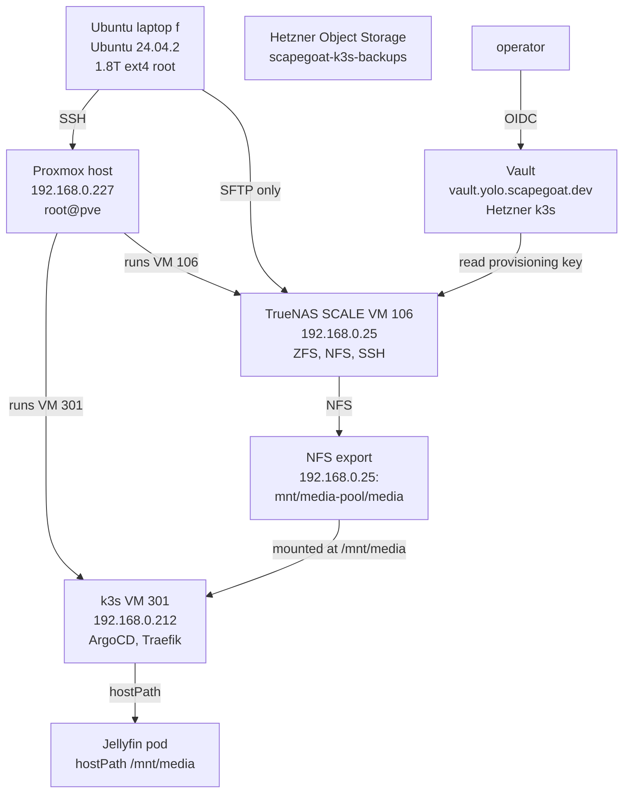

# Backup Architecture: TrueNAS with Vault Credentials

This article documents the design and partial implementation of a backup system for an Ubuntu laptop backing up to a TrueNAS instance running inside a Proxmox homelab. It covers the architectural decisions that shaped the system, the security problems with the initial credential setup, the Vault-backed solution for administrative access, and the concrete implementation state.

The work originated from a single user request: "I want to set up proper backup from this computer to it." The answer turned out to require understanding four separate things — the laptop's actual data footprint, the TrueNAS environment's existing responsibilities, the failure mode that had already occurred once in the same hardware stack, and the credential management model that makes the whole system sustainable.

The design keeps two concerns separate: Vault controls the high-power TrueNAS API key used for provisioning (creating datasets, managing users), while the nightly restic backup itself uses a restricted SFTP user with no Vault dependency. This split means the backups continue working even if Vault is down.

> [!summary]
> - The laptop has 1.7T of data on a 1.8T disk, 95% full, with `/home/manuel/code` at 189G and `.cache` at 188G — backup scope and excludes matter critically.
> - The backup path is SFTP-only with a mandatory preflight: if SFTP fails, the backup stops. No NFS fallback exists. This decision came from a prior Jellyfin outage where a missing NFS mount was silently replaced by an empty local directory.
> - `/root/.truenas_api_key` on Proxmox is a plaintext high-power credential. Vault `vault.yolo.scapegoat.dev` replaces it as the control plane for TrueNAS provisioning credentials.
> - Restic runs as user `manuel`, not root. Configuration lives in `~/.config/restic/crib/`, scripts in `~/.local/bin/`, scheduling via `systemd --user`.
> - Vault stores the TrueNAS API key at `kv/infra/truenas/provisioning`. The policy scope is read-only to that single path. Nightly backups never read from Vault.

## Why This Architecture Exists

The first problem to solve was not the backup transport. It was understanding what "proper backup" meant in this specific environment. The laptop has 1.7T of used data, but much of that is caches and build artifacts that are cheap to regenerate. A naive full backup would consume terabytes per run and fill the target storage quickly. The exclude strategy for what gets backed up is part of the architecture, not an afterthought.

The second problem was the destination environment. TrueNAS at `192.168.0.25` is not a clean empty box. It already runs Jellyfin, which consumes a 3.6T NFS export at `/mnt/media-pool/media`. Using that export for laptop backups would couple the backup path to the media path — a backup failure could interfere with Jellyfin, and vice versa. The architecture required a separate dataset from the start.

The third problem was the failure mode. In May 2026, a power outage took down TrueNAS but the k3s node at `192.168.0.212` came back up and mounted an empty local directory at `/mnt/media` instead of the TrueNAS NFS export. Jellyfin served a library whose database paths pointed at files that were not present. This is the failure mode that shaped the entire backup design.

The critical insight from that incident: **a directory existing is not the same as the intended backing filesystem being mounted**. Any backup transport that relies on a mountpoint can suffer the same silent failure if the script does not verify the backing filesystem before writing. The design choice was to avoid the mountpoint problem entirely by using SFTP directly.

## The Environment

### Laptop `f`

```text
hostname: f
OS: Ubuntu 24.04.2 LTS
model: Framework Laptop
kernel: Linux 6.8.0-124-generic
root: encrypted LUKS -> LVM -> ext4
root filesystem: 1.8T total, 1.7T used, 101G free, 95% used
```

Largest directories under `/home/manuel`:

| Directory | Size | Category | Backup-worthy? |
|-----------|------|----------|----------------|
| `/home/manuel/code` | 189G | source trees, workspaces | yes |
| `/home/manuel/.cache` | 188G | caches, regenerable | no (exclude) |
| `/home/manuel/Downloads` | 99G | user downloads | conditional |
| `/home/manuel/workspaces` | 91G | active projects | yes |
| `/home/manuel/.local` | 62G | local data + caches | review |
| `/home/manuel/.config` | 31G | config + caches | review |
| `/home/manuel/.private` | 17G | sensitive personal | yes |
| `/home/manuel/.ssh` | small | keys, auth | yes (encrypted by restic) |

The exclude list is in `~/.config/restic/crib/excludes` and covers caches, build outputs, node_modules, .venv, .terraform/providers, __pycache__, browser caches, and other regenerable material. The backup runs `--one-file-system` and targets `/home/manuel` with this exclude set. This keeps the initial backup manageable while preserving the important user data.

### Homelab topology



TrueNAS VM `106` has 16GB RAM, 4 cores, starts before k3s (startup order 10 vs 20), and exports `/mnt/media-pool/media` to `192.168.0.0/24` over NFS. Proxmox VM `301` at `192.168.0.212` runs k3s with ArgoCD and Traefik, reachable over Tailscale at `100.67.90.12`.

The Vault instance runs on a separate cluster — the Hetzner k3s at `vault.yolo.scapegoat.dev` — deployed via ArgoCD from `/home/manuel/code/wesen/2026-03-27--hetzner-k3s/gitops/applications/vault.yaml`. It uses AWS KMS for auto-unseal, integrated raft for storage, and OIDC via Keycloak for operator authentication.

### The prior failure mode

The Jellyfin/TrueNAS outage of May 2026 is documented at `/home/manuel/code/wesen/go-go-golems/go-go-parc/Projects/2026/05/03/ARTICLE - Postmortem - Jellyfin TrueNAS NFS Power Outage.md`. The sequence was:

1. Power outage hits the network.
2. Proxmox reboots. k3s VM `301` restarts (onboot=1, startup order 20), TrueNAS VM `106` does not (onboot was not yet configured).
3. k3s comes up. `/mnt/media` is an ordinary empty directory on the k3s root disk, not a mounted NFS export.
4. Jellyfin pod starts, mounts the hostPath `/mnt/media`, serves an empty library.
5. FFmpeg transcode logs show `Error opening input: No such file or directory`.

The fix that was applied:

```bash
# TrueNAS now starts before k3s
ssh root@192.168.0.227 '
  qm set 106 --onboot 1 --startup order=10,up=120
  qm set 301 --onboot 1 --startup order=20,up=30
'

# k3s node has persistent NFS mount
grep -v "192.168.0.25:/mnt/media-pool/media" /etc/fstab > /tmp/fstab.new
printf "%s\n" "192.168.0.25:/mnt/media-pool/media /mnt/media nfs4 defaults,_netdev,nofail,x-systemd.automount,x-systemd.requires=network-online.target 0 0" >> /tmp/fstab.new
cat /tmp/fstab.new > /etc/fstab
```

This incident is directly relevant to the backup design. It demonstrates the class of failure that occurs when a system assumes a directory implies a healthy backing filesystem. The backup solution avoids this by using SFTP (no mountpoint) and a mandatory preflight check (no silent fallback).

## Transport: SFTP-Only, No Fallback

The choice of SFTP over NFS for the backup transport was not arbitrary. NFS has advantages — it is fast, widely available, and mounts are transparent. But NFS carries a risk that is unacceptable for backup automation: **a mountpoint can exist without the intended backing filesystem**.

When you mount NFS to `/mnt/backups`, the kernel creates a directory. If the NFS server is down, that directory is still there. It is still empty. A backup script that writes to it will succeed — the writes go nowhere meaningful. The script has no way to know that it is writing to a stale directory rather than the intended NAS.

SFTP has no such ambiguity. The connection either succeeds or fails. If the SSH/SFTP connection to `backup-f@192.168.0.25` fails, the preflight script exits with a non-zero code and the backup does not run. This is the correct behavior: a failed backup run generates a log entry and an alert, while a successful backup to an empty local directory generates neither.

The preflight check in the backup script:

```bash
preflight() {
  command -v restic >/dev/null
  test -r "$RESTIC_PASSWORD_FILE"
  test -r "$RESTIC_EXCLUDE_FILE"
  ssh -i "${HOME}/.ssh/id_restic_crib_f" \
    -o BatchMode=yes \
    -o ConnectTimeout=10 \
    backup-f@192.168.0.25 \
    'test -d /mnt/backups-pool/laptops/f-restic'
}
```

If any of these checks fail, the function exits non-zero and the backup stops. There is no fallback path. This is by design.

The same preflight is used by the Vault smoke-test script (`scripts/06-truenas-vault-smoke.sh`), which verifies TrueNAS system info, the backup dataset, and the `backup-f` user state using the Vault-stored API key. The smoke test is read-only: it queries TrueNAS, it does not mutate anything.

## Restic: Why This Tool

Restic was chosen over `rsync`, `borg`, `kopia`, `rustic`, and `zfs send/receive` for the phase-1 backup. The decision record:

- **rsync** copies files but provides no deduplication, no versioned snapshots, no encryption, no retention policy. It is a transfer tool, not a backup system.
- **borg** is excellent over SSH with strong deduplication and compression, but the restic SFTP backend provides similar transport with a wider range of backend options (SFTP, REST, S3) that will be useful for the phase-2 off-site copy.
- **kopia** has a web UI and good features, but it is not installed and adds operational surface. It would be a later consideration.
- **zfs send/receive** requires the source to be ZFS. The laptop source filesystem is ext4 over LUKS/LVM, so this is not applicable.
- **Proxmox Backup Server** is designed for VM/container backup, not for arbitrary laptop home directories.

Restic provides the five properties needed:

1. Client-side encryption by default (key stored on the laptop).
2. Deduplication and compression (repeated runs are cheap).
3. Incremental snapshots (retention policy via `restic forget`).
4. SFTP backend (no mountpoint ambiguity).
5. Simple restore commands (`restic restore latest --target /tmp/test`).

The restic repository password is stored in `~/.config/restic/crib/password` with mode `0600`. It is a user-owned secret, not a system-owned one. This is consistent with the overall design: no root ownership for the backup client.

## Credential Security

### The problem: `/root/.truenas_api_key`

TrueNAS uses API keys for programmatic access. The key currently lives on the Proxmox host:

```text
/root/.truenas_api_key   (mode 0600, owned by root)
```

This file is readable by `root@pve` and anyone with `sudo`. It is used to create TrueNAS datasets and query system state. The concern is not its current protection level — `0600` on root is adequate against lateral movement from other users — but its role as a high-power credential in a location where it can be read by anyone who compromises Proxmox root.

The key has these properties:

- It is plaintext on disk.
- It is not scoped to a single operation (it is a general API key).
- It is not audited at the key level (you cannot tell which script read it).
- If Proxmox root is compromised, TrueNAS is compromised.

### The solution: Vault KV secret

The Vault instance at `vault.yolo.scapegoat.dev` stores the TrueNAS API key at:

```text
kv/infra/truenas/provisioning
  api_url: "https://192.168.0.25"
  api_key: "<the key>"
  purpose: "CRIB-BACKUP-01 TrueNAS provisioning"
  owner: "manuel"
  rotation_note: "Rotate after removing /root/.truenas_api_key from Proxmox"
```

Access to this secret is controlled by a Vault policy:

```hcl
path "kv/data/infra/truenas/provisioning" {
  capabilities = ["read"]
}
```

The operator authenticates to Vault with OIDC:

```bash
export VAULT_ADDR=https://vault.yolo.scapegoat.dev
vault login -method=oidc role=operators
```

The OIDC login produces a short-lived Vault token. The script reads the TrueNAS API key from Vault, uses it, and the token expires. This is different from `/root/.truenas_api_key` which is a long-lived credential that sits on disk forever.

### Migration procedure

```bash
# Log in to Vault
export VAULT_ADDR=https://vault.yolo.scapegoat.dev
vault login -method=oidc role=operators

# Read the key from Proxmox into a shell variable (never echo it)
read -r truenas_api_key < <(ssh root@192.168.0.227 'cat /root/.truenas_api_key')

# Store it in Vault
vault kv put kv/infra/truenas/provisioning \
  api_url="https://192.168.0.25" \
  api_key="${truenas_api_key}" \
  purpose="CRIB-BACKUP-01 TrueNAS provisioning" \
  owner="manuel"

# Clear the shell variable
unset truenas_api_key
```

After migration, the Proxmox plaintext key should either be rotated (a new TrueNAS API key is created and Vault is updated) or deleted:

```bash
ssh root@192.168.0.227 'shred -u /root/.truenas_api_key'
```

### Access tiers

The design establishes three access tiers:

| Use case | Auth method | Vault dependency |
|----------|-------------|-----------------|
| Operator provisioning | `vault login -method=oidc role=operators` | required |
| Nightly restic backup | SFTP `backup-f` | none |
| Headless automation | AppRole (future) | required |

Nightly backups are intentionally independent of Vault. If Vault is down for maintenance, the backups still run. If the SFTP connection to TrueNAS is down, the backups fail closed with a log entry. This is the desired behavior.

### The smoke test

The smoke-test script at `scripts/06-truenas-vault-smoke.sh` verifies that the Vault-stored TrueNAS API key works without mutating any TrueNAS state:

```bash
#!/usr/bin/env bash
set -euo pipefail

export VAULT_ADDR=https://vault.yolo.scapegoat.dev
vault login -method=oidc role=operators

./ttmp/2026/06/06/CRIB-BACKUP-01--ubuntu-to-proxmox-truenas-backup-design/scripts/06-truenas-vault-smoke.sh
```

The script performs these reads:

1. Read `api_url` and `api_key` from `kv/infra/truenas/provisioning`.
2. Call `GET /api/v2.0/system/info` to verify TrueNAS responds.
3. Call `GET /api/v2.0/pool/dataset/id/media-pool%2Fbackups%2Flaptops%2Ff-restic` to verify the backup dataset exists.
4. Call `GET /api/v2.0/user?username=backup-f` to check if the SFTP user exists.

Expected output after migration:

```text
TrueNAS API URL: https://192.168.0.25
Vault path: kv/infra/truenas/provisioning

-- system info --
{"version":"25.04.2","hostname":"truenas","system_product":"TRUENAS SCALE"}

-- backup dataset --
{"id":"media-pool/backups/laptops/f-restic","name":"f-restic","mountpoint":"/mnt/media-pool/backups/laptops/f-restic","type":"FILESYSTEM"}

-- backup user --
[]
```

The empty `backup-f` user array means the dataset exists but the SFTP user has not yet been created. This is the expected intermediate state.

## Implementation State

### What is done

The laptop-side restic client is fully configured:

- `restic 0.16.4` is installed.
- `~/.config/restic/crib/env` — restic environment (repository path, password file, cache, excludes, SFTP command).
- `~/.config/restic/crib/password` — empty, mode `0600`, needs filling before `restic init`.
- `~/.config/restic/crib/excludes` — exclude list (caches, node_modules, build outputs, etc.).
- `~/.local/bin/restic-crib-backup` — backup script with preflight, backup, retention, and check functions.
- `~/.config/systemd/user/restic-crib-backup.service` — user service, currently disabled.
- `~/.config/systemd/user/restic-crib-backup.timer` — user timer, currently disabled.
- `~/.ssh/id_restic_crib_f` — dedicated ED25519 SSH key for TrueNAS SFTP access.

Public key for TrueNAS:

```text
ssh-ed25519 AAAAC3NzaC1lZDI1NTE5AAAAIGTzNDipozrr877v8vdicRrvAP3h19lcctfp+f6vaklb restic backup from laptop f to TrueNAS
```

TrueNAS-side datasets exist:

```text
media-pool/backups
media-pool/backups/laptops
media-pool/backups/laptops/f-restic
```

TrueNAS Vault provisioning key is stored at `kv/infra/truenas/provisioning`.

### What is not done

- The `backup-f` TrueNAS user has not been created. This is the blocking dependency for restic repository initialization.
- The restic repository password has not been set in `~/.config/restic/crib/password`.
- `restic init` has not been run.
- The systemd timer is not enabled.
- `/root/.truenas_api_key` has not been rotated or deleted from Proxmox.

### Next steps

1. Create the `backup-f` TrueNAS user via the TrueNAS UI or API.
2. Add the SSH public key from laptop `f` to the `backup-f` user.
3. Verify SFTP access:

```bash
ssh -i ~/.ssh/id_restic_crib_f \
  -o BatchMode=yes \
  -o ConnectTimeout=10 \
  backup-f@192.168.0.25 \
  'test -d /mnt/media-pool/backups/laptops/f-restic && pwd && id'
```

4. Fill `~/.config/restic/crib/password` with the repository encryption key.
5. Initialize the restic repository:

```bash
set -a; source ~/.config/restic/crib/env; set +a
restic init
```

6. Run the first manual backup.
7. Perform a restore test.
8. Enable the user timer: `systemctl --user enable --now restic-crib-backup.timer`.
9. Rotate/delete `/root/.truenas_api_key` from Proxmox.

### Current status

```text
┌─────────────────────────────────────────────────┐
│  Laptop `f` — restic client configured          │
│  • restic installed                              │
│  • scripts in ~/.local/bin                       │
│  • config in ~/.config/restic/crib               │
│  • systemd --user timer installed, disabled      │
│  • SSH key generated: id_restic_crib_f           │
│  • password file: empty                          │
│                                                 │
│  TrueNAS — dataset created, user missing         │
│  • media-pool/backups/laptops/f-restic exists    │
│  • backup-f user: NOT CREATED                    │
│                                                 │
│  Vault — provisioning key stored                 │
│  • kv/infra/truenas/provisioning ✓              │
│  • OIDC operator access confirmed               │
│  • smoke test script: read-only ✓               │
│                                                 │
│  Blocking dependency: TrueNAS backup-f user       │
└─────────────────────────────────────────────────┘
```

## Working Rules

These rules govern the backup architecture and have been validated by the prior Jellyfin incident:

- **SFTP only.** No NFS fallback exists. If the SFTP preflight fails, the backup stops. A failed run is a log entry and an alert. A successful backup to the wrong place is a data integrity failure. Choose failure over silent corruption.
- **User-owned client.** The backup runs as user `manuel`. No root-owned scripts, no `/etc` configuration, no system-level systemd units. This limits the blast radius of backup script bugs and simplifies credential management.
- **Vault for provisioning, not for runtime backups.** The TrueNAS API key lives in Vault for administrative access. The nightly restic backup does not read from Vault. This means backups work when Vault is down and Vault is not a single point of failure for data safety.
- **Exclude before backup.** The laptop is 95% full. The exclude list prevents backing up regenerable caches and build outputs. The first backup run is the most expensive — subsequent runs are cheap due to deduplication.
- **Test restores quarterly.** A backup that cannot be restored is not a backup. The restore test should cover user data, `.ssh` metadata (to verify permission preservation), and an older file version.
- **Never commit secrets.** The restic password file, SSH private keys, Vault tokens, and the TrueNAS API key are never committed. They live in user-owned files, the password manager, or Vault.

## Pseudocode: The Backup Run

The complete backup run follows this sequence:

```
1. systemd --user timer fires
2. restic-crib-backup script starts
3. Preload environment: ~/.config/restic/crib/env
4. Preflight:
   a. restic binary exists
   b. password file is readable
   c. exclude file is readable
   d. SSH to backup-f@192.168.0.25 succeeds
      → test -d /mnt/backups-pool/laptops/f-restic
      → FAIL HERE: stop, do not continue
   e. All checks pass: proceed
5. restic backup /home/manuel --one-file-system --exclude-file excludes --tag laptop-f
6. restic forget --keep-hourly 24 --keep-daily 14 --keep-weekly 8 --keep-monthly 24 --prune
7. restic check --read-data-subset=5%
8. Log: "backup complete"
```

Step 4e is the critical gate. If it fails, steps 5-8 never execute. The backup is cleanly skipped rather than running to a wrong destination.

## Related Notes

- [[ARTICLE - Postmortem - Jellyfin TrueNAS NFS Power Outage]] — the incident that shaped the SFTP-only, no-fallback design.
- [[PROJ - ZK Tool]] — vault note structure exemplar.
- `/home/manuel/code/wesen/claw-stuff/ttmp/2026/06/06/CRIB-BACKUP-01--ubuntu-to-proxmox-truenas-backup-design/` — CRIB-BACKUP-01 ticket with full design docs, scripts, and diary.
- `/home/manuel/code/wesen/2026-03-27--hetzner-k3s/gitops/applications/vault.yaml` — live Vault deployment manifest.
- `/home/manuel/code/wesen/2026-03-27--hetzner-k3s/scripts/validate-vault-oidc-config.sh` — OIDC config validation.
- `/home/manuel/code/wesen/go-go-golems/go-go-parc/Projects/2026/04/02/ARTICLE - Playbook - Self-Contained Go Wasm and JavaScript Browser Applications.md` — vault ARTICLE style exemplar.
