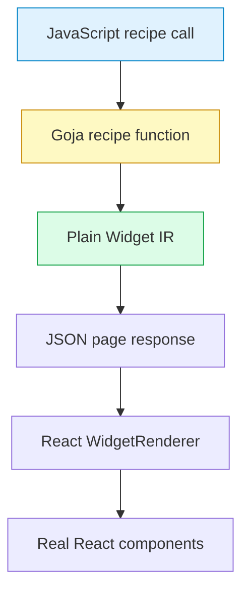
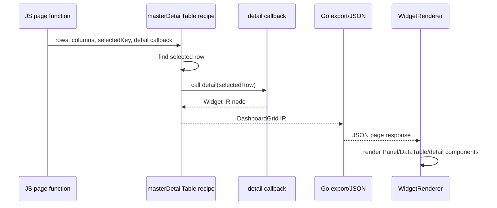

# From Boilerplate to Recipes: Building Higher-Level Widgets on Top of Widget IR

This article explains why the Widget DSL grew a recipe layer and how that layer works. The immediate project is the RAG evaluation system, but the pattern is more general: once a UI can be represented as JSON-compatible Widget IR, low-level component constructors are only the first step. They make the system programmable. Recipes make it usable.

> [!summary]
> - Widget IR is the stable data representation. It describes text nodes, element nodes, component nodes, props, children, table cells, and actions.
> - Low-level DSL helpers such as `rag.panel(...)` and `rag.dataTable(...)` are necessary, but they still ask authors to assemble full UI layouts by hand.
> - Recipes are JSON-compatible macros over Widget IR. They expand common RAG page intentions such as metrics, action toolbars, and master/detail tables into known-good component compositions.
> - The difficult parts are not the visible layouts. The difficult parts are boundary normalization: JavaScript arrays, Go-backed database slices, Goja callback functions, action shorthands, and JSON serialization.

## Why this note exists

The Widget DSL started with a precise constraint: JavaScript authors should be able to describe a React UI without importing React. A script should return data, Go should validate and serve that data, and the browser should render it using the real React component library. That constraint produced Widget IR, a small intermediate representation with text, element, and component nodes.

That first layer solved the rendering boundary. It did not solve the authoring boundary. A script author could write `rag.panel`, `rag.stack`, `rag.dashboardGrid`, `rag.dataTable`, `rag.metadataGrid`, `rag.inline`, `rag.button`, and `rag.caption`, but a useful page still required many nested calls. The author had to know which layout component to use, which density to apply, where captions should go, how a table and detail panel should be arranged, and how row selection should be represented as an action.

The recipe layer answers a different question: what are the common page shapes, and how can the DSL provide them without hiding the underlying IR? The answer in this project is not a separate renderer and not a new schema. A recipe is a function that expands higher-level intent into ordinary Widget IR.

## The foundation: Widget IR is data, not React

The TypeScript IR lives in `packages/rag-evaluation-site/src/widgets/ir.ts`. Its core definition is deliberately small:

```ts
export type WidgetNode = TextNode | ElementNode | ComponentNode;

export interface TextNode {
  kind: 'text';
  text: string;
}

export interface ElementNode {
  kind: 'element';
  tag: string;
  attrs?: JsonObject;
  children?: WidgetNode[];
}

export interface ComponentNode {
  kind: 'component';
  type: RagWidgetType | string;
  props?: WidgetProps;
  children?: WidgetNode[];
}
```

A component node is not a DOM node. It is a request to render a named React component. When the browser receives `{ kind: "component", type: "Panel" }`, the renderer does not emit generic HTML that happens to resemble a panel. It calls the React `Panel` component.

The renderer in `packages/rag-evaluation-site/src/widgets/WidgetRenderer.tsx` is correspondingly direct:

```tsx
function renderWidgetNode(node: WidgetNode, onAction?: WidgetActionHandler): ReactNode {
  if (node.kind === 'text') return node.text;
  if (node.kind === 'element') return renderElementNode(node, onAction);
  return renderComponentNode(node, onAction);
}
```

Component dispatch then maps names to real components:

```tsx
switch (node.type) {
  case 'Panel':
    return renderPanel(node, onAction);
  case 'DataTable':
    return renderDataTable(node, onAction);
  case 'StatusText':
    return renderStatusText(node, onAction);
  default:
    return <ErrorCallout>Unknown widget: {node.type}</ErrorCallout>;
}
```

This is the first invariant to keep in mind: recipes do not change the rendering model. They only produce more IR.

## Low-level helpers are necessary but insufficient

The Goja module lives in `pkg/widgetdsl/module.go`. It registers `widget.dsl` and `rag.dsl`, then exports constructors such as `text`, `element`, `component`, `panel`, `stack`, `dataTable`, `metadataGrid`, and `button`. Each helper returns ordinary maps that match Widget IR.

A low-level page can be written like this:

```js
const rag = require("widget.dsl")

return rag.panel({ title: "Demo", density: "condensed" },
  rag.stack({ gap: "sm" }, [
    rag.caption({ tone: "success" }, "Ready"),
    rag.button({ variant: "primary" }, "Run")
  ])
)
```

This is much better than hand-writing maps. The script is readable, the children are natural, and the result is still JSON-compatible. The corresponding test in `pkg/widgetdsl/module_test.go` verifies that this builds nested Widget IR with a `Panel` root and a `Stack` child.

The problem appears when a real page repeats the same structural pattern several times. A metrics section is not conceptually a `DashboardGrid` containing four condensed `Panel` components containing four `StatusText` components. It is a metrics section. An action area is not conceptually a `Panel` containing an `Inline` containing several `Button` nodes and possibly a `Caption`. It is a toolbar. A table with a detail panel is not conceptually a two-up grid with a `Panel/DataTable` pair and a second detail panel. It is a master/detail table.

The low-level vocabulary is still correct. It is simply too close to the renderer for frequent page-authoring tasks.

## Recipes are macros over Widget IR

A recipe is a function with three properties:

1. It accepts page-level intent as ordinary JavaScript data.
2. It expands that intent into ordinary Widget IR.
3. It does not create a new runtime object that React must understand.

The exported recipe surface is small:

```js
rag.recipes.metrics({ items })
rag.recipes.actionToolbar({ title, caption, actions })
rag.recipes.masterDetailTable({ rows, columns, selectedKey, onRowSelect, detail })
```

The implementation is installed beside the low-level helpers:

```go
recipes := r.vm.NewObject()
setExport(recipes, "metrics", r.metricsRecipe)
setExport(recipes, "actionToolbar", r.actionToolbarRecipe)
setExport(recipes, "masterDetailTable", r.masterDetailTableRecipe)
setExport(exports, "recipes", recipes)
```

The word "macro" is useful here in the precise programming sense. The recipe runs while the page is being constructed in Goja. The output of the recipe is a data structure. By the time the browser receives the page, there is no recipe left to execute. There are only `Panel`, `DashboardGrid`, `Button`, `DataTable`, and other known Widget IR nodes.



The rule is simple: recipes may improve authoring, but they must not complicate rendering.

## Recipe 1: metrics

A metrics section takes a list of facts and renders them with consistent layout. The authoring call is compact:

```js
rag.recipes.metrics({ items: [
  { label: "Total queries", value: c.total, status: "ready" },
  { label: "Succeeded", value: c.succeeded || 0, status: "succeeded" },
  { label: "Running", value: c.running || 0, status: "running" },
  { label: "Failed", value: c.failed || 0, status: "failed" }
]})
```

The implementation expands each item into a `Panel` containing a `StatusText`, then wraps the panels in a `DashboardGrid`:

```go
func (r *runtime) metricsRecipe(call goja.FunctionCall) goja.Value {
    options := firstObject(call.Arguments)
    items := anySlice(options["items"])
    children := []any{}

    for _, raw := range items {
        item, ok := raw.(map[string]any)
        if !ok {
            continue
        }
        label := stringFromMap(item, "label", "Metric")
        status := stringFromMap(item, "status", "ready")
        value := item["value"]

        children = append(children, map[string]any{
            "kind": "component",
            "type": "Panel",
            "props": map[string]any{"title": label, "density": "condensed"},
            "children": []any{map[string]any{
                "kind": "component",
                "type": "StatusText",
                "props": map[string]any{"status": status, "icon": true},
                "children": []any{map[string]any{"kind": "text", "text": fmt.Sprint(value)}},
            }},
        })
    }

    return r.vm.ToValue(map[string]any{
        "kind": "component",
        "type": "DashboardGrid",
        "props": map[string]any{"recipe": metricsRecipeName(len(children))},
        "children": children,
    })
}
```

The recipe does not need a new React component. The existing renderer already knows how to render `DashboardGrid`, `Panel`, and `StatusText`. The recipe chooses a consistent composition and a grid recipe based on count.

| Author intent | Expanded component structure |
|---|---|
| "Show four metrics." | `DashboardGrid(recipe: "four-up")` |
| "Each metric has a label." | `Panel(title: label, density: "condensed")` |
| "Each metric has a value and status." | `StatusText(status, icon: true)` with text child |

This is the first recurring pattern in recipe design: encode the stable layout decision once, and leave per-page data as input.

## Recipe 2: actionToolbar

Actions are another place where low-level Widget IR becomes repetitive. A page often needs a named control panel, a row of buttons, and a short caption explaining what those buttons do. The recipe call in the xgoja demo is:

```js
rag.recipes.actionToolbar({
  title: "Queue controls",
  caption: "Actions mutate in-memory SQLite state and ask the React app to refresh.",
  actions: [
    { label: "Add query", variant: "primary", action: "add-query", payload: { owner: "research" } },
    { label: "Retry failed", action: "bulk-retry-failed" },
    { label: "Reset demo", action: "reset-demo" }
  ]
})
```

The important detail is the action shorthand. The first action uses `action: "add-query"`. That is not a complete Widget IR action spec, but the recipe can normalize it into one:

```json
{ "kind": "server", "name": "add-query", "payload": { "owner": "research" } }
```

The implementation calls `normalizeActionSpec`:

```go
func normalizeActionSpec(action any, name any, payload any) (map[string]any, bool) {
    if spec, ok := action.(map[string]any); ok {
        if kind, _ := spec["kind"].(string); kind != "" {
            return spec, true
        }
    }
    if actionName, ok := action.(string); ok && strings.TrimSpace(actionName) != "" {
        out := map[string]any{"kind": "server", "name": actionName}
        if payload != nil {
            out["payload"] = payload
        }
        return out, true
    }
    if actionName, ok := name.(string); ok && strings.TrimSpace(actionName) != "" {
        out := map[string]any{"kind": "server", "name": actionName}
        if payload != nil {
            out["payload"] = payload
        }
        return out, true
    }
    return nil, false
}
```

This is a good example of a recipe doing authoring work without weakening the boundary. React still receives a full serializable action spec. The shortcut exists only while the script is building the page.

The resulting IR shape is predictable:

```text
Panel(title: "Queue controls")
└── Inline(gap: "sm", wrap: true)
    ├── Button(action: { kind: "server", name: "add-query", ... })
    ├── Button(action: { kind: "server", name: "bulk-retry-failed" })
    ├── Button(action: { kind: "server", name: "reset-demo" })
    └── Caption(tone: "muted")
```

The recipe's job is not to hide actions. Its job is to make the common case short while preserving the explicit data shape that the renderer and server require.

## Recipe 3: masterDetailTable

The master/detail recipe is the most instructive one because it touches rows, columns, selected state, row-selection actions, and a detail callback. Its use in the xgoja demo is concise:

```js
rag.recipes.masterDetailTable({
  title: "Query queue",
  rows,
  columns: queryColumns(),
  selectedKey: appState.selectedId,
  onRowSelect: "select-query",
  detail: () => selectedPanel(selected)
})
```

The table side is straightforward. The recipe builds a `Panel` with a `DataTable` child:

```go
tableProps := map[string]any{
    "rows":         rows,
    "getRowKey":    valueOrDefault(options["getRowKey"], "id"),
    "columns":      anySlice(options["columns"]),
    "selectedKey":  selectedKey,
    "emptyMessage": valueOrDefault(options["emptyMessage"], "No rows"),
}
if act, ok := normalizeActionSpec(options["onRowSelect"], nil, nil); ok {
    tableProps["onRowSelect"] = act
}
```

The layout side is also straightforward. The recipe returns a two-up `DashboardGrid` containing the table panel and a detail node:

```go
return r.vm.ToValue(map[string]any{
    "kind": "component",
    "type": "DashboardGrid",
    "props": map[string]any{"recipe": "two-up"},
    "children": []any{tablePanel, detailNode},
})
```

The detail side is where the boundary becomes interesting. The `detail` option may be a Widget IR node, or it may be a JavaScript function. If it is a function, the function is called while Goja is constructing the page. It receives the selected row and returns a Widget IR node. The returned node is exported to Go and becomes ordinary JSON-compatible data.

```go
func (r *runtime) detailNode(options map[string]any, row any) any {
    if detailFn, ok := goja.AssertFunction(r.vm.ToValue(options["detail"])); ok {
        value, err := detailFn(goja.Undefined(), r.vm.ToValue(row))
        if err != nil {
            panic(err)
        }
        if exported, ok := value.Export().(map[string]any); ok && isWidgetNodeExport(exported) {
            return exported
        }
    }
    if fallback, ok := options["detail"].(map[string]any); ok && isWidgetNodeExport(fallback) {
        return fallback
    }
    return defaultDetailPanel
}
```

This distinction matters. React never receives a function. The callback is not a client-side renderer callback. It is a server-side page-construction callback that returns Widget IR before serialization.



The recipe therefore gives the author a callback where it is safe: during page construction. It removes the callback before the browser boundary.

## The page helper ties recipes together

A page is more than a root node. It has an id, a title, a schema version, optional metadata, and a root. The DSL exposes `rag.page(...)` so authors can produce a full page response without manually assembling the envelope:

```js
return rag.page({
  schemaVersion: "0.1.0",
  id,
  title: "xgoja widget actions demo",
  sections: [
    rag.panel({ title: "xgoja widget actions demo" }, ...),
    pageSummary(id),
    toolbar(),
    rag.recipes.masterDetailTable(...),
    auditPanel()
  ]
})
```

The implementation accepts either an explicit `root` or an array of `sections`. If `root` is present and already looks like Widget IR, it becomes the page root. Otherwise, the sections are wrapped in a `Stack`:

```go
if root, ok := options["root"].(map[string]any); ok && isWidgetNodeExport(root) {
    out["root"] = root
    return r.vm.ToValue(out)
}

sections := anySlice(options["sections"])
children := []any{}
for _, section := range sections {
    if node, ok := section.(map[string]any); ok && isWidgetNodeExport(node) {
        children = append(children, node)
    }
}

out["root"] = map[string]any{
    "kind": "component",
    "type": "Stack",
    "props": map[string]any{"gap": "lg"},
    "children": children,
}
```

This is another authoring improvement that does not change the renderer. The page helper standardizes the response envelope and gives the standalone app metadata such as `meta.shell` and `meta.maxWidth` when needed.

## The showcase page as a complete example

The best current example is `examples/xgoja/widget-site/verbs/sites.js`. It is a JavaScript verb that uses Express, embedded assets, database access, and `widget.dsl` in one generated xgoja binary.

The page has four sections:

| Section | DSL expression | Rendered purpose |
|---|---|---|
| Summary panel | `rag.panel(...)` | Introduces the page and shows row count. |
| Metrics row | `rag.recipes.metrics(...)` | Shows total, succeeded, running, and failed query counts. |
| Toolbar | `rag.recipes.actionToolbar(...)` | Exposes add, retry, and reset actions. |
| Queue area | `rag.recipes.masterDetailTable(...)` | Shows a query table and selected-query detail panel. |
| Audit panel | `rag.panel(...)` + `rag.stack(...)` | Shows recent action history. |

The page is dynamic. It keeps server-side JavaScript state:

```js
const appState = { selectedId: 1, audit: ["Demo initialized"] }
```

It reads rows from SQLite:

```js
function allRows() {
  return db.query("SELECT id, name, status, priority, owner, notes FROM queries ORDER BY priority DESC, id ASC")
}
```

It exposes action endpoints:

```js
app.post("/api/widget/actions/add-query", (req, res) => {
  const owner = String(payload(req).owner || "research")
  const next = db.query("SELECT COALESCE(MAX(id), 0) + 1 AS id FROM queries")[0].id
  db.exec("INSERT INTO queries (name, status, priority, owner, notes) VALUES (?, ?, ?, ?, ?)",
    "Follow-up Query " + next, "pending", 1, owner, "Created by a Widget IR action")
  appState.selectedId = Number(next)
  res.json(actionResult("Added query #" + next))
})
```

The React app receives server action results with `{ refresh: true }`, fetches the page again, and renders the updated Widget IR. The page author does not write React state management code. The server-side script owns the data and returns a fresh page description after mutation.

This is the practical endpoint of the recipe layer: a 221-line JavaScript site can define a stateful action dashboard with a real component library, real table selection, real buttons, real metadata panels, and real refresh behavior.

## Serialization is the real constraint

Every useful DSL feature must eventually answer one question: what crosses the boundary?

The Widget IR boundary permits JSON-compatible data. It does not permit React components, closures, class instances, DOM nodes, or Go runtime handles. That constraint affects table cells, actions, renderable values, and recipes.

Table cells are a clear example. A React table column usually accepts a function such as `cell: row => ...`. That cannot cross JSON. The Widget IR uses serializable cell specifications instead:

```ts
export type CellSpec =
  | FieldCellSpec
  | NumberCellSpec
  | StatusCellSpec
  | CaptionCellSpec
  | TemplateCellSpec
  | LinkCellSpec
  | ConstantCellSpec;
```

The script writes:

```js
{ id: "status", header: "Status", cell: rag.cell.status("status", { icon: true }) }
```

React receives:

```json
{ "kind": "status", "field": "status", "icon": true }
```

The renderer turns that spec into a real `StatusText` cell. The same principle applies to actions. A button does not receive a JavaScript function. It receives an action spec:

```json
{ "kind": "server", "name": "add-query", "payload": { "owner": "research" } }
```

The renderer binds that data to a click handler, and the default app posts to `/api/widget/actions/add-query`. The function lives on the server. The browser receives only a serializable reference to it.

## Boundary normalization: where bugs appeared

The recipe code is short, but the supporting normalization code is important. The system must handle values produced by JavaScript and values produced by Go-backed host services.

A JavaScript array exported from Goja may be easy to treat as `[]any`. A database result coming from an xgoja host service may cross into the recipe as a typed Go slice. If the recipe only accepts `[]any`, it silently loses rows. The fix is reflection-based slice normalization:

```go
func anySlice(value any) []any {
    if value == nil {
        return []any{}
    }
    if out, ok := value.([]any); ok {
        return out
    }
    rv := reflect.ValueOf(value)
    if rv.Kind() != reflect.Slice && rv.Kind() != reflect.Array {
        return []any{}
    }
    out := make([]any, 0, rv.Len())
    for i := 0; i < rv.Len(); i++ {
        out = append(out, rv.Index(i).Interface())
    }
    return out
}
```

This function is not incidental utility code. It is part of the DSL contract. It says that recipe inputs may come from ordinary JavaScript arrays or Go-backed module results, and both should behave as sequence values.

A second normalization problem is distinguishing props from children. The low-level component call shape is:

```js
rag.panel(props?, ...children)
```

The first argument may be a props object, but it may also be a Widget IR node. The runtime decides by checking whether the object already looks like Widget IR:

```go
func propsAndChildStart(args []goja.Value, index int) (map[string]any, int) {
    if len(args) > index && isPlainObject(args[index]) && !looksLikeWidgetNodeExport(args[index]) {
        return exportObject(args[index]), index + 1
    }
    return map[string]any{}, index
}
```

This small rule keeps the JavaScript API ergonomic without making it ambiguous for the implementation.

## Testing the recipe contract

The recipe tests are useful because they test serialization, not just helper existence. `TestSemanticRecipesAndActionsAreJSONSerializable` constructs a full page using `rag.page`, `rag.recipes.metrics`, `rag.recipes.actionToolbar`, and `rag.recipes.masterDetailTable`, then calls `JSON.stringify(page)`.

The test page includes metadata, server-action shorthands, a master/detail callback, and table columns:

```js
const page = rag.page({
  id: "actions",
  title: "Actions",
  meta: { shell: "app", maxWidth: "wide" },
  sections: [
    rag.recipes.metrics({ items: [
      { label: "Total", value: rows.length, status: "ready" },
      { label: "Running", value: 1, status: "running" }
    ]}),
    rag.recipes.actionToolbar({ title: "Controls", actions: [
      { label: "Add", action: "add-query", variant: "primary", payload: { owner: "test" } },
      { label: "Reset", action: rag.action.server("reset-demo") }
    ]}),
    rag.recipes.masterDetailTable({
      title: "Rows",
      rows,
      columns: [{ id: "name", header: "Name", cell: rag.cell.field("name") }],
      selectedKey: 1,
      onRowSelect: "select-query",
      detail: row => rag.panel({ title: "Selected" }, row.name)
    })
  ]
});
JSON.stringify(page);
```

The assertion is not that the page looks right in a browser. That is handled by smoke tests elsewhere. The assertion here is more fundamental: after all recipe expansion, callback execution, action normalization, and child handling, the result is still JSON.

This is the right unit-test level for recipes. Recipes should be proven before HTTP and before React. If the data is not serializable at this layer, the browser cannot reliably render it later.

## A recipe should not become a hidden framework

There is a failure mode to avoid. A recipe layer can start small and then gradually become a second UI system with its own state model, renderer expectations, styling language, and implicit behavior. That would recreate the problem Widget IR was designed to avoid.

The safe boundary is this:

- A recipe may choose component composition.
- A recipe may normalize authoring shorthands into explicit IR.
- A recipe may evaluate a page-construction callback and export its returned IR.
- A recipe may choose defaults such as grid layout, density, and empty messages.
- A recipe should not require React to know a new component type unless that type is deliberately added to the renderer.
- A recipe should not pass closures, host objects, or mutable runtime values across the JSON boundary.

The current recipes respect that boundary. `metrics` returns `DashboardGrid`, `Panel`, and `StatusText`. `actionToolbar` returns `Panel`, `Inline`, `Button`, and `Caption`. `masterDetailTable` returns `DashboardGrid`, `Panel`, and `DataTable`. The renderer already knows these components.

## When to add a recipe

A recipe is worth adding when three conditions are true.

First, the composition appears in more than one page or is likely to appear repeatedly. Metrics, toolbars, and master/detail tables are common application shapes. A one-off arrangement should usually remain ordinary Widget IR.

Second, the composition has defaults that encode product judgment. For example, metrics should use condensed panels, action groups should wrap, table/detail layouts should use a two-up grid, and empty tables should say something useful. These defaults reduce authoring burden and make pages more consistent.

Third, the recipe can expand to existing Widget IR without introducing a hidden runtime. If the desired behavior requires a new React component, add the component deliberately and then expose it through IR. Do not smuggle component behavior through recipe conventions that the renderer cannot see.

| Add a recipe when... | Avoid a recipe when... |
|---|---|
| The same component composition appears repeatedly. | The layout is unique to one page. |
| The composition has safe, reusable defaults. | The defaults would surprise authors or hide important choices. |
| The output can be plain Widget IR. | The output needs non-serializable functions or runtime handles. |
| The recipe reduces authoring complexity. | The recipe merely renames a single existing component. |

## Recommended implementation sequence

The implementation sequence matters because it protects the boundary at each stage.

1. Define the low-level Widget IR first. The recipe layer needs a stable target representation.
2. Implement low-level component helpers before recipes. Authors need escape hatches when a recipe is not enough.
3. Add one recipe for a repeated page shape. Start with the most obvious boilerplate reduction.
4. Make the recipe return existing component nodes. Do not add renderer complexity prematurely.
5. Test `JSON.stringify(recipeOutput)` before browser testing. Serialization failures are cheaper to debug in Goja tests.
6. Add the recipe to a real example page. A recipe that never appears in a real script is probably not yet proven.
7. Smoke the full browser path after actions are involved. Action specs may serialize correctly but still fail when bound to UI events and server endpoints.

This sequence is visible in the current project. The low-level renderer existed first. The Goja helpers came next. The xgoja action demo proved the low-level model but became verbose. The recipe layer then reduced that verbosity without changing the renderer.

## Working rules

- Recipes are authoring macros over Widget IR, not renderer features by default.
- The browser receives data. It should not receive Goja callbacks or host-service values.
- Action shorthands are acceptable if they normalize to explicit `ActionSpec` objects before serialization.
- Table cell behavior should be represented with cell specs, not JavaScript functions.
- Recipe tests should prove JSON serialization and structural shape.
- Browser smoke should prove action binding, refresh behavior, and component rendering.
- If a recipe must accept rows, normalize both JavaScript arrays and Go-backed slices.
- If a recipe accepts callbacks, execute them during page construction and export their returned Widget IR immediately.

## What this unlocks

The recipe layer changes who can author useful pages. With only low-level helpers, the author needs to know the component library well. They need to choose layout primitives, spacing, density, and action structure. With recipes, the author can express page intent directly and still get real React components in the browser.

The important point is not that the DSL became shorter. It became more stable. Common page shapes now have one implementation. If the team later decides that metrics should use a different grid recipe, or toolbars should place captions elsewhere, that change can happen in one recipe instead of in every page script.

That is the value of building recipes on top of Widget IR. The IR remains the stable boundary. The renderer remains the single UI implementation. The recipes make the boundary pleasant enough for real authors to use.

## Related local resources

- `pkg/widgetdsl/module.go` contains the DSL helpers, recipes, action normalization, child export, and slice normalization.
- `pkg/widgetdsl/module_test.go` contains the recipe serialization test and the low-level helper tests.
- `examples/xgoja/widget-site/verbs/sites.js` contains the best current end-to-end example of recipes in a generated xgoja site.
- `packages/rag-evaluation-site/src/widgets/ir.ts` defines the TypeScript Widget IR contract.
- `packages/rag-evaluation-site/src/widgets/WidgetRenderer.tsx` maps Widget IR to real React components.
