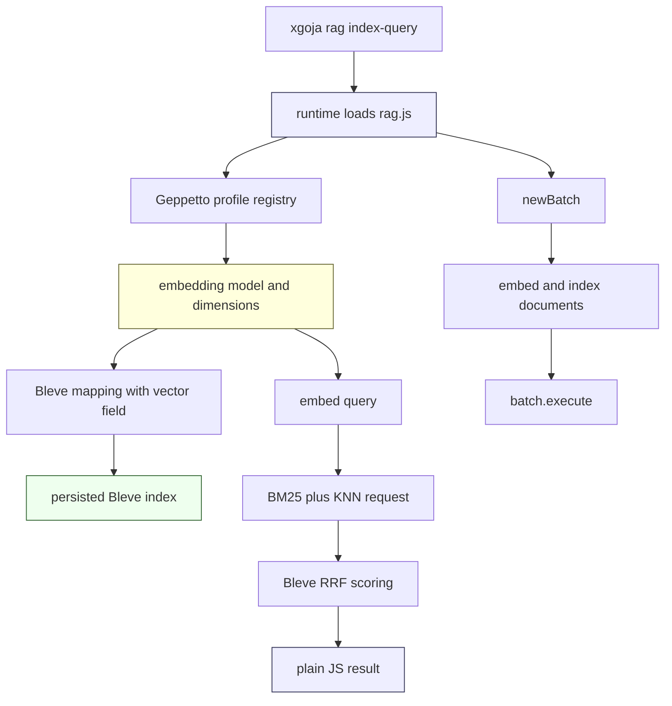
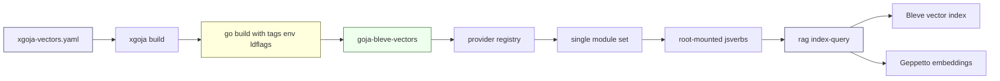

# Goja Bleve: Shipping a Vector RAG Runtime with xgoja

This is the generated-host and packaging branch of the [[goja-bleve]] project map.

The first goja-bleve report explained the core binding: JavaScript receives a fluent `require("bleve")` API, while mappings, indexes, queries, batches, KNN clauses, and search requests remain Go-backed values. This follow-up explains what happened after that point. The project moved from a complete native module to a generated xgoja runtime that can embed documents with Geppetto, index them into Bleve vector fields, run KNN or hybrid RRF search, survive review feedback, and document the FAISS build requirements precisely enough that the vector build can be reproduced.

The important change is not a new search primitive. The search primitives already existed by the end of the earlier article. The new work is about shipping conditions: generated host composition, build-time linker configuration, jsverb command shape, review hardening, CI constraints, and operational documentation. Those details decide whether the module is useful outside a direct Go unit test.

> [!summary]
> - goja-bleve now has a generated vector xgoja host that combines `bleve`, `geppetto`, core helpers, host filesystem access, and root-mounted jsverbs in one binary.
> - xgoja gained supporting build-system features that goja-bleve needed: `go.env` for CGO linker variables and jsverb field-name remapping so CLI flags can be idiomatic while JavaScript receives stable camelCase keys.
> - Code review identified three correctness bugs in the native binding: reopened vector indexes needed their stored mapping, `.size(0)` had to remain explicit, and batch wrappers must become single-use only after successful execution.
> - The FAISS setup is now captured as a local playbook and `make test-vectors`, because vector builds require `-tags=vectors`, `CGO_LDFLAGS`, and runtime library path handling together.

## The context: what existed before this round

By the end of the previous article, `goja-bleve` had the native module surface. A script could create a mapping, build an index, batch-index documents, construct a BM25 request, attach KNN clauses, select RRF or RSF, and execute the request through Bleve. The module also had TypeScript declaration snapshots, example scripts, and a quickstart.

That was enough to prove the API. It was not enough to ship the runtime shape we actually needed for RAG scripts. A real RAG script does not only call Bleve. It reads data, resolves an embedding profile, calls an embedding model, indexes text and vectors, and then queries the resulting index. The runtime therefore needed to compose several provider modules into one generated host:

```yaml
modules:
  - package: goja-bleve
    name: bleve
    as: bleve
  - package: geppetto
    name: geppetto
    as: geppetto
  - package: go-go-goja-core
    name: path
    as: path
  - package: go-go-goja-core
    name: yaml
    as: yaml
  - package: go-go-goja-host
    name: fs
    as: fs
    config:
      allow: true
```

That YAML fragment is from `cmd/goja-bleve/xgoja-vectors.yaml`. It tells xgoja which Go providers to compile into the generated binary and which JavaScript module names to expose. The goal is direct: a JavaScript verb should be able to write `require("bleve")`, `require("geppetto")`, and `require("fs")` in the same runtime.

The same spec also carries the vector build configuration:

```yaml
go:
  tags:
    - vectors
  ldflags:
    - -r
    - /usr/local/lib
  env:
    CGO_LDFLAGS: "-L/usr/local/lib -lfaiss_c -lfaiss -lstdc++ -lm"
```

This is the part that made go-go-goja work necessary. The earlier xgoja build spec supported tags and ldflags, but it did not support build-time environment variables. FAISS linking for Bleve vectors depends on `CGO_LDFLAGS`, so the vector host could not be fully described by `xgoja-vectors.yaml` until xgoja learned `go.env`.

## The generated RAG verb

The new user-facing tool lives in `cmd/goja-bleve/jsverbs/rag.js`. It exposes two verbs. The first is `plan`, which checks that the runtime wiring exists without contacting an embedding provider. The second is `indexQuery`, which resolves a Geppetto embedding profile, embeds documents, creates a Bleve vector index, indexes a batch, embeds the query, and searches with KNN or hybrid RRF.

The implementation is small enough to understand as a complete data path:

```javascript
function indexQuery(profilePath, query, docsJson, embeddingProfile, indexPath, mode, limit) {
  if (!bleve.vectorSupport) throw new Error("rag index-query requires a vector-enabled binary built with -tags=vectors");
  const docs = _parseDocs(docsJson);
  const { embedder, model } = _resolveEmbedder(profilePath, embeddingProfile || "assistant");
  const idx = _buildIndex(indexPath, model.dimensions);
  const batch = idx.newBatch();
  for (const doc of docs) {
    const vector = embedder.embed(doc.text);
    batch.index(doc.id, { text: doc.text, source: doc.source, embedding: vector });
  }
  batch.execute();

  const queryText = query || "privacy";
  const queryVector = embedder.embed(queryText);
  const requestBuilder = bleve.search()
    .query((mode || "hybrid") === "knn" ? bleve.matchNone() : bleve.match(queryText).field("text"))
    .knn("embedding", queryVector, Number(limit || 5), 1.0)
    .fields(["text", "source"])
    .size(Number(limit || 5));
  if ((mode || "hybrid") !== "knn") {
    requestBuilder.score("rrf").scoreRankConstant(60).scoreWindowSize(Math.max(Number(limit || 5), docs.length));
  }
  const result = idx.search(requestBuilder.build());
  const count = idx.docCount();
  idx.close();
  return { ok: true, query: queryText, mode: mode || "hybrid", model, docCount: count, hits: result.hits };
}
```

Several design decisions are visible in this function.

First, the function checks `bleve.vectorSupport` before doing any embedding work. That check keeps failure close to the cause: if the binary was not built with `-tags=vectors`, the command reports a build configuration error rather than failing later while constructing a vector field or KNN clause.

Second, the embedding model determines the vector dimensions. The index mapping is built from `model.dimensions`, not from a hard-coded number. This matters because Bleve vector field mappings require dimensions at mapping time. The script should not maintain a separate dimension constant that can drift from the selected embedding profile.

Third, ingestion uses `idx.newBatch()`. The previous article described batches as an ingestion convenience. The RAG verb is where that convenience becomes the normal indexing path: one command creates a batch, indexes every document, and executes the batch once.

Fourth, KNN-only mode and hybrid mode are the same request builder with one branch. KNN-only uses `matchNone()` and a KNN clause. Hybrid mode uses a text query, a KNN clause, and RRF parameters. The script does not implement RRF itself.



The verb is intentionally not a large RAG framework. It is a smokeable integration surface. It proves that the generated binary can compose providers, load JavaScript, call the embedding API, index vector fields, and return fused retrieval results.

## Why xgoja needed `go.env`

The vector build is a CGO build. Bleve imports `github.com/blevesearch/go-faiss` under the `vectors` tag, and go-faiss calls the FAISS C API. On the local machine, `libfaiss_c.so` does not by itself resolve all C++ FAISS symbols. The final Go link must also include `libfaiss.so` and the C++ runtime libraries:

```bash
CGO_LDFLAGS="-L/usr/local/lib -lfaiss_c -lfaiss -lstdc++ -lm"
```

Before the xgoja change, a generated vector binary could declare tags and rpath, but not the CGO linker environment. The build spec could say this:

```yaml
go:
  tags:
    - vectors
  ldflags:
    - -r
    - /usr/local/lib
```

That was incomplete. A developer still had to remember to export `CGO_LDFLAGS` in the shell before running xgoja. A build spec that depends on ambient shell state is not a reproducible build spec.

The go-go-goja fix added `Env` to `GoSpec`:

```go
type GoSpec struct {
    Version string            `yaml:"version" json:"version"`
    Module  string            `yaml:"module" json:"module"`
    Tags    []string          `yaml:"tags" json:"tags,omitempty"`
    LDFlags []string          `yaml:"ldflags" json:"ldflags,omitempty"`
    Env     map[string]string `yaml:"env" json:"env,omitempty"`
    Imports []GoImportSpec    `yaml:"imports" json:"imports,omitempty"`
}
```

The build executor then passes that map to `go build`:

```go
func GoBuild(ctx context.Context, dir string, output string, tags []string, ldflags []string, env map[string]string) (Result, error) {
    args := []string{"build", "-o", output}
    if len(tags) > 0 {
        args = append(args, "-tags", joinSpace(tags))
    }
    if len(ldflags) > 0 {
        args = append(args, "-ldflags", joinSpace(ldflags))
    }
    args = append(args, ".")
    return run(ctx, dir, env, "go", args...)
}
```

The lower-level `run` function appends the declared environment variables to the inherited process environment:

```go
func run(ctx context.Context, dir string, env map[string]string, name string, args ...string) (Result, error) {
    cmd := exec.CommandContext(ctx, name, args...)
    cmd.Dir = dir
    if len(env) > 0 {
        cmd.Env = append(os.Environ(), sortedEnv(env)...)
    }
    out, err := cmd.CombinedOutput()
    result := Result{Command: commandString(env, name, args), Output: string(out)}
    if err != nil {
        return result, fmt.Errorf("%s failed: %w\n%s", result.Command, err, result.Output)
    }
    return result, nil
}
```

This is a small feature, but it changes the operational status of the vector binary. The required FAISS link flags now live in `xgoja-vectors.yaml`, next to the build tag and rpath. A reviewer can inspect one file and know how the binary is built.

## Why jsverb field naming mattered

The RAG verb originally exposed JavaScript names directly as CLI flags. A JavaScript function parameter such as `profilePath` became `--profilePath`. That is usable, but it is not idiomatic for Glazed/Cobra commands. Command names already normalize from JavaScript function names to kebab-case command words. Fields needed the same treatment.

There was also a more concrete problem. The first version used names that collided with provider runtime configuration. Geppetto contributes runtime flags such as profile selection. The RAG verb also needed an embedding profile. Keeping the verb-specific name as `embeddingProfile` avoids confusing that setting with Geppetto's runtime `profile` field.

The final behavior separates three names:

| Layer | Example | Purpose |
|---|---|---|
| JavaScript function parameter | `profilePath` | Stable name passed into `indexQuery(...)`. |
| CLI flag | `--profile-path` | Idiomatic command-line spelling. |
| Section value remapping | `profile-path` -> `profilePath` | Bridge from parsed Glazed values back to JavaScript keys. |

The relevant go-go-goja runtime path now collects parsed section values, remaps CLI field names to JavaScript names, and uses those remapped values when invoking the verb:

```go
func buildArguments(parsedValues *values.Values, plan *VerbBindingPlan, rootDir string) ([]interface{}, error) {
    rawSectionValues := collectSectionValues(parsedValues)
    jsSectionValues := remapSectionValues(rawSectionValues, plan)
    allValues := flattenSectionValues(jsSectionValues)
    // ... positional, section, all, and context bindings use jsSectionValues/allValues ...
}
```

The remapping step is explicit:

```go
func remapSectionValues(raw map[string]map[string]interface{}, plan *VerbBindingPlan) map[string]map[string]interface{} {
    jsValues := cloneSectionValues(raw)
    if plan == nil {
        return jsValues
    }
    for _, binding := range plan.FieldNames {
        rawSection := raw[binding.SectionSlug]
        value, ok := rawSection[binding.CLIName]
        if !ok {
            continue
        }
        jsSection := jsValues[binding.SectionSlug]
        if binding.CLIName != binding.JSName {
            delete(jsSection, binding.CLIName)
        }
        jsSection[binding.JSName] = value
    }
    return jsValues
}
```

This matters for goja-bleve because the public command line can now say what the plan output says:

```bash
goja-bleve-vectors rag index-query --profile-path ./profiles.yaml --embedding-profile assistant privacy
```

and JavaScript still receives `profilePath` and `embeddingProfile` as ordinary parameters.

## The provider and generated-runtime migration

The goja-bleve code had to move across a go-go-goja provider API rename. The old API used names such as `providerapi.Registry`, `providerapi.NewRegistry`, `providerapi.Module.New`, `providerapi.ModuleContext`, and `app.Spec`. The new API uses `ProviderRegistry`, `NewProviderRegistry`, `NewModuleFactory`, `ModuleSetupContext`, and `RuntimeSpec`.

The migration log recorded the active source changes as a table:

| Old API | New API used in goja-bleve |
|---|---|
| `providerapi.Registry` | `providerapi.ProviderRegistry` |
| `providerapi.NewRegistry()` | `providerapi.NewProviderRegistry()` |
| `providerapi.Module.New` | `providerapi.Module.NewModuleFactory` |
| `providerapi.ModuleContext` | `providerapi.ModuleSetupContext` |
| `app.Spec` | `app.RuntimeSpec` |

This is more than a mechanical rename. It forced validation in three modes:

```bash
go test ./...
GOWORK=off go test ./...
cd cmd/goja-bleve && GOWORK=off go test ./...
```

The nested `cmd/goja-bleve` module mattered because generated xgoja command modules can pin their own `go-go-goja` version. Workspace-mode tests may pass by using the local checkout while standalone nested-module tests fail against an older module version. That failure mode is easy to miss if only the repository root is tested.

The migration also aligned with GOJA-066, which simplified xgoja from a map of named runtime profiles to one runtime module set. The goja-bleve specs now declare `modules:` directly. Runtime-backed commands, jsverbs, `eval`, `run`, and `repl` all use the same module set. That simplification reduced the number of places a generated binary could disagree about which runtime modules it was using.

## The command mounting issue

When Geppetto was added to the generated goja-bleve binary, the `rag` command group was discovered but did not mount its children correctly. The scanner could see the verb source, but the generated command tree showed a help-only parent. The migration log records the key finding: provider runtime sections were being attached to jsverb command descriptions, and one helper replaced existing command sections instead of preserving them.

The relevant xgoja helper now preserves original command sections before appending provider/runtime sections:

```go
func appendSectionsToCommandDescription(desc *cmds.CommandDescription, seen map[string]string, sections []schema.Section, source string) error {
    collected := []schema.Section{}
    if desc != nil && desc.Schema != nil {
        desc.Schema.ForEach(func(_ string, section schema.Section) {
            collected = append(collected, section)
        })
    }
    if err := providerutil.AppendUniqueSections(&collected, seen, sections, source); err != nil {
        return err
    }
    desc.SetSections(collected...)
    return nil
}
```

The invariant is straightforward: provider runtime controls may be appended to a command, but they must not erase the command's own fields and arguments. For jsverbs, losing those fields can make an otherwise valid command disappear or become unusable after Cobra/Glazed mounting.

This is one of the places where goja-bleve functioned as an integration test for xgoja. A generated runtime that combines Bleve, Geppetto, host modules, provider runtime configuration, and root-mounted JavaScript verbs exercises code paths that simpler single-provider examples do not.

## FAISS linking and the playbook

The vector build depends on a specific native-library setup. The final local state is:

```text
/usr/local/include/faiss/...
/usr/local/lib/libfaiss_c.so
/usr/local/lib/libfaiss.so
/usr/local/lib/libfaiss_avx512.so
```

The important linker detail is that `libfaiss_c.so` contains unresolved references to C++ FAISS symbols. Those symbols are resolved when the final Go executable also links `libfaiss.so`:

```bash
CGO_LDFLAGS="-L/usr/local/lib -lfaiss_c -lfaiss -lstdc++ -lm"
```

The runtime loader must also find the shared libraries. In this repo the generated vector build embeds an rpath:

```bash
-ldflags "-r /usr/local/lib"
```

The new `docs/faiss-xgoja-playbook.md` records the full setup: build `blevesearch/faiss@fff814d`, enable the C API, build shared libraries, install headers and libraries, run `ldconfig`, diagnose undefined `faiss::...` references, and mirror the same settings in xgoja specs.

The Makefile now gives the local vector test a stable name:

```makefile
test-vectors:
	GOWORK=off CGO_LDFLAGS="-L/usr/local/lib -lfaiss_c -lfaiss -lstdc++ -lm" go test -tags=vectors -ldflags "-r /usr/local/lib" ./pkg -count=1
```

The value of this target is not just convenience. It prevents a misleading failure mode. A plain `go test -tags=vectors ./pkg` fails with undefined FAISS references even though the local FAISS install is usable. The target encodes the complete command that proves the vector path.

## Review hardening: three small fixes with large semantics

The automated review found three P2 issues. Each issue was small in code size and important in behavior.

### Reopened vector indexes need their stored mapping

Before the fix, `bleve.open(path).build()` opened the persisted index but kept `indexRef.mapping` as a fresh empty mapping. That broke wrapper-level KNN validation. A script could create a vector index with an `embedding` field, close it, reopen it, and then receive a false `kNN field "embedding" is not mapped` error.

The corrected `open` path loads the mapping from the opened index:

```go
case "open":
    if strings.TrimSpace(builder.path) == "" {
        return nil, fmt.Errorf("bleve: open index path is required")
    }
    idx, err = bleve.Open(builder.path)
    if err == nil {
        indexMapping = idx.Mapping()
    }
```

The supporting type also changed from `*mapping.IndexMappingImpl` to the interface `mapping.IndexMapping`, because `idx.Mapping()` returns the interface. That is the right type for validation: the code only needs `FieldMappingForPath`, not implementation-specific fields.

### `.size(0)` is an explicit request

The search builder originally treated zero as the unset value:

```go
if size > 0 {
    request.Size = size
}
```

That loses an important Bleve behavior. A caller may set `.size(0)` to request totals without hits. The setter accepted zero, but `build()` discarded it, leaving Bleve's default size in place.

The fix adds an explicit state bit:

```go
var size int
var sizeSet bool

m.mustSet(obj, "size", func(value int) (*goja.Object, error) {
    if value < 0 {
        return nil, fmt.Errorf("bleve: search size must be non-negative")
    }
    size = value
    sizeSet = true
    return obj, nil
})

// later
if sizeSet {
    request.Size = size
}
```

This is the difference between a numeric default and user intent. The value `0` is not enough to know whether the caller omitted the option or deliberately requested a count-only result.

### A batch becomes executed only after successful execution

The batch wrapper originally set `executed = true` before submitting the underlying Bleve batch. If `Index.Batch` returned an error, the wrapper still became unusable. That contradicted the documented lifecycle: batches are single-use after successful execution.

The fixed code marks the batch executed only after `Batch` returns nil:

```go
m.mustSet(obj, "execute", func() error {
    if err := ref.assertUsable(); err != nil {
        return err
    }
    if err := ref.index.index.Batch(ref.batch); err != nil {
        return err
    }
    ref.executed = true
    return nil
})
```

The behavior now matches the contract. A transient storage/index error does not destroy the wrapper's ability to reset or inspect the same batch.

## CI and release readiness

Two CI failures were not search bugs, but they mattered for mergeability.

First, the `logcopter-check` Makefile target used flags that did not match the generator command. The check wanted area prefix `go-go-golems`, while `go generate` produced `go-go-golems.goja_bleve`. The fix made the check target use the same prefix and strip prefix as generation:

```makefile
logcopter-check:
	GOWORK=off go tool logcopter-gen -area-prefix go-go-golems.goja_bleve -strip-prefix github.com/go-go-golems/goja-bleve -check ./pkg/...
```

Second, the security workflow failed on standard-library vulnerabilities in the Go toolchain version used by CI. The root module moved from Go 1.26.1 to Go 1.26.4, and the nested generated command module moved to the same toolchain level. The nested module also needed `go mod tidy`, which updated its `go-go-goja` dependency to v0.8.3 and recorded the extra indirect dependencies required by that version.

The final PR checks passed:

- `test`
- `lint`
- Dependency Review
- TruffleHog Secret Scan
- Go Vulnerability Check
- GoSec Security Scan
- CodeQL

This work is routine only in the sense that every serious PR eventually meets CI. It is still technical work: a repository with a nested generated module must be tested and upgraded in both module contexts.

## Current validation record

The final validation covered three levels.

Package tests and lint:

```bash
GOWORK=off go test ./...
GOWORK=off golangci-lint run ./...
make logcopter-check
```

Vector package tests:

```bash
make test-vectors
```

Generated vector xgoja host:

```bash
cd cmd/goja-bleve
GOWORK=off \
go run github.com/go-go-golems/go-go-goja/cmd/xgoja@v0.8.3 build \
  -f xgoja-vectors.yaml \
  --work-dir /tmp/goja-bleve-vector-work \
  --keep-work \
  --xgoja-version v0.8.3

./dist/goja-bleve-vectors vector knn --output json
./dist/goja-bleve-vectors vector hybrid --output json
```

The vector smoke output returned `chunk-1` first for a query vector aligned with `[1, 0, 0, 0]`, and the hybrid smoke returned fused RRF scores with `chunk-1` first. That validates the generated-runtime path, not just the package-level Go tests.

## What this teaches about generated JavaScript runtimes in Go

The goja-bleve shipping work shows a pattern that will recur in future xgoja modules.

A native module can be correct in isolation and still fail when it is placed inside a generated host. The generated host adds several constraints:

- The build spec must express all build-time requirements, including CGO environment variables.
- The provider registry API must be current in root packages and nested generated modules.
- Runtime configuration sections must compose with command-specific sections instead of replacing them.
- JavaScript naming and CLI naming need a deliberate mapping layer.
- Smoke tests should exercise the generated binary because the generated binary is the user-facing artifact.

This is the stable architecture after the supporting work:



The single most important rule is that the YAML spec should be the reproducible contract for the generated binary. If a build needs FAISS linker flags, they belong in `go.env`. If a runtime needs modules, they belong in `modules`. If a command needs JavaScript sources, they belong in `jsverbs`. The shell should not carry hidden requirements that the spec omits.

## Important source files

| File | Why it matters |
|---|---|
| `/home/manuel/workspaces/2026-05-27/rag-evaluation-system/goja-bleve/cmd/goja-bleve/jsverbs/rag.js` | The Geppetto + Bleve vector RAG verb that proves generated host composition. |
| `/home/manuel/workspaces/2026-05-27/rag-evaluation-system/goja-bleve/cmd/goja-bleve/xgoja-vectors.yaml` | The reproducible vector host spec: modules, jsverbs, `-tags=vectors`, rpath, and `CGO_LDFLAGS`. |
| `/home/manuel/workspaces/2026-05-27/rag-evaluation-system/goja-bleve/pkg/api_index.go` | Reopened indexes now load `idx.Mapping()` so KNN validation sees persisted vector mappings. |
| `/home/manuel/workspaces/2026-05-27/rag-evaluation-system/goja-bleve/pkg/api_search.go` | Search request builder now preserves explicit `.size(0)`. |
| `/home/manuel/workspaces/2026-05-27/rag-evaluation-system/goja-bleve/pkg/api_batch.go` | Batch lifecycle now marks executed only after successful Bleve batch submission. |
| `/home/manuel/workspaces/2026-05-27/rag-evaluation-system/goja-bleve/docs/faiss-xgoja-playbook.md` | Operational FAISS and xgoja vector-linking playbook. |
| `/home/manuel/workspaces/2026-05-27/rag-evaluation-system/goja-bleve/Makefile` | `test-vectors` and corrected logcopter validation targets. |
| `/home/manuel/workspaces/2026-05-27/rag-evaluation-system/go-go-goja/cmd/xgoja/internal/buildexec/buildexec.go` | xgoja now passes `go.env` into `go build`. |
| `/home/manuel/workspaces/2026-05-27/rag-evaluation-system/go-go-goja/pkg/jsverbs/runtime.go` | jsverb invocation now remaps CLI field names back to JavaScript keys. |
| `/home/manuel/workspaces/2026-05-27/rag-evaluation-system/go-go-goja/pkg/xgoja/app/module_sections.go` | Runtime/provider sections are appended without erasing command sections. |

## What remains

The module is shippable for the current PR, but the next phase is still production hardening rather than new public API surface.

The immediate next tasks are:

- Add lifecycle tests around repeated runtime initialization, index close behavior, and search-after-close errors.
- Decide whether path restrictions belong in goja-bleve provider config or in embedding hosts.
- Add memory guardrails or at least benchmarks for large vectors, large documents, and large batches.
- Consider a FAISS-enabled CI job that runs `make test-vectors` on a runner with the native libraries installed.
- Keep xgoja generated command modules on current go-go-goja versions, especially when provider API names or build spec fields change.

The project now has two kinds of documentation. The previous article explains the native binding architecture. This article explains the generated-host and shipping work. The new FAISS playbook is the operational runbook for reproducing the vector build. Together they cover the API, the runtime, and the native-library requirements.

## Key points

- A Go-backed JavaScript binding becomes useful for RAG only when it can be packaged into a generated runtime with the other modules a RAG script needs.
- FAISS-linked Bleve vector builds require build tags, CGO linker flags, and runtime library lookup as one unit.
- xgoja `go.env` turns those linker requirements from shell-local knowledge into a checked-in build contract.
- jsverb CLI naming and JavaScript argument naming are separate surfaces; the runtime must preserve both deliberately.
- The review fixes are boundary fixes: persisted mappings for reopened indexes, explicit zero for count-only search, and successful execution as the point where a batch becomes single-use.
- Generated binaries need their own smoke tests because they exercise provider registration, config sections, jsverb mounting, native module loading, and CGO linking together.
