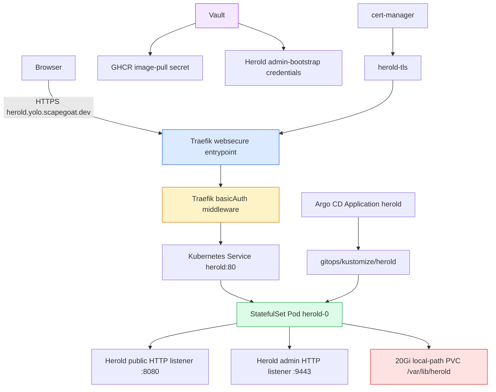

# Herold on K3s: HTTPS-Only MVP Deployment Deep Dive

This report explains the HEROLD-001 deployment work so far: taking Herold from source checkout and deployment design into a live HTTPS-only MVP on the Hetzner K3s GitOps platform. It focuses on the actual engineering decisions, the failure modes encountered, and the operational rules that came out of the rollout. The result is not a complete public mail-server deployment yet. It is a deliberately constrained first deployment that proves image ownership, persistent storage, Herold configuration loading, Argo CD reconciliation, cert-manager TLS, Traefik routing, basic-auth gating, and first-admin bootstrap without opening SMTP, IMAP, submission, IMAPS, or ManageSieve ports.

> [!summary]
> Herold is now live as a K3s GitOps-managed HTTPS-only MVP at `https://herold.yolo.scapegoat.dev/`. The public route is protected by Traefik basic auth, the Herold pod is a single-replica `StatefulSet` with a `local-path` PVC, the image comes from the controlled GitHub fork's GHCR package, and Herold's first admin bootstrap credentials are stored in Vault. The rollout exposed three important platform lessons: image tags must be architecture-compatible, `spec.tls` does not by itself restrict a Traefik router to TLS, and `WaitForFirstConsumer` PVCs must be in the same Argo sync wave as their first consuming workload.

## What was built

The deployed MVP has the following shape:

```text
GitHub fork:      https://github.com/wesen/herold
Image:            ghcr.io/wesen/herold:sha-55bdd8e5926a
GitOps repo:      /home/manuel/code/wesen/2026-03-27--hetzner-k3s
Argo app:         gitops/applications/herold.yaml
Kustomize path:   gitops/kustomize/herold
Namespace:        herold
Public host:      herold.yolo.scapegoat.dev
Ingress:          HTTPS only, Traefik websecure entrypoint
External auth:    Traefik basicAuth
Internal app:     Herold public HTTP listener on 8080
Internal admin:   Herold admin HTTP listener on 9443, not exposed publicly
Storage:          20Gi local-path PVC
Mail ports:       not exposed
```

The important negative statement is as important as the positive one: this deployment does **not** expose SMTP, SMTP submission, IMAP, IMAPS, ManageSieve, or public mail delivery surfaces. Herold is a mail server, but this first rollout is not yet a public mail server. It is a controlled platform integration stage.

## Why the first deployment is HTTPS-only

Herold eventually needs mail-specific infrastructure: DNS, MX records, SPF, DKIM, DMARC, MTA-STS, reverse DNS, firewall openings, inbound SMTP, submission, IMAP, TLS strategy for mail protocols, outbound delivery posture, abuse controls, and backup policy. Those pieces are not independent. Opening port 25 before proving the basic runtime would create more variables than necessary.

The first MVP therefore isolates the lowest-risk part of the system:

```text
Can K3s run Herold as a single-node stateful service?
Can Argo CD reconcile the package?
Can the image be pulled by the node?
Can Herold load the intended system.toml?
Can cert-manager issue TLS for the host?
Can Traefik route only HTTPS traffic to the UI?
Can basic auth gate the public route?
Can the first Herold admin principal be bootstrapped and vaulted?
```

Answering these questions first reduces the later mail-server rollout to a smaller set of protocol, DNS, and operational questions. It also creates a known-good baseline that can be rolled back to if a future mail-port phase misbehaves.

## The three repositories involved

The work spans two active repositories and one supporting source of prior deployment knowledge.

| Repository | Role |
|---|---|
| `/home/manuel/workspaces/2026-06-06/herold-install/herold` | Herold source checkout, ticket docs, diary, and controlled GitHub fork workflow. |
| `/home/manuel/code/wesen/2026-03-27--hetzner-k3s` | GitOps source of truth for the live K3s cluster. Holds Argo application, Kustomize manifests, Vault roles/policies, and validation scripts. |
| `/home/manuel/workspaces/2026-06-06/herold-install/infra-tooling` | Reference for the standard source repo → image publish → GitOps PR model. |

The key boundary is that the source repository owns application code and image publishing, while the K3s repository owns cluster desired state. The Herold deployment does not build inside the GitOps repo. The GitOps repo pins the exact image tag to run.

## The deployment architecture

The live path from browser to Herold is:



Two separate authentication concepts exist in this diagram:

1. **Traefik basic auth** protects the public HTTPS route. It is not a Herold user account.
2. **Herold admin bootstrap credentials** create the first Herold admin principal and API key. They are application-level credentials.

Confusing those two credentials caused a clarification step during the rollout. The final state stores both credential layers in Vault under separate paths.

## Forking Herold and establishing image ownership

The first request included a GitHub fork requirement so the operator could do future GitOps work from GitHub. The local Herold checkout had a Forgejo origin:

```text
origin https://code.netzhansa.com/herold/herold.git
```

The controlled GitHub repository was created at:

```text
https://github.com/wesen/herold
```

The first attempt to use `gh repo create --source=.` failed because the checkout was a linked Git worktree whose `.git` is a file pointing at another worktree metadata directory. The recovery path was to create the GitHub repository without `--source`, add the remote manually, and push the branch:

```bash
git remote add github git@github.com:wesen/herold.git
git push github HEAD:main
```

A GitHub Actions workflow was added to the fork:

```text
.github/workflows/container.yml
```

Its job is to build Herold from `deploy/docker/Dockerfile`, publish to GHCR, and tag images with an immutable short-SHA tag. The relevant image produced for this rollout was:

```text
ghcr.io/wesen/herold:sha-55bdd8e5926a
```

## Why the Netzhansa image was not used

The upstream Netzhansa image looked like the best first option because it already existed and matched the source commit:

```text
code.netzhansa.com/hanshuebner/herold:sha-27a911263f93
```

A manifest existence check passed. A config check could also run locally. The problem appeared only when the image platform was checked against the cluster node. The live K3s node is `linux/amd64`, while the Netzhansa image is `linux/arm64`.

The validation evidence was:

```text
K3s node:       k3s-demo-1 amd64 linux
Netzhansa tag:  linux/arm64
GHCR tag:       linux/amd64
```

A container image tag being present is not sufficient. For a single-node cluster, the tag must include the node architecture. That led to the first important deployment rule:

> Always validate image architecture before merging a manifest for a single-node cluster, especially when consuming images from a small registry or a non-standard build path.

The GitOps manifest therefore uses the fork-built GHCR image:

```yaml
image: ghcr.io/wesen/herold:sha-55bdd8e5926a
```

Because the GHCR package is private, the Kustomize package includes a Vault-backed image-pull secret and the Herold `ServiceAccount` references it.

## The GitOps package

The Herold Kustomize package is intentionally explicit:

```text
gitops/kustomize/herold/
├── namespace.yaml
├── serviceaccount.yaml
├── vault-connection.yaml
├── vault-auth.yaml
├── image-pull-secret.yaml
├── ingress-basic-auth-secret.yaml
├── ingress-basic-auth-middleware.yaml
├── configmap.yaml
├── persistentvolumeclaim.yaml
├── statefulset.yaml
├── service.yaml
└── ingress.yaml
```

The package entry point is:

```yaml
apiVersion: kustomize.config.k8s.io/v1beta1
kind: Kustomization
namespace: herold
resources:
  - namespace.yaml
  - serviceaccount.yaml
  - vault-connection.yaml
  - vault-auth.yaml
  - image-pull-secret.yaml
  - ingress-basic-auth-secret.yaml
  - ingress-basic-auth-middleware.yaml
  - configmap.yaml
  - persistentvolumeclaim.yaml
  - statefulset.yaml
  - service.yaml
  - ingress.yaml
```

This package expresses a complete single-app desired state. Argo CD renders and applies it after the `Application` object is bootstrapped once.

## Herold system.toml for the MVP

Herold is configured through a `ConfigMap` that mounts `/etc/herold/system.toml` into the pod. The MVP config has exactly two listeners:

```toml
[[listener]]
name = "public"
address = "0.0.0.0:8080"
protocol = "http"
kind = "public"
tls = "none"

[[listener]]
name = "admin"
address = "0.0.0.0:9443"
protocol = "http"
kind = "admin"
tls = "none"
```

There are no `smtp`, `smtp-submission`, `imap`, or `managesieve` listener blocks in the MVP. This is enforced by a validation script:

```text
scripts/herold/validate-herold-mvp.sh
```

The script renders `gitops/kustomize/herold` and rejects common mail-protocol tokens and mail-port references. The point of this script is not deep semantic validation. It is a cheap guard against accidentally exposing the next phase too early.

The public listener is exposed through Traefik over HTTPS. The admin listener is not exposed publicly. Admin operations currently use pod-local execution or port-forwarded access.

## StatefulSet and persistent storage

Herold is deployed as a one-replica `StatefulSet`:

```yaml
apiVersion: apps/v1
kind: StatefulSet
metadata:
  name: herold
  annotations:
    argocd.argoproj.io/sync-wave: "2"
spec:
  serviceName: herold
  replicas: 1
```

The pod mounts a 20Gi `local-path` PVC at `/var/lib/herold`:

```yaml
volumeMounts:
  - name: data
    mountPath: /var/lib/herold
```

Herold uses SQLite in the MVP config:

```toml
[server.storage]
backend = "sqlite"

[server.storage.sqlite]
path = "/var/lib/herold/herold.sqlite"
```

A single-replica `StatefulSet` is appropriate for this stage. Herold is stateful, and the deployment is not pretending to be horizontally scalable. Future production decisions should include backup and restore testing before adding real mail users.

## The PVC sync-wave deadlock

The first live sync got stuck at the PVC:

```text
Application message: waiting for healthy state of /PersistentVolumeClaim/herold-data
PVC event: WaitForFirstConsumer ... waiting for first consumer to be created before binding
Used By: <none>
```

The cause was not storage capacity. It was ordering. The K3s `local-path` storage class waits for the first consuming pod before binding a PVC. Argo CD sync waves are sequential, and the first manifest had the PVC in wave `1` while the `StatefulSet` was in wave `2`. Argo waited for the PVC to become healthy before creating the `StatefulSet`, while the PVC waited for a pod created by that `StatefulSet`.

The fix was to move the PVC into the same wave as the `StatefulSet`:

```yaml
metadata:
  annotations:
    argocd.argoproj.io/sync-wave: "2"
```

After the fix reached `main`, the stuck Argo operation was cleared and refreshed. The next sync created `herold-0`, the PVC bound, and Argo reached `Synced Healthy`.

This became a platform documentation update because it was not the first occurrence of this problem. The rule is now documented across the K3s repo:

```text
Put the PVC and the first consuming Deployment/StatefulSet in the same sync wave,
or omit sync-wave annotations from both.
Do not put a local-path PVC in an earlier wave than the workload that creates its first consumer Pod.
```

## HTTPS routing and the Traefik TLS entrypoint

The Ingress originally had `spec.tls`, but a review caught an important Traefik detail: in Traefik's Kubernetes Ingress provider, the TLS block selects certificate material but does not by itself guarantee that the router is restricted to the TLS entrypoint. The cluster did not have a global HTTP-to-HTTPS redirect configured in `gitops/kustomize/traefik-observability/traefik-helmchartconfig.yaml`.

The fix was to add explicit Traefik annotations:

```yaml
traefik.ingress.kubernetes.io/router.entrypoints: websecure
traefik.ingress.kubernetes.io/router.tls: "true"
```

The final Herold Ingress annotations are:

```yaml
metadata:
  annotations:
    cert-manager.io/cluster-issuer: letsencrypt-prod
    traefik.ingress.kubernetes.io/router.entrypoints: websecure
    traefik.ingress.kubernetes.io/router.middlewares: herold-herold-basic-auth@kubernetescrd
    traefik.ingress.kubernetes.io/router.tls: "true"
```

This matters because the route is protected by basic auth. Basic-auth credentials must not be exchanged over cleartext HTTP. Final validation showed cleartext HTTP returns Traefik `404` and does not route to Herold.

## Traefik basicAuth and the secret shape bug

The endpoint initially looked healthy from the Kubernetes side:

```text
Argo:        Synced Healthy
Pod:         herold-0 1/1 Running
PVC:         Bound
Certificate: herold-tls Ready=True
Ingress:     present with address 91.98.46.169
```

But external HTTPS returned `404` instead of a basic-auth challenge. Direct service access through port-forward returned Herold HTML with `200 OK`, so the backend was healthy. The problem was Traefik routing/middleware state.

Traefik logs contained the decisive error:

```text
failed to load basic auth credentials: found 2 elements for secret 'herold/herold-basic-auth', must be single element exactly
```

The original basic-auth secret was rendered by Vault Secrets Operator. VSO produced a Kubernetes Secret with both `users` and `_raw` keys. Traefik basicAuth requires the referenced secret to contain exactly one data element. The extra `_raw` key broke the middleware.

The fix was to replace the VSO-generated basic-auth secret with a single-key Kubernetes `Secret` in GitOps:

```yaml
apiVersion: v1
kind: Secret
metadata:
  name: herold-basic-auth
  annotations:
    argocd.argoproj.io/sync-wave: "1"
type: Opaque
stringData:
  users: |
    herold:<htpasswd-hash>
```

The plaintext ingress password remains stored in Vault at:

```text
kv/apps/herold/prod/ingress-basic-auth
```

The GitOps secret contains the htpasswd hash. This is acceptable for the MVP but deserves a follow-up decision: either keep this pattern, or implement a cleaner Vault-to-single-key-secret mechanism that does not commit the hash.

## Vault paths and credential layers

The final rollout has three Herold Vault paths:

```text
kv/apps/herold/prod/image-pull
kv/apps/herold/prod/ingress-basic-auth
kv/apps/herold/prod/admin-bootstrap
```

Their roles are different:

| Path | Purpose |
|---|---|
| `image-pull` | Lets Kubernetes pull the private GHCR Herold image. |
| `ingress-basic-auth` | Stores the Traefik basic-auth username/password and htpasswd line. |
| `admin-bootstrap` | Stores Herold's first admin email, password, API key, and server URL. |

The distinction between ingress auth and Herold admin auth is important. The ingress credential only gets a browser through Traefik. It does not create or authenticate a Herold admin principal. The Herold admin bootstrap command creates the first application-level admin and API key.

The admin bootstrap command was run inside the live pod:

```bash
kubectl -n herold exec herold-0 -- \
  /usr/local/bin/herold bootstrap \
  --email admin@herold.yolo.scapegoat.dev \
  --save-credentials=false
```

The generated values were stored in Vault immediately because the command prints them once and they are not recoverable from Herold after that point.

The Herold image is distroless/static and has no shell. Attempting to run `/bin/sh` inside the pod failed:

```text
exec: "/bin/sh": stat /bin/sh: no such file or directory
```

Future operational commands should call `/usr/local/bin/herold` directly, use port-forwarding, or inspect Kubernetes objects rather than assuming an interactive shell exists.

## Validation results

The final validation set is:

```text
Argo:                    Synced Healthy
Pod:                     herold-0 1/1 Running
PVC:                     Bound, 20Gi local-path
Certificate:             herold-tls Ready=True
HTTPS unauthenticated:   HTTP/2 401
HTTPS authenticated:     HTTP/2 200
HTTP cleartext:          HTTP/1.1 404 Not Found
Admin API key:           verified against internal admin listener
```

The HTTPS behavior is the key user-facing proof:

```bash
curl -I https://herold.yolo.scapegoat.dev/
# HTTP/2 401

curl -I -u '<ingress-user>:<ingress-password>' https://herold.yolo.scapegoat.dev/
# HTTP/2 200

curl -I http://herold.yolo.scapegoat.dev/
# HTTP/1.1 404 Not Found
```

Traefik access logs after the basic-auth fix showed authenticated requests using the Herold router and backend service:

```text
RouterName=herold-herold-herold-yolo-scapegoat-dev@kubernetes
ServiceName=herold-herold-80@kubernetes
ClientUsername=herold
OriginStatus=200
```

That evidence matters because before the fix the requests had no Herold router and no backend origin status.

## Timeline of important commits

| Commit | Repository | Meaning |
|---|---|---|
| `55bdd8e` | Herold fork | Added GitHub container publishing workflow. |
| `df31224` | K3s GitOps branch | Added initial HTTPS-only Herold Kustomize package. |
| `787475d` | K3s GitOps branch | Switched to amd64 GHCR image after architecture validation. |
| `d398ea1` | K3s GitOps branch | Restricted Herold Ingress to Traefik `websecure` and router TLS. |
| `8d0a1f1` | K3s main | Merged PR #99 with Herold MVP package. |
| `66b7aa2` | K3s main | Fixed PVC sync wave to match the `StatefulSet`. |
| `e083412` | K3s main | Documented the PVC sync-wave deadlock pattern. |
| `a76e251` | K3s main | Replaced VSO basic-auth secret with single-key Traefik secret. |

The ticket diary lives in:

```text
/home/manuel/workspaces/2026-06-06/herold-install/herold/ttmp/2026/06/06/HEROLD-001--install-herold-on-hetzner-k3s/reference/01-investigation-diary.md
```

## What this deployment teaches

### Image ownership and deployability are separate

The Netzhansa image was real, immutable-looking, and tied to the desired source commit. It still was not deployable on the live cluster because it was `linux/arm64`. The controlled fork's GHCR workflow was initially treated as future-proofing, but it became necessary because it produced a `linux/amd64` image.

For K3s operators, the deployable-image checklist is:

```text
Does the tag exist?
Is the tag immutable or otherwise pinned?
Can the cluster pull it?
Does the image include the node architecture?
Does the app config validate against that exact image?
```

### Git merge is not live deployment

Merging PR #99 did not create the live Herold application. This K3s repo does not auto-discover new files under `gitops/applications/`. The first rollout still required:

```bash
kubectl apply -f gitops/applications/herold.yaml
kubectl -n argocd annotate application herold \
  argocd.argoproj.io/refresh=hard --overwrite
```

After the Argo `Application` exists, future manifest changes are normal GitOps reconciliation.

### Argo health and Kubernetes storage semantics can deadlock

The PVC issue is the strongest operational lesson. Argo was doing what it was configured to do: apply wave `1`, wait for health, then move to wave `2`. Kubernetes was doing what `local-path` storage does: wait for a first consumer before binding. The configuration put those two correct behaviors into conflict.

The fix was not to force-create a volume manually. The fix was to correct the dependency ordering.

### Ingress TLS and Traefik router TLS are not the same setting

Kubernetes `spec.tls` and Traefik router entrypoints are different layers. For this cluster, HTTPS-only public routes should explicitly set:

```yaml
traefik.ingress.kubernetes.io/router.entrypoints: websecure
traefik.ingress.kubernetes.io/router.tls: "true"
```

This is especially important when basic auth is attached to the route.

### VSO-generated secrets are not automatically valid for every consumer

Vault Secrets Operator can render a Kubernetes Secret, but the consumer decides what shape is valid. Traefik basicAuth requires exactly one data element. A VSO destination secret with `_raw` plus `users` is structurally invalid for that middleware.

The broader rule is:

```text
Do not only ask whether a Secret exists.
Ask whether its data keys match the exact consumer contract.
```

## What remains open

The MVP is live, but several decisions remain for the next phase.

### Decide how to handle the basic-auth hash

The plaintext basic-auth password is stored in Vault, but the htpasswd hash is now in Git as a single-key Kubernetes Secret. That fixed Traefik. The follow-up decision is whether this is acceptable for the MVP or whether the platform should add a more refined Vault-to-single-key-secret process.

Options:

| Option | Benefit | Cost |
|---|---|---|
| Keep htpasswd hash in Git | Simple, already works. | Hash is public to repo readers and should be rotated if shared broadly. |
| Add a small bootstrap script that writes a plain Kubernetes Secret | Keeps hash out of Git. | Manual or scripted imperative step outside GitOps. |
| Add a custom VSO transformation pattern that truly emits one key | Preserves Vault source and GitOps object. | Needs verification that VSO will not add extra keys for this consumer. |

### Decide admin access posture

The Herold admin listener is currently internal and plaintext inside the cluster. The admin API key was verified from inside the pod. That is acceptable for bootstrap, but long-term admin access needs a decision:

```text
Use kubectl exec / direct herold CLI only
Use port-forward to Service/admin
Add a separate protected admin ingress
Use Tailscale-only routing
```

A public admin ingress should not be added casually. If it is added, it needs a stronger access policy than the current MVP web route.

### Add post-rollout validation scripts

The rollout required several checks that should become a script:

```text
Argo is Synced Healthy
Pod is Running and Ready
PVC is Bound
Certificate is Ready
Secret herold-basic-auth has exactly one key: users
HTTPS unauthenticated returns 401
HTTPS authenticated returns 200
HTTP cleartext returns 404
No SMTP/IMAP/ManageSieve exposure appears in rendered manifests
```

A future `scripts/herold/validate-herold-live.sh` would preserve the lessons from this rollout.

### Plan the mail phase deliberately

The next major phase should not only add ports. It should cover:

```text
DNS and MX records
reverse DNS
firewall openings
SMTP inbound exposure
submission/IMAP exposure strategy
TLS certificates for mail protocols
DKIM/DMARC/SPF
MTA-STS and TLS reporting
backup and restore
abuse controls and rate limits
outbound delivery constraints
monitoring and alerting
```

The HTTPS MVP gives the platform a working base. It does not remove the need for a mail-specific design review.

## Operator command reference

Useful commands from the rollout:

```bash
# Render and safety-check the MVP package.
cd /home/manuel/code/wesen/2026-03-27--hetzner-k3s
./scripts/herold/validate-herold-mvp.sh
kubectl kustomize gitops/kustomize/herold

# Check Argo.
kubectl -n argocd get application herold
kubectl -n argocd get application herold -o jsonpath='{.status.sync.status}{"\t"}{.status.health.status}{"\n"}'

# Check namespace state.
kubectl -n herold get pod,sts,pvc,svc,ingress,certificate,secret
kubectl -n herold describe pvc herold-data
kubectl -n herold get events --sort-by=.lastTimestamp | tail -80

# Check endpoint behavior.
curl -I https://herold.yolo.scapegoat.dev/
curl -I -u '<user>:<password>' https://herold.yolo.scapegoat.dev/
curl -I http://herold.yolo.scapegoat.dev/

# Retrieve ingress basic-auth credential from Vault.
vault kv get kv/apps/herold/prod/ingress-basic-auth
vault kv get -field=bootstrap_username kv/apps/herold/prod/ingress-basic-auth
vault kv get -field=bootstrap_password kv/apps/herold/prod/ingress-basic-auth

# Retrieve Herold admin bootstrap credential from Vault.
vault kv get kv/apps/herold/prod/admin-bootstrap
vault kv get -field=email kv/apps/herold/prod/admin-bootstrap
vault kv get -field=password kv/apps/herold/prod/admin-bootstrap
vault kv get -field=api_key kv/apps/herold/prod/admin-bootstrap

# Verify the admin API key from inside the pod.
kubectl -n herold exec herold-0 -- \
  /usr/local/bin/herold \
  --server-url http://127.0.0.1:9443 \
  --api-key '<api_key>' \
  server status
```

## Review checklist for future Herold work

Before any future PR changes the Herold deployment, review these points:

- Does the image tag exist, and does it include `linux/amd64` for the current node?
- Does `system.toml` still avoid mail listeners unless the PR is explicitly a mail-port phase?
- Does `scripts/herold/validate-herold-mvp.sh` still pass?
- Is the PVC in the same sync wave as the `StatefulSet`?
- Does the Ingress remain restricted to `websecure` with router TLS enabled?
- Does the basic-auth Kubernetes Secret still contain exactly one key named `users`?
- Are plaintext credentials stored in Vault, not in shell history or logs?
- Is the admin listener still internal unless an explicit admin access design has been approved?

## Closing state

At the end of this phase, Herold is deployed as a controlled HTTPS-only MVP on the Hetzner K3s platform. The platform has proven it can run the Herold binary, mount persistent storage, serve the embedded UI, issue TLS, enforce Traefik basic auth, avoid cleartext backend routing, and preserve first-admin credentials in Vault.

The most valuable result is not only that the endpoint works. The rollout converted several non-obvious operational failures into explicit platform rules: validate image architecture, align PVC waves with first consumers, bind HTTPS-only Ingresses to `websecure`, and verify Secret shape against the consuming controller. Those rules will matter again when Herold moves from a web-only MVP toward a real mail-server deployment.
