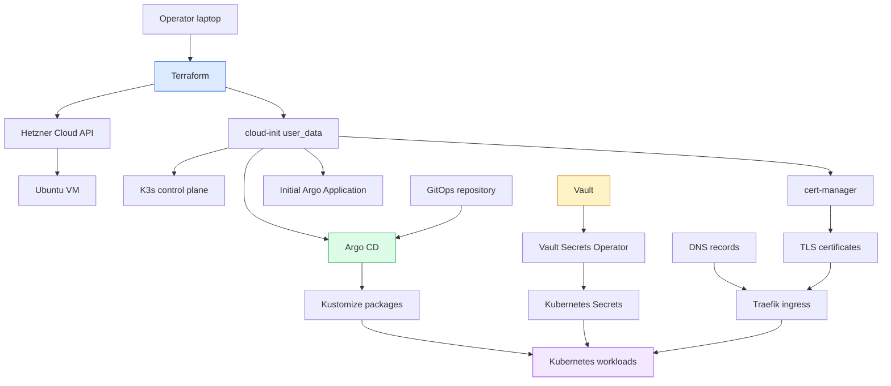

# Hetzner K3s GitOps Platform Deep Dive

This article explains the Hetzner K3s GitOps platform in `/home/manuel/code/wesen/2026-03-27--hetzner-k3s`: what it builds, how its parts fit together, how to install a similar cluster for someone else, and how to extend it without losing the GitOps contract. The goal is not only to copy commands. The goal is to understand where each responsibility lives, because the difference between Terraform, cloud-init, Argo CD, Kubernetes, Vault, DNS, and CI is the difference between a clean platform and a cluster that only works because one person remembers the right shell history.

> [!summary]
> The platform has a simple backbone: Terraform creates the Hetzner server and firewall, cloud-init installs K3s and Argo CD, and Argo CD reconciles Kubernetes manifests from Git. Day-two app deployment happens through image publishing, GitOps pull requests, Vault-backed secrets, and one-time Argo `Application` bootstraps.

## Why this note exists

A friend who wants their own K3s-on-Hetzner setup needs more than a list of commands. They need a working model of the system. This repository already contains detailed operator docs, but the system spans several layers and the most important ideas are distributed across `README.md`, `cloud-init.yaml.tftpl`, Terraform, Argo CD application manifests, Kustomize packages, Vault policies, and deployment playbooks.

This note is a project report and an install guide. It reads the local repository as the source of truth and turns it into a coherent technical article. The concrete source repo is:

```text
/home/manuel/code/wesen/2026-03-27--hetzner-k3s
```

The important supporting documents in that repo are:

```text
README.md
docs/hetzner-k3s-server-setup.md
docs/argocd-app-setup.md
docs/source-app-deployment-infrastructure-playbook.md
docs/app-runtime-secrets-and-identity-provisioning-playbook.md
docs/tailscale-k3s-admin-access-playbook.md
```

The article also refers to the Herold MVP work because it is a recent concrete example of the pattern: a source repo gets a deployable image, the K3s repo gets a Kustomize package and Argo `Application`, and the first deployment deliberately keeps risky ports out of the public surface.

## The platform in one sentence

This repository defines a single-node Hetzner K3s cluster whose long-term desired state lives in Git. Terraform creates the node and the network boundary, cloud-init performs the first bootstrapping, and Argo CD takes over by continuously applying Kustomize packages from the same repository.

That sentence has three separate time horizons:

1. **Provisioning time**: Terraform talks to Hetzner and creates infrastructure objects.
2. **First boot**: cloud-init runs once on the new VM and installs the initial cluster control plane.
3. **Day-two operations**: Argo CD reconciles Git-managed Kubernetes manifests, and operators use `kubectl`, Vault, GitHub Actions, and pull requests to evolve the platform.

A good operator keeps those horizons separate. If the VM does not exist, use Terraform. If first boot failed, read cloud-init logs. If an application is out of sync, inspect Argo CD and the Kustomize package. If a pod cannot read a secret, inspect Vault Secrets Operator and the Vault role. Treating all of these as one undifferentiated "server problem" makes debugging slow.

## Repository map

The root of the K3s repository has a small number of high-value entry points:

| Path | Role |
|---|---|
| `main.tf` | Creates the Hetzner SSH key, firewall, and server. Injects `cloud-init.yaml.tftpl` as user data. |
| `variables.tf` | Defines the install-time knobs: Hetzner token, server type, admin CIDRs, repo URL, domain, ACME email, K3s version, cert-manager version. |
| `outputs.tf` | Prints the public IP, SSH command, app URL, and cloud-init log command after `terraform apply`. |
| `cloud-init.yaml.tftpl` | First-boot script that installs K3s, cert-manager, Argo CD, Tailscale package support, clones the repo, imports a demo image, and creates the bootstrap Argo application. |
| `gitops/applications/` | Argo CD `Application` custom resources. Each file tells Argo which Git path to render and where to deploy it. |
| `gitops/kustomize/` | Kustomize packages for platform services and applications. This is the live desired state for Kubernetes resources. |
| `vault/policies/` and `vault/roles/` | Vault auth contracts for Kubernetes workloads and GitHub Actions. Git can define the intended roles; Vault still has to be bootstrapped with them. |
| `scripts/` | Operator helpers for kubeconfig retrieval, Vault bootstrapping, image import bridges, and validation. |
| `docs/` | Long-form playbooks that explain platform bring-up, app deployment, runtime secrets, Tailscale, Argo, and troubleshooting. |
| `ttmp/` | Ticket workspaces, investigations, diaries, and implementation history. |

This layout is important because it separates infrastructure from cluster desired state. `main.tf` does not try to describe every Kubernetes workload. It only gets the machine far enough that Argo CD can do that job.

## Architecture

The platform has a layered control flow:



There are two related but distinct Git relationships:

1. The node clones the Git repository during first boot so it can build/import the demo app and create the bootstrap application.
2. Argo CD later reads from the Git repository as the durable source of desired state.

The second relationship is the one that matters long term. Once the cluster is running, you should not rely on node-local edits or manual `kubectl apply` commands for steady-state resources unless the command is explicitly a one-time bootstrap step.

## Terraform: infrastructure boundary

`main.tf` creates three primary Hetzner resources:

```hcl
resource "hcloud_ssh_key" "default" { ... }
resource "hcloud_firewall" "default" { ... }
resource "hcloud_server" "node" { ... }
```

The firewall opens public HTTP and HTTPS to the world:

```hcl
rule {
  direction  = "in"
  protocol   = "tcp"
  port       = "80"
  source_ips = ["0.0.0.0/0", "::/0"]
}

rule {
  direction  = "in"
  protocol   = "tcp"
  port       = "443"
  source_ips = ["0.0.0.0/0", "::/0"]
}
```

It restricts SSH and, optionally, the Kubernetes API to `admin_cidrs`:

```hcl
rule {
  direction  = "in"
  protocol   = "tcp"
  port       = "22"
  source_ips = var.admin_cidrs
}

dynamic "rule" {
  for_each = var.allow_kube_api ? [1] : []
  content {
    direction  = "in"
    protocol   = "tcp"
    port       = "6443"
    source_ips = var.admin_cidrs
  }
}
```

This is a deliberate split. User-facing ingress is public. Operator access is gated. Later, Tailscale becomes the preferred operator path, but public `admin_cidrs` remains useful during initial bring-up or emergency recovery.

The server resource has two details worth understanding:

```hcl
backups   = var.server_backups_enabled
keep_disk = true

lifecycle {
  ignore_changes = [user_data]
}
```

Hetzner backups provide coarse node-level recovery. `keep_disk = true` reduces accidental data loss during server lifecycle changes. `ignore_changes = [user_data]` is more subtle: cloud-init user data is effectively a first-boot input. Changing it after the server exists can create replacement pressure. The repo intentionally moves live Kubernetes state into GitOps so day-two changes do not require rewriting first-boot scripts.

## cloud-init: first boot, not day-two state

The `cloud-init.yaml.tftpl` template writes one script to the server:

```text
/usr/local/bin/bootstrap-k3s-demo.sh
```

That script does the first-boot work:

```text
install Docker and qemu guest agent
install and enable Tailscale package support
write /etc/rancher/k3s/config.yaml
install K3s
wait for kubectl access
install cert-manager
install Argo CD
clone the Git repository
build and import the demo app image
create the initial PostgreSQL secret
create the initial Argo CD Application
```

The script wraps `kubectl` as `k3s kubectl`, sets `KUBECONFIG=/etc/rancher/k3s/k3s.yaml`, and waits for the node before installing add-ons. That is correct for first boot because the normal operator kubeconfig does not exist yet.

The repo also installs Tailscale during cloud-init but intentionally does not run `tailscale up`:

```text
Intentionally do not run `tailscale up` here. The live node should be
joined manually or through a separate secret-driven bootstrap path so a
tailnet auth key does not end up in generic cloud-init user data.
```

This is a good security boundary. A reusable Tailscale auth key in Terraform state or Hetzner server metadata would be a long-lived credential leak. The package can be installed automatically; joining the tailnet needs a human or a secret-driven mechanism.

## K3s: the Kubernetes substrate

K3s provides the Kubernetes API, kubelet, container runtime integration, bundled Traefik ingress, and local-path storage. In this repository it is intentionally single-node. That makes it easy to run and cheap to understand, but it also defines the operational model:

- local persistent volumes are tied to the node
- node replacement is a recovery event
- backups matter
- workloads should be sized for a single host
- high availability is not provided by Kubernetes control-plane replication

The live node discovered during HEROLD-001 validation was:

```text
k3s-demo-1    amd64    linux
```

That architecture fact matters. A container tag that exists is not automatically deployable. The Netzhansa Herold image existed, but it was `linux/arm64`; the live node was `amd64`, so the MVP had to use a fork-built GHCR image that included `linux/amd64`. A robust install guide should always include image architecture validation for non-standard or single-arch registries.

## cert-manager and Traefik: HTTPS boundary

The platform exposes public services through Traefik, which ships with K3s. TLS certificates are issued by cert-manager. The common ingress shape looks like this:

```yaml
apiVersion: networking.k8s.io/v1
kind: Ingress
metadata:
  annotations:
    cert-manager.io/cluster-issuer: letsencrypt-prod
spec:
  ingressClassName: traefik
  tls:
    - hosts:
        - app.yolo.example.com
      secretName: app-tls
  rules:
    - host: app.yolo.example.com
      http:
        paths:
          - path: /
            pathType: Prefix
            backend:
              service:
                name: app
                port:
                  number: 80
```

The cluster issuer lives under:

```text
gitops/kustomize/platform-cert-issuer/clusterissuer.yaml
```

The docs note that the live issuer name is `letsencrypt-prod`, not `letsencrypt-production`. That is the kind of small naming detail that can waste a lot of debugging time: an Ingress can look structurally valid while cert-manager never issues the certificate because the issuer name is wrong.

DNS must point at the Hetzner public IP before HTTP-01 validation succeeds. The original environment used hostnames such as:

```text
argocd.yolo.scapegoat.dev
coinvault.yolo.scapegoat.dev
herold.yolo.scapegoat.dev
```

For a friend installing their own cluster, replace `scapegoat.dev` with their domain and decide whether they want a wildcard like `*.yolo.example.com` or individual records.

## Argo CD: desired state controller

Argo CD is the heart of the day-two model. An Argo `Application` tells Argo where to fetch manifests from and where to apply them. A typical file under `gitops/applications/` looks like this:

```yaml
apiVersion: argoproj.io/v1alpha1
kind: Application
metadata:
  name: smailnail
  namespace: argocd
  finalizers:
    - resources-finalizer.argocd.argoproj.io
spec:
  project: default
  destination:
    server: https://kubernetes.default.svc
    namespace: smailnail
  source:
    repoURL: https://github.com/wesen/2026-03-27--hetzner-k3s.git
    targetRevision: main
    path: gitops/kustomize/smailnail
  syncPolicy:
    automated:
      prune: true
      selfHeal: true
    syncOptions:
      - CreateNamespace=true
      - ServerSideApply=true
```

Three fields drive most debugging:

| Field | What it controls | Failure mode |
|---|---|---|
| `spec.source.repoURL` / `targetRevision` / `path` | What Argo renders. | Wrong Git path, stale branch, private repo credentials missing. |
| `spec.destination` | Where Argo applies rendered resources. | Objects appear in the wrong namespace or not at all. |
| `spec.syncPolicy` | Whether Argo auto-syncs, prunes, and self-heals. | Manual drift persists, or unexpected pruning occurs. |

The most common misunderstanding is this:

```text
A file under gitops/applications/<app>.yaml in Git
is not the same thing as
an Application object already existing in the cluster.
```

This repo does not use an app-of-apps controller or `ApplicationSet` that automatically creates every file in `gitops/applications/`. For a brand-new application, someone must apply the `Application` once:

```bash
kubectl apply -f gitops/applications/<app>.yaml
kubectl -n argocd annotate application <app> \
  argocd.argoproj.io/refresh=hard --overwrite
```

After that, future Git changes to the Kustomize package are reconciled by Argo.

## Kustomize packages: what Argo applies

The live application manifests live under `gitops/kustomize/<app>/`. A minimal web app package usually has:

```text
gitops/kustomize/<app>/
├── kustomization.yaml
├── namespace.yaml
├── deployment.yaml
├── service.yaml
└── ingress.yaml
```

A private app with runtime secrets grows additional files:

```text
serviceaccount.yaml
vault-connection.yaml
vault-auth.yaml
runtime-secret.yaml
image-pull-secret.yaml
persistentvolumeclaim.yaml
db-bootstrap-job.yaml
```

Kustomize is intentionally simple here. It is not used as a complex templating language. It collects concrete YAML resources into a package that can be rendered locally:

```bash
kubectl kustomize gitops/kustomize/<app>
```

That render command is one of the best cheap checks in the whole system. Run it before you let Argo see a new package.

## Vault and Vault Secrets Operator

The platform uses Vault for secrets and Vault Secrets Operator (VSO) to render Kubernetes `Secret` objects. The important point is that there are two sides to a secret contract:

1. Git defines the Kubernetes-side request: `VaultConnection`, `VaultAuth`, and `VaultStaticSecret`.
2. Vault must already contain the matching policy, role, and secret values.

A typical in-cluster Vault connection uses the internal service address:

```yaml
apiVersion: secrets.hashicorp.com/v1beta1
kind: VaultConnection
metadata:
  name: vault
spec:
  address: http://vault.vault.svc.cluster.local:8200
  skipTLSVerify: true
```

That is better than routing VSO traffic through the public Vault ingress. In-cluster secret synchronization should not depend on Traefik or public hostnames.

A typical `VaultAuth` binds a Kubernetes service account to a Vault role:

```yaml
apiVersion: secrets.hashicorp.com/v1beta1
kind: VaultAuth
metadata:
  name: herold
spec:
  vaultConnectionRef: vault
  method: kubernetes
  mount: kubernetes
  kubernetes:
    role: herold
    serviceAccount: herold
```

The matching Vault role file in Git might look like:

```json
{
  "bound_service_account_names": ["herold"],
  "bound_service_account_namespaces": ["herold"],
  "policies": ["herold"],
  "ttl": "24h"
}
```

The matching policy might allow only specific paths:

```hcl
path "kv/data/apps/herold/prod/image-pull" {
  capabilities = ["read"]
}

path "kv/data/apps/herold/prod/ingress-basic-auth" {
  capabilities = ["read"]
}
```

The lesson is that GitOps can declare how the workload should ask for secrets, but it cannot invent the actual Vault data. Before first sync, seed the needed paths and apply the Vault roles/policies.

## Source repository to cluster: the deployment chain

Application deployment is a chain of custody:

```mermaid
flowchart LR
  Source[Source repository] --> CI[GitHub Actions]
  CI --> Test[Test and build]
  Test --> Registry[GHCR or another registry]
  Registry --> Tag[Immutable sha-* tag]
  Tag --> GitOpsPR[GitOps pull request]
  GitOpsPR --> Merge[Reviewer merges]
  Merge --> Argo[Argo CD sees Git change]
  Argo --> K8s[Kubernetes rollout]

  style Source fill:#dbeafe,stroke:#2563eb
  style Registry fill:#fef3c7,stroke:#d97706
  style Argo fill:#dcfce7,stroke:#16a34a
  style K8s fill:#f3e8ff,stroke:#9333ea
```



The source repo owns source code, tests, Docker build inputs, and image publishing. The GitOps repo owns Kubernetes desired state and the exact image tag that should run. The cluster owns actual pods and rollout status. Keeping those ownership boundaries explicit prevents one of the common mistakes: believing that publishing an image is the same as deployment.

Publishing an image is not deployment. Merging a GitOps PR is not always deployment either if the Argo `Application` has never been created. The sequence for a brand-new app is:

```bash
# source repo
# build and publish ghcr.io/<owner>/<app>:sha-<commit>

# gitops repo
# create or update gitops/kustomize/<app>
# create gitops/applications/<app>.yaml
# merge the GitOps PR

# one-time cluster bootstrap
kubectl apply -f gitops/applications/<app>.yaml
kubectl -n argocd annotate application <app> \
  argocd.argoproj.io/refresh=hard --overwrite
```

After that, ordinary image bumps can be pull requests only.

## Installing your own copy

This section is the install guide for someone who wants their own Hetzner K3s GitOps cluster based on this repository.

### Step 0: Decide what you are copying

You can copy the whole repository as a starting point, but you should understand which values are environment-specific:

| Setting | Where it appears | What your friend changes |
|---|---|---|
| Hetzner API token | `terraform.tfvars` | Use their own Hetzner Cloud token. |
| SSH public key | `terraform.tfvars` | Use their operator key. |
| `repo_url` | `terraform.tfvars`, Argo apps | Point at their fork of the GitOps repo. |
| `base_domain` | `terraform.tfvars`, manifests | Use their domain. |
| `acme_email` | `terraform.tfvars`, ClusterIssuer | Use their email. |
| Hostnames | `gitops/kustomize/*/ingress.yaml` | Replace `*.yolo.scapegoat.dev` with their names. |
| Admin CIDRs | `terraform.tfvars` | Use their current IP CIDR for bootstrap. |
| Vault secrets | Vault and scripts | Seed their own credentials and app secrets. |
| GitHub image paths | deployment manifests | Use their owner/org and package visibility model. |

Start by forking or copying the GitOps repo to their GitHub account. The simplest bootstrap path is a public GitHub repo because Argo and cloud-init can fetch it without repository credentials. A private GitOps repo is possible, but it requires adding Argo CD repo credentials after bootstrap.

### Step 1: Install local tools

On the operator machine, install:

```bash
terraform
kubectl
git
ssh
jq
vault
helm optional
argocd optional
```

The repo mostly uses `kubectl kustomize` rather than requiring a separate `kustomize` binary.

### Step 2: Prepare Terraform variables

In the copied repo:

```bash
cd /path/to/your/hetzner-k3s-repo
cp terraform.tfvars.example terraform.tfvars
```

Fill in at least:

```hcl
hcloud_token      = "..."
ssh_public_key    = "ssh-ed25519 ..."
admin_cidrs       = ["<your-current-public-ip>/32"]
repo_url          = "https://github.com/<you>/<repo>.git"
repo_revision     = "main"
base_domain       = "example.com"
app_subdomain     = "k3s"
acme_email        = "you@example.com"
postgres_password = "generate-a-real-password"
```

Do not commit `terraform.tfvars`. It contains secrets and local operator values.

If this is a learning environment, keep `allow_kube_api = true` for first bootstrap but restrict it to your current CIDR. Plan to move routine administration to Tailscale later.

### Step 3: Provision the server

Run:

```bash
terraform init
terraform validate
terraform apply
```

Terraform will create:

```text
Hetzner SSH key
Hetzner firewall
Ubuntu VM with public IPv4/IPv6
cloud-init user data
```

Expected outputs include the server IP and a cloud-init log command:

```bash
ssh root@<server-ip> 'tail -f /var/log/cloud-init-output.log'
```

Terraform success means the VM exists. It does not mean the cluster has finished bootstrapping. Always watch cloud-init.

### Step 4: Create DNS records

After Terraform prints the server IP, create DNS records for the hostnames you want. A practical setup is:

```text
k3s.example.com          A     <server IPv4>
*.yolo.example.com       A     <server IPv4>
```

The wildcard lets you add application hostnames without editing DNS for every app. If you do not want a wildcard, create explicit records for each hostname:

```text
argocd.example.com
vault.example.com
auth.example.com
app.example.com
```

Cert-manager HTTP-01 validation requires DNS to resolve to the server and port `80` to reach Traefik.

### Step 5: Watch first boot

Run:

```bash
ssh root@<server-ip> 'tail -f /var/log/cloud-init-output.log'
```

You are looking for:

```text
K3s install completed
cert-manager deployments available
argocd-server and repo-server available
argocd application controller rolled out
repo cloned
initial Application applied
```

If this fails, classify the failure before changing files:

| Symptom | Likely layer |
|---|---|
| Cannot SSH | Hetzner firewall, wrong SSH key, server not ready. |
| `git clone` fails | Repo URL or repo visibility. |
| K3s install fails | Node bootstrap or K3s installer. |
| cert-manager wait fails | Kubernetes add-on install. |
| Argo wait fails | Argo CD install. |
| Ingress later has no cert | DNS, cert-manager issuer, or HTTP-01 reachability. |

### Step 6: Fetch kubeconfig

For initial public-IP access:

```bash
./scripts/get-kubeconfig.sh <server-ip>
export KUBECONFIG=$PWD/kubeconfig-<server-ip>.yaml
kubectl get nodes
kubectl -n argocd get applications
```

If public `6443` is closed or your IP changed, either update `admin_cidrs` and re-run Terraform for the firewall or move to Tailscale.

### Step 7: Join Tailscale for stable operator access

The repo installs Tailscale but does not join the tailnet automatically. Join manually:

```bash
ssh root@<server-ip> '
  tailscale up --accept-routes=false --accept-dns=true --ssh
'
```

Approve the node in the Tailscale admin UI, then get the Tailscale IP:

```bash
ssh root@<server-ip> 'tailscale ip -4'
```

Update `/etc/rancher/k3s/config.yaml` so the Kubernetes API certificate includes the Tailscale endpoint:

```yaml
write-kubeconfig-mode: "0644"
tls-san:
  - <tailscale-ip>
  - <tailscale-magicdns-name>
```

Restart K3s:

```bash
ssh root@<tailscale-ip> 'systemctl restart k3s'
```

Then fetch a Tailscale kubeconfig using the repo helper:

```bash
./scripts/get-kubeconfig-tailscale.sh
export KUBECONFIG=$PWD/.cache/kubeconfig-tailnet.yaml
kubectl get nodes
```

The principle is simple: public `80/443` are for users; Tailscale is for operators.

### Step 8: Validate Argo CD

Check Argo applications:

```bash
kubectl -n argocd get applications
```

For a specific app:

```bash
kubectl -n argocd get application <app> \
  -o jsonpath='{.spec.source.path}{"\n"}{.status.sync.status}{"\n"}{.status.health.status}{"\n"}'
```

A clean app should eventually report:

```text
gitops/kustomize/<app>
Synced
Healthy
```

If an app does not exist in Argo but its YAML file exists in Git, apply the `Application` once:

```bash
kubectl apply -f gitops/applications/<app>.yaml
```

### Step 9: Seed platform secrets

If the copied platform includes Vault, Keycloak, private GHCR images, or runtime app secrets, expect a second bootstrap phase. Git can define the resources, but Vault must contain data and auth roles.

Typical helper scripts in the repo include:

```text
scripts/bootstrap-vault-kubernetes-auth.sh
scripts/bootstrap-vault-github-actions-oidc.sh
scripts/bootstrap-cluster-postgres-secrets.sh
scripts/bootstrap-cluster-mysql-secrets.sh
scripts/bootstrap-keycloak-secrets.sh
scripts/bootstrap-<app>-image-pull-secret.sh
scripts/bootstrap-<app>-runtime-secrets.sh
```

The exact values are environment-specific. Do not copy someone else's secrets. Copy the shape and regenerate the values.

A private GHCR pull secret usually needs Vault keys:

```text
server   = ghcr.io
username = <github-user-or-bot>
password = <token-with-package-read>
auth     = base64(username:password)
```

A Traefik basic-auth secret usually needs:

```text
users = <htpasswd-formatted-lines>
```

### Step 10: Deploy a new app

A new app has three pieces:

1. A source repository that publishes an immutable image.
2. A GitOps Kustomize package that pins that image.
3. An Argo `Application` that points at that package.

The minimal Kustomize package:

```text
gitops/kustomize/my-app/
├── kustomization.yaml
├── namespace.yaml
├── deployment.yaml
├── service.yaml
└── ingress.yaml
```

The minimal Argo application:

```text
gitops/applications/my-app.yaml
```

Validate locally:

```bash
kubectl kustomize gitops/kustomize/my-app
```

Merge the GitOps PR, then bootstrap once:

```bash
kubectl apply -f gitops/applications/my-app.yaml
kubectl -n argocd annotate application my-app \
  argocd.argoproj.io/refresh=hard --overwrite
```

## A concrete example: Herold HTTPS-only MVP

The Herold work is a useful example because it shows how a service with a larger eventual surface can be introduced safely. Herold is a mail server, but the first MVP deliberately exposes only an HTTPS UI. SMTP, submission, IMAP, IMAPS, and ManageSieve are left out until DNS, reverse DNS, firewall, TLS, abuse controls, and backups are reviewed.

The GitOps package lives under:

```text
gitops/kustomize/herold/
```

The Argo application is:

```text
gitops/applications/herold.yaml
```

The package includes:

```text
namespace.yaml
serviceaccount.yaml
vault-connection.yaml
vault-auth.yaml
image-pull-secret.yaml
ingress-basic-auth-secret.yaml
ingress-basic-auth-middleware.yaml
configmap.yaml
persistentvolumeclaim.yaml
statefulset.yaml
service.yaml
ingress.yaml
```

The important design is the listener configuration. The MVP `system.toml` contains HTTP listeners only:

```toml
[[listener]]
name = "public"
address = "0.0.0.0:8080"
protocol = "http"
kind = "public"
tls = "none"

[[listener]]
name = "admin"
address = "0.0.0.0:9443"
protocol = "http"
kind = "admin"
tls = "none"
```

External HTTPS is handled by Traefik and cert-manager:

```text
browser
  -> https://herold.yolo.scapegoat.dev
  -> Traefik Ingress
  -> basicAuth middleware
  -> Service herold:80
  -> Pod public listener on 8080
```

The validation script lives under `scripts/` as required by the repo convention:

```bash
./scripts/herold/validate-herold-mvp.sh
```

It renders the package and rejects common mail-protocol exposure tokens. This is a small but valuable pattern: encode the safety rule as a script so reviewers do not have to remember every forbidden port by eye.

## Common failure modes

### Terraform says success, but the app is not up

Terraform only proves that the Hetzner resources were created. Check cloud-init and then Argo:

```bash
ssh root@<server-ip> 'tail -n 200 /var/log/cloud-init-output.log'
kubectl -n argocd get applications
```

### Public apps work, but SSH and kubectl time out

This is often `admin_cidrs`, not Kubernetes. Public `80/443` are open to the world, while `22/6443` are restricted. Check your current IP:

```bash
curl -4 https://ifconfig.me
terraform state show hcloud_firewall.default
```

The better long-term fix is Tailscale.

### Merged an app, but Argo does nothing

The `Application` object probably was never applied. Apply it once:

```bash
kubectl apply -f gitops/applications/<app>.yaml
```

### Pod cannot pull a private image

Publishing to GHCR does not mean the cluster can pull. Check package visibility and image pull secrets:

```bash
kubectl -n <app> describe pod <pod>
kubectl -n <app> get secret <app>-ghcr-pull
kubectl -n <app> get serviceaccount <app> -o yaml
```

If VSO should create the secret, inspect `VaultAuth` and `VaultStaticSecret` status.

### Certificate is not issued

Check DNS, issuer name, and cert-manager state:

```bash
dig +short <host>
kubectl -n <namespace> describe ingress <name>
kubectl -n <namespace> get certificate,challenge,order
kubectl -n cert-manager logs deploy/cert-manager --tail=100
```

### Kubeconfig over Tailscale fails TLS verification

Add the Tailscale IP and MagicDNS name to K3s `tls-san`, restart K3s, and fetch a fresh kubeconfig.

### The image tag exists but the pod will not run

Check platform architecture:

```bash
kubectl get nodes -o jsonpath='{range .items[*]}{.metadata.name}{"\t"}{.status.nodeInfo.architecture}{"\n"}{end}'
docker manifest inspect -v <image>:<tag>
```

A single-arch ARM image will not run on an amd64 node.

## Recommended hardening before a friend runs this seriously

For a friend installing a personal or small production cluster, I would make these decisions explicitly:

- **Use Tailscale for operators.** Keep public `6443` disabled or tightly restricted after bootstrap.
- **Use a real backup plan.** Hetzner server backups are useful, but app-level backups for PostgreSQL, MySQL, Vault, and persistent volumes should be documented and tested.
- **Pin versions.** Pin K3s, cert-manager, and Argo CD install URLs rather than relying on moving stable channels.
- **Use a private GitOps repo only after planning Argo credentials.** Public is simpler for first bootstrap; private is better for sensitive topology once credentials are wired.
- **Prefer immutable image tags.** Use `sha-*` tags or digests, not `latest`.
- **Validate image architectures.** Especially when images come from small registries or local builders.
- **Keep cloud-init small.** Use it for first boot, then put live state in Argo-managed manifests.
- **Keep secrets out of Git and Terraform state where possible.** Vault and VSO are the preferred steady-state pattern.

## A clean install checklist

Use this as the short operational checklist.

```text
1. Fork/copy the GitOps repo.
2. Replace domain names and repo URLs.
3. Create terraform.tfvars with Hetzner token, SSH key, admin CIDR, domain, ACME email, and generated passwords.
4. terraform init && terraform validate && terraform apply.
5. Create DNS records pointing at the server IP.
6. Watch /var/log/cloud-init-output.log until K3s, cert-manager, and Argo CD are ready.
7. Fetch kubeconfig and verify kubectl get nodes.
8. Join Tailscale and configure K3s tls-san for tailnet access.
9. Verify Argo applications.
10. Bootstrap Vault roles, policies, and secret values if using Vault/VSO.
11. For each new app, add source CI, image publishing, Kustomize package, Argo Application, and one-time Application apply.
12. Validate with kubectl kustomize, Argo sync status, pod status, ingress, DNS, and HTTPS curl.
```

## Working rules

The strongest rules are the simple ones:

- Terraform owns Hetzner infrastructure, not day-two Kubernetes state.
- cloud-init owns first boot, not live application evolution.
- Argo CD owns Kubernetes desired state after bootstrap.
- GitOps packages should render locally before they are merged.
- A new `Application` file must be applied once before Argo can reconcile it.
- Vault roles and secret values must exist before VSO can render Kubernetes secrets.
- Public ingress and operator access are different network paths.
- A tag that exists is not necessarily a tag that runs on your node architecture.

If your friend internalizes those rules, they can install the platform and debug it when the first non-trivial problem appears.

## Related local references

- `/home/manuel/code/wesen/2026-03-27--hetzner-k3s/README.md`
- `/home/manuel/code/wesen/2026-03-27--hetzner-k3s/main.tf`
- `/home/manuel/code/wesen/2026-03-27--hetzner-k3s/variables.tf`
- `/home/manuel/code/wesen/2026-03-27--hetzner-k3s/cloud-init.yaml.tftpl`
- `/home/manuel/code/wesen/2026-03-27--hetzner-k3s/docs/hetzner-k3s-server-setup.md`
- `/home/manuel/code/wesen/2026-03-27--hetzner-k3s/docs/argocd-app-setup.md`
- `/home/manuel/code/wesen/2026-03-27--hetzner-k3s/docs/source-app-deployment-infrastructure-playbook.md`
- `/home/manuel/code/wesen/2026-03-27--hetzner-k3s/docs/app-runtime-secrets-and-identity-provisioning-playbook.md`
- `/home/manuel/code/wesen/2026-03-27--hetzner-k3s/docs/tailscale-k3s-admin-access-playbook.md`
