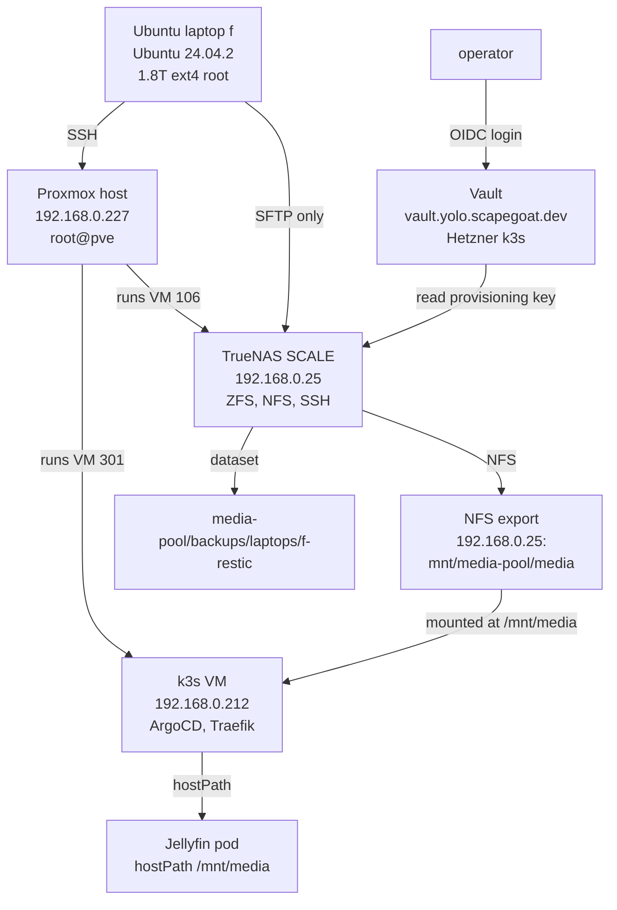

# TrueNAS Backup with Vault: A Systems Integration Case Study

This case study examines the design and partial implementation of a backup system that connects an Ubuntu laptop to a TrueNAS instance running inside a Proxmox homelab. It documents the investigation, the architectural decisions that shaped the system, the security problems identified during the design phase, and the concrete implementation progress to date.

The work began with a single user request: "I want to set up proper backup from this computer to it." The phrase "proper backup" turned out to be a design challenge in disguise. A proper backup is not just a transfer tool with a cron job. It requires a transport that cannot silently fail into a wrong destination, a credential model that does not rely on plaintext secrets, and a scope definition that respects the existing responsibilities of the destination environment. Each of those requirements led to a decision that shaped the whole system.

The result is a design that separates provisioning credentials from runtime backup credentials, uses SFTP as the exclusive backup transport with a mandatory preflight, and keeps the restic client entirely user-owned with no root privileges. The system has moved past initial implementation: the repository is initialized, a smoke backup/restore has succeeded, the TrueNAS user `backup-f` is operational, a first full snapshot exists, a clean incremental snapshot has completed with exit status 0, a restore test passed, and the user timer is enabled. The remaining major work is credential cleanup on Proxmox and broader restore/monitoring hardening.

> [!summary]
> - The laptop has 1.7T of used data on a 1.8T disk, 95% full. Backup scope and excludes are part of the architecture, not an afterthought.
> - The backup transport is SFTP-only with a mandatory preflight that fails closed. No NFS fallback exists. This decision came from a prior Jellyfin outage where a missing NFS mount was silently replaced by an empty local directory.
> - The TrueNAS provisioning API key was moved from plaintext `/root/.truenas_api_key` on Proxmox into Vault at `kv/infra/truenas/provisioning`, using OIDC operator login for authentication.
> - The restic client runs as user `manuel` with all configuration under `~/.config/restic/crib/`, all scripts under `~/.local/bin/`, and scheduling via `systemd --user`.
> - Implementation state: repository initialized (repo `57e82c013a`), smoke backup/restore succeeded (snapshot `a3a15848`), first full snapshot saved with warnings (`be13295c`), clean incremental snapshot succeeded (`b5530e39`), restore test passed, and the user timer is enabled.

## The Trigger

A laptop with 1.7T of used data needs reliable backup. That should be a simple problem. It becomes complicated when the backup destination is not a cloud service with an API, but a network-attached storage system that already serves production media to a Kubernetes cluster, and the laptop is a Framework machine on Ubuntu 24.04.2 with one encrypted 1.8T ext4 root filesystem that is 95% full.

The initial request did not specify what "proper" means. "Proper" had to be defined through investigation, and that investigation revealed four distinct challenges that any backup design would have to address.

### Challenge 1: The laptop's actual data footprint

The first step was measuring what is actually on the laptop. The results were not what a naive assumption would produce:

| Directory | Size | Category |
|-----------|------|----------|
| `/home/manuel/code` | 189G | source trees, workspaces |
| `/home/manuel/.cache` | 188G | caches, regenerable |
| `/home/manuel/Downloads` | 99G | user downloads |
| `/home/manuel/workspaces` | 91G | active projects |
| `/home/manuel/.local` | 62G | local data + caches |
| `/home/manuel/.config` | 31G | config + caches |

The cache and build artifact directories collectively consume over 500G — nearly a third of the used space. A backup that blindly copies everything would waste terabytes per run on data that is cheap to regenerate. The exclude strategy for what gets backed up is part of the architecture, not a configuration detail that can be added later.

The exclude list is stored at `~/.config/restic/crib/excludes` and covers caches (`~/.cache`, `~/.npm/_cacache`, browser caches), build outputs (`node_modules`, `.next`, `dist`, `build`, `target`, `__pycache__`), dependency stores (`.rustup/toolchains`, `.cargo/registry`, `.gradle/caches`), and large non-essential directories (`VirtualBox VMs`, `.docker`). The backup runs `--one-file-system` and targets `/home/manuel` with this exclude set. This keeps the initial backup manageable while preserving the important user data.

### Challenge 2: The destination environment has existing responsibilities

The destination is not a clean empty box. TrueNAS at `192.168.0.25` runs as Proxmox VM `106` with 16GB RAM and 4 cores. It already manages a 3.6T ZFS dataset exported over NFS at `/mnt/media-pool/media`, which is consumed by a Jellyfin media server running on k3s (Proxmox VM `301` at `192.168.0.212`). The Proxmox host at `192.168.0.227` runs seven VMs including the TrueNAS instance, the k3s node, and several stopped test VMs.

Using the existing media NFS export for laptop backups would couple the backup path to the media path. A backup failure could interfere with Jellyfin, and vice versa. The design required a separate TrueNAS dataset from the start. The datasets created for the backup project:

```text
media-pool/backups
media-pool/backups/laptops
media-pool/backups/laptops/f-restic
```

This dataset hierarchy gives the backup a clear namespace within the TrueNAS pool. The restic repository stores its data under `/mnt/media-pool/backups/laptops/f-restic` on the TrueNAS side.

### Challenge 3: A failure mode had already occurred

In May 2026, a power outage took down the TrueNAS VM but the k3s node came back up and mounted an empty local directory at `/mnt/media` instead of the TrueNAS NFS export. Jellyfin served a library whose database paths pointed at files that were not present. The error logs showed FFmpeg `Error opening input: No such file or directory`.

The root cause was that TrueNAS did not have `onboot` enabled. It started manually after the power outage, but k3s had already come up and created an ordinary empty directory where it expected the NFS mount. The Jellyfin pod then mounted that empty directory through its Kubernetes `hostPath` PVC and served a library with no media.

The fix that was applied:

```bash
ssh root@192.168.0.227 '
  qm set 106 --onboot 1 --startup order=10,up=120
  qm set 301 --onboot 1 --startup order=20,up=30
'

# Persist the NFS mount on the k3s node
grep -v "192.168.0.25:/mnt/media-pool/media" /etc/fstab > /tmp/fstab.new
printf "%s\n" "192.168.0.25:/mnt/media-pool/media /mnt/media nfs4 defaults,_netdev,nofail,x-systemd.automount,x-systemd.requires=network-online.target 0 0" >> /tmp/fstab.new
cat /tmp/fstab.new > /etc/fstab
```

This incident is directly relevant to the backup transport design. It demonstrated the class of failure that occurs when a system assumes a directory implies a healthy backing filesystem. The critical insight: **a directory existing is not the same as the intended backing filesystem being mounted**. Any backup transport that relies on a mountpoint can suffer the same silent failure if the script does not verify the backing filesystem before writing.

This is why the backup design rejects NFS mountpoints and uses SFTP directly, combined with a mandatory preflight that fails closed.

### Challenge 4: The credential model was insecure

The TrueNAS system uses API keys for programmatic access. The key lived on the Proxmox host:

```text
/root/.truenas_api_key   (mode 0600, owned by root)
```

This is better than world-readable storage, but it is a plaintext high-power credential in a location where it can be read by anyone who compromises Proxmox root. The concern is not its current protection level — `0600` on root is adequate against lateral movement from other users — but its role as a long-lived secret in a location that offers no audit trail, no short-lived token behavior, and no policy-controlled access.

Moving this credential into Vault would provide policy-controlled, audited, short-lived access. But the backup transport itself should not depend on Vault at runtime. The nightly restic backup uses a separate, low-privilege SFTP user with no Vault dependency. This split means the backups continue working even if Vault is down, and it limits the blast radius of a Vault compromise.

## The Architecture

### The transport decision: SFTP-only, no fallback

The choice of SFTP over NFS for the backup transport was driven by the Jellyfin failure mode. NFS has advantages — it is fast, widely available, and mounts are transparent. But NFS carries a risk that is unacceptable for backup automation: a mountpoint can exist without the intended backing filesystem.

When you mount NFS to `/mnt/backups`, the kernel creates a directory. If the NFS server is down, that directory is still there. It is still empty. A backup script that writes to it will succeed — the writes go nowhere meaningful. The script has no way to know that it is writing to a stale directory rather than the intended NAS.

SFTP has no such ambiguity. The connection either succeeds or fails. If the SSH/SFTP connection to `backup-f@192.168.0.25` fails, the preflight script exits with a non-zero code and the backup does not run. This is the correct behavior: a failed backup run generates a log entry and an alert, while a successful backup to an empty local directory generates neither.

The preflight check in the backup script:

```bash
preflight() {
  command -v restic >/dev/null
  test -r "$RESTIC_PASSWORD_FILE"
  test -r "$RESTIC_EXCLUDE_FILE"
  ssh -i "${HOME}/.ssh/id_restic_crib_f" \
    -o BatchMode=yes \
    -o ConnectTimeout=10 \
    backup-f@192.168.0.25 \
    'test -d /mnt/media-pool/backups/laptops/f-restic'
}
```

If any of these checks fail, the function exits non-zero and the backup stops. There is no fallback path. This is by design. The same preflight is also used by the Vault smoke-test script (`scripts/06-truenas-vault-smoke.sh`), which verifies TrueNAS state using the Vault-stored API key. The smoke test is read-only: it queries TrueNAS, it does not mutate anything.

The architecture diagram shows the complete system:



The diagram makes a structural point clear: Vault only connects to TrueNAS, never to the laptop. The nightly restic backup is a direct SFTP channel from laptop to TrueNAS. Vault's role is limited to provisioning — creating datasets, managing users, and verifying TrueNAS state. If Vault is down, the backup continues. If Vault is compromised, the backup is not affected because it never reads from Vault.

### The tool choice: restic

Restic was chosen over `rsync`, `borg`, `kopia`, `rustic`, and `zfs send/receive` for the phase-1 backup. The decision record:

- `rsync` copies files but provides no deduplication, no versioned snapshots, no encryption, no retention policy.
- `borg` is excellent over SSH with strong deduplication and compression, but restic's SFTP backend provides similar transport with a wider range of backend options (SFTP, REST, S3) useful for a future off-site copy.
- `kopia` has a web UI and good features, but it is not installed and adds operational surface.
- `zfs send/receive` requires the source to be ZFS. The laptop source filesystem is ext4 over LUKS/LVM, so this is not applicable.
- `Proxmox Backup Server` is designed for VM/container backup, not for arbitrary laptop home directories.

Restic provides the five properties needed:

1. Client-side encryption by default (key stored on the laptop).
2. Deduplication and compression (repeated runs are cheap).
3. Incremental snapshots (retention policy via `restic forget`).
4. SFTP backend (no mountpoint ambiguity).
5. Simple restore commands (`restic restore latest --target /tmp/test`).

The restic repository password is stored in `~/.config/restic/crib/password` with mode `0600`. It is a user-owned secret, not a system-owned one. This is consistent with the overall design: no root ownership for the backup client. The password is also escrowed in Vault at `kv/infra/truenas/restic/laptop-f` for recovery purposes.

### The credential model: Vault for provisioning, SFTP for runtime

The system uses two distinct credential models, separated by purpose:

| Use case | Auth method | Vault dependency |
|----------|-------------|-----------------|
| Operator provisioning | `vault login -method=oidc role=operators` | required |
| Nightly restic backup | SFTP `backup-f` | none |
| Headless automation | AppRole (future) | required |

The Vault instance at `vault.yolo.scapegoat.dev` is deployed from the Hetzner k3s GitOps repository at `/home/manuel/code/wesen/2026-03-27--hetzner-k3s/gitops/applications/vault.yaml`. It uses AWS KMS for auto-unseal, integrated raft for storage, and OIDC via Keycloak for operator authentication. The version is `1.21.2`.

The TrueNAS API key is stored at `kv/infra/truenas/provisioning`. The policy scope is read-only to that single path. The restic repository password is stored separately at `kv/infra/truenas/restic/laptop-f` with a separate scope. This separation means a breach of the provisioning policy does not automatically expose the backup repository password.

The nightly restic backup never reads from Vault. The backup script runs entirely under user `manuel`, uses the SFTP key in `~/.ssh/id_restic_crib_f`, and never contacts Vault. This means backups work when Vault is down.

## The Environment

### Laptop `f`

```text
hostname: f
OS: Ubuntu 24.04.2 LTS
model: Framework Laptop
kernel: Linux 6.8.0-124-generic
root: encrypted LUKS -> LVM -> ext4
root filesystem: 1.8T total, 1.7T used, 101G free, 95% used
```

The laptop is a Framework Laptop with encrypted root. The LUKS/LVM/ext4 stack means ZFS send/receive is not applicable. The encryption protects data at rest but does not affect the backup strategy, which runs entirely within the unlocked user space.

### Homelab topology

The Proxmox host at `192.168.0.227` is reachable via Tailscale as `pve.tail879302.ts.net` and by direct LAN IP. SSH authentication to Proxmox works for both `root@pve` and `root@192.168.0.227`.

TrueNAS is Proxmox VM `106` at `192.168.0.25`. It responds on TCP ports `22`, `80`, and `443`. It exports `/mnt/media-pool/media` to `192.168.0.0/24` over NFS. The TrueNAS version is `23.10.2` (TrueNAS-SCALE). It has 16GB RAM and 4 cores.

k3s is Proxmox VM `301` at `192.168.0.212`, reachable over Tailscale at `100.67.90.12`. It runs ArgoCD, Traefik, cert-manager, and Jellyfin. Jellyfin consumes the TrueNAS NFS export through a Kubernetes `hostPath` PVC at `/mnt/media`.

### The Vault integration

The Vault instance is hosted on a separate cluster — the Hetzner k3s. The ArgoCD application is defined at:

```text
/home/manuel/code/wesen/2026-03-27--hetzner-k3s/gitops/applications/vault.yaml
```

The Vault Secrets Operator (VSO) is deployed at:

```text
/home/manuel/code/wesen/2026-03-27--hetzner-k3s/gitops/applications/vault-secrets-operator.yaml
```

The Vault OIDC configuration is validated by:

```text
/home/manuel/code/wesen/2026-03-27--hetzner-k3s/scripts/validate-vault-oidc-config.sh
```

Terraform manages DNS for `*.yolo` and Vault auth policies for GitHub Actions:

```text
/home/manuel/code/wesen/terraform/dns/zones/scapegoat-dev/envs/prod/main.tf
/home/manuel/code/wesen/terraform/vault/github-actions/envs/k3s/
```

## Credential Migration: From Plaintext to Vault

The most significant security change was moving the TrueNAS API key from plaintext on Proxmox into Vault. This section documents the migration procedure that was executed, including the exact steps and the rationale for each.

### The source: `/root/.truenas_api_key`

The TrueNAS API key lived on the Proxmox host at `/root/.truenas_api_key`. It is mode `0600`, owned by root. It is used to create TrueNAS datasets, manage users, and query system state via the TrueNAS REST API.

The concern is not its current protection level — `0600` on root is adequate against lateral movement from other users — but its role as a high-power credential in a location where it can be read by anyone who compromises Proxmox root.

### The target: `kv/infra/truenas/provisioning`

The Vault KV path was chosen as `kv/infra/truenas/provisioning`. The secret contains:

```text
api_url: "https://192.168.0.25"
api_key: "<the TrueNAS API key>"
purpose: "CRIB-BACKUP-01 TrueNAS provisioning"
owner: "manuel"
rotation_note: "Rotate after removing /root/.truenas_api_key from Proxmox"
```

### The migration procedure

The migration was performed using this exact sequence:

```bash
# 1. Authenticate to Vault with OIDC
export VAULT_ADDR=https://vault.yolo.scapegoat.dev
vault login -method=oidc role=operators

# 2. Read the key from Proxmox into a shell variable (never printing it)
truenas_api_key="$(ssh root@192.168.0.227 'cat /root/.truenas_api_key')"

# 3. Store it in Vault
vault kv put kv/infra/truenas/provisioning \
  api_url="https://192.168.0.25" \
  api_key="${truenas_api_key}" \
  purpose="CRIB-BACKUP-01 TrueNAS provisioning" \
  owner="manuel"

# 4. Clear the shell variable
unset truenas_api_key
```

The key is never echoed to stdout. The shell variable `truenas_api_key` is unset immediately after the Vault write. This ensures the key does not remain in the shell history or in `/proc/$$/environ` after the migration command completes.

### Verification

After seeding Vault, the smoke-test script was used to verify that the Vault-stored key can access TrueNAS:

```bash
./ttmp/2026/06/06/CRIB-BACKUP-01--ubuntu-to-proxmox-truenas-backup-design/scripts/06-truenas-vault-smoke.sh
```

The output confirmed:

```text
TrueNAS API URL: https://192.168.0.25
Vault path: kv/infra/truenas/provisioning

-- system info --
{"version":"TrueNAS-SCALE-23.10.2","hostname":"truenas","system_product":"Standard PC"}

-- backup dataset --
{"id":"media-pool/backups/laptops/f-restic","name":"f-restic",
"mountpoint":"/mnt/media-pool/backups/laptops/f-restic","type":"FILESYSTEM"}

-- backup user --
[]
```

The empty `backup-f` user array means the dataset exists but the SFTP runtime user has not yet been created. This is the expected intermediate state.

## The SFTP User: Creating `backup-f`

The runtime backup credential is a dedicated TrueNAS user called `backup-f`. It is created through the TrueNAS API using the Vault-stored provisioning key.

### The creation procedure

```bash
# Read credentials from Vault
api_url="$(vault kv get -field=api_url kv/infra/truenas/provisioning)"
api_key="$(vault kv get -field=api_key kv/infra/truenas/provisioning)"
api_url="${api_url%/}"

# Get the next available UID
uid="$(curl -fsS -k -H "Authorization: Bearer ${api_key}" \
  "${api_url}/api/v2.0/user/get_next_uid")"

# Get the laptop's SSH public key
pubkey="$(cat ~/.ssh/id_restic_crib_f.pub)"

# Create the user
payload="$(jq -nc \
  --arg username 'backup-f' \
  --arg full_name 'Laptop f restic SFTP backup user' \
  --arg shell '/usr/bin/bash' \
  --arg home '/mnt/media-pool/backups/laptops/f-restic' \
  --arg sshpubkey "$pubkey" \
  --argjson uid "$uid" \
  '{username:$username, full_name:$full_name, uid:$uid, group_create:true,
    password_disabled:true, shell:$shell, home:$home, home_create:false,
    sshpubkey:$sshpubkey, smb:false}')"

curl -sS -k -X POST -H "Authorization: Bearer ${api_key}" \
  -H 'Content-Type: application/json' -d "$payload" \
  "${api_url}/api/v2.0/user"
```

The API returned user id `72` and uid/gid `3001`.

### Verification

```bash
ssh -i ~/.ssh/id_restic_crib_f \
  -o BatchMode=yes \
  -o ConnectTimeout=10 \
  backup-f@192.168.0.25 'pwd; id; touch /mnt/media-pool/backups/laptops/f-restic/.sftp-write-test; rm /mnt/media-pool/backups/laptops/f-restic/.sftp-write-test; echo sftp-preflight-ok'
```

Output:

```text
/mnt/media-pool/backups/laptops/f-restic
uid=3001(backup-f) gid=3001(backup-f) groups=3001(backup-f)
sftp-preflight-ok
```

The user is verified: it can SSH, it can list the dataset, and it can write and delete files.

### User shape

| Property | Value |
|----------|-------|
| username | `backup-f` |
| uid/gid | `3001` |
| home | `/mnt/media-pool/backups/laptops/f-restic` |
| shell | `/usr/bin/bash` |
| password disabled | `true` |
| SMB disabled | `false` |
| locked | `false` |

## The SFTP Integration: A Debugging Story

The most significant debugging challenge was the SFTP integration between restic and TrueNAS. This section documents the problem, the investigation, and the resolution, because it illustrates a broader lesson: a successful SSH connection test does not imply a successful restic backup, even when the same credentials are used.

### The problem

The first `restic init` attempt failed with this error:

```text
Fatal: create repository at sftp:backup-f@192.168.0.25:/mnt/media-pool/backups/laptops/f-restic failed: unable to start the sftp session, error: error receiving version packet from server: server unexpectedly closed connection: unexpected EOF
```

This was confusing because OpenSSH `sftp` worked perfectly with the same credentials:

```bash
printf 'pwd\nls -la\n' | sftp -i ~/.ssh/id_restic_crib_f -o BatchMode=yes backup-f@192.168.0.25
```

The OpenSSH SFTP client connects, negotiates extensions, and returns a working session. Restic, using the same credentials and the same SSH key, gets an `unexpected EOF`.

### The investigation

The environment file was originally configured with:

```bash
RESTIC_SFTP_COMMAND="ssh -i ${HOME}/.ssh/id_restic_crib_f -o BatchMode=yes"
```

After quoting the value correctly, the `RESTIC_SFTP_COMMAND` still failed. Testing showed that plain OpenSSH `sftp` connects successfully:

```bash
# This works
sftp -vvv -i ~/.ssh/id_restic_crib_f -o BatchMode=yes backup-f@192.168.0.25 <<'EOF'
pwd
ls -la
EOF
```

The debug output from the `sftp` command confirmed:

```text
debug1: Sending subsystem: sftp
debug3: send packet: type 98
debug3: client_repledge: enter
debug1: pledge: fork
debug2: channel_input_status_confirm: type 99 id 0
debug2: subsystem request accepted on channel 0
```

The OpenSSH `sftp` client sends a `subsystem: sftp` request and receives `type 99: subsystem request accepted`. Restic uses a different SSH client library (`github.com/pkg/sftp`), which does not always negotiate the SFTP subsystem the same way.

### The solution

Restic exposes SFTP configuration as backend options. The correct way to pass SSH identity options is:

```bash
restic -o "sftp.args=-i ~/.ssh/id_restic_crib_f -o BatchMode=yes -o IdentitiesOnly=yes" init
```

The `sftp.args` option is passed directly to restic's internal SSH client, which then uses those arguments to establish the SFTP session. The `IdentitiesOnly=yes` flag ensures that only the specified key is used, avoiding confusion with any other keys in the SSH agent.

### The lesson

OpenSSH `sftp` and restic's SFTP backend do not exercise exactly the same client path. The OpenSSH `sftp` command is a well-tested, widely-used client that negotiates extensions robustly. Restic's SFTP backend is built on `github.com/pkg/sftp`, which has different behavior in some edge cases.

A successful `ssh` connection test does not imply a successful `restic -o sftp.args=...` session. The preflight test uses `ssh` directly (which works), and the backup command uses `restic -o "sftp.args=..."` (which also works once configured correctly). The two paths serve different purposes: the preflight verifies basic connectivity, and the backup command exercises the restic-specific transport.

## The Implementation State

### What is done

The laptop-side restic client is configured and the repository has been initialized:

- `restic 0.16.4` is installed.
- `~/.config/restic/crib/env` — restic environment with `RESTIC_SFTP_ARGS`.
- `~/.config/restic/crib/password` — generated, mode `0600`, escrowed in Vault.
- `~/.config/restic/crib/excludes` — exclude list.
- `~/.local/bin/restic-crib-backup` — backup script with preflight, backup, retention, and check functions.
- `~/.config/systemd/user/restic-crib-backup.service` — user service, disabled.
- `~/.config/systemd/user/restic-crib-backup.timer` — user timer, disabled.
- `~/.ssh/id_restic_crib_f` — dedicated ED25519 SSH key.
- Restic repository `57e82c013a` — initialized.
- Smoke snapshot `a3a15848` — proved backup/restore path works.
- Warning full snapshot `be13295c` — processed 709.457 GiB and saved a full snapshot but exited status 3 due to unreadable generated/service-owned files.
- Clean incremental snapshot `b5530e39` — processed 668.281 GiB, stored 995 MiB of new data, exited status 0, and became the clean operational baseline.
- Restore test from `b5530e39` — restored the CRIB-BACKUP scripts directory and `~/.ssh/id_restic_crib_f.pub`, then verified file count and public-key content.

The restic repository is initialized at:

```text
sftp:backup-f@192.168.0.25:/mnt/media-pool/backups/laptops/f-restic
```

The smoke backup included a single file (`hello.txt`) with the content:

```
crib restic smoke test 2026-06-06T22:29:54-04:00
```

The smoke restore confirmed that the file was correctly recovered to `/home/manuel/.local/state/restic/smoke-restore/home/manuel/.local/state/restic/smoke-source/hello.txt`.

TrueNAS-side resources:

```text
media-pool/backups
media-pool/backups/laptops
media-pool/backups/laptops/f-restic
backup-f uid=3001 gid=3001 home=/mnt/media-pool/backups/laptops/f-restic
```

Vault secrets:

```text
kv/infra/truenas/provisioning — TrueNAS API key (version 1)
kv/infra/truenas/restic/laptop-f — restic password escrow (version 1)
```

### What is not done

- `/root/.truenas_api_key` on Proxmox has not been rotated or deleted. This is still the operational key. The Vault-stored key is a copy; the plaintext key should be rotated (new TrueNAS API key generated) or deleted now that Vault-managed access and restic backups are proven.
- An off-site copy has not been implemented. A future Terraform-managed bucket (`scapegoat-k3s-backups`) could serve as phase 2.
- Stale-backup monitoring has not been implemented. The timer is enabled, but there is not yet an alert if scheduled backups stop running.

### Current state diagram

```text
┌─────────────────────────────────────────────────┐
│  Laptop `f` — restic client configured          │
│  • restic installed                              │
│  • scripts in ~/.local/bin                       │
│  • config in ~/.config/restic/crib               │
│  • systemd --user timer installed, enabled       │
│  • SSH key: id_restic_crib_f (ED25519)          │
│  • password generated + Vault-escrowed           │
│  • repository initialized: 57e82c013a            │
│  • smoke backup/restore succeeded: a3a15848      │
│  • full warning snapshot: be13295c                │
│  • clean baseline snapshot: b5530e39              │
│  • restore test passed                            │
│                                                 │
│  TrueNAS — dataset and user created              │
│  • media-pool/backups/laptops/f-restic exists    │
│  • backup-f uid/gid 3001, SSH authorized        │
│  • SFTP write/delete verified                    │
│                                                 │
│  Vault — provisioning + restic escrow stored      │
│  • kv/infra/truenas/provisioning ✓              │
│  • kv/infra/truenas/restic/laptop-f ✓           │
│  • OIDC operator login works                    │
│  • smoke test script: read-only ✓               │
│                                                 │
│  Next: rotate/delete Proxmox TrueNAS API key      │
└─────────────────────────────────────────────────┘
```

## The Complete Backup Run Sequence

The backup run follows this sequence when the systemd timer fires:

```
1. systemd --user timer fires
2. restic-crib-backup script starts
3. Preload environment: ~/.config/restic/crib/env
4. Preload SFTP args: export RESTIC_SFTP_ARGS
5. Preflight:
   a. restic binary exists
   b. password file is readable (~/.config/restic/crib/password)
   c. exclude file is readable
   d. SSH to backup-f@192.168.0.25 succeeds
      → test -d /mnt/media-pool/backups/laptops/f-restic
      → FAIL HERE: stop, do not continue
   e. All checks pass: proceed
6. restic -o "sftp.args=${RESTIC_SFTP_ARGS}" backup /home/manuel \
      --one-file-system \
      --exclude-file ~/.config/restic/crib/excludes \
      --tag laptop-f
7. restic -o "sftp.args=${RESTIC_SFTP_ARGS}" forget \
      --keep-hourly 24 --keep-daily 14 --keep-weekly 8 --keep-monthly 24 --prune
8. restic -o "sftp.args=${RESTIC_SFTP_ARGS}" check --read-data-subset=5%
9. Log: "finished crib restic backup"
```

Step 5d is the critical gate. If it fails, steps 6-9 never execute. The backup is cleanly skipped rather than running to a wrong destination. This is the safety invariant that the Jellyfin incident taught us to value.

## Working Rules

These rules have emerged from the investigation and implementation:

- **SFTP only.** No NFS fallback exists. If the SFTP preflight fails, the backup stops. A failed run is a log entry and an alert. A successful backup to the wrong place is a data integrity failure. Choose failure over silent corruption.
- **User-owned client.** The backup runs as user `manuel`. No root-owned scripts, no `/etc` configuration, no system-level systemd units. This limits the blast radius of backup script bugs and simplifies credential management.
- **Vault for provisioning, not for runtime backups.** The TrueNAS API key lives in Vault for administrative access. The nightly restic backup does not read from Vault. This means backups work when Vault is down and Vault is not a single point of failure for data safety.
- **Exclude before backup.** The laptop is 95% full. The exclude list prevents backing up regenerable caches and build outputs. The first backup run is the most expensive — subsequent runs are cheap due to deduplication.
- **Test restores quarterly.** A backup that cannot be restored is not a backup. The restore test should cover user data, `.ssh` metadata (to verify permission preservation), and an older file version.
- **Never commit secrets.** The restic password file, SSH private keys, Vault tokens, and the TrueNAS API key are never committed. They live in user-owned files, the password manager, or Vault.

## Anti-Patterns Encountered

Several patterns appeared during investigation that should be avoided in future implementations:

- **Don't assume SSH connectivity implies SFTP compatibility.** OpenSSH `sftp` and restic's SFTP backend exercise different client code paths. A successful `ssh` test does not guarantee a successful `restic -o sftp.args=...` session.
- **Don't store high-power credentials as plaintext files on shared hosts.** `/root/.truenas_api_key` on Proxmox was readable by any root user on the Proxmox host. Vault provides policy-scoped access.
- **Don't use mountpoints for backup transports on shared infrastructure.** The Jellyfin incident showed that a directory exists check does not verify the backing filesystem. SFTP provides a binary connectivity test.
- **Don't skip the restore test.** A backup that has never been restored is an unproven assumption. The smoke backup/restore proved the path works; the full backup/restore must prove it works at scale.

## Future Work

Several items remain to complete the system:

1. **Verify the first scheduled timer run** after `2026-06-09 03:30 EDT` and confirm it creates a clean scheduled snapshot.
2. **Rotate or delete `/root/.truenas_api_key`** from Proxmox after confirming Vault-managed access remains healthy.
3. **Add monitoring/alerting** for stale backups — a backup that has not run in 48 hours should generate an alert.
4. **Run a larger restore test** against a real project or document directory, beyond the small representative restore already completed.
5. **Implement an off-site copy** as phase 2, possibly using the existing Terraform-managed bucket `scapegoat-k3s-backups` in Hetzner Object Storage.

## References

- `/home/manuel/code/wesen/claw-stuff/ttmp/2026/06/06/CRIB-BACKUP-01--ubuntu-to-proxmox-truenas-backup-design/` — CRIB-BACKUP-01 ticket with full design docs, scripts, and diary.
- `/home/manuel/code/wesen/go-go-golems/go-go-parc/Projects/2026/05/03/ARTICLE - Postmortem - Jellyfin TrueNAS NFS Power Outage.md` — the incident that shaped the SFTP-only, no-fallback design.
- `/home/manuel/code/wesen/2026-03-27--hetzner-k3s/gitops/applications/vault.yaml` — live Vault deployment manifest.
- `/home/manuel/code/wesen/2026-03-27--hetzner-k3s/gitops/applications/vault-secrets-operator.yaml` — VSO deployment.
- `/home/manuel/code/wesen/2026-03-27--hetzner-k3s/scripts/validate-vault-oidc-config.sh` — OIDC config validation.
- `/home/manuel/code/wesen/terraform/storage/platform/k3s-backups/envs/prod/` — Hetzner Object Storage Terraform (future off-site copy).
- `/home/manuel/code/wesen/go-go-golems/go-go-parc/Projects/2026/06/06/ARTICLE - Backup Architecture - TrueNAS with Vault Credentials.md` — companion architecture article.
