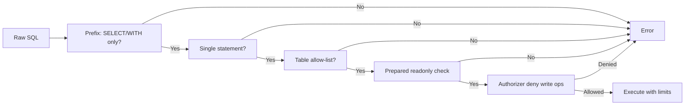

# Minitrace Viz API Redesign: Normalized SQL and Fluent Goja Builders

This article explains how the Minitrace Viz project migrated from an accumulated collection of custom query languages, typed lenses, and report DSLs into a single, clean API centered on normalized SQLite and a fluent Goja builder. The redesign is documented in MINIVIZ-002.

## Why this note exists

The previous Minitrace Viz prototype had grown too many parallel analysis surfaces:

- A JavaScript trace query DSL for structural questions
- A typed JS lens registry with six supported return types
- Temporary SQL view materialization over uploaded sessions
- Raw SQL execution endpoints using the same views
- An API workbench page, a guided walkthrough page, and a showcase endpoint
- Go-backed report presets with built-in lenses and a report builder

Each surface worked independently, but together they created a system where a user had to learn five different ways to ask the same question about a minitrace session. The complexity made it unclear which API was the recommended one, and future contributors would add new features to whichever surface was most convenient.

The goal was to keep the useful Go-backed report presets, the turn-block JSON endpoint, and the HTML turn-block renderer. Everything else was either removed or replaced with a normalized SQL layer that anyone could query directly.

## When to use this pattern

This pattern applies when:

- a project has accumulated exploratory APIs, DSLs, or query languages as it grows
- the exploratory surfaces serve overlapping purposes but each has slightly different ergonomics
- new contributors add features to whichever surface is easiest, making the system harder to navigate
- you need to preserve existing working functionality while replacing the messy surface with something simpler

Do not use this pattern when:

- the exploratory surfaces serve fundamentally different audiences (e.g. a UI developer vs. a data scientist vs. a CLI user)
- the complexity is necessary and removing it would break production workflows that depend on it
- the system is small enough that a few parallel APIs do not create confusion

## Core mental model

The redesigned API rests on two ideas:

- A single, normalized relational schema captures all minitrace session data. This schema is not a projection for one specific UI. It is the canonical representation that all downstream consumers—SQL queries, Goja scripts, Go services—draw from.
- The Goja API is a fluent builder that materializes sessions into that schema. The builder is the only way to access data from JavaScript. The old approach of exposing pre-loaded tables through ambient host connections is replaced by `mt.db()` builders that own their own lifecycle.

The key insight is that normalization and composition are simpler than building a query language. Once data lives in normalized tables, any analysis can be expressed in SQL. The only question is how to get the data into those tables, and the builder pattern answers that with a small, composable API.

## Architecture

### Before: five surfaces

The old system had these components:

1. **Upload page** — accepts JSONL or JSON, stores sessions
2. **Go-backed report presets** — built-in lens compositions rendered as markdown/HTML
3. **JS trace query DSL** — JavaScript functions that returned structural datasets
4. **Typed JS lens registry** — six return types validated at runtime: `dataset`, `sections`, `view`, `node`, `table`, `map`
5. **Normalized SQL views** — temporary JSON materialization, DuckDB `read_json_auto`, example queries
6. **Raw SQL endpoints** — POST `/api/sql/:id/select` over the same views
7. **Workbench / Walkthrough pages** — interactive exploration pages that consumed all the surfaces above
8. **Showcase endpoint** — a single endpoint that returned results from all surfaces

Each surface was independent. A developer could add a new lens, a new DSL function, a new SQL view, a new query example, or a new report preset, and the system would accept it without any coherence check.

### After: one surface

The redesigned system has two components:

1. **Normalized SQLite schema** — one set of tables capturing session, turn, tool call, file, event, and metric data.
2. **`mt.db()` fluent builder** — the only way to access data from JavaScript. The builder accepts file paths, content strings, directories, and globs; auto-converts supported JSONL formats; materializes sessions into SQLite; and returns a handle with `query`, `queryOne`, and `queryResult` methods.

The old JS query DSL, lens registry, workbench page, walkthrough page, and showcase endpoint are removed. The old report presets and turn-block endpoints are retained.

```mermaid
flowchart TD
    subgraph "Input"
        A[JSONL / JSON / .minitrace.json]
    end
    
    subgraph "mt.db() Builder"
        B[.File / .Dir / .Glob / .Content / .AutoConvert]
        C[SQLite in-memory materialization]
    end
    
    subgraph "Output"
        D[Normalized SQLite tables]
        E[query() / queryOne() / queryResult()]
    end
    
    A --> B
    B --> C
    C --> D
    D --> E
    
    subgraph "Retained from old system"
        F[Go-backed report presets]
        G[Turn block JSON/HTML endpoints]
    end
    
    D -.-> F
    D -.-> G
```

### Normalized schema

The schema captures seven entities. The `sessions` table is the core; all other tables relate to it.

| Table | Primary key | Rows per session | Purpose |
|-------|-------------|------------------|---------|
| `sessions` | `session_id` | 1 | Top-level session metadata |
| `turns` | `session_id, turn_index` | N (turns) | Conversational turns with role, content, tokens |
| `tool_calls` | `session_id, tool_call_id` | N (tools) | Individual tool invocations with arguments and results |
| `turn_tool_calls` | `session_id, turn_index, ordinal` | N (tools per turn) | Join table preserving which tool calls belong to which turn and their ordinal |
| `files` | composite | N (file touches) | File paths touched by tool calls with operation type |
| `metrics` | `session_id` | 1 | Aggregate metrics: turn count, tool call count, token totals |
| `events` | `session_id, event_id` | N (turns + tools) | Timeline rows for turn-block UI rendering |

Each table has a `CREATE TABLE` statement with all relevant columns. Every table also has a `raw_json` column that stores the full source object for that row, allowing queries to access nested fields without losing information.

The schema has a single version string: `"normalized-sqlite-v1"`. There is no migration path between versions because the system is in early development. When versioning becomes necessary, the schema package will define a `VersionedSchema` type that carries version-specific table descriptors.

### Indexes

Six indexes support common queries. They are created when `CreateSchema` runs.

| Index | Table | Columns | Purpose |
|-------|-------|---------|---------|
| `idx_turns_session_role` | turns | session_id, role | Group turns by role for a session |
| `idx_tool_calls_session_turn` | tool_calls | session_id, emitting_turn_index | Join tool calls to emitting turns |
| `idx_tool_calls_tool_operation` | tool_calls | tool_name, operation_type | Query tool usage distribution |
| `idx_files_path` | files | path | File access patterns across sessions |
| `idx_events_session_turn` | events | session_id, turn_index, ordinal | Timeline ordering |
| `idx_events_kind` | events | kind | Filter events by type |

These indexes cover the queries that appear in the migrated showcase examples. They may need to be refined as new analysis patterns emerge.

## The `mt.db()` Builder

### API shape

The builder follows a fluent pattern borrowed from goja-text. Each method returns the builder, allowing chaining.

```js
const mt = require("minitrace");

const db = mt.db()
  .File("./sample-pi-session.jsonl")
  .AutoConvert(true)
  .SQLiteMemory()
  .Build();

const rows = db.query(`
  SELECT tool_name, COUNT(*) AS calls
  FROM tool_calls
  GROUP BY tool_name
  ORDER BY calls DESC
`);

db.close();
```

The builder methods fall into three categories:

1. **Source selection** — which files or content to load:
   - `.File(path)` — single file
   - `.Files(paths)` — multiple files
   - `.Dir(path)` — recursively scan for `.minitrace.json` and `.jsonl` files
   - `.Glob(pattern)` — `filepath.Glob` pattern
   - `.Content(content, nameOrOptions)` — raw content string with optional name
   - `.Archive(path)` — alias for `.File(path)` for archive-style loading
   - `.RuntimeArchives()` — load runtime-provided archive globs (used by JS query commands)

2. **Configuration** — how to load and query:
   - `.SQLiteMemory()` — use SQLite in-memory (default)
   - `.MaxRows(n)` — limit query results to n rows
   - `.MaxColumns(n)` — limit columns per row to n
   - `.MaxCellChars(n)` — truncate cell values to n characters
   - `.Timeout(ms)` — query execution timeout
   - `.RequireOrderBy(enabled)` — require ORDER BY in SELECT queries
   - `.AutoConvert(enabled)` — auto-detect and convert Pi/Codex/Claude Code JSONL
   - `.StrictConversion(enabled)` — fail on first source error (default true)

3. **Lifecycle** — execute and clean up:
   - `.Validate()` — check configuration, return errors
   - `.Build()` — materialize and return the DB handle
   - `.close()` — close the underlying database

### Builder internals

The builder maintains a `sources` array of `dbSource` structs. Each source has a kind (`"file"`, `"content"`), a path or name, and optionally raw content. The `Build()` method iterates sources, loads each one through an auto-conversion pipeline, and materializes sessions into the SQLite database.

The auto-conversion pipeline works as follows:

1. Try to parse as native minitrace JSON (checks for `id` plus minitrace-specific fields like `provenance.source_format`)
2. If that fails and `AutoConvert(true)`, parse as JSONL
3. Detect JSONL format by inspecting record types:
   - `session`, `message`, `model_change` → Pi JSONL → `pi` adapter
   - `session_meta`, `response_item`, `event_msg` → Codex JSONL → `codex` adapter
   - `system`, `user`, `assistant` with `message` content → Claude Code JSONL → `claude-code` adapter
4. If no known format matches, return an error
5. Run the adapter's converter to produce a `minitrace.Session`
6. Materialize the session into normalized tables

### Strict vs non-strict conversion

The builder has two conversion modes:

- **Strict** (default): any source failure causes `Build()` to return an error. Useful when you expect all sources to be valid.
- **Non-strict** (`StrictConversion(false)`): source failures produce diagnostics on the handle, and valid sources continue to load. Useful when working with mixed-validity input.

```js
const db = mt.db()
  .File("valid.jsonl")
  .Content("not json", "bad.txt")
  .StrictConversion(false)
  .Build();

db.diagnostics().forEach(d => console.log(d.severity, d.message));
//  error  not json
//  info   converted source into minitrace session

db.query("SELECT COUNT(*) AS n FROM sessions");
// [{ n: 1 }]
```

### DB handle

The handle returned by `Build()` exposes:

- `query(sql, ...args)` — return array of row maps
- `queryOne(sql, ...args)` — return first row map
- `queryResult(sql, ...args)` — return envelope with columns, rows, count, truncated flag, and error
- `schema()` — return schema descriptor with version, dialect, and table definitions
- `tables()` — return array of table descriptors
- `stats()` — return object with schema version, dialect, and table count
- `sources()` — return array of loaded source descriptors
- `diagnostics()` — return array of conversion diagnostics
- `close()` — close the database

All returned objects are JSON-normalized maps with lower-case keys matching JSON tags.

### Read-only query runner

The `query` and `queryOne` methods go through a read-only SQL runner with multiple defense layers:

1. **Prefix validation** — accepts only `SELECT` and `WITH` queries (with or without trailing whitespace)
2. **Statement count** — rejects multiple statements (semicolon-separated)
3. **Allow-list** — rejects queries referencing tables not in the normalized schema
4. **Prepared statement readonly check** — uses SQLite's `SQLiteStmt.Readonly()` to verify the query cannot modify data
5. **Connection-level authorizer** — denies `INSERT`, `UPDATE`, `DELETE`, `PRAGMA`, `CREATE`, `DROP`, and `TRANSACTION` operations at execution time
6. **Row/column/cell limits** — configurable limits on result size



## Migration: from legacy to mt.db()

The migration replaced every `mt.legacy.query()` call in checked-in JS commands with `mt.db().RuntimeArchives().Build().query()`. The old ambient host-table connection was removed from the module exports entirely.

### Before: legacy host-table queries

```js
function sessionList(filters) {
  const mt = require("minitrace");
  return mt.legacy.query(`
    SELECT id, title, environment->>'agent_framework' AS framework
    FROM ${mt.legacy.tableName}
    WHERE 1=1
    AND (environment->>'agent_framework') IN (...)
    ORDER BY timing->>'started_at' DESC
    LIMIT ${filters.limit}
  `);
}
```

The old queries used DuckDB JSON-arrow operators (`->>`, `UNNEST`) to access nested fields from pre-loaded archive tables. The table name came from `mt.legacy.tableName`, and queries had to use DuckDB-specific syntax.

### After: normalized SQL queries

```js
function sessionList(filters) {
  const mt = require("minitrace");
  const db = mt.db().RuntimeArchives().Build();
  return db.query(`
    SELECT session_id AS id, title, agent_framework AS framework
    FROM sessions
    WHERE 1=1
    AND agent_framework IN (...)
    ORDER BY started_at DESC
    LIMIT ${filters.limit}
  `);
}
```

The new queries use standard SQLite column names. Nested fields are flattened into columns during materialization. The `RuntimeArchives()` method loads archive globs passed from the command runtime into the builder.

### SQL rewriting patterns

The migration required rewriting several SQL patterns:

| Old (DuckDB nested) | New (Normalized) |
|---------------------|------------------|
| `environment->>'agent_framework'` | `agent_framework` |
| `metrics->>'tool_call_count'` | `tool_call_count` |
| `timing->>'started_at'` | `started_at` |
| `UNNEST(tool_calls) AS t(call)` | `JOIN sessions s ON s.session_id = t.session_id` |
| `UNNEST(turns) AS t(turn)` | `JOIN sessions s ON s.session_id = t.session_id` in turns table |
| `${mt.legacy.tableName}` | `sessions` (direct table reference) |

The old `mt.sql.stringIn()` helper remains available for constructing SQL parameter lists from JavaScript arrays. The old `mt.sql.like()` and `mt.sql.string()` helpers remain available.

## Common failure modes

### Auto-conversion detects wrong format

If a JSONL file has a first record that happens to have an `id` field, the auto-conversion may try to parse it as native minitrace JSON before checking JSONL format. The fix in the schema is to require minitrace-specific fields (like `provenance.source_format` or `turns`) beyond just `id` before treating content as native.

### SQLite authorizer blocks valid queries

The authorizer denies `PRAGMA` operations at execution time. This is intentional — `PRAGMA foreign_keys=ON` is set once during schema creation, not during user queries. If a user query includes a `PRAGMA` clause (which is unusual but possible in complex SQL), it will be blocked.

### Runtime archives not configured

The `.RuntimeArchives()` method requires the module loader to pass archive globs through `RuntimeSettings.ArchiveGlob`. If a JS command runs without archive globs, `.RuntimeArchives()` returns an error. The serve handler now passes `settings.ArchiveGlob` through to the runtime settings, but custom command runners may need to set this explicitly.

### SELECT followed by newline rejected

The query validator initially accepted `SELECT ` (with a space) but not `SELECT\n` (with a newline). Template literals in JavaScript produce multi-line strings, so `SELECT\n` is common. The fix was to check for any whitespace character after the prefix keyword: space, tab, newline, or carriage return.

## Working rules

- **Normalized tables first.** If a question can be answered with a query over the normalized tables, do not add a new lens, DSL function, or view.
- **One builder, one DB.** Each `mt.db().Build()` call creates an isolated SQLite database. The same builder should not be called twice for the same sources without calling `.close()` first.
- **Raw JSON preservation.** Every table row has a `raw_json` column. Queries that need nested fields not yet captured by scalar columns should read from this column.
- **No backwards compatibility wrappers.** The old `mt.legacy` API is removed. There are no migration paths, adapter layers, or deprecation warnings. This was intentional.
- **Query safety in layers.** No single layer prevents all attacks. The validator, allow-list, prepared statement check, and authorizer all contribute to the defense. Future changes should update all layers, not just one.

## Examples

### Count sessions by agent framework

```js
const mt = require("minitrace");
const db = mt.db().RuntimeArchives().Build();
const rows = db.query(`
  SELECT
    agent_framework,
    COUNT(*) AS session_count,
    AVG(tool_call_count) AS avg_tool_calls
  FROM sessions
  GROUP BY agent_framework
  ORDER BY session_count DESC
`);
db.close();
```

### Find sessions with failed tool calls

```js
const mt = require("minitrace");
const db = mt.db().RuntimeArchives().Build();
const rows = db.query(`
  SELECT
    s.session_id,
    s.title,
    COUNT(t.tool_call_id) AS failed_count
  FROM tool_calls t
  JOIN sessions s ON s.session_id = t.session_id
  WHERE t.success = 0
  GROUP BY s.session_id, s.title
  ORDER BY failed_count DESC
`);
db.close();
```

### Build session shape summary

```js
const mt = require("minitrace");
const db = mt.db().RuntimeArchives().Build();

const baseRows = db.query(`
  SELECT session_id, title, tool_call_count, turn_count
  FROM sessions
  ORDER BY tool_call_count DESC
  LIMIT 20
`);

const toolRows = db.query(`
  SELECT session_id, tool_name, COUNT(*) AS uses
  FROM tool_calls
  GROUP BY session_id, tool_name
  ORDER BY uses DESC
`);

const roleRows = db.query(`
  SELECT session_id, role, COUNT(*) AS count
  FROM turns
  GROUP BY session_id, role
  ORDER BY count DESC
`);

db.close();
```

## Related notes

- [[PROJ - ZK Tool]] — reference note for project note structure
- [[ARTICLE - Playbook - Self-Contained Go Wasm and JavaScript Browser Applications]] — reference note for the article/playbook style used here
