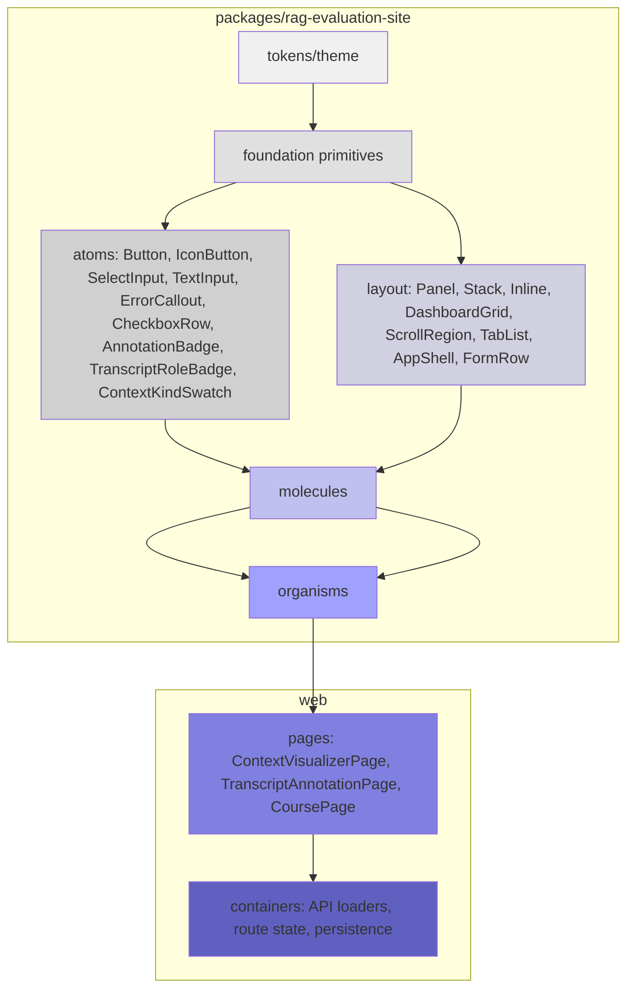

# RAG Evaluation System: Frontend Architecture and Context Viewer Integration

This article documents the frontend architecture of the RAG Evaluation System and the design decisions, implementation patterns, and failure modes encountered during the development of context-viewer, transcript, annotation, and course interfaces. The reference implementation is the `2026-05-27--rag-evaluation-system` repository under `wesen/2026-05-27--rag-evaluation-system`.

The project combines a Go backend (with Goja/JavaScript interop via `widgetdsl`) and a React/Vite frontend organized as a layered component library. The architecture went through a critical unification phase where duplicated code in the web app was consolidated into a shared package, then expanded with a new context-viewer vocabulary of atoms, molecules, and organisms.

> [!summary]
> 1. The frontend is a layered React component library: tokens → foundation → atoms → layout → molecules → organisms → pages → containers.
> 2. `packages/rag-evaluation-site` owns reusable components; `web` owns app routing, API containers, and page composition.
> 3. The context-viewer work added 21 new components across 4 layers: 2 atoms, 9 molecules, 7 organisms, and 3 DTO types.
> 4. Storybook + css-visual-diff provide the primary visual regression defense; all new components ship with stories and baseline screenshots.

## Why this article exists

The RAG Evaluation System has two distinct engineering challenges that are not obvious from looking at any single component:

**The ownership problem.** The project started with all frontend code inside `web/`. As context-window diagrams, transcript readers, and course surfaces were added, the question arose: which components are reusable across different RAG evaluation surfaces, and which are app-specific? Without a principled answer, the codebase was heading toward the same duplication it had already solved in Go.

**The context-viewer translation problem.** The prototype for the context-viewer (an early design iteration for inspecting context windows, transcript annotations, and course slides) used global JSX scripts, inline styles, and broad class names. The modern codebase uses CSS Modules, Storybook, package exports, and Widget IR. Translating a working prototype into the production architecture without regressing on visual quality requires careful layer discipline.

This article explains how both problems were addressed, with concrete file references, component trees, and the mistakes that led to the decisions.

## The layered architecture

The frontend follows a strict component layering model. Each layer has a single responsibility and a well-defined boundary:



Each layer owns specific concerns:

**Tokens and theme.** CSS custom properties for color, spacing, typography, and semantic aliases. `tokens.css` is the single source of truth; no component should hardcode a hex value.

**Foundation primitives.** Small presentation pieces: `Text` (with size/tone/weight variants), `Caption`, `CodeText`, `StatusText`, `Divider`, `VisuallyHidden`. These own typography and accessibility. They are not interactive and do not layout children.

**Atoms.** Basic controls with local state: `Button`, `IconButton`, `TextInput`, `SelectInput`, `CheckboxRow`, `ErrorCallout`. Atoms may own their own controlled input state, but they do not fetch data or navigate.

**Layout primitives.** Structure and composition: `Panel` (frame + title bar + density), `Stack` (flex direction + gap), `Inline` (flex row), `DashboardGrid` (recipe-based column layout), `ScrollRegion`, `TabList`, `FormRow`, `AppShell`. Layout primitives compose children using CSS but never own business logic.

**Molecules.** Reusable data-display patterns with typed DTO props. Examples: `DataTable`, `MetadataGrid`, `AppNav`, `ContextBudgetBar`, `ContextStripDiagram`, `ContextStackDiagram`, `ContextTreemap`, `ContextLegend`, `ContextKindSwatch`, `TranscriptMessageCard`, `AnnotationNoteCard`, `CourseStepNav`, `AnchoredCommentCard`. Molecules take data shapes and render them; they do not decide where the data comes from.

**Organisms.** Feature-specific panels with domain props: `ContextDiagramPanel`, `TranscriptReaderPanel`, `AnnotationRailPanel`, `AnchoredCommentRail`, `CourseLessonPanel`, `CourseSlidePanel`. Organisms compose molecules and atoms into coherent views. They may own controlled selection state for the purpose of visual highlighting, but they do not fetch data.

**Pages.** Storyable compositions of organisms with realistic fixtures. These are presentational boundaries that wire everything together for a single user flow.

**Containers/views.** API-aware wrappers that own RTK Query, mutations, navigation events, and side effects. These are in `web` and use package components to render.

The ownership rule is strict: if a component could be reused by another RAG evaluation surface or Widget IR recipe, it belongs in the package. If it is tied to app routing, API calls, or a specific backend feature, it stays in `web`.

## The design-system unification

The project originally had all frontend code under `web/src/components/`. As the Widget IR packaging direction took shape, a problem emerged: the package at `packages/rag-evaluation-site` needed to render its own component library, but the `web/` version was the only implementation. Two approaches were possible:

**Option A: keep `web/` as the source of truth** and have the package re-export from `web`. This keeps things working but makes the package a thin wrapper — any change requires understanding the app structure, and the package cannot be used standalone.

**Option B: make the package the source of truth** and have `web` import from the package. This gives the package real ownership, makes it independently testable, and follows the principle that reusable code lives in the package.

Option B was chosen. The implementation involved removing compatibility re-exports from `web/src/components/` and rewriting imports to use `@go-go-golems/rag-evaluation-site` directly.

```text
Before:
  web/src/components/atoms/index.ts        → re-exports from ../foundation
  web/src/components/foundation/index.ts   → re-exports from ../foundation
  web/src/components/layout/index.ts       → re-exports from ../layout
  web/src/widgets/index.ts                 → re-exports WidgetRenderer

After:
  web imports directly from @go-go-golems/rag-evaluation-site
```

The transition also moved shared Storybook stories from `web/.storybook/` to `packages/rag-evaluation-site/.storybook/`, giving the package its own Storybook instance with a complete visual baseline.

### What went wrong during unification

The first typecheck pass after removing the compatibility barrels revealed that several `web` components were still importing from the old relative paths. The fix was systematic: find every import of `@go-go-golems/rag-evaluation-site` in `web/`, verify it resolves, then delete the corresponding barrel from `web/src/components/`.

The larger lesson is that re-export barrels are a convenience that becomes a liability when they mask the true source of a component. Once the package is the canonical layer, imports should be explicit.

## The context-viewer vocabulary

The context-viewer prototype (`sources/03-context-viewer-design-iteration/screens*.jsx`) defined four product surfaces: context-window visualization, transcript reading with annotation, anchored comments, and course/slide presentation. Each surface was translated into the layered architecture as follows.

### Context kinds and DTOs

Context-window parts belong to one of 17 semantic kinds: `system`, `instruction`, `context`, `conversation`, `summary`, `retrieval`, `tool`, `result`, `generated`, `annotation`, `course`, `active`, `evicted`, `empty`, `other`, plus derived types for transcripts (`TranscriptRole`) and annotations.

The types are defined in `packages/rag-evaluation-site/src/context/types.ts`:

```typescript
type ContextPartKind = 'system' | 'instruction' | 'context' | ... // 17 kinds
interface ContextWindowSnapshot {
  id: string;
  title: string;
  limit: number;
  parts: ContextWindowPart[];
}
interface ContextWindowPart {
  id: string;
  kind: ContextPartKind;
  tokens: number;
}
```

The kind taxonomy is resolved through a pattern/tone system in `kinds.ts`. Each kind maps to a visual style — `pattern` (diagrammatic fill), `tone` (light/dark), or `outline` (border only). This is the visual foundation that all diagram molecules depend on.

### Context kind swatch (atom)

The `ContextKindSwatch` is the smallest visual building block. It renders a small square showing the pattern/tone/outline style for a single context kind. Three props control the display:

```typescript
interface ContextKindSwatchProps {
  kind: ContextPartKind;
  mode: 'pattern' | 'tone' | 'outline';
  size?: 'sm' | 'md' | 'lg';
}
```

The atom has a Storybook story with all 17 kinds across all three modes. This provides a visual reference that is used by every downstream diagram molecule.

### Context budget bar (molecule)

The `ContextBudgetBar` renders a horizontal bar divided into segments by context kind. It encodes three states visually: under budget (all segments fit), near limit (segments compressed), and over budget (overflow with visual warning).

The component takes a `ContextWindowSnapshot` and renders each part as a proportional-width segment. The key implementation detail is token-to-pixel mapping: `part.tokens / snapshot.limit * 100` gives the percentage width. Labels inside narrow segments are handled with CSS text-backing (white background behind text) to maintain legibility on patterned backgrounds.

### Context strip, stack, and treemap diagrams (molecules)

The `ContextStripDiagram` renders parts as a single horizontal strip, `ContextStackDiagram` groups parts by kind into stacked blocks, and `ContextTreemap` arranges parts as a treemap proportional to token count.

All three share a common challenge: when a segment is too narrow to display text, the label must either be truncated or moved outside the segment. The implementation uses a combination of CSS `overflow: hidden` and conditional label placement based on segment width. Patterned backgrounds use the text-backing technique to preserve label readability.

### Transcript reader (molecules + organisms)

The transcript reader is composed of two molecules and one organism:

- `TranscriptRoleBadge` (atom): small badge showing role — `system`, `developer`, `user`, `assistant`, `tool`, `other` — with color coding.
- `TranscriptMessageCard` (molecule): renders a single message with role badge, text content, token count, and optional annotation badges. Supports selected, compact, and tool/result-heavy states.
- `TranscriptReaderPanel` (organism): wraps multiple message cards in a panel layout with scroll region, handles selected annotation state, and composes the annotation rail.

The key design decision was to separate the message card from the reader panel. The card owns the visual representation of a single message; the panel owns the scrollable container and selection coordination. This allows the card to be reused in other contexts (annotation rail, course slide notes).

### Anchored comments (molecules + organisms)

Anchored comments are different from transcript annotations: they attach to visual positions on a canvas rather than to transcript messages. The prototype defined three UI variants — rail (side panel), sticky (floating on canvas), and popover (hover-based). The current implementation provides the rail/card foundation:

- `AnchoredCommentCard` (molecule): renders a Classic Mac OS–style comment card with author name, timestamp, text content, optional status badge (open/resolved), and selection state.
- `AnchoredCommentRail` (organism): wraps cards in a panel layout with a title and count caption.

The sticky and popover variants are intentionally not yet implemented. They require a visual anchor surface (the diagram canvas) to position against, which should only be composed after the diagram organisms stabilize.

### Course lesson and slide panels (organisms)

The course surface has three components:

- `CourseStepNav` (molecule): renders an agenda with numbered items, each showing title, description, and optional duration. Active item gets a visual accent.
- `CourseLessonPanel` (organism): the course landing page, composed of metadata (date/time/location/format/price), instructor card, outcomes list, and agenda navigation.
- `CourseSlidePanel` (organism): a slide presentation view with a diagram molecule (any of the four context diagram types), teaching notes with numbered references, and slide navigation.

The slide organism composes any context diagram molecule, making it flexible for different slide types (budget view for token-aware slides, treemap for chunk distribution slides, etc.).

## Storybook and visual regression defense

Storybook is not optional for new components. Every molecule and organism must have at least one story, and the story must use realistic fixture data from `packages/rag-evaluation-site/src/context/fixtures.ts`. This is a deliberate choice: stories with fabricated data produce misleading baselines.

The visual regression defense uses `css-visual-diff` to serve a review site alongside Storybook. The workflow is:

1. Run `pnpm --dir packages/rag-evaluation-site exec storybook build --output-dir /tmp/rag-package-storybook-<name>`
2. Run `css-visual-diff serve /tmp/rag-package-storybook-<name> --port 8097`
3. Open `http://127.0.0.1:8097` to verify each component's visual output
4. Capture baseline screenshots for stable components

For the context-viewer components, the visual sweep captured 18 stories covering all diagram views, transcript states, anchored comment variants, and course surfaces. All self-compares showed zero changed pixels, confirming visual stability.

A subtle issue arose during visual sweep: PNG images captured from Storybook had whitespace borders that caused false positive diffs. The fix was to trim whitespace with ImageMagick (`-trim +repage -bordercolor white -border 12`) before saving baselines. This is a common pattern when capturing Storybook screenshots.

## Widget IR integration path

The Widget IR and Goja DSL represent the future integration layer. The current architecture separates concerns clearly:

```
Goja authors data (JSON-compatible Widget IR)
  → WidgetRenderer (package) reads Widget IR
  → WidgetRenderer renders React component-library widgets
```

The Widget IR should expose high-level recipes, not low-level layout fragments. Once the React component vocabulary is stable (which the current work achieves), Widget IR recipes can expose patterns like:

```json
{
  "type": "contextWindow",
  "snapshotId": "win-001",
  "diagramView": "stack"
}
```

Rather than individual div elements. This keeps DSL authors from needing to understand CSS Modules or layout primitives.

## Common mistakes and failure modes

**Using guessed APIs instead of checking existing components.** When implementing `CourseLessonPanel`, the first typecheck failed because `DashboardGrid` uses `recipe="twoColumn"` (not `columns`), `Text` uses sizes `body/compact/metadata/label/metric` (not `lg/xl`), and `MetadataGridItem` uses `key` (not `label`). New package components should inspect existing component props before introducing new names for familiar concepts.

**Adding layout behavior to molecules.** The transcript message card initially included scroll handling and tab switching. These belong in the organism (`TranscriptReaderPanel`), not the molecule. Molecules are data-display; organisms are composition and state coordination.

**Creating pages instead of organisms.** The context viewer analysis explicitly warns against building one `ContextViewer` mega-component. The split into `ContextDiagramPanel`, `TranscriptReaderPanel`, `AnnotationRailPanel`, `AnchoredCommentRail`, `CourseLessonPanel`, and `CourseSlidePanel` preserves atomicity and allows any organism to be tested or displayed in isolation.

## What remains

The package component layer is complete through the atom/molecule/organism boundary for all four context-viewer surfaces. What remains:

- **Web page composition**: `ContextVisualizerPage`, `TranscriptAnnotationPage`, and `ContextCoursePage` pages that compose organisms with realistic routes and state.
- **Backend wiring**: API data, persistence, and annotation saving.
- **Widget IR recipes**: high-level Goja recipes once React components stabilize.
- **Sticky/popover anchored comments**: these need the diagram canvas anchor surface.
- **Course slide deck navigation**: local state for slide progression and history.

## Component inventory

The following table shows all context-viewer components added during this work:

| Component | Layer | File | Props |
|-----------|-------|------|-------|
| `ContextKindSwatch` | atom | `src/components/atoms/ContextKindSwatch/*` | `kind`, `mode`, `size` |
| `TranscriptRoleBadge` | atom | `src/components/atoms/TranscriptRoleBadge/*` | `role` |
| `AnnotationBadge` | atom | `src/components/atoms/AnnotationBadge/*` | `kind`, `count` |
| `ContextLegend` | molecule | `src/components/molecules/ContextLegend/*` | `kinds` |
| `ContextBudgetBar` | molecule | `src/components/molecules/ContextBudgetBar/*` | `snapshot` |
| `ContextStripDiagram` | molecule | `src/components/molecules/ContextStripDiagram/*` | `snapshot` |
| `ContextStackDiagram` | molecule | `src/components/molecules/ContextStackDiagram/*` | `snapshot` |
| `ContextTreemap` | molecule | `src/components/molecules/ContextTreemap/*` | `snapshot` |
| `TranscriptMessageCard` | molecule | `src/components/molecules/TranscriptMessageCard/*` | `message`, `selectedAnnotationId` |
| `AnnotationNoteCard` | molecule | `src/components/molecules/AnnotationNoteCard/*` | `annotation` |
| `CourseStepNav` | molecule | `src/components/molecules/CourseStepNav/*` | `items`, `activeItemId`, `onItemSelect` |
| `AnchoredCommentCard` | molecule | `src/components/molecules/AnchoredCommentCard/*` | `comment`, `selected` |
| `ContextDiagramPanel` | organism | `src/components/organisms/ContextDiagramPanel/*` | `snapshot`, `view`, `onChangeView` |
| `TranscriptReaderPanel` | organism | `src/components/organisms/TranscriptReaderPanel/*` | `transcript`, `selectedAnnotationId`, `onSelectAnnotation` |
| `AnnotationRailPanel` | organism | `src/components/organisms/AnnotationRailPanel/*` | `annotations` |
| `AnchoredCommentRail` | organism | `src/components/organisms/AnchoredCommentRail/*` | `comments`, `selectedCommentId`, `onSelectComment` |
| `CourseLessonPanel` | organism | `src/components/organisms/CourseLessonPanel/*` | `course`, `activeAgendaItemId`, `onAgendaItemSelect` |
| `CourseSlidePanel` | organism | `src/components/organisms/CourseSlidePanel/*` | `slide`, `snapshot`, `index`, `total`, `onPrevious`, `onNext` |

The component library at `packages/rag-evaluation-site` now has 43 Storybook stories covering foundation, atoms, layout, molecules, and organisms. The context-viewer work added approximately 18 stories.

## Working rules

The lessons from this work crystallize into a few rules:

1. **New package components must inspect existing package props before introducing new names.** `MetadataGrid` uses `key`, not `label`. `Text` uses `metric`, not `xl`. `DashboardGrid` uses `recipe`, not `columns`.
2. **Molecules own data-display; organisms own composition and state coordination.** If a component fetches data, it is a container. If it coordinates between other components, it is an organism.
3. **Storybook stories must use realistic fixture data.** Fabricated data produces misleading baselines. The `context/fixtures.ts` file exists for this purpose — use it.
4. **Widget IR comes last.** Stabilize the React component API first. Then add high-level Widget IR recipes. DSL authors should never need to understand CSS Modules.
5. **Visual diffs catch regressions; Storybook catches design drift.** Both are needed. Self-baseline sweeps (comparing a story against itself) confirm that the component itself is stable; cross-sweeps (comparing package vs. web rendering) confirm visual parity after unification.
