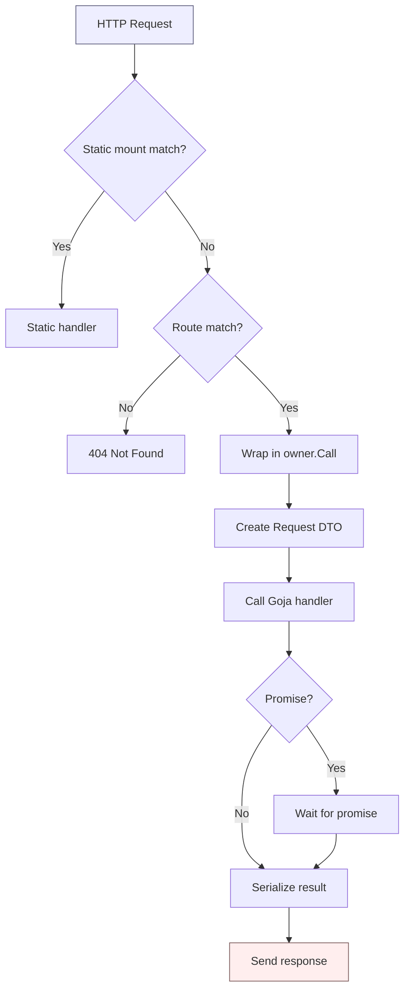
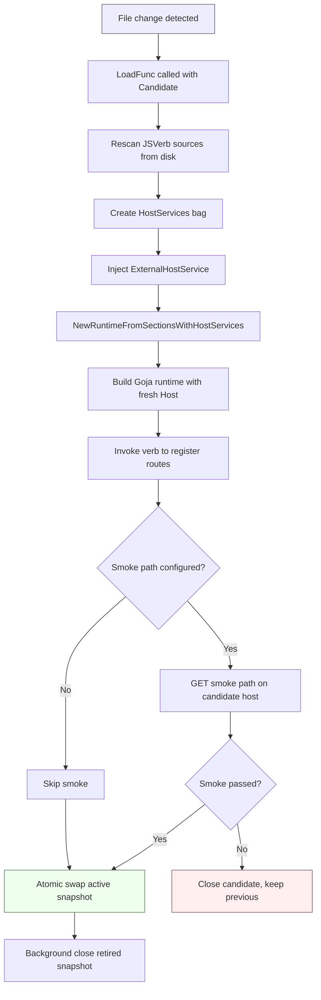

# xgoja: HTTP Serve, Hot Reload, and Runtime Service Architecture

This report documents the complete runtime service architecture of `xgoja`, the Go-built JavaScript application generator for the go-go-goja project. It covers the full stack from the `gojahttp.Host` route registry through the provider-owned HTTP serve command, the hot reload manager with blue/green runtime swapping, and the host service injection system that connects external Go code to generated JavaScript runtimes. The goal is to provide a self-contained reference that explains every design decision, the concrete implementation structures, and the interaction patterns between generated binaries, provider packages, and embedding applications.

> [!summary]
> - `gojahttp.Host` is a route registry backed by Goja callables, with static mounts and request dispatch through `runtimeowner.RuntimeOwner`. It is the single abstraction that all HTTP provider code depends on.
> - The HTTP provider (`go-go-goja-http`) contributes a `serve` command set built from JavaScript verb metadata, allowing generated binaries to expose HTTP setup functions as generated commands rather than script files.
> - `providerapi.HostServiceLookup` and `providerapi.HostServiceSink` form a keyed service map that lets provider packages expose Go-backed capabilities to JavaScript through `require()` names. The system supports layered overlays for per-runtime service injection.
> - `hotreload.Manager` implements blue/green runtime reloading with last-known-good fallback, optional smoke-path validation, and atomic snapshot swapping via `atomic.Pointer`.

## Why this report exists

The xgoja project has accumulated several distinct but interdependent systems across multiple implementation phases. HTTP serve started as a provider command set for JavaScript verbs. External host service injection was added to allow embedding applications to own their HTTP listeners and inject a `gojahttp.Host` into generated runtimes. Per-runtime service injection extended the runtime factory to accept overlay services per invocation. The hot reload manager was built on top of all of these to provide development-time reloading for generated serve commands. Each phase extended the interfaces established by the previous one.

This report captures the current state as a unified architecture reference rather than a series of incremental build logs. The existing vault notes cover individual aspects -- provider architecture, embedded assets, Glazed help documents, the initial HTTP serve command -- but none provides a complete picture of the service injection, runtime factory, HTTP serve, and hot reload systems working together.

The primary source tree for this report is:

| Area | Path |
| --- | --- |
| Route registry and host | `/home/manuel/workspaces/2026-06-07/club-meetup-site/go-go-goja/pkg/gojahttp/` |
| Provider API interfaces | `/home/manuel/workspaces/2026-06-07/club-meetup-site/go-go-goja/pkg/xgoja/providerapi/` |
| Host services system | `/home/manuel/workspaces/2026-06-07/club-meetup-site/go-go-goja/pkg/xgoja/app/host_services.go` |
| Runtime factory | `/home/manuel/workspaces/2026-06-07/club-meetup-site/go-go-goja/pkg/xgoja/app/factory.go` |
| HTTP provider | `/home/manuel/workspaces/2026-06-07/club-meetup-site/go-go-goja/pkg/xgoja/providers/http/` |
| Hot reload manager | `/home/manuel/workspaces/2026-06-07/club-meetup-site/go-go-goja/pkg/xgoja/hotreload/` |

## The gojahttp.Host and Route Registry

The `gojahttp.Host` type is the foundational HTTP abstraction in xgoja. It implements `http.Handler` and owns a route registry that maps HTTP methods and URL patterns to Goja callables. Every HTTP request dispatched by an xgoja-generated runtime passes through this type, which resolves the route, invokes the JavaScript handler, and manages the response.

The host holds a `*gojahttp.Registry`, which stores routes as a slice of `Route` structs, each containing an HTTP method, a URL pattern, and a `goja.Callable`. The registry uses a `sync.RWMutex` for concurrent access. Route matching is pattern-based: URL segments prefixed with `:` are captured as named parameters, and `*` matches any remaining path. The implementation strips trailing slashes and normalizes leading slashes.

```go
type Route struct {
    Method  string
    Pattern string
    Handler goja.Callable
}

type Registry struct {
    mu     sync.RWMutex
    routes []Route
}
```

Request dispatch follows a deterministic sequence. The `ServeHTTP` method first checks static mounts. Static mounts are registered separately via `RegisterStatic` and `RegisterStaticHandler`, and each mount has a prefix, an `http.Handler`, and optional exclude prefixes. If a request path matches a static mount prefix (and is not excluded), the static handler processes the request directly without touching the Goja runtime. This is how embedded asset directories are served: the JavaScript code calls `express.app().staticFromAssetsModule("/static", assets, "/app/public")`, which registers an `http.FileServer` as a static mount on the host.

For non-static requests, dispatch enters the route registry. The host looks up a matching route by method and path. If no route matches and the method is `HEAD`, the host falls back to a `GET` match and uses a `headResponseWriter` that discards the body. If no route matches at all, it returns `404 Not Found`.

When a route matches, the host needs to invoke the JavaScript handler. The handler is a `goja.Callable` -- a raw Goja function value -- that expects the Goja request and response objects as arguments. The host cannot call this function directly because Goja values must be accessed only from the goroutine that owns the `goja.Runtime`. The host solves this through `runtimeowner.RuntimeOwner`, which serializes callbacks onto a VM event loop. The host wraps the handler invocation in a `host.owner.Call()` callback that creates the request DTO, constructs the Goja response object, and calls the handler.

The handler can return a Goja promise. The host polls the promise state on the event loop until it settles, then finishes the response by serializing the result. If the handler returns a non-promise value, the host checks whether it is a string (sends as text) or something else (sends as HTML). If the handler calls `res.send()` or `res.json()` itself, the response is already sent and the host does nothing further.



The host also exposes a `Routes()` method that returns a slice of `RouteDescriptor` structs. Each descriptor contains only the method and pattern strings, not the handler. This method is used by the hot reload manager to report route counts in its status endpoint, and by the embedding application to verify that route registration succeeded. The route registry is critical for hot reload because Goja callables are bound to the runtime that created them. A new runtime must register fresh callables; the old callables become invalid when the old runtime is closed.

## Runtime Service Injection

Generated xgoja binaries configure JavaScript modules through a `xgoja.yaml` file. The `modules:` list maps Go package names to JavaScript `require()` names. Each module is instantiated by a provider, which produces a `require.ModuleLoader` function. That function registers a native module on the Goja `require` registry for a specific `goja.Runtime`.

Provider packages need a way to expose Go-backed state and behavior to the JavaScript modules they create. The xgoja system provides `providerapi.HostServices`, which is an interface with `HostService(key string) (any, bool)` and `HostServiceValues(key string) []any` methods. Provider modules can store keyed values during their setup phase, and JavaScript code can access them through `require("express").someMethod()` patterns or through the module factory's `ModuleSetupContext.Host`.

The host service system has three concrete types that implement layered lookup:

1. `contributedHostServices` -- the base set built from provider `HostServiceContributionCapability` implementations during runtime construction. Each package capability that declares `ContributeHostServices` can add keyed values.

2. `layeredHostServices` -- an overlay type that chains a base `HostServices` with an overlay `HostServices`. Lookup tries the overlay first, then the base. Used for per-runtime service injection.

3. `hostServiceCollector` -- the mutable collector that builds `contributedHostServices` during runtime construction. It accumulates keyed values and closer functions, then produces an immutable `hostServicesForRuntime` with both the service map and the collected closers.

The `HostServiceValues` method returns all values for a key as a slice, which means multiple provider contributions can register the same key without error. The `HostService` convenience method returns a single value when exactly one exists, or the full slice when multiple exist.

## External Host Service Injection

The external host service pattern solves a specific problem: an embedding Go application owns its HTTP listener and route host, but the generated JavaScript runtime also needs to register routes through Express. The generated runtime cannot start its own listener without conflicting with the embedding application's server.

The solution introduces `xgoja.providers.http.HostServiceKey = "go-go-goja-http.host"`, a fixed string key that the HTTP provider checks when creating the Express module loader. An embedding application can inject its own `*gojahttp.Host` into the generated runtime by calling `SetHostService` on the `HostServices` bag passed to `NewBundle`:

```go
xgojaruntime.NewBundle(xgojaruntime.Options{
    ConfigureServices: func(s *app.HostServices) {
        _ = s.SetHostService(httpprovider.HostServiceKey, httpprovider.ExternalHostService{
            Host:       jsHost,
            OwnsListen: false,
        })
    },
})
```

The `ExternalHostService` struct contains two fields. `Host` is the `*gojahttp.Host` that JavaScript should use for route registration. `OwnsListen` controls whether the HTTP provider's capability should start a Go-owned `net/http.Server`. When `OwnsListen` is `false`, the Express module loader receives the injected host but does not call `net.Listen` or start a server. The embedding application owns the listener entirely.

The HTTP provider's capability maintains a `map[*goja.Runtime]*runtimeEntry` that tracks one `runtimeEntry` per runtime. Each entry holds the current settings, the resolved host (either injected or newly created), a pointer to the Go HTTP server (if any), and the `ownsListen` flag. When `require("express")` is first called in a runtime, the loader checks the entry. If an external host is present and `OwnsListen` is `false`, it uses that host and skips listener creation entirely.

This pattern is essential for hot reload because each reload cycle creates a fresh runtime. The embedding application or serve command must inject the same `*gojahttp.Host` (or a fresh one) into each new runtime, and the provider must respect the `OwnsListen: false` flag so that the command's single Go-owned listener is not duplicated.

## Per-Runtime Service Injection

The external host pattern works for the generated-package case where the embedding application calls `NewBundle` directly. But generated binaries do not call `NewBundle`. They go through the `RuntimeFactory`, which is created once at build time from the buildspec and holds the provider registry and module list. The generated binary's commands receive a `RuntimeFactory`, not a `NewBundle` function.

To allow command providers to inject per-runtime services in generated binaries, the system adds an optional interface: `providerapi.RuntimeFactoryWithHostServices`. This interface extends `providerapi.RuntimeFactory` with one additional method:

```go
type RuntimeFactoryWithHostServices interface {
    RuntimeFactory
    NewRuntimeFromSectionsWithHostServices(
        ctx context.Context,
        vals *values.Values,
        hostServices HostServices,
        opts ...require.Option,
    ) (*engine.Runtime, error)
}
```

The `app.RuntimeFactory` implements this interface. Its `NewRuntimeFromSectionsWithHostServices` method accepts an additional `hostServices` argument that represents runtime-local overlay services. Inside the method, the runtime factory checks whether the overlay is non-nil. If so, it creates a `layeredHostServices{base: f.services, overlay: hostServices}` and passes that layered lookup to the host service collector. The collector then allows both base services (from the buildspec) and overlay services (from the caller) to be visible during provider module setup.

The base services come from the buildspec's `ConfigureServices` hook or from provider package capabilities. The overlay services come from the caller -- in the hot reload case, the caller injects `ExternalHostService` so the new runtime's Express module uses the fresh `gojahttp.Host`.

The layering order is deliberate. Base services are visible first, overlay services are visible second, and provider-contributed services (from `HostServiceContributionCapability`) are visible last. This means a provider's module setup can see both the base configuration and the caller's overlay, and can contribute additional services on top.

The `NewRuntimeFromSections` method delegates to `NewRuntimeFromSectionsWithHostServices` with a `nil` overlay, preserving existing behavior for callers that do not need per-runtime services.

## The HTTP Serve Command Provider

The HTTP provider (`go-go-goja-http`) contributes a `serve` command set that transforms JavaScript verbs into HTTP serve commands. When a generated binary is built with the HTTP provider, the command `./dist/app serve <package> <verb> --http-listen 127.0.0.1:8787` invokes the selected verb to register Express routes, then keeps the runtime alive.

The provider registers its `serve` command through the standard `providerapi.CommandSetProvider` mechanism:

```go
providerapi.CommandSetProvider{
    Name:         "serve",
    DefaultMount: "serve",
    NewCommandSet: func(ctx providerapi.CommandSetContext) (*CommandSet, error) {
        return newServeCommandSet(ctx)
    },
}
```

The `newServeCommandSet` function scans all configured JavaScript verb sources, builds a Glazed command for each discovered verb, and attaches the command to the generated binary's root under the `serve` mount. Each command invokes `serveVerb`, which creates a runtime from the selected module set, invokes the verb to register routes, and then blocks waiting for shutdown signals.

The provider command set also attaches Glazed configuration sections for HTTP settings (`--http-listen`, `--http-enabled`) and for hot reload settings. These sections use `providerutil.CollectGlazedConfigSections` to merge provider module sections with the hot reload section, then call `addSectionsToServeCommand` to attach them to each generated command's description.

## Generated Binary Hot Reload

Hot reload for generated serve commands works in three phases: candidate creation, smoke validation, and atomic swap. The implementation lives in `pkg/xgoja/hotreload/manager.go` and is wired into `pkg/xgoja/providers/http/serve.go` as the `serveVerbHotReload` execution path.

### The Manager

`hotreload.Manager` wraps a `hotreload.LoadFunc` that accepts a `Candidate` (a version number and a fresh `*gojahttp.Host`) and returns a `hotreload.Runtime` (a `*engine.Runtime`). The manager holds an `atomic.Pointer[Snapshot]` that is atomically swapped during reload. `Snapshot` contains the active version, the host, the runtime, and the route descriptors extracted from the host's registry.

```go
type Manager struct {
    opts Options
    
    active      atomic.Pointer[Snapshot]
    nextVersion atomic.Int64
    reloadMu    sync.Mutex
    
    statusMu    sync.RWMutex
    status      Status
}
```

The `Reload` method is where all the work happens. It acquires `reloadMu` to serialize reload attempts (the file watcher calls `Reload` on each change, and concurrent reloads would create overlapping runtimes). It increments the version counter, creates a new candidate with a fresh `gojahttp.Host`, calls the `Load` function to bootstrap the JavaScript runtime and invoke the verb, optionally runs a smoke test, swaps the active snapshot atomically, and schedules the retired snapshot for background closure with the configured grace period.

The `Load` function is the only part that needs to be specific to each use case. For the generated serve command, the `Load` function does the following:

1. Rescans the JSVerb sources to get fresh source bytes from disk. This is critical: the original scanned registry captures JavaScript at the time the command started, not at the time of the file change. The rescan reads files again.

2. Creates an empty `app.HostServices` bag and injects `ExternalHostService{Host: candidate.Host, OwnsListen: false}`. This makes the candidate's fresh `gojahttp.Host` visible to the Express module.

3. Calls `factory.NewRuntimeFromSectionsWithHostServices` with the overlay services. The runtime factory builds the module set, resolves the overlay host, and creates the Goja runtime.

4. Invokes the verb in the new runtime, which registers routes into the candidate's `gojahttp.Host`.



### Smoke Validation

The smoke path is an optional HTTP GET request issued against the candidate's `gojahttp.Host` before the new runtime is swapped live. The `serveHotReloadSmoke` function creates a `SmokeFunc` that uses `httptest.NewRecorder` and `httptest.NewRequest` to simulate an HTTP request. If the candidate's smoke path returns a status code outside 200-299, the smoke fails and the manager closes the candidate runtime and returns the error without swapping. This is the last-known-good guarantee: if a JavaScript edit breaks route registration, the previous good runtime continues serving.

The smoke path is useful when the hot reload command does not have direct access to the Go-owned server (because the manager itself mounts the `/__xgoja/status` endpoint, not the JavaScript routes). The smoke function tests the candidate in isolation, before it is mounted by the live manager.

### File Watching

The `Watch` method runs a polling loop that scans the configured watch roots at the configured interval. It builds a `map[string]fileState` mapping absolute file paths to their modification time and size. On each tick, it rescans and compares. If the file state changed, it optionally waits for the debounce delay before calling `Reload`. The default extensions are `.js`, `.json`, `.md`, `.yaml`, `.yml`. The default poll interval is 500 milliseconds, and the default debounce is 250 milliseconds.

Watch roots default to non-embedded runtime JSVerb source paths extracted from the buildspec. Embedded sources and provider-shipped sources are not watchable because they are compiled into the binary. Users can override the defaults with `--hot-reload-watch-root`.

### Status Endpoint

The HTTP serve command mounts a Go-owned status endpoint at `/__xgoja/status` (configurable via `--hot-reload-status-path`, empty to disable). The endpoint returns JSON with:

```json
{
    "ready": true,
    "activeVersion": 3,
    "lastReloadAt": "2026-06-08T23:10:00Z",
    "lastSuccessfulReloadAt": "2026-06-08T23:09:30Z",
    "lastError": "",
    "routes": [
        {"method": "GET", "pattern": "/healthz"},
        {"method": "GET", "pattern": "/"}
    ]
}
```

The status endpoint is mounted on the Go-owned `net/http.ServeMux` before the manager's catch-all handler, ensuring that it is always served by Go code and cannot be shadowed by JavaScript routes.

## Generated Binary Integration

The generated binary path adds several layers on top of the provider implementation. When a user runs `./dist/app serve sites demo --hot-reload`, the following happens:

1. The Glazed/Cobra parser reads `--hot-reload`, `--hot-reload-watch-root`, `--hot-reload-smoke-path`, and other hot reload flags into `serveHotReloadSettings`.

2. The `serveVerb` function checks if `--hot-reload` is enabled. If so, it branches to `serveVerbHotReload`.

3. `serveVerbHotReload` asserts that the `RuntimeFactory` implements `RuntimeFactoryWithHostServices`. It decodes the HTTP settings for `--http-listen`. It creates the `hotreload.Manager` with a `Load` function, a smoke function, and a close grace duration.

4. It performs an initial `manager.Reload()` to bootstrap the first runtime.

5. It creates a `net.Listen` on the configured address and mounts a `ServeMux` with the status endpoint and the manager as a catch-all.

6. It spawns the watcher goroutine if watch roots are configured.

7. It blocks on `server.Serve(listener)` or context cancellation.

The generated binary does not need any special code in the user's `xgoja.yaml`. The hot reload flags are added to the generated command by the HTTP provider's `serveHotReloadSection()` function, which appends Glazed fields for `hot-reload`, `hot-reload-watch-root`, `hot-reload-watch-ext`, `hot-reload-smoke-path`, `hot-reload-poll`, `hot-reload-debounce`, `hot-reload-close-grace`, and `hot-reload-status-path`.

## Key Design Decisions

### Atomic snapshot swap

The active snapshot is stored as `atomic.Pointer[Snapshot]`. `Reload` uses `m.active.Swap(snapshot)` for the swap, which is a single CPU instruction on all supported architectures. This means that `ServeHTTP` calls from concurrent HTTP requests and `Status` calls from the status endpoint always see either the old snapshot or the new snapshot, never a partially-constructed one. The Go memory model guarantees that the snapshot's fields are fully written before the atomic swap.

### Rescanning JSVerb sources on each reload

The original registry captured JavaScript source at command startup. Without rescanning, `Reload` would rebuild a fresh Goja runtime but execute the same old JavaScript source bytes. The implementation rescans all configured JSVerb sources in the `Load` function, then resolves the original verb's full path in the new registry. This ensures that edited `.js` files are actually picked up.

### Why `OwnsListen: false` is required

The HTTP provider's capability starts a `net/http.Server` the first time `require("express")` is called in a runtime. If a hot reload cycle created a runtime that also started a server, two listeners would bind to the same port. The `ExternalHostService.OwnsListen: false` flag tells the capability to use the injected host for route registration but skip listener creation entirely.

### Goja callables are runtime-bound

Goja callables are closures over a specific `goja.Runtime`. When the runtime is closed, the callables become invalid. This means the hot reload manager must create a fresh runtime, fresh `gojahttp.Host`, and fresh callables on every reload. It cannot reuse the old runtime's callables. The manager holds the retired runtime open for the close grace period to allow any in-flight requests to complete before closing.

### Provider commands vs. built-in commands

The HTTP serve command is a provider-owned command set, not a built-in command. This follows the xgoja design principle that domain-specific behavior belongs to providers, not to the app layer. The generated binary's `app.Host` delegates to provider command sets for commands that come from provider packages. This keeps the generator agnostic about what commands exist and lets providers add new command families without changing the generated code.

## Testing Strategy

The test suite covers three levels:

1. **Provider-level tests** in `pkg/xgoja/providers/http/serve_test.go` verify the `serveVerbHotReload` path with a real `net/http.Server`, real file watcher, and real JSVerb rescan. The test writes a versioned health endpoint, edits the source to change the version, and verifies that the served response updates. It also writes a broken JavaScript source and verifies that the active version does not change and the error is recorded.

2. **Generated-binary integration tests** in `cmd/xgoja/internal/generate/generate_test.go` build a temporary Go program from a buildspec, compile it, run it as a subprocess, and test the same hot reload scenarios through the actual generated CLI. This validates the full path from buildspec through Glazed/Cobra parsing, command execution, and hot reload behavior.

3. **Runtime factory tests** in `pkg/xgoja/app/host_services_test.go` verify that per-runtime host services are visible to provider module setup and that layered host service lookup returns the correct values in the correct order.

## Open Questions

- The default status endpoint `/__xgoja/status` could conflict with a JavaScript route that registers `/__xgoja/status`. The Go-owned handler on the `ServeMux` takes priority, so the JavaScript route would never be reached, but this could confuse users who expect `/__xgoja/status` to be a JavaScript route.

- The hot reload file watcher polls the filesystem. On systems with slow filesystems or large watched directories, the poll interval and debounce may need to be tuned. The current defaults (500ms poll, 250ms debounce) are reasonable for development machines.

- The `RuntimeFactoryWithHostServices` interface is optional. If a future provider implements `serve` but does not use `RuntimeFactoryWithHostServices`, hot reload will fail with a clear error message at startup. This is a safe failure mode.
