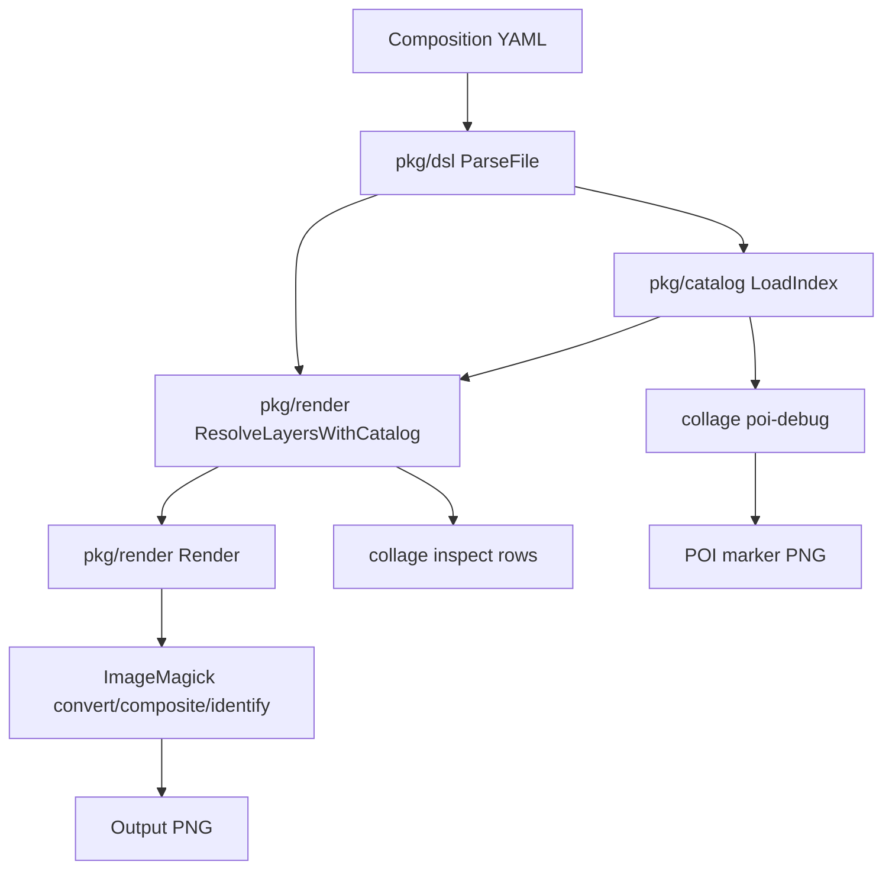
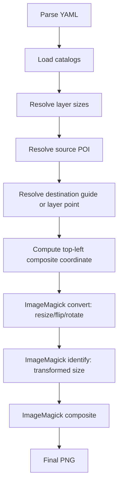
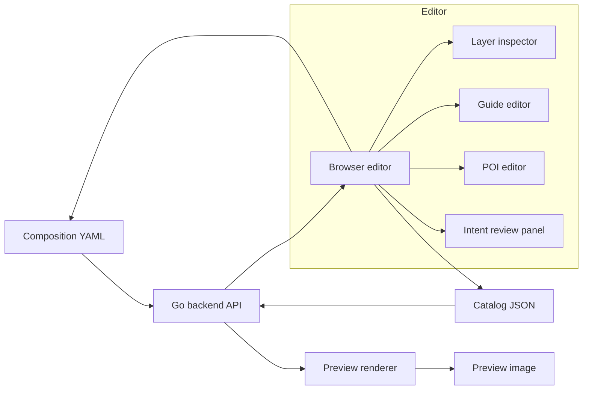

# Collage DSL: From Asset Catalogs to Intentional Composition Grammar

This report explains the work so far on `collage`, a Go command-line tool and YAML grammar for composing image assets into poster-like collages. The project began with a practical cataloging task: inspect several folders of PNG cutouts, write visual metadata, and build simple HTML galleries for browsing them. It then turned into a deeper design problem. Once the assets were cataloged, the question became: how do we write a composition in a way that captures artistic intent, not just pixel coordinates?

The answer we have been moving toward is a small domain-specific language for collage. The YAML file is the central data structure. It describes the canvas, the layers, the guide points, the semantic points of interest on source images, and the reason each layer exists. The renderer is still simple, but the shape of the system is now clear: catalogs describe reusable assets, compositions describe relationships between assets, and debug tools make those relationships visible.

> [!summary]
> The work has four important themes:
> 1. We moved from isolated image catalogs to an executable YAML collage grammar.
> 2. We learned that good collage composition needs semantic placement, not only `x`, `y`, and `scale`.
> 3. We implemented a Go/Glazed CLI with rendering, inspection, catalog POI metadata, and POI debug visualization.
> 4. We began treating the YAML file as an art-direction document: every object can carry intent through `description` fields.

The current repository is `/home/manuel/code/wesen/collage`. The most important implementation files are:

- `/home/manuel/code/wesen/collage/pkg/dsl/collage.go`
- `/home/manuel/code/wesen/collage/pkg/render/render.go`
- `/home/manuel/code/wesen/collage/pkg/catalog/catalog.go`
- `/home/manuel/code/wesen/collage/cmd/collage/cmds/render.go`
- `/home/manuel/code/wesen/collage/cmd/collage/cmds/inspect.go`
- `/home/manuel/code/wesen/collage/cmd/collage/cmds/poi_debug.go`

## Why this project exists

A folder of transparent PNG cutouts is not yet a creative system. It is only a supply of parts. The first cataloging pass made the parts visible: geometric vector shapes, halftone animals, retro machines, classical statues, astronauts, skeletons, hands, tapes, and abstract psychedelic forms. The galleries let us browse them. The catalogs gave them names. But browsing is not composing.

Composition requires relationships. A zebra portrait becomes stronger when a halftone triangle sits behind it. An astronaut becomes a figure in a ritual stage when its feet align to a ground plane and an inverted triangle hovers above its helmet. A sculptural head becomes a mystical portrait when an orbit ring is placed around the hand-to-ear gesture. These are not just visual transforms; they are statements of intent.

The early DSL treated layers as transform records:

```yaml
- image: classical-thumbs/19.png
  x: 420
  y: 410
  scale: 0.52
```

That is useful, but it is not enough. The number `0.52` depends on the source image resolution. The position `(420, 410)` says nothing about why the astronaut is there. If the image is swapped for a higher-resolution cutout, the composition changes. If another person reads the YAML, they must infer the purpose from the rendered output.

The project therefore shifted from a transform DSL to an intentional composition grammar. The better form is:

```yaml
- id: astronaut
  description: >
    The astronaut is the hero. Its catalog point `feet_center` is placed on the
    ground line, making the figure independent of the source image resolution.
  image: classical-thumbs/19.png
  catalog_id: classical-19-astronaut
  fit_height_pct: 0.50
  place:
    point: feet_center
    at:
      guide: ground_center
```

This is a different kind of document. It says what the layer is, why it exists, how large it should be relative to the composition, and which semantic point should align with which composition point. The renderer can execute it, and a human can review it.

## The first phase: cataloging visual assets

Before the Go project existed, the work started with image analysis and catalog generation. Several asset folders were inspected and converted into `catalog.json` files plus browser galleries:

| Collection | Location | Count | Notes |
|---|---:|---:|---|
| Psychedelic black PNG shapes | `/home/manuel/Downloads/psychedelic-vector-archives/GRAPHICS/BLACK/PNG` | 170 | Black vector-like optical shapes. |
| Psychedelic white PNG shapes | `/home/manuel/Downloads/psychedelic-vector-archives/GRAPHICS/WHITE/PNG` | 170 | White versions of the same shape family; descriptions inherited from black set because white-on-transparent was visually invisible to the analysis tool. |
| Classical collage elements | `/home/manuel/Downloads/psychedelic-vector-archives/COLLAGE ELEMENTS` | 35 | Statues, skeletons, astronauts, dancers, hands, vintage figures. |
| Halftone dot collage pack | `/home/manuel/Downloads/halftone-dot-collage` | 100 | Animals, machines, figures, hands, stickers. |

The galleries are simple `index.html` files that read their local `catalog.json` via `fetch()`. Because browser `fetch()` does not work reliably from `file://`, they must be served over HTTP. One of the galleries was already being served from `/home/manuel/Downloads/halftone-dot-collage` at `http://localhost:8080/index.html` during the session.

The important lesson from this phase was that metadata changes what the asset folder is. A file named `SHAPE 44.png` is hard to reason about. A catalog entry named “Inverted Triangle Spiral,” tagged as `triangle`, `vortex`, `portal`, `optical`, and `geometric`, can be selected intentionally. The catalog becomes the bridge between raw assets and the DSL.

## The Go project shape

The Go project was initialized under `/home/manuel/code/wesen/collage` with module path `github.com/go-go-golems/collage`. It uses the Glazed command framework to expose structured CLI commands. The current CLI has three important commands:

```bash
collage render    # render a YAML collage to PNG
collage inspect   # print resolved layers as table/json/yaml/etc.
collage poi-debug # draw catalog POI markers over an asset
```

The architecture is small enough to understand in one diagram:



The separation of responsibilities matters:

- `pkg/dsl` owns the YAML shape, defaults, and validation.
- `pkg/catalog` owns reusable image metadata and point-of-interest lookup.
- `pkg/render` owns geometry resolution and ImageMagick rendering.
- `cmd/collage/cmds` owns the Glazed command wrappers.

This separation is why the project can evolve. The DSL can grow new grammar without embedding everything into CLI flags. The renderer can become more precise without changing the catalog format. The browser editor planned next can use the same YAML and catalog structures rather than inventing a parallel state model.

## The current DSL

The top-level YAML document describes a `Collage`: title, description, optional catalogs, canvas, guides, and layers. The current Go type lives in `pkg/dsl/collage.go`.

A composition now looks like this:

```yaml
title: "Intent Astronaut Portal"
description: >
  A test composition for the new clear collage grammar. The astronaut is the hero:
  its feet are placed on the ground line, the triangle portal is positioned at the
  upper-center guide, and ornaments use rule-of-thirds guide points.

catalogs:
  - catalogs/demo-poi-catalog.json

canvas:
  description: "Square low-resolution preview canvas for fast artistic iteration."
  width: 1000
  height: 1000
  background: white

guides:
  description: >
    Composition guide system: a central hero axis, rule-of-thirds anchors for
    ornaments, and a ground line for feet and floor elements.
  points:
    upper_center:
      description: "Portal/crown zone above the hero, nudged upward for drama."
      x_pct: 0.50
      y_pct: 0.24
      offset:
        description: "Slight upward optical correction."
        y_pct: -0.02
    ground_center:
      description: "Where the hero's feet and ground plane meet."
      x_pct: 0.50
      y_pct: 0.80
```

The important design choice is that `description` fields are not comments. They are part of the data model. A future browser editor can show them. A review process can read them. A generated contact sheet can place them next to rendered images. Art is not only the final bitmap; it is also the set of decisions that produced it.

### Legacy transforms still exist

The DSL still supports the original fields:

```yaml
x: 200
y: 300
pct_x: 50
pct_y: 50
position: center
anchor: center
scale: 0.8
rotation: -12
flip: horizontal
```

These are useful for quick manual tuning and for preserving older examples. The newer grammar is preferred when the goal is durable composition.

### New relative sizing fields

The source-resolution problem is solved by fields that target the canvas rather than the source file:

```yaml
fit_width_pct: 0.42
fit_height_pct: 0.50
fit_pct: 0.35
width_px: 420
height_px: 500
```

The difference is not cosmetic. `scale: 0.5` means “half the source image.” `fit_height_pct: 0.5` means “half the canvas height.” The second statement is stable across thumbnails and full-resolution assets.

The sizing precedence implemented in `pkg/render/render.go` is:

1. Explicit `width_px` / `height_px`.
2. Canvas-relative `fit_width_pct` / `fit_height_pct`.
3. Longest-side `fit_pct`.
4. Legacy `scale`, `scale_x`, `scale_y`.

In pseudocode:

```text
resolveTargetSize(layer, source, canvas):
    if width_px or height_px:
        fit source to explicit pixel box
    else if fit_width_pct or fit_height_pct:
        convert fractions to canvas pixels
        fit source to that target box
    else if fit_pct:
        set longest side to fit_pct * canvas_longest_side
    else:
        use source dimensions and legacy scale
```

## The point grammar

The core design idea is that every position-like value should resolve through one shared point grammar. A guide point, an inline canvas point, a catalog POI, and a point on another layer all become a resolved `(x, y)` coordinate.

The grammar has four main forms.

### 1. Inline canvas point

```yaml
at:
  x_pct: 0.50
  y_pct: 0.80
```

This means “the point at 50% of canvas width and 80% of canvas height.” In the new grammar, `x_pct` and `y_pct` are fractions from `0.0` to `1.0`. This is different from the legacy `pct_x` and `pct_y` fields, which use `0-100` semantics.

### 2. Named guide point

```yaml
at:
  guide: ground_center
```

The guide is resolved from the top-level `guides.points` map. Guides can carry offsets:

```yaml
ground_center:
  description: "Where the hero's feet and ground plane meet."
  x_pct: 0.50
  y_pct: 0.80
  offset:
    y_pct: 0.02
```

Offsets are first-class because composition often requires “near this point,” not exactly on it. A guide point can represent the mathematical idea, and its offset can capture the visual correction.

### 3. Catalog point on the current image

```yaml
place:
  point: feet_center
  at:
    guide: ground_center
```

The `point` is the source point on the current layer. If the layer has a `catalog_id`, the renderer looks up `feet_center` in the catalog. If it is a builtin point like `center` or `bottom-center`, it is resolved from the image bounds.

### 4. Point on another layer

```yaml
place:
  point: center
  at_layer:
    id: astronaut
    point: head_center
  offset:
    x_pct: 0.20
    y_pct: -0.03
```

This places the current layer relative to an already-resolved earlier layer. In the proof composition, a small star is placed relative to the astronaut’s `head_center`. The validation currently requires `at_layer` references to point to earlier layers, which avoids cycles.

## Catalog points of interest

Catalog POIs are vetted semantic points on reusable assets. They are stored in JSON rather than inferred during rendering. This is deliberate. An automatic detector may place a head point near the wrong part of a helmet or face. A POI used for composition should be stable enough to trust.

The sample catalog lives at `/home/manuel/code/wesen/collage/examples/catalogs/demo-poi-catalog.json`. It includes entries like:

```json
{
  "id": "classical-19-astronaut",
  "filename": "classical-thumbs/19.png",
  "title": "Apollo Astronaut Thumbnail",
  "description": "Low-resolution transparent thumbnail of an Apollo-era astronaut. Use as a standing hero figure in preview compositions.",
  "points_of_interest": {
    "head_center": {
      "description": "Approximate helmet center for halos, portals, and symbolic overlays.",
      "x_pct": 0.50,
      "y_pct": 0.18
    },
    "chest_center": {
      "description": "Center of torso mass for emblem alignment.",
      "x_pct": 0.50,
      "y_pct": 0.45
    },
    "feet_center": {
      "description": "Ground contact point between the boots, adjusted from debug overlay.",
      "x_pct": 0.50,
      "y_pct": 0.94
    }
  }
}
```

The sample catalog also records regions of interest, such as the helmet or face. Regions are not yet used by the renderer, but they are important for the future browser editor. They can warn when an ornament covers the face, or when a ring intersects a region that should remain readable.

## The POI debug tool

A POI is a visual claim. It says “this coordinate is the head center” or “this coordinate is where the feet touch the ground.” The only honest way to validate that claim is to draw it on the asset.

The new command does exactly that:

```bash
./collage poi-debug \
  --catalog examples/catalogs/demo-poi-catalog.json \
  --root examples \
  --image-id classical-19-astronaut \
  --out /tmp/astronaut-poi.png
```

The command reads a catalog, finds an image, renders it at a preview size, and draws bright markers and labels for every point of interest. This immediately revealed that two initial POIs needed adjustment: the astronaut’s `feet_center` was too low, and the head/hand sculpture’s `face_center` was on the eye rather than the center of the face.

![[assets/collage-dsl-report/poi-debug-sheet-v2.png]]

This is one of the most important practical results of the work. A semantic grammar is only useful if the semantic points can be inspected. The POI debug command turns invisible metadata into something an artist or engineer can correct.

## The rendering pipeline

The renderer is intentionally plain. It uses ImageMagick command-line tools instead of a complex graphics library. Each layer is transformed into a temporary PNG and then composited onto the current canvas.



The central function is `ResolveLayersWithCatalog` in `pkg/render/render.go`. Its job is to turn a high-level layer into a resolved layer with concrete geometry:

```text
for each YAML layer:
    resolve image path
    compute target width/height
    compute source-to-target scale
    if semantic placement exists:
        resolve destination point
        resolve source point on layer
        top_left = destination - source_point
    else:
        use legacy x/y/position/anchor
    append ResolvedLayer
```

The renderer then applies the resolved values. This division is important. Interpretation of the grammar happens before ImageMagick. ImageMagick receives only simple operations: resize, flip, rotate, composite.

## The CLI surface

The project uses Glazed commands because the outputs are structured. `collage inspect` can return a table during interactive work or JSON when another tool wants to consume the geometry.

```bash
./collage inspect --input examples/22-intent-astronaut-poi.yaml
```

The current inspect output includes index, label, image, resolved scale, resolved size, rotation, and position. A dry run of the same file shows the geometry in a prose-oriented format:

```text
Layer  4: 19.png
  Label:    19.png
  Position: (325, 300) anchor=top-left
  Size:     350x500 px
  Scale:    (0.44, 0.44)
```

The next iteration should expose more of the intent in inspect output: layer `id`, layer `description`, source point, destination point, guide name, and catalog ID. The geometry is now present, but the debug output should become as intent-rich as the YAML.

## What changed artistically

The most visible lesson came from the early render experiments. A “collage” made of giant cropped photos with tiny decorations is not enough. The strongest early piece was the zebra composition, because it had a simple structure:

- one unmistakable hero;
- a centered, symmetric composition;
- a bold geometric/halftone support shape;
- enough white space for the hero to breathe.

Later experiments with the psychedelic premade compositions showed a second useful language: sparse black-and-white editorial stages with statues, astronauts, skeletons, arches, stars, grids, and optical shapes. Those compositions use geometry as architecture. A triangle is not a background texture; it is a portal, crown, or omen. A grid is not filler; it is a stage. A ring is not decoration; it orbits a meaningful body point.

The best current low-resolution psychedelic sketches are collected here:

![[assets/collage-dsl-report/psy-winners-v2-sheet.png]]

The grammar work came directly from this observation. If a ring should orbit a hand-to-ear gesture, the YAML should say that. If a skeleton should stand under a dead sun, the YAML should say that too. Coordinates remain necessary, but they should be the compiled form of intent, not the only language the artist has.

## Intent-rich review sheets

One useful practice is to review a composition with its intent text next to the image. This changes the critique. Instead of asking only “does it look good?”, the reviewer can ask:

- Does the image express the stated hierarchy?
- Does the main subject read as the hero?
- Do the supporting shapes play the roles the YAML claims they play?
- Are the guide points and POIs helping, or are they fighting the image?

The current proof sheet shows the idea:

![[assets/collage-dsl-report/intent-review-sheet.png]]

This is where the system starts to feel like a tool rather than a script. The YAML records intent. The renderer produces an image. The review sheet puts them together. A browser editor can make this loop interactive.

## The mystical/retrowave series experiment

Near the end of the session, we tried to push the system into a more narrative direction: “a series of retrowave Aleister Crowley mystical collages about the death of hope and language in an age of machines feeding on human thoughts and dreams.” We intentionally stayed inside the already cataloged assets and inspected backgrounds. No outside Crowley images were introduced. The symbolic vocabulary came from the available parts:

- eye triangles, radial seals, rings, and starbursts from the psychedelic vector set;
- skeletons, sculptural heads, astronauts, and typewriters from the cataloged cutouts;
- purple/green halftone and space backgrounds from the inspected background folders;
- circuit boards, TV/computer forms, and retro machines from the halftone collage catalog.

The resulting first pass is uneven but directionally useful:

![[assets/collage-dsl-report/occult-series-sheet-v2.png]]

The series is important less because every image succeeds, and more because it reveals what the next grammar needs. It needs a browser editor. It needs direct manipulation. It needs quick POI editing. It needs a way to select a layer and drag “the head center” onto a guide point. Writing YAML by hand is a good design substrate, but not the final creative interface.

## What is implemented today

The current implementation supports:

- YAML parsing with descriptions, catalogs, guides, axes, zones, relative sizing, semantic placement, and legacy transforms.
- Image catalog loading through `pkg/catalog`.
- Catalog POI lookup by `catalog_id`.
- Composition-relative sizing through `fit_width_pct`, `fit_height_pct`, `fit_pct`, `width_px`, and `height_px`.
- Guide point placement with offsets.
- Layer-to-layer placement for earlier layers.
- Rendering through ImageMagick.
- Structured inspection through Glazed.
- POI debug rendering through `collage poi-debug`.

The implementation is still young. It has not yet been hardened with unit tests. Rotation-aware POI math is incomplete. Axes and zones exist in the data model but are not deeply used. Region visualization is not implemented yet. The generated catalogs from the initial image-analysis phase have not all been migrated into the new POI-rich catalog format.

## What was tricky

The most important tricky detail is that source images have different dimensions. This is why relative sizing exists. Without it, a composition cannot survive swapping thumbnail assets for full-resolution assets.

The second tricky detail is that points live in different coordinate systems:

| Point kind | Coordinate system | Example |
|---|---|---|
| Guide point | Canvas fraction or pixels | `ground_center: x_pct: 0.50, y_pct: 0.80` |
| Catalog POI | Source image fraction | `feet_center: x_pct: 0.50, y_pct: 0.94` |
| Resolved layer point | Canvas pixels after sizing | `astronaut.head_center` after `fit_height_pct` |
| Offset | Canvas fraction or pixels | `x_pct: 0.20, y_pct: -0.03` |

A clean implementation must convert all of these into one internal `Point{X, Y}` at the right time. If that conversion is scattered throughout the renderer, the system will become hard to debug. The current implementation centralizes much of it in `pkg/render/render.go`, but it should probably become a more explicit resolver object as the browser editor arrives.

The third tricky detail is validation. Layer-to-layer placement can create dependency cycles. The current rule is simple: `at_layer` can only reference earlier layers. This avoids cycles and matches the painter’s model of layers being resolved bottom-to-top.

## What the next system should be

The next major step is a browser collage editor. The YAML should remain the central data structure, but the user should be able to manipulate it visually.

The editor should support three loops:

1. **Composition loop**: move layers, resize layers, rotate layers, and edit descriptions while keeping YAML in sync.
2. **POI loop**: open an asset, drag POI markers, edit point descriptions, and write the catalog JSON back.
3. **Review loop**: show the image alongside the artistic intent and resolved geometry.

A likely architecture is:



The browser editor should not create a separate project format. That would split the system. The YAML should remain the source of truth, and the editor should be a structured YAML editor with visual affordances.

## Working rules that emerged

Several working rules became clear during the session:

- A good collage needs a hierarchy. One hero should be immediately legible before secondary symbols compete for attention.
- A geometric shape should have a role. It can be a portal, stage, halo, seal, watcher, orbit, or ground plane. If it is only decorative filler, it usually weakens the image.
- Low-resolution previews are the correct default. Iteration should happen at ~1000px, and full resolution should be reserved for selected compositions.
- POIs must be visually validated. A point that looks plausible in JSON may be wrong on the image.
- Descriptions are part of the system. They explain intent, support review, and will matter even more in a browser editor.
- YAML is the source of truth. Rendered images, review sheets, and browser state should all derive from it.

## Current status

The project has a useful foundation:

- The Go CLI works.
- Rendering works for low-resolution previews.
- The DSL has grown into an intentional composition grammar.
- Catalog POIs can be loaded and visualized.
- The first intent-rich YAML examples exist.
- A design-ticket workspace exists under `ttmp/` with intern-facing documentation.

The project is not finished. It is at the point where the grammar is strong enough to justify a browser editor. That editor is the natural next step because the hard part is no longer just rendering. The hard part is placing meaningful points and relationships quickly enough that artistic iteration stays fluid.

## Near-term next steps

1. Commit the remaining example YAML files and symlink-ignore fixes in the `collage` repo.
2. Create a new ticket for the browser editor.
3. Design the browser editor around YAML as the central data structure.
4. Implement POI editing in the browser before implementing a full composition editor, because POI quality determines placement quality.
5. Add unit tests for the resolver: relative sizing, guide offsets, catalog POIs, and layer-to-layer placement.
6. Extend `poi-debug` to draw regions of interest as rectangles.
7. Add `description` fields to older example YAML files or move them into a legacy/examples folder.

## File references

Core implementation:

- `/home/manuel/code/wesen/collage/pkg/dsl/collage.go`
- `/home/manuel/code/wesen/collage/pkg/catalog/catalog.go`
- `/home/manuel/code/wesen/collage/pkg/render/render.go`
- `/home/manuel/code/wesen/collage/cmd/collage/cmds/render.go`
- `/home/manuel/code/wesen/collage/cmd/collage/cmds/inspect.go`
- `/home/manuel/code/wesen/collage/cmd/collage/cmds/poi_debug.go`

Important examples:

- `/home/manuel/code/wesen/collage/examples/22-intent-astronaut-poi.yaml`
- `/home/manuel/code/wesen/collage/examples/23-intent-head-portal-poi.yaml`
- `/home/manuel/code/wesen/collage/examples/24-death-of-hope-preview.yaml`
- `/home/manuel/code/wesen/collage/examples/25-language-engine-preview.yaml`
- `/home/manuel/code/wesen/collage/examples/26-dream-harvester-preview.yaml`
- `/home/manuel/code/wesen/collage/examples/27-thought-eater-preview.yaml`
- `/home/manuel/code/wesen/collage/examples/catalogs/demo-poi-catalog.json`

Ticket documentation:

- `/home/manuel/code/wesen/collage/ttmp/2026/06/09/COLLAGE-DSL-GUIDE--collage-dsl-intern-design-and-implementation-guide/design-doc/01-collage-dsl-intern-design-and-implementation-guide.md`
- `/home/manuel/code/wesen/collage/ttmp/2026/06/09/COLLAGE-DSL-GUIDE--collage-dsl-intern-design-and-implementation-guide/reference/01-investigation-diary.md`

## Closing

The project is now more than an image compositor. It is becoming a language for describing how images relate: where a figure stands, what a portal means, which point on a body receives a halo, where a machine consumes a thought, and how a reviewer should understand the intent before judging the output.

That is the right direction. A collage editor built on this foundation should not hide the YAML. It should make the YAML tangible: guides become draggable points, POIs become colored handles, descriptions become review prompts, and renders become the visible consequence of an intentional document.
