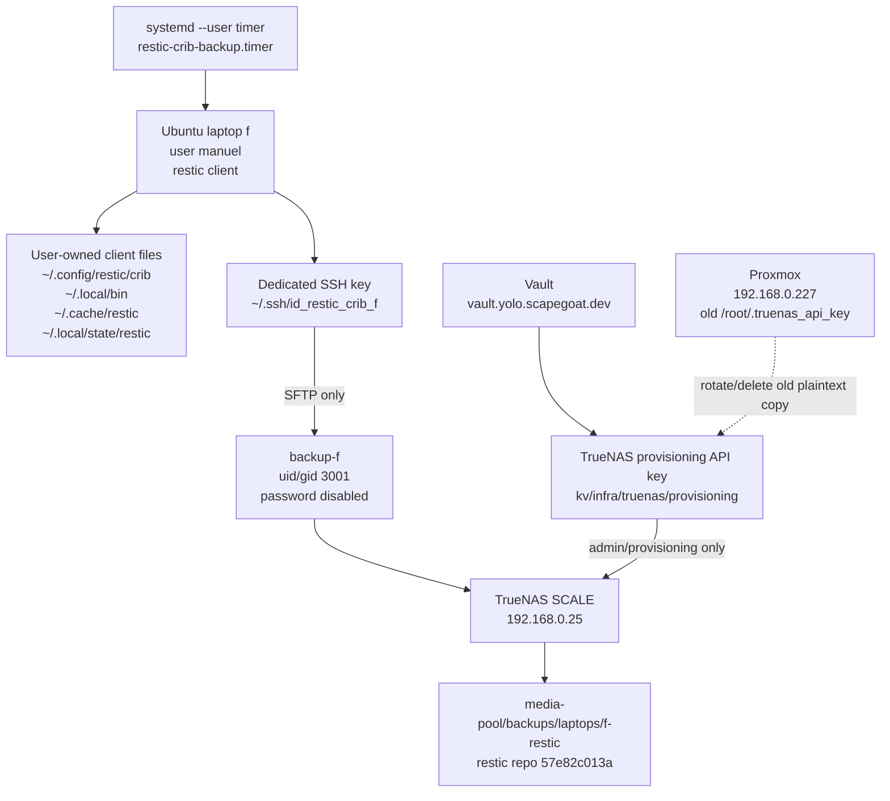

# Crib Backup: From Design to Operational Restic Baseline

This report explains how the Ubuntu laptop `f` was connected to the crib Proxmox/TrueNAS homelab as an encrypted, deduplicated, scheduled backup source. The important result is not merely that a backup command now runs. The system now has a clean restic baseline snapshot, a verified restore path, a user-level timer, a restricted SFTP runtime account, and a documented separation between routine backup credentials and TrueNAS administrative credentials.

The work began with an ambiguous target: “proper backup from this computer to crib.” Turning that into an operational system required answering several questions in order. What machine is the source? What storage system is really behind “OpenNAS”? Which existing infrastructure can be reused safely? Which credentials already exist, and which credentials should not be reused? What failure mode from the prior Jellyfin/TrueNAS outage must the backup design avoid? A reliable backup design is the product of those answers, not a command copied from a restic quickstart.

> [!summary]
> - The backup system is operational. Clean snapshot `b5530e39` completed with exit status 0, was restore-tested, and is now the operational baseline.
> - The runtime backup path is SFTP-only from laptop `f` to TrueNAS user `backup-f`; there is no NFS mountpoint fallback and no local filesystem fallback.
> - The client implementation is user-owned: scripts under `~/.local/bin`, configuration under `~/.config/restic/crib`, cache under `~/.cache/restic`, state under `~/.local/state/restic`, and scheduling via `systemd --user`.
> - Vault stores the high-power TrueNAS provisioning credential, but nightly restic backups do not depend on Vault. The remaining security task is to rotate or delete the old plaintext `/root/.truenas_api_key` on Proxmox.

## 1. What the system had to achieve

The source machine is a Framework laptop named `f` running Ubuntu 24.04.2 LTS. Its root filesystem is an encrypted LUKS/LVM/ext4 stack with roughly 1.8T total capacity and about 1.7T in use at the beginning of the investigation. That immediately ruled out a trivial backup plan. A one-time copy would be slow and wasteful. A scheduled copy without deduplication would repeatedly process large developer trees, browser caches, build outputs, local databases, and generated artifacts. A backup plan that silently wrote to the wrong directory would be worse than no backup because it would create confidence without recoverability.

The destination is the crib homelab. The relevant machines are:

| Component | Address / identity | Role in this backup project |
|---|---|---|
| Laptop `f` | local Ubuntu machine | Backup source and restic client. |
| Proxmox | `192.168.0.227`, `root@pve` | Hypervisor and historical storage of the plaintext TrueNAS API key. |
| TrueNAS SCALE | VM `106`, `192.168.0.25` | Backup repository host and SFTP endpoint. |
| k3s VM | VM `301`, `192.168.0.212` | Existing crib application node; not the backup target. |
| Vault | `https://vault.yolo.scapegoat.dev` | Storage and access control for TrueNAS provisioning credentials. |

The destination system already had responsibilities. TrueNAS already serves media to Jellyfin through an NFS export. k3s already consumes that export through `/mnt/media`. That existing media path was deliberately not reused for backups. Reusing it would mix two operational concerns: media service availability and laptop backup integrity.

The backup target created for this work is the TrueNAS dataset:

```text
media-pool/backups/laptops/f-restic
```

The restic repository lives at:

```text
sftp:backup-f@192.168.0.25:/mnt/media-pool/backups/laptops/f-restic
```

The repository id is:

```text
57e82c013a
```

The source path for scheduled backups is:

```text
/home/manuel
```

The design is intentionally scoped. It backs up the user home directory as user `manuel`. It does not try to become a system-image backup, does not read root-only system state, and does not depend on root-owned client configuration.

## 2. The prior failure that shaped the transport decision

The decisive design constraint came from an earlier TrueNAS/NFS failure. After a power outage, the k3s VM came back up while TrueNAS did not start early enough. The k3s node expected `/mnt/media` to be backed by the TrueNAS NFS export, but the path existed as an ordinary local directory. Jellyfin then observed an apparently valid path whose expected files were missing.

The technical lesson is precise:

```text
A directory existing is not evidence that the intended remote filesystem is mounted.
```

This matters for backups because an unattended backup script usually treats its destination path as authoritative. If the destination is `/mnt/backup` and the remote filesystem is not mounted, the script may still write successfully to a local directory. The command returns success while the data is stored in the wrong place. That is a backup integrity failure.

The design response was to reject NFS as the primary restic transport for this laptop backup. The backup uses SFTP directly. An SFTP connection either authenticates to TrueNAS and opens the remote repository, or it fails. There is no ordinary local directory that can accidentally receive the backup. The script also performs an explicit preflight check before calling restic.

The preflight has this shape:

```bash
ssh -i "${HOME}/.ssh/id_restic_crib_f" \
  -o BatchMode=yes \
  -o ConnectTimeout=10 \
  backup-f@192.168.0.25 \
  'test -d /mnt/media-pool/backups/laptops/f-restic'
```

If this command fails, the backup stops. There is no fallback path. This is not an omission; it is the safety property. A failed backup run is visible in logs. A successful backup to the wrong place is not.

## 3. The architecture that resulted

The final system separates three concerns that are often collapsed in small homelab automations:

1. Provisioning storage and users on TrueNAS.
2. Running the recurring encrypted backup.
3. Recovering data from a specific snapshot.

Those concerns use different credentials and different command paths.



The runtime backup path is short:

```text
systemd --user timer -> ~/.local/bin/restic-crib-backup -> SFTP backup-f@192.168.0.25 -> restic repository
```

The provisioning path is separate:

```text
operator OIDC login -> Vault -> TrueNAS API key -> TrueNAS API operations
```

The separation matters because the TrueNAS API key is powerful. It can create users, inspect datasets, and administer storage. The backup job does not need that authority. It only needs write access to the restic repository directory through a restricted SFTP account.

## 4. Why restic was the right tool for this phase

The source filesystem is ext4 over LUKS/LVM, not ZFS. That means ZFS send/receive is not an option for the laptop source. `rsync` exists, but rsync alone does not provide encrypted, deduplicated, versioned snapshots with retention and pruning. Restic provides exactly those properties while supporting SFTP as a backend.

The most important restic properties in this project are:

| Property | Why it matters here |
|---|---|
| Client-side encryption | TrueNAS stores encrypted repository data. The repository password remains on the laptop and is separately escrowed in Vault. |
| Deduplication | Repeated backups of large developer trees are incremental and avoid re-uploading unchanged content. |
| Snapshots | Restore can target a known point in time rather than the current source tree. |
| SFTP backend | The transport fails closed when the remote endpoint cannot be reached. |
| Retention policy | Scheduled jobs can prune old snapshots without manual repository cleanup. |

The repository password was generated locally and stored in:

```text
~/.config/restic/crib/password
```

It was also escrowed separately in Vault at:

```text
kv/infra/truenas/restic/laptop-f
```

This escrow path is deliberately not the same as the TrueNAS API key path. The restic password protects backup contents. The TrueNAS API key provisions infrastructure. Their blast radii are different and their access policies should remain different.

## 5. The user-level implementation boundary

A major design decision was to keep the client implementation under user `manuel` rather than installing root-owned backup scripts and system units. The backup target is `/home/manuel`, and a normal user can read the intended source files. Running as root would increase the number of files the backup can see, but it would also increase the damage a script bug can cause and would pull root-owned runtime state into a backup that is meant to be a user data backup.

The installed client shape is:

| Purpose | Path |
|---|---|
| Backup script | `~/.local/bin/restic-crib-backup` |
| Manual full backup wrapper | `~/.local/bin/restic-crib-manual-full` |
| Environment file | `~/.config/restic/crib/env` |
| Repository password | `~/.config/restic/crib/password` |
| Exclude file | `~/.config/restic/crib/excludes` |
| Restic cache | `~/.cache/restic` |
| State and logs | `~/.local/state/restic` |
| SSH key | `~/.ssh/id_restic_crib_f` |
| User service | `~/.config/systemd/user/restic-crib-backup.service` |
| User timer | `~/.config/systemd/user/restic-crib-backup.timer` |

The reference implementation is stored in the docmgr ticket under:

```text
/home/manuel/code/wesen/claw-stuff/ttmp/2026/06/06/CRIB-BACKUP-01--ubuntu-to-proxmox-truenas-backup-design/scripts/
```

This reference copy matters. It gives the project an auditable implementation record separate from the live files in the home directory.

## 6. Provisioning TrueNAS without making the backup job an admin

At the beginning of the project, the TrueNAS API key existed as a plaintext file on the Proxmox host:

```text
/root/.truenas_api_key
```

The file mode was `0600`, so it was not casually exposed to every local user. The problem was not Unix file mode alone. The problem was that a high-power TrueNAS administrative credential was stored indefinitely as plaintext on another infrastructure host. If Proxmox root is compromised, TrueNAS administration becomes available too.

The project moved the provisioning credential into Vault:

```text
kv/infra/truenas/provisioning
```

The fields include the API URL and the API key:

```text
api_url = https://192.168.0.25
api_key = <TrueNAS API key>
```

Vault was then used to create and verify the restricted runtime account `backup-f`. That account has:

| Property | Value |
|---|---|
| Username | `backup-f` |
| UID/GID | `3001` |
| Home | `/mnt/media-pool/backups/laptops/f-restic` |
| Password login | disabled |
| SSH key | `~/.ssh/id_restic_crib_f.pub` |
| Runtime purpose | SFTP-only restic repository access |

The important point is that Vault is a provisioning dependency, not a backup runtime dependency. Nightly backups do not contact Vault. They use the SFTP key. If Vault is down during the nightly backup window, the backup can still run.

The remaining security task is to finish removing the old plaintext API-key dependency on Proxmox. There are two possible meanings:

| Action | Meaning | Security result |
|---|---|---|
| Delete | Remove `/root/.truenas_api_key` from Proxmox but keep the same TrueNAS API key valid. | Proxmox no longer has the plaintext copy, but the old API key still exists in TrueNAS and Vault. |
| Rotate | Create a new TrueNAS API key, update Vault, smoke-test it, revoke the old key, then delete the Proxmox plaintext file. | Both the storage location and the credential value are changed. This is stronger. |

The recommended order is rotation:

```text
1. Create a new TrueNAS API key.
2. Update Vault at kv/infra/truenas/provisioning.
3. Run scripts/06-truenas-vault-smoke.sh.
4. Revoke the old TrueNAS API key in TrueNAS.
5. Delete /root/.truenas_api_key from Proxmox.
```

That sequence does not affect scheduled restic backups because those backups use `backup-f` over SFTP, not the TrueNAS API key.

## 7. The SFTP issue that required a restic-specific fix

A successful OpenSSH SFTP test did not initially imply that restic could open the repository. The first restic SFTP configuration used an environment variable shaped like an SSH command. Restic then failed with an SFTP session error even though the standalone `sftp` command worked.

The relevant failure looked like this:

```text
Fatal: create repository at sftp:backup-f@192.168.0.25:/mnt/media-pool/backups/laptops/f-restic failed: unable to start the sftp session, error: error receiving version packet from server: server unexpectedly closed connection: unexpected EOF
```

The working pattern was to use restic's backend option for SFTP arguments:

```bash
restic -o "sftp.args=${RESTIC_SFTP_ARGS}" snapshots
```

with:

```text
RESTIC_SFTP_ARGS=-i /home/manuel/.ssh/id_restic_crib_f -o BatchMode=yes -o IdentitiesOnly=yes
```

This detail is worth preserving because it is easy to test the wrong thing. OpenSSH `sftp` and restic's SFTP backend are not identical client paths. OpenSSH proves that the account and key work. Restic still needs its own backend arguments passed in the form it actually consumes.

The stable rule is:

```text
Use ssh/sftp for preflight. Use restic -o "sftp.args=..." for repository operations.
```

## 8. Repository initialization and smoke restore

After the dataset, SFTP user, SSH key, and restic password were in place, the repository was initialized. The repository id is:

```text
57e82c013a
```

A tiny smoke backup produced snapshot:

```text
a3a15848
```

The smoke snapshot backed up a small test directory and restored it into local state. This proved four things before attempting the terabyte-scale source:

- The laptop can authenticate to TrueNAS as `backup-f`.
- Restic can open the SFTP repository using the configured arguments.
- The repository password is correct.
- A restore can produce the original file content.

This smoke step is small, but it is not optional. It narrows the next failure domain. If the full backup fails later, the repository path itself is already known to work.

## 9. First full backup: a valid snapshot with warnings

The first full backup was launched as a transient user systemd unit. That was necessary because the full backup was too large for an interactive command with a fixed tool timeout. The unit was:

```text
restic-crib-manual-full.service
```

The manual wrapper lives at:

```text
~/.local/bin/restic-crib-manual-full
```

The first full run saved snapshot:

```text
be13295c
```

It processed and stored substantial data:

```text
Processed: 709.457 GiB
Added:     148.515 GiB
Stored:     89.217 GiB
```

But restic exited with status `3` because some files under `/home/manuel` were unreadable by user `manuel`. This is an important distinction. The snapshot exists and contains the readable data, but the exit status tells us it is not a clean operational baseline.

The unreadable files were not arbitrary user documents. They were root/service-owned generated or runtime state, including:

- Home Assistant `.storage` files owned by `root:root`.
- LibreChat Meilisearch data under `meili_data_v1.12`.
- Mosquitto test broker state owned by service UID/GID `1883:1883`.
- TTC anonymizer SQL dump exports owned by `root:root`.

The authoritative source note is:

```text
ttmp/2026/06/06/CRIB-BACKUP-01--ubuntu-to-proxmox-truenas-backup-design/sources/02-unreadable-files-from-first-full-backup.md
```

The conclusion was not to run the backup as root. Running as root would hide the scope problem by making the script able to read service state that does not belong in the user-level backup. The better fix was to delete generated state where appropriate and exclude or handle service-owned runtime data separately.

## 10. Clean incremental baseline: snapshot `b5530e39`

After the unreadable generated/service-owned files were deleted, a clean incremental backup was run with the tag `clean-incremental-after-delete`:

```bash
restic -o "sftp.args=${RESTIC_SFTP_ARGS}" backup /home/manuel \
  --one-file-system \
  --exclude-file "$RESTIC_EXCLUDE_FILE" \
  --tag laptop-f \
  --tag clean-incremental-after-delete
```

Restic used `be13295c` as the parent snapshot and saved:

```text
b5530e39
```

The successful trace is the key operational evidence:

```text
using parent snapshot be13295c
Files:       35248 new, 236566 changed, 6882646 unmodified
Dirs:        10170 new, 48598 changed, 981677 unmodified
Added to the repository: 2.072 GiB (995.022 MiB stored)
processed 7154460 files, 668.281 GiB in 7:52
snapshot b5530e39 saved
Exit status: 0
```

This snapshot is the operational baseline because it completed without unreadable-file warnings after cleanup. The earlier snapshot `be13295c` remains valuable as a first full snapshot, but `b5530e39` is the first clean steady-state proof.

The current snapshot sequence is:

| Snapshot | Meaning | Status |
|---|---|---|
| `a3a15848` | Smoke snapshot. | Proved repository backup/restore mechanics. |
| `be13295c` | First full snapshot. | Saved data, but exited with status 3 due to unreadable files. |
| `b5530e39` | Clean incremental baseline. | Exit status 0 and restore-tested. |

## 11. Restore test: proving that the snapshot can be used

A backup becomes operational only after a restore has been tested. The restore test used snapshot `b5530e39` and targeted two representative paths:

```text
/home/manuel/.ssh/id_restic_crib_f.pub
/home/manuel/code/wesen/claw-stuff/ttmp/2026/06/06/CRIB-BACKUP-01--ubuntu-to-proxmox-truenas-backup-design/scripts
```

The restore target was:

```text
~/.local/state/restic/restore-test-b5530e39
```

The result was:

```text
restoring <Snapshot b5530e39 ...> to /home/manuel/.local/state/restic/restore-test-b5530e39
Summary: Restored 20 / 9 files/dirs (7.007 KiB / 7.007 KiB) in 0:00
pubkey-compare-ok
script-count-ok
```

This restore test is intentionally small but meaningful. The public key verifies exact file content for a dotfile-like path. The scripts directory verifies a project directory with multiple files and executable scripts. It does not prove every byte in the repository, but it proves the restore path, password, repository location, and path selection syntax against the clean baseline snapshot.

A later test should restore a larger real project or document directory. That is a coverage improvement, not a blocker for enabling the timer.

## 12. Timer enablement and current operational state

After the clean backup and restore test passed, the user-level timer was enabled:

```bash
systemctl --user enable --now restic-crib-backup.timer
```

At the time of enablement, the timer reported:

```text
restic-crib-backup.timer active (waiting)
Next trigger: Tue 2026-06-09 03:30:05 EDT
```

The recurring job uses the normal backup script, not the manual full wrapper. The manual wrapper exists to supervise long first-run behavior. The scheduled path is the regular operational path.

The steady-state run sequence is:

```text
1. systemd --user timer fires.
2. restic-crib-backup loads ~/.config/restic/crib/env.
3. The script verifies required files and SFTP reachability.
4. restic runs backup /home/manuel with --one-file-system and the exclude file.
5. restic applies retention with forget/prune.
6. restic runs a repository check according to the script's policy.
7. Logs are available through the user journal and local state files.
```

The first scheduled run after enablement still needs to be verified. The check is straightforward:

```bash
systemctl --user list-timers restic-crib-backup.timer --no-pager
journalctl --user -u restic-crib-backup.service --since '2026-06-09 03:00' --no-pager
```

If the laptop was asleep or the user session was unavailable at the scheduled time, the journal will show that behavior. That observation will determine whether `loginctl enable-linger manuel` is worth enabling.

## 13. Excludes are part of the design, not cleanup after the fact

The laptop has a large developer workload. The exclude file is therefore an architectural component. It prevents the repository from filling with caches, generated dependency trees, build outputs, and service-owned state that should not be preserved as ordinary user documents.

Examples of excluded classes include:

| Class | Examples | Reason |
|---|---|---|
| Package and build caches | `.cache`, npm caches, build output directories | Regenerable and large. |
| Dependency trees | `node_modules`, `.venv`, Rust/Cargo registries where applicable | Reproducible from source manifests. |
| Build outputs | `dist`, `build`, `target`, `.next`, `.nuxt` | Generated artifacts. |
| Service/runtime state under home | LibreChat Meili data, Mongo/WiredTiger-like data, local app state | Often root/service-owned and better handled by app-specific exports if needed. |
| Capture and test artifacts | packet captures and test broker databases | Large or generated; should be intentionally preserved only when needed. |

This does not mean excluded data has no value. It means excluded data is not part of the normal user home backup contract. If a local service has real state that matters, it should receive an explicit backup/export strategy. A user-level restic job should not silently become the backup plan for every container or service that once wrote files under `/home/manuel`.

## 14. Failure modes encountered and what they taught

The implementation produced several failures that are now useful system knowledge.

### 14.1 Interactive full backups are the wrong execution mode

The first full backup was too long for an interactive command constrained by an agent tool timeout. The fix was to run it as a transient user systemd unit. That preserved the user-level privilege boundary while allowing the process to continue independently.

The stable rule is:

```text
Use foreground commands for preflight and smoke tests. Use supervised user units for long full backups.
```

### 14.2 Inline systemd-run commands can expand variables too early

An early `systemd-run` attempt embedded a long shell program directly in the transient unit. The `${RESTIC_SFTP_ARGS}` expression was expanded too early and became empty, producing `sftp.args=` and an authentication failure.

The fix was to put the logic in a real script file:

```text
~/.local/bin/restic-crib-manual-full
```

The stable rule is:

```text
For long-running operational commands, prefer a script with explicit argument handling over an inline transient shell program.
```

### 14.3 A snapshot with warnings is not a clean baseline

Snapshot `be13295c` exists and contains data, but it exited with status `3`. Treating that as fully operational would hide unreadable-file behavior. The clean baseline is `b5530e39`, because it completed after the unreadable paths were handled and returned status `0`.

The stable rule is:

```text
Enable scheduling only after a clean backup and a restore test, not merely after the first snapshot exists.
```

### 14.4 Permission errors should be classified, not blindly bypassed

The unreadable files were mostly generated or service-owned state. The fix was not to give restic root privileges. The fix was to decide whether each class of data belonged in the user-level backup contract. That preserved the original security boundary.

The stable rule is:

```text
Permission denied during a user backup is a scope question before it is a privilege question.
```

## 15. Current status

The backup system is now operational on the local TrueNAS target.

| Area | Status |
|---|---|
| TrueNAS dataset | Created: `media-pool/backups/laptops/f-restic`. |
| Runtime account | Created: `backup-f`, uid/gid `3001`, SSH key authorized. |
| Restic repository | Initialized: repo id `57e82c013a`. |
| Smoke backup/restore | Passed: snapshot `a3a15848`. |
| First full backup | Completed with warnings: snapshot `be13295c`, exit status `3`. |
| Clean baseline | Completed successfully: snapshot `b5530e39`, exit status `0`. |
| Restore test | Passed from `b5530e39`. |
| Timer | Enabled: `restic-crib-backup.timer active (waiting)`. |
| Vault provisioning secret | Stored: `kv/infra/truenas/provisioning`. |
| Restic password escrow | Stored: `kv/infra/truenas/restic/laptop-f`. |
| Remaining security task | Rotate/delete `/root/.truenas_api_key` on Proxmox. |

The most important distinction is that backup operations are now proven independently of provisioning credentials. The restic timer should continue to run through SFTP even if Vault is unavailable.

## 16. What remains to do

There are four remaining tasks worth tracking.

### 16.1 Verify the first scheduled timer run

The next operational check is to inspect the first scheduled run after the timer was enabled. Use:

```bash
systemctl --user list-timers restic-crib-backup.timer --no-pager
journalctl --user -u restic-crib-backup.service --since '2026-06-09 03:00' --no-pager
```

If the scheduled backup did not run because the laptop was asleep or the user session was not active, decide whether to enable lingering:

```bash
loginctl enable-linger manuel
```

That should be an explicit operational decision because lingering changes when user services can run.

### 16.2 Rotate the TrueNAS API key

Prefer rotation over deletion-only:

```text
1. Create a new TrueNAS API key in the UI.
2. Patch Vault at kv/infra/truenas/provisioning with the new key.
3. Run the read-only smoke test.
4. Revoke the old TrueNAS API key.
5. Delete /root/.truenas_api_key from Proxmox.
```

The smoke-test command is:

```bash
export VAULT_ADDR=https://vault.yolo.scapegoat.dev
ttmp/2026/06/06/CRIB-BACKUP-01--ubuntu-to-proxmox-truenas-backup-design/scripts/06-truenas-vault-smoke.sh
```

Deletion of the old plaintext copy, after rotation, can use:

```bash
ssh root@192.168.0.227 'shred -u /root/.truenas_api_key'
```

### 16.3 Add stale-backup monitoring

A timer being enabled is not the same as backups remaining healthy. The next monitoring rule should check snapshot recency. A simple first invariant is:

```text
There should be a successful laptop-f snapshot less than 48 hours old.
```

This can later become a user-level script, a Prometheus check, or a healthcheck endpoint. The important part is to alert on absence of recent success, not only on explicit failure.

### 16.4 Run a larger restore test

The restore test from `b5530e39` proved the mechanism. A larger restore test should prove a more realistic workflow. Good candidates are:

- a real project directory under `/home/manuel/code/wesen`;
- a personal document directory;
- a directory with mixed file modes and nested subdirectories.

The test should restore into a temporary target under `~/.local/state/restic`, compare file counts and representative checksums, and then remove the restored copy after review.

## 17. Working rules to carry forward

The durable engineering rules from this project are:

- Use SFTP as a fail-closed transport for this backup. Do not introduce an NFS or local filesystem fallback for restic repository writes.
- Keep routine backups user-owned. Escalate privileges only for provisioning tasks that require them.
- Treat Vault as the administrative credential control plane, not as a runtime dependency for nightly restic backups.
- Classify unreadable files before changing privileges. If files are service-owned generated state, exclude or export them deliberately rather than making the whole backup run as root.
- Do not enable unattended scheduling until a clean backup and at least one restore test have passed.
- Treat the clean snapshot `b5530e39` as the operational baseline until a newer clean scheduled snapshot supersedes it.
- Rotate the old TrueNAS API key instead of only deleting the plaintext copy if a UI rotation path is available.

## 18. Source artifacts

The primary ticket is:

```text
/home/manuel/code/wesen/claw-stuff/ttmp/2026/06/06/CRIB-BACKUP-01--ubuntu-to-proxmox-truenas-backup-design
```

The most relevant files are:

| File | Purpose |
|---|---|
| `design-doc/01-ubuntu-to-proxmox-truenas-backup-analysis-and-implementation-guide.md` | Intern-oriented design and implementation guide. |
| `playbook/01-vault-managed-truenas-access-guide.md` | Vault-managed TrueNAS provisioning credential playbook. |
| `reference/01-investigation-diary.md` | Chronological implementation diary and command evidence. |
| `sources/02-unreadable-files-from-first-full-backup.md` | Authoritative unreadable-file list from the first full backup warning run. |
| `scripts/03-restic-crib-backup` | Reference scheduled backup script. |
| `scripts/06-truenas-vault-smoke.sh` | Read-only Vault/TrueNAS smoke test. |
| `scripts/07-restic-crib-manual-full` | Manual first-full backup wrapper. |

The relevant commits recorded during the work include:

```text
claw-stuff: 714d122641d8128bcbf07fcf68246ea5e90d4e31 — Validate crib backup clean snapshot
Obsidian: 199a650 — Update TrueNAS backup case study with clean snapshot
```

This article is a new append-only report that summarizes the system from investigation through operational baseline. It should be read alongside the ticket if exact command history or implementation files are needed.

## Related notes

- [[PROJECT REPORT - Tailscale on TrueNAS - Making Restic Backups Work From Any Network]] — Tailscale installation on TrueNAS that makes this backup reachable from any network, not just the home LAN.
- [[PROJECT REPORT - Restic Backup Scope Design - From 1.7T Home to a 247G Recovery Unit]] — later scope investigation that refined the excludes file and verified the backup size.
- [[PLAYBOOK - Restic Backups to the Crib NAS]] — generalized playbook with parameterized scripts extracted from this and the macOS implementation.
