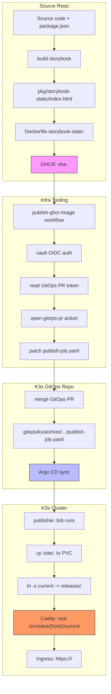

# Static-Sites Deployment: A Three-Contract Model for Shipments

This note documents the deployment model used to ship static sites on the Hetzner K3s cluster. The model decomposes deployment into three contracts — the **source artifact contract**, the **GitOps handoff contract**, and the **cluster serving contract** — each with its own responsibility boundary, failure modes, and validation commands. The contract boundaries prevent accidental coupling: changes to the source build pipeline do not touch cluster manifests, and changes to the cluster manifests do not touch the source repository.

The pattern was exercised during the deployment of `@go-go-golems/rag-evaluation-site` Storybook to `https://rag-evaluation-storybook.yolo.scapegoat.dev/`. The site is live, Argo CD reports `Synced Healthy`, and all three contracts are connected. The source workflow experienced a startup failure on the first `main` push, which required a manual first publication through the same artifact and GitOps contracts — demonstrating that the contract boundaries make manual recovery straightforward without compromising the architecture.

> [!summary]
> - Static sites ship through an immutable GHCR image that contains only `/site` — nothing runs inside it.
> - The source repository owns the build pipeline and the handoff target metadata. The GitOps repository owns the desired deployment state. Argo CD reconciles them.
> - The cluster has a single shared Caddy server that routes by hostname to `/srv/sites/{host}/current`. Each site only needs a publisher Job, not a long-running server.

## Why this note exists

The static-sites model on this cluster has been used for multiple projects (`dmeta-examples`, `rag-evaluation-storybook`, `go-go-os-examples`), but the contract boundaries are not documented in one place. Engineers joining the team need to understand not just which files to create, but why each file exists and where its responsibility ends.

This note preserves the architectural rationale, the file-level contracts between repos, the validation commands, and the failure modes encountered during the first live rollout. A future reader should be able to deploy a new static site from this note alone.

## The three contracts

Deployment is a sequence of handoffs. Each handoff is a contract: the sender guarantees something, the receiver depends on it, and a failure at any boundary is visible through a specific symptom.

### Contract 1: Source artifact

The source repository must produce a Docker image that, when run, contains a readable `/site` directory with `index.html` at its root.

```dockerfile
# Dockerfile.storybook-static
FROM alpine:3.20
WORKDIR /
COPY packages/rag-evaluation-site/storybook-static/ /site/
RUN test -f /site/index.html
```

The Dockerfile does not run a server. It does not install Node. It is an artifact carrier. The build step that produces `packages/rag-evaluation-site/storybook-static/` (in this case `pnpm --dir packages/rag-evaluation-site build-storybook`) happens in CI before Docker packaging, or in a local development step. The Dockerfile only copies an already-built tree.

The invariant is simple: `/site/index.html` must exist. This is checked inside the Dockerfile with `RUN test -f /site/index.html`. If the build step fails to produce the static tree, this step fails. The failure is visible before the image is pushed.

**Why this works:** The cluster's publisher Job mounts the image filesystem and copies `/site/.` into the shared PVC. It does not need to run the image. It only needs the filesystem to contain the expected files.

**Failure mode:** `.dockerignore` excludes too much (missing `storybook-static/` from the build context) or not enough (including `node_modules/`, making the build context bloated). The fix is to add a negation rule `!packages/rag-evaluation-site/storybook-static/**` to `.dockerignore` while excluding `node_modules` at the workspace level.

### Contract 2: GitOps handoff

The source repository owns a single JSON file that tells infra-tooling where to patch:

```json
{
  "targets": [
    {
      "name": "rag-evaluation-storybook-prod",
      "gitops_repo": "wesen/2026-03-27--hetzner-k3s",
      "manifest_path": "gitops/kustomize/rag-evaluation-storybook/publish-job.yaml",
      "container_name": "publish",
      "patch_strategy": "static-publisher-job"
    }
  ]
}
```

This file says: after building and pushing a GHCR image, patch `gitops/kustomize/rag-evaluation-storybook/publish-job.yaml` in the `wesen/2026-03-27--hetzner-k3s` repository. Use `patch_strategy: static-publisher-job` because the publisher Job encodes the release token in multiple fields — Job name, release label, image tag, and shell `release` variable. Kubernetes Job pod templates are immutable; changing only `image:` leaves Argo CD unable to apply the change. The `static-publisher-job` strategy rewrites all `sha-*` tokens together.

The reusable workflow from `go-go-golems/infra-tooling` reads this file, authenticates to Vault via GitHub Actions OIDC, opens a PR against the GitOps repo, and patches all `sha-*` tokens. The source workflow is the handoff trigger. It does not touch the cluster. It does not run any cluster commands. It opens a PR and returns.

**Why this works:** The handoff is explicit and traceable. Every release is a visible PR that changes four release tokens in one commit. The PR can be reviewed before merging. The patch strategy is determined by a single JSON field.

**Failure mode:** The workflow calls a reusable workflow from another organization (`go-go-golems/infra-tooling/.github/workflows/publish-ghcr-image.yml@main`). If the called workflow cannot be found or parsed (e.g., due to permission restrictions on reusable workflows in public repos), the runner logs `startup_failure` and creates zero jobs. No job log exists to inspect because no jobs were created. The symptom is a run with `conclusion: startup_failure` and `jobs: []`.

**Mitigation:** Manual first publication works through the same artifact contract — build the Docker image, push to GHCR, patch the publisher Job by hand or through a separate release PR. The manual path preserves the same release token semantics and does not change the target architecture.

### Contract 3: Cluster serving

The K3s cluster runs `static-sites-host`, a shared Caddy server. It reads the hostname from each incoming request and serves files from `/srv/sites/{host}/current`.

```caddy
:8080 {
  root * /srv/sites/{host}/current
  try_files {path} {path}/ /index.html
  file_server
}
```

The static-sites model uses a shared PVC (`static-sites-content`) and per-site publisher Jobs. Each publisher Job pulls a GHCR artifact image, copies `/site/.` into a release directory under `/srv/sites/<host>/releases/<sha>`, and atomically symlinks `/srv/sites/<host>/current` to that release. The Caddy server serves from `current`, so a new release becomes live instantly with no downtime.

The K3s repo contains a Kustomize package for each site:

```text
gitops/kustomize/rag-evaluation-storybook/
├── kustomization.yaml
├── serviceaccount.yaml
├── vault-connection.yaml
├── vault-auth.yaml
├── vault-static-secret-image-pull.yaml
├── publish-job.yaml
└── ingress.yaml
```

The publisher Job is the only resource that changes between releases. All other resources (ServiceAccount, VaultConnection, VaultAuth, VaultStaticSecret, Ingress) are static scaffolding. The Argo CD Application object in `gitops/applications/rag-evaluation-storybook.yaml` points at the Kustomize package and reconciles automatically.

**Why this works:** One long-running Caddy server serves all static sites. Each site only pays for a publisher Job that runs once per release. TLS is managed by cert-manager per host. Ingress is a Traefik class resource that routes to the shared Caddy service.

**Failure mode:** Argo CD reports `SharedResourceWarning` when two applications own the same `VaultConnection` resource. The `dmeta-examples` static site and `rag-evaluation-storybook` both used a `VaultConnection` named `vault`, which caused Argo to flag it as out of sync for `rag-evaluation-storybook` even though the resource was healthy. The fix is to give each static-site package its own `VaultConnection` name (e.g., `rag-evaluation-storybook-vault`) and update `VaultAuth.spec.vaultConnectionRef` to match.

**Failure mode:** The publisher Job uses a placeholder release token (`sha-0000000`) in its initial manifest. If the Argo CD Application is applied before a real `sha-*` image exists and replaces the placeholder, the Job pulls a non-existent image and the cluster shows `ImagePullBackOff`. The manifest must either start with a real image tag, or the first manual image push must replace the placeholder before the Argo sync runs.

## Architecture diagram



The diagram shows the three contracts as distinct subgraphs. The source repo produces the artifact. Infra-tooling performs the handoff. The cluster serves the result.

## Validation commands

Each contract has a validation command that can be run before pushing or merging.

### Source artifact validation

```bash
cd <source-repo>
pnpm --dir packages/rag-evaluation-site typecheck
pnpm --dir packages/rag-evaluation-site build-storybook
docker build -f Dockerfile.storybook-static -t test-image .
docker run --rm test-image sh -c 'test -f /site/index.html'
```

### GitOps target metadata validation

```bash
python3 scripts/gitops/validate_gitops_targets.py deploy/gitops-targets.json
# Output: deploy/gitops-targets.json: OK (1 target(s))
```

### K3s manifest rendering validation

```bash
cd <k3s-repo>
kubectl kustomize gitops/kustomize/<site>/ >/tmp/rendered.yaml
rg -n '<site>|sha-|VaultStaticSecret|Ingress|static-sites-host' /tmp/rendered.yaml
```

### Cluster rollout validation

```bash
kubectl -n argocd get application <site>
kubectl -n static-sites get job,pod,vaultauth,vaultstaticsecret,secret,ingress
curl -fsSI https://<site>.yolo.scapegoat.dev/
```

## The Vault credential split

The deployment model requires two separate Vault credential paths, and they should not be conflated.

### Kubernetes image-pull credential

Used by the publisher Job's pod to pull the GHCR artifact image. Wired through Vault Secret Operator:

1. Vault KV secret at `kv/apps/<site>/prod/image-pull` containing `server`, `username`, `password`, `auth`
2. `VaultStaticSecret` renders a `kubernetes.io/dockerconfigjson` secret
3. ServiceAccount references the pull secret via `imagePullSecrets`
4. Vault connection: `VaultConnection` → `VaultAuth` → Kubernetes JWT auth with the site's own role

### GitHub Actions GitOps PR credential

Used by the source workflow to open a PR against the K3s repo. Wired through Vault JWT auth:

1. Vault KV secret at `kv/ci/github/<source-repo>/gitops-pr-token` containing the GitHub token
2. GitHub Actions OIDC role: `vault_role: <repo>-gitops-pr` with JWT audience `https://vault.yolo.scapegoat.dev`
3. The workflow uses `hashicorp/vault-action@v3` with `method: jwt` to exchange the GitHub OIDC token for a short-lived Vault token
4. The Vault token reads the GitOps PR secret and exports it as `GITOPS_PR_TOKEN`

The two credential paths should use separate Vault policies. The Kubernetes policy should only grant `read` on the image-pull KV path. The GitHub Actions policy should only grant `read` on the GitOps PR token KV path and auth token operations. Neither path should grant broad KV traversal or app runtime secret access.

## Common failure modes

| Symptom | Root cause | Fix |
|---|---|---|
| `startup_failure` with zero jobs | Reusable workflow from another org could not be parsed or loaded before jobs were created | Check the called workflow exists at the referenced ref. For first publication, build and push the image manually through the same artifact contract |
| `ImagePullBackOff` on publisher pod | GHCR image is private and the image-pull secret is missing or points to wrong credentials | Verify `VaultStaticSecret` is synced/healthy. Check KV secret fields (`server`, `username`, `password`, `auth`). Use the same credentials as `docker login ghcr.io` |
| Argo `OutOfSync Healthy` with `SharedResourceWarning` | Two applications own the same `VaultConnection` resource | Give each static-site package its own `VaultConnection` name matching the site |
| Publisher Job reports `immutable field is immutable` | GitOps PR only changed the `image:` field without changing the Job name | Use `patch_strategy: static-publisher-job` in target metadata, which rewrites all release tokens together |
| Job name, release label, image tag, shell release out of sync | Manual edit changed only one `sha-*` token | The `static-publisher-job` strategy rewrites all four together automatically via infra-tooling |
| Site returns 404 | Publisher Job did not write `/srv/sites/<host>/current`, or the path is wrong | Check publisher Job logs. Verify the hostname in the Ingress matches the publisher Job's `host` variable |
| TLS secret pending | cert-manager is solving ACME challenge or the Ingress host does not resolve | Check `kubectl -n static-sites get certificate,challenge,order`. Verify DNS wildcard resolves to cluster ingress |

## Anti-patterns

**Building the static site inside Docker.** The Dockerfile should copy an already-built tree (`packages/.../storybook-static/`). Do not run `pnpm install && pnpm build-storybook` inside the Docker image. That couples the Docker image to the build environment and makes caching unpredictable. The build step belongs in CI (or locally), and the Dockerfile only packages the result.

**Changing the publisher Job without changing the Job name.** Kubernetes Job pod templates are immutable. If the GitOps PR changes `image:` but not `metadata.name` (which contains the release token), Argo CD cannot apply the change. The `static-publisher-job` strategy avoids this by rewriting all release tokens together.

**Sharing `VaultConnection` across static-site packages.** `VaultConnection` is a namespaced resource. Two Argo CD Applications in the same namespace that both own a `VaultConnection` named `vault` will produce `SharedResourceWarning` and `OutOfSync` for the second application. Each static-site package should use a unique `VaultConnection` name.

**Applying the Argo CD Application before the first real image exists.** The initial `publish-job.yaml` may contain `sha-0000000`. Applying the Application with a placeholder image causes `ImagePullBackOff`. Either replace the placeholder before applying, or accept the failure and apply only after the first real image is pushed and the GitOps PR has replaced the placeholder.

## Recommended implementation sequence

Deploy a new static site in this order:

1. Add `Dockerfile.<name>-static` to the source repository.
2. Add `.dockerignore` tuned for the static artifact build context.
3. Update `.gitignore` to exclude the generated static output directory.
4. Run `pnpm --dir packages/... build-storybook` locally and verify `/site/index.html` exists.
5. Run `docker build -f Dockerfile.<name>-static -t test-image .` and `docker run --rm test-image sh -c 'test -f /site/index.html'`.
6. Add `deploy/gitops-targets.json` with `patch_strategy: static-publisher-job`.
7. Validate with `python3 scripts/gitops/validate_gitops_targets.py deploy/gitops-targets.json`.
8. Add `.github/workflows/publish-<name>.yml` that calls `go-go-golems/infra-tooling/.github/workflows/publish-ghcr-image.yml@main`.
9. Create the K3s Kustomize package at `gitops/kustomize/<name>/` with ServiceAccount, VaultConnection, VaultAuth, VaultStaticSecret, publisher Job, and Ingress.
10. Create the Argo CD Application at `gitops/applications/<name>.yaml`.
11. Add Vault policies and roles for image-pull and GitOps PR credentials.
12. Bootstrap live Vault roles with the existing scripts.
13. Seed the image-pull KV secret (`kv/apps/<name>/prod/image-pull`) and GitOps PR token KV secret (`kv/ci/github/<source-repo>/gitops-pr-token`).
14. Merge the source repo PRs to trigger the workflow, or build and push the first image manually if the workflow encounters `startup_failure`.
15. Merge the K3s release GitOps PR that replaces `sha-0000000` with a real `sha-*` tag.
16. Apply the Argo CD Application once: `kubectl apply -f gitops/applications/<name>.yaml && kubectl -n argocd annotate application <name> argocd.argoproj.io/refresh=hard --overwrite`.
17. Wait for `Application: Synced Healthy`, publisher Job: `Complete 1/1`, TLS secret exists.
18. Smoke test: `curl -fsSI https://<name>.yolo.scapegoat.dev/`.

## Working rules

- The Dockerfile copies; it does not build. Build steps belong in CI or locally.
- `deploy/gitops-targets.json` is source-owned. The K3s repo never touches this file.
- `patch_strategy: static-publisher-job` is required for all publisher Jobs. It rewrites all `sha-*` tokens together.
- Each static-site package gets its own `VaultConnection` name. Never share `VaultConnection` across packages.
- The publisher Job uses a placeholder `sha-0000000` initially. Replace it before live sync, or accept `ImagePullBackOff` until the replacement PR merges.
- The first Argo CD Application apply is a one-time bootstrap. Subsequent syncs happen automatically through GitOps PR merges.
- When the source workflow fails with `startup_failure`, the artifact contract can still be exercised manually. The first deployment does not require the automated workflow.

## Pseudocode: the publisher Job

```sh
set -eu
host="<hostname>.yolo.scapegoat.dev"
release="sha-<short-sha>"
base="/srv/sites/${host}"
target="${base}/releases/${release}"
tmp="${target}.tmp"

rm -rf "${tmp}" "${target}"
mkdir -p "${tmp}"
cp -a /site/. "${tmp}/"
mv "${tmp}" "${target}"
ln -sfn "releases/${release}" "${base}/current"
```

The use of a temporary directory (`tmp`) ensures that the `current` symlink never points to a partially copied release. The `mv` is atomic on the same filesystem. The `ln -sfn` updates `current` in a single operation. This is the key detail that makes zero-downtime releases possible.

## Related notes

- The static-sites playbook for the K3s cluster: `/home/manuel/code/wesen/2026-03-27--hetzner-k3s/docs/static-site-packaging-and-gitops-playbook.md`
- The infra-tooling reusable workflow: `go-go-golems/infra-tooling/.github/workflows/publish-ghcr-image.yml`
- The infra-tooling GitOps PR action: `go-go-golems/infra-tooling/actions/open-gitops-pr/`
- Source repo: `go-go-golems/rag-evaluation-system` — packages/rag-evaluation-site
