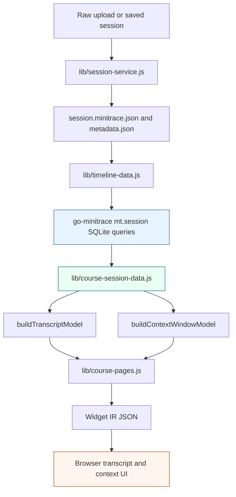
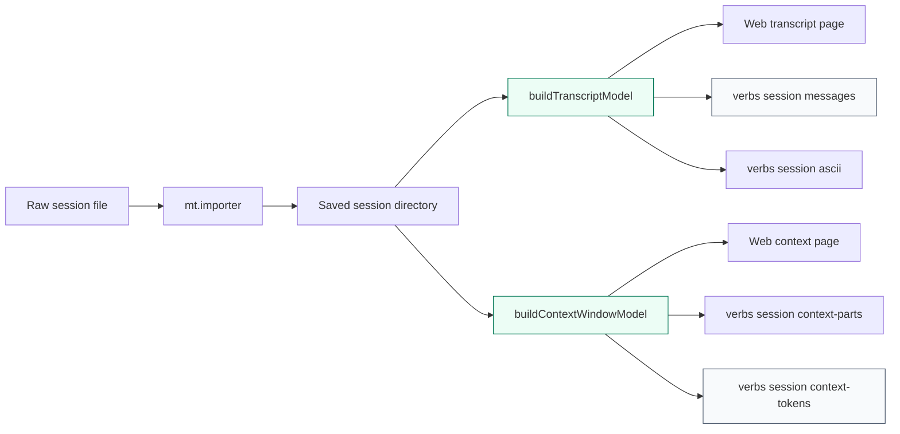

# Minitrace Viz: CLI Session Models and Token Provenance

> [!warning] Historical DuckDB commands
> This note contains `go-minitrace query duckdb` examples from an earlier engine generation. The analysis remains useful, but use `go-minitrace query run` and the normalized SQLite schema. See [[ARTICLE - go-minitrace Query Engine Migration - DuckDB to Normalized SQLite]].

This report explains the MINIVIZ-011 implementation in `ClubMedMeetup/minitrace-viz`: a new xgoja jsverb interface that exposes the same transcript and context-window models used by the web UI as terminal commands. The work started as a request for a CLI preview surface and became a tighter validation path for normalized agent transcripts, source facts, tool-call token accounting, and context-window composition.

The implementation is a good example of a useful rule for transcript tooling: a browser view should not be the only way to inspect the data model that feeds it. If a web component receives a transcript model, the model should also be available as structured CLI data. If the CLI displays token counts, those counts should state whether they are actual transcript usage fields or estimates reconstructed for visualization.

> [!summary]
> - `minitrace-viz` now exposes `verbs session ...` commands for summaries, messages, annotations, source facts, tool calls, context parts, context tokens, context writeups, and ASCII session views.
> - The commands reuse `buildTranscriptModel(sessionId)` and `buildContextWindowModel(sessionId, turn)` rather than parsing transcripts a second time.
> - A real Pi session exposed a repeated `90` token bug caused by estimating from 360-character previews. The fix computes result lengths in SQL before cell truncation and labels all token values with provenance fields.
> - The final CLI distinguishes actual transcript token usage from reconstructed context composition with `token_source`, `is_estimated`, `actual_tokens`, and `estimated_tokens`.

## Why this report exists

The work changed more than the command list of a small local application. It clarified the relationship between three layers that are easy to confuse when building transcript tooling:

1. **Canonical conversion and query behavior** lives in `go-minitrace`. It detects Pi, Codex, Claude Code, and native minitrace inputs; materializes normalized SQLite tables; and exposes query/view APIs through Goja.
2. **Application-specific presentation models** live in `minitrace-viz`. They turn normalized turns, tools, files, events, and attachments into transcript messages, context-window parts, annotations, and Widget IR pages.
3. **Operator debugging surfaces** now exist in the generated xgoja CLI. They execute the same JavaScript model builders that the web server uses, but return rows or text directly through Glazed output formats.

The distinction matters because token debugging is not just a display problem. Some token numbers are reported by the original agent runtime. Other token numbers are reconstructed so that a human can understand which context-window blocks are large. Those reconstructed values are useful, but they are not equivalent to source-reported usage. MINIVIZ-011 makes that distinction visible in the command output.

## Project context

The repository is located at:

```text
/home/manuel/workspaces/2026-06-07/club-meetup-site/ClubMedMeetup/minitrace-viz
```

The implementation ticket is located at:

```text
/home/manuel/workspaces/2026-06-07/club-meetup-site/ClubMedMeetup/ttmp/2026/06/10/MINIVIZ-011--cli-jsverbs-for-minitrace-viz-session-models
```

The important commits for this report are:

| Commit | Meaning |
|---|---|
| `96dec76` | Created the MINIVIZ-011 ticket and initial design guide. |
| `9c067c8` | Added the first session jsverbs and CLI projection helper. |
| `ab3a951` | Recorded the first implementation in docs and ticket artifacts. |
| `301626a` | Added tool/context token audit commands and fixed preview-based token estimation. |
| `c3ec270` | Recorded the token audit validation and go-minitrace cross-checks. |
| `3003cec` | Added actual-versus-estimated token provenance labels. |
| `7913f9f` | Recorded token provenance labels in docs and ticket artifacts. |

The repository had later unrelated MINIVIZ-010 work on the same branch when this report was written. This report focuses on MINIVIZ-011 only.

## The architecture before MINIVIZ-011

Before this work, `minitrace-viz` was already an xgoja application. The generated binary could serve a Widget IR web application, upload transcripts, convert them through `go-minitrace`, and render transcript/context pages in the browser.

The core web pipeline was:



The important property is that the browser did not parse the transcript directly. Server-side JavaScript opened the saved minitrace archive through `mt.session()`, queried normalized tables, and then produced page-specific model objects. The web renderer consumed those model objects as Widget IR props.

That architecture already had a useful separation of responsibilities:

| File | Responsibility |
|---|---|
| `site.js` | Existing xgoja jsverb entry point for the HTTP site. |
| `server.js` | Express routes, upload actions, Widget IR page API, and data APIs. |
| `lib/session-service.js` | Saved-session directory contract: `session.minitrace.json`, `metadata.json`, `original-upload.txt`. |
| `lib/timeline-data.js` | Opens `mt.session()` and reads normalized SQLite tables. |
| `lib/course-session-data.js` | Builds transcript messages, annotations, source facts, and context-window parts. |
| `lib/course-pages.js` | Converts session models into Widget IR pages. |
| `xgoja.yaml` | Defines runtime modules, jsverb scanning, and generated binary output. |

What was missing was a direct way to inspect the intermediate model without opening the browser. The web UI could be correct or wrong, but a developer had to infer the server-side model from the rendered page or call HTTP endpoints manually. That made validation slow, especially when the bug concerned token accounting inside context blocks.

## The design rule: one model pipeline, multiple renderers

The central design decision was to reuse the same model builders that the web UI uses. The CLI does not introduce another transcript parser. It does not reimplement Pi, Codex, or Claude Code conversion rules. It does not run a separate SQL query for every output shape unless it needs raw audit data that the model builder does not expose.

The target structure is:



This design makes the CLI a diagnostic surface for the web model. If `verbs session messages` reports that a tool row has the wrong token count, the browser would have received the same incorrect model. If `verbs session context-writeup` reports that a context part was estimated from a preview, the cause is in the shared model path, not in a separate CLI parser.

The implementation therefore added two main files:

```text
lib/session-cli.js     # option handling, session resolution, model projections, ASCII/text reports
session-verbs.js       # static xgoja jsverb metadata and command registration
```

The xgoja include lists were updated in `xgoja.yaml` and `xgoja.package.yaml` so the generated binary scans `session-verbs.js`.

## The CLI command surface

The final command set is under `minitrace-viz verbs session`:

| Command | Output | Purpose |
|---|---|---|
| `summary` | Structured row | Session title, framework, model, counts, source facts, diagnostics. |
| `messages` | Structured rows | Transcript messages generated by `buildTranscriptModel`. |
| `annotations` | Structured rows | Transcript annotations, including source-fact annotations. |
| `source-facts` | Structured rows | Explicit source events and attachments preserved from the original transcript. |
| `tool-calls` | Structured rows | Tool calls with call-token estimates, result-token estimates, byte counts, result lengths, and provenance. |
| `context-parts` | Structured rows | Context-window parts generated by `buildContextWindowModel`. |
| `context-tokens` | Structured rows | Context-window token rows with cumulative tokens, percentages, and provenance. |
| `context-writeup` | Text | A detailed context-token report with grouped totals and tool audit. |
| `ascii` | Text | Compact session overview with sampled messages, source facts, and annotations. |

The commands accept either an existing saved session id or a raw/native transcript file:

```bash
./dist/minitrace-viz verbs session summary \
  --session-file ~/.pi/agent/sessions/.../session.jsonl \
  --sessions-dir /tmp/minitrace-viz-jsverbs \
  --output yaml

./dist/minitrace-viz verbs session context-writeup \
  --session-id real-pi \
  --sessions-dir /tmp/minitrace-viz-real-fixtures \
  --cache-dir /tmp/minitrace-viz-real-cache \
  --turn 3
```

The `--session-file` path imports the source through `mt.importer()` and saves it into the sessions directory before calling the model builders. The `--session-id` path skips import and reads the saved session directly.

The import flow preserves `original-upload.txt` next to the normalized archive. That detail matters because existing web fallback logic can use the original uploaded JSONL when the normalized archive is not enough for older/simple input shapes.

## Session resolution and runtime configuration

The helper in `lib/session-cli.js` has to set runtime configuration before loading modules that cache configuration. The relevant invariant is in `lib/config.js`: `loadConfig()` caches the first normalized config it sees. If CLI code required `course-session-data.js` before setting `globalThis.__MINITRACE_VIZ_CONFIG`, the command would ignore `--sessions-dir` and `--cache-dir`.

The session resolution path is:

```js
function resolveSession(options) {
  const normalized = normalizeOptions(options);
  configureRuntime(normalized);

  if (normalized.sessionId) {
    return { ...normalized, resolvedSessionId: normalized.sessionId, imported: false };
  }

  const sourcePath = expandHome(normalized.sessionFile);
  const sourceContent = fs.readFileSync(sourcePath, "utf8");
  const sessionId = normalized.saveAs || generatedSessionId(sourcePath);

  const saved = mt.importer()
    .File(sourcePath)
    .Name(path.basename(sourcePath))
    .SourcePath(sourcePath)
    .Into(normalized.sessionsDir)
    .SessionID(sessionId)
    .Overwrite(true)
    .AutoDetect()
    .Strict()
    .Convert()
    .Save();

  persistOriginalUpload(saved, sourcePath, sourceContent);
  return { ...normalized, resolvedSessionId: saved.sessionId, imported: true };
}
```

The model loaders then require the web modules after configuration:

```js
function loadTranscriptModel(options) {
  const resolved = resolveSession(options);
  const { buildTranscriptModel } = require("./course-session-data");
  const model = buildTranscriptModel(resolved.resolvedSessionId);
  return { resolved, model };
}

function loadContextModel(options) {
  const resolved = resolveSession(options);
  const { buildContextWindowModel } = require("./course-session-data");
  const model = buildContextWindowModel(resolved.resolvedSessionId, resolved.turn);
  return { resolved, model };
}
```

This ordering is not incidental. It is part of the command contract.

## Static jsverb metadata and the scanner failure

The first implementation tried to reuse a JavaScript object for field declarations:

```js
const sessionFields = { ... };

__verb__("summary", {
  short: "Print one structured summary row",
  fields: sessionFields,
});
```

The generated binary built successfully, but command discovery failed at runtime:

```text
scan jsverb source minitrace-viz-site: session-verbs.js#summary: invalid __verb__ metadata: field "fields": unsupported metadata literal "identifier"
```

The failure explains how xgoja scans jsverb source files. Metadata is not evaluated like normal JavaScript. The scanner reads static marker calls and accepts a restricted set of literal shapes. A reference to `sessionFields` is a JavaScript identifier, not a scanner-visible object literal.

The fix was to use a static section and reference it from each verb:

```js
__section__("sessionInput", {
  title: "Session input",
  fields: {
    sessionId: { type: "string", help: "Existing saved session id" },
    sessionFile: { type: "string", help: "Raw/native transcript file" },
    sessionsDir: { type: "string", default: "/tmp/minitrace-viz-sessions" },
    cacheDir: { type: "string", default: "/tmp/minitrace-viz-cache" },
    sampleLimit: { type: "int", default: 20 },
    maxText: { type: "int", default: 120 },
    turn: { type: "int", default: 0 },
    full: { type: "bool" },
  },
});

__verb__("summary", {
  short: "Print one structured summary row for a minitrace-viz session model",
  sections: ["sessionInput"],
  fields: { options: { bind: "all" } },
});
```

The rule that follows is precise: keep jsverb metadata literal and scanner-friendly. Put reuse in ordinary runtime functions, not in metadata objects.

## Source facts as non-message transcript evidence

The CLI exposes source facts because not all important transcript records are chat messages. Pi compactions, Claude Code permission changes, Codex image views, Codex subagent orchestration, and attachment records need to survive conversion without being turned into fake assistant text.

`lib/timeline-data.js` reads explicit source events and attachments from normalized tables:

```sql
SELECT
  session_id,
  event_id,
  timestamp,
  turn_index,
  ordinal,
  kind,
  role,
  tool_call_id,
  annotation_id,
  attachment_id,
  title,
  summary,
  text,
  severity,
  collapsed_by_default,
  framework_metadata_json,
  raw_json
FROM events
WHERE kind NOT IN ('turn', 'tool_call', 'annotation')
ORDER BY COALESCE(turn_index, 999999), COALESCE(ordinal, 999999), timestamp, event_id
```

The application-level model groups those records into:

```js
sourceFacts: {
  eventCount,
  attachmentCount,
  eventCounts,
  attachmentCounts,
  events,
  attachments,
}
```

The CLI projection is direct:

```bash
./dist/minitrace-viz verbs session source-facts \
  --session-id real-claude \
  --sessions-dir /tmp/minitrace-viz-real-fixtures \
  --output json
```

Real validation found:

| Source | Source events | Attachments | Kinds |
|---|---:|---:|---|
| Pi | 34 | 0 | `compaction`, `custom.compaction-title-state`, `custom.pinned-skills-state`, `model_change`, `session_info`, `thinking_level_change` |
| Codex | 1 | 0 | `rate_limits` |
| Claude Code | 19 | 4 | `attachment`, `mode_change`, `permission_mode_change`, `title_change`; attachments include `deferred_tools_delta`, `skill_listing`, `task_reminder` |

This is a useful validation result because it proves the CLI is not only counting turns and tools. It is also exposing lifecycle and artifact records that were added to go-minitrace in the preceding work.

## The token bug: why many tools showed 90 tokens

The token-audit phase started from a concrete symptom: on a real Pi session, many tool calls displayed exactly `90` tokens. That value was not plausible as an actual source-reported count. It was also repeated across unrelated tool calls.

The cause was the fallback order in `estimateToolTokens()`. The code estimated tool tokens from `tool.preview` before using the full result text. `tool.preview` is capped to 360 characters by `lib/timeline-data.js` for display. The token heuristic divides characters by four. The repeated value was therefore deterministic:

```text
360 preview characters / 4 = 90 estimated tokens
```

This was not a go-minitrace conversion bug. The saved archive still contained the full output text. The bug was introduced in the application projection layer by estimating from display text.

The fix moved length calculation into SQL before JavaScript receives truncated display cells:

```sql
SELECT
  ...,
  full_bytes,
  LENGTH(COALESCE(result, error, '')) AS result_chars,
  CASE
    WHEN COALESCE(full_bytes, 0) > 0 THEN CAST(ROUND(COALESCE(full_bytes, 0) / 4.0) AS INTEGER)
    WHEN LENGTH(COALESCE(result, error, '')) > 0 THEN CAST(ROUND(LENGTH(COALESCE(result, error, '')) / 4.0) AS INTEGER)
    ELSE 0
  END AS estimated_result_tokens
FROM tool_calls
```

The tool estimate logic then prefers `estimated_result_tokens` and `result_chars` before falling back to visible preview text.

## Cross-validation with go-minitrace SQL and JS commands

The user specifically asked for validation against the `go-minitrace` binary, not only the local xgoja package API. That required reading the binary help pages:

```bash
go-minitrace help --all
go-minitrace help js-api-reference
go-minitrace help query-commands
go-minitrace help structured-query-commands
```

The relevant go-minitrace paths are:

1. `go-minitrace query duckdb --sql ...`, which loads minitrace JSON archives into DuckDB and allows ad hoc SQL over JSON arrays such as `tool_calls`.
2. `go-minitrace query commands ...`, which loads repository-backed structured SQL or JavaScript commands.
3. JavaScript query commands, which can call `require("minitrace").session().File(...).query(...)` to run normalized SQLite queries.

The ticket stores a validation command at:

```text
ttmp/2026/06/10/MINIVIZ-011--cli-jsverbs-for-minitrace-viz-session-models/scripts/02-gominitrace-query-repo/token-audit/tool-token-audit.js
```

The command opens a specific archive with `mt.session()` and queries `tool_calls` directly:

```js
function toolTokenAudit(input) {
  const mt = require("minitrace");
  const session = mt.session()
    .File(input.sessionFile)
    .InteractiveCache(input.cacheDir)
    .Open();
  try {
    return session.query(`
      SELECT
        COALESCE(emitting_turn_index, 0) AS turn_index,
        tool_call_id,
        tool_name,
        operation_type,
        COALESCE(full_bytes, 0) AS full_bytes,
        LENGTH(COALESCE(result, error, '')) AS result_chars,
        CASE
          WHEN COALESCE(full_bytes, 0) > 0 THEN CAST(ROUND(COALESCE(full_bytes, 0) / 4.0) AS INTEGER)
          WHEN LENGTH(COALESCE(result, error, '')) > 0 THEN CAST(ROUND(LENGTH(COALESCE(result, error, '')) / 4.0) AS INTEGER)
          ELSE 0
        END AS estimated_result_tokens
      FROM tool_calls
      ORDER BY COALESCE(emitting_turn_index, 999999), timestamp, tool_call_id
      LIMIT ${Number(input.limit || 25)}
    `);
  } finally {
    session.close();
  }
}
```

The first run failed with:

```text
Error: archive globs matched no files: ./output/active/*/*.minitrace.json
```

The command handler opened a specific file, but `go-minitrace query commands` still initialized query runtime settings. Passing `--archive-glob /tmp/minitrace-viz-real-fixtures/real-pi/session.minitrace.json` satisfied the runtime setup while the JS handler used `--session-file` for the actual audit.

The validation command was:

```bash
go-minitrace query commands token-audit tool-token-audit \
  --query-repository /home/manuel/workspaces/2026-06-07/club-meetup-site/ClubMedMeetup/ttmp/2026/06/10/MINIVIZ-011--cli-jsverbs-for-minitrace-viz-session-models/scripts/02-gominitrace-query-repo \
  --archive-glob /tmp/minitrace-viz-real-fixtures/real-pi/session.minitrace.json \
  --session-file /tmp/minitrace-viz-real-fixtures/real-pi/session.minitrace.json \
  --cache-dir /tmp/go-minitrace-token-audit-cache \
  --limit 12 \
  --output json
```

A raw DuckDB check measured the same archive JSON directly:

```bash
go-minitrace query duckdb \
  --archive-glob /tmp/minitrace-viz-real-fixtures/real-pi/session.minitrace.json \
  --sql "SELECT tc->>'id' AS tool_call_id, tc->>'tool_name' AS tool_name, length(COALESCE(json_extract_string(tc, '$.output.result'), json_extract_string(tc, '$.output.error'), '')) AS result_chars FROM sessions_base, UNNEST(tool_calls) AS t(tc) ORDER BY CAST(tc->>'emitting_turn_index' AS INT), tc->>'id' LIMIT 5" \
  --output json
```

The first sampled Pi rows agreed after the fix:

| Row | minitrace-viz `result_tokens` | go-minitrace JS SQL tokens | DuckDB result chars |
|---:|---:|---:|---:|
| 0 | 1551 | 1551 | 6204 |
| 1 | 841 | 841 | 3362 |
| 2 | 294 | 294 | 1174 |
| 3 | 135 | 135 | 538 |
| 4 | 68 | 68 | 273 |

This validation is stronger than comparing two minitrace-viz commands. It checks the application projection against go-minitrace's normalized SQLite path and against archive-level DuckDB JSON extraction.

## Actual usage versus reconstructed composition

The token provenance work came from a necessary correction: the application should not present reconstructed context slices as if they were source-reported usage fields.

Agent transcripts commonly provide actual aggregate fields such as:

| Field | Meaning |
|---|---|
| `input_tokens` | Source-reported input tokens for a turn when available. |
| `output_tokens` | Source-reported output tokens for a turn when available. |
| `cache_read_tokens` | Source-reported cache-read tokens when available. |
| `cache_creation_tokens` | Source-reported cache-creation tokens when available. |
| `reasoning_tokens` | Source-reported reasoning tokens when available. |
| `tool_tokens` | Source-reported aggregate tool tokens when the adapter/source provides it. |

Those values are actual usage accounting. They usually do not answer a different question: how should a UI break the context window into visible parts such as system policy, user turn, assistant turn, tool call, file read, tool result, and free space?

The context-window model reconstructs those parts for inspection. Some parts can use actual turn-level values. Other parts must be estimated because the source transcript does not provide exact per-block token fields.

The final CLI fields make this explicit:

| Field | Meaning |
|---|---|
| `tokens` | The value used by the row or context part. |
| `token_source` | The source or heuristic used for that value. |
| `is_estimated` | `false` for actual transcript usage fields; `true` for reconstructed estimates. |
| `actual_tokens` | The source-reported token value when one exists for the row. |
| `estimated_tokens` | The heuristic estimate when the row is reconstructed. |

A real Pi `context-tokens` sample now reports:

```text
T1 assistant:
  token_source=actual_turn_input_output
  is_estimated=false
  actual_tokens=13770

T1 file read diary.md:
  token_source=file_share_of_sql_result_length/4
  is_estimated=true
  estimated_tokens=1551

system + tool policy:
  token_source=fixed_system_tool_policy_estimate
  is_estimated=true
  estimated_tokens=1200
```

The `context-writeup` command also groups by token source:

```text
By token source
- actual_turn_input_output: 17466 tokens across 3 part(s), 78.38% of used
- file_share_of_sql_result_length/4: 2686 tokens across 3 part(s), 12.05% of used
- fixed_system_tool_policy_estimate: 1200 tokens across 1 part(s), 5.38% of used
- estimated_content_text/4: 272 tokens across 1 part(s), 1.22% of used
- status_preview_after_file_split_from_sql_result_length/4: 240 tokens across 3 part(s), 1.08% of used
- tool_call_preview/4: 218 tokens across 5 part(s), 0.98% of used
- sql_result_length/4: 203 tokens across 2 part(s), 0.91% of used
```

This output does not eliminate estimates. It makes estimates inspectable.

## The context-writeup report

`verbs session context-writeup` is the most complete terminal report added in this work. It combines the context model with the timeline model:

- `buildContextWindowModel(sessionId, turn)` provides the reconstructed context parts.
- `buildTimeline(sessionPath)` provides per-tool SQL-derived lengths and token audit information.

The report includes:

1. The selected turn and model limit.
2. Used and free context tokens.
3. Token grouping by `styleKey`.
4. Token grouping by `blockType`.
5. Token grouping by `token_source`.
6. Largest context parts with actual/estimated labels.
7. Largest tool calls by estimated call-plus-result tokens.
8. A warning if many tool result estimates are exactly `90`.

The warning is deliberately narrow. It does not claim every `90` is wrong. It flags repeated `90` values because that pattern previously indicated preview-based estimation.

A short example from a real Pi session:

```text
Context token composition for go-minitrace session events attachments
Session: real-pi
Selected turn: 3 · Model: gpt-5.5
Context: 22285 used / 200000 limit / 177715 free (11.14% used)
Token provenance: turn/message rows can use actual transcript usage fields; tool/context slices remain explicitly estimated unless an actual source is shown.
```

The report is intentionally textual rather than JSON. It is meant for reading during investigation. The structured equivalent is `context-tokens`, which is better for `jq`, CSV, and scripts.

## Validation results

The validation suite now covers both the server and the CLI. The smoke test starts the generated binary, exercises the web routes, uploads a fixture, checks the transcript/context APIs, and then runs jsverb commands against the saved upload.

The final smoke-test result was:

```text
=== Results: 11 passed, 0 failed ===
```

The added checks verify:

- `verbs session summary` emits structured saved-session rows.
- `verbs session tool-calls` emits tool token sizes and provenance fields.
- `verbs session context-writeup` emits token composition text.
- `verbs session ascii` emits a text diagram.

Real-file validation used Pi, Codex, and Claude Code sessions:

| Source | Sample validation |
|---|---|
| Pi | `tool-calls` had `ninety=0` after the fix; `context-writeup` exposed actual and estimated token sources. |
| Codex | `tool-calls` had `ninety=0`; `context-writeup` reported rate-limit source facts and tool result sizes. |
| Claude Code | `tool-calls` had `ninety=0`; source facts included mode changes, permission-mode changes, title changes, and attachments. |

The project also produced two reMarkable bundles:

```text
/ai/2026/06/10/MINIVIZ-011/minitrace viz jsverbs cli guide.pdf
/ai/2026/06/10/MINIVIZ-011/minitrace viz jsverbs token guide.pdf
```

One bundle attempt failed because `remarquee upload bundle` accepts Markdown inputs, not raw `.js` files:

```text
Error: unsupported file type (expected .md): .../tool-token-audit.js
```

The fix was to keep the raw validation script in the ticket `scripts/` directory and include its path and important snippets in the Markdown docs.

## Implementation details by file

### `lib/session-cli.js`

This file is the CLI projection layer. Its responsibilities are:

- normalize command options;
- set runtime configuration before requiring cached config consumers;
- import raw session files through `mt.importer()`;
- preserve `original-upload.txt`;
- call transcript/context model builders;
- return row-shaped projections for Glazed;
- render text reports for `ascii` and `context-writeup`.

The most important functions are:

| Function | Role |
|---|---|
| `resolveSession(options)` | Resolves `--session-id` or imports `--session-file`. |
| `loadTranscriptModel(options)` | Calls `buildTranscriptModel` after session resolution. |
| `loadContextModel(options)` | Calls `buildContextWindowModel` after session resolution. |
| `sessionToolCallRows(options)` | Returns tool-call rows with token provenance. |
| `sessionContextTokenRows(options)` | Returns context part rows with percentages and provenance. |
| `sessionContextWriteup(options)` | Renders the detailed text report. |

### `session-verbs.js`

This file is the scanner-facing command declaration. It contains static `__section__` and `__verb__` calls. It should remain mostly declarative. Runtime behavior belongs in `lib/session-cli.js`.

The important rule is that metadata must stay literal. Do not replace the field section with a runtime variable.

### `lib/timeline-data.js`

This file bridges `go-minitrace` normalized SQLite data into application timeline rows. The token-audit fix belongs here because result lengths need to be measured before display truncation.

The key addition is:

```sql
LENGTH(COALESCE(result, error, '')) AS result_chars,
CASE
  WHEN COALESCE(full_bytes, 0) > 0 THEN CAST(ROUND(COALESCE(full_bytes, 0) / 4.0) AS INTEGER)
  WHEN LENGTH(COALESCE(result, error, '')) > 0 THEN CAST(ROUND(LENGTH(COALESCE(result, error, '')) / 4.0) AS INTEGER)
  ELSE 0
END AS estimated_result_tokens
```

### `lib/course-session-data.js`

This file builds the web model and therefore defines the semantics that the CLI now exposes. It now carries token provenance in message metadata and context part metadata.

The relevant helper functions include:

| Function | Purpose |
|---|---|
| `turnMessageTokenInfo` | Uses actual turn totals when present; falls back to text estimates. |
| `turnContentTokenInfo` | Labels input/output message blocks as actual or estimated. |
| `turnThinkingTokenInfo` | Labels reasoning blocks as actual when `reasoning_tokens` exists. |
| `estimateToolTokenInfo` | Estimates tool result tokens from SQL-derived lengths or bytes. |
| `toolResultTokenInfo` | Handles result/status block allocation when file parts split the tool output. |

### `test-fixtures/smoke-test.sh`

The smoke test now validates CLI behavior, not only web routes. This is important because jsverb metadata can fail at runtime even when the binary builds. The earlier scanner failure demonstrated why command discovery must be exercised.

## Commands worth keeping nearby

These commands are useful for future debugging:

```bash
# Full generated binary validation.
GOFLAGS=-buildvcs=false make test

# Inspect the command tree.
./dist/minitrace-viz verbs session --help

# Show tool-call token provenance.
./dist/minitrace-viz verbs session tool-calls \
  --session-id real-pi \
  --sessions-dir /tmp/minitrace-viz-real-fixtures \
  --cache-dir /tmp/minitrace-viz-real-cache \
  --sample-limit 5 \
  --output json

# Show context token composition as structured rows.
./dist/minitrace-viz verbs session context-tokens \
  --session-id real-pi \
  --sessions-dir /tmp/minitrace-viz-real-fixtures \
  --cache-dir /tmp/minitrace-viz-real-cache \
  --turn 3 \
  --output json

# Show context token composition as a text report.
./dist/minitrace-viz verbs session context-writeup \
  --session-id real-pi \
  --sessions-dir /tmp/minitrace-viz-real-fixtures \
  --cache-dir /tmp/minitrace-viz-real-cache \
  --turn 3
```

For go-minitrace cross-checks:

```bash
go-minitrace query commands token-audit tool-token-audit \
  --query-repository /home/manuel/workspaces/2026-06-07/club-meetup-site/ClubMedMeetup/ttmp/2026/06/10/MINIVIZ-011--cli-jsverbs-for-minitrace-viz-session-models/scripts/02-gominitrace-query-repo \
  --archive-glob /tmp/minitrace-viz-real-fixtures/real-pi/session.minitrace.json \
  --session-file /tmp/minitrace-viz-real-fixtures/real-pi/session.minitrace.json \
  --cache-dir /tmp/go-minitrace-token-audit-cache \
  --limit 12 \
  --output json
```

## Working rules established by this project

The project leaves behind several rules that should guide future transcript visualization work:

- Reuse the web model builders for CLI inspection when the goal is to debug the web model.
- Keep xgoja jsverb metadata literal; use helper functions for runtime reuse.
- Set `globalThis.__MINITRACE_VIZ_CONFIG` before requiring modules that call `loadConfig()`.
- Preserve `original-upload.txt` when importing raw files into saved-session directories.
- Compute token-relevant lengths before display truncation.
- Do not present reconstructed context slices as actual usage fields.
- Include `token_source`, `is_estimated`, `actual_tokens`, and `estimated_tokens` whenever token rows mix source-reported and reconstructed values.
- Validate suspicious display values against go-minitrace's normalized SQL path and, when useful, against raw DuckDB archive queries.

## Open questions

The current implementation is correct for the observed data, but several design questions remain:

1. Should `estimated_result_tokens` become a canonical go-minitrace normalized view field instead of an application-level calculation?
2. Should the context command accept `--turn latest`, `--turn highest`, and `--turn N` rather than using numeric `0` to mean highest estimated-cost turn?
3. Should the validation `tool-token-audit.js` command move from the ticket scripts directory into a permanent go-minitrace query-command catalog?
4. Should future adapters populate exact per-tool result token counts when source transcripts expose them?
5. Should the CLI support Claude Code directory-session locators directly instead of only single-file `--session-file` imports?

## Closing

MINIVIZ-011 started as a request for CLI jsverbs and ended with a stricter token-accounting contract. The command surface is useful on its own: it lets a developer inspect the same models that feed the browser without opening the browser. The deeper result is the provenance discipline added to token output. Actual transcript usage and reconstructed context composition are now separate in the data model, visible in CLI rows, and validated against go-minitrace SQL paths.

That distinction is the main technical lesson. Transcript tooling often needs both actual usage and reconstructed explanations. The two values should coexist, but they should not share an unlabeled column.
