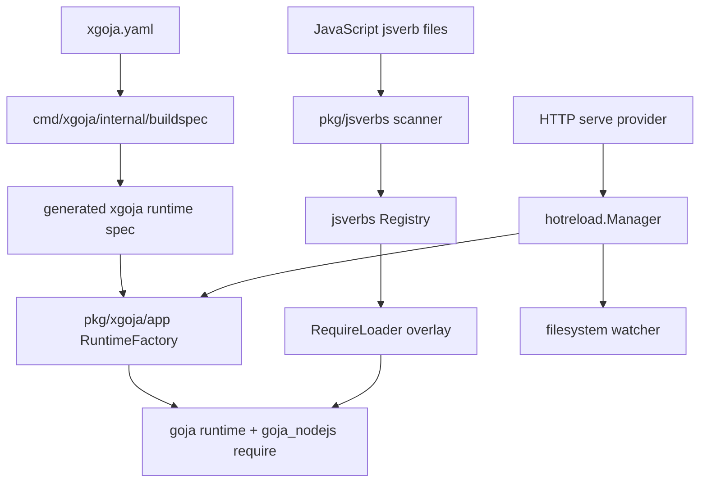
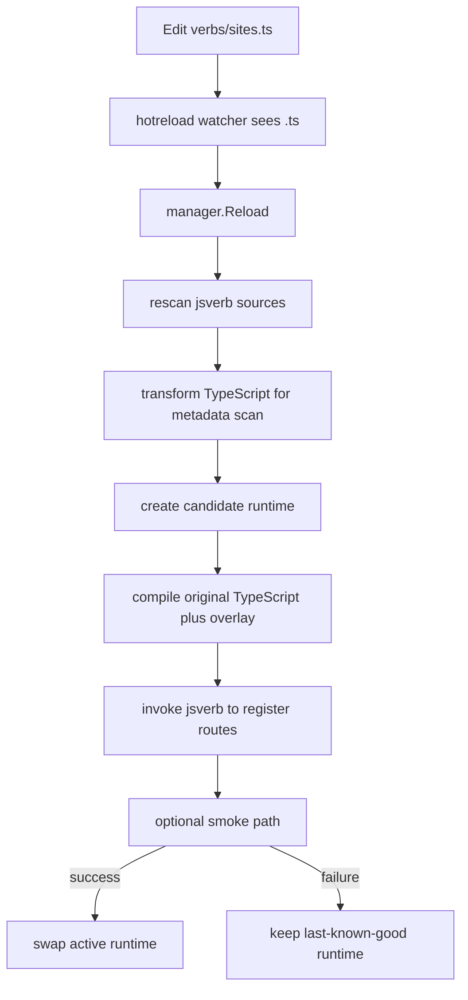

# XGoja TypeScript Support: Esbuild, JSVerbs, and Hot Reload

This report explains the TypeScript support work implemented for `go-go-goja` and `xgoja` in ticket `XGOJA-TS-001`. The work made TypeScript a supported authoring format for `xgoja run`, TypeScript-authored jsverbs, and HTTP hot reload, while preserving the existing goja runtime model and Go-backed module system.

> [!summary]
> - TypeScript support is implemented as a compilation layer around existing JavaScript execution paths, not as a replacement for goja or jsverbs.
> - `pkg/tsscript` wraps esbuild's Go API and gives the rest of the repository a small, testable compiler facade.
> - jsverbs now have separate scan-time and runtime transforms so TypeScript can be parsed for metadata and then executed with the jsverbs overlay intact.
> - HTTP hot reload works by composition: TypeScript changes trigger the existing blue/green reload manager, which keeps the last-known-good runtime active when a candidate fails.

The relevant repository is `/home/manuel/workspaces/2026-06-10/goja-xgoja-ts-support/go-go-goja`. The main ticket workspace is `/home/manuel/workspaces/2026-06-10/goja-xgoja-ts-support/go-go-goja/ttmp/2026/06/10/XGOJA-TS-001--typescript-support-for-go-go-goja-xgoja-and-hot-reload`.

## The problem this work solved

Before this work, `go-go-goja` already had a strong JavaScript execution system. It could create goja runtimes, register Go-backed CommonJS modules, generate xgoja binaries from `xgoja.yaml`, scan JavaScript functions into jsverbs, generate TypeScript declaration files for editor support, and serve jsverb-defined HTTP routes with hot reload.

The missing capability was executable TypeScript. The repository could help a user write TypeScript against generated `.d.ts` declarations, but it did not have a first-class path for executing `.ts`, `.tsx`, `.mts`, or `.cts` files. Adding `.ts` to a file extension list was not enough. jsverbs used a JavaScript tree-sitter parser for metadata extraction, and goja executes JavaScript, not TypeScript syntax.

The correct design is to keep the runtime architecture stable and insert TypeScript compilation at the boundaries where source code enters the system:

- `xgoja run file.ts` should bundle a TypeScript entry and run the resulting JavaScript in the generated runtime.
- jsverbs should compile TypeScript before JavaScript metadata scanning and compile the original TypeScript plus jsverbs overlay before runtime loading.
- HTTP hot reload should watch TypeScript extensions when TypeScript-enabled jsverb sources are present, then reuse the existing reload manager.

This choice matters because the project is not trying to become a Node.js runtime. The runtime remains goja plus explicit Go-backed modules. TypeScript is an authoring format that is lowered to JavaScript before the existing runtime sees it.

## The implementation sequence

The implementation was intentionally split into reviewable commits. Each commit changed one layer of the system and included focused tests or documentation.

| Commit | Area | What changed |
| --- | --- | --- |
| `35d3fd1` | Design docs | Added the `XGOJA-TS-001` ticket, source note, design guide, and initial diary. |
| `9f8c8be` | Compiler facade | Added `pkg/tsscript`, wrapping esbuild transform and bundle APIs. |
| `d2b9d58` | Schema | Added TypeScript config to build specs, runtime specs, validation, and provider descriptors. |
| `5fc1baa` | jsverbs | Added scan/runtime transform hooks and wired TypeScript compilation into xgoja jsverb sources. |
| `5b06447` | `xgoja run` | Added direct TypeScript entry execution support for `run file.ts`. |
| `db825ba` | HTTP hot reload | Added automatic TypeScript watch extensions for TypeScript-enabled jsverb source sets. |
| `275fe6c` | Generated builds | Disabled VCS stamping for generated xgoja builds with `-buildvcs=false`. |
| `0bd8966` | Tutorial/example | Added a complete TypeScript jsverbs tutorial and runnable smoke example. |
| `48f32a3` | Diary | Recorded the final example and generated-build fix in the ticket diary. |

The validation commands used throughout included focused package tests, example smoke tests, pre-commit lint/test hooks, and `docmgr doctor --ticket XGOJA-TS-001 --stale-after 30`.

## Architecture before TypeScript

The existing architecture had clear source boundaries. That made the TypeScript integration tractable because there were specific places where source files entered the system.



The important facts are precise:

- `cmd/xgoja/internal/buildspec/build_spec.go` defines the build-time shape of `xgoja.yaml`.
- `pkg/xgoja/app/runtime_spec.go` defines the smaller runtime spec that generated binaries use.
- `pkg/jsverbs/scan.go` scans source files and extracts command metadata with the JavaScript grammar.
- `pkg/jsverbs/runtime.go` creates the require loader that injects the jsverbs overlay and captures functions in `globalThis.__glazedVerbRegistry`.
- `pkg/xgoja/providers/http/serve.go` composes jsverbs, runtime creation, and the hot reload manager for HTTP routes.

The design goal was to preserve those responsibilities. TypeScript compilation should happen before scan and before execution. It should not alter runtime ownership, module registration, or HTTP serving semantics.

## The compiler facade: `pkg/tsscript`

The first code layer was `pkg/tsscript`. This package hides esbuild details behind a small Go API that the rest of the repository can use without depending on esbuild option construction directly.

The public concepts are intentionally small:

```go
// Options controls TypeScript transpilation and bundling.
type Options struct {
    Target    api.Target
    Format    api.Format
    Platform  api.Platform
    Sourcemap api.SourceMap
    JSX       api.JSX

    External []string
    Define   map[string]string

    Tsconfig    string
    TsconfigRaw string
    SourceRoot  string
    LogLevel    api.LogLevel
}

type Source struct {
    Path       string
    AbsPath    string
    ResolveDir string
    Contents   []byte
}

type Artifact struct {
    Path       string
    Code       []byte
    SourceMap  []byte
    Warnings   []Diagnostic
    LoaderUsed api.Loader
    Bundled    bool
}
```

The zero value of `Options` is usable. It defaults toward ES2015 output, neutral platform, CommonJS for bundled outputs, and IIFE for direct transforms. Those defaults match goja's role: execute JavaScript without assuming browser or Node-specific APIs.

The package exposes three core functions:

```go
func TransformSource(src Source, opts Options) (*Artifact, error)
func BundleEntry(entryPath string, opts Options) (*Artifact, error)
func BundleVirtualEntry(src Source, opts Options) (*Artifact, error)
```

`TransformSource` is for one source string. It strips TypeScript syntax and emits JavaScript without following imports. `BundleEntry` is for a real entry file and follows its dependency graph. `BundleVirtualEntry` is for in-memory source that still needs relative imports resolved from `Source.ResolveDir`.

The distinction between transform and bundle is central to the whole project. Transform is enough for metadata scanning because the scanner only needs JavaScript syntax for one file. Runtime execution often needs bundling because TypeScript files commonly import local helpers. If `sites.ts` imports `./message`, goja's CommonJS loader should not be asked to discover and compile `message.ts` by itself. esbuild can produce one JavaScript artifact with the helper included, while preserving external Go-backed modules as `require("express")` calls.

`pkg/tsscript/compiler_test.go` covered the essential invariants:

- Transforming TypeScript strips type syntax and produces goja-executable JavaScript.
- Bundling follows `./helper.ts` imports.
- External module names are preserved as `require()` references.
- Diagnostics include the source filename.
- Loader selection covers `.ts`, `.tsx`, `.mts`, `.cts`, `.jsx`, `.json`, and `.js`.

This package became the stable compilation boundary for the rest of the work.

## Configuration as transport: build spec, runtime spec, provider descriptor

The next layer was schema. TypeScript support needed settings in `xgoja.yaml`, generated runtime specs, and provider-facing descriptors. These are separate API surfaces, so the change was made in three places.

The build-time schema in `cmd/xgoja/internal/buildspec/build_spec.go` gained a `TypeScriptSpec` on `JSVerbSourceSpec`. The runtime schema in `pkg/xgoja/app/runtime_spec.go` gained the corresponding runtime field. The provider API in `pkg/xgoja/providerapi/commands.go` gained a `TypeScriptDescriptor` so command providers can inspect whether a source set is TypeScript-enabled without importing xgoja internals.

A representative `xgoja.yaml` section now looks like this:

```yaml
jsverbs:
  - id: local-sites
    path: ./verbs
    embed: false
    extensions: [".ts"]
    include: ["**/*.ts"]
    exclude: ["**/*.test.ts"]
    typescript:
      enabled: true
      bundle: true
      target: es2015
      format: cjs
      platform: neutral
      external:
        - express
```

The schema layer does not execute TypeScript. It normalizes and validates user intent. Defaults are applied in `cmd/xgoja/internal/buildspec/load.go`; validation happens in `cmd/xgoja/internal/buildspec/validate.go`. Supported string values include ES targets, output formats, platforms, sourcemap modes, externals, defines, and a `checkCommand` field for future or external type-check workflows.

This layer is deliberately conservative. It transports the data needed by later runtime code, but it does not run `tsc` and does not promise static type checking. esbuild strips types; projects that need semantic TypeScript checking should run `tsc --noEmit` separately.

## The jsverbs split: scan-time transform and runtime transform

jsverbs required the most careful design because it has two different uses for the same source file.

At scan time, jsverbs needs parseable JavaScript so it can discover package declarations, sections, verbs, function names, parameters, and documentation. At runtime, jsverbs needs executable JavaScript that includes a generated overlay which captures functions in `globalThis.__glazedVerbRegistry`.

Those are not the same artifact. If runtime compilation used the already-transformed scan output, local TypeScript helper imports could be lost or incorrectly resolved. If scanning tried to parse raw TypeScript, the JavaScript tree-sitter parser would fail on TypeScript syntax. The implementation therefore added two hooks to `pkg/jsverbs`:

```go
type ScanOptions struct {
    SourceTransform  func(SourceFile) (SourceFile, error)
    RuntimeTransform func(RuntimeTransformInput) ([]byte, error)
    // existing fields omitted
}
```

The scanner now carries both transformed source and original source metadata. The relevant data includes:

- `Source`, the JavaScript text used for scanning.
- `OriginalSource`, the original TypeScript text used later for runtime compilation.
- `SourceLanguage`, which marks TypeScript-transformed files.
- `ResolveDir`, which lets esbuild resolve relative imports when bundling virtual source.

The runtime loader in `pkg/jsverbs/runtime.go` now builds a prelude and overlay and gives TypeScript-aware callers a chance to compile the original source plus the overlay:

```go
func (r *Registry) sourceLoader(modulePath string) ([]byte, error) {
    file := r.filesByModule[modulePath]
    prelude := overlayPrelude()
    overlay := r.overlay(modulePath, file)

    if r.options.RuntimeTransform != nil {
        return r.options.RuntimeTransform(RuntimeTransformInput{
            Source:         file.Source,
            OriginalSource: file.OriginalSource,
            ResolveDir:     file.ResolveDir,
            Language:       file.SourceLanguage,
            Prelude:        prelude,
            Overlay:        overlay,
        })
    }

    return []byte(injectPrelude(string(file.Source), overlayPrelude()) + r.overlay(modulePath, file)), nil
}
```

The xgoja-specific adapter lives in `pkg/xgoja/app/typescript.go`. It converts runtime `TypeScriptSpec` into `tsscript.Options`, transforms TypeScript before scanning, and compiles TypeScript before runtime loading.

The key runtime path is:

```go
sourceWithOverlay := append([]byte(input.Prelude), input.OriginalSource...)
sourceWithOverlay = append(sourceWithOverlay, '\n')
sourceWithOverlay = append(sourceWithOverlay, []byte(input.Overlay)...)

compileSource := tsscript.Source{
    Path:       input.RelPath,
    AbsPath:    input.AbsPath,
    ResolveDir: input.ResolveDir,
    Contents:   sourceWithOverlay,
}

if source.TypeScript.Bundle {
    artifact, err := tsscript.BundleVirtualEntry(compileSource, tsOptions)
    return artifact.Code, err
}
artifact, err := tsscript.TransformSource(compileSource, tsOptions)
return artifact.Code, err
```

Overlay ordering is the central invariant. The overlay must be appended before compilation. If esbuild bundles the module first, top-level declarations may be wrapped or transformed in ways that make a post-bundle overlay unable to reference the original function names. By compiling the original TypeScript plus the overlay together, the overlay participates in the same module transformation as the functions it captures.

The focused test in `pkg/xgoja/app/typescript_jsverbs_test.go` exercised the full path: write a `sites.ts` file that imports `helper.ts`, scan it as a TypeScript jsverb source, create a goja runtime, invoke the discovered verb through `registry.RequireLoader()`, and verify the helper import result.

## `xgoja run file.ts`

`xgoja run` is the direct script execution path for generated runtimes. Before this work, it resolved the script path, added script-local module roots, created the runtime, initialized selected modules, and executed the file with `rt.Require.Require(scriptPath)`.

The TypeScript path preserves all of that setup. It only changes the final execution step when the file extension is TypeScript-family:

```go
if tsscript.IsTypeScriptPath(scriptPath) {
    err := runTypeScriptScript(ctx, rt, scriptPath, selectedModules)
} else {
    _, err := rt.Owner.Call(ctx, "xgoja.run", func(_ context.Context, vm *goja.Runtime) (any, error) {
        return rt.Require.Require(scriptPath)
    })
}
```

`runTypeScriptScript` bundles the entry file and executes the result with `vm.RunScript`:

```go
artifact, err := tsscript.BundleEntry(scriptPath, tsscript.Options{
    Target:   api.ES2015,
    Format:   api.FormatIIFE,
    Platform: api.PlatformNeutral,
    External: moduleAliases(selectedModules),
})

_, err = rt.Owner.Call(ctx, "xgoja.run.typescript", func(_ context.Context, vm *goja.Runtime) (any, error) {
    return vm.RunScript(scriptPath, string(artifact.Code))
})
```

The important detail is the `External` list. Selected xgoja module aliases are Go-backed modules, not npm packages. esbuild must leave those imports alone so goja's runtime module loader can resolve them. The helper `moduleAliases` deduplicates selected aliases and falls back from `As` to `ModuleID`.

This path uses IIFE output because `xgoja run file.ts` is a script execution mode. The command does not need to expose module exports from the entry. If future use cases require export inspection or CommonJS-style entry behavior, that choice should be revisited.

## HTTP hot reload

The HTTP provider already used a blue/green hot reload manager. The manager creates a candidate runtime, loads routes into it, optionally smoke-tests it, and swaps the active snapshot only after success. If a candidate fails, the active runtime remains live.

TypeScript support did not need a new reload model. It needed TypeScript edits to trigger the existing reload path.

The change in `pkg/xgoja/providers/http/serve.go` checks whether any configured jsverb source has TypeScript enabled. If so, it appends TypeScript-family extensions to the watch extension list:

```go
if sourceSetHasTypeScript(commandCtx.JSVerbs) {
    hotReloadSettings.WatchExts = appendTypeScriptWatchExtensions(hotReloadSettings.WatchExts)
}
```

The appended extensions are:

- `.ts`
- `.tsx`
- `.mts`
- `.cts`

The reload itself works because the `Load` function already rescans jsverb sources and creates a candidate runtime on each reload. Since Step 7 made jsverb scanning and loading TypeScript-aware, a `.ts` edit now flows through the same candidate creation and smoke-test process as a `.js` edit.

The resulting hot reload path is:



This is the strongest part of the design because it composes with existing reliability behavior. TypeScript compilation errors are candidate-load errors. They do not require special HTTP serving semantics.

## The tutorial and runnable example

The final user-facing work added `cmd/xgoja/doc/15-tutorial-typescript-jsverbs.md` and `examples/xgoja/15-typescript-jsverbs/`.

The example is intentionally small but complete:

```ts
import { message } from "./message"

__package__({ name: "sites", short: "TypeScript demo sites" })
__verb__("demo", { name: "demo", output: "text" })

function demo(): void {
  const express = require("express")
  const app = express.app()
  const version = 1

  app.get("/", (_req: unknown, res: any) => {
    res.send(message("xgoja", version))
  })

  app.get("/healthz", (_req: unknown, res: any) => {
    res.json({ ok: true, site: "typescript-demo", version })
  })
}
```

The example `xgoja.yaml` selects the HTTP provider, enables `run`, enables jsverbs, declares `express` as a selected module, and configures `typescript.enabled: true` with bundling and `external: [express]`.

The smoke target in `examples/xgoja/15-typescript-jsverbs/Makefile` validates the entire workflow:

```make
smoke: doctor types build run-smoke serve-smoke
```

It runs:

1. `xgoja doctor` against the example spec.
2. `xgoja gen-dts --strict` to generate editor declarations.
3. `xgoja build` to produce a generated binary.
4. A `run-smoke` target that creates a temporary TypeScript entry importing a helper and runs it through the generated binary.
5. A `serve-smoke` target that starts the HTTP jsverb site with hot reload, checks `/healthz`, edits `const version = 1` to `const version = 2`, waits for reload, and checks the new response.

The first example smoke run exposed a generated-build issue unrelated to TypeScript syntax. `xgoja build` generated a temporary Go module and then `go build` attempted VCS stamping. In that context Go reported:

```text
error obtaining VCS status: exit status 128
Use -buildvcs=false to disable VCS stamping.
```

The fix was to update `cmd/xgoja/internal/buildexec/buildexec.go` so generated builds use:

```text
go build -buildvcs=false -o <output> .
```

After that change, `make -C examples/xgoja/15-typescript-jsverbs smoke` passed.

## Failure modes and what they taught

Several failures shaped the implementation.

The first lint failure happened in `pkg/tsscript/compiler_test.go`. A test assertion accidentally compared the same expression on both sides of an `&&`, and staticcheck reported `SA4000: identical expressions on the left and right side of the '&&' operator`. The fix was a straightforward assertion correction, but the failure was useful because it confirmed the pre-commit hook was checking more than focused package tests.

The generated-program tests initially failed with the same VCS stamping class later seen in the example smoke. The test helper was updated to build generated programs with `-buildvcs=false`. The later example smoke proved the production generated-build path needed the same treatment in `cmd/xgoja/internal/buildexec/buildexec.go`.

The jsverbs integration introduced an unused helper after `sourceLoader` was refactored. Staticcheck reported `pkg/jsverbs/runtime.go:189:20: func (*Registry).injectOverlay is unused`. Removing the stale helper kept the runtime loader path explicit.

The most important design failure avoided was trying to treat TypeScript as a file extension-only change. The codebase already had extension filters, but extension filters do not make TypeScript parseable by a JavaScript grammar and do not make goja execute TypeScript. The implementation had to preserve original source for runtime bundling while giving transformed JavaScript to the scanner.

## What a future maintainer should review first

A maintainer reviewing this work should read the files in dependency order.

1. Start with `pkg/tsscript/options.go` and `pkg/tsscript/compiler.go`. These define the compiler contract used everywhere else.
2. Read `cmd/xgoja/internal/buildspec/build_spec.go`, `cmd/xgoja/internal/buildspec/load.go`, and `cmd/xgoja/internal/buildspec/validate.go` to understand public configuration.
3. Read `pkg/jsverbs/model.go`, `pkg/jsverbs/scan.go`, and `pkg/jsverbs/runtime.go` to understand the scan/runtime split.
4. Read `pkg/xgoja/app/typescript.go` to see how xgoja turns `TypeScriptSpec` into esbuild calls.
5. Read `pkg/xgoja/app/run.go` for direct TypeScript entry execution.
6. Read `pkg/xgoja/providers/http/serve.go` for the hot reload watch-extension integration.
7. Run `make -C examples/xgoja/15-typescript-jsverbs smoke` to validate the end-to-end behavior.

The key correctness invariants are:

- TypeScript must be transformed before JavaScript tree-sitter scanning.
- Runtime compilation must use original TypeScript source, not scan-transformed JavaScript, when local helper imports must be bundled.
- The jsverbs overlay must be compiled together with the original source.
- xgoja native module aliases must be marked external for esbuild bundling.
- Hot reload should extend existing watch extensions, not replace them.
- Generated builds should disable VCS stamping because generated modules are often built outside a normal Git context.

## Current status

The implementation is complete for the planned first version:

- `pkg/tsscript` exists and is tested.
- `xgoja.yaml` can carry TypeScript jsverb configuration.
- TypeScript-authored jsverbs can be scanned and invoked.
- `xgoja run file.ts` works for TypeScript entries with local helper imports.
- HTTP hot reload watches TypeScript-family extensions when TypeScript sources are enabled.
- A full tutorial and runnable example exist.
- The ticket diary and changelog are current.
- `docmgr doctor --ticket XGOJA-TS-001 --stale-after 30` passes.

The most important validation command is:

```bash
make -C examples/xgoja/15-typescript-jsverbs smoke
```

The implementation was also validated through repository pre-commit hooks that ran lint, glazed lint, `go generate ./...`, and `go test ./...`.

## Open questions

There are several follow-up questions worth preserving.

First, `xgoja run file.ts` currently uses conservative defaults rather than per-command TypeScript options. That is sufficient for the first version, but users may eventually need `--tsconfig`, configurable target, configurable format, or project-level defaults.

Second, jsverbs TypeScript config requires users to list xgoja native modules in `typescript.external`. `xgoja run` already derives externals from selected module aliases. A future jsverbs improvement could populate esbuild externals automatically from selected xgoja module aliases while still allowing explicit extras.

Third, the example tracks generated `js/types/xgoja-modules.d.ts`. This improves onboarding because the example is editor-ready, but it means provider descriptor changes can update an example artifact. That is probably acceptable for a tutorial example, but it should be treated as intentional.

Fourth, HTTP hot reload appends TypeScript watch extensions even when users supply custom `--hot-reload-watch-ext` values. This favors correctness for TypeScript-enabled sources. If users need exact override semantics, the CLI may eventually need a separate flag that disables automatic extension augmentation.

Fifth, the Makefile smoke test gives strong end-to-end coverage, but it is not the same as a Go test in CI. If CI does not run example smoke targets, an additional Go integration test may be useful.

## Working rules extracted from the project

This work produced reusable rules for future goja/xgoja source-language integrations.

- Add source languages at the boundary where source enters the system. Do not alter runtime ownership or module registration unless the language requires a new execution model.
- Keep transform and bundle separate. Transform is for syntax lowering of one file; bundle is for dependency graphs.
- Preserve original source if later runtime compilation needs information that scan-time transformation may erase.
- Compile generated overlays with the source they reference. Post-processing compiled JavaScript is fragile when bundlers can wrap or rewrite scopes.
- Treat Go-backed runtime modules as externals during JavaScript bundling.
- Make generated examples executable through smoke targets. Documentation is stronger when the example proves the documented path.
- Record implementation failures in the ticket diary because they often identify future reliability fixes.

## Related artifacts

- Ticket diary: `/home/manuel/workspaces/2026-06-10/goja-xgoja-ts-support/go-go-goja/ttmp/2026/06/10/XGOJA-TS-001--typescript-support-for-go-go-goja-xgoja-and-hot-reload/reference/01-investigation-diary.md`
- Design guide: `/home/manuel/workspaces/2026-06-10/goja-xgoja-ts-support/go-go-goja/ttmp/2026/06/10/XGOJA-TS-001--typescript-support-for-go-go-goja-xgoja-and-hot-reload/design/01-typescript-support-analysis-and-implementation-guide.md`
- Tutorial: `/home/manuel/workspaces/2026-06-10/goja-xgoja-ts-support/go-go-goja/cmd/xgoja/doc/15-tutorial-typescript-jsverbs.md`
- Example: `/home/manuel/workspaces/2026-06-10/goja-xgoja-ts-support/go-go-goja/examples/xgoja/15-typescript-jsverbs`
- Compiler facade: `/home/manuel/workspaces/2026-06-10/goja-xgoja-ts-support/go-go-goja/pkg/tsscript`
- jsverbs runtime integration: `/home/manuel/workspaces/2026-06-10/goja-xgoja-ts-support/go-go-goja/pkg/jsverbs/runtime.go`
- xgoja TypeScript adapter: `/home/manuel/workspaces/2026-06-10/goja-xgoja-ts-support/go-go-goja/pkg/xgoja/app/typescript.go`
- HTTP hot reload integration: `/home/manuel/workspaces/2026-06-10/goja-xgoja-ts-support/go-go-goja/pkg/xgoja/providers/http/serve.go`
