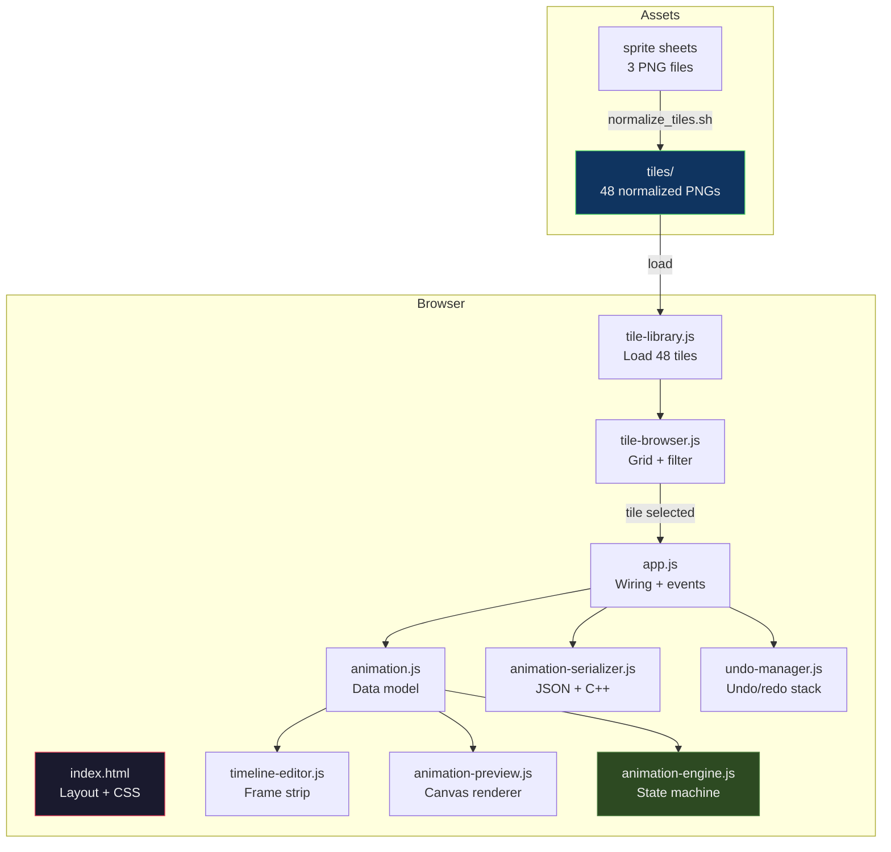
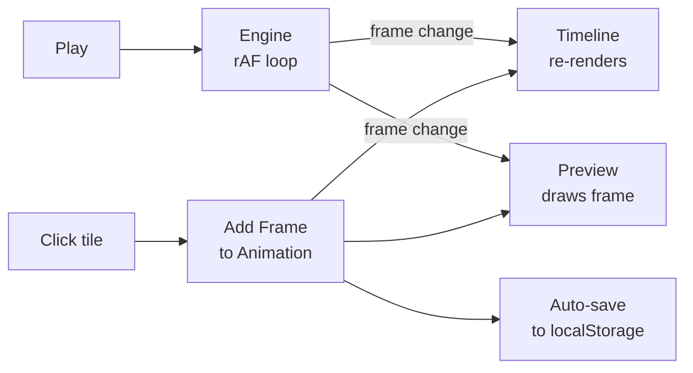

# Face Animation Studio: Building a Browser-Based Sprite Animation Tool for an ESP32 Robot

The M5StackChan is a palm-sized desktop robot with a 135×240 TFT display for its face. Making that face expressive requires carefully sequenced sprite animations — but until now, there was no tool to compose them. You had to draw the frames, convert them to C arrays, compile the firmware, flash it, and watch the result on the device. If the timing was wrong or the alignment was off, you started over.

Face Animation Studio is a single-page browser application that changes this workflow entirely. You click tiles from a sprite sheet library, arrange them on a timeline, adjust per-frame durations, and hit Play to preview the animation exactly as it will appear on the robot's display. When you are satisfied, you export the result as a JSON file for later editing or as a C++ header for direct firmware compilation. The entire tool runs from a static HTML file with no build step, no npm, and no server.

This article explains how the tool was designed, how the tile normalization pipeline works, and what it takes to make browser-rendered sprites match an embedded display pixel-for-pixel. It is the kind of article I wanted to read when I started: not a tutorial on canvas rendering, but an honest account of the iterative process of getting a practical tool to actually work.

> [!summary]
> - Face Animation Studio is a zero-dependency browser tool for composing 135×240 sprite animations from pre-sliced tile sheets
> - The tile normalization pipeline uses ImageMagick's deterministic CV operations (crop, trim, threshold, scale) to produce uniform, bottom-aligned tiles from three source sheets with inherently different face sizes
> - Per-sheet scaling factors (Sheet1 ×1.045, Sheet2 ×1.000, Sheet3 ×0.988) normalize face sizes across sheets before a global scale-to-fit and bottom-alignment pass
> - The animation engine uses `requestAnimationFrame` with manual duration tracking to support variable frame rates and playback speed multipliers
> - The export path produces both JSON (for the editor) and C++ headers with RGB565 PROGMEM arrays (for the ESP32 firmware)

---

## Why This Tool Exists

The M5StackChan's display is small — 135 pixels wide, 240 pixels tall — and it is the robot's primary output channel. The factory firmware shows a kawaii avatar with bouncing animations, blinking eyes, and mouth movements synchronized to speech. Custom firmware needs the same capability, but the tooling gap is real.

The workflow before this tool looked like this:

1. Draw expression frames in an image editor
2. Convert each frame to a C array (RGB565 format)
3. Compile into the firmware as PROGMEM data
4. Flash the firmware to the device
5. Check if the animation looks right
6. If not, go back to step 1

Steps 2 through 5 take five to ten minutes per iteration. The result is that nobody bothers iterating — you ship whatever animation "mostly works" and move on. Face Animation Studio collapses this to sub-second feedback: click a tile, see it on the display emulator, hit Play, adjust timing, export when done.

The tool also solves a subtler problem. The source sprite sheets were generated by an AI image model, and the resulting faces are at slightly different scales across sheets. Without normalization, animations that cross sheet boundaries show visible size jumps — the face appears to grow or shrink by a few percent between frames. The normalization pipeline fixes this deterministically, using only ImageMagick operations that can be re-run from a shell script.

---

## The Source Material

The input to the tool is three sprite sheets, each containing a 4×4 grid of monochrome stippled alien faces on a black background. The faces were generated by ChatGPT's image model and have a gritty comic-book aesthetic — not the kawaii round faces of the factory avatar, but something more like a stipple-ink robot from a 1980s underground comic.

Each sheet is a single PNG image:

| Sheet | Dimensions | Tile Size (raw crop) | Style |
|-------|-----------|---------------------|-------|
| Sheet 1 | 1322×1190 | ~331×298 | Stippled ink, 16 expressions |
| Sheet 2 | 1254×1254 | ~314×314 | Stippled ink, 16 expressions |
| Sheet 3 | 1254×1254 | ~314×314 | Stippled ink, 16 expressions |

The sheets contain 48 expressions total: neutral, angry, surprised, shocked, screaming, rage, pout, skeptical, curious, playful, goofy, content, wince, side-eye, glare, and various intermediates. The expression labels were assigned by a vision model and are approximate — some tiles resist easy categorization.

The critical detail is that Sheet 1 faces are slightly smaller than Sheets 2 and 3. The raw crop dimensions differ (331×298 vs 314×314), and the actual face content within those crops is proportionally different too. This matters because without normalization, an animation that uses tiles from different sheets will show visible size discontinuities.

---

## Architecture

The application is a single HTML file with nine JavaScript files loaded via `<script>` tags. No build step, no bundler, no framework.



### Data flow

The core interaction is simple: click a tile, it gets added as a frame to the animation, the timeline updates, and the preview shows the current frame on a canvas emulating the 135×240 display.



The animation engine drives playback using `requestAnimationFrame` with manual elapsed-time tracking. Each frame has an independent duration (in milliseconds), and the engine checks whether enough time has passed to advance to the next frame. This supports variable frame rates naturally — a 100ms frame followed by a 500ms frame plays at the correct relative speed without any special handling.

### Why no framework

The tool has nine JavaScript modules totaling about 1,660 lines. At this scale, a framework adds more complexity than it removes. The data model is simple (one animation, an array of frames, a tile library). The rendering is straightforward (a tile grid, a timeline strip, a canvas preview). The state management is a few callback wires in `app.js`. React would add a build step, a virtual DOM, and a dependency tree without making the code easier to understand.

The decision to use plain `<script>` tags instead of ES modules was pragmatic: it avoids CORS issues when opening the HTML file directly from the filesystem. The module order in the HTML matters (dependencies must load before dependents), but the tradeoff is that the tool works by double-clicking `index.html` — no server required for basic operation, though a local HTTP server is needed for image loading.

---

## The Tile Normalization Pipeline

Getting 48 tiles from three different source sheets to look uniform on the robot's display required three iterations. Each iteration fixed one problem and revealed the next. This section walks through the pipeline in its final form and explains why each step is necessary.

### The problem

The raw sprite sheets have four issues that prevent direct use:

1. **Different face sizes across sheets** — Sheet 1 faces are about 4.5% smaller than Sheet 2 faces. When displayed at the same pixel size, this creates visible size jumps in cross-sheet animations.

2. **Grid-line bleed** — The AI-generated sheets have near-black pixels (brightness 1–3 out of 255) at the boundaries between tiles. These are invisible on screen but become visible when the tiles are scaled up on the robot's display.

3. **Non-uniform aspect ratios** — Raw crops from Sheet 1 are 331×298 (wider than tall), while Sheet 2 and 3 crops are 314×314 (square). The robot's display is 135×240 (portrait). Without normalization, the face either has excess black space or the wrong proportions.

4. **Inconsistent vertical alignment** — Within a sheet, some expressions have features above the head (shocked, screaming) that extend the trimmed bounding box upward, creating different amounts of top padding even after trimming.

### The pipeline

The final normalization pipeline is a shell script that runs ImageMagick commands in sequence:

```bash
# 1. Slice the 4×4 grid, shave 1px border to remove bleed
convert sheet.png -crop 4x4@ +repage -shave 1x1 tile_%02d.png

# 2. Force near-black to pure black, then auto-trim
convert tile.png -black-threshold 2% -fuzz 5% -trim +repage trimmed.png

# 3. Per-sheet scale to normalize face sizes
# Sheet 1: ×1.0447 (scale UP to match Sheet 2's face height)
# Sheet 2: ×1.0000 (reference)
# Sheet 3: ×0.9885 (scale DOWN to match Sheet 2's face height)
convert trimmed.png -resize 104.47% scaled.png

# 4. Global scale to fit 135px display width
# Determined by: widest scaled face → 135px
convert scaled.png -resize 50.19% final_scaled.png

# 5. Bottom-align on 135×240 canvas
convert final_scaled.png -gravity south -background black -extent 135x240 tile.png

# 6. Kill interpolation artifacts from resize
convert tile.png -black-threshold 1% tile.png
```

### Why each step matters

**Step 1 — Crop and shave.** The `-crop 4x4@` flag divides the image into 4 columns × 4 rows. The `+repage` resets the page geometry so each tile is a standalone image. The `-shave 1x1` removes one pixel from each edge, which eliminates the worst of the grid-line bleed. This is not sufficient by itself — some bleed pixels persist — but it reduces the work that `-black-threshold` must do.

**Step 2 — Black-threshold and trim.** The `-black-threshold 2%` forces any pixel with brightness below 2% to pure black (0,0,0). This cleans the near-black bleed pixels (values like 1,1,1 or 2,2,1) that the shave missed. The `-fuzz 5% -trim` then removes all black borders from each tile, producing a tightly cropped face image. Without the threshold step, trim would leave the bleed pixels as a thin fringe around the face.

**Step 3 — Per-sheet scaling.** This is the step that took the longest to get right. The three source sheets have different "base face heights" — the vertical extent of a typical neutral expression, excluding outliers like shocked faces with features above the head. By analyzing the trimmed heights of all 48 tiles, I identified the base heights:

- Sheet 1: 246 pixels (the smallest faces)
- Sheet 2: 257 pixels (the reference)
- Sheet 3: 260 pixels (slightly larger than Sheet 2)

The per-sheet scale factors are `257/246 = 1.0447` for Sheet 1, `1.0000` for Sheet 2, and `257/260 = 0.9885` for Sheet 3. After this step, the "average face" from each sheet has the same pixel height.

Why not use a single global scale factor? Because the face sizes differ proportionally — Sheet 1 faces are about 4.5% smaller than Sheet 2 faces. A single global scale that fits the display would preserve this difference, and animations crossing sheet boundaries would show visible size jumps.

**Step 4 — Global scale.** After per-sheet normalization, the widest face is 269 pixels. We scale everything by `135/269 = 50.19%` so that the widest face exactly fills the 135-pixel display width. All other faces are proportionally narrower, which is correct — they have less horizontal content.

**Step 5 — Bottom-alignment.** The `-gravity south -extent 135x240` places the scaled face at the bottom of a 135×240 canvas, filling the remaining space with black. This is the critical alignment step: it ensures that all faces share the same chin baseline, so animations do not "bounce" vertically between frames.

Why bottom-align instead of center-align? Because the face's vertical position in the original drawings is relative to the chin, not the top of the head. Expressions like "shocked" have raised features above the head, which pushes the top of the bounding box upward. Bottom-alignment keeps the chin fixed regardless of what happens above the head, which produces the most natural-looking animations.

**Step 6 — Post-resize black-threshold.** The `-resize` operation uses Lanczos interpolation, which can introduce near-black pixels (brightness 1–3) at the edges of face content where it meets the black background. A final `-black-threshold 1%` pass cleans these. Without it, a few tiles show faint white specks on their top row when displayed at 3× zoom on the canvas.

### Deterministic CV with ImageMagick

The entire pipeline uses only ImageMagick operations — no Python, no PIL, no neural networks. This is deliberate. ImageMagick's operations are deterministic, composable, and scriptable. The same command produces the same output every time. There is no model weight to download, no random seed to fix, no GPU dependency to manage.

The key insight is that for monochrome stippled faces on a black background, "computer vision" reduces to thresholding and trimming. The `-black-threshold` operation is the deterministic equivalent of "is this pixel face content or background?" — any pixel above 2% brightness is face content, everything else is background. The `-trim` operation finds the bounding box of non-background content. Together, they solve the segmentation problem without any learning required.

This approach would not work for arbitrary images — a face on a textured background would need real segmentation. But for the specific case of stippled drawings on pure black, the deterministic approach is faster, more reliable, and infinitely reproducible.

---

## The Animation Engine

The animation engine is a state machine with three states: Stopped, Playing, and Paused. Playback uses `requestAnimationFrame` with manual duration tracking.

```
         ┌─────────┐
         │ STOPPED │◄──────────────────┐
         └────┬────┘                   │
     play()   │                   stop()
              ▼                          │
         ┌─────────┐    pause()    ┌────┴────┐
         │ PLAYING │──────────────►│ PAUSED  │
         └────┬────┘◄──────────────└────┬────┘
              │         play()          │
              ▼                         │
    [requestAnimationFrame loop]        │
    - Check elapsed time vs duration   │
    - Advance frame if elapsed enough   │
    - Draw current frame to canvas      │
    - If last frame + no loop: stop()   │
              │                         │
              └─────────────────────────┘
```

### Why manual timing instead of setInterval

The obvious approach to timed frame advancement is `setInterval(callback, frameDuration)`. This has two problems:

1. **Variable frame durations.** Each frame can have a different `durationMs` value. A `setInterval` callback fires at a fixed interval, so you would need to cancel and re-schedule the timer on every frame change. This is error-prone and introduces jitter.

2. **Timer drift.** `setInterval` does not guarantee exact timing — the browser may delay the callback if the main thread is busy. Over many frames, small delays accumulate into visible drift.

The `requestAnimationFrame` approach avoids both problems. The browser calls our tick function at the display refresh rate (typically 60 Hz), and we track elapsed time manually:

```javascript
_tick(timestamp) {
    const elapsed = (timestamp - this._lastFrameTime) * this.speed;
    if (elapsed >= frame.durationMs) {
        this.currentFrameIndex++;
        this._lastFrameTime = timestamp;
        // ... handle loop/end, draw frame
    }
    this._rafId = requestAnimationFrame((t) => this._tick(t));
}
```

The speed multiplier is applied to the elapsed time, not to the timer interval. At 2× speed, 50ms of real time counts as 100ms of animation time. This means a 100ms frame at 2× speed plays in 50ms of real time — exactly what "2× speed" should mean.

### Canvas rendering

The preview canvas is sized at 405×720 pixels (the 135×240 display at 3× zoom). Tiles are rendered 1:1 — each tile is already 135×240 pixels, matching the display exactly. With `imageSmoothingEnabled = false` and CSS `image-rendering: pixelated`, the 3× scaling is pixel-perfect nearest-neighbor, with no interpolation artifacts.

The matching of tile dimensions to display dimensions was not the initial design. The first version used 220×240 tiles (nearly square) that were scaled to fit the 135×240 display. This introduced two problems: the aspect ratio was wrong (nearly square tiles on a portrait display), and the scaling introduced interpolation artifacts at the content edges. Switching to 135×240 tiles eliminated both issues — the tiles are a pixel-for-pixel match with the display, and the canvas draws them at integer multiples only.

---

## Undo and Redo

The undo manager stores JSON snapshots of the animation state. Before any mutation (add frame, delete frame, move frame, change duration), the current animation is serialized to JSON and pushed onto the undo stack. On undo, the current state is pushed to the redo stack and the previous state is restored by deserializing the JSON snapshot.

This is not the most memory-efficient approach — for large animations, each snapshot could be several kilobytes — but it is simple and correct. The undo stack is capped at 50 entries, which is generous for a tool where animations typically have fewer than 30 frames.

The key implementation detail is that `saveUndoState()` must be called *before* the mutation, not after. If you save after, the undo stack contains the post-mutation state, and undoing restores the same state you just created — effectively a no-op.

---

## Export: From Browser to Firmware

The tool supports two export formats: JSON (for saving and re-editing) and C++ headers (for compiling into ESP32 firmware).

### JSON format

The JSON format stores the animation name, loop setting, FPS, and an ordered array of frames. Each frame references a tile by its ID (e.g., `sheet3_01`) and stores its duration in milliseconds:

```json
{
  "version": 1,
  "name": "happy_greeting",
  "loop": true,
  "fps": 10,
  "display": { "width": 135, "height": 240 },
  "frames": [
    { "tileId": "sheet3_00", "durationMs": 200, "label": "neutral" },
    { "tileId": "sheet3_01", "durationMs": 300, "label": "big grin" },
    { "tileId": "sheet2_11", "durationMs": 200, "label": "playful" },
    { "tileId": "sheet3_00", "durationMs": 100, "label": "neutral" }
  ],
  "totalDurationMs": 800
}
```

The JSON format is designed for the editor, not for the firmware. It references tiles by name rather than by index, includes human-readable labels, and stores metadata (created/modified timestamps) that the firmware does not need.

### C++ header format

The C++ export generates a header file that can be `#include`d directly in the ESP32 firmware. It contains an enum mapping tile IDs to array indices, a `FaceFrame` array with per-frame duration, and a `FaceAnimation` struct that ties them together:

```cpp
static const FaceFrame anim_happy_greeting[] = {
    { .tileIndex = TILE_SHEET3_00, .durationMs = 200 },  // neutral
    { .tileIndex = TILE_SHEET3_01, .durationMs = 300 },  // big grin
    { .tileIndex = TILE_SHEET2_11, .durationMs = 200 },  // playful
    { .tileIndex = TILE_SHEET3_00, .durationMs = 100 },  // neutral
};

static const FaceAnimation happy_greeting_anim = {
    .name = "happy_greeting",
    .frames = anim_happy_greeting,
    .frameCount = 4,
    .loop = true,
    .totalDurationMs = 800,
};
```

The firmware reads this struct, looks up the tile data by `tileIndex`, and blits it to the display for the specified duration. The animation engine on the ESP32 is essentially the same state machine as the browser version, minus the canvas and plus direct SPI writes to the ST7789 controller.

### Tile-to-C++ conversion

The `tile_to_cpp.py` script converts each 135×240 PNG tile into a C array of `uint16_t` values in RGB565 format. RGB565 is the native format of the ST7789 display controller — each pixel is stored as 5 bits of red, 6 bits of green, and 5 bits of blue, packed into a 16-bit word. The conversion is:

```python
def rgb888_to_rgb565(r, g, b):
    r5 = (r >> 3) & 0x1F
    g6 = (g >> 2) & 0x3F
    b5 = (b >> 3) & 0x1F
    return (r5 << 11) | (g6 << 5) | b5
```

The output arrays use the `PROGMEM` attribute, which tells the ESP32 compiler to place them in flash memory rather than RAM. A single 135×240 tile requires 135 × 240 × 2 = 64,800 bytes of flash. All 48 tiles together occupy about 3.1 MB of flash — significant, but the ESP32-S3 has 16 MB.

For monochrome stippled faces on a black background, RLE compression would reduce this by 70–80% (large runs of pure black). That optimization is future work.

---

## Common Failure Modes

### White pixels on the top edge of tiles

This was the most persistent bug. The symptom: a few tiles showed one or two faintly white pixels on their top row when rendered at 3× zoom in the browser. The source was interpolation artifacts introduced by ImageMagick's `-resize` operation, which uses Lanczos filtering by default. Lanczos produces sub-pixel values at content boundaries — a pixel that is mathematically "0.3% face, 99.7% black" gets a brightness of about 1 out of 255, which is invisible at 1× zoom but becomes a faint speck at 3× zoom with nearest-neighbor upscaling.

The fix was a final `-black-threshold 1%` pass after the resize and extent operations. This forces any pixel below 1% brightness to pure black, eliminating the interpolation fringe without affecting visible face content.

Verifying this fix required checking two different things. File-level verification (using `convert tile.png -crop 135x1+0+0 txt:-` to enumerate pixel values in the top row) showed all tiles were clean. Canvas-level verification (using `ctx.getImageData()` to read back the rendered pixels) also showed pure black. The user was likely seeing cached old tiles in the browser — adding a `?v=2` cache-bust parameter to the tile URLs resolved the last reports of the issue.

### Browser caching of old tiles

After regenerating the normalized tiles, the browser continued to serve the old (220×240, non-bottom-aligned) tiles from its cache. Hard-refreshing (Ctrl+Shift+R) sometimes helped but not always, because the image cache is separate from the HTML cache. Adding a `?v=2` query parameter to the tile source URLs in `tile-library.js` forces the browser to treat them as new resources:

```javascript
this.src = `../assets/tiles/${this.id}.png?v=2`;
```

This is a crude but effective approach. In a production tool, you would use content-hashed filenames (e.g., `sheet3_01.a3b2f1.png`) generated at build time.

### The "nearly square" mistake

The first version of the normalization pipeline produced 220×240 tiles — nearly square, but the robot's display is 135×240 (portrait, 9:16 aspect ratio). The error came from using the trimmed tile width as the canvas width rather than the target display width. The 220px width was large enough to contain the widest face, but it did not match the display, and the canvas had to scale the tiles down during rendering — introducing the interpolation artifacts described above.

The fix was to make the tile canvas exactly match the display (135×240) and scale the face content to fit the display width before placing it on the canvas. This means the tiles are no longer "large enough to contain the face at native resolution" — they are "the face as it will appear on the display." The distinction matters: the tiles are now a pixel-for-pixel preview of what the firmware will render.

---

## Working Rules

These are the rules that emerged from building this tool. They are specific enough to be useful and general enough to apply to similar projects.

> [!important]
> **Match tile dimensions to display dimensions.** If the target is a 135×240 display, the tiles should be 135×240. Do not use a larger canvas and scale during rendering — the scaling introduces artifacts, and the preview is not an accurate representation of the final output.

> [!important]
> **Bottom-align faces.** The chin is the natural reference point for facial expressions. Some expressions extend above the head (shocked, screaming); some do not (neutral, sleepy). Bottom-alignment keeps the chin fixed regardless of what happens above the head, which produces the most natural-looking animations.

> [!important]
> **Use deterministic CV for deterministic images.** When the background is pure black and the content is monochrome stipple, thresholding and trimming are sufficient for segmentation. Do not reach for a neural network when a `-black-threshold 2% -trim` pipeline does the job faster, more reliably, and with zero dependencies.

> [!important]
> **Apply black-threshold after resize, not just before.** Interpolation during scaling introduces near-black pixels at content boundaries. A final `-black-threshold 1%` pass after the last resize operation eliminates these artifacts.

> [!important]
> **Per-sheet scaling before global scaling.** If source sheets have inherently different face sizes, normalize per-sheet first, then apply a global scale. A single global scale preserves the size differences and creates visible jumps in cross-sheet animations.

---

## Related Notes

- [[ARTICLE - M5StackChan - Deep Dive Technical Analysis of a Kawaii Desktop Robot Platform]] — the hardware and firmware architecture that this tool targets
- [[ARTICLE - M5StackChan - Building and Deploying a Custom App on Real Hardware]] — the firmware build and deployment process
