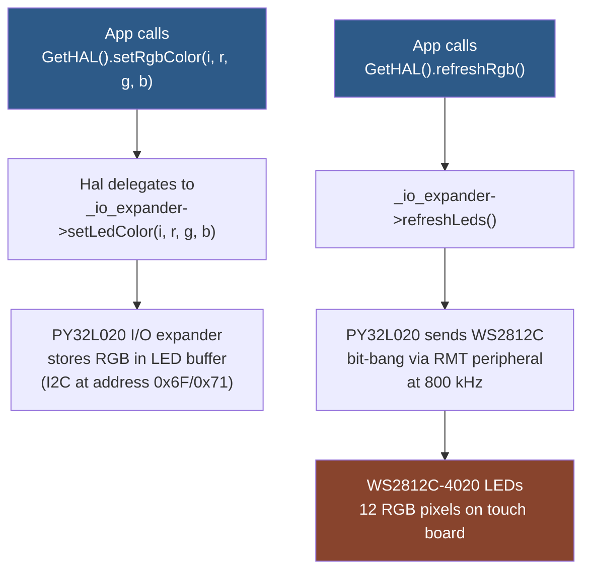

# M5StackChan: Building and Deploying a Custom App on Real Hardware

The M5StackChan (SKU K151) ships with polished factory firmware — an AI voice assistant, animated avatar, ESP-NOW remote control, and OTA updates. But it is also an open-source ESP-IDF project, and the firmware is designed to be extended through a C++ app framework called Mooncake. This article is the story of building that firmware from source, writing a new app, flashing it to a physical device, and debugging the hardware interactions that the documentation does not explain.

What makes this story worth telling is not the app itself — a "Blinky" LED toggle is trivially simple in Arduino — but the distance between "the code compiles" and "the hardware actually does something." Along the way, we had to discover that the RGB LEDs are controlled through an I/O expander over I2C, that the high-level animation wrapper silently discards color changes unless you call its update loop, that the home indicator widget causes watchdog timeouts, and that the LED hardware lives on the touch board near the screen, not at the base of the robot. Each of these lessons required reading source code, tracing API calls, checking schematics, and comparing against the official Arduino examples.

This article is written for someone who wants to understand the StackChan firmware stack deeply enough to modify it confidently — not just follow a tutorial, but reason about what each layer does and why.

> [!summary]
> - The Mooncake app framework provides a four-callback lifecycle (`onCreate`, `onOpen`, `onRunning`, `onClose`) with automatic build integration — any `.cpp` file under `main/apps/` is compiled automatically
> - LVGL runs on a separate FreeRTOS task (Core 0) and all LVGL calls must be protected by a mutex via `LvglLockGuard`; missing the lock causes data corruption or hard faults
> - The StackChan's 12 WS2812C RGB LEDs are on the touch board near the screen, driven through a PY32L020 I/O expander over I2C; the HAL API is `setRgbColor(index, r, g, b)` + `refreshRgb()`
> - The `NeonLight` animation wrapper (`GetStackChan().leftNeonLight().setColor()`) only queues a target color — the actual LED output requires calling `GetStackChan().update()` to tick the animation; for direct control, use the HAL API instead
> - The task watchdog fires in 10 seconds; long-held LVGL locks or blocking operations in `onRunning()` will trigger it

## The starting point: a firmware that compiles

The StackChan firmware repository is at `github.com/m5stack/StackChan`. It requires ESP-IDF v5.5.2 or later and uses a custom dependency system: six git-based repositories fetched by `fetch_repos.py`, plus sixty-odd IDF Component Registry packages downloaded automatically during cmake configuration. After a full build, the firmware binary is approximately 3.7 MB, fitting comfortably in the 4.9 MB OTA partition with 27% headroom.

The build produces five flash artifacts:

| Artifact | Size | Flash offset |
|----------|------|--------------|
| `bootloader.bin` | ~24 KB | `0x000000` |
| `partition-table.bin` | ~3 KB | `0x008000` |
| `ota_data_initial.bin` | ~8 KB | `0x00D000` |
| `stack-chan.bin` | ~3.7 MB | `0x200000` |
| `generated_assets.bin` | ~2.2 MB | `0xA00000` |

The partition table uses a dual-OTA scheme with a 4 MB SPIFFS assets partition and a 64 KB coredump partition. The assets partition contains LVGL image descriptors (icons, emoji collections, font data) loaded at runtime by `assets::get_image()`.

The firmware boots in about seven seconds: HAL initialization (power management, camera, IMU, servos, display), Mooncake framework startup, and launcher rendering. At idle, approximately 143–147 KB of SRAM is free.

## The Mooncake app framework

### Ability hierarchy

Mooncake organizes functionality through a class hierarchy called "abilities." The base class `AbilityBase` provides raw lifecycle hooks (`baseCreate`, `baseUpdate`, `baseDestroy`). On top of that, four specialized ability types add domain-specific state machines:

```
AbilityBase
  └── BasicAbility     (Arduino-style: onCreate/onRunning/onDestroy)
        ├── UIAbility    (foreground/background switching for tab-style UIs)
        ├── WorkerAbility (running/paused for background tasks)
        └── AppAbility    (open/close with metadata — the one you use)
```

Custom apps inherit from `AppAbility`. It provides an open/close lifecycle, an `AppInfo_t` struct for metadata (name, icon, theme color), and a state machine that transitions through `StateGoOpen → StateRunning → StateGoClose → StateSleeping`.

### The four callbacks

Every Mooncake app overrides up to four callbacks:

| Callback | When it runs | What to do |
|----------|-------------|------------|
| `onCreate()` | App is installed into Mooncake (once, at boot) | One-time initialization, resource allocation |
| `onOpen()` | User selects the app from the launcher | Create LVGL widgets, start tasks, initialize state |
| `onRunning()` | Called on every iteration of the main loop while the app is active | Update UI, process data, handle timers — must be non-blocking |
| `onClose()` | App exits (user presses home or code calls `close()`) | Destroy all LVGL objects, release resources, reset hardware |

There is no fixed frame rate. The main loop in `app_main()` calls `GetMooncake().update()` in a tight `while(1)` loop, and `onRunning()` executes as fast as the loop iterates — typically hundreds of times per second. For timed behavior, the app must check `GetHAL().millis()` itself.

### Registration and build integration

Apps are registered in two places:

1. **`main/apps/apps.h`** — add an `#include` for the new app header
2. **`main/main.cpp`** — add `GetMooncake().installApp(std::make_unique<MyApp>())`

No CMake changes are needed. The `main/CMakeLists.txt` uses `file(GLOB_RECURSE ... "apps/*.cpp")` to collect all source files under `main/apps/`. A newly created `.cpp` file is picked up on the next build automatically.

### App metadata

The launcher reads three fields from `AppInfo_t`:

- **`name`** (string) — displayed as a text label below the icon in the launcher
- **`icon`** (void pointer) — cast to `lv_image_dsc_t*`, loaded from the assets partition via `assets::get_image("name.bin")`
- **`userData`** (void pointer) — the StackChan launcher casts this to `uint32_t*` and uses it as a theme color for the scroll indicator

The `static` keyword is important for both `icon` and `userData` because the `AppInfo_t` stores a raw pointer that must remain valid for the app's lifetime:

```cpp
static uint32_t theme_color = 0xFFAA00;  // Amber
setAppInfo().userData = (void*)&theme_color;
```

## The threading model and the LVGL lock

The ESP32-S3 has two cores. The firmware assigns them as follows:

- **Core 0**: LVGL render task (display refresh at ~30 FPS)
- **Core 1**: Main task running `app_main()`, the Mooncake loop, and all app logic
- Additional tasks for audio pipeline, WiFi/BLE, and servo feedback polling

Because LVGL runs on a separate FreeRTOS task, **every LVGL operation from the main task must be protected by a mutex.** The `LvglLockGuard` class (from `smooth_ui_toolkit`) provides RAII-based locking:

```cpp
{
    LvglLockGuard lock;   // Acquires mutex
    lv_label_set_text(label, "Hello");
}  // Mutex released at scope exit
```

Skipping the lock does not cause a compile error. It causes data races that manifest as garbled display output, objects appearing at wrong positions, or hard faults that crash the device. The lock must be held for the shortest possible time — never do I/O, network requests, or heavy computation while holding it, because it blocks the LVGL render task and causes visible stuttering.

The task watchdog is configured to fire after 10 seconds of any task failing to feed it. If `onRunning()` holds the LVGL lock for an extended period (for example, waiting for an animation to complete), the watchdog will trigger a reset. This happened during our Blinky development when the home indicator's spring animation held LVGL objects that required per-frame updates.

## Designing the Blinky app

### Requirements

The app should:

1. Appear in the launcher with an amber theme color
2. Display "LED: OFF" centered on screen with a quit button
3. Toggle the robot's RGB LEDs between amber and off every 500 ms
4. Update the label to reflect the current state
5. Clean up all resources when closed

### State machine

```
         open() from launcher
              │
              ▼
        ┌──────────────┐
        │   onOpen()   │
        │  Create label│
        │  Create QUIT │
        │  LEDs OFF    │
        └──────┬───────┘
               │
               ▼
        ┌──────────────┐
   ┌───▶│  onRunning() │◀──┐
   │    │              │   │
   │  Every 500ms:    │   │
   │  Toggle LEDs     │   │
   │  Update label    │   │
   │    └──────┬───────┘   │
   │           │            │
   │           └────────────┘
   │
   │  close() from QUIT button
   │           │
   │           ▼
   │    ┌──────────────┐
   │    │  onClose()   │
   │    │  LEDs OFF    │
   │    │  Delete label│
   │    │  Delete QUIT │
   │    └──────────────┘
   │
   └── (loops until close)
```

### The first hardware puzzle: where are the LEDs?

The firmware codebase refers to the RGB LEDs through `GetStackChan().leftNeonLight()` and `GetStackChan().rightNeonLight()`. The contributing guide and product documentation describe "a ring board" with "12 WS2812C RGB LEDs." The natural assumption is that these LEDs are at the base of the robot, forming a ring around the bottom.

This assumption is wrong.

The schematic for the "ring board" (`SCH_Ring.pdf`) shows only a USB connector and test pads — no LEDs. The 12 WS2812C LEDs are actually on the **touch board** (`SCH_Touch.pdf`), the same board that holds the Si12T capacitive touch sensors for head-pet detection. The LEDs are arranged in two rows near the top of the robot, close to the screen — the same LEDs that show green (listening) and blue (speaking) during AI Agent voice interaction. The official documentation confirms this: "The RGB LED located at the upper-left side of the device near the screen indicates the voice interaction status."

### The second puzzle: setColor() does not set the color

The initial implementation used the high-level API:

```cpp
GetStackChan().leftNeonLight().setColor(168, 133, 0);
GetStackChan().rightNeonLight().setColor(168, 133, 0);
```

This compiled and ran without errors. The label toggled between "LED: ON" and "LED: OFF." But the physical LEDs did not change.

The reason is that `NeonLight::setColor()` does not write to hardware. It queues a target color into an animation object (`AnimateRgb_t`). The actual LED output only happens inside `NeonLight::update()`, which ticks the animation, computes the interpolated RGB values, calls `set_rgb_color_impl()` for each LED index, and then calls `refresh_rgb_impl()` to push the data to the WS2812C chain. The `update()` method is called from `StackChan::update()`, which must be called explicitly from the main loop.

This design makes sense for production animations — the avatar's expression system smoothly transitions LED colors over time. But for a hardware smoke test, it adds an invisible dependency: you call `setColor()` and nothing happens unless you also call `GetStackChan().update()` every frame, which also updates the avatar, motion system, and all registered modifiers.

### The direct hardware API

The official M5Stack Arduino RGB LED documentation provides a different pattern — direct, indexed writes to the LED strip buffer followed by a refresh:

```cpp
for (int i = 0; i < 12; i++) {
    M5StackChan.setRgbColor(i, r, g, b);
}
M5StackChan.refreshRgb();
```

The ESP-IDF HAL equivalent is:

```cpp
for (int i = 0; i < 12; i++) {
    GetHAL().setRgbColor(i, r, g, b);
}
GetHAL().refreshRgb();
```

This matches what the `NeonLight` class does internally — `LeftNeonLight` maps indices 0–5 and `RightNeonLight` maps indices 6–11 — but bypasses the animation layer entirely. The call to `refreshRgb()` pushes the buffered colors to the WS2812C data line through the PY32L020 I/O expander's I2C interface, which bit-bangs the WS2812C protocol at 800 kHz via the RMT peripheral.

The official documentation uses 168 as the maximum brightness value (not 255) to avoid overdriving the WS2812C LEDs, which can draw enough current at full brightness to cause voltage droop and brownout resets on the power rail.

### The LED control chain

Understanding how a color value reaches the physical LED requires tracing through four layers:



The I/O expander (PY32L020) is necessary because the ESP32-S3's GPIO pins are largely consumed by the CoreS3's own peripherals (display SPI, camera parallel interface, audio I2S, touch I2C). The robot body's peripherals — servos, LEDs, NFC, touch, battery monitor — share an I2C bus (GPIO 11/12) with the expander acting as a bridge to the WS2812C data line.

## The home indicator problem

The Mooncake common UI library provides a `view::create_home_indicator()` widget — a spring-animated button that appears when the user swipes up from the bottom of the screen. It requires `view::update_home_indicator()` to be called every frame to tick the spring physics.

In our initial Blinky implementation, calling `update_home_indicator()` from `onRunning()` caused task watchdog resets. The backtrace pointed to `AppBlinky::onRunning()` at the `update_home_indicator()` call. The root cause was that the home indicator's `HomeButton::update()` method calls `_btn->setPos()` — an LVGL operation — without acquiring the LVGL lock, while the main task was also acquiring the lock for label updates. This created contention that starved the LVGL render task on Core 0, causing the IDLE0 task to miss its watchdog deadline.

The fix for the Blinky prototype was to replace the home indicator with a simple LVGL quit button that does not require per-frame animation updates:

```cpp
_btn_quit = lv_button_create(lv_screen_active());
lv_obj_add_event_cb(_btn_quit, [](lv_event_t* e) {
    auto* app = static_cast<AppBlinky*>(lv_event_get_user_data(e));
    app->close();
}, LV_EVENT_CLICKED, this);
```

This pattern matches the official `app_template` example and avoids the animation-induced watchdog issue entirely. A production app would need to investigate the home indicator's locking behavior more carefully.

## The final working implementation

### Header

```cpp
#pragma once
#include <mooncake.h>
#include <lvgl.h>

class AppBlinky : public mooncake::AppAbility {
public:
    AppBlinky();
    void onOpen() override;
    void onRunning() override;
    void onClose() override;

private:
    bool _led_on = false;
    uint32_t _last_toggle = 0;
    lv_obj_t* _label = nullptr;
    lv_obj_t* _btn_quit = nullptr;
};
```

Note that `lv_obj_t*` requires `#include <lvgl.h>` in the header — the `mooncake.h` header does not transitively include LVGL type definitions, and omitting it produces a compile error: `'lv_obj_t' does not name a type; did you mean 'lv_obj_del'?`

### LED helper

The direct RGB HAL pattern, matching the official Arduino example:

```cpp
static void set_all_rgb_leds(uint8_t r, uint8_t g, uint8_t b)
{
    for (int i = 0; i < 12; i++) {
        GetHAL().setRgbColor(i, r, g, b);
    }
    GetHAL().refreshRgb();
}
```

### The onRunning loop

```cpp
void AppBlinky::onRunning()
{
    uint32_t now = GetHAL().millis();
    if (now - _last_toggle > 500) {
        _led_on = !_led_on;

        // LED control — no LVGL lock needed (I2C via IO expander)
        if (_led_on) {
            set_all_rgb_leds(168, 133, 0);   // amber, safe brightness
        } else {
            set_all_rgb_leds(0, 0, 0);       // off
        }

        // Label update — minimal LVGL lock scope
        LvglLockGuard lock;
        lv_label_set_text(_label, _led_on ? "LED: ON" : "LED: OFF");

        _last_toggle = now;
    }
}
```

Key design decisions in this loop:

- The LED calls are outside the LVGL lock because they go through the I2C-based IO expander, not the LVGL display driver
- The lock is held only for the single `lv_label_set_text()` call and released immediately
- The timing check uses `GetHAL().millis()` because there is no fixed frame rate

### Registration

Two one-line edits:

```cpp
// main/apps/apps.h — add:
#include "app_blinky/app_blinky.h"

// main/main.cpp — add:
GetMooncake().installApp(std::make_unique<AppBlinky>());
```

## The iteration log

The Blinky app went through four distinct builds before reaching a working state. Each iteration uncovered a specific mismatch between the mental model (informed by the developer guide) and the actual hardware behavior:

### Iteration 1: Wrong LED API

The developer guide documented `GetHAL().setLedColor()` as the LED API. This function does not exist in the codebase. The actual MCP tool registration in `hal_mcp.cpp` revealed the correct path: `GetStackChan().leftNeonLight().setColor()` and `GetStackChan().rightNeonLight().setColor()`. The label toggled correctly. The LEDs did not light up.

### Iteration 2: Missing LVGL header

The header declared `lv_obj_t* _label` without including `<lvgl.h>`. The build failed with `'lv_obj_t' does not name a type`. Fix: add `#include <lvgl.h>` to the header.

### Iteration 3: Home indicator watchdog

The app used `view::create_home_indicator()` and `view::update_home_indicator()` for the exit mechanism. The spring-animated home button's per-frame LVGL updates caused contention with the LVGL render task, triggering task watchdog resets on CPU 0. Fix: replaced with a static quit button.

### Iteration 4: Animation layer vs. direct hardware

`NeonLight::setColor()` only queues an animation target; the hardware is not updated until `NeonLight::update()` ticks the animation. Adding `GetStackChan().update()` fixed the animation issue but invoked the entire StackChan subsystem (avatar, motion, modifiers) for a simple LED test. Fix: replaced with the direct HAL API (`GetHAL().setRgbColor()` + `GetHAL().refreshRgb()`) matching the official Arduino RGB LED example.

## Lessons for the next custom app

### Use the direct HAL API for hardware smoke tests

The StackChan subsystem (avatar, motion, neon lights) is designed for the production launcher experience, with animations, modifiers, and a complex update loop. For testing a specific hardware peripheral, bypass it and call the HAL directly. The pattern is consistent: write to a buffer, then refresh.

### The LVGL lock is not optional

It will not produce a compile warning. It will not fail gracefully. The first symptom is usually corrupted display output; the second is a hard fault. Wrap every LVGL call in `LvglLockGuard` and keep the scope as small as possible.

### Check the schematics, not the names

The "ring board" has no LEDs. The "touch board" has 12 of them. The function `leftNeonLight()` sounds like it drives hardware directly, but it is an animation wrapper. The function `setRgbColor()` sounds like it sets a color, but it only stages a buffer value — you need `refreshRgb()` to push it out. Every abstraction in this codebase has at least one layer of indirection between its name and what actually happens on the wire.

### The task watchdog is 10 seconds

Any operation in `onRunning()` that blocks for more than 10 seconds without feeding the watchdog will reset the device. This includes waiting on mutexes, polling loops, and long-held LVGL locks. The watchdog timeout can be increased via `CONFIG_ESP_TASK_WDT_TIMEOUT_S` in `sdkconfig.defaults` for debugging sessions.

### The build system is forgiving

The GLOB-based source collection in `main/CMakeLists.txt` means new `.cpp` files under `main/apps/` are compiled automatically. Registration requires exactly two one-line edits. The barrier to adding a new app is very low — the complexity is in the runtime behavior, not the build configuration.

## Key source files

| File | Why it matters |
|------|---------------|
| `main/apps/app_template/app_template.h` and `.cpp` | Official app template — copy this structure |
| `components/mooncake/src/ability/ability.h` | `AppAbility` class, `AppInfo_t` struct, state machine |
| `main/hal/hal.h` | All hardware access methods |
| `main/hal/hal_io_expander.cpp` | RGB LED initialization (PY32L020 pin 13 enable, `setRgbColor`, `refreshRgb`) |
| `main/hal/hal_mcp.cpp:72-88` | MCP `set_led_color` tool — shows the actual `setColor()` pattern |
| `main/stackchan/addons/neon_light/neon_light.h` and `.cpp` | `NeonLight` animation wrapper — `setColor()` queues, `update()` applies |
| `main/stackchan/stackchan.h:125-148` | `StackChan::update()` — calls neon light `update()` among other things |
| `main/apps/common/home_indicator/home_indicator.cpp` | Spring-animated home button — potential WDT risk |
| `main/main.cpp` | `app_main()` entry point — where apps are installed |
| `partitions.csv` | Dual OTA (4.9 MB each) + 4 MB SPIFFS assets + 64 KB coredump |

## Related resources

- [M5Stack StackChan product documentation](https://docs.m5stack.com/en/StackChan)
- [M5Stack StackChan RGB LED (Arduino API)](https://docs.m5stack.com/en/arduino/stackchan/rgb)
- [M5Stack StackChan firmware repository](https://github.com/m5stack/StackChan)
- [Mooncake app framework](https://github.com/Forairaaaaa/mooncake)
- [[ARTICLE - M5StackChan - Deep Dive Technical Analysis of a Kawaii Desktop Robot Platform|M5StackChan Deep Dive Technical Analysis]] — companion article covering hardware, ESP-NOW, and XiaoZhi AI architecture

## Open questions

- The home indicator's WDT behavior needs deeper investigation — is the issue lock contention, a missing lock inside the indicator itself, or something else?
- The `NeonLight` animation duration defaults to 0.3 seconds — can this be set to 0 for instant transitions, or does the animation system require non-zero duration?
- The `GetStackChan().update()` call in `onRunning()` runs avatar and motion updates that a simple LED app does not need — is there a way to call only the neon light update?
- Can the PY32L020 I/O expander drive the WS2812C chain fast enough for smooth animations without affecting the LVGL render task?

## Project working rule

> [!important]
> For any new StackChan hardware interaction, start with the direct HAL API (`GetHAL().setRgbColor` + `refreshRgb`, `GetHAL().lvglLock`, etc.) and only adopt the higher-level StackChan subsystem wrappers once the direct path is verified on real hardware.
