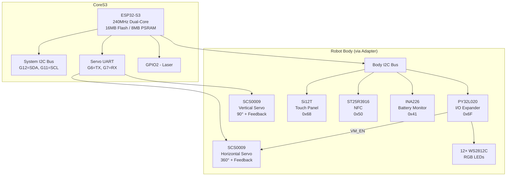
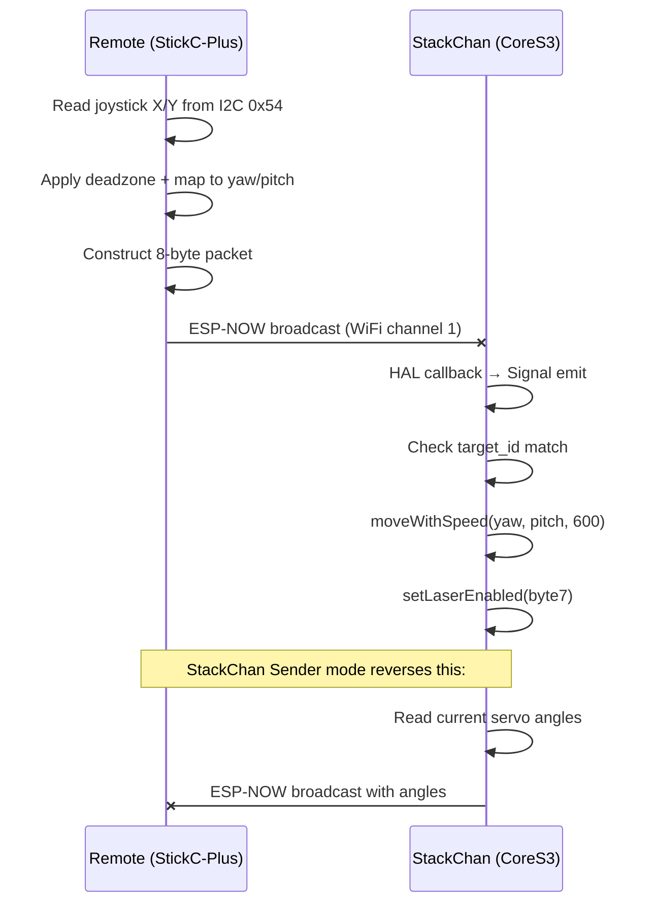

# M5StackChan: Deep Dive Technical Analysis of a Kawaii Desktop Robot Platform

StackChan is a palm-sized desktop robot built on the M5Stack CoreS3, an ESP32-S3 development kit. The project began as an open-source community effort in 2021 — a JavaScript-driven robot with 3D-printed shells, PWM servos, and a web-based firmware flasher. In 2025, M5Stack commercialized the concept into a polished product (SKU K151), pairing the CoreS3 with a custom robot body containing feedback servos, RGB LEDs, NFC, and a touch panel. The factory firmware runs a C++ application framework called Mooncake on top of the XiaoZhi AI voice assistant, supporting ESP-NOW remote control, OTA updates, and a mobile app for avatar and video-call features.

This article examines the platform from the hardware outward: what the CoreS3 and robot body contain, how the servo and sensor subsystems work, how the firmware is structured and built, how ESP-NOW remote control operates at the wire level, and how the XiaoZhi AI and MCP protocol integrate the device into a cloud-backed voice agent. The goal is not to review the product but to explain how it works, in enough detail that someone could understand the design decisions, modify the firmware, or build something similar.

> [!summary]
> - StackChan is a dual-servo robot head on an ESP32-S3 (CoreS3) with 16MB Flash, 8MB PSRAM, camera, IMU, NFC, and 12 RGB LEDs
> - The factory firmware is an ESP-IDF v5.5 C++ application (v1.4.2) built on the Mooncake app framework and the XiaoZhi AI voice platform
> - ESP-NOW provides connectionless broadcast remote control using 8-byte packets over Wi-Fi channels
> - The XiaoZhi framework uses MCP (Model Context Protocol) over WebSocket to let a cloud LLM invoke device-side tools (servo, LED, speaker, camera)
> - The original community project runs JavaScript on the Moddable SDK and supports a different set of servos and speech backends

---

## Why This Platform Matters

Embedded robotics projects tend to fall into two categories: hobbyist kits that are easy to assemble but limited in capability, and research platforms that are capable but expensive and complex. StackChan occupies a practical middle ground. The ESP32-S3 provides enough compute (240 MHz dual-core, 8MB PSRAM) to run real-time audio processing, Wi-Fi, and LVGL UI simultaneously. The commercial body adds feedback servos and an I/O expander that would be tedious to wire up from scratch. The firmware ships with source code under a permissive license and builds cleanly from a single `idf.py build` command.

For someone learning embedded systems, StackChan is a working reference for: I2C bus management with multiple devices, UART servo control with feedback, ESP-NOW communication, audio pipeline configuration on ESP32-S3, and the MCP protocol for device-to-cloud AI integration. Each of these subsystems is small enough to understand in an afternoon but realistic enough to show the constraints and tradeoffs that matter in production firmware.

---

## Hardware Architecture

### CoreS3: The Main Controller

The CoreS3 is the third generation of M5Stack's core controller series. It is built around the ESP32-S3, which features a dual-core Xtensa LX7 processor at 240 MHz, 16MB of Quad SPI flash, and 8MB of Quad SPI PSRAM. The ESP32-S3 was chosen over the original ESP32 for its improved vector instructions (useful for audio DSP and wake-word detection), its native USB support (CDC and JTAG without a separate bridge chip), and its larger addressable memory.

The board integrates a substantial number of peripherals, all sharing two I2C buses:

| Peripheral | I2C Address | Bus | Function |
|-----------|-------------|-----|----------|
| AXP2101 | 0x34 | System (G12/G11) | Power management IC |
| BMI270 | 0x69 | System | 6-axis IMU (accel + gyro) |
| BMM150 | 0x10 | BMI270 auxiliary | 3-axis magnetometer |
| BM8563 | 0x51 | System | Real-time clock |
| ES7210 | 0x40 | System | Audio codec (dual mic input) |
| AW88298 | 0x36 | System | I2S speaker amplifier |
| FT6336U | 0x38 | System | Capacitive touch controller |
| GC0308 | 0x21 | System (SCCB) | 0.3MP camera |
| LTR-553ALS-WA | 0x23 | System | Proximity + ambient light |
| AW9523B | 0x58 | — | I/O expander (LED, reset control) |

The system I2C bus on GPIO12 (SDA) and GPIO11 (SCL) carries nine devices. This is a high load for a single bus; in practice, the devices are accessed at different rates (the IMU at 100 Hz, the RTC once per second, the PMU on interrupt) so contention is manageable. The BMM150 magnetometer is notable: it is accessed through the BMI270's sensor hub auxiliary I2C interface rather than appearing directly on the system bus. This allows the IMU to perform 9-axis sensor fusion in hardware without CPU intervention.

The display is a 2.0-inch IPS LCD at 320×240 resolution driven by an ILI9342C controller. The touch overlay uses a FT6336U capacitive touch controller. Both are managed through the AW9523B I/O expander for reset and interrupt routing.

### Audio Pipeline

The audio pipeline is the most complex subsystem in StackChan. It must simultaneously capture microphone input, play speaker output, run wake-word detection, perform acoustic echo cancellation, encode and decode Opus audio, and stream data to and from a cloud server — all on a dual-core ESP32-S3 with constrained memory. Understanding how these pieces fit together is essential for anyone modifying the voice assistant or building a similar system.

#### Hardware Signal Path

Audio input uses an ES7210 codec connected to dual microphones via I2S. Audio output uses an AW88298 16-bit I2S power amplifier driving a 1W built-in speaker. Both codecs share the same I2S bus but operate in opposite directions:

| Signal | GPIO | Direction | Purpose |
|--------|------|-----------|----------|
| I2S_MCLK | GPIO0 | ESP32-S3 → both codecs | Master clock (256× sample rate) |
| I2S_BCK | GPIO34 | ESP32-S3 → both codecs | Bit clock |
| I2S_WCK | GPIO33 | ESP32-S3 → both codecs | Word select (L/R channel) |
| I2S_DOUT | GPIO13 | ESP32-S3 → AW88298 | Speaker output data |
| I2S_DIN | GPIO14 | ES7210 → ESP32-S3 | Microphone input data |

The CoreS3 audio codec implementation (`CoreS3AudioCodec`) creates a **full-duplex** I2S channel: the TX channel uses I2S standard mode (for the speaker), while the RX channel uses I2S TDM mode (for the microphones, which need multi-slot support for the dual-mic + reference channel configuration). Both run at the same sample rate, which is required for duplex operation on a shared I2S bus.

The ES7210 is configured with three microphone inputs selected (`ES7210_SEL_MIC1 | ES7210_SEL_MIC2 | ES7210_SEL_MIC3`). Two of these are the physical microphones; the third slot carries a **reference signal** from the speaker output, which is essential for acoustic echo cancellation.

#### The Audio Service: Two Data Flows

The `AudioService` class manages all audio processing. It defines two independent data flows that run concurrently:

```
Uplink (Microphone → Server):
  MIC → [AFE Processor] → {Encode Queue} → [Opus Encoder] → {Send Queue} → WebSocket → Server

Downlink (Server → Speaker):
  Server → WebSocket → {Decode Queue} → [Opus Decoder] → {Playback Queue} → Speaker
```

Three FreeRTOS tasks drive these flows:

1. **AudioInputTask** — reads PCM samples from the ES7210, feeds them through the AFE processor (which performs AEC, noise reduction, and VAD), then pushes processed frames to the encode queue
2. **OpusCodecTask** — consumes frames from the encode queue, encodes them to Opus, and pushes the resulting packets to the send queue; also consumes packets from the decode queue, decodes them to PCM, and pushes to the playback queue
3. **AudioOutputTask** — reads PCM frames from the playback queue and writes them to the AW88298

The queue depths are calibrated to balance latency against memory usage:

| Queue | Max Depth | Rationale |
|-------|-----------|----------|
| Encode queue | 2 tasks | Small — the Opus encoder must keep up with real-time input |
| Decode queue | 40 packets | Larger — buffers against network jitter (2400ms / 60ms per frame) |
| Playback queue | 2 tasks | Small — the speaker output must stay tightly synchronized |
| Send queue | 40 packets | Larger — allows the network to absorb bursts |

#### Opus Codec Configuration

The audio codec is Opus, configured for voice-optimized streaming:

| Parameter | Value | Reason |
|-----------|-------|--------|
| Sample rate | 16 kHz (uplink), 24 kHz (downlink) | 16 kHz sufficient for speech; 24 kHz for higher-quality TTS playback |
| Channels | 1 (mono) | Voice doesn't need stereo |
| Bit depth | 16-bit | Standard for PCM → Opus |
| Frame duration | 60 ms | Tradeoff between latency and efficiency |
| Bitrate | Auto (VBR) | Opus adapts bitrate to content complexity |
| Application mode | VOIP | Optimized for speech, not music |
| Complexity | 0 | Minimum CPU usage — important on embedded |
| FEC | Disabled | Forward error correction adds overhead |
| DTX | Enabled | Discontinuous transmission — sends nothing during silence |
| VBR | Enabled | Variable bitrate — saves bandwidth during quiet segments |

The 60ms frame duration means each Opus frame contains 960 samples at 16 kHz. The encoder produces compact packets (typically 40–80 bytes for active speech) that are sent as binary WebSocket frames to the server.

The server may respond with TTS audio at 24 kHz, which provides better fidelity for synthesized speech. The `AudioService` handles the sample rate mismatch by resampling the decoded PCM from 24 kHz to the output rate using Espressif's `esp_ae_rate_cvt` utility.

#### Acoustic Echo Cancellation (AEC)

AEC is the hardest problem in any voice assistant. The device must hear the user's voice while simultaneously playing TTS output through its speaker. Without AEC, the microphone picks up the speaker output, and the server's ASR transcribes the robot's own speech as if the user said it.

The XiaoZhi firmware supports two AEC modes:

1. **Device-side AEC** (default for CoreS3) — The `AfeAudioProcessor` uses Espressif's `esp-sr` AFE (Audio Front-End) library. This runs on the ESP32-S3 itself, using the speaker output as a reference signal. The ES7210 captures this reference on a third channel alongside the two microphone channels. The AFE processor then subtracts the reference from the microphone input, producing clean speech.

2. **Server-side AEC** (optional, enabled via `CONFIG_USE_SERVER_AEC`) — The device sends raw (unprocessed) microphone audio plus timestamps to the server, which performs AEC in software. This requires the Binary Protocol v2, which includes a `timestamp` field in each packet for synchronization. Server-side AEC is higher quality but adds latency and requires the server to implement the echo cancellation algorithm.

The device advertises its AEC capability in the WebSocket hello message:

```json
{
  "type": "hello",
  "features": { "aec": true },
  "audio_params": {
    "format": "opus",
    "sample_rate": 16000,
    "channels": 1,
    "frame_duration": 60
  }
}
```

When device-side AEC is active, the `CoreS3AudioCodec` sets `input_reference_ = true` and `input_channels_ = 2` (microphone + reference). The AFE processor receives this two-channel input and outputs single-channel clean speech to the Opus encoder.

#### Wake Word Detection

Wake word detection runs on the ESP32-S3 using Espressif's `esp-sr` WakeNet neural network. The default wake word is "Hi, StackChan" (customizable via the xiaozhi-assets-generator web tool).

The `AfeWakeWord` class shares the AFE processor's input stream. When the AFE processes a frame of audio, it simultaneously:

- Outputs clean speech (for the Opus encoder)
- Runs the WakeNet model (for wake word detection)
- Reports VAD state changes (speaking / not speaking)

When the wake word is detected, the device:

1. Stores the audio containing the wake word in a ring buffer
2. Encodes it to Opus (so the server can verify the wake word and potentially perform voice-print identification)
3. Sends a `listen` message with `state: "detect"` to the server
4. Transitions from Idle to Connecting, then to Listening

#### Voice Session State Machine

The voice assistant follows a defined state machine:

```
Idle → Connecting → Listening → Speaking → Idle
                         ↑          │
                         └──────────┘ (auto-continue mode)
```

| Transition | Trigger | Action |
|------------|---------|--------|
| Idle → Connecting | Wake word or screen tap | Open WebSocket, send hello |
| Connecting → Listening | Server hello received | Start microphone streaming |
| Listening → Speaking | Server sends `tts: start` | Stop mic, play TTS audio |
| Speaking → Idle | Server sends `tts: stop` | Return to idle (or auto-continue) |
| Any → Idle | Abort or disconnect | Close WebSocket |

In "auto" listening mode (the default), after the server finishes speaking (TTS stop), the device automatically returns to Listening rather than Idle. This enables multi-turn conversation without requiring the user to say the wake word again. In "manual" mode, the user must tap the screen or say the wake word to start each turn.

The device can also abort a response mid-speech if the wake word is detected again ("barge-in"). It sends an `abort` message with `reason: "wake_word_detected"`, and the server stops generating TTS.

#### The I2C Bus Reset Problem

The ES7210 and AW88298 both sit on the same system I2C bus as the AXP2101, BMI270, and other peripherals. During audio operation, the I2C bus is accessed continuously to configure codec parameters (volume changes, input gain, channel selection). If any other I2C device holds the bus (for example, the IMU performing a burst read), the codec configuration can stall.

The `CoreS3AudioCodec` uses Espressif's `esp_codec_dev` abstraction layer, which handles I2C transactions through a mutex-protected control interface. In practice, the DMA-based I2S data path (which carries the actual audio samples) is independent of the I2C control path, so audio streaming continues even if I2C configuration commands are delayed. But rapid volume changes or input enable/disable transitions can produce audible glitches if the I2C bus is contended.

### Power Management

The AXP2101 is a sophisticated power management IC that controls charging, voltage regulation, and power-path selection. On the CoreS3, it manages:

- Battery charging from USB or external DC
- 3.3V rail for the ESP32-S3 and peripherals
- Display backlight power (DLDO1)
- Display power enable (LX1)
- Wake-up signaling to the BM8563 RTC

The robot body has its own 550 mAh battery (the CoreS3's internal battery is 500 mAh). An INA226AIDGSR battery monitor at I2C address 0x41 provides voltage and current measurements for the body battery. Power is delivered through either USB-C port (the body port is recommended to avoid stressing the CoreS3 connector during servo movement).

### Robot Body: Servos, LEDs, Touch, NFC

The robot body connects to the CoreS3 through an adapter board. The body's peripherals are managed through a separate I2C bus and a PY32L020 I/O expander:

| Body Peripheral | Interface | Details |
|----------------|-----------|---------|
| Horizontal servo (SCS0009) | UART TX (GPIO6) | 360° continuous rotation with feedback |
| Vertical servo (SCS0009) | UART RX (GPIO7) | 90° range with feedback |
| 12× RGB LEDs (WS2812C) | PY32L020 IO14 via I/O expander | Two rows of 6 |
| Touch panel (Si12T) | I2C at 0x68 | Three-zone capacitive touch |
| NFC (ST25R3916) | I2C at 0x50 | Full-featured NFC reader/writer |
| IR receiver (IRM56384) | GPIO10 | Infrared receiver |
| IR transmitter | GPIO5 | Infrared transmitter |
| Battery monitor (INA226) | I2C at 0x41 | Voltage and current sensing |
| Motor power enable | PY32L020 IO1 via I/O expander | Servo power gating |
| Laser | GPIO2 | Debug/pointer laser |

The PY32L020 I/O expander at I2C address 0x6F (configurable to 0x71) controls two critical signals: `VM_EN` (motor power enable) and `RGB` (WS2812C data line). This design means the RGB LED string cannot be driven directly by the ESP32-S3's RMT peripheral; instead, the firmware must send the WS2812C protocol data through the I/O expander over I2C, which introduces latency and limits the maximum refresh rate.

#### The SCS0009 Feedback Servos

The SCS0009 servos use a UART-based serial protocol (not PWM). Two servos share the same UART bus on GPIO6 (TX) and GPIO7 (RX) at 1 Mbps. The protocol is implemented by the Feetech `SCSCL` driver class, which provides a half-duplex serial command set:

| Command | Method | Description |
|---------|--------|-------------|
| WritePos | `WritePos(id, position, time, speed)` | Move to absolute position with optional time/speed |
| WritePWM | `WritePWM(id, pwm)` | Direct PWM output (for continuous rotation) |
| SwitchMode | `SwitchMode(id, mode)` | Toggle Position mode vs PWM mode |
| EnableTorque | `EnableTorque(id, enable)` | Enable/disable servo torque |
| FeedBack | `FeedBack(id)` | Read all feedback registers at once |
| ReadPos | `ReadPos(id)` | Current position (raw units) |
| ReadMove | `ReadMove(id)` | Whether the servo is still moving |
| ReadLoad | `ReadLoad(id)` | Motor load percentage (0–1000) |
| ReadCurrent | `ReadCurrent(id)` | Motor current draw |

The servo's internal memory map exposes both writable control registers (goal position, time, speed, torque enable) and read-only feedback registers (current position, speed, load, voltage, temperature, current, moving state). The `FeedBack()` command reads the entire feedback block in a single UART transaction, which is more efficient than reading individual registers.

The horizontal servo (ID 1) provides 360° continuous rotation, meaning it can spin indefinitely in either direction. The vertical servo (ID 2) provides 90° of movement. Both include position feedback, which the firmware uses for:

- Zero-position calibration (stored in NVS)
- The "Sender" mode in ESP-NOW control, where the current servo angles are read and broadcast
- Smooth motion control through the `moveWithSpeed(yaw, pitch, speed)` API
- Stall detection and protection

#### Servo Configuration and Calibration

The HAL initializes the servos in `servo_init()` with hardcoded defaults:

| Parameter | Yaw Servo (ID 1) | Pitch Servo (ID 2) |
|-----------|-------------------|---------------------|
| Servo ID | 1 | 2 |
| Default zero position | 460 | 620 |
| Angle limit | -1280 .. 1280 | 30 .. 870 |
| Raw position limit | 0 .. 1000 | 0 .. 1000 |
| NVS namespace | "servo" | "servo" |
| NVS key | "zero_pos_1" | "zero_pos_2" |
| PWM mode enabled | Yes | No |
| Stall protection | No | Yes |

The angle values are in units of 0.1°, so the yaw range of -1280..1280 represents ±128° and the pitch range of 30..870 represents 3°..87°. Raw position values are in the servo's native units, where one raw step corresponds to 0.3125° (the conversion factor is `5/16 = 0.3125`).

The zero position is loaded from NVS at boot. If the NVS value is out of range or missing, the default is used instead and the NVS is updated. The user can recalibrate through the on-device Settings menu, which calls `setCurrentAngleAsZero()` — this reads the current raw position from the servo and writes it to NVS.

#### Spring-Based Motion Animation

The `Servo` base class does not send raw position commands directly to the hardware. Instead, it uses a **spring animation system** (`uitk::AnimateValue` with spring physics) to smoothly interpolate between the current angle and the target angle. This is what makes StackChan's head movements look natural rather than robotic.

A spring animation is governed by three parameters:

- **Stiffness** (k) — how strongly the spring pulls toward the target. Higher stiffness = faster motion.
- **Damping** (d) — how quickly oscillation is suppressed. Critical damping (d = 2√(m·k)) produces motion that reaches the target as fast as possible without overshooting.
- **Mass** (m) — inertial parameter. Always 1.0 in this system.

The default spring parameters are stiffness=170.0 and damping=26.0, which produces a smooth, slightly underdamped motion that settles in roughly 200–300ms. These defaults are used by `move(angle)` and by the idle motion system.

The `moveWithSpeed(angle, speed)` method maps the speed parameter (0–1000) to spring stiffness using a quadratic curve:

```
k = k_min + (speed/1000)² × (k_max - k_min)
  = 10 + (speed/1000)² × 640
```

The damping is then set to critical damping for that stiffness: `d = 2 × √(m × k)`. This means:

| Speed | Stiffness | Damping | Behavior |
|-------|-----------|---------|----------|
| 0 | 10 | 6.3 | Very slow, gentle drift |
| 250 | 50 | 14.1 | Slow, deliberate turn |
| 500 | 170 | 26.0 | Default speed, natural motion |
| 750 | 370 | 38.5 | Fast, purposeful turn |
| 1000 | 650 | 51.0 | Maximum speed, snappy |

At high speeds (>800), the rest thresholds are loosened (restDelta=0.5, restSpeed=0.5 instead of 0.1) to prevent micro-oscillation caused by the discrete position steps of the servo.

The `update()` method runs at approximately 50 Hz (20ms intervals) and advances the spring simulation with a fixed delta time of 0.02s. When the animation reaches its rest state, the servo snaps to the exact target angle and, if auto-torque-release is enabled, disables the servo torque after 200ms of inactivity. This prevents the servo from buzzing at rest and reduces power consumption.

#### Stall Detection and Protection

The pitch servo has stall protection enabled. This is critical for safety: if something physically blocks the vertical servo (for example, someone pushing the robot's head down), the servo must stop driving to avoid burning out the motor or stripping gears.

The stall detection algorithm runs every 50ms during motion:

1. Read current position, current draw, and load via `FeedBack()`
2. Calculate the delta between the target position and current position
3. If the delta is below a minimum threshold (8 raw units ≈ 2.5°), skip — the servo is close enough to its target
4. Check if the position has changed by more than 1 raw unit since the last check
5. If position is stuck **and** (current spike ≥ 80 units OR load spike ≥ 150 units OR absolute current ≥ 350 OR absolute load ≥ 650), increment the stall confirmation counter
6. If the position has actually moved, reset the counter
7. After 2 consecutive stall confirmations, declare a stall

When a stall is detected, the firmware:

1. Stops the spring animation at the current position
2. **Shrinks the angle limit** toward the stall point (preventing future commands from driving into the same obstruction)
3. Holds the current position with a low-effort `WritePos()` command
4. Logs the stall with raw position, angle, direction, current, and load values

The runtime angle limit adjustment means that if the servo stalls at, say, pitch=400, the firmware will not attempt to drive past that angle again until the device is rebooted or recalibrated. This is a self-protecting behavior that prevents repeated stall events.

#### Torque Management and PWM Mode

The yaw servo supports PWM mode in addition to position mode. In PWM mode, the servo rotates continuously at a velocity proportional to the PWM value (0–1023). This is used for the 360° continuous rotation capability of the horizontal axis.

The firmware manages torque carefully:

- **Auto torque release** — After the spring animation settles and the servo is at rest, the torque is disabled. This prevents the servo from holding position against external forces (which would cause buzzing and power waste) but also means the head can be moved freely by hand.
- **Auto angle sync** — When enabled (the default), each new `move()` command reads the current physical angle from the servo and uses it as the starting point for the spring animation. This prevents "jumps" when the head has been moved manually, but can cause stuttering during high-frequency updates because the animation's velocity is reset. When disabled, the animation maintains momentum from its previous state, producing smoother continuous motion but risking a "snap" if the physical and internal states have diverged.
- **Modify lock** — The `Motion` class has a `setModifyLock()` flag that prevents modifiers from sending motion commands. This is used during ESP-NOW control and AI agent interaction to prevent the idle motion system from fighting with external control inputs.

#### Motion Modifiers: Idle Behavior and Pet Responses

The `StackChan` class maintains a list of `Modifier` objects that run every frame. These modifiers add personality to the robot's idle behavior:

**IdleMotionModifier** — Triggers random head movements every 4–8 seconds when the robot is idle. It selects from four action types:

| Weight | Action | Description |
|--------|--------|-------------|
| 50% | Look around | `lookAtNormalized(x, y)` with x∈[-0.4, 0.4], y∈[-0.95, 0.2], speed 150–300 |
| 30% | Small shift | ±150 yaw, ±80 pitch from current position, speed 100–250 |
| 10% | Quick glance | Random yaw±500, pitch 100–400, speed 250–400 |
| 10% | Re-center | Yaw→0 (home), random pitch 50–400, speed 100–300 |

The modifier checks `isMoving()` before issuing a new command, so it never stacks commands while the head is still in motion. It can be paused and resumed (for example, paused during AI agent interaction and resumed when idle).

**HeadPetModifier** — Responds to swipe gestures on the top touch panel. When a swipe is detected:

1. Saves the current emotion and head position
2. Sets the avatar emotion to Happy
3. Adds heart and shy decorators to the face display
4. Performs a random pet-response motion (head tilt, head raise, or large happy motion)
5. After the hand is released, waits 3 seconds, then restores the original emotion and head position

**SpeakingModifier** — Synchronizes mouth animation with TTS audio playback.

**IdleExpressionModifier** — Triggers random facial expressions (blinking, gaze shifts) on a timer.

**ImuModifier** — Detects shaking (via the BMI270 IMU) and triggers a dizzy expression.

#### Inverse Kinematics: lookAtPoint()

The `Motion` class provides two spatial targeting methods:

- `lookAtNormalized(x, y, speed)` — Maps normalized coordinates [-1.0, 1.0] to the servo angle limits. Used by face tracking and joystick-style control.
- `lookAtPoint(x, y, z, speed)` — Performs inverse kinematics to direct the head at a 3D point. Uses `atan2(y, x)` for yaw and `atan2(z, √(x² + y²))` for pitch. The coordinate system is right-handed: X forward, Y left, Z up. Returns angles in 0.1° units.

The IK solver is simple because the robot only has two degrees of freedom (yaw and pitch) and the rotation center is fixed at (0,0,0). There is no translation component — the head only rotates in place. This means the IK solution is just a pair of `atan2` calls, with no iterative optimization needed.



---

## Firmware Architecture

### Build System and Dependencies

The factory firmware builds with ESP-IDF v5.5 (the `idf_component.yml` enforces `>=5.5.2`). The build has two categories of dependencies:

1. **Git-based dependencies** (6 repos), defined in `repos.json` and fetched by `fetch_repos.py` into `components/` and `xiaozhi-esp32/`:
   - mooncake v2.3.3 — the app framework
   - mooncake_log v1.5.0 — logging
   - smooth_ui_toolkit v2.12.0 — LVGL wrapper
   - xiaozhi-esp32 v2.2.4 (with a 10KB patch applied)
   - ArduinoJson v7.4.2
   - esp-now (pinned to a specific commit)

2. **IDF Component Registry** (60+ components), auto-downloaded by CMake during `idf.py set-target`:
   - LVGL, espressif/esp-sr, M5GFX, esp_wifi, and many others

The complete build produces approximately 6MB of flash content:

| Artifact | Size | Flash Offset | Partition |
|----------|------|-------------|-----------|
| bootloader.bin | 24 KB | 0x0 | Bootloader |
| partition-table.bin | 3 KB | 0x8000 | Partition table |
| ota_data_initial.bin | 8 KB | 0xD000 | OTA data |
| stack-chan.bin | 3.7 MB | 0x20000 | OTA slot 0 |
| generated_assets.bin | 2.2 MB | 0xA00000 | SPIFFS assets |

The partition layout reserves two 4.9 MB OTA slots (allowing A/B updates), a 4 MB SPIFFS assets partition for fonts, icons, and audio files, and a 64 KB coredump partition. With OTA rollback protection enabled, the firmware must confirm itself on boot or the bootloader reverts to the previous slot.

### The Mooncake App Framework

Mooncake is the application framework that manages the StackChan's user-facing features. It provides:

- An app lifecycle: `onCreate` → `onOpen` → `onRunning` → `onClose`
- A launcher that displays installed apps as icons in a swipeable carousel
- Common UI components: status bar, home indicator, loading page, toast notifications
- Inter-app communication through the HAL (Hardware Abstraction Layer)

Each app exposes an `AppInfo_t` struct with a name, icon resource, and a `userData` field (used as a `void*` pointing to a `uint32_t` theme color). The factory firmware includes these apps:

| App | Description |
|-----|-------------|
| AI.AGENT | XiaoZhi voice assistant with wake word, ASR, LLM, TTS |
| AVATAR | Mobile app avatar, monitoring camera, motion control |
| ESPNOW.REMOTE | ESP-NOW receiver/sender/advanced mode |
| APP.CENTER | Online app download store |
| EZDATA | Cloud data service (not yet available) |
| DANCE | Choreographed dance with music, motion, and lighting |
| SETUP | Wi-Fi, brightness, volume, timezone, servo calibration, firmware update |

The launcher reads each app's `AppProps_t` (name, icon, theme color) and renders it as a tappable card. Swipe left/right to navigate, tap to launch. Within any app, swipe inward from the bottom edge to reveal the home button (a spring-animated pill that responds to swipe-up gestures).

### Hardware Abstraction Layer (HAL)

The HAL (`hal.h`, `hal.cpp`, and per-subsystem implementations) provides a unified interface to all hardware. Key APIs include:

```cpp
// Display
void setBrightness(float percent);

// Servo motion
void setAutoAngleSyncEnabled(bool enabled);  // prevent jitter during ESP-NOW

// ESP-NOW
Signal<const std::vector<uint8_t>&> onEspNowData;
void startEspNow(int channel);
void espNowSend(const std::vector<uint8_t>& data);

// Audio
void setVolume(int volume);

// LED
void setLedColor(uint8_t r, uint8_t g, uint8_t b);

// OTA
void updateFirmware(const std::string& url, std::function<void(int)> onProgress);

// Laser
void setLaserEnabled(bool enabled);
```

The ESP-NOW subsystem is a good example of how the HAL bridges the hardware to the app layer. The HAL initializes Wi-Fi in STA mode, briefly enables promiscuous mode to lock the RF channel, then starts the `espressif/esp-now` component. Incoming packets are received in a FreeRTOS callback, copied into a `std::vector<uint8_t>`, and emitted through a `uitk::Signal`. The app connects a lambda to this signal, guarded by a mutex, to safely pass data from the callback context to the main loop.

### Boot Sequence

When powered on, the firmware initializes subsystems in a specific order (as captured from serial monitor output):

1. AXP2101 power management — charge current configured
2. GC0308 camera initialization
3. Display backlight set to 75%
4. MCP tools registration (head angle get/set, LED color, reminders)
5. Si12T touch sensor (v0.0.2)
6. PY32L020 I/O expander (v0.41)
7. PCF8563 RTC — synced to UTC
8. BMI270 IMU
9. SCS0009 servos — zero positions loaded from NVS
10. LVGL display + touchpad initialized
11. Assets partition mounted (SPIFFS, checksummed in 133ms)
12. Mooncake launcher starts with all installed apps
13. OTA confirm check passes

Total boot time from power-on to launcher: approximately 6–7 seconds. Free SRAM after boot is approximately 150 KB.

---

## ESP-NOW Remote Control

The ESP-NOW subsystem is one of the most interesting technical features of the platform. It provides low-latency, connectionless remote control without requiring Wi-Fi association, Bluetooth pairing, or any setup beyond matching a Wi-Fi channel number.

### How ESP-NOW Works

ESP-NOW is a protocol defined by Espressif that encapsulates application data in vendor-specific IEEE 802.11 action frames. Unlike regular Wi-Fi, there is no association handshake, no AP, and no DHCP. A device transmits a frame addressed to a peer's MAC address (or the broadcast address), and any device on the same Wi-Fi channel that is listening for ESP-NOW frames receives it.

Key properties:

- **Connectionless.** No handshake, no association, no AP needed.
- **Low latency.** Millisecond-scale response time because there is no connection setup.
- **Coexists** with Wi-Fi and BLE on the same radio.
- **Range.** Typical Wi-Fi range (~200m open air); long-range mode extends this further.
- **Payload.** Up to 250 bytes per frame (v1.0 protocol; v2.0 supports 1470 bytes).
- **Security.** CCMP (AES-128) encryption available with PMK/LMK key hierarchy.

StackChan uses the `espressif/esp-now` IDF component, which is a high-level wrapper around the raw ESP-IDF ESP-NOW API. The component adds automatic retry logic, broadcast support, and receive callbacks. StackChan does not use the component's pairing, provisioning, OTA, or debug features — it only uses the data sending and receiving.

### Packet Format

The control packet is 8 bytes, little-endian:

```
Offset  Size  Field          Type       Range          Description
──────  ────  ─────          ────       ─────          ───────────
0       1     target_id      uint8      0–254          0=broadcast, 1–254=specific
1       2     yaw_angle      int16_le   -1280..1280    Horizontal angle (0.1° units)
3       2     pitch_angle    int16_le   0..900         Vertical angle (0.1° units)
5       2     speed          int16_le   0–1000         Servo speed (default 600)
7       1     button/laser   uint8      0 or 1         Laser on/off
```

The `target_id` field implements a simple addressing scheme. When set to 0, all receivers on the channel respond regardless of their configured ID. When set to 1–254, only the receiver with the matching ID responds. Multiple receivers can share the same ID for group control. Receivers cannot set their own ID to 0 (enforced by the UI).

The yaw range of -1280 to 1280 represents ±128.0°. The pitch range of 0 to 900 represents 0–90.0°. These ranges map directly to the servo angle domains: the horizontal servo can rotate 360° (though the effective range in practice is smaller due to the body geometry), and the vertical servo has a 90° range.

### The Remote Controller

The remote controller is an M5StickC-Plus (ESP32, not S3) with a Hat Mini JoyC joystick attachment. The JoyC hat contains an STM32F030F4P6 microcontroller at I2C address 0x54 that reads the analog joystick and exposes the X/Y values as 16-bit registers:

| Register | Bytes | Description |
|----------|-------|-------------|
| 0x00 | 2 | X-axis value (uint16, little-endian) |
| 0x02 | 2 | Y-axis value (uint16, little-endian) |

The joystick has the following calibration constants:

```
DEAD_ZONE = 300    # Snap to center within this range
X_CENTER  = 2180   # Center X value
Y_CENTER  = 1960   # Center Y value
X_MIN     = 630    # Full left
X_MAX     = 3730   # Full right
Y_MIN     = 310    # Full up
Y_MAX     = 3460   # Full down
```

The remote operates in three modes:

1. **Setup** — Select Wi-Fi channel (1–14) and target ID (0–50) using the joystick
2. **Running** — Joystick controls yaw/pitch, BtnB toggles laser
3. **IMU** — Tilt the controller itself to control yaw/pitch using the StickC-Plus's built-in IMU

In joystick mode, the raw X value (630–3730) is mapped to yaw (-1280..1280), and the raw Y value (310–3460) is mapped to pitch (0..900). In IMU mode, the roll angle (clamped to ±1.5 radians) maps to yaw, and the pitch angle (0–1.5 radians) maps to the servo pitch — inverted, so tilting the controller forward tilts the robot's head down.

To reduce air traffic, the remote only sends packets when values change beyond a threshold (5 units in joystick mode, 10 units in IMU mode) with a 30ms loop delay.

### The StackChan as Receiver

When the StackChan receives an ESP-NOW packet, the HAL callback emits a signal that the ESP-NOW app processes:

```cpp
if (_received_data.size() >= 8) {
    uint8_t target_id = _received_data[0];
    if (target_id != 0 && target_id != _receiver_id) return;
    
    int16_t yaw   = _received_data[1] | (_received_data[2] << 8);
    int16_t pitch = _received_data[3] | (_received_data[4] << 8);
    int16_t speed = _received_data[5] | (_received_data[6] << 8);
    bool laser    = (_received_data[7] != 0);
    
    GetStackChan().motion().moveWithSpeed(yaw, pitch, speed);
    GetHAL().setLaserEnabled(laser);
}
```

Before entering ESP-NOW control mode, the app disables auto angle sync (`setAutoAngleSyncEnabled(false)`) to prevent the motion subsystem from fighting with the incoming control packets.

### The StackChan as Sender (Puppet Mode)

The ESP-NOW app also supports a Sender role, where the StackChan reads its current servo angles every 50ms and broadcasts them. This enables "puppet" control: manually turning one StackChan's head causes another to follow. The speed parameter is hardcoded to 800 in sender mode (vs. 600 in the remote).

### Design Tradeoffs

The ESP-NOW implementation uses broadcast addressing exclusively. This means:

- No pairing step — any sender can control any receiver on the same channel
- No encryption — broadcast packets are unencrypted
- No acknowledgment — broadcast sends are fire-and-forget (5 retries, but no application-level ACK)
- No source authentication — any device on the channel can inject control packets

Forwarding is disabled on both sides. The HAL code comments explain: "Arduino无法解析带转发头的包" (the Arduino remote cannot parse packets with forwarding headers). This is a compatibility tradeoff that prevents multi-hop relay but ensures the ESP32-based remote works.



---

## XiaoZhi AI and the MCP Protocol

### The XiaoZhi Framework

The AI Agent in the factory firmware is powered by XiaoZhi, an open-source voice assistant framework for ESP32 devices. XiaoZhi provides:

- **Offline voice wake-up** using Espressif's `esp-sr` library (default wake word: "Hi, StackChan")
- **Streaming ASR + LLM + TTS** architecture — audio is streamed to the server, transcribed, processed by a large language model (Qwen, DeepSeek, etc.), and the response is streamed back as TTS audio
- **OPUS audio codec** for bandwidth-efficient audio transport
- **WebSocket or MQTT+UDP** communication with the backend
- **Speaker recognition** using 3D Speaker
- **70+ board configurations** for different ESP32 hardware

The XiaoZhi framework is the dominant codebase in the firmware. The Mooncake apps are a thin layer on top; the AI Agent app primarily configures and starts the XiaoZhi engine. The firmware version is 1.4.2, while the XiaoZhi dependency is v2.2.4 (with a patch applied to integrate with the StackChan HAL).

### MCP: Model Context Protocol

MCP is the protocol that allows the cloud-based LLM to invoke functions on the physical device. The XiaoZhi device acts as an MCP server, and the cloud backend acts as an MCP client. The protocol follows JSON-RPC 2.0 semantics, wrapped in the WebSocket or MQTT transport.

The interaction flow is:

1. **Connection and capability announcement.** The device sends a transport-level hello message advertising `"mcp": true` in its features map.

2. **Initialize.** The backend sends an `initialize` request. The device responds with its protocol version, capabilities (it supports `tools`), and server info.

3. **Discover tools.** The backend sends `tools/list` to discover what the device can do. The device returns a paginated list of tools with names, descriptions, and JSON Schema input definitions.

4. **Call tools.** When the LLM decides the user wants to control the device (e.g., "turn your head left"), the backend sends a `tools/call` request with the tool name and arguments. The device executes the function and returns the result.

The StackChan registers these MCP tools (among others):

| Tool | Description |
|------|-------------|
| `self.motor.set_head_angle` | Turn head to specified yaw/pitch angles |
| `self.motor.get_head_angle` | Get current head angles |
| `self.audio_speaker.set_volume` | Set speaker volume |
| `self.rgb_led.set_color` | Set RGB LED color |
| `self.camera.capture` | Capture an image from the camera |
| `self.battery.get_status` | Get battery level and charging state |

There are also "user-only" tools (registered via `McpServer::AddUserOnlyTool`) that are hidden from the AI model but exposed to companion apps. These include system reboot, firmware upgrade, and screen snapshot upload. The backend opts into user-only tools by sending `tools/list` with `withUserTools: true`.

Example MCP tool call flow:

```
User says: "Turn your head to the left"
   ↓
ASR transcribes → LLM processes → LLM decides to call self.motor.set_head_angle
   ↓
Backend sends: {"method": "tools/call", "params": {"name": "self.motor.set_head_angle", "arguments": {"yaw": -450}}}
   ↓
Device executes moveWithSpeed(-450, 0, 600) → returns {"result": {"content": [{"type": "text", "text": "true"}]}}
   ↓
LLM generates: "I've turned my head to the left."
   ↓
TTS streams audio response back to the device
```

This architecture means the LLM has real-time control over the physical device. The MCP tools are the bridge between the language model's symbolic reasoning and the robot's actuators. The security model relies on the WebSocket being authenticated (the device connects to the xiaozhi.me server using the user's credentials) and the LLM being constrained to only call registered tools.

### Voice Interaction States

The RGB LED near the screen indicates the voice interaction state:

- **Green** — the device is listening for voice input
- **Blue** — the device is speaking (TTS output)
- **Off** — the voice interaction is idle

When idle, the device randomly performs expressions (blinking, head movements). Swiping vertically on the top touch panel triggers a happy expression. Shaking the device triggers a dizzy expression. After a period of inactivity, a sleeping expression appears.

---

## The Community StackChan: JavaScript on Moddable

Before M5Stack commercialized StackChan, the open-source community project at `github.com/stack-chan/stack-chan` had been developing since July 2021. This version takes a fundamentally different approach to firmware:

### Moddable SDK and JavaScript

The community StackChan runs JavaScript on the Moddable SDK, which compiles JS to efficient machine code for embedded targets. The firmware is written in TypeScript and compiled to XS (the Moddable JavaScript engine). This means the entire robot behavior — face rendering, speech, servo control — is expressed in JavaScript rather than C++.

The firmware architecture separates a host program from user applications called MODs:

- **Host program** (`stackchan/`): Core firmware with face rendering, speech, servo drivers, and BLE
- **MODs** (`mods/`): User applications that can be flashed independently without reflashing the host

This split is significant: MODs are small (a few KB) and flash in seconds, while the host firmware is large and takes minutes. This enables a fast development cycle where you iterate on a MOD's behavior without waiting for a full firmware rebuild.

### Available MODs

| MOD | Description |
|-----|-------------|
| look_around | Default gaze behavior — the robot looks around randomly |
| monologue | Periodic soliloquy using TTS |
| cheerup_ble_lite | Cheerful responses triggered via BLE |
| cheerup_ws | Cheerful responses triggered via WebSocket |
| mimic_main | Source device for mimic mode |
| mimic_follow | Follower device that mimics the main |
| face_tracker | Tracks faces using the camera |
| chatgpt | ChatGPT integration for conversation |
| ai_stackchan_api | AI Stack-chan API integration |
| config_wifi | Wi-Fi configuration utility |
| unit_temperature | Temperature sensor display |

### Servo Support

The community firmware supports more servo types than the commercial product:

- Feetech SCS0009 (serial, used in commercial StackChan)
- FUTABA RS30x (serial)
- DYNAMIXEL (serial)
- PWM servos (SG90 and similar)

This breadth is necessary because the community builds their own cases and servo setups from scratch, whereas the commercial product ships with a fixed hardware configuration.

### Speech Backends

TTS options in the community version:

- **VOICEVOX** — Japanese TTS (cloud or local)
- **ElevenLabs** — English and multi-language TTS
- **OpenAI TTS** — via the OpenAI API
- **Local TTS** — offline synthesis

The commercial product uses XiaoZhi's integrated TTS, which supports multiple languages through the xiaozhi.me cloud service.

### MCP in the Community Firmware

The community StackChan also implements MCP, but as both client and server:

- **MCP Server** (`stackchan/services/mcp-server/`): Exposes the robot's capabilities (face, speech, servos) as MCP tools
- **MCP Client** (`stackchan/services/mcp-client/`): Connects to external MCP servers to extend the robot's capabilities

This is a more general-purpose MCP integration than the commercial product's XiaoZhi-specific implementation. It allows the community StackChan to connect to any MCP-compatible AI backend.

---

## Comparing the Two Firmwares

| Aspect | Commercial (M5Stack/Mooncake) | Community (stack-chan/Moddable) |
|--------|-------------------------------|--------------------------------|
| Language | C++ (ESP-IDF) | JavaScript/TypeScript (Moddable) |
| AI Integration | XiaoZhi (built-in voice assistant) | ChatGPT mod, MCP client/server |
| Servo Protocol | SCS0009 serial only | SCS0009, RS30x, DYNAMIXEL, PWM |
| Speech | XiaoZhi TTS (cloud) | VOICEVOX, ElevenLabs, OpenAI, local |
| Remote Control | ESP-NOW (built-in app) | BLE, WebSocket |
| App System | Mooncake (C++ apps) | MODs (JavaScript modules) |
| Build System | ESP-IDF / idf.py | npm / xs |
| Display | LVGL (C UI toolkit) | Piu (Moddable UI framework) |
| OTA | A/B partition with rollback | Web-based flasher |
| Mobile App | StackChan World (iOS/Android) | None |

The commercial firmware prioritizes a polished out-of-box experience: voice assistant, mobile app, OTA updates, and ESP-NOW remote control all work without writing code. The community firmware prioritizes hackability: JavaScript mods, multiple servo types, and a modular service architecture that makes it easy to swap out speech engines or AI backends.

---

## Building and Flashing the Factory Firmware

The factory firmware can be built from source in approximately 5–6 minutes on a modern machine. The process has been verified end-to-end on Linux with ESP-IDF v5.5.4:

```bash
# 1. Install ESP-IDF v5.5.4
git clone --depth 1 --branch v5.5.4 --recursive \
  https://github.com/espressif/esp-idf.git ~/esp/esp-idf-5.5.4
cd ~/esp/esp-idf-5.5.4 && ./install.sh esp32s3

# 2. Clone the firmware and fetch dependencies
git clone https://github.com/m5stack/StackChan.git
cd StackChan/firmware
python3 ./fetch_repos.py

# 3. Build
source ~/esp/esp-idf-5.5.4/export.sh
idf.py set-target esp32s3   # downloads 60+ IDF components
idf.py build                 # 2491 steps, ~5 min

# 4. Flash and monitor
idf.py -p /dev/ttyACM0 flash monitor
```

The CoreS3 uses USB CDC/JTAG (appears as `/dev/ttyACM0` on Linux, not `/dev/ttyUSB0`). To enter download mode, press and hold the RST button for 3 seconds until the green LED lights up.

### Custom Server Configuration

To point the AI Agent at a self-hosted XiaoZhi server instead of xiaozhi.me, create a file called `sdkconfig.defaults.local` in the firmware directory:

```
CONFIG_XIAOZHI_SERVER_URL="https://your-server.example.com"
```

This file is gitignored and overlays the default `sdkconfig.defaults` during build. The same mechanism works for any sdkconfig option.

### Creating Custom Apps

The firmware includes an `app_template/` directory with a skeleton app. A custom app needs:

1. A class inheriting from `AppAbility` with `onCreate`, `onOpen`, `onRunning`, `onClose` methods
2. An `AppInfo_t` struct with name, icon resource, and theme color
3. Registration in `apps/apps.h` and `main.cpp`

The minimum viable app is approximately 50 lines of C++. The Mooncake framework handles lifecycle management, LVGL rendering, and resource cleanup.

---

## Limitations and Open Questions

### Battery Life

The 550 mAh body battery (plus 500 mAh CoreS3 battery) provides limited runtime, especially when the AI Agent is actively processing voice. The display, Wi-Fi radio, and servos all draw significant current. No official battery life figures are published, but continuous voice interaction likely limits runtime to 1–2 hours.

### ESP-NOW Security

The broadcast-only ESP-NOW implementation has no encryption or authentication. Any device on the same Wi-Fi channel can send control packets to any StackChan in receiver mode. For a desktop toy this is acceptable; for any deployment where control matters, the ESP-NOW component's pairing and security features would need to be enabled.

### I2C Bus Contention

The system I2C bus carries nine devices. While each device operates at a different access pattern, simultaneous access (e.g., IMU reads during touch processing) can cause latency spikes. The firmware does not appear to implement any I2C arbitration or priority scheme.

### RGB LED Through I/O Expander

Routing the WS2812C data line through the PY32L020 I/O expander over I2C adds latency compared to direct GPIO or RMT control. This limits the maximum refresh rate for the 12 RGB LEDs and may cause visible flicker during I2C bus contention.

### XiaoZhi Version Locking

The firmware applies a patch to xiaozhi-esp32 v2.2.4 and pins the esp-now component to a specific commit. This makes the build reproducible but also fragile — updating to newer versions of either dependency requires testing the patch and verifying the commit is still available.

### Assets Partition Not Updated by OTA

The OTA system only updates the app partition. The 4MB SPIFFS assets partition (containing fonts, icons, and audio files) is not touched during OTA. Any asset changes require a manual full flash of `generated_assets.bin`.

---

## Key Reference Files

| File | Purpose |
|------|---------|
| `main/main.cpp` | Firmware entry point, app registration |
| `main/hal/hal.h` | HAL interface (all hardware APIs) |
| `main/hal/hal_espnow.cpp` | ESP-NOW initialization, send, receive callback |
| `main/hal/hal_ota.cpp` | OTA update with progress reporting |
| `main/apps/app_espnow_ctrl/app_espnow_ctrl.cpp` | ESP-NOW receiver/sender app |
| `main/apps/app_template/app_template.h` | Skeleton for custom apps |
| `main/Kconfig.projbuild` | 80+ board types, 30+ languages, wake word options |
| `repos.json` | Git-based dependency definitions |
| `fetch_repos.py` | Dependency fetcher and patcher |
| `partitions.csv` | OTA A/B partition layout |
| `sdkconfig.defaults` | Default build configuration |

---

## Related Notes

- The ESP-NOW protocol research with full packet format documentation and source code analysis is in the ticket workspace at `ttmp/2026/06/11/M5STACKCHAN--kawaii-desktop-robot-full-documentation-research/`
- The community StackChan project is at [github.com/stack-chan/stack-chan](https://github.com/stack-chan/stack-chan)
- The commercial StackChan firmware is at [github.com/m5stack/StackChan](https://github.com/m5stack/StackChan)
- The XiaoZhi framework is at [github.com/78/xiaozhi-esp32](https://github.com/78/xiaozhi-esp32)
- M5Stack product documentation: [docs.m5stack.com/en/product/stackchan](https://docs.m5stack.com/en/product/stackchan)
