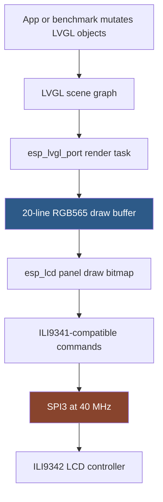
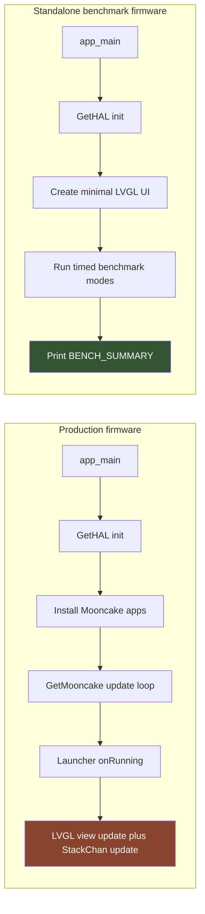

# M5StackChan: Measuring Draw Performance and Display Pipeline Limits

This article records the current state of the M5StackChan draw-performance investigation. The immediate question was simple: the launcher animation feels choppy, so what is the real performance limit? The answer is not a single number yet. The current evidence separates three different quantities that are easy to confuse: the cost of mutating LVGL objects, the cost of flushing pixels to the LCD, and the scheduling cost of running those updates inside the production firmware loop.

The investigation produced a working standalone benchmark firmware and a first set of serial measurements on real hardware. It also exposed three benchmark-design mistakes that are useful lessons in their own right: an overly aggressive loop can starve the system and trip the interrupt watchdog, `lv_label_set_text()` can introduce allocator churn in a hot path, and large C++ metric buffers can overflow the ESP-IDF `main` task stack. Those failures shaped the measurement method as much as the final numbers did.

> [!summary]
> - The display is a 320×240 RGB565 LCD driven as an ILI9341-compatible ILI9342 panel over 40 MHz SPI, through ESP-IDF `esp_lcd` and `esp_lvgl_port`.
> - A raw full-screen frame is 153,600 bytes, so the 40 MHz SPI bus gives a theoretical full-screen transfer ceiling of about 32.5 FPS before command overhead, DMA overhead, render time, and scheduling jitter.
> - The first stable benchmark measured a small LVGL label/dot update, not a full-screen blit: LVGL lock hold time was about 0.8 ms, RGB refresh for all 12 LEDs cost about 6–7 ms, and `target_60_fps` reached about 49 loop Hz under the current pacing logic.
> - The next measurement should be a dedicated full-screen RGB565 fill/blit benchmark that times render cost, flush submission cost, flush completion cadence, and warm versus cold asset paths separately.

## Why this note exists

A subjective complaint such as "the launcher is choppy" is a useful starting point, but it is not a diagnosis. Choppiness can come from at least four places in this firmware:

1. The main loop may not yield often enough for the LVGL render task to run predictably.
2. The launcher may hold the LVGL lock while doing too much unrelated work.
3. LVGL may be asked to redraw more pixels than the SPI display bus can move in one frame interval.
4. Peripheral work, such as RGB LED refresh or asset lookup, may introduce latency spikes that appear as animation jitter.

The investigation therefore had to become a measurement problem. A good measurement design answers a narrower question than the user-facing symptom. Instead of asking "why does it feel choppy?", the benchmark asks: what is the cost of each operation, when measured outside the Mooncake launcher framework, on the same hardware and display stack?

The benchmark we have today is the first stable step in that direction. It is not the final full-screen FPS benchmark. It is a baseline that proves the standalone path works and gives first-order numbers for lock timing, small LVGL updates, RGB refresh, asset lookup, heap pressure, and loop pacing.

## The display path, from LVGL to the panel

The M5StackChan firmware does not draw directly to a framebuffer that the LCD scans continuously. It uses LVGL to maintain a scene graph of UI objects, then relies on Espressif's LVGL port and LCD driver stack to flush changed pixel regions to the display.

The path is:

```text
Application code
  → LVGL object mutation
  → esp_lvgl_port render task
  → ESP-IDF esp_lcd panel API
  → ILI9341-compatible panel driver
  → ILI9342 LCD controller
  → SPI3 bus at 40 MHz
```

The firmware source evidence is concentrated in two files:

- `/home/manuel/workspaces/2025-12-21/echo-base-documentation/M5StackChan/build/firmware/main/hal/board/stackchan.cc`
- `/home/manuel/workspaces/2025-12-21/echo-base-documentation/M5StackChan/build/firmware/main/hal/board/stackchan_display.cc`

The board configuration declares the display size:

```cpp
#define DISPLAY_WIDTH   320
#define DISPLAY_HEIGHT  240
#define DISPLAY_MIRROR_X false
#define DISPLAY_MIRROR_Y false
#define DISPLAY_SWAP_XY false
```

The board code initializes SPI and installs an ILI9341-compatible driver for the ILI9342 display:

```cpp
void InitializeSpi()
{
    spi_bus_config_t buscfg = {};
    buscfg.mosi_io_num      = GPIO_NUM_37;
    buscfg.miso_io_num      = GPIO_NUM_NC;
    buscfg.sclk_io_num      = GPIO_NUM_36;
    buscfg.max_transfer_sz  = DISPLAY_WIDTH * DISPLAY_HEIGHT * sizeof(uint16_t);
    ESP_ERROR_CHECK(spi_bus_initialize(SPI3_HOST, &buscfg, SPI_DMA_CH_AUTO));
}

void InitializeIli9342Display()
{
    esp_lcd_panel_io_spi_config_t io_config = {};
    io_config.cs_gpio_num       = GPIO_NUM_3;
    io_config.dc_gpio_num       = GPIO_NUM_35;
    io_config.spi_mode          = 2;
    io_config.pclk_hz           = 40 * 1000 * 1000;
    io_config.trans_queue_depth = 10;
    io_config.lcd_cmd_bits      = 8;
    io_config.lcd_param_bits    = 8;
    ESP_ERROR_CHECK(esp_lcd_new_panel_io_spi(SPI3_HOST, &io_config, &panel_io));

    esp_lcd_panel_dev_config_t panel_config = {};
    panel_config.rgb_ele_order  = LCD_RGB_ELEMENT_ORDER_BGR;
    panel_config.bits_per_pixel = 16;
    ESP_ERROR_CHECK(esp_lcd_new_panel_ili9341(panel_io, &panel_config, &panel));
}
```

The LVGL port is then configured with a 20-line RGB565 DMA buffer:

```cpp
lvgl_port_cfg_t port_cfg = ESP_LVGL_PORT_INIT_CONFIG();
port_cfg.task_priority = 3;
#if CONFIG_SOC_CPU_CORES_NUM > 1
    port_cfg.task_affinity = 1;
#endif
lvgl_port_init(&port_cfg);

const lvgl_port_display_cfg_t display_cfg = {
    .buffer_size   = static_cast<uint32_t>(width_ * 20),
    .double_buffer = false,
    .hres          = static_cast<uint32_t>(width_),
    .vres          = static_cast<uint32_t>(height_),
    .color_format  = LV_COLOR_FORMAT_RGB565,
    .flags = {
        .buff_dma     = 1,
        .buff_spiram  = 0,
        .swap_bytes   = 1,
        .full_refresh = 0,
        .direct_mode  = 0,
    },
};
```

There are several consequences packed into those few lines.

First, the display is SPI, not RGB parallel, not MIPI DSI, and not I2C. Pixel data is sent as command-addressed regions over a serial bus. That makes the bus bandwidth a hard upper bound for full-screen animation.

Second, the panel is treated as an ILI9341-compatible device even though the board log and naming call it ILI9342. This is common for small TFT controllers with compatible command sets. For performance analysis, the important fact is not the exact controller suffix but the protocol: 8-bit LCD commands and parameters plus RGB565 pixel payload over SPI.

Third, LVGL does not allocate a full 320×240 draw buffer. It uses a buffer of `width * 20` pixels, which is 6,400 pixels or 12,800 bytes at RGB565. A full-screen redraw therefore has to be broken into roughly twelve 20-line flush chunks. That chunking matters because each chunk has command/setup overhead and must pass through the LCD driver's transaction queue.



## The first performance bound: pixels per second

A full-screen frame contains:

```text
320 × 240 = 76,800 pixels
```

The display uses RGB565, so each pixel is 16 bits, or 2 bytes:

```text
76,800 pixels × 2 bytes/pixel = 153,600 bytes/frame
```

The configured SPI pixel clock is 40 MHz:

```text
40,000,000 bits/s ÷ 8 = 5,000,000 bytes/s
```

If every SPI byte were pixel payload and there were no gaps, command overhead, transaction overhead, or CPU render cost, the absolute transfer ceiling would be:

```text
5,000,000 bytes/s ÷ 153,600 bytes/frame ≈ 32.55 frames/s
```

That number is the bus-limited ceiling for full-screen RGB565 updates. It is not a promise that the firmware can animate the full screen at 32 FPS. It is the first ceiling. Every real cost subtracts from it:

- LCD address-window commands must be sent for each flushed region.
- DMA transactions are queued and completed asynchronously.
- LVGL must render changed objects into the draw buffer before flushing.
- The display buffer is only 20 lines high, so a full screen is multiple chunks.
- The LVGL port task has priority and scheduling constraints.
- Other firmware tasks run concurrently: touch, servo feedback, IO expander, Wi-Fi/BLE, audio, logging, and the application loop.

A reasonable current expectation is therefore:

```text
Full-screen theoretical ceiling: about 32 FPS
Practical full-screen target: about 20–30 FPS until measured directly
Small partial updates: can be much faster than full-screen updates
```

The last line matters. A UI that moves a small dot or updates a label does not necessarily flush the full 153,600 bytes. LVGL is designed around invalidated regions. If the invalidated area is small, the display bus is not the bottleneck. If an animation invalidates the entire screen, the bus becomes central.

## Draw time is not one measurement

The phrase "draw performance" hides several separate timings. A useful benchmark should keep them separate because they imply different fixes.

| Quantity | What it measures | If it is high, the likely fix is |
|---|---|---|
| LVGL lock wait | Time spent waiting to enter LVGL from the main task | Reduce contention, change scheduling, avoid long render-task ownership |
| LVGL lock hold | Time the application holds the LVGL mutex while mutating objects | Move non-LVGL work outside the lock, reduce object churn |
| LVGL render cost | Time LVGL spends rasterizing invalidated objects into the draw buffer | Simplify widgets, reduce invalidated area, cache images |
| Flush submit cost | Time to queue the draw buffer to `esp_lcd` | Tune transaction sizes and queueing |
| Flush completion time | Time until pixel transfer is actually done | Bus bandwidth, DMA, chunking, display driver overhead |
| Frame cadence | Time between visible completed frames | Scheduling, tick granularity, render and flush interaction |
| Peripheral latency | RGB LED refresh, SPIFFS/assets lookup, servo update, etc. | Decouple from animation loop or run less often |

The first stable benchmark measured only some of these. It measured LVGL lock wait and hold for a small object update, RGB refresh, asset lookup, loop count, and heap pressure. It did not measure full-screen render or flush completion. That is why we can estimate the full-screen ceiling from the SPI bus but cannot yet claim a measured full-screen maximum FPS.

## Why a standalone benchmark was necessary

The production firmware enters the Mooncake app framework in `main/main.cpp`. The loop calls `GetHAL().feedTheDog()`, updates heap logging, and then calls `GetMooncake().update()`. The launcher app itself acquires an LVGL lock and runs several operations inside that lock scope.

The benchmark ticket identified the launcher hot path as:

```cpp
void AppLauncher::onLauncherRunning()
{
    LvglLockGuard lock;

    if (_startup_worker) {
        _startup_worker->update();
        ...
    } else {
        _view->update();
        screensaver_update();
    }

    GetStackChan().update();
}
```

The important detail is that `GetStackChan().update()` is called before the lock guard goes out of scope. That update path can include avatar updates, motion updates, and neon-light animation updates. It may be correct, but it makes diagnosis harder: if the launcher stutters, is the cost in the launcher view, the avatar, the neon-light update, the lock itself, or the display flush?

A Mooncake app benchmark would still run inside this framework. It would be useful later, but it would not establish the hardware/HAL ceiling. The standalone benchmark instead replaces the production entry point with a Kconfig-selected `bench/benchmark_main.cpp`. It still calls `GetHAL().init()`, so it uses the real board initialization, LVGL port, display driver, RGB LED path, and assets partition. It removes Mooncake app scheduling from the hot path.



## The benchmark implementation

The benchmark lives at:

```text
/home/manuel/workspaces/2025-12-21/echo-base-documentation/M5StackChan/build/firmware/main/bench/benchmark_main.cpp
```

It is selected by:

```text
CONFIG_STACKCHAN_STANDALONE_BENCHMARK=y
```

in:

```text
/home/manuel/workspaces/2025-12-21/echo-base-documentation/M5StackChan/build/firmware/sdkconfig.defaults.local
```

The benchmark records four metric families:

```cpp
struct BenchMetrics {
    MetricRecorder lvgl_lock_wait;
    MetricRecorder lvgl_lock_hold;
    MetricRecorder rgb_refresh;
    MetricRecorder asset_lookup;
};
```

It runs four modes for ten seconds each:

```cpp
enum class BenchMode {
    YieldOnly,
    Delay1Tick,
    Target60Fps,
    Target30Fps,
};
```

Each mode periodically does three kinds of work:

1. Every 100 ms, update a small LVGL UI: mode label, stats label, and a moving dot.
2. Every 200 ms, refresh all 12 RGB LEDs through the HAL.
3. Every 1000 ms, look up an asset with `assets::get_image("icon_setup.bin")`.

The LVGL update is measured as two intervals:

```cpp
uint64_t t0 = now_us();
GetHAL().lvglLock();
uint64_t t1 = now_us();

// mutate LVGL objects

uint64_t t2 = now_us();
GetHAL().lvglUnlock();

metrics.lvgl_lock_wait.record(t1 - t0);
metrics.lvgl_lock_hold.record(t2 - t1);
```

This split is essential. Waiting for the lock and holding the lock are different problems. If wait time is high, another task owns LVGL. If hold time is high, the application is blocking LVGL for too long. The production launcher should eventually be instrumented with the same distinction.

## The failures that shaped the benchmark

The final benchmark looks straightforward, but it got there by failing three times. Each failure removed a measurement anti-pattern.

### Failure 1: the benchmark starved the system

The first version included a busy mode and updated LVGL too aggressively. It booted, printed `BENCH_START`, and then reset with an interrupt watchdog timeout:

```text
Guru Meditation Error: Core  0 panic'ed (Interrupt wdt timeout on CPU0).
```

The backtrace showed the benchmark in `run_mode()` while the other core was in LVGL drawing code. The fix was not to tune a number; the fix was to change the benchmark's attitude. A benchmark that measures scheduling must not begin by destroying scheduling. The first stable sequence should use paced modes, throttle LVGL mutation, and add aggressive modes only after the stable baseline exists.

### Failure 2: label text updates caused allocator churn

After throttling LVGL updates, the benchmark crashed in `lv_label_set_text()`:

```text
assert failed: heap_caps_free heap_caps_base.c:80
(heap != NULL && "free() target pointer is outside heap areas")
```

The call path went through LVGL label internals:

```text
lv_free_core
lv_free
set_text_internal
lv_label_set_text
run_mode(BenchMode)
```

The benchmark was repeatedly assigning dynamically copied text to labels in the hot path. The fix was to use persistent buffers and `lv_label_set_text_static()`:

```cpp
static char g_mode_text[64] = "mode: booting";
static char g_stats_text[256] = "waiting for measurements...";

std::snprintf(g_mode_text, sizeof(g_mode_text), "mode: %s", mode);
lv_label_set_text_static(g_mode, g_mode_text);
```

This does not prove that every use of `lv_label_set_text()` is unsafe. It proves that the benchmark should not use dynamic text allocation as part of the measurement hot path. The measurement should observe the firmware, not create avoidable heap churn.

### Failure 3: metric storage overflowed the main task stack

The static-label version still rebooted. The new error was:

```text
***ERROR*** A stack overflow in task main has been detected.
```

The cause was a normal-looking C++ object:

```cpp
BenchMetrics metrics;
```

`BenchMetrics` contained four `MetricRecorder` objects. Each recorder contained `std::array<uint32_t, 2048>`. Four arrays of 2048 32-bit values is about 32 KiB before other members and call frames. On a desktop this is unremarkable. On the ESP-IDF `main` task stack it is fatal.

The fix was:

```cpp
static constexpr size_t SAMPLE_CAP = 512;
static BenchMetrics g_metrics;
```

and the percentile calculation was changed to sort the sample buffer in place instead of copying it onto the stack:

```cpp
MetricSummary summarize()
{
    ...
    std::sort(_samples.begin(), _samples.begin() + _stored);
    size_t index = (_stored * 95) / 100;
    out.p95_us = _samples[index];
    return out;
}
```

This is one of the most important lessons from the exercise. Embedded benchmark code is firmware. Its storage choices, allocator choices, and scheduling behavior are part of the system under test.

## First stable benchmark results

The stack-safe benchmark built and flashed successfully:

```text
stack-chan.bin binary size 0x2f1f40 bytes.
Smallest app partition is 0x4f0000 bytes.
0x1fe0c0 bytes (40%) free.
```

The successful monitor log is:

```text
/tmp/stackchan-bench-monitor4.log
```

The four `BENCH_SUMMARY` lines were:

```text
BENCH_SUMMARY mode=delay_1_tick duration_ms=10009 loop_count=974 loop_hz=97 heap_internal_free=209727 heap_internal_min=209015 psram_free=8059436 lvgl_wait_count=100 lvgl_wait_min_us=27 lvgl_wait_avg_us=1917 lvgl_wait_p95_us=17729 lvgl_wait_max_us=29682 lvgl_hold_count=100 lvgl_hold_min_us=753 lvgl_hold_avg_us=814 lvgl_hold_p95_us=827 lvgl_hold_max_us=1097 rgb_count=51 rgb_min_us=6170 rgb_avg_us=6912 rgb_p95_us=6749 rgb_max_us=15988 asset_count=11 asset_min_us=50 asset_avg_us=12660 asset_p95_us=138756 asset_max_us=138756
BENCH_SUMMARY mode=target_60_fps duration_ms=10009 loop_count=495 loop_hz=49 heap_internal_free=209515 heap_internal_min=209015 psram_free=8059436 lvgl_wait_count=100 lvgl_wait_min_us=25 lvgl_wait_avg_us=30 lvgl_wait_p95_us=33 lvgl_wait_max_us=42 lvgl_hold_count=100 lvgl_hold_min_us=755 lvgl_hold_avg_us=810 lvgl_hold_p95_us=830 lvgl_hold_max_us=945 rgb_count=50 rgb_min_us=6096 rgb_avg_us=6460 rgb_p95_us=6513 rgb_max_us=6530 asset_count=10 asset_min_us=53 asset_avg_us=58 asset_p95_us=82 asset_max_us=82
BENCH_SUMMARY mode=target_30_fps duration_ms=10029 loop_count=251 loop_hz=25 heap_internal_free=209727 heap_internal_min=209015 psram_free=8059436 lvgl_wait_count=84 lvgl_wait_min_us=25 lvgl_wait_avg_us=279 lvgl_wait_p95_us=31 lvgl_wait_max_us=7114 lvgl_hold_count=84 lvgl_hold_min_us=767 lvgl_hold_avg_us=805 lvgl_hold_p95_us=831 lvgl_hold_max_us=884 rgb_count=50 rgb_min_us=6048 rgb_avg_us=6162 rgb_p95_us=6525 rgb_max_us=6525 asset_count=10 asset_min_us=53 asset_avg_us=62 asset_p95_us=66 asset_max_us=66
BENCH_SUMMARY mode=yield duration_ms=10025 loop_count=1304294 loop_hz=130104 heap_internal_free=209727 heap_internal_min=209015 psram_free=8059436 lvgl_wait_count=101 lvgl_wait_min_us=26 lvgl_wait_avg_us=28 lvgl_wait_p95_us=30 lvgl_wait_max_us=34 lvgl_hold_count=101 lvgl_hold_min_us=749 lvgl_hold_avg_us=813 lvgl_hold_p95_us=834 lvgl_hold_max_us=839 rgb_count=51 rgb_min_us=6092 rgb_avg_us=6429 rgb_p95_us=6492 rgb_max_us=6495 asset_count=11 asset_min_us=52 asset_avg_us=56 asset_p95_us=103 asset_max_us=103
```

The results are easier to read as a table:

| Mode | Loop Hz | LVGL wait avg / p95 | LVGL hold avg / p95 | RGB avg / p95 | Asset avg / p95 |
|---|---:|---:|---:|---:|---:|
| `delay_1_tick` | 97 | 1917 / 17729 µs | 814 / 827 µs | 6912 / 6749 µs | 12660 / 138756 µs |
| `target_60_fps` | 49 | 30 / 33 µs | 810 / 830 µs | 6460 / 6513 µs | 58 / 82 µs |
| `target_30_fps` | 25 | 279 / 31 µs | 805 / 831 µs | 6162 / 6525 µs | 62 / 66 µs |
| `yield` | 130104 | 28 / 30 µs | 813 / 834 µs | 6429 / 6492 µs | 56 / 103 µs |

The `delay_1_tick` row contains two obvious outliers: LVGL wait p95 and first asset lookup. The asset system printed first-use initialization logs during that mode, including asset storage and checksum work. That row should therefore be read as cold-start behavior, not steady-state asset lookup. The warm modes show asset lookup in tens of microseconds.

The stable result for the small UI update is the LVGL lock hold time: about 0.8 ms. That is the time spent inside the benchmark's LVGL lock while updating two labels and a small dot. It is not a full-screen render time, and it is not flush completion time.

The RGB result is also important. Refreshing all 12 RGB LEDs through the direct HAL path costs about 6–7 ms. That is large enough to matter if done inside an animation-critical loop, especially if combined with display work. It should remain outside LVGL lock timing and should probably run at a controlled cadence.

## What these numbers do and do not prove

The first benchmark proves that a standalone HAL/LVGL path can run stably and produce measurements. It also proves that the simple LVGL update itself is not obviously expensive: mutating a couple of labels and moving a small object holds the LVGL lock for around 0.8 ms.

It does not prove that full-screen animation can reach 49 FPS. The `target_60_fps` loop reported 49 Hz because of the benchmark's pacing and periodic workload. The screen was not being fully redrawn every loop. A full-screen RGB565 animation is bounded by the 40 MHz SPI bus and is likely closer to 20–30 FPS in practice.

A precise statement is:

> The current measured benchmark shows that small LVGL object updates are cheap relative to a 16.7 ms frame budget, but it has not yet measured full-screen render-and-flush throughput. The bus-level maximum for full-screen RGB565 transfer is about 32.5 FPS, so any measured full-screen result above that would indicate that the screen is not actually flushing every pixel each frame.

This distinction matters because embedded UIs often get smoothness by reducing invalidated area. A launcher that scrolls icons or animates small elements may stay under the bus limit if only small regions change. A full-screen transition, camera preview, or large avatar redraw may hit the bus limit quickly.

## The display protocol answer

The display-control protocol is ILI9341/ILI9342-style SPI. More precisely:

| Layer | Detail |
|---|---|
| Panel class | ILI9342 LCD initialized through the ESP-IDF ILI9341-compatible driver |
| ESP-IDF API | `esp_lcd_new_panel_io_spi()` and `esp_lcd_new_panel_ili9341()` |
| Bus | SPI3 host |
| Clock | 40 MHz |
| SPI mode | 2 |
| MOSI | GPIO37 |
| SCLK | GPIO36 |
| CS | GPIO3 |
| DC | GPIO35 |
| MISO | not used |
| Command bits | 8 |
| Parameter bits | 8 |
| Pixel format | RGB565, BGR element order, byte-swapped by LVGL port config |
| Resolution | 320×240 |
| LVGL flush buffer | 320×20 pixels, DMA-capable internal memory |

The panel is not controlled over I2C. I2C is heavily used elsewhere on the board for PMU, RTC, IMU, touch, audio codec, and I/O expanders, but the LCD pixel stream is SPI. The touch controller is separate from the display pixel path.

## A better next benchmark: full-screen draw and flush

The next benchmark should measure full-screen animation directly. It should not replace the current benchmark; it should add a mode that answers a narrower question: how many full-screen RGB565 frames per second can this stack push, and where is the time spent?

A good full-screen benchmark needs four phases.

### Phase 1: raw panel fill outside LVGL

This phase should allocate one RGB565 frame buffer or one chunk buffer and call `esp_lcd_panel_draw_bitmap()` directly. It measures the LCD driver and SPI bus without LVGL scene-graph cost.

Pseudocode:

```cpp
static uint16_t* frame = allocate_dma_or_internal_buffer(320 * 240);

for each frame_index in duration:
    fill frame with color pattern
    t0 = esp_timer_get_time()
    esp_lcd_panel_draw_bitmap(panel, 0, 0, 320, 240, frame)
    t1 = esp_timer_get_time()
    record submit_or_blocking_time(t1 - t0)
```

If `draw_bitmap()` returns before DMA completion, this phase also needs a completion callback or synchronization point. Without completion timing, the benchmark only measures submission cost.

### Phase 2: LVGL full-screen invalidation

This phase should create a full-screen LVGL object or canvas and invalidate it every frame. It measures LVGL render plus flush behavior through the actual port.

Pseudocode:

```cpp
create full_screen_obj

for each frame:
    GetHAL().lvglLock()
    update full_screen_obj color or image source
    lv_obj_invalidate(full_screen_obj)
    GetHAL().lvglUnlock()
    wait for target cadence or flush completion signal
```

The challenge is flush completion. LVGL object mutation time is not enough. The benchmark should either instrument the LVGL display flush callback in `esp_lvgl_port` or add a frame counter that increments when flush completion occurs.

### Phase 3: partial invalidation sweep

Full-screen FPS is not the only useful number. The UI usually changes smaller regions. A partial-invalidation sweep should measure rectangles such as:

| Region | Pixels | Payload bytes | Theoretical SPI-only max |
|---|---:|---:|---:|
| 32×32 | 1,024 | 2,048 | ~2441 FPS |
| 64×64 | 4,096 | 8,192 | ~610 FPS |
| 160×120 | 19,200 | 38,400 | ~130 FPS |
| 320×120 | 38,400 | 76,800 | ~65 FPS |
| 320×240 | 76,800 | 153,600 | ~32.5 FPS |

These theoretical maxima ignore overhead, but the ratios teach the right lesson: invalidated area dominates once rendering is cheap. A smooth launcher should minimize the number of pixels it invalidates per frame.

### Phase 4: production launcher instrumentation

After the standalone benchmark has full-screen and partial-screen numbers, instrument the production launcher:

```cpp
void AppLauncher::onLauncherRunning()
{
    uint64_t t0 = esp_timer_get_time();
    LvglLockGuard lock;
    uint64_t t1 = esp_timer_get_time();

    _view->update();
    uint64_t t2 = esp_timer_get_time();

    screensaver_update();
    uint64_t t3 = esp_timer_get_time();

    GetStackChan().update();
    uint64_t t4 = esp_timer_get_time();

    record("launcher_lock_wait", t1 - t0);
    record("launcher_view", t2 - t1);
    record("screensaver", t3 - t2);
    record("stackchan_update", t4 - t3);
    record("launcher_lock_hold", t4 - t1);
}
```

The production measurements will answer whether the launcher is slower than the standalone ceiling because it is doing too much inside the lock, invalidating too much screen area, or getting preempted by other subsystem work.

## Working rules from this investigation

The investigation produced several practical rules that should guide the next round of firmware performance work.

- Do not treat loop Hz as FPS. A loop can run 130,000 times per second while the display updates at 30 FPS or less. FPS requires frame completion evidence.
- Do not treat LVGL object mutation time as display flush time. Updating an object may be cheap while flushing the invalidated pixels is expensive.
- Do not put peripheral work inside the LVGL lock unless the peripheral work directly mutates LVGL objects. RGB LED refresh belongs outside display critical sections.
- Do not allocate or free label text in a benchmark hot path. Use persistent buffers and `lv_label_set_text_static()` when the text changes frequently.
- Do not allocate large metric reservoirs on the ESP-IDF `main` task stack. Use static storage, explicit heap allocation, or a dedicated task with a known stack size.
- Do not trust the first asset timing sample. Separate cold-start initialization from warm-cache lookup.
- Do not begin with a stress test. First make a stable measurement harness; then add stress modes one at a time.

## Current status

The current point of investigation is a stable Phase 1 benchmark, not a complete display-profiler suite.

Completed:

- Kconfig-selectable standalone benchmark entry point.
- CMake switch between production `main.cpp` and benchmark `bench/benchmark_main.cpp`.
- Real hardware build and flash.
- Stable four-mode serial summary output.
- Measurement of LVGL lock wait/hold for small updates.
- Measurement of direct RGB refresh cost.
- Measurement of cold/warm asset lookup behavior.
- Documentation in docmgr and reMarkable.

Not yet completed:

- Direct full-screen RGB565 FPS measurement.
- LVGL flush-completion instrumentation.
- Partial invalidation sweep.
- Production launcher instrumentation.
- Mooncake app benchmark for framework overhead comparison.

The best current answer to "what is the max FPS for full-screen animations?" is therefore an estimate, not a measurement:

```text
Theoretical SPI payload ceiling: ~32.5 FPS for 320×240 RGB565
Practical expected ceiling: likely 20–30 FPS
Measured so far: small LVGL updates only, not full-screen animation
```

## Source map

The most important local sources for this investigation are:

| Path | Why it matters |
|---|---|
| `/home/manuel/workspaces/2025-12-21/echo-base-documentation/M5StackChan/build/firmware/main/bench/benchmark_main.cpp` | Current standalone benchmark implementation and first stable measurement source |
| `/home/manuel/workspaces/2025-12-21/echo-base-documentation/M5StackChan/build/firmware/main/hal/board/stackchan.cc` | SPI display bus, ILI9342/ILI9341 driver setup, GPIOs, pixel clock |
| `/home/manuel/workspaces/2025-12-21/echo-base-documentation/M5StackChan/build/firmware/main/hal/board/stackchan_display.cc` | LVGL port task, display buffer, RGB565 format, lock/unlock path |
| `/home/manuel/workspaces/2025-12-21/echo-base-documentation/M5StackChan/build/firmware/main/hal/board/config.h` | 320×240 display dimensions and orientation config |
| `/home/manuel/workspaces/2025-12-21/echo-base-documentation/M5StackChan/build/firmware/main/apps/app_launcher/app_launcher.cpp` | Production launcher hot path and LVGL lock scope |
| `/home/manuel/workspaces/2025-12-21/echo-base-documentation/M5StackChan/build/firmware/main/stackchan/stackchan.h` | `GetStackChan().update()` behavior called from launcher |
| `/home/manuel/workspaces/2025-12-21/echo-base-documentation/esp32-s3-m5/ttmp/2026/06/11/M5STACKCHAN-BENCH--standalone-cores3-benchmark-harness-for-stackchan-firmware-performance/reference/01-investigation-diary.md` | Chronological benchmark implementation diary and failure record |
| `/tmp/stackchan-bench-monitor4.log` | First successful serial benchmark output |

## Near-term next steps

The next engineering step should be a full-screen benchmark mode. It should be narrow and explicit: one mode for raw `esp_lcd_panel_draw_bitmap()`, one mode for LVGL full-screen invalidation, and one mode for partial invalidation rectangles. The output should include both serial summaries and raw per-frame CSV/NDJSON records so the results can be plotted later.

After that, instrument the production launcher with the same timing vocabulary: lock wait, view update, screensaver update, `StackChan::update()`, lock hold, and frame completion cadence. Only then should we decide whether to optimize scheduling, redraw area, LVGL task priority, lock scope, asset caching, or the launcher animation itself.

The important discipline is to keep each number attached to the operation it actually measures. On this device, "FPS" is not a single property of the screen. It is the result of how many pixels changed, how expensive they were to render, how quickly the SPI bus moved them, and whether the rest of the firmware gave the render task enough time to run.
