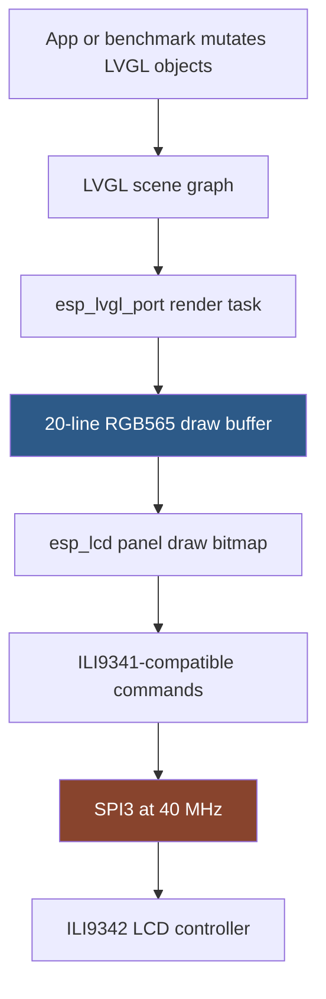
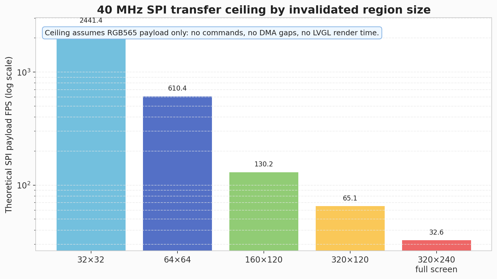
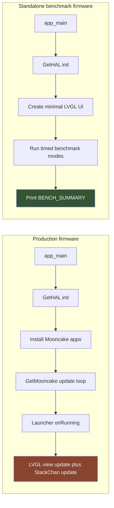
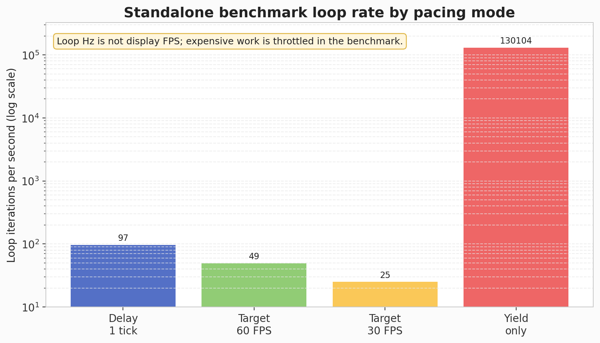
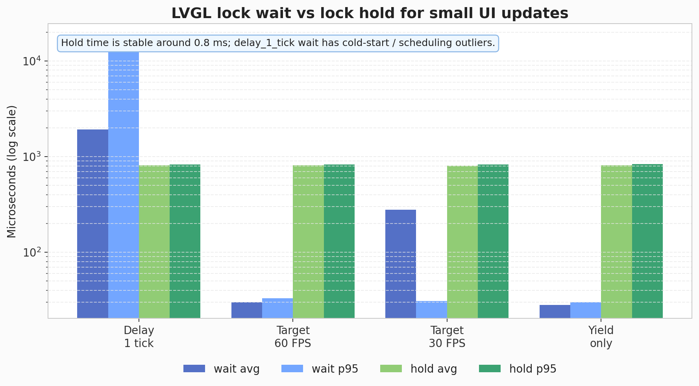
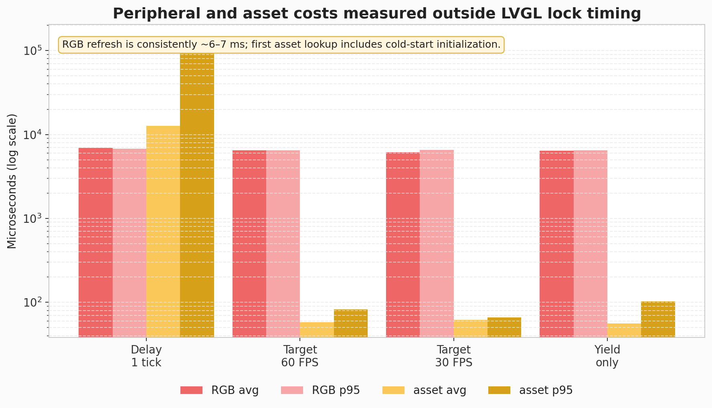

# M5StackChan: Measuring Draw Performance and Display Pipeline Limits

This article records the current state of the M5StackChan draw-performance investigation. The immediate question was simple: the launcher animation feels choppy, so what is the real performance limit? The answer is not a single number yet. The current evidence separates three different quantities that are easy to confuse: the cost of mutating LVGL objects, the cost of flushing pixels to the LCD, and the scheduling cost of running those updates inside the production firmware loop.

The investigation produced two benchmark firmwares and multiple serial measurement runs on real hardware. The first benchmark measured small LVGL object updates, RGB LED refresh cost, asset lookup, and LVGL lock timing. The second benchmark bypassed LVGL scene rendering and measured raw `esp_lcd_panel_draw_bitmap()` throughput for full-screen and partial-region RGB565 blits at 40 MHz, 60 MHz, and 80 MHz requested SPI clocks.

The work also exposed several benchmark-design mistakes that are useful lessons in their own right: an overly aggressive loop can starve the system and trip the interrupt watchdog, `lv_label_set_text()` can introduce allocator churn in a hot path, large C++ metric buffers can overflow the ESP-IDF `main` task stack, and raw RGB565 buffers must match LVGL's byte-swap behavior before visual results are trustworthy. Those failures shaped the measurement method as much as the final numbers did.

> [!summary]
> - The display is a 320×240 RGB565 LCD driven as an ILI9341-compatible ILI9342 panel over SPI, through ESP-IDF `esp_lcd` and `esp_lvgl_port`.
> - At the factory 40 MHz SPI setting, the best measured raw full-screen generated-pattern blit is 25.00 FPS using 120-line chunks; 20-line chunks, matching the current LVGL draw-buffer height, are much slower for full-screen updates.
> - At an 80 MHz requested LCD SPI clock, the best measured raw full-screen generated-pattern blit is 36.42 FPS using 120-line chunks; the user visually confirmed the byte-swapped diagnostic colors look better and full-screen RGB screens are visible.
> - Raw transfer completion is not VSYNC. True tear-free sync would require a wired LCD TE/tearing-effect signal; without that, the next practical step is software-paced moving-bar tests and production launcher instrumentation.

## Why this note exists

A subjective complaint such as "the launcher is choppy" is a useful starting point, but it is not a diagnosis. Choppiness can come from at least four places in this firmware:

1. The main loop may not yield often enough for the LVGL render task to run predictably.
2. The launcher may hold the LVGL lock while doing too much unrelated work.
3. LVGL may be asked to redraw more pixels than the SPI display bus can move in one frame interval.
4. Peripheral work, such as RGB LED refresh or asset lookup, may introduce latency spikes that appear as animation jitter.

The investigation therefore had to become a measurement problem. A good measurement design answers a narrower question than the user-facing symptom. Instead of asking "why does it feel choppy?", the benchmark asks: what is the cost of each operation, when measured outside the Mooncake launcher framework, on the same hardware and display stack?

The benchmark we have today is the first stable step in that direction. It is not the final full-screen FPS benchmark. It is a baseline that proves the standalone path works and gives first-order numbers for lock timing, small LVGL updates, RGB refresh, asset lookup, heap pressure, and loop pacing.

## The display path, from LVGL to the panel

The M5StackChan firmware does not draw directly to a framebuffer that the LCD scans continuously. It uses LVGL to maintain a scene graph of UI objects, then relies on Espressif's LVGL port and LCD driver stack to flush changed pixel regions to the display.

The path is:

```text
Application code
  → LVGL object mutation
  → esp_lvgl_port render task
  → ESP-IDF esp_lcd panel API
  → ILI9341-compatible panel driver
  → ILI9342 LCD controller
  → SPI3 bus at 40 MHz
```

The firmware source evidence is concentrated in two files:

- `/home/manuel/workspaces/2025-12-21/echo-base-documentation/M5StackChan/build/firmware/main/hal/board/stackchan.cc`
- `/home/manuel/workspaces/2025-12-21/echo-base-documentation/M5StackChan/build/firmware/main/hal/board/stackchan_display.cc`

The board configuration declares the display size:

```cpp
#define DISPLAY_WIDTH   320
#define DISPLAY_HEIGHT  240
#define DISPLAY_MIRROR_X false
#define DISPLAY_MIRROR_Y false
#define DISPLAY_SWAP_XY false
```

The board code initializes SPI and installs an ILI9341-compatible driver for the ILI9342 display:

```cpp
void InitializeSpi()
{
    spi_bus_config_t buscfg = {};
    buscfg.mosi_io_num      = GPIO_NUM_37;
    buscfg.miso_io_num      = GPIO_NUM_NC;
    buscfg.sclk_io_num      = GPIO_NUM_36;
    buscfg.max_transfer_sz  = DISPLAY_WIDTH * DISPLAY_HEIGHT * sizeof(uint16_t);
    ESP_ERROR_CHECK(spi_bus_initialize(SPI3_HOST, &buscfg, SPI_DMA_CH_AUTO));
}

void InitializeIli9342Display()
{
    esp_lcd_panel_io_spi_config_t io_config = {};
    io_config.cs_gpio_num       = GPIO_NUM_3;
    io_config.dc_gpio_num       = GPIO_NUM_35;
    io_config.spi_mode          = 2;
    io_config.pclk_hz           = CONFIG_STACKCHAN_LCD_PIXEL_CLOCK_HZ;
    io_config.trans_queue_depth = 10;
    io_config.lcd_cmd_bits      = 8;
    io_config.lcd_param_bits    = 8;
    ESP_ERROR_CHECK(esp_lcd_new_panel_io_spi(SPI3_HOST, &io_config, &panel_io));

    esp_lcd_panel_dev_config_t panel_config = {};
    panel_config.rgb_ele_order  = LCD_RGB_ELEMENT_ORDER_BGR;
    panel_config.bits_per_pixel = 16;
    ESP_ERROR_CHECK(esp_lcd_new_panel_ili9341(panel_io, &panel_config, &panel));
}
```

The LVGL port is then configured with a 20-line RGB565 DMA buffer:

```cpp
lvgl_port_cfg_t port_cfg = ESP_LVGL_PORT_INIT_CONFIG();
port_cfg.task_priority = 3;
#if CONFIG_SOC_CPU_CORES_NUM > 1
    port_cfg.task_affinity = 1;
#endif
lvgl_port_init(&port_cfg);

const lvgl_port_display_cfg_t display_cfg = {
    .buffer_size   = static_cast<uint32_t>(width_ * 20),
    .double_buffer = false,
    .hres          = static_cast<uint32_t>(width_),
    .vres          = static_cast<uint32_t>(height_),
    .color_format  = LV_COLOR_FORMAT_RGB565,
    .flags = {
        .buff_dma     = 1,
        .buff_spiram  = 0,
        .swap_bytes   = 1,
        .full_refresh = 0,
        .direct_mode  = 0,
    },
};
```

There are several consequences packed into those few lines.

First, the display is SPI, not RGB parallel, not MIPI DSI, and not I2C. Pixel data is sent as command-addressed regions over a serial bus. That makes the bus bandwidth a hard upper bound for full-screen animation.

Second, the panel is treated as an ILI9341-compatible device even though the board log and naming call it ILI9342. This is common for small TFT controllers with compatible command sets. For performance analysis, the important fact is not the exact controller suffix but the protocol: 8-bit LCD commands and parameters plus RGB565 pixel payload over SPI.

Third, LVGL does not allocate a full 320×240 draw buffer. It uses a buffer of `width * 20` pixels, which is 6,400 pixels or 12,800 bytes at RGB565. A full-screen redraw therefore has to be broken into roughly twelve 20-line flush chunks. That chunking matters because each chunk has command/setup overhead and must pass through the LCD driver's transaction queue.



## The first performance bound: pixels per second

A full-screen frame contains:

```text
320 × 240 = 76,800 pixels
```

The display uses RGB565, so each pixel is 16 bits, or 2 bytes:

```text
76,800 pixels × 2 bytes/pixel = 153,600 bytes/frame
```

The configured SPI pixel clock is 40 MHz:

```text
40,000,000 bits/s ÷ 8 = 5,000,000 bytes/s
```

If every SPI byte were pixel payload and there were no gaps, command overhead, transaction overhead, or CPU render cost, the absolute transfer ceiling would be:

```text
5,000,000 bytes/s ÷ 153,600 bytes/frame ≈ 32.55 frames/s
```

That number is the bus-limited ceiling for full-screen RGB565 updates. It is not a promise that the firmware can animate the full screen at 32 FPS. It is the first ceiling. Every real cost subtracts from it:

- LCD address-window commands must be sent for each flushed region.
- DMA transactions are queued and completed asynchronously.
- LVGL must render changed objects into the draw buffer before flushing.
- The display buffer is only 20 lines high, so a full screen is multiple chunks.
- The LVGL port task has priority and scheduling constraints.
- Other firmware tasks run concurrently: touch, servo feedback, IO expander, Wi-Fi/BLE, audio, logging, and the application loop.

The first raw-blit benchmark changed that estimate into measured data. At the factory 40 MHz clock, the best full-screen generated-pattern result is 25.00 FPS with 120-line chunks. At an 80 MHz requested clock, the best measured full-screen generated-pattern result is 36.42 FPS with 120-line chunks. The last line still matters. A UI that moves a small dot or updates a label does not necessarily flush the full 153,600 bytes. LVGL is designed around invalidated regions. If the invalidated area is small, the display bus is not the bottleneck. If an animation invalidates the entire screen, the bus becomes central.



The chart uses only the 40 MHz SPI payload rate and RGB565 byte count. It intentionally ignores command overhead, render time, DMA gaps, and scheduling. Its purpose is to make the order-of-magnitude relationship visible: shrinking the invalidated region changes the achievable frame cadence much more than small code-level optimizations do.

## Draw time is not one measurement

The phrase "draw performance" hides several separate timings. A useful benchmark should keep them separate because they imply different fixes.

| Quantity | What it measures | If it is high, the likely fix is |
|---|---|---|
| LVGL lock wait | Time spent waiting to enter LVGL from the main task | Reduce contention, change scheduling, avoid long render-task ownership |
| LVGL lock hold | Time the application holds the LVGL mutex while mutating objects | Move non-LVGL work outside the lock, reduce object churn |
| LVGL render cost | Time LVGL spends rasterizing invalidated objects into the draw buffer | Simplify widgets, reduce invalidated area, cache images |
| Flush submit cost | Time to queue the draw buffer to `esp_lcd` | Tune transaction sizes and queueing |
| Flush completion time | Time until pixel transfer is actually done | Bus bandwidth, DMA, chunking, display driver overhead |
| Frame cadence | Time between visible completed frames | Scheduling, tick granularity, render and flush interaction |
| Peripheral latency | RGB LED refresh, SPIFFS/assets lookup, servo update, etc. | Decouple from animation loop or run less often |

The first stable benchmark measured only some of these. It measured LVGL lock wait and hold for a small object update, RGB refresh, asset lookup, loop count, and heap pressure. It did not measure full-screen render or flush completion. That is why we can estimate the full-screen ceiling from the SPI bus but cannot yet claim a measured full-screen maximum FPS.

## Why a standalone benchmark was necessary

The production firmware enters the Mooncake app framework in `main/main.cpp`. The loop calls `GetHAL().feedTheDog()`, updates heap logging, and then calls `GetMooncake().update()`. The launcher app itself acquires an LVGL lock and runs several operations inside that lock scope.

The benchmark ticket identified the launcher hot path as:

```cpp
void AppLauncher::onLauncherRunning()
{
    LvglLockGuard lock;

    if (_startup_worker) {
        _startup_worker->update();
        ...
    } else {
        _view->update();
        screensaver_update();
    }

    GetStackChan().update();
}
```

The important detail is that `GetStackChan().update()` is called before the lock guard goes out of scope. That update path can include avatar updates, motion updates, and neon-light animation updates. It may be correct, but it makes diagnosis harder: if the launcher stutters, is the cost in the launcher view, the avatar, the neon-light update, the lock itself, or the display flush?

A Mooncake app benchmark would still run inside this framework. It would be useful later, but it would not establish the hardware/HAL ceiling. The standalone benchmark instead replaces the production entry point with a Kconfig-selected `bench/benchmark_main.cpp`. It still calls `GetHAL().init()`, so it uses the real board initialization, LVGL port, display driver, RGB LED path, and assets partition. It removes Mooncake app scheduling from the hot path.



## The benchmark implementation

The benchmark lives at:

```text
/home/manuel/workspaces/2025-12-21/echo-base-documentation/M5StackChan/build/firmware/main/bench/benchmark_main.cpp
```

It is selected by:

```text
CONFIG_STACKCHAN_STANDALONE_BENCHMARK=y
```

in:

```text
/home/manuel/workspaces/2025-12-21/echo-base-documentation/M5StackChan/build/firmware/sdkconfig.defaults.local
```

The benchmark records four metric families:

```cpp
struct BenchMetrics {
    MetricRecorder lvgl_lock_wait;
    MetricRecorder lvgl_lock_hold;
    MetricRecorder rgb_refresh;
    MetricRecorder asset_lookup;
};
```

It runs four modes for ten seconds each:

```cpp
enum class BenchMode {
    YieldOnly,
    Delay1Tick,
    Target60Fps,
    Target30Fps,
};
```



The loop-rate chart is deliberately plotted on a logarithmic axis because `yield` mode spins much faster than the paced modes. This chart should not be read as display FPS. It shows how often the outer benchmark loop iterates while the expensive work is throttled.

Each mode periodically does three kinds of work:

1. Every 100 ms, update a small LVGL UI: mode label, stats label, and a moving dot.
2. Every 200 ms, refresh all 12 RGB LEDs through the HAL.
3. Every 1000 ms, look up an asset with `assets::get_image("icon_setup.bin")`.

The LVGL update is measured as two intervals:

```cpp
uint64_t t0 = now_us();
GetHAL().lvglLock();
uint64_t t1 = now_us();

// mutate LVGL objects

uint64_t t2 = now_us();
GetHAL().lvglUnlock();

metrics.lvgl_lock_wait.record(t1 - t0);
metrics.lvgl_lock_hold.record(t2 - t1);
```

This split is essential. Waiting for the lock and holding the lock are different problems. If wait time is high, another task owns LVGL. If hold time is high, the application is blocking LVGL for too long. The production launcher should eventually be instrumented with the same distinction.

## The failures that shaped the benchmark

The final benchmark looks straightforward, but it got there by failing three times. Each failure removed a measurement anti-pattern.

### Failure 1: the benchmark starved the system

The first version included a busy mode and updated LVGL too aggressively. It booted, printed `BENCH_START`, and then reset with an interrupt watchdog timeout:

```text
Guru Meditation Error: Core  0 panic'ed (Interrupt wdt timeout on CPU0).
```

The backtrace showed the benchmark in `run_mode()` while the other core was in LVGL drawing code. The fix was not to tune a number; the fix was to change the benchmark's attitude. A benchmark that measures scheduling must not begin by destroying scheduling. The first stable sequence should use paced modes, throttle LVGL mutation, and add aggressive modes only after the stable baseline exists.

### Failure 2: label text updates caused allocator churn

After throttling LVGL updates, the benchmark crashed in `lv_label_set_text()`:

```text
assert failed: heap_caps_free heap_caps_base.c:80
(heap != NULL && "free() target pointer is outside heap areas")
```

The call path went through LVGL label internals:

```text
lv_free_core
lv_free
set_text_internal
lv_label_set_text
run_mode(BenchMode)
```

The benchmark was repeatedly assigning dynamically copied text to labels in the hot path. The fix was to use persistent buffers and `lv_label_set_text_static()`:

```cpp
static char g_mode_text[64] = "mode: booting";
static char g_stats_text[256] = "waiting for measurements...";

std::snprintf(g_mode_text, sizeof(g_mode_text), "mode: %s", mode);
lv_label_set_text_static(g_mode, g_mode_text);
```

This does not prove that every use of `lv_label_set_text()` is unsafe. It proves that the benchmark should not use dynamic text allocation as part of the measurement hot path. The measurement should observe the firmware, not create avoidable heap churn.

### Failure 3: metric storage overflowed the main task stack

The static-label version still rebooted. The new error was:

```text
***ERROR*** A stack overflow in task main has been detected.
```

The cause was a normal-looking C++ object:

```cpp
BenchMetrics metrics;
```

`BenchMetrics` contained four `MetricRecorder` objects. Each recorder contained `std::array<uint32_t, 2048>`. Four arrays of 2048 32-bit values is about 32 KiB before other members and call frames. On a desktop this is unremarkable. On the ESP-IDF `main` task stack it is fatal.

The fix was:

```cpp
static constexpr size_t SAMPLE_CAP = 512;
static BenchMetrics g_metrics;
```

and the percentile calculation was changed to sort the sample buffer in place instead of copying it onto the stack:

```cpp
MetricSummary summarize()
{
    ...
    std::sort(_samples.begin(), _samples.begin() + _stored);
    size_t index = (_stored * 95) / 100;
    out.p95_us = _samples[index];
    return out;
}
```

This is one of the most important lessons from the exercise. Embedded benchmark code is firmware. Its storage choices, allocator choices, and scheduling behavior are part of the system under test.

## First stable benchmark results

The stack-safe benchmark built and flashed successfully:

```text
stack-chan.bin binary size 0x2f1f40 bytes.
Smallest app partition is 0x4f0000 bytes.
0x1fe0c0 bytes (40%) free.
```

The successful monitor log is:

```text
/tmp/stackchan-bench-monitor4.log
```

The four `BENCH_SUMMARY` lines were:

```text
BENCH_SUMMARY mode=delay_1_tick duration_ms=10009 loop_count=974 loop_hz=97 heap_internal_free=209727 heap_internal_min=209015 psram_free=8059436 lvgl_wait_count=100 lvgl_wait_min_us=27 lvgl_wait_avg_us=1917 lvgl_wait_p95_us=17729 lvgl_wait_max_us=29682 lvgl_hold_count=100 lvgl_hold_min_us=753 lvgl_hold_avg_us=814 lvgl_hold_p95_us=827 lvgl_hold_max_us=1097 rgb_count=51 rgb_min_us=6170 rgb_avg_us=6912 rgb_p95_us=6749 rgb_max_us=15988 asset_count=11 asset_min_us=50 asset_avg_us=12660 asset_p95_us=138756 asset_max_us=138756
BENCH_SUMMARY mode=target_60_fps duration_ms=10009 loop_count=495 loop_hz=49 heap_internal_free=209515 heap_internal_min=209015 psram_free=8059436 lvgl_wait_count=100 lvgl_wait_min_us=25 lvgl_wait_avg_us=30 lvgl_wait_p95_us=33 lvgl_wait_max_us=42 lvgl_hold_count=100 lvgl_hold_min_us=755 lvgl_hold_avg_us=810 lvgl_hold_p95_us=830 lvgl_hold_max_us=945 rgb_count=50 rgb_min_us=6096 rgb_avg_us=6460 rgb_p95_us=6513 rgb_max_us=6530 asset_count=10 asset_min_us=53 asset_avg_us=58 asset_p95_us=82 asset_max_us=82
BENCH_SUMMARY mode=target_30_fps duration_ms=10029 loop_count=251 loop_hz=25 heap_internal_free=209727 heap_internal_min=209015 psram_free=8059436 lvgl_wait_count=84 lvgl_wait_min_us=25 lvgl_wait_avg_us=279 lvgl_wait_p95_us=31 lvgl_wait_max_us=7114 lvgl_hold_count=84 lvgl_hold_min_us=767 lvgl_hold_avg_us=805 lvgl_hold_p95_us=831 lvgl_hold_max_us=884 rgb_count=50 rgb_min_us=6048 rgb_avg_us=6162 rgb_p95_us=6525 rgb_max_us=6525 asset_count=10 asset_min_us=53 asset_avg_us=62 asset_p95_us=66 asset_max_us=66
BENCH_SUMMARY mode=yield duration_ms=10025 loop_count=1304294 loop_hz=130104 heap_internal_free=209727 heap_internal_min=209015 psram_free=8059436 lvgl_wait_count=101 lvgl_wait_min_us=26 lvgl_wait_avg_us=28 lvgl_wait_p95_us=30 lvgl_wait_max_us=34 lvgl_hold_count=101 lvgl_hold_min_us=749 lvgl_hold_avg_us=813 lvgl_hold_p95_us=834 lvgl_hold_max_us=839 rgb_count=51 rgb_min_us=6092 rgb_avg_us=6429 rgb_p95_us=6492 rgb_max_us=6495 asset_count=11 asset_min_us=52 asset_avg_us=56 asset_p95_us=103 asset_max_us=103
```

The results are easier to read as a table:

| Mode | Loop Hz | LVGL wait avg / p95 | LVGL hold avg / p95 | RGB avg / p95 | Asset avg / p95 |
|---|---:|---:|---:|---:|---:|
| `delay_1_tick` | 97 | 1917 / 17729 µs | 814 / 827 µs | 6912 / 6749 µs | 12660 / 138756 µs |
| `target_60_fps` | 49 | 30 / 33 µs | 810 / 830 µs | 6460 / 6513 µs | 58 / 82 µs |
| `target_30_fps` | 25 | 279 / 31 µs | 805 / 831 µs | 6162 / 6525 µs | 62 / 66 µs |
| `yield` | 130104 | 28 / 30 µs | 813 / 834 µs | 6429 / 6492 µs | 56 / 103 µs |

The `delay_1_tick` row contains two obvious outliers: LVGL wait p95 and first asset lookup. The asset system printed first-use initialization logs during that mode, including asset storage and checksum work. That row should therefore be read as cold-start behavior, not steady-state asset lookup. The warm modes show asset lookup in tens of microseconds.

The stable result for the small UI update is the LVGL lock hold time: about 0.8 ms. That is the time spent inside the benchmark's LVGL lock while updating two labels and a small dot. It is not a full-screen render time, and it is not flush completion time.



The lock chart separates waiting from holding. That separation is the main point: a long wait means the benchmark could not enter LVGL because something else owned it; a long hold means the benchmark itself occupied the critical section. The hold time is stable around 0.8 ms, while the `delay_1_tick` wait path shows cold-start or scheduling outliers.

The RGB result is also important. Refreshing all 12 RGB LEDs through the direct HAL path costs about 6–7 ms. That is large enough to matter if done inside an animation-critical loop, especially if combined with display work. It should remain outside LVGL lock timing and should probably run at a controlled cadence.



The peripheral chart shows why RGB refresh and asset lookup should be accounted for separately from LVGL drawing. RGB refresh is consistently millisecond-scale. Asset lookup is normally tiny after warmup, but the first cold path includes initialization and checksum work that can dominate a frame budget.

## What the first LVGL benchmark did and did not prove

The first benchmark proves that a standalone HAL/LVGL path can run stably and produce measurements. It also proves that the simple LVGL update itself is not obviously expensive: mutating a couple of labels and moving a small object holds the LVGL lock for around 0.8 ms.

It does not prove that full-screen animation can reach 49 FPS. The `target_60_fps` loop reported 49 Hz because of the benchmark's pacing and periodic workload. The screen was not being fully redrawn every loop. That result belongs to the small-object LVGL benchmark, not the raw display-transfer benchmark.

A precise statement for the first benchmark is:

> Small LVGL object updates are cheap relative to a 16.7 ms frame budget, but that benchmark did not measure full-screen render-and-flush throughput.

The raw-blit benchmark below fills that gap. It measures raw `esp_lcd_panel_draw_bitmap()` transfer throughput directly, with LVGL scene rendering bypassed.

## Raw blit benchmark: full-screen and partial-region measurements

The raw-blit benchmark lives in:

```text
/home/manuel/workspaces/2025-12-21/echo-base-documentation/M5StackChan/build/firmware/main/bench/raw_blit_benchmark_main.cpp
```

It is selected with:

```text
CONFIG_STACKCHAN_RAW_BLIT_BENCHMARK=y
CONFIG_STACKCHAN_LCD_PIXEL_CLOCK_HZ=<40000000|60000000|80000000>
```

The benchmark reuses the real StackChan HAL and board initialization, then obtains the initialized raw `esp_lcd_panel_handle_t` and `esp_lcd_panel_io_handle_t` through narrow bridge accessors. It calls `esp_lcd_panel_draw_bitmap()` directly for full-screen and partial rectangles, bypassing LVGL object rendering. It also registers an `on_color_trans_done` callback so it can distinguish submit time from SPI/DMA transfer-completion time.

The relevant implementation changes are:

| File | Role |
|---|---|
| `main/Kconfig.projbuild` | Adds `CONFIG_STACKCHAN_RAW_BLIT_BENCHMARK` and `CONFIG_STACKCHAN_LCD_PIXEL_CLOCK_HZ`. |
| `main/CMakeLists.txt` | Selects `bench/raw_blit_benchmark_main.cpp` when the raw benchmark is enabled. |
| `main/hal/board/stackchan_display.h` | Exposes raw panel and panel-IO handles. |
| `main/hal/board/hal_bridge.h` / `.cc` | Adds benchmark bridge accessors for those handles. |
| `main/hal/board/stackchan.cc` | Uses `CONFIG_STACKCHAN_LCD_PIXEL_CLOCK_HZ` for LCD SPI `pclk_hz`. |
| `main/bench/raw_blit_benchmark_main.cpp` | Implements visual diagnostics and timed raw blit cases. |

### Why byte order mattered

The first raw benchmark produced correct rectangle geometry but suspicious rainbow diagonal colors. The user provided a blurry webcam photo showing the structure clearly enough to diagnose the issue. The raw benchmark was writing host-endian `uint16_t` RGB565 values directly into the transmit buffer, but the production LVGL path uses:

```cpp
.flags = {
    .swap_bytes = 1,
}
```

The ILI9341-compatible `esp_lcd` driver sends the supplied `color_data` bytes as-is:

```cpp
size_t len = (x_end - x_start) * (y_end - y_start) * ili9341->fb_bits_per_pixel / 8;
esp_lcd_panel_io_tx_color(io, LCD_CMD_RAMWR, color_data, len);
```

So the raw benchmark needed the same byte-order conversion that LVGL applies. The fix was to byte-swap every RGB565 value before it enters the transmit buffer:

```cpp
static uint16_t to_lcd_rgb565(uint16_t rgb565)
{
    return static_cast<uint16_t>((rgb565 >> 8) | (rgb565 << 8));
}
```

The benchmark now starts with simple visual diagnostics: full-screen red, green, blue, white, black, and color bars. The user confirmed that the colors look better and that full-screen RGB screens are visible. That confirms the geometry and byte-order path well enough to continue treating the 80 MHz measurements as meaningful, pending further visual tearing checks.

### Measured raw throughput

The 40 MHz baseline results show that full-screen throughput depends strongly on chunk height. A full 240-line DMA buffer could not be allocated after normal HAL initialization, even though total internal heap was larger than the request; the firmware did not have a contiguous 153,600-byte DMA-capable block available. Chunked full-screen updates work.

| Requested clock | Case | Pattern | FPS | Effective MB/s | Interpretation |
|---:|---|---|---:|---:|---|
| 40 MHz | `full_320x240_chunk120` | generated | 25.00 | 3.84 | Best factory-clock full-screen generated result. |
| 40 MHz | `full_320x240_chunk80` | generated | 22.18 | 3.40 | More chunks reduce throughput. |
| 40 MHz | `full_320x240_chunk80_solid` | solid | 24.27 | 3.72 | Reducing fill cost helps but does not beat 120-line generated. |
| 40 MHz | `full_320x240_chunk40` | generated | 16.66 | 2.56 | Transaction/chunk overhead dominates. |
| 40 MHz | `full_320x240_chunk20` | generated | 16.30 | 2.50 | Similar to the current LVGL 20-line buffer height. |
| 80 MHz | `full_320x240_chunk120` | generated | 36.42 | 5.59 | Best measured full-screen raw blit result so far. |
| 80 MHz | `full_320x240_chunk80` | generated | 33.33 | 5.12 | Good full-screen throughput; reaches the old 40 MHz theoretical ceiling. |
| 80 MHz | `full_320x240_chunk40` | generated | 31.91 | 4.90 | Still strong, but below 120-line chunks. |
| 80 MHz | `full_320x240_chunk20` | generated | 24.19 | 3.71 | Too much chunk overhead for full-screen updates. |

Partial-region measurements reinforce the same lesson: FPS increases as the rectangle shrinks, but effective MB/s drops because fixed command and transaction overhead dominates small payloads.

| Requested clock | Case | FPS | Effective MB/s | Interpretation |
|---:|---|---:|---:|---|
| 40 MHz | `half_320x120_chunk40` | 33.33 | 2.56 | Same MB/s as full chunk40, half the bytes per frame. |
| 40 MHz | `quarter_160x120_chunk40` | 61.69 | 2.36 | Smaller region, lower bus utilization. |
| 40 MHz | `tile_80x60_chunk60` | 198.89 | 1.90 | High FPS but overhead-bound. |
| 40 MHz | `tile_32x32_chunk32` | 266.08 | 0.54 | Mostly measures fixed transaction overhead. |
| 80 MHz | `half_320x120_chunk40` | 61.43 | 4.71 | Strong partial-region result. |
| 80 MHz | `quarter_160x120_chunk40` | 89.55 | 3.43 | Faster than 40 MHz, still overhead-bound. |
| 80 MHz | `tile_80x60_chunk60` | 263.69 | 2.53 | Small tile improves but remains overhead-limited. |
| 80 MHz | `tile_32x32_chunk32` | 268.87 | 0.55 | Tiny tile does not benefit much from higher clock. |

The 60 MHz requested-clock build was stable but behaved essentially like the 40 MHz build. That suggests clock-divider quantization or another effective-clock limit on that requested value. A logic analyzer would be needed to confirm the actual SCLK waveform. The 80 MHz requested-clock build did change measured throughput substantially and the user believes it is visually fine after the byte-swap fix.

### What this changes about the FPS answer

The earlier answer was an estimate: practical full-screen animation would likely be 20–30 FPS. The raw-blit benchmark makes the statement more precise:

```text
Factory 40 MHz raw full-screen generated blit: 25.00 FPS best measured
Factory-like 20-line full-screen chunks:       16.30 FPS measured
80 MHz raw full-screen generated blit:         36.42 FPS best measured
```

For production LVGL, the 20-line number matters because the current LVGL draw buffer is `width * 20` pixels. The raw benchmark suggests that larger flush chunks can materially improve large-region/full-screen throughput if enough DMA-capable memory is available. The 80 MHz number matters because it shows the LCD/SPI path has more headroom than the factory 40 MHz baseline, at least in the raw benchmark and with the current visual confirmation.

## The display protocol answer

The display-control protocol is ILI9341/ILI9342-style SPI. More precisely:

| Layer | Detail |
|---|---|
| Panel class | ILI9342 LCD initialized through the ESP-IDF ILI9341-compatible driver |
| ESP-IDF API | `esp_lcd_new_panel_io_spi()` and `esp_lcd_new_panel_ili9341()` |
| Bus | SPI3 host |
| Clock | 40 MHz |
| SPI mode | 2 |
| MOSI | GPIO37 |
| SCLK | GPIO36 |
| CS | GPIO3 |
| DC | GPIO35 |
| MISO | not used |
| Command bits | 8 |
| Parameter bits | 8 |
| Pixel format | RGB565, BGR element order, byte-swapped by LVGL port config |
| Resolution | 320×240 |
| LVGL flush buffer | 320×20 pixels, DMA-capable internal memory |

The panel is not controlled over I2C. I2C is heavily used elsewhere on the board for PMU, RTC, IMU, touch, audio codec, and I/O expanders, but the LCD pixel stream is SPI. The touch controller is separate from the display pixel path.

## From raw throughput to tear-free animation

Raw throughput is not the same as tear-free animation. The raw benchmark's `on_color_trans_done` callback tells us that an SPI/DMA color transaction completed. It does not tell us where the LCD panel is in its scanout cycle. The LCD controller stores pixel data in internal GRAM and scans that memory to the glass independently. If the MCU writes into a region while the panel is scanning it, the user may see tearing even when the transfer is fast.

A true VSYNC-style implementation would require a hardware signal from the panel. ILI9341/ILI9342-class controllers often support a tearing-effect output, commonly enabled by the `TEON` command (`0x35`). The firmware could then wait for a TE GPIO interrupt before submitting a full-screen or large-region update:

```cpp
// Conceptual only: requires TE pin to be physically wired.
enable_panel_te_output();
configure_gpio_interrupt(TE_GPIO);

while (running) {
    wait_for_te_pulse();
    draw_next_frame();
}
```

No TE/VSYNC GPIO has been found in the current StackChan firmware configuration. The known LCD-related signals are MOSI, SCLK, CS, DC, and reset/control through board logic. If the TE pin is not routed from the panel to the ESP32-S3, firmware cannot implement true VSYNC. It can only pace updates in software.

The practical next benchmark should therefore add visible tearing tests, not just throughput tests:

1. Draw a moving vertical bar or diagonal line.
2. Run it at raw maximum speed, transfer-completion pacing, fixed 36 FPS, fixed 30 FPS, and fixed 25 FPS.
3. Compare visible tearing and smoothness.
4. If schematics reveal a wired TE pin, add a TE-interrupt mode and compare it against software pacing.

This is the next frontier: the raw benchmark tells us how fast pixels can move; the tearing benchmark will tell us which pacing strategy looks best.

## Production implications

The raw results point to several concrete optimization directions for the production firmware:

- Larger LVGL flush buffers may improve full-screen and large-region updates. The current 20-line buffer maps to one of the slower raw full-screen cases.
- Reducing invalidated area remains the safest optimization. Small rectangles can update at high frame rates, but they are overhead-bound; they should be used deliberately rather than accidentally causing many tiny transactions.
- The 80 MHz LCD SPI clock is worth further testing. It produced a major raw-throughput improvement and now has basic visual color confirmation.
- Any production change must still measure LVGL render cost, not just raw blit cost. A fast panel path does not help if the launcher spends too long in `_view->update()` or `GetStackChan().update()` under the LVGL lock.
- Tear-free animation may require software pacing if no TE/VSYNC pin is available.

## Working rules from this investigation

The investigation produced several practical rules that should guide the next round of firmware performance work.

- Do not treat loop Hz as FPS. A loop can run 130,000 times per second while the display updates at 30 FPS or less. FPS requires frame completion evidence.
- Do not treat LVGL object mutation time as display flush time. Updating an object may be cheap while flushing the invalidated pixels is expensive.
- Do not put peripheral work inside the LVGL lock unless the peripheral work directly mutates LVGL objects. RGB LED refresh belongs outside display critical sections.
- Do not allocate or free label text in a benchmark hot path. Use persistent buffers and `lv_label_set_text_static()` when the text changes frequently.
- Do not allocate large metric reservoirs on the ESP-IDF `main` task stack. Use static storage, explicit heap allocation, or a dedicated task with a known stack size.
- Do not trust the first asset timing sample. Separate cold-start initialization from warm-cache lookup.
- Do not begin with a stress test. First make a stable measurement harness; then add stress modes one at a time.
- Do not trust raw RGB565 colors until byte order is validated against the production LVGL `.swap_bytes` setting.
- Do not treat SPI/DMA transfer completion as VSYNC; without TE/VSYNC wiring, transfer completion only proves that bytes reached panel GRAM.

## Current status

The current point of investigation is no longer just a small-update LVGL benchmark. We now have two complementary datasets.

Completed:

- Kconfig-selectable standalone LVGL/small-update benchmark.
- Stable four-mode serial summary output for LVGL lock wait/hold, RGB refresh, asset lookup, and loop pacing.
- Kconfig-selectable raw LCD blit benchmark.
- Raw `esp_lcd_panel_draw_bitmap()` measurements for full-screen, half-screen, quarter-screen, 80×60, and 32×32 regions.
- 40 MHz, 60 MHz requested, and 80 MHz requested LCD SPI clock measurements.
- RGB565 byte-swap fix matching LVGL's `.swap_bytes = 1` behavior.
- User visual confirmation that byte-swapped colors look better and full-screen RGB diagnostic screens are visible.
- Documentation in docmgr, reMarkable, and this Obsidian article.

Still open:

- Confirm actual SCLK frequencies with a logic analyzer, especially the 60 MHz requested case.
- Confirm 80 MHz visual quality beyond solid-color diagnostics, using moving bars or other tearing-sensitive patterns.
- Inspect schematics/board wiring for an LCD TE/tearing-effect pin.
- Add LVGL full-screen invalidation measurements with larger draw buffers.
- Instrument the production launcher hot path and compare against raw throughput.
- Add charts for the raw blit dataset, analogous to the first benchmark charts already embedded above.

The best current answer to "what is the max FPS for full-screen animations?" is now evidence-based but still split by layer:

```text
Raw full-screen blit, 40 MHz, 120-line chunks: 25.00 FPS measured
Raw full-screen blit, 80 MHz, 120-line chunks: 36.42 FPS measured
Current LVGL-style 20-line chunks at 40 MHz:   16.30 FPS measured raw
Small LVGL object updates:                     ~0.8 ms lock hold, not full-screen FPS
```

The production launcher's true full-screen animation rate remains unmeasured because it includes LVGL render cost, invalidated-area behavior, lock scope, Mooncake scheduling, and any non-display work performed in the same update path.

## Source map

The most important local sources for this investigation are:

| Path | Why it matters |
|---|---|
| `/home/manuel/workspaces/2025-12-21/echo-base-documentation/M5StackChan/build/firmware/main/bench/benchmark_main.cpp` | Current standalone benchmark implementation and first stable measurement source |
| `/home/manuel/workspaces/2025-12-21/echo-base-documentation/M5StackChan/build/firmware/main/hal/board/stackchan.cc` | SPI display bus, ILI9342/ILI9341 driver setup, GPIOs, pixel clock |
| `/home/manuel/workspaces/2025-12-21/echo-base-documentation/M5StackChan/build/firmware/main/hal/board/stackchan_display.cc` | LVGL port task, display buffer, RGB565 format, lock/unlock path |
| `/home/manuel/workspaces/2025-12-21/echo-base-documentation/M5StackChan/build/firmware/main/hal/board/config.h` | 320×240 display dimensions and orientation config |
| `/home/manuel/workspaces/2025-12-21/echo-base-documentation/M5StackChan/build/firmware/main/apps/app_launcher/app_launcher.cpp` | Production launcher hot path and LVGL lock scope |
| `/home/manuel/workspaces/2025-12-21/echo-base-documentation/M5StackChan/build/firmware/main/stackchan/stackchan.h` | `GetStackChan().update()` behavior called from launcher |
| `/home/manuel/workspaces/2025-12-21/echo-base-documentation/esp32-s3-m5/ttmp/2026/06/11/M5STACKCHAN-BENCH--standalone-cores3-benchmark-harness-for-stackchan-firmware-performance/reference/01-investigation-diary.md` | Chronological benchmark implementation diary and failure record |
| `/tmp/stackchan-bench-monitor4.log` | First successful serial benchmark output |
| `/home/manuel/workspaces/2025-12-21/echo-base-documentation/esp32-s3-m5/ttmp/2026/06/11/M5STACKCHAN-BENCH--standalone-cores3-benchmark-harness-for-stackchan-firmware-performance/scripts/01-render-benchmark-charts.py` | Reproducible chart renderer for the benchmark illustrations embedded in this article |
| `/home/manuel/workspaces/2025-12-21/echo-base-documentation/M5StackChan/build/firmware/main/bench/raw_blit_benchmark_main.cpp` | Raw full-screen and partial-region blit benchmark implementation |
| `/home/manuel/workspaces/2025-12-21/echo-base-documentation/esp32-s3-m5/ttmp/2026/06/11/M5STACKCHAN-RAWBLIT--raw-lcd-blit-performance-benchmark-for-m5stackchan/reference/01-investigation-diary.md` | Raw blit implementation diary, byte-swap finding, and VSYNC/TE notes |
| `/tmp/stackchan-rawblit-40-monitor.log` | 40 MHz raw blit measurement log |
| `/tmp/stackchan-rawblit-60-monitor.log` | 60 MHz requested raw blit measurement log |
| `/tmp/stackchan-rawblit-80-monitor.log` | 80 MHz raw blit measurement log |
| `/tmp/stackchan-rawblit-byteswap-80-monitor.log` | Byte-swapped 80 MHz follow-up monitor log, if available from the interrupted capture |

## Near-term next steps

The next engineering step is no longer "write a raw blit benchmark"; that has been done. The next step is to connect raw throughput to visible animation quality.

1. Add a moving-bar tearing benchmark at fixed 25, 30, and 36 FPS pacing modes.
2. Inspect the StackChan/CoreS3 schematic for an LCD TE/tearing-effect signal routed to an ESP32-S3 GPIO.
3. If TE exists, implement a TE-interrupt pacing mode; if not, document that software pacing is the practical limit.
4. Add raw-blit charts to this article showing 40 MHz versus 80 MHz full-screen and partial-region throughput.
5. Try larger LVGL display buffers and measure LVGL full-screen invalidation throughput.
6. Instrument production launcher timing: lock wait, `_view->update()`, `screensaver_update()`, `GetStackChan().update()`, lock hold, and frame cadence.

The important discipline remains the same: keep each number attached to the operation it actually measures. On this device, "FPS" is not a single property of the screen. It is the result of how many pixels changed, how expensive they were to render, how quickly the SPI bus moved them, whether the rest of the firmware gave the render task enough time to run, and whether the update was synchronized to panel scanout or merely transferred into GRAM.
