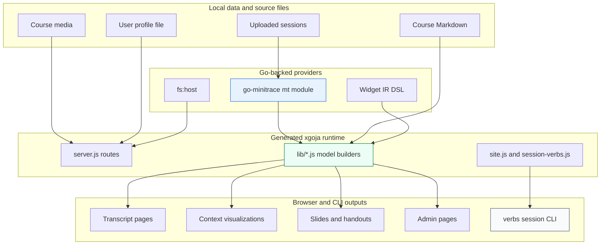
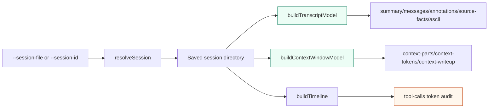
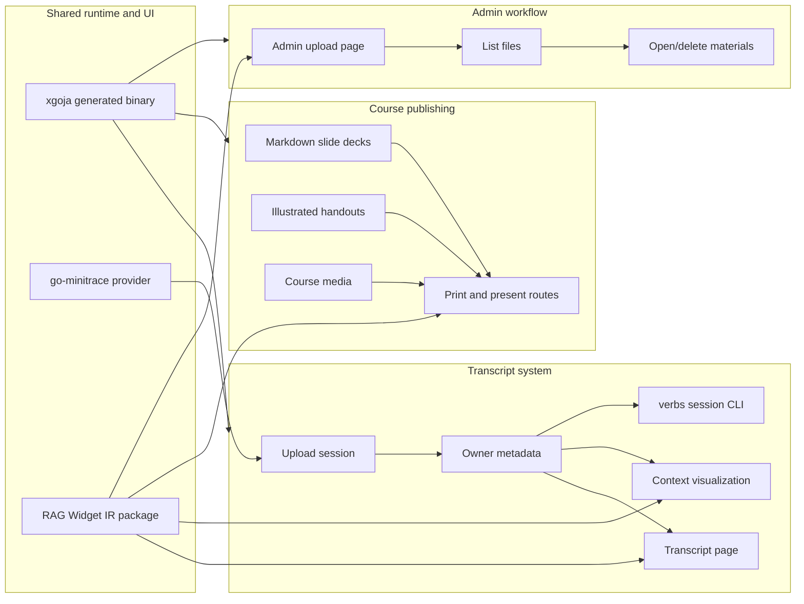

# Minitrace Viz Workshop System: Daily Engineering Deep Dive

This report records the technical shape of the `minitrace-viz` work completed around 2026-06-10 and 2026-06-11. The work was not a single feature. It was a sequence of related changes that turned `minitrace-viz` from a transcript viewer into a workshop system: uploaded sessions are associated with users, source facts are inspectable from the CLI, token accounting is explainable, handouts and slides can be rendered from Markdown, course materials can be uploaded through an admin workflow, and the generated xgoja binary is closer to a deployable artifact.

The unifying idea is simple and technical: every user-facing view should have a stable data path behind it. Transcript pages need normalized session models. Slides and handouts need a parseable content format. Admin upload pages need file-backed storage with validation. Token visualizations need explicit provenance. Each part of the system became more useful when its data model became easier to inspect, test, and reproduce.

> [!summary]
> - The day produced a workshop-ready `minitrace-viz` application with session upload ownership, settings forms, browse pages, slide/handout rendering, admin course-material uploads, and CLI transcript inspection.
> - The most important debugging improvement was the `verbs session` command surface, especially `tool-calls`, `context-tokens`, and `context-writeup`, which expose the same models used by the web UI.
> - A repeated `90` token bug in Pi tool rows was traced to preview-based estimation. The fix computes result lengths in SQL and labels token values as actual or estimated.
> - The course-material work moved the app toward a workshop publishing workflow: Markdown decks, illustrated handouts, print/download routes, present mode, safe media, and admin-managed slide/handout uploads.

## The system at the start of the day

`minitrace-viz` was already an xgoja application backed by `go-minitrace` and Widget IR. It could serve a web page, accept uploaded transcripts, and render transcript/context visualizations in the browser. The application had a workable shape, but several parts were still implicit:

- Uploaded sessions were not yet strongly tied to a user identity.
- The web model that powered transcript and context pages was hard to inspect outside the browser.
- Token counts in context visualizations mixed actual usage and reconstructed estimates without enough provenance.
- Course content existed as source files, but slides, handouts, print routes, present mode, and admin updates were not yet a coherent workflow.
- The generated xgoja binary still depended on sibling checkout assumptions that were fragile outside the local workspace.

The work addressed these gaps through several tickets. The important point is that the tickets were not independent. They repeatedly touched the same architectural seam: xgoja JavaScript builds page models and Widget IR; the generated binary serves those models; `go-minitrace` provides normalized transcript data; the RAG Evaluation Site package renders reusable widgets in the browser.



## Session ownership and settings became first-class application state

The user-session work began with MINIVIZ-010. The initial goal was practical: when a participant uploads a transcript, the application should remember who uploaded it and make it easier to browse sessions by owner. That requires a profile surface, upload tagging, data APIs, and UI affordances.

The system added a backend user profile foundation, then connected it to uploads and browse APIs. Later steps moved through the UI layers: browse sessions, settings form, Widget IR form support, reusable form components in the RAG package, and finally package publication so `minitrace-viz` could consume a registry dependency instead of a local file path.

The progression was:

| Phase | Result |
|---|---|
| Profile foundation | `lib/user-session-service.js` and server routes established local user identity state. |
| Upload ownership | Session uploads were tagged with owner metadata and exposed through browse APIs. |
| Browse UI | Widget IR pages listed sessions with owner-aware navigation. |
| Settings UI | A native settings form route allowed user profile updates. |
| Generic forms | RAG Evaluation Site gained reusable form atoms, `FormRow`, `FormPanel`, Widget IR adapters, and Goja DSL helpers. |
| Package publication | `@go-go-golems/rag-evaluation-site@0.1.8` was published and `minitrace-viz` switched to the npm package. |

This was not only a local feature. It forced a reusable form system into the shared Widget IR layer. The work expanded Storybook coverage for `TextInput`, `SelectInput`, `CheckboxRow`, `FormRow`, and `FormPanel`, then exposed those pieces through the WidgetRenderer and Goja DSL. The application-specific settings page became the first consumer of a more general form contract.

The technical lesson is that application requirements often reveal missing primitives in the shared UI system. The durable result is not just a settings page; it is a form vocabulary that can be reused by future Widget IR pages.

## CLI session models made the web data path inspectable

MINIVIZ-011 added the `verbs session` command group. The original request was to make something similar to `go-minitrace preview`, but using the same library functions that render the web UI. That constraint shaped the entire implementation.

The CLI does not parse transcript files independently. It resolves or imports a session, then calls the same model builders used by the browser pages:



The command surface now includes:

| Command | What it exposes |
|---|---|
| `verbs session summary` | One row with title, framework, model, turn/tool/message counts, source-fact counts, and diagnostics. |
| `verbs session messages` | Transcript message rows from `buildTranscriptModel`. |
| `verbs session annotations` | Transcript annotations, including source-fact annotations. |
| `verbs session source-facts` | Normalized lifecycle events and attachments. |
| `verbs session tool-calls` | Tool rows with result lengths, estimated tokens, and token provenance. |
| `verbs session context-parts` | Context-window parts from `buildContextWindowModel`. |
| `verbs session context-tokens` | Context parts with cumulative tokens, percentages, and provenance. |
| `verbs session context-writeup` | A text report of context composition and largest tool contributions. |
| `verbs session ascii` | A compact terminal view of the session model. |

The first implementation hit an xgoja-specific scanner constraint. Metadata passed to `__verb__` must be statically readable by the scanner. A shared JavaScript identifier such as `fields: sessionFields` is not accepted. The fix was to define a literal `__section__("sessionInput", { fields: { ... } })` and reference that section from each verb.

That failure is worth preserving because it affects every future xgoja jsverb file. Build success is not enough. Command discovery must run too.

## The `90` token bug clarified actual versus estimated data

The CLI token work became necessary after a real Pi session showed many tool calls with exactly `90` tokens. The value was suspicious because unrelated tool calls should not repeatedly have the same size.

The bug was local to `minitrace-viz`. The saved minitrace archive still had full result text. The application model estimated tool tokens from `tool.preview` before full result text. `tool.preview` is capped to 360 characters for display. The heuristic divided characters by four. The repeated value came from this calculation:

```text
360 display characters / 4 = 90 estimated tokens
```

The fix moved token-relevant length calculation into the SQL query inside `lib/timeline-data.js`:

```sql
LENGTH(COALESCE(result, error, '')) AS result_chars,
CASE
  WHEN COALESCE(full_bytes, 0) > 0 THEN CAST(ROUND(COALESCE(full_bytes, 0) / 4.0) AS INTEGER)
  WHEN LENGTH(COALESCE(result, error, '')) > 0 THEN CAST(ROUND(LENGTH(COALESCE(result, error, '')) / 4.0) AS INTEGER)
  ELSE 0
END AS estimated_result_tokens
```

The CLI was then cross-validated against `go-minitrace` itself in two ways:

1. A structured JavaScript query-command script called `require("minitrace").session().File(...).query(...)` and measured tool result lengths from normalized SQLite tables.
2. A raw DuckDB query unnested `tool_calls` from the archive JSON and measured `$.output.result` length directly.

The first sampled Pi rows matched after the fix:

| Row | minitrace-viz result tokens | go-minitrace JS SQL tokens | DuckDB result chars |
|---:|---:|---:|---:|
| 0 | 1551 | 1551 | 6204 |
| 1 | 841 | 841 | 3362 |
| 2 | 294 | 294 | 1174 |
| 3 | 135 | 135 | 538 |
| 4 | 68 | 68 | 273 |

The important outcome was not only that the numbers changed. The CLI now labels where each token value came from:

| Field | Meaning |
|---|---|
| `tokens` | The value used by the row or context part. |
| `token_source` | The source or heuristic used for the value. |
| `is_estimated` | Whether the row is reconstructed rather than source-reported. |
| `actual_tokens` | The actual transcript usage field used by the row, when available. |
| `estimated_tokens` | The heuristic estimate used for reconstructed context parts. |

A real Pi context sample now distinguishes source-reported and reconstructed values:

```text
T1 assistant:
  token_source=actual_turn_input_output
  is_estimated=false
  actual_tokens=13770

T1 file read diary.md:
  token_source=file_share_of_sql_result_length/4
  is_estimated=true
  estimated_tokens=1551

system + tool policy:
  token_source=fixed_system_tool_policy_estimate
  is_estimated=true
  estimated_tokens=1200
```

This distinction should remain part of the design. Transcript usage accounting and context-window explanation are different questions. A useful debugging surface can show both, but it must not collapse them into one unlabeled number.

## Course content moved from static files toward a publishing workflow

MINIVIZ-012, MINIVIZ-013, and MINIVIZ-016 transformed the course content layer. The work started with illustrated handouts and print/present modes, then added admin upload workflows, then added Obsidian-style slide deck parsing.

The course-material path now has several distinct concerns:

| Concern | Implementation direction |
|---|---|
| Markdown parsing | Shared content parsing for slides and handouts, including context-window diagram blocks. |
| Media handling | Safe course media route and Markdown image URL rewriting. |
| Rich handouts | Mixed Markdown, image, and context-window blocks rendered through RAG `RichArticle`. |
| Print/download | Handout print routes, Markdown download actions, and no-shell print pages. |
| Present mode | Slide present routes and fullscreen/present actions. |
| Admin uploads | Admin-only upload, list, open, and delete workflows for slide, handout, and SVG files. |
| Obsidian slides | `---`-split Markdown slide decks and JSON-backed context-window diagrams. |

The file-level flow is:

```mermaid
flowchart TD
    A[Course Markdown files] --> B[lib/slide-loader.js]
    A --> C[lib/handout-loader.js]
    D[Course media files] --> E[/course-assets route]
    B --> F[lib/course-pages.js]
    C --> F
    E --> F
    F --> G[Widget IR slides]
    F --> H[Widget IR handouts]
    I[Admin upload page] --> J[lib/course-material-service.js]
    J --> A
    J --> D

    style B fill:#ecfdf5,stroke:#047857
    style C fill:#ecfdf5,stroke:#047857
    style J fill:#e6f3ff,stroke:#2563eb
```

Several details were important enough to become stable rules:

- Handout Markdown image paths should be rewritten through a safe course media route instead of exposing arbitrary filesystem paths.
- Print routes should remove page chrome when the target is a paper/PDF handout.
- Present routes should remove the shell when the target is slide projection.
- Slide bodies should not render a duplicated first heading when that heading is already used as the slide title.
- Context-window diagrams in slides should be simpler than exploratory context pages; the slide needs a stable diagram, not a mode selector.
- Admin tables should list source files and use constrained columns with ellipsis so long session or file names do not break the page.

The result is a more complete workshop publishing system. Source Markdown can become slides, handouts, print PDFs, present-mode pages, and downloadable materials. Admin users can update materials without editing files manually on disk. The browser UI remains Widget IR-driven.

## Transcript and context page polish tightened the teaching views

MINIVIZ-014 focused on finishing details in transcript and context views. The changes were smaller than the content/upload work, but they affected the quality of the teaching interface.

The diary records three main adjustments:

1. Thinking visibility, hover previews, note removal, and assistant token accounting were investigated and adjusted.
2. Slide context-window widgets were moved to the Signal Orange / Cyan style set.
3. Duplicate slide legends were removed and legends were scoped to visible blocks.

These changes reflect a consistent design direction: the exploratory transcript page may expose more controls, but slide and handout surfaces should show the specific evidence needed for the lesson. Redundant legends, empty notes, and unnecessary switches add cognitive overhead. The implementation moved toward fewer controls in teaching surfaces and more detailed inspection in explicit debug surfaces such as CLI commands.

## Build reproducibility became a separate concern

MINIVIZ-015 handled the generated binary and optional hot-reload story. The first step was a design package for a unified `minitrace-viz` binary with optional `--hot-reload`. The implementation then addressed a concrete build-machine problem: xgoja builds depended on sibling checkout `replace` directives and local workspace assumptions.

The fix removed sibling-repo replace directives, bumped go-go-golems module versions, aligned xgoja specs, and disabled VCS stamping for generated temporary builds. The affected files included:

| File | Reason |
|---|---|
| `Makefile` | Set xgoja version and Go flags for reproducible generated builds. |
| `go.mod` | Use published module versions rather than sibling checkout replacements. |
| `xgoja.yaml` | Build-machine spec aligned with published modules. |
| `xgoja.package.yaml` | Embedded runtime spec aligned with the same module versions. |

This work is important because workshop software needs a reliable build path. A local development checkout can rely on sibling repositories; a generated binary build should not require that workspace layout unless the build explicitly opts into it.

## Workshop research and handout framing supplied the content foundation

The CLUB-HANDOUTS ticket supplied the research base for the workshop topic: context engineering, token economics, and coding agents. The diary shows a research process rather than an implementation sequence:

1. Create the ticket and initial scope.
2. Gather sources through web research and surf analysis.
3. Ground the workshop framing in plans and rehearsal transcripts.
4. Produce a textbook-style research compendium.

This matters because the application work and the content work were connected. The platform needed slides, handouts, context-window diagrams, transcript uploads, and token accounting because the workshop topic is agent context management. The content demanded visual and interactive forms of evidence, and the application evolved to support those forms.

## Validation discipline across the day

The diaries repeatedly show the same validation pattern:

- Build the generated xgoja binary.
- Run smoke scripts against live HTTP routes.
- Use Playwright when visual placement matters.
- Use Storybook and package builds for shared RAG components.
- Use go-minitrace SQL/JS query paths when validating normalized transcript data.
- Upload documentation bundles to reMarkable only after dry runs.

The validation commands varied by ticket, but the important examples were:

```bash
GOFLAGS=-buildvcs=false make test

./dist/minitrace-viz verbs session tool-calls \
  --session-id real-pi \
  --sessions-dir /tmp/minitrace-viz-real-fixtures \
  --cache-dir /tmp/minitrace-viz-real-cache \
  --sample-limit 5 \
  --output json

go-minitrace query commands token-audit tool-token-audit \
  --query-repository <ticket>/scripts/02-gominitrace-query-repo \
  --archive-glob /tmp/minitrace-viz-real-fixtures/real-pi/session.minitrace.json \
  --session-file /tmp/minitrace-viz-real-fixtures/real-pi/session.minitrace.json \
  --limit 12 \
  --output json
```

The most important validation lesson came from the token bug. A display value that looks suspicious should be checked at the canonical data layer. In this case, the archive JSON and normalized SQLite tables had enough information to disprove the displayed `90` values and locate the bug in the application projection.

## The current system shape

After the day's work, the system can be described as four cooperating surfaces:



The browser pages and CLI commands are no longer separate interpretations of the same source. They share the same model-building code where possible. The course pages and admin workflows are also no longer static-only surfaces; they operate on file-backed materials that can be listed, opened, uploaded, and deleted.

## Working rules established today

The day's work leaves behind several engineering rules that should guide future development:

- A Widget IR web page should have a CLI or API path that can inspect the same model when debugging matters.
- xgoja jsverb metadata must stay literal and scanner-friendly.
- Runtime config must be set before requiring modules that call cached `loadConfig()` functions.
- Display previews must not be used for token accounting when full text or full byte counts are available.
- Token rows that mix actual usage and reconstructed composition must include provenance fields.
- Course content loaders should keep Markdown parsing, media rewriting, and Widget IR rendering as distinct responsibilities.
- Admin workflows should operate on validated file types and expose repeatable smoke scripts.
- Workshop teaching pages should remove controls that are useful only for debugging and keep those controls in explicit inspection surfaces.
- Generated binary builds should depend on published module versions unless a local development mode explicitly opts into sibling checkouts.

## Open technical questions

Several questions remain useful for future work:

1. Should `estimated_result_tokens` become a canonical go-minitrace normalized view field rather than a minitrace-viz SQL expression?
2. Should `verbs session context-writeup` support explicit turn selection modes such as `latest`, `highest`, and `N`?
3. Should the ticket-local `tool-token-audit.js` become a permanent go-minitrace query command?
4. Should exact per-tool token fields be added to adapters when source transcripts expose them?
5. Should admin course uploads support version history rather than overwriting current source files?
6. Should the slide/handout parser become a shared package if other projects need Obsidian-style Markdown decks with Widget IR blocks?
7. Should the unified binary include a documented production mode and a documented hot-reload development mode as separate commands?

## Closing

The day's work made `minitrace-viz` more operational. The application can now identify users, inspect uploaded transcript models from the CLI, explain context-window token composition, render workshop handouts and slides, accept admin course-material uploads, and build with fewer local workspace assumptions. The work also improved the shared Widget IR component system through reusable forms and richer article rendering.

The most durable technical result is the separation between source data and reconstructed presentation. Uploaded sessions, source facts, token usage, course Markdown, media files, and admin records each have different authority levels and different validation needs. The implementation became stronger where it made those levels explicit: source facts are not fake messages, display previews are not token sources, actual turn usage is not the same as reconstructed context composition, and static course files are not the same as uploaded admin materials. The system is easier to test because those distinctions are now visible in commands, APIs, and documentation.
