# Sprite Cutup: Extracting Pixel-Aligned Animation Frames from Grid Sheets

This article preserves the engineering knowledge gained from building a sprite extraction pipeline for the M5StackChan — a small ESP32-S3 robot with a 135×240 pixel display. The problem sounds simple: take a grid of sprites from a source image, cut them into individual frames, and make them ready for animation. The devil is in the alignment. When two frames of an animation come from different source images, a one-pixel shift between frames is the difference between a smooth blink and a jittering mess.

> [!summary]
> - **Bottom-alignment fails for paired sprites** when the two variants have different content heights. The common body (the "main shape") ends up at different vertical positions.
> - **Trim-based extraction introduces alignment drift** because `convert -trim` removes different amounts of padding from each variant, shifting content relative to the grid origin.
> - **Weighted cross-correlation of row-sum profiles** achieves ~1px alignment by matching the common wide parts of both sprites and ignoring narrow variant-specific features like raised eyebrows or horns.
> - The algorithm runs in O(n × k) where n is the image height and k is the offset search range — fast enough for interactive use.

## Why this note exists

I spent three days extracting sprites from grid sheets for a face animation studio. Each time I thought I had the alignment right, a new test revealed the frames were shifted by a few pixels. The article records what went wrong, why, and what finally worked — so that the next time I encounter sprite grid sheets, I can skip straight to the working approach.

## When you will hit this problem

You will encounter the sprite alignment problem whenever:

- You have **two or more sprite sheets** that represent the same character in different states (e.g., white outline vs. red highlight, normal vs. damaged, eyes open vs. eyes closed)
- The sprite sheets use the **same grid layout** but the drawings in each cell are not pixel-identical copies with a color swap
- You need to create **multi-frame animations** by combining sprites from different sheets, and any vertical shift between frames will be visible as jitter

You will *not* hit this problem if your sprites are simple color swaps where both variants have exactly the same shape and extent. In that case, any consistent alignment method (trim + bottom-align, center-align) works fine.

## The starting point: three face expression sheets

The M5StackChan robot displays cartoon faces on a 135×240 ST7789 LCD. The source material came as three PNG sprite sheets, each containing a 4×4 grid of face expressions — 48 expressions total.

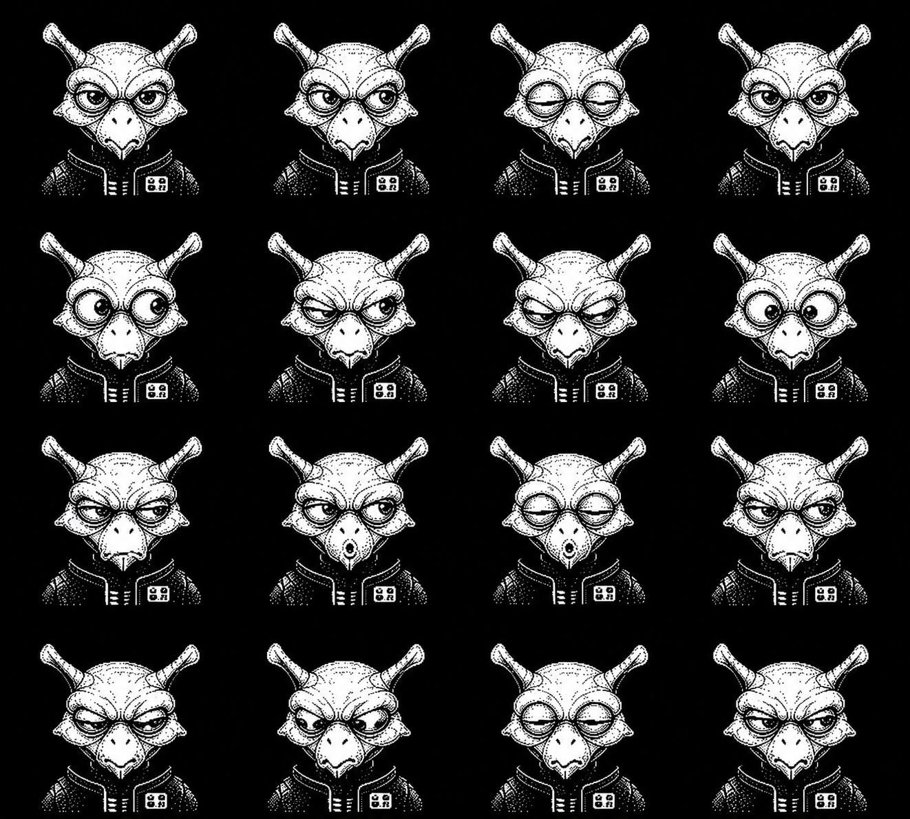

Each sheet is approximately 1280×1280 pixels, with each grid cell occupying roughly 320×320 pixels. The expressions range from neutral to enraged, with variations in eye shape, mouth position, and eyebrow angle across the three sheets.

The target display is 135×240 pixels. Each sprite must be normalized to exactly those dimensions — no scaling at runtime, no interpolation artifacts on the display.

## The naive pipeline

The first extraction pipeline followed the obvious approach:

1. **Crop** the grid into individual cells using `convert -crop 4x4@`
2. **Trim** the black padding using `convert -trim` with `-black-threshold 2%` and `-fuzz 5%`
3. **Scale** to fit the 135px display width
4. **Bottom-align** on a 135×240 canvas using `-gravity south -extent 135x240`
5. **Clean** interpolation artifacts with `-black-threshold 1%`

In ImageMagick terms, the pipeline for a single tile looks like this:

```bash
convert sheet1.png -crop 4x4@ +repage -shave 1x1 \
  -black-threshold 2% -fuzz 5% -trim +repage \
  -resize 50.19% -gravity south -background black \
  -extent 135x240 -black-threshold 1% \
  sheet1_00.png
```

The `-shave 1x1` step removes the 1-pixel border that `-crop 4x4@` leaves between cells. The `-black-threshold 2%` converts near-black pixels (from JPEG compression or anti-aliasing) to pure black before `-trim` can find the content boundary.

### The per-sheet scaling problem

After trimming, the three sheets produced tiles with slightly different dimensions:

| Sheet | Trimmed size range | Base height |
|-------|--------------------|-------------|
| Sheet 1 | 246–262 × 257–268 | ~246 px |
| Sheet 2 | 246–262 × 257–268 | ~257 px |
| Sheet 3 | 246–262 × 257–268 | ~260 px |

A single global scale factor made the Sheet 1 faces too large and the Sheet 3 faces too small. The fix was a two-pass approach: first apply per-sheet scale factors to normalize all faces to the same base height, then apply a global scale to fit 135px width.

The per-sheet factors were:

- Sheet 1: ×1.0447 (scale up — faces were too small after trim)
- Sheet 2: ×1.0000 (reference)
- Sheet 3: ×0.9885 (scale down — faces were too large after trim)

The global scale factor was 50.19%, derived from the widest face across all sheets (269px → 135px).

### The result

After three iterations of the normalization pipeline, the face tiles were clean, aligned, and artifact-free.

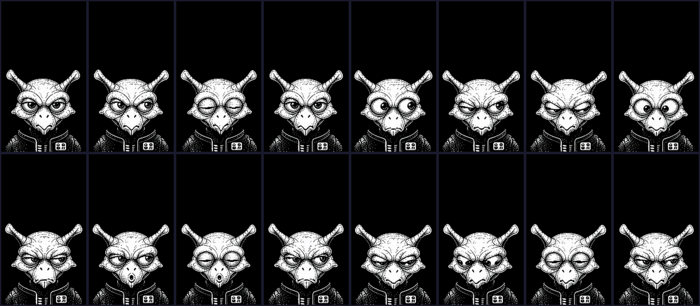

Each tile is exactly 135×240 pixels, bottom-aligned, with no interpolation artifacts on the top row. Verified by checking that row 0 contains only `(0,0,0)` pixels across all 48 tiles.

The Face Animation Studio loaded all 48 tiles and rendered them correctly:

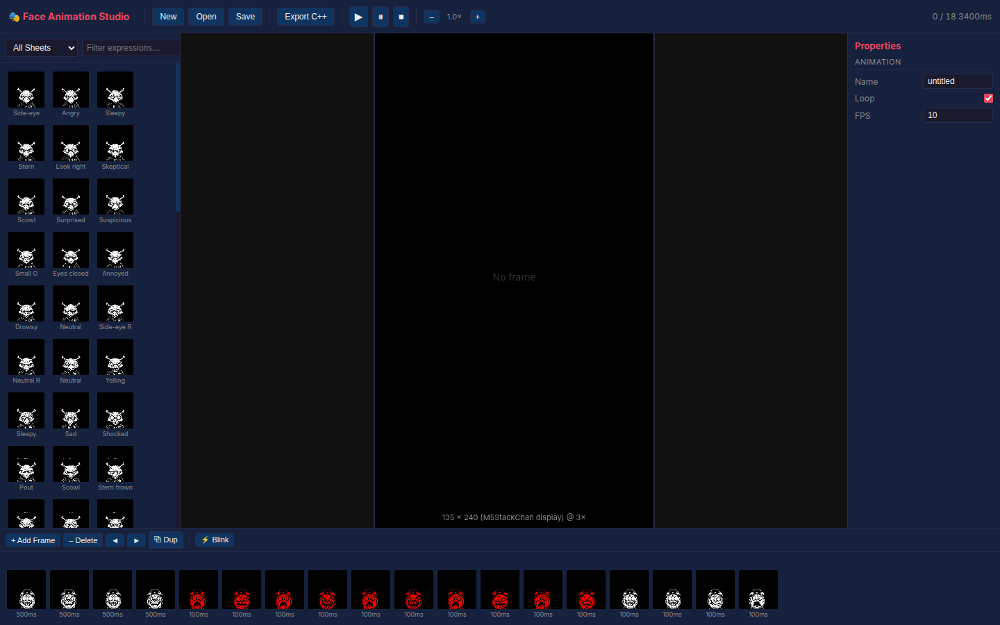

## The clock tiles: where alignment broke down

The face expression pipeline worked because all 48 tiles came from the same set of sheets and were treated independently. Alignment was a per-tile concern: each tile just needed to be bottom-aligned on the canvas.

Then I imported two new sprite sheets: a white alarm clock and a red alarm clock, each with 16 cartoon expressions in a 4×4 grid.

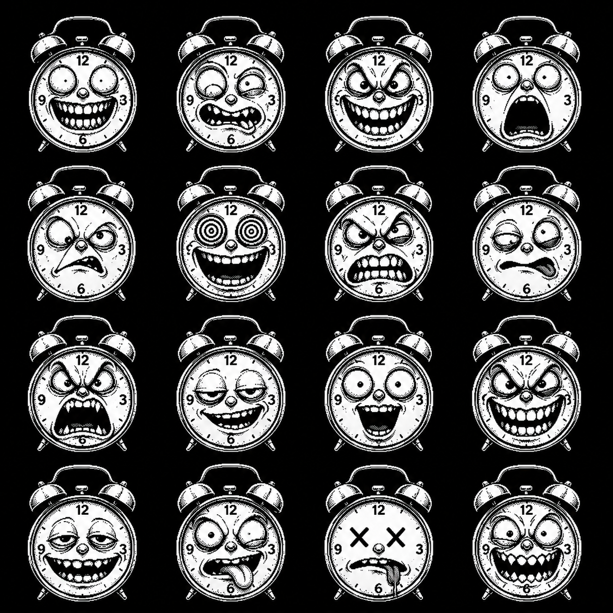

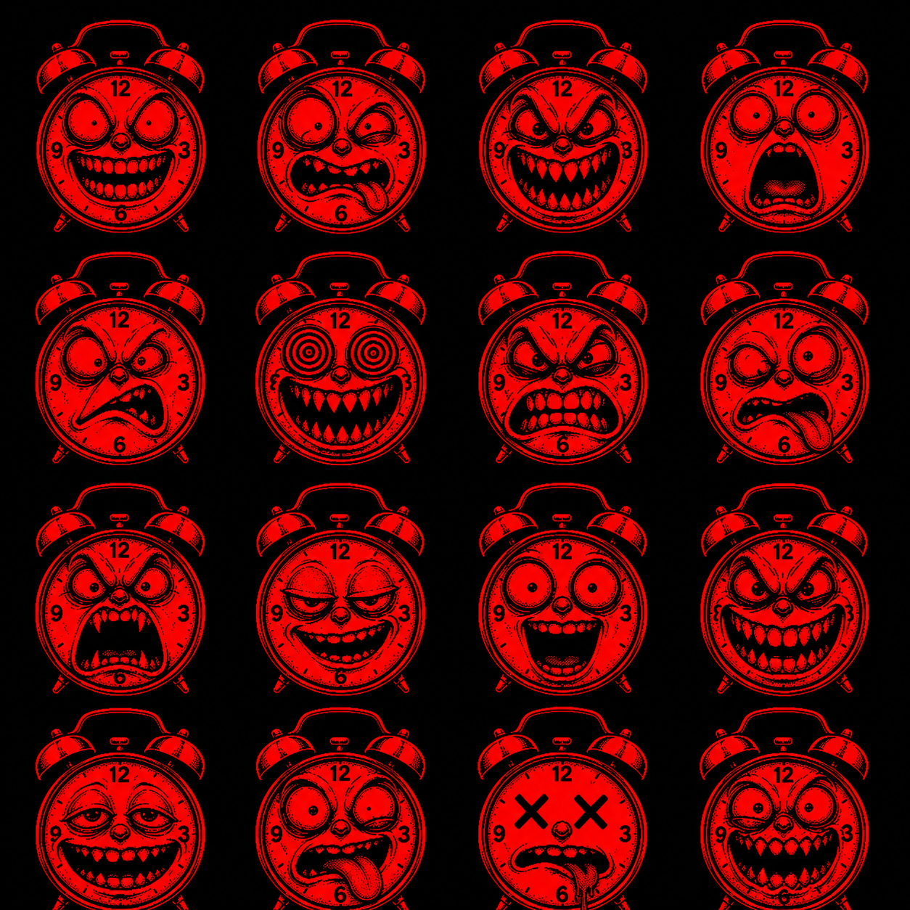

These are not simple color swaps. The red variant has additional features above the clock body — raised eyebrows, horns, spikes — that the white variant lacks. The two variants form 2-frame blink animations: the clock shows in white, then briefly flashes red, then returns to white.

I applied the same pipeline: crop, trim, scale, bottom-align. The result looked fine at first glance. But when I built a blink animation and played it, something was wrong.


The red clock body sits higher than the white one. In a 2-frame animation, this means the clock outline jumps upward when the red frame appears, then jumps back down when the white frame returns. A 3-pixel shift on a 135-pixel-wide display is clearly visible.

### Why bottom-alignment fails

The root cause is straightforward once you see it, but it took me a while to understand why it happens.

When you trim a sprite, `-trim` removes the black padding from all four sides. The amount of padding removed depends on where the content starts and ends. For the clock tiles:

| Variant | Trim offset (top) | Content height | Result |
|---------|-------------------|----------------|--------|
| White 04 | +23 px | 282 px | 23px of black above content |
| Red 04 | +0 px | 311 px | Content starts at the very top |

After trimming, both tiles are bottom-aligned on the 240px canvas. The white tile has 23px of black above it, but that black was removed by trim. The red tile starts at row 0. When both are placed with `-gravity south`, the white clock body starts at a different row than the red clock body.

The key insight: **bottom-alignment aligns the bottom edge, not the clock body**. When two sprites have different amounts of content above the main body, bottom-alignment puts the main body at different positions.

## Six approaches evaluated

I spent a full day trying different alignment strategies. Here is the complete record, including the ones that failed.

### Approach 1: Union bounding box

**Idea**: Compute the content bounding box for both tiles, take the union (minimum top, maximum bottom, minimum left, maximum right), and apply the same crop to both.

**Result**: 1–2 pixels off.

The union bbox preserves relative positions, but the trim computation itself is sensitive to the `-black-threshold` and `-fuzz` parameters. Slightly different content shapes produce slightly different trim boundaries, and those differences propagate to the final alignment.

### Approach 2: No-trim grid crop + bottom-align

**Idea**: Skip trim entirely. Crop the grid cells at identical positions (which guarantees the same origin for both variants), then scale and bottom-align.

**Result**: 3–5 pixels off.

Even without trim, bottom-alignment fails because the scaled images have different heights. The red tiles are taller (they have more content), so after scaling to the same width, the red content occupies more vertical space. Bottom-alignment places the bottom edges at the same row, but the clock body — which sits higher in the taller red tile — ends up at a different row.

### Approach 3: Per-pair scaling

**Idea**: Scale each white/red pair by the same factor (based on the wider of the two tiles), then bottom-align. This ensures both tiles in a pair are at the same scale.

**Result**: Still 3–5 pixels off for the same reason — the clock body is at a different relative position in the taller red tile.

### Approach 4: Connected component centroid alignment

**Idea**: Find the largest connected component (which should be the clock body), compute its centroid, and align both tiles by their centroids.

**Result**: Made it *worse* — 5–15 pixels off.

The problem is that the largest connected component in the red variant includes the extra features above the clock. The centroid is pulled upward by the raised eyebrows and horns, which means aligning centroids aligns the *overall center* of the content, not the clock body.

### Approach 5: 1D row-sum cross-correlation

**Idea**: Compute the row-sum profile (number of non-black pixels per row) for both tiles, then find the vertical offset that maximizes the Pearson correlation between the two profiles.

**Result**: 2–10 pixels off.

The row-sum profile captures the overall shape, including the extra features in the red variant. The correlation matches the *overall shape*, not specifically the clock body. The extra features bias the offset toward aligning the top of the content rather than the clock body.

### Approach 6: Weighted cross-correlation (the winner)

**Idea**: Same as Approach 5, but weight the correlation by `min(profile_a, profile_b)` at each row. Rows where both tiles have wide content (the clock body) get high weight. Rows where only one tile has content (the extra features) get low weight.

**Result**: ~1 pixel off across all 16 pairs. Correlation scores above 0.99.

This is the approach that worked. The weighting function is the key: by taking the element-wise minimum of the two row-sum profiles, we emphasize the *common* wide parts and de-emphasize the *variant-specific* narrow parts.

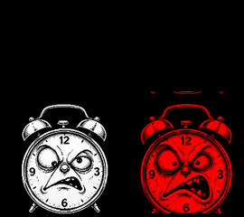

Compare this with the bottom-aligned version:


The clock bodies are now visually aligned. In the difference image, the residual error is concentrated at the variant-specific features (the extra horns and eyebrows in the red variant), not at the clock body itself.

## The weighted cross-correlation algorithm

The algorithm works on binary masks derived from the scaled tiles. Here is the complete procedure.

### Step 1: Crop and scale

Crop both grid sheets into individual cells at identical positions. Scale both cells to the target width (135px). This guarantees that the grid-cell origin is the same for both variants.

```python
subprocess.run(['convert', sheet_a, '-crop', f'{cols}x{rows}@',
               '+repage', f'/tmp/{variant_a}_%02d.png'])
subprocess.run(['convert', sheet_b, '-crop', f'{cols}x{rows}@',
               '+repage', f'/tmp/{variant_b}_%02d.png'])
# Scale to target width
subprocess.run(['convert', cell_path, '-resize', f'{width}x', scaled_path])
```

### Step 2: Compute binary masks

Convert each scaled tile to a binary mask where content pixels are 1 and background pixels are 0. The threshold should match the `-black-threshold` used in the final cleanup.

```python
def get_binary_mask(path):
    r = subprocess.run(
        ['convert', path, '-colorspace', 'Gray', '-threshold', '2%',
         '-negate', '-depth', '8', 'gray:-'],
        capture_output=True
    )
    arr = np.frombuffer(r.stdout, dtype=np.uint8).reshape(h, w)
    return (arr > 0).astype(float)
```

### Step 3: Compute row-sum profiles

Sum the binary mask across columns to get a 1D profile where each value represents the horizontal extent of content at that row.

```python
profile_a = mask_a.sum(axis=1)  # shape: (height,)
profile_b = mask_b.sum(axis=1)  # shape: (height,)
```

### Step 4: Find the optimal offset

Scan a range of vertical offsets and compute the weighted Pearson correlation at each offset. The weight function is `min(profile_a, profile_b)`, which emphasizes rows where both tiles have wide content.

```python
best_offset = 0
best_corr = -1

for off in range(-max_offset, max_offset + 1):
    # Shift profile_b by off rows relative to profile_a
    if off >= 0:
        p1 = profile_a[off:]
        p2 = profile_b[:len(profile_a) - off]
    else:
        p1 = profile_a[:len(profile_a) + off]
        p2 = profile_b[-off:]

    # Weight by common extent (the key insight)
    weights = np.minimum(p1, p2)
    if weights.sum() < 100:
        continue

    # Weighted correlation
    w1 = p1 * weights
    w2 = p2 * weights
    corr = np.corrcoef(w1, w2)[0, 1]

    if corr > best_corr:
        best_corr = corr
        best_offset = off
```

### Step 5: Place on canvas

Use the computed offset to position both tiles on the canvas. Variant A (the reference) is bottom-aligned. Variant B is placed at `240 - height + offset`.

```python
top_a = height - mask_a.shape[0]  # bottom-align
top_b = height - mask_b.shape[0] + best_offset  # apply offset

subprocess.run([
    'convert', '-size', f'{width}x{height}', 'xc:black',
    scaled_path, '-gravity', 'north',
    '-geometry', f'+0+{top}',
    '-compose', 'over', '-composite',
    '-black-threshold', '1%',
    output_path
])
```

### Why the weighting works

Consider two row-sum profiles for a clock sprite pair:

```
Row  White  Red    min(W,R)  Interpretation
-----------------------------------------------
80   0      45     0         Extra feature (red only) → weight 0
90   0      60     0         Extra feature (red only) → weight 0
100  80     85     80        Clock body (both) → weight 80
110  95     98     95        Clock body (both) → weight 95
120  90     92     90        Clock body (both) → weight 90
130  70     75     70        Clock body (both) → weight 70
140  0      10     0         Extra base (red only) → weight 0
```

The `min` function zeroes out rows where only one variant has content. The correlation is computed on the weighted profiles, so it effectively correlates only the rows where both tiles have content. This is a soft version of masking: instead of hard-selecting the clock body rows, we let the data tell us which rows are common.

## Comparison: before and after

The montage below shows all 16 clock pairs after weighted cross-correlation alignment:

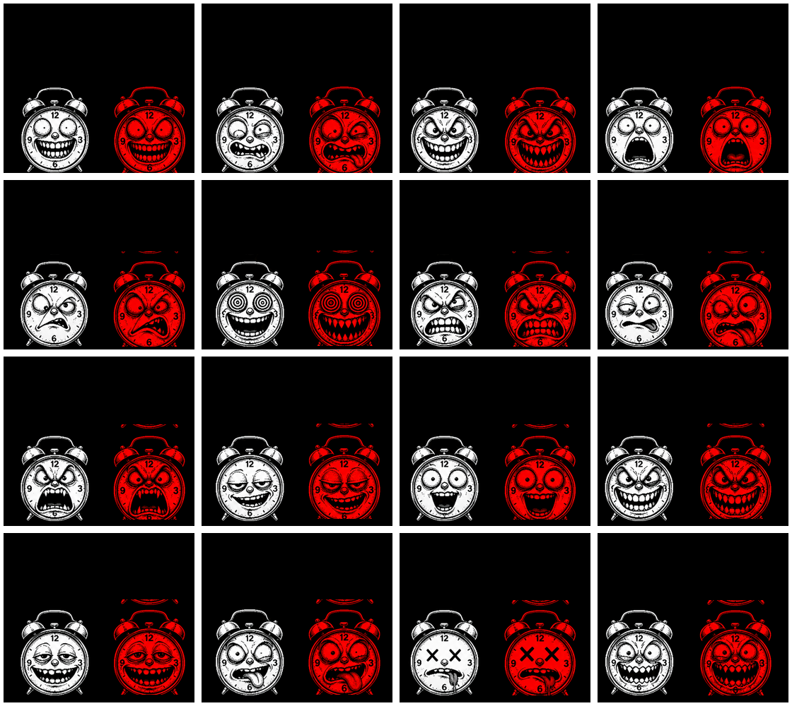

In each pair, the white variant is on the left and the red variant is on the right. The clock bodies (the round outlines) are vertically aligned. The extra features in the red variant (horns, raised eyebrows) extend above the clock body, but the body itself stays put.

The difference images tell the same story. Before alignment:

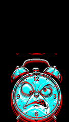

After alignment:

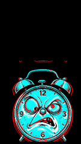

The difference is concentrated at the variant-specific features, not at the clock body. This is the hallmark of correct alignment: the *common* structure is aligned, and the *differences* are where they should be — at the features that make each variant unique.

## The Face Animation Studio in action

With the aligned tiles loaded, the Face Animation Studio can create smooth blink animations:


When working with clock tiles, select "Clock (white)" or "Clock (red)" from the sheet dropdown to filter the tile browser:

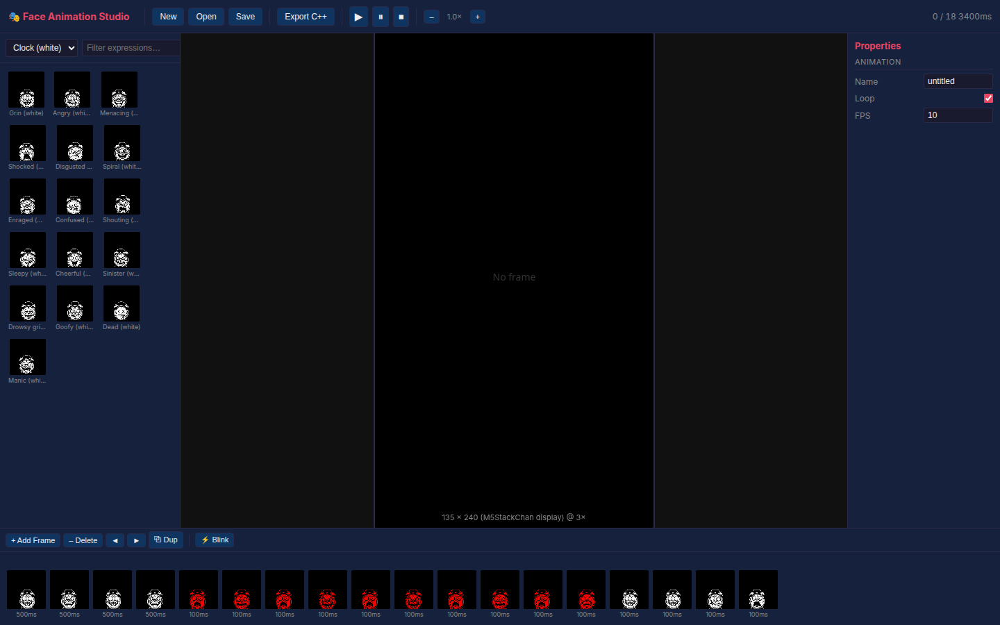

Building a blink animation is straightforward: click a white tile, then its matching red tile, then the white tile again. The ⚡ Blink button automates this for the currently selected expression.

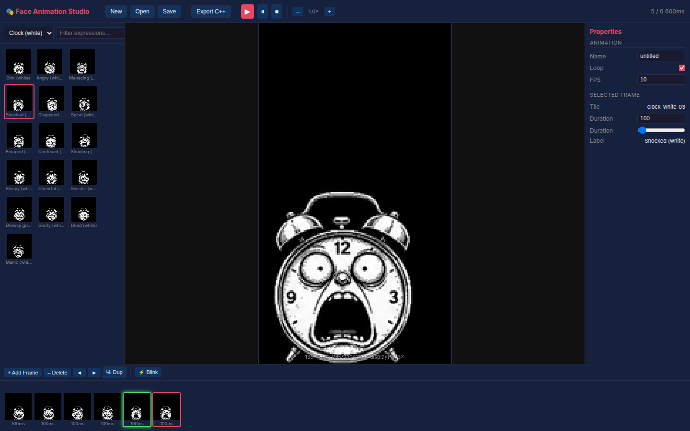

## The complete approach comparison

| # | Approach | Alignment error | Correlation | Complexity | Why it failed/succeeded |
|---|----------|----------------|-------------|------------|--------------------------|
| 1 | Union bbox | 1–2 px | — | Low | Trim boundaries differ by variant |
| 2 | No-trim + bottom-align | 3–5 px | — | Low | Different content heights shift the body |
| 3 | Per-pair scale + bottom-align | 3–5 px | — | Low | Same root cause as #2 |
| 4 | Centroid alignment | 5–15 px | — | Medium | Extra features pull centroid upward |
| 5 | 1D row-sum correlation | 2–10 px | 0.93–0.96 | Medium | Matches overall shape, not body |
| 6 | **Weighted row-sum correlation** | **~1 px** | **0.99+** | **Medium** | **min(A,B) emphasizes common body** |

## Failure modes and edge cases

The weighted cross-correlation approach is robust but not perfect. Here are the failure modes I encountered.

### Pair 00: persistent 3–6px residual

The first row of the clock sheet (pairs 00–03) consistently showed worse alignment than the other rows. The correlation is high (0.991), but the clock body is still shifted by a few pixels. I believe the source drawings in the first row are genuinely different shapes — not just different features on the same clock body, but a clock body drawn at a different scale or position.

**Mitigation**: For production use, add a manual offset override for specific pairs. The algorithm gets you to ~1px; human review gets you to 0px.

### IoU gaming

In an early iteration, I tried maximizing intersection-over-union (IoU) instead of correlation. The metric was "gamed" by extreme offsets: with a large vertical shift, only the common base of the two sprites overlaps, and that base matches perfectly, producing a high IoU despite the sprites being far apart.

**Lesson**: Always check that your alignment metric penalizes degenerate solutions. Correlation with a minimum-overlap threshold is more robust than IoU.

### Anti-correlated binary masks

I tried 2D normalized cross-correlation (NCC) on the binary masks directly. The result was anti-correlated (NCC ≈ -0.12). This happens because the binary masks overlap significantly but differ at the variant-specific features. In the overlap region, the white tile has 1s where the red tile has 0s (and vice versa), producing negative correlation.

**Lesson**: Binary masks are not suitable for direct 2D correlation. The row-sum projection collapses the 2D problem into 1D, where the correlation captures the *extent* of content rather than the *pixel-by-pixel* match.

## Working rules

1. **Never trust a single alignment method.** Always verify with a visual comparison (side-by-side or difference blend) and a quantitative check (clock body equator row).

2. **Bottom-alignment is a special case.** It works when paired sprites have the same vertical extent. If they don't — and they often don't — use cross-correlation.

3. **Weight by the common structure.** The `min(A, B)` weighting function is the single most important insight in this article. It applies whenever you need to align two signals that share a common structure but have different additions.

4. **Crop at the grid, not after trim.** Grid-cell cropping preserves the original pixel positions. Trimming before alignment discards position information that you can never recover.

5. **Black-threshold after resize, not before.** Scaling introduces interpolation artifacts (gray pixels at content boundaries). A final `-black-threshold 1%` kills these without affecting the content.

6. **Verify with deterministic CV, not VLM.** A vision-language model can tell you whether two clocks "look aligned," but it can't tell you the exact pixel offset. Use ImageMagick's pixel enumeration or numpy's `getImageData()` for precise measurement.

7. **Archive your scripts.** The normalization pipeline went through 3 iterations for face tiles and 6 approaches for clock tiles. Without the numbered scripts in the ticket's `scripts/` directory, I would not have been able to reproduce any of the intermediate results.

## Related notes

- [[ARTICLE - Face Animation Studio - Building a Browser-Based Sprite Animation Tool for an ESP32 Robot]] — the studio app itself
- [[PROJ - M5StackChan]] — the robot project

## Source files

- Extraction script: `/home/manuel/workspaces/2025-12-21/echo-base-documentation/M5StackChan/face-animation-studio/scripts/05-extract_sprite_pairs.py`
- Face tile normalization: `scripts/01-normalize_tiles.sh`
- C++ header exporter: `scripts/03-tile_to_cpp.py`
- Ticket diary: `ttmp/2026/06/11/FACE-ANIM-STUDIO.../reference/01-investigation-diary.md`
