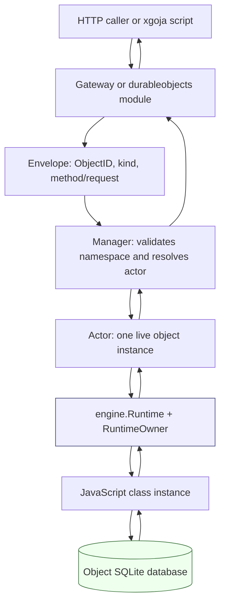

# Go Go Objects: Durable Objects Runtime on Goja

This article explains the `go-go-objects` Durable Objects runtime as it exists after the xgoja/v2 integration work. The goal is not to memorize every type in the repository. The goal is to understand the execution model: how a stable object identity becomes a live JavaScript actor, how that actor owns a `goja.Runtime`, how SQLite gives the actor durable state, and how xgoja-generated binaries expose the runtime through both direct and composable HTTP commands.

The project implements a local, single-process Durable Objects kernel. It is not a Cloudflare Workers compatibility layer. It does not try to provide the full Workers API, distributed placement, WebSocket hibernation, WHATWG request/response classes, or hostile-code isolation. It implements the smaller core that makes the pattern useful inside Go programs: identity, serialized execution, object-local storage, RPC dispatch, fetch dispatch, alarms, eviction, and embeddable HTTP serving.

> [!summary]
> - A Durable Object is identified by `(namespace, name)`, lazily started as one JavaScript actor, and backed by one private SQLite database.
> - Each live object owns one `go-go-goja/pkg/engine.Runtime`; all JavaScript execution for that object runs through `RuntimeOwner.Call()`.
> - The HTTP gateway translates `/rpc/...` and `/fetch/...` routes into manager dispatch envelopes.
> - The xgoja provider now supports xgoja/v2, embedded asset roots, `durableobjects.gateway()` mountable handlers, and a direct `durableobjects serve` command.

## Why this project exists

Embedded JavaScript runtimes often start with a simple shape: create a runtime, load a script, call a function, return a value. That shape works for command execution. It is insufficient for stateful components that need to be addressed repeatedly over time. A counter, a document session, a workflow coordinator, or a per-user agent needs a stable identity. Callers must be able to say, "send this request to object `COUNTER/global`," and the host must route that request to the same logical object state across calls, evictions, and restarts.

Durable Objects provide that missing identity-bound execution model. The important property is not just persistence. A database can persist state by itself. The important property is that identity, in-memory JavaScript state, serialized execution, and durable storage are tied together. For a given object identity, the runtime guarantees that one live actor handles work at a time, and that actor has private access to its durable state.

`go-go-objects` explores how small that kernel can be when built on `go-go-goja` primitives. The result is deliberately compact. The runtime does not introduce a second JavaScript scheduler. It uses the existing `engine.Runtime`, `runtimeowner.RuntimeOwner`, CommonJS loading, and xgoja provider APIs. The Durable Objects layer adds identity, lifecycle, storage, dispatch, and serving.

## Current project status

The implementation is no longer just a design. The repository contains a working MVP in:

```text
/home/manuel/workspaces/2026-06-12/goja-durable-objects/go-go-objects
```

The current important paths are:

| Path | Role |
| --- | --- |
| `pkg/durableobjects` | Core runtime: identity, manager, actors, storage, alarms, gateway, server helper, schedulers, and tests. |
| `pkg/xgoja/providers/durableobjects` | xgoja provider: CommonJS module, config capability, embedded assets, mountable handler export, and direct command provider. |
| `cmd/go-go-objects` | Standalone demo/custom-bundle server for local development. |
| `examples/counter` | Counter object, xgoja/v2 buildspec, runtime config, and JS HTTP serve composition verb. |
| `examples/templates/durableobjects_http_runtime.go.tmpl` | Custom xgoja template for embedding the Durable Objects runtime into an existing Go HTTP server. |
| `ttmp/2026/06/12/GOJA-DO-001--implement-durable-objects-for-go-go-goja` | docmgr ticket with the implementation diary, design guide, tasks, and changelog. |

The validated implementation includes:

- one live actor per active object identity;
- one `goja` runtime per live actor;
- CommonJS bundle loading from `exports.objects`;
- automatic namespace derivation from exported class names, for example `Counter -> COUNTER`;
- optional explicit manifest aliases;
- per-object SQLite storage with KV, metadata, alarm state, and schema version metadata;
- a central `alarms.sqlite` index for waking evicted objects;
- alarm reconciliation from object-local alarm records back into the central index;
- active-dispatch tracking so idle eviction does not close a running actor;
- singleflight-style actor startup suppression for concurrent first requests;
- HTTP gateway routes for `/rpc` and `/fetch`;
- xgoja/v2 generated binary support through both HTTP `serve` composition and direct `durableobjects serve`.

The main validation commands pass:

```bash
cd /home/manuel/workspaces/2026-06-12/goja-durable-objects/go-go-objects
go test ./... -count=1
docmgr doctor --ticket GOJA-DO-001 --stale-after 30
```

Targeted xgoja validation also passes in the sibling repository:

```bash
cd /home/manuel/workspaces/2026-06-12/goja-durable-objects/go-go-goja
go test ./pkg/xgoja/app ./pkg/gojahttp ./modules/express ./pkg/xgoja/providers/http -count=1
```

## The core mental model

A Durable Object request starts as a name. The name has two parts: a namespace and an object name. The namespace chooses a JavaScript class. The object name chooses one instance of that class. Together they form the `ObjectID` that the runtime uses for actor lookup and storage placement.

```go
type ObjectID struct {
    Namespace string `json:"namespace"`
    Name      string `json:"name"`
    Hash      string `json:"hash"`
}
```

The hash is derived from the namespace and name. The human-readable fields remain available for logs, routing, and error messages. The hash gives the storage layer a stable filesystem-safe key.

A request then follows a short path:

1. An HTTP gateway or xgoja module creates an `Envelope` describing the object identity and dispatch kind.
2. The `Manager` validates the namespace and resolves the live actor.
3. If the actor does not exist, the manager starts it by opening storage, creating a runtime, evaluating the bundle, and constructing the JavaScript class.
4. The actor runs the dispatch on its runtime owner thread.
5. The result is converted back to a JSON-compatible Go value or a fetch response.



The central invariant is simple: JavaScript state for an actor is only accessed on that actor's runtime owner thread. The `Actor` struct stores a `*goja.Object`, but that pointer is not a shared concurrency primitive. It is owner-thread-only state, and all calls go through `RuntimeOwner.Call()`.

## Manager: identity, startup, and lifecycle

The `Manager` is the public entry point for dispatch. It owns the manifest, bundle, storage factory, live actor map, startup suppression map, and lifecycle context.

```go
type Manager struct {
    mu       sync.Mutex
    actors   map[ObjectID]*Actor
    starts   map[ObjectID]*startCall
    manifest Manifest
    bundle   *Bundle
    storage  StorageFactory
    opts     Options

    ctx    context.Context
    cancel context.CancelFunc
}
```

`NewManager` accepts either an explicit manifest or a bundle from which the manifest can be derived. This is an important usability decision. A user can write:

```js
class Counter { /* ... */ }
exports.objects = { Counter };
```

and the runtime can derive the namespace `COUNTER` without requiring a separate manifest file. Explicit manifests remain available for aliases and future configuration.

Dispatch begins with validation:

```go
func (m *Manager) Dispatch(ctx context.Context, env Envelope) (Result, error) {
    if env.ID.IsZero() {
        return Result{}, coded(CodeBadRequest, "dispatch object id is required")
    }
    if _, ok := m.manifest.ClassForNamespace(env.ID.Namespace); !ok {
        return Result{}, coded(CodeUnknownNamespace,
            "unknown durable object namespace %q", env.ID.Namespace)
    }
    actor, err := m.getOrStart(ctx, env.ID)
    if err != nil {
        return Result{}, err
    }
    return actor.Dispatch(ctx, env)
}
```

The subtle part is `getOrStart`. Starting an actor can take real work: open SQLite, create a runtime, evaluate JavaScript, and construct the object instance. The manager must not hold its lock while doing those operations. At the same time, two concurrent first requests for the same object should not create two actors that both become visible. The current implementation uses a `starts` map so later callers wait for the in-flight startup instead of racing their own startup path.

This is the kind of detail that makes the runtime feel boring in use. Callers do not create objects explicitly. They dispatch to identities. The manager makes identity resolution deterministic.

## Actor: one JavaScript object with one owner thread

An `Actor` represents one live object identity. It holds the JavaScript instance, its runtime, its storage handle, and a small amount of lifecycle metadata.

```go
type Actor struct {
    id         ObjectID
    className  string
    runtime    *engine.Runtime
    instance   *goja.Object // owner-thread only; access through runtime.Owner.Call.
    storage    Storage
    manager    *Manager
    cpuTimeout time.Duration
    lastUsedNS atomic.Int64
    active     atomic.Int32
}
```

Startup evaluates the CommonJS bundle and constructs the class from `exports.objects`:

```go
exports, err := bundle.Evaluate(ctx, vm)
objects := exports.Get("objects")
ctorVal := objects.ToObject(vm).Get(a.className)
ctor, ok := goja.AssertConstructor(ctorVal)
instance, err := ctor(ctorVal.ToObject(vm),
    newStateObject(vm, a),
    newEnvObject(vm, a.manager, a.id),
)
a.instance = instance
```

The JavaScript authoring model is intentionally small:

```js
class Counter {
  constructor(state, env) {
    this.state = state;
    this.env = env;
  }

  increment(by) {
    const current = this.state.storage.get("count") || 0;
    const next = current + (by || 1);
    this.state.storage.put("count", next);
    return next;
  }

  fetch(req) {
    if (req.path === "/count") {
      return { status: 200, body: String(this.state.storage.get("count") || 0) };
    }
    return { status: 404, body: "not found" };
  }
}

exports.objects = { Counter };
```

The constructor receives `state` and `env`. `state` contains identity and storage. `env` contains namespace stubs for object-to-object calls. The instance remains in memory until it is evicted or the manager closes.

## Dispatch: RPC, fetch, and alarms

Dispatch is where the actor boundary becomes concrete. The actor increments an active counter, updates its last-used time, and schedules the JavaScript work on the runtime owner.

```go
func (a *Actor) Dispatch(ctx context.Context, env Envelope) (Result, error) {
    a.active.Add(1)
    a.touch()
    defer func() {
        a.touch()
        a.active.Add(-1)
    }()

    return a.withInterrupt(func() (Result, error) {
        ret, err := a.runtime.Owner.Call(ctx,
            "durable-object."+string(env.Kind),
            func(ctx context.Context, vm *goja.Runtime) (any, error) {
                return a.dispatchOnOwner(ctx, vm, env)
            })
        // ... convert ret to Result ...
    })
}
```

There are three dispatch kinds:

| Kind | JavaScript target | Input | Output |
| --- | --- | --- | --- |
| `rpc` | A named method on the instance. | JSON array, or an object with `args`. | JSON-compatible value. |
| `fetch` | `instance.fetch(req)`. | Plain request DTO with lower-case JS fields. | Plain response DTO. |
| `alarm` | `instance.alarm()`. | No input. | No response body. |

RPC and fetch deliberately use JSON-compatible values at the actor boundary. The runtime does not pass `goja.Value` objects between actors, between Go HTTP handlers, or back to callers. This keeps ownership clear: a `goja.Value` belongs to the runtime that created it.

CPU budget support is implemented with `goja.Runtime.Interrupt`:

```go
timer := time.AfterFunc(a.cpuTimeout, func() {
    a.runtime.VM.Interrupt(fmt.Errorf("durable object CPU budget exceeded"))
})
defer func() {
    _ = timer.Stop()
    a.runtime.VM.ClearInterrupt()
}()
```

This interrupts JavaScript execution. It does not magically cancel every native Go operation that JavaScript may call. That distinction matters for future production hardening: storage and native module calls need their own context-aware behavior.

## Storage: private SQLite per object

Each object has its own SQLite database. The default path is derived from storage root, namespace, a hash prefix, and the full object hash:

```text
<storage-root>/<namespace>/<first-two-hash-chars>/<hash>.sqlite
```

The object database stores KV data, metadata, and object-local alarm state. Values are JSON blobs.

```sql
CREATE TABLE IF NOT EXISTS kv (
  key TEXT PRIMARY KEY,
  value_json BLOB NOT NULL,
  updated_at_ms INTEGER NOT NULL
);

CREATE TABLE IF NOT EXISTS meta (
  key TEXT PRIMARY KEY,
  value_json BLOB NOT NULL,
  updated_at_ms INTEGER NOT NULL
);

CREATE TABLE IF NOT EXISTS alarms (
  singleton INTEGER PRIMARY KEY CHECK (singleton = 1),
  due_at_ms INTEGER NOT NULL,
  updated_at_ms INTEGER NOT NULL
);
```

The JavaScript API is synchronous:

```js
state.storage.get(key)
state.storage.put(key, value)
state.storage.delete(key)
state.storage.list(prefixOrOptions)
state.storage.transaction(fn)
state.storage.setAlarm(timestampMs)
state.storage.getAlarm()
state.storage.deleteAlarm()
```

Synchronous storage is not an accident. The MVP already serializes dispatch per object. Inside one dispatch, a read-modify-write sequence has a clear order:

```js
const current = state.storage.get("count") || 0;
state.storage.put("count", current + 1);
```

An async storage API can be added later if the runtime needs to emulate Cloudflare's JavaScript surface more closely. The first version optimizes for a small correctness model.

## Alarms: waking objects after eviction

Object-local storage alone is not enough for alarms. If an object is evicted, the runtime no longer has an in-memory timer for it. The implementation therefore maintains a central alarm index in:

```text
<storage-root>/alarms.sqlite
```

The central index records which object identities have due times:

```sql
CREATE TABLE IF NOT EXISTS object_alarms (
  object_hash TEXT PRIMARY KEY,
  namespace TEXT NOT NULL,
  name TEXT NOT NULL,
  due_at_ms INTEGER NOT NULL,
  updated_at_ms INTEGER NOT NULL
);
```

When JavaScript calls `state.storage.setAlarm(...)`, the storage layer records both the object-local alarm and the central index entry. When the scheduler ticks, `Manager.DispatchDueAlarms` asks the index for due alarms, clears the alarm before dispatch, and sends an alarm envelope to the target object.

```mermaid
sequenceDiagram
    participant JS as Object JavaScript
    participant DB as Object SQLite
    participant Index as Central alarm index
    participant Manager as Manager
    participant Actor as Actor

    JS->>DB: state.storage.setAlarm(dueAt)
    DB->>Index: upsert object_alarms row
    Manager->>Index: DueAlarms(now, limit)
    Index-->>Manager: due ObjectID records
    Manager->>DB: clear object-local alarm before dispatch
    Manager->>Actor: Dispatch KindAlarm
    Actor->>JS: instance.alarm()
```

The implementation also reconciles object-local alarm rows back into the central index. That matters because the object database and central index are separate SQLite files; there is no cross-database atomic transaction. Reconciliation makes the index recoverable after partial failures.

## Eviction: memory is temporary, storage is durable

Actors are not intended to live forever. Idle eviction removes inactive actors from the manager map and closes their runtimes. The object database remains on disk, so the next dispatch recreates the actor and reconstructs the JavaScript instance with the same storage.

The eviction rule has one essential guard: active actors are not idle.

```go
func (a *Actor) isIdle(now time.Time, idleTimeout time.Duration) bool {
    if a == nil || idleTimeout <= 0 || a.active.Load() > 0 {
        return false
    }
    last := a.lastUsedNS.Load()
    if last == 0 {
        return false
    }
    return now.Sub(time.Unix(0, last)) >= idleTimeout
}
```

This is a small invariant with large consequences. Without it, a background eviction tick could close a runtime while a request is still executing. The tests cover this behavior directly.

## HTTP gateway: routes become dispatch envelopes

The HTTP gateway is a Go `http.Handler` that translates URLs into dispatch envelopes. It is separate from `gojahttp.Host` because it does not route into one JavaScript callback table. It routes into a manager that may select many actor runtimes.

The route grammar is intentionally small:

```text
POST /rpc/:namespace/:name/:method
ANY  /fetch/:namespace/:name/*
```

RPC returns a JSON envelope:

```json
{"ok": true, "result": 2}
```

Fetch writes the status, headers, and body returned by the object's `fetch(req)` method.

A local server can be started directly:

```bash
cd /home/manuel/workspaces/2026-06-12/goja-durable-objects/go-go-objects
rm -rf /tmp/go-go-objects-real
go run ./cmd/go-go-objects \
  --addr 127.0.0.1:8787 \
  --storage /tmp/go-go-objects-real \
  --bundle ./examples/counter/objects.js
```

Then the counter can be exercised with plain HTTP:

```bash
curl -X POST http://127.0.0.1:8787/rpc/COUNTER/global/increment \
  -H 'content-type: application/json' \
  -d '[1]'

curl http://127.0.0.1:8787/fetch/COUNTER/global/count
```

## xgoja/v2 integration: two serving paths

The xgoja provider lives in:

```text
pkg/xgoja/providers/durableobjects
```

The provider is intentionally an integration layer over `pkg/durableobjects`. It does not contain actor semantics. It registers the `durableobjects` module, reads config, resolves filesystem or embedded assets, creates a manager, contributes host services, and exposes JavaScript functions.

The package ID is:

```text
go-go-objects-durableobjects
```

The CommonJS module exports four useful entry points:

```ts
rpc(namespace: string, name: string, method: string, args?: unknown[]): unknown
fetch(namespace: string, name: string, request: FetchRequest): FetchResponse
gateway(): object
handler(): object
```

`gateway()` and `handler()` return JavaScript objects with a hidden Go `http.Handler` attached through `gojahttp.AttachHTTPHandler`. This is the PR75-style mountable HTTP handler ABI. It lets a normal xgoja HTTP `serve` command mount Durable Objects into an Express app from JavaScript.

The xgoja/v2 counter example shows the current recommended composition:

```yaml
schema: xgoja/v2
name: durableobjects-counter

providers:
  - id: go-go-objects-durableobjects
    import: github.com/go-go-golems/go-go-objects/pkg/xgoja/providers/durableobjects
    register: Register
  - id: go-go-goja-http
    import: github.com/go-go-golems/go-go-goja/pkg/xgoja/providers/http
    register: Register

runtime:
  modules:
    - provider: go-go-objects-durableobjects
      name: durableobjects
      as: durableobjects
      config:
        storageRoot: ./var/durable-objects
        bundleAsset: counter-bundle
        bundleAssetPath: objects.js
    - provider: go-go-goja-http
      name: express
      as: express
```

The JS verb composes the HTTP app:

```js
const express = require("express");
const durableobjects = require("durableobjects");

__package__({ name: "durableobjects" });
__verb__("site", { name: "site", short: "Mount Durable Objects gateway", output: "text" });

function site() {
  const app = express.app();
  const gateway = durableobjects.gateway();

  app.get("/healthz", (_req, res) => res.send("ok"));
  app.mount("/rpc", gateway);
  app.mount("/fetch", gateway);
  return "durableobjects gateway mounted";
}

module.exports = { site };
```

Mounting `/rpc` and `/fetch` explicitly is important. An earlier version mounted the gateway at `/`, which caused the gateway to shadow `/healthz`. Express mounting does not need to strip those prefixes because the Durable Objects gateway expects to see `/rpc/...` and `/fetch/...` in the request path.

The generated binary supports two server paths.

The composable HTTP path uses the HTTP provider's long-running serve command and the JS verb above:

```bash
/tmp/durableobjects-counter serve durableobjects site \
  --http-listen 127.0.0.1:18887 \
  --durableobjects-storage-root /tmp/do-generated-http
```

The direct path uses the provider-owned command set:

```bash
/tmp/durableobjects-counter durableobjects serve \
  --addr 127.0.0.1:18888 \
  --durableobjects-storage-root /tmp/do-generated-direct
```

Both paths were smoke-tested against `/rpc/COUNTER/...` and `/fetch/COUNTER/...`.

## The generated binary smoke test

The counter example is a useful end-to-end test because it exercises embedded assets, module configuration, JavaScript HTTP composition, and the Durable Objects manager.

Build the generated binary from the sibling `go-go-goja` repository:

```bash
cd /home/manuel/workspaces/2026-06-12/goja-durable-objects/go-go-goja
rm -f /tmp/durableobjects-counter
go run ./cmd/xgoja build \
  -f ../go-go-objects/examples/counter/xgoja-buildspec.yaml \
  --output /tmp/durableobjects-counter
```

The expected build output ends with:

```text
xgoja build ok: /tmp/durableobjects-counter
```

Start the composable HTTP server:

```bash
rm -rf /tmp/do-generated-http
/tmp/durableobjects-counter serve durableobjects site \
  --http-listen 127.0.0.1:18887 \
  --durableobjects-storage-root /tmp/do-generated-http
```

Verify the three routes:

```bash
curl http://127.0.0.1:18887/healthz
# ok

curl -X POST http://127.0.0.1:18887/rpc/COUNTER/generated/increment \
  -H 'content-type: application/json' \
  -d '[11]'
# {"ok":true,"result":11}

curl http://127.0.0.1:18887/fetch/COUNTER/generated/count
# 11
```

This trace proves that the generated binary has embedded the counter bundle, initialized the Durable Objects provider, exposed a mountable handler into JavaScript, mounted it through Express, and routed requests back into the actor manager.

## Tests as executable documentation

The tests in this project are not just regression checks. They describe the runtime contract.

The core runtime tests in `pkg/durableobjects/durableobjects_test.go` verify that:

- `ObjectID` hashing is stable.
- A counter persists across actor eviction.
- `/rpc/...` dispatch increments object-local state.
- `/fetch/...` dispatch reads object-local state.
- Due alarms wake evicted actors.
- The central alarm index is cleared after successful dispatch.
- Alarm reconciliation restores central index rows from object-local alarm records.
- Idle eviction removes inactive actors but preserves durable state.
- Idle eviction does not remove an actor while a dispatch is active.
- Concurrent first dispatches start only one live actor.
- Scheduler and evictor tick methods call the manager correctly.

The provider tests in `pkg/xgoja/providers/durableobjects/durableobjects_test.go` verify that:

- The provider registers the `durableobjects` module.
- Glazed config maps into xgoja module config.
- Filesystem bundles and embedded asset bundles both initialize a manager.
- A script can call `require("durableobjects").rpc(...)` and reach the manager.
- `durableobjects.gateway()` can be mounted into an Express app and served by the xgoja HTTP host.
- Embedded asset roots work with `bundleAssetPath`.

These tests matter because failures in this runtime can appear at the wrong layer. A bad asset path can look like a JavaScript module error. A runtime ownership bug can look like a SQLite bug. A gateway path bug can look like an actor dispatch bug. Focused tests keep those boundaries visible.

## Design decisions that should remain explicit

### One runtime per live object

The runtime uses one `engine.Runtime` per live actor. This is more expensive than sharing one runtime across all objects, but it gives the cleanest ownership model. A `goja.Runtime` is not safe for concurrent use. By giving each actor its own runtime and serializing calls through that runtime's owner, the Durable Objects layer can make object isolation a structural property rather than a convention.

### RuntimeOwner is the actor mailbox

The design does not add a second mailbox goroutine in front of the runtime owner. `RuntimeOwner.Call()` already serializes access to the VM. Adding another queue would create more lifecycle and cancellation behavior without improving the core invariant.

### Storage is object-local

Each object has its own SQLite database. This makes eviction and restart behavior easy to reason about: the actor owns one durable store. It also makes per-object cleanup and inspection straightforward. A future storage backend can choose a different physical layout while preserving the logical storage interface.

### Values crossing actor boundaries are JSON-compatible

The runtime does not move `goja.Value` across actors or out to HTTP callers. JSON-compatible values are less expressive, but they are much easier to reason about. The project can add richer encoding later with tests for each new type.

### xgoja provider code stays thin

The provider creates and exposes the runtime. It should not become the runtime. Actor lifecycle, storage, alarms, and gateway behavior belong in `pkg/durableobjects` so the same core can be used from CLI, generated binaries, and embedded Go servers.

## Current limitations

The implementation is intentionally pre-1.0. The important limitations are:

- JavaScript bundles are trusted code. This is not a hostile-code sandbox.
- Storage quotas are not enforced.
- SQLite schema versioning exists through metadata and `PRAGMA user_version`, but there is no multi-version migration chain yet.
- RPC values are JSON-compatible, not structured-clone compatible.
- Fetch uses plain DTOs, not WHATWG `Request` and `Response` objects.
- Object names are one URL path segment in the gateway grammar.
- The central alarm index is reconciled, but object-local and index writes are still not one atomic cross-database transaction.
- Generated-binary smoke testing is currently manual rather than CI-protected.
- The workspace still uses a local `replace github.com/go-go-golems/go-go-goja => ../go-go-goja` during coordinated development.

These limitations are acceptable for an MVP because they keep the model small. The runtime now has enough shape that each limitation can be evaluated as a separate design choice rather than as an unknown.

## Near-term next steps

The most valuable next step is to push the two repositories and open or update pull requests. The code has passed local tests, docmgr validation, xgoja build validation, and generated binary smoke tests. The next review should happen in GitHub with CI and a clean checkout.

After that, the next technical improvements are clear:

1. Add a scripted generated-binary smoke test so xgoja/v2 integration remains protected.
2. Decide whether short provider IDs should be supported in xgoja/v2 command provider references, or whether examples should always use package IDs.
3. Add metrics for actor starts, closes, live actors, dispatch latency, alarm dispatches, evictions, and storage errors.
4. Add a storage migration policy before calling the format stable.
5. Decide whether the direct `durableobjects serve` command should remain a first-class path or become a convenience wrapper around the composable HTTP serve model.
6. Add richer examples, especially a multi-object example that exercises `env` stubs.

## Working rules for future changes

The code is safest to extend if these rules remain visible:

- Do not pass `goja.Value`, `*goja.Object`, or `goja.Callable` across actor boundaries.
- Do not touch `Actor.instance` except on the actor runtime owner thread.
- Do not hold the manager lock while opening storage, creating runtimes, evaluating bundles, or executing JavaScript.
- Do not close an actor whose active dispatch count is non-zero.
- Keep `pkg/xgoja/providers/durableobjects` as an integration layer over `pkg/durableobjects`.
- Prefer deterministic manager methods and tests before adding background goroutine behavior.
- Keep the public JavaScript API smaller than Cloudflare's API until each compatibility feature has a concrete contract and tests.

`go-go-objects` has now crossed the boundary from design exercise to working runtime. The core actor model is implemented, the storage model persists across eviction, alarms can wake evicted objects, the HTTP gateway is usable directly, and xgoja/v2 generated binaries can serve the gateway through JavaScript composition. The remaining work is release engineering and hardening: CI smoke tests, metrics, migration policy, and a small set of examples that teach users how to build on the runtime without depending on implementation details.
