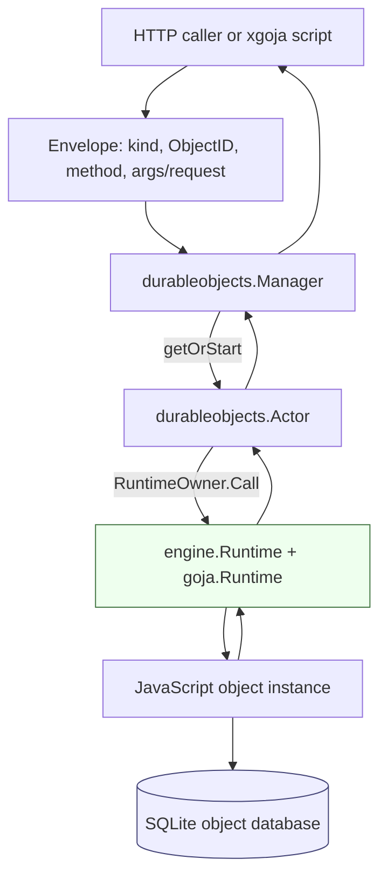
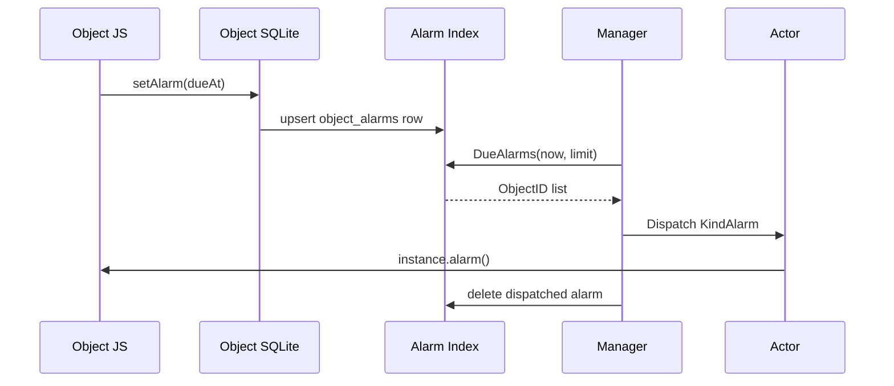

# Go Go Objects: Durable Objects Runtime on Goja

`go-go-objects` is an experimental Durable Objects runtime implemented in Go on top of `goja` and the `go-go-goja` runtime owner infrastructure. The project implements a local, single-process version of the Durable Objects execution model: each object identity resolves to one live JavaScript actor, that actor owns one `goja.Runtime`, and each actor has private SQLite-backed durable storage.

The important design decision is to treat Durable Objects as an **addressable actor runtime**, not as a Cloudflare Workers compatibility layer. The implementation does not attempt to provide the full Workers API, WHATWG request/response classes, WebSocket hibernation, distributed placement, or global uniqueness. It implements the kernel that makes the model useful: stable identity, serialized execution, durable object-local state, RPC dispatch, fetch dispatch, alarms, and eviction.

> [!summary]
> - The runtime maps `(namespace, name)` to a stable `ObjectID`, lazily starts an actor, and dispatches work through that actor's owned `goja.Runtime`.
> - The actor boundary is also the concurrency boundary: JavaScript execution is serialized through `go-go-goja/pkg/engine.Runtime` and `runtimeowner.RuntimeOwner`.
> - SQLite storage is private to each object, while a central alarm index allows evicted objects to be woken when alarms become due.
> - xgoja integration is implemented as a thin provider layer over the core `pkg/durableobjects` package.

## Why this project exists

JavaScript runtimes embedded in Go often start as script execution tools. They can run a file, expose a few native modules, and return a result. That is enough for command-style execution, but it is not enough for stateful application components that must be addressable over time. A counter, a collaborative session, a chat room, a workflow coordinator, or a per-user agent all need the same missing property: callers need a stable way to send work to the same logical object again later.

Durable Objects provide that property by tying identity, execution, memory, and storage together. An object is not just a JavaScript class. It is a JavaScript class instance associated with a durable identity. The host guarantees that work for that identity reaches the same live actor while it is active, and that the actor can recover its durable state after eviction or process restart.

The `go-go-objects` project explores how small this runtime can be when it is built on existing `go-go-goja` primitives. The result is not a large platform. It is a compact kernel with a clear execution path and a constrained JavaScript API.

## Current status

The repository currently contains a working MVP implementation in:

```text
/home/manuel/workspaces/2026-06-12/goja-durable-objects/go-go-objects
```

Implemented code paths include:

- `pkg/durableobjects`: core runtime, actor manager, storage, gateway, alarms, eviction, and tests.
- `pkg/xgoja/providers/durableobjects`: xgoja provider integration.
- `cmd/go-go-objects`: a small runnable demo server with a hard-coded counter object.
- `ttmp/2026/06/12/GOJA-DO-001--implement-durable-objects-for-go-go-goja`: design guide, investigation diary, source research, changelog, and tasks.

The validation command currently passes:

```bash
cd /home/manuel/workspaces/2026-06-12/goja-durable-objects/go-go-objects
go test ./... -count=1
```

The runtime is still an MVP. It intentionally uses CommonJS bundles, synchronous storage calls, JSON-compatible RPC values, and plain fetch DTOs. These constraints make the first version easier to reason about and test.

## The core execution model

A Durable Object request begins with identity. The host receives a namespace, a name, and a dispatch kind. The namespace selects a JavaScript class. The name selects one object instance inside that namespace. Together they form an `ObjectID`.

```go
type ObjectID struct {
    Namespace string `json:"namespace"`
    Name      string `json:"name"`
    Hash      string `json:"hash"`
}
```

The hash is computed from `namespace + "\x00" + name`. The namespace and name remain visible for logs and user-facing behavior, while the hash gives the runtime a stable filesystem-safe storage key.

The dispatch path has four stages:

1. A gateway or module builds an `Envelope` containing object identity and request data.
2. The `Manager` resolves or starts the live `Actor` for the object identity.
3. The `Actor` serializes execution through its owned runtime's `RuntimeOwner`.
4. The JavaScript instance handles `rpc`, `fetch`, or `alarm` dispatch and returns a JSON-compatible result.



This design has one central invariant: object JavaScript state is only touched on the actor runtime's owner thread. The `Actor.instance` field is a `*goja.Object`, but code comments explicitly mark it as owner-thread-only. The manager never receives or stores `goja.Value` results. Values crossing actor boundaries are converted to JSON-compatible Go values.

## Manager: identity, lifecycle, and dispatch

The `Manager` is the public Go entry point for object dispatch. It owns the manifest, bundle, storage factory, live actor map, and lifecycle context.

```go
type Manager struct {
    mu       sync.Mutex
    actors   map[ObjectID]*Actor
    manifest Manifest
    bundle   *Bundle
    storage  StorageFactory
    opts     Options

    ctx    context.Context
    cancel context.CancelFunc
}
```

`Manager.Dispatch` performs three checks before work reaches JavaScript. It rejects a nil manager, rejects an empty `ObjectID`, and verifies that the namespace exists in the manifest. Only then does it call `getOrStart`.

The `getOrStart` method is deliberately small. It checks the live actor map. If the actor exists, it returns it. If not, it starts a new actor, then attempts to install it in the map. If another goroutine installed an actor for the same ID while this actor was starting, the duplicate actor is closed and the existing actor is returned.

This is sufficient for the MVP. It avoids holding the manager lock while opening SQLite, constructing a goja runtime, or evaluating JavaScript. It does not yet prevent duplicate startup work under concurrent first requests. A future version can add `singleflight` if startup duplication becomes measurable.

```go
func (m *Manager) Dispatch(ctx context.Context, env Envelope) (Result, error) {
    if env.ID.IsZero() {
        return Result{}, coded(CodeBadRequest, "dispatch object id is required")
    }
    if _, ok := m.manifest.ClassForNamespace(env.ID.Namespace); !ok {
        return Result{}, coded(CodeUnknownNamespace, "unknown namespace")
    }
    actor, err := m.getOrStart(ctx, env.ID)
    if err != nil {
        return Result{}, err
    }
    return actor.Dispatch(ctx, env)
}
```

The manager also owns explicit maintenance methods:

- `Evict(ctx, id)` removes a specific actor and closes its runtime.
- `EvictIdle(ctx, now)` closes actors whose last-used time exceeds `Options.IdleTimeout`.
- `DispatchDueAlarms(ctx, now, limit)` reads due alarms from the storage factory's alarm index and dispatches `KindAlarm` envelopes.
- `Close(ctx)` cancels the manager lifecycle context and closes all live actor runtimes.

The manager lifecycle context matters because actor runtimes are long-lived relative to individual requests. Earlier implementation notes recorded a correction here: actor runtime lifetimes should not use the startup request context, because that request can end while the actor should remain alive. The current implementation derives actor runtime lifetimes from the manager context.

## Actor: JavaScript instance ownership

An `Actor` is the runtime representation of one live Durable Object. It holds the object identity, class name, engine runtime, JavaScript instance, storage handle, manager pointer, CPU timeout, and activity counters.

```go
type Actor struct {
    id         ObjectID
    className  string
    runtime    *engine.Runtime
    instance   *goja.Object
    storage    Storage
    manager    *Manager
    cpuTimeout time.Duration
    lastUsedNS atomic.Int64
    active     atomic.Int32
}
```

Actor startup performs three operations:

1. Open the object's SQLite storage.
2. Create a new `engine.Runtime` from `go-go-goja`.
3. Evaluate the CommonJS bundle and construct the JavaScript class named by the manifest.

The JavaScript authoring model is intentionally simple:

```js
class Counter {
  constructor(state, env) {
    this.state = state;
    this.env = env;
  }

  increment(by) {
    const current = this.state.storage.get("count") || 0;
    const next = current + (by || 1);
    this.state.storage.put("count", next);
    return next;
  }

  fetch(req) {
    if (req.path === "/count") {
      return { status: 200, body: String(this.state.storage.get("count") || 0) };
    }
    return { status: 404, body: "not found" };
  }
}

exports.objects = { Counter };
```

The bundle must export an `objects` table. The manifest maps namespace names to class names:

```json
{
  "objects": {
    "COUNTER": "Counter"
  }
}
```

The actor constructs the class once per live actor lifetime. It passes two host objects into the constructor:

- `state`, which includes `state.id` and `state.storage`.
- `env`, which includes namespace stubs for object-to-object RPC.

Once constructed, the instance remains in memory until the actor is evicted or the manager closes.

## Dispatch: RPC, fetch, and alarm

The actor dispatch method increments an active counter, updates its last-used timestamp, and schedules JavaScript work through `RuntimeOwner.Call`. The active counter prevents idle eviction from closing an actor while it is handling a request.

```go
func (a *Actor) Dispatch(ctx context.Context, env Envelope) (Result, error) {
    a.active.Add(1)
    a.touch()
    defer func() {
        a.touch()
        a.active.Add(-1)
    }()

    return a.withInterrupt(func() (Result, error) {
        ret, err := a.runtime.Owner.Call(ctx, "durable-object."+string(env.Kind), func(ctx context.Context, vm *goja.Runtime) (any, error) {
            return a.dispatchOnOwner(ctx, vm, env)
        })
        ...
    })
}
```

The dispatch kind selects one of three JavaScript entry points.

| Kind | JavaScript target | Input | Output |
| --- | --- | --- | --- |
| `rpc` | named public method | JSON array or `{ args: [...] }` | JSON-encoded exported value |
| `fetch` | `instance.fetch(req)` | plain request object | plain response object |
| `alarm` | `instance.alarm()` | no input | no response body |

RPC converts JSON input into Go values, then into `goja.Value` arguments. The result is exported from goja and marshaled back to JSON. Fetch uses an explicit lower-case map for the request object because JavaScript code expects fields such as `req.path`, not Go-style `req.Path`. This detail is small but important: host DTOs should be shaped deliberately at the JavaScript boundary.

The CPU budget is implemented through `goja.Runtime.Interrupt`:

```go
timer := time.AfterFunc(a.cpuTimeout, func() {
    a.runtime.VM.Interrupt(fmt.Errorf("durable object CPU budget exceeded"))
})
defer func() {
    timer.Stop()
    a.runtime.VM.ClearInterrupt()
}()
```

This interrupts JavaScript execution. It does not interrupt arbitrary blocking native Go calls. Storage calls still need context-aware database operations and appropriate SQLite timeouts if this becomes production-facing.

## Storage: private SQLite per object

Each object receives a private SQLite database. The default path is derived from storage root, namespace, hash prefix, and full object hash:

```text
<storage-root>/<namespace>/<first-two-hash-chars>/<hash>.sqlite
```

The object database currently creates three tables:

```sql
CREATE TABLE IF NOT EXISTS kv (
  key TEXT PRIMARY KEY,
  value_json BLOB NOT NULL,
  updated_at_ms INTEGER NOT NULL
);

CREATE TABLE IF NOT EXISTS meta (
  key TEXT PRIMARY KEY,
  value_json BLOB NOT NULL,
  updated_at_ms INTEGER NOT NULL
);

CREATE TABLE IF NOT EXISTS alarms (
  singleton INTEGER PRIMARY KEY CHECK (singleton = 1),
  due_at_ms INTEGER NOT NULL,
  updated_at_ms INTEGER NOT NULL
);
```

The JavaScript API is synchronous:

```js
state.storage.get(key)
state.storage.put(key, value)
state.storage.delete(key)
state.storage.list(prefixOrOptions)
state.storage.transaction(fn)
state.storage.setAlarm(timestampMs)
state.storage.getAlarm()
state.storage.deleteAlarm()
```

Synchronous storage is a deliberate MVP choice. Because each actor processes one JavaScript dispatch at a time, a simple read-modify-write sequence is deterministic inside an object:

```js
const current = state.storage.get("count") || 0;
state.storage.put("count", current + 1);
```

The current implementation stores values as JSON blobs. That keeps the boundary explicit and makes the same representation usable for RPC results, storage values, and test assertions. A later version can introduce a richer structured-clone-like format if the JavaScript API needs to preserve values that JSON cannot represent.

## Alarms and eviction

The object-local alarm table records one alarm for the object. That is not enough to wake evicted objects efficiently, because an evicted actor has no open object database and no in-memory timer. The runtime therefore maintains a central alarm index at:

```text
<storage-root>/alarms.sqlite
```

The central index stores object identity and due time:

```sql
CREATE TABLE IF NOT EXISTS object_alarms (
  object_hash TEXT PRIMARY KEY,
  namespace TEXT NOT NULL,
  name TEXT NOT NULL,
  due_at_ms INTEGER NOT NULL,
  updated_at_ms INTEGER NOT NULL
);
```

`state.storage.setAlarm(...)` writes both the object-local alarm record and the central index. `Manager.DispatchDueAlarms(ctx, now, limit)` asks the storage factory for due records, dispatches `KindAlarm` to each object's actor, and deletes the central index entry after successful dispatch.



This design has a known consistency limitation: object-local alarm state and central alarm index updates are not a cross-database atomic transaction. The MVP accepts this because it keeps storage simple. A production version should reconcile the index from object-local alarm records or move alarm metadata into a storage backend that can update both records atomically.

Idle eviction is explicit. `Manager.EvictIdle(ctx, now)` scans live actors and removes actors whose `lastUsedNS` exceeds the configured idle timeout. It does not evict actors with `active > 0`. This was added as a testable invariant: a long-running actor dispatch remains live while the eviction scan runs.

## HTTP gateway

The HTTP gateway is a separate handler, not an extension of `gojahttp.Host`. This distinction matters because `gojahttp.Host` routes requests into one JavaScript runtime, while Durable Objects route requests into a manager that may select many actor runtimes.

The gateway supports two route shapes:

```text
POST /rpc/:namespace/:name/:method
ANY  /fetch/:namespace/:name/*
```

RPC returns a JSON envelope:

```json
{"ok": true, "result": 2}
```

Fetch writes the returned status, headers, and body from the object's `fetch(req)` method. The gateway currently treats object names as one path segment. If names need slashes or other reserved characters, callers must URL-escape them or the route grammar must be expanded.

The demo server mounts the gateway directly:

```go
server := &http.Server{
    Addr:    *addr,
    Handler: durableobjects.NewGateway(mgr, durableobjects.GatewayOptions{DevErrors: true}),
}
```

The built-in demo can be run with:

```bash
go run ./cmd/go-go-objects --addr 127.0.0.1:8787 --storage ./var/durable-objects
```

Then:

```bash
curl -X POST http://127.0.0.1:8787/rpc/COUNTER/global/increment \
  -H 'content-type: application/json' \
  -d '[1]'

curl http://127.0.0.1:8787/fetch/COUNTER/global/count
```

## xgoja provider integration

The xgoja provider lives in:

```text
pkg/xgoja/providers/durableobjects
```

The provider is intentionally thin. It does not reimplement actor logic. It registers an xgoja package, exposes configuration, creates a manager during runtime initialization, and exposes a small JavaScript module.

The provider package ID is:

```text
go-go-objects-durableobjects
```

The module name is:

```text
durableobjects
```

The module exports two functions:

```ts
rpc(namespace: string, name: string, method: string, args?: unknown[]): unknown
fetch(namespace: string, name: string, request: FetchRequest): FetchResponse
```

A generated xgoja script can call:

```js
const objects = require("durableobjects");
const value = objects.rpc("COUNTER", "global", "increment", [2]);
```

Runtime initialization reads configuration from the `durableobjects` section:

```yaml
durableobjects:
  enabled: true
  storage-root: ./var/durable-objects
  bundle-path: ./objects.js
  manifest-path: ./durableobjects.yaml
  cpu-timeout: 2s
  idle-timeout: 5m
  alarm-interval: 1s
  idle-interval: 1m
```

The provider currently loads bundle and manifest from filesystem paths. It starts optional alarm and idle loops tied to the engine runtime context, and it closes the manager when the runtime closes.

This is enough for generated runtimes to call Durable Objects. It is not yet full generated HTTP host integration. The provider defines `GatewayService` and `HostServiceKey`, but automatic gateway mounting into generated Go HTTP servers remains a follow-up.

## Tests as executable documentation

The most important tests live in two files:

```text
pkg/durableobjects/durableobjects_test.go
pkg/xgoja/providers/durableobjects/durableobjects_test.go
```

The core tests verify these properties:

- `ObjectID` hashing is stable.
- A counter persists across actor eviction.
- `/rpc/...` dispatch increments the counter.
- `/fetch/...` dispatch reads the counter.
- A due alarm wakes an evicted actor.
- The central alarm index is cleared after successful dispatch.
- Idle eviction removes inactive actors but preserves durable state.
- Idle eviction does not remove an actor while a dispatch is active.
- Scheduler and evictor `Tick` methods call the manager correctly.

The provider tests verify these properties:

- The provider registers a `durableobjects` module.
- The provider exposes a config section with slug `durableobjects`.
- Runtime initialization requires bundle and manifest paths when enabled.
- A script running inside an xgoja runtime can call `require("durableobjects").rpc(...)` and reach the manager.

These tests are important because the project combines several stateful concerns: runtime ownership, SQLite persistence, context lifetime, and Go-to-JavaScript value conversion. A failure in any of these areas can look like a JavaScript bug unless the tests isolate the boundary.

## Current limitations

The current implementation is an MVP, and the limitations are part of the design:

- The JavaScript authoring model is CommonJS only. It expects `exports.objects = { ClassName }`.
- RPC values are JSON-compatible. `goja.Value` instances do not cross actor boundaries.
- Fetch uses plain objects, not WHATWG `Request` and `Response`.
- Storage is synchronous and JSON-backed.
- Object-local alarms and the central alarm index are not updated atomically across one database transaction.
- The manager startup path can duplicate startup work under concurrent first requests, then close the duplicate actor.
- The xgoja provider does not yet support embedded bundle or manifest assets.
- The xgoja provider does not yet automatically mount the gateway into generated HTTP hosts.
- The `go.mod` currently uses a local `replace` to `../go-go-goja` for workspace development.

These constraints keep the first implementation small. The next design work should decide which constraints are product requirements and which ones should remain permanent boundaries.

## Near-term next steps

The next useful implementation work is concrete and bounded:

1. Add CLI flags for external bundle and manifest paths instead of only the built-in counter demo.
2. Add embedded bundle and manifest support to the xgoja provider.
3. Add automatic gateway mounting for generated HTTP host applications, or document the host-service mounting pattern explicitly.
4. Add reconciliation for alarm index consistency after crashes.
5. Add `singleflight` around actor startup if concurrent first-request duplication becomes visible in tests or benchmarks.
6. Add metrics for actor starts, closes, live actors, dispatched alarms, evictions, storage errors, and JavaScript execution errors.
7. Decide whether the synchronous storage API should remain the default or become a compatibility layer under an async API.

## Working rules for this codebase

The code is easiest to extend safely if these rules remain explicit:

- Do not pass `goja.Value`, `*goja.Object`, or `goja.Callable` between actors.
- Do not hold the manager lock while opening storage, creating runtimes, evaluating bundles, or executing JavaScript.
- Treat `Actor.instance` as owner-thread-only state.
- Keep xgoja provider code as an integration layer over `pkg/durableobjects`; do not move actor runtime behavior into provider packages.
- Keep the MVP API smaller than Cloudflare's API until each missing compatibility feature has a clear testable contract.
- Prefer direct manager methods with deterministic tests before adding background goroutines.

`go-go-objects` is now past the pure design stage. It has the core runtime behavior in code, tests that exercise the main invariants, and an xgoja provider layer that proves the runtime can be embedded into generated Go/JavaScript systems. The remaining work is integration quality: richer configuration, generated host mounting, crash reconciliation, metrics, and a more complete authoring workflow.
