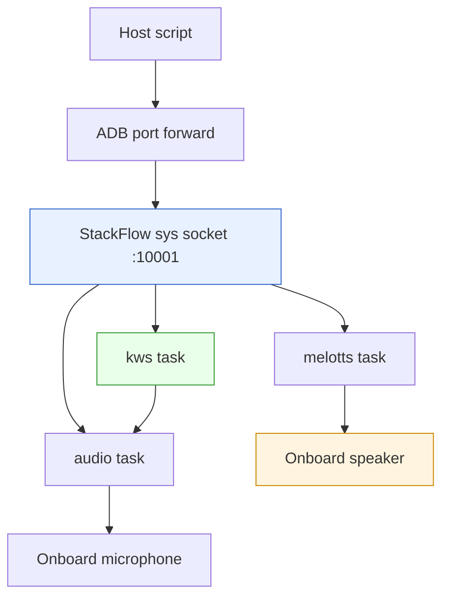
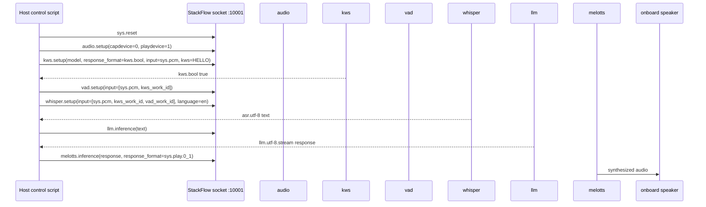

# M5Stack Module LLM: Device-Side Voice Recognition with StackFlow

This report explains the technical shape of a device-side voice recognition demo on the M5Stack Module LLM and Module13.2 LLM Mate. The investigation started with a basic question: can the small AX630C-based module run a local wake-word and speech pipeline, play audio through its own speaker, and be controlled directly from a host machine without relying on cloud APIs? The answer is yes for the two hardware-critical pieces already tested: keyword spotting and onboard speaker playback. The remaining work is to connect the proven pieces into one continuous wake-word → speech-to-text → LLM → text-to-speech loop.

> [!summary]
> - The Module LLM is the AX630C Ubuntu/StackFlow compute device; the LLM Mate is an expansion board that provides Ethernet and debug interfaces.
> - The local StackFlow socket on port `10001` is the most direct control plane for device-side audio, KWS, and TTS tasks.
> - KWS works when `kws.setup` includes the documented `response_format: "kws.bool"` field and the setup socket remains open to receive asynchronous events.
> - Device speaker playback works through `melotts` with `response_format: "sys.play.0_1"`; host-side OpenAI TTS playback is a separate path.

## Why this note exists

Voice recognition on the Module LLM has several overlapping interfaces. The official Arduino examples use the `M5ModuleLLM` library and hide the request format. The OpenAI-compatible API on port `8000` is convenient for host applications, but it returns audio to the caller and does not, by itself, prove that the onboard speaker path works. The StackFlow JSON socket on port `10001` is closer to the device runtime. It exposes individual units such as `audio`, `kws`, `whisper`, `llm`, `tts`, and `melotts` as task-oriented services.

This distinction matters because a voice assistant demo can appear to work while most of the important work is happening on the host. If the host records audio, calls `/v1/audio/transcriptions`, receives a WAV from `/v1/audio/speech`, and plays that WAV through the laptop speakers, then the local Module LLM models may be participating, but the device microphone, KWS pipeline, and speaker output have not all been proven. A device-side demo needs to validate the embedded audio path explicitly.

The investigation therefore separated the system into concrete questions:

- Can the host reach the Module LLM debug and control interfaces?
- Can the Module LLM update its software and models through the LLM Mate network path?
- Can StackFlow load the KWS model and emit a wake-word event?
- Can StackFlow route synthesized audio to the onboard speaker?
- Which scripts and request shapes reproduce the working behavior?

## Hardware roles

The Module LLM and the LLM Mate are not two equivalent computers. The Module LLM is the compute module. It contains the AX630C SoC, memory, eMMC storage, microphone, speaker amplifier path, USB OTG interface, and the Ubuntu/StackFlow runtime. The LLM Mate is an expansion board. It supplies Ethernet, USB-to-serial/debug support, and stable board-to-board connectivity.

The device reported itself through ADB as an Android-like target, including misleading identifiers such as `Nexus_4` and `mako`. Direct checks showed that this is not an Android system:

```bash
adb shell uname -a
adb shell cat /etc/os-release
adb shell 'ls /system 2>/dev/null || echo no /system'
adb shell 'getprop ro.build.version.release 2>/dev/null || echo no android props'
```

The observed platform was Ubuntu 22.04 on a Linux 4.19.125 kernel:

```text
Linux m5stack-LLM 4.19.125 #1 SMP PREEMPT Wed Nov 20 14:43:36 CST 2024 aarch64 GNU/Linux
PRETTY_NAME="Ubuntu 22.04 LTS"
```

The ADB interface is a USB gadget transport. It is useful for shell access, file transfer, and port forwarding, but it does not imply that the module runs Android.

### The network boundary

The Module LLM Kit used here has no WiFi hardware. The Linux interfaces showed only `lo`, `eth0`, and `sit0`; there was no `/sys/class/ieee80211` device. The Ethernet path appeared only after connecting the LLM Mate and plugging Ethernet into its RJ45 port:

```text
2: eth0: <BROADCAST,MULTICAST,UP,LOWER_UP>
    inet 192.168.0.137/24 brd 192.168.0.255 scope global dynamic eth0

default via 192.168.0.1 dev eth0
```

That single observation explains the update workflow. The Module LLM can be managed over USB, but package installation is easiest when the LLM Mate provides Ethernet. Without that network link, `apt update` failed with DNS resolution errors. After Ethernet was connected, the module could reach `repo.llm.m5stack.com` and install the missing StackFlow packages and models.

## Control planes

There are three useful control planes for the Module LLM. They overlap, but they are not interchangeable.

| Interface | Port / transport | What it is good for | What it does not prove by itself |
| --- | --- | --- | --- |
| ADB shell | USB gadget | OS inspection, package updates, service logs, port forwarding | It does not exercise the voice pipeline. |
| OpenAI-compatible API | forwarded `localhost:8000` | Host-side chat, speech-to-text, text-to-speech, model listing | TTS response playback may happen on the host, not the device speaker. |
| StackFlow JSON socket | forwarded `localhost:10001` | Direct task setup for `audio`, `kws`, `melotts`, `whisper`, `llm` | It requires exact request schemas and explicit task lifecycle management. |

The OpenAI API is convenient for quick checks:

```bash
adb forward tcp:8000 tcp:8000
curl -s http://localhost:8000/v1/models | python3 -m json.tool
```

After updates, the model list included `whisper-tiny`, `melotts-en-default`, `melotts-en-us`, `melotts-zh-cn`, and `qwen2.5-0.5B-prefill-20e`. That confirmed the package layer was visible to the API server.

The StackFlow socket is better for hardware validation:

```bash
adb forward tcp:10001 tcp:10001
printf '%s' '{"request_id":"1","work_id":"sys","action":"ping"}' | nc -w 3 localhost 10001
```

A successful response has this shape:

```json
{
  "created": 1781312315,
  "data": "None",
  "error": {"code": 0, "message": ""},
  "object": "None",
  "request_id": "ping-1",
  "work_id": "sys"
}
```

## Software and model updates

The device initially had a mix of current and old packages. Several StackFlow services were installed at version `1.3` while newer versions were available. The important update was not only the voice models; it was also the common runtime library.

The updated packages included:

| Package | Purpose | Result |
| --- | --- | --- |
| `lib-llm` | Shared StackFlow runtime libraries, including ONNX Runtime | Needed for newer KWS/ASR/VAD binaries. |
| `llm-audio` | Audio capture/playback service | Required before KWS/ASR/TTS pipelines. |
| `llm-kws` | Keyword spotting service | Required for wake-word detection. |
| `llm-vad` | Voice activity detection service | Required for the official Whisper pipeline. |
| `llm-whisper` | Whisper speech-to-text service | Required for the official STT example. |
| `llm-melotts` | MeloTTS service | Required for the newer TTS path. |
| `llm-tts` | Legacy TTS service | Still present and useful for comparison. |

The installed model packages included:

| Model package | Runtime model name | Use |
| --- | --- | --- |
| `llm-model-whisper-tiny` | `whisper-tiny` | Local speech-to-text. |
| `llm-model-silero-vad` | `silero-vad` | Voice activity detection. |
| `llm-model-sherpa-onnx-kws-zipformer-gigaspeech-3.3m-2024-01-01` | `sherpa-onnx-kws-zipformer-gigaspeech-3.3M-2024-01-01` | English wake-word spotting. |
| `llm-model-melotts-en-default` | `melotts-en-default` | English TTS. |
| `llm-model-melotts-en-us` | `melotts-en-us` | English TTS variant. |
| `llm-model-melotts-zh-cn` | `melotts-zh-cn` | Chinese TTS. |

The package update exposed two operational details that are worth preserving.

First, the device clock was wrong. It reported a 2023 date, which caused apt and TLS validation to reject current repositories:

```text
Release file ... is not valid yet
Certificate verification failed: The certificate chain uses not yet valid certificate
```

The immediate fix was to set the clock manually:

```bash
adb shell "date -s '2026-06-12 20:35:00'"
```

Second, upgrading KWS/ASR/VAD before upgrading `lib-llm` created a runtime-library mismatch. The services restarted repeatedly with:

```text
/opt/m5stack/bin/llm_kws-1.13: error while loading shared libraries: libonnxruntime.so.1.23.2: cannot open shared object file: No such file or directory
```

Installing the newer `lib-llm` provided `/opt/m5stack/lib/libonnxruntime.so.1.23.2`, after which the services could start.

## Current model state

The installed LLM is `qwen2.5-0.5B-prefill-20e`. The model directory is:

```text
/opt/m5stack/data/qwen2.5-0.5B-prefill-20e/
```

The model config identifies it as a text generation/chat model:

```json
{
  "mode": "qwen2.5-0.5B-prefill-20e",
  "type": "llm",
  "capabilities": ["text_generation", "chat"],
  "input_type": [
    "llm.utf-8",
    "llm.utf-8.stream",
    "llm.chat_completion",
    "llm.chat_completion.stream"
  ],
  "output_type": ["llm.utf-8", "llm.utf-8.stream"]
}
```

This is a small 0.5B model. It is useful for proving the inference path, but it produced weak self-identification when asked what model it was. For a more convincing assistant demo, the next LLM model to evaluate should be one of the available 1B–1.5B packages, such as `llm-model-qwen2.5-1.5b-ax630c`, `llm-model-qwen2.5-1.5b-int4-ax630c`, or `llm-model-deepseek-r1-1.5b-ax630c`.

The firmware image itself appears to be near the public Module LLM image line documented by M5Stack. The official firmware page lists:

```text
M5_LLM_ubuntu_v1.3_20241203-mini
```

That is a full-image flashing path, not the normal package-update path. The package update path was sufficient for the voice experiments described here.

## The StackFlow task model

StackFlow requests are JSON objects with five important fields:

```json
{
  "request_id": "unique-id",
  "work_id": "kws",
  "action": "setup",
  "object": "kws.setup",
  "data": {}
}
```

The `work_id` starts as a unit name, such as `audio`, `kws`, or `melotts`. A successful setup returns a task-specific work id such as `kws.1001` or `melotts.1001`. Subsequent inference or control requests use the returned work id.

The basic sequence is:



This task model has consequences for experiments:

- A reset closes active sockets. A script should send reset on a short-lived connection, wait several seconds, then open a new connection for setup.
- Units can return `task full` when an old task is still allocated. Resetting StackFlow clears the task state during experiments.
- Asynchronous KWS events are easiest to receive on the same socket that performed `kws.setup`. A request helper that closes the socket immediately after setup will miss those events.

## Proving device-side speaker output

Host-side TTS and device-side speaker output are different tests. The OpenAI API can synthesize WAV or MP3 data and return it to the caller. Playing that file with `ffplay` proves that the model can synthesize audio and that the host speaker works. It does not prove that the Module LLM speaker played anything.

The host path was validated first because the laptop output was muted. The diagnostic showed:

```text
Built-in Audio Analog Stereo [vol: 0.62 MUTED]
Mute: yes
ALSA Master ... [off]
```

After unmuting, a generated 1 kHz sine tone and a saved TTS WAV played successfully on the host. This removed one source of confusion before testing the device speaker.

The device speaker path used `melotts` and targeted `sys.play.0_1`:

```json
{
  "request_id": "melotts-speaker-setup",
  "work_id": "melotts",
  "action": "setup",
  "object": "melotts.setup",
  "data": {
    "model": "melotts-en-default",
    "response_format": "sys.play.0_1",
    "input": "tts.utf-8",
    "enoutput": true,
    "enkws": false
  }
}
```

The inference request used the returned work id:

```json
{
  "request_id": "melotts-speaker-infer",
  "work_id": "melotts.1001",
  "action": "inference",
  "object": "tts.utf-8",
  "data": "This audio should be playing from the M five stack module speaker now."
}
```

The successful response explicitly reported the speaker output object:

```json
{
  "created": 1781312588,
  "data": "",
  "error": {"code": 0, "message": ""},
  "object": "sys.play.0_1",
  "request_id": "melotts-speaker-infer-1781312585688",
  "work_id": "melotts.1001"
}
```

The user confirmed hearing audio from the Module LLM speaker during the device-side test. That confirmation is important because the response body itself does not contain the audio bytes when the target is `sys.play.0_1`; the output is routed internally.

## Proving keyword spotting

The first KWS setup attempts failed with a misleading error:

```json
{
  "error": {"code": -5, "message": "Model loading failed."},
  "work_id": "kws"
}
```

The service log revealed the more useful cause:

```text
setup config_body error
load_mode Failed
```

The request body was missing the documented `response_format` field. The corrected request is:

```json
{
  "request_id": "kws-persist-setup",
  "work_id": "kws",
  "action": "setup",
  "object": "kws.setup",
  "data": {
    "model": "sherpa-onnx-kws-zipformer-gigaspeech-3.3M-2024-01-01",
    "response_format": "kws.bool",
    "input": "sys.pcm",
    "enoutput": true,
    "kws": "HELLO"
  }
}
```

The setup succeeded:

```json
{
  "created": 1781312483,
  "data": "None",
  "error": {"code": 0, "message": ""},
  "object": "None",
  "request_id": "kws-persist-setup-1781312477040",
  "work_id": "kws.1001"
}
```

The script kept the setup socket open for asynchronous messages. When the wake word was spoken near the Module LLM microphone, StackFlow emitted:

```json
{
  "created": 1781312535,
  "data": true,
  "error": {"code": 0, "message": ""},
  "object": "kws.bool",
  "request_id": "kws-persist-setup-1781312477040",
  "work_id": "kws.1001"
}
```

The event appeared twice during the test, which means the wake-word model and microphone path were active.

## Reproducible scripts

The ticket stores the important scripts under:

```text
/home/manuel/code/wesen/2026-06-12--llm-mate-voice-recognition/ttmp/2026/06/12/llm-mate-voice--llm-mate-voice-recognition-demo/scripts/
```

The main hardware-validation script is:

```text
05-stackflow-device-audio-kws.py
```

It contains these modes:

| Mode | Purpose |
| --- | --- |
| `ping` | Verify the StackFlow socket is reachable. |
| `speaker` | Try multiple TTS output modes. |
| `speaker-melotts` | Run the focused working device-speaker path. |
| `kws` | Set up KWS and try a simple listener. |
| `kws-persistent` | Keep the KWS setup socket open and receive wake-word events. |

The known-good validation commands are:

```bash
adb forward tcp:10001 tcp:10001
python3 scripts/05-stackflow-device-audio-kws.py ping
python3 scripts/05-stackflow-device-audio-kws.py kws-persistent
python3 scripts/05-stackflow-device-audio-kws.py speaker-melotts
```

For host audio debugging, the ticket also includes:

```text
03-test-host-audio.py
04-check-and-unmute-host-audio.sh
```

Those scripts exist because host mute state can hide whether generated TTS audio is valid. Hardware demos need separate tests for host speakers and device speakers.

## Failure modes and working rules

The investigation produced several durable rules.

### Rule 1: Treat ADB identity as transport metadata

The ADB model name is not a reliable description of the OS. Confirm the platform through shell commands:

```bash
adb shell cat /etc/os-release
adb shell uname -a
adb shell 'ls /system 2>/dev/null || echo no /system'
```

This prevents incorrect assumptions about Android services, Android audio, or Android networking.

### Rule 2: Correct the clock before apt work

The Module LLM may boot with a stale clock. If the clock is wrong, repository metadata and TLS certificates can fail even when the network is working. Check and set the date before package installation:

```bash
adb shell date
adb shell "date -s '2026-06-12 20:35:00'"
```

A production workflow should use NTP after Ethernet is available, but manual correction is enough to unblock package installation.

### Rule 3: Update `lib-llm` with service packages

Newer StackFlow service binaries can depend on newer shared libraries. If KWS/ASR/VAD services fail immediately with missing `.so` files, inspect `ldd` and upgrade `lib-llm`:

```bash
adb shell "ldd /opt/m5stack/bin/llm_kws-1.13 | grep 'not found'"
adb shell "apt-cache policy lib-llm"
adb shell "apt install -y lib-llm"
```

### Rule 4: Use the documented request body exactly

StackFlow errors can be imprecise. A missing request field can appear as a model-loading failure. For KWS, the working setup body includes `model`, `response_format`, `input`, `enoutput`, and `kws`.

### Rule 5: Keep asynchronous task sockets open

A request-response helper is appropriate for `sys.ping` and simple setup calls. It is not sufficient for KWS triggers. KWS emits events after setup, so the socket that performed setup should stay open and continue reading.

### Rule 6: Separate host audio from device audio

Host playback validates returned audio files and host speaker configuration. Device playback validates StackFlow routing to the onboard speaker. Both tests are useful, but they answer different questions.

## The final demo shape

The final voice assistant demo should use the proven sequence and add the missing middle stages.



The diagram shows a host-controlled StackFlow demo rather than a pure Arduino demo. That is the right next step because the host script can log every request and response while the device still performs the audio, KWS, LLM, and TTS work locally. Once the sequence is stable, the same request structure can be ported into an M5Stack host controller using the official Arduino library.

## Current status

The project has reached a useful checkpoint:

- The Module LLM and LLM Mate hardware roles are understood.
- Ethernet updates through the LLM Mate work.
- The device has updated StackFlow packages and the required KWS/Whisper/VAD/MeloTTS models.
- Host audio playback is verified after unmuting the laptop sink.
- Device speaker playback is verified through `melotts` and `sys.play.0_1`.
- KWS is verified with `HELLO` and emits `kws.bool` events.
- The current LLM is the small `qwen2.5-0.5B-prefill-20e` model.

The major unfinished task is integrating VAD, Whisper, LLM inference, and MeloTTS playback into one reliable loop. The individual services are installed, but the final chain still needs a clean script with task cleanup, persistent event handling, and explicit logs for every stage.

## Near-term implementation plan

The next script should avoid experimental branching and encode the known-good sequence directly.

1. Reset StackFlow on a short-lived socket and wait for services to restart.
2. Set up `audio` with onboard microphone and speaker devices.
3. Set up `kws` on a persistent socket with `response_format: "kws.bool"`.
4. On `kws.bool == true`, either:
   - set up VAD and Whisper and listen for ASR output, or
   - use the OpenAI API transcription endpoint as a temporary bridge while keeping KWS and speaker device-side.
5. Send recognized text into `llm`.
6. Send the response into `melotts` with `response_format: "sys.play.0_1"`.
7. Release or reset tasks between turns to avoid `task full`.

The pseudocode is:

```python
reset_stackflow()
audio = setup_audio(capdevice=0, playdevice=1)
kws_socket, kws_id = setup_kws_persistent(
    model="sherpa-onnx-kws-zipformer-gigaspeech-3.3M-2024-01-01",
    response_format="kws.bool",
    input="sys.pcm",
    keyword="HELLO",
)

for event in read_events(kws_socket):
    if event.object == "kws.bool" and event.data is True:
        text = run_stt_after_wake(audio, kws_id)
        answer = run_llm(text)
        speak_with_melotts(answer, response_format="sys.play.0_1")
```

This structure keeps the wake-word path event-driven while leaving room to decide whether STT should be wired through raw StackFlow or the OpenAI-compatible wrapper.

## Open questions

- Should the final demo be a host-controlled Python script, an Arduino sketch for an M5Stack Core host, or both?
- Is `qwen2.5-0.5B-prefill-20e` adequate for the intended demo, or should the device install a 1.5B model before the final integration?
- What is the most stable cleanup strategy for repeated turns: explicit `exit` calls for each unit, or `sys.reset` between turns?
- Does Whisper perform acceptably on the device for live conversational use, or should `sense-voice-small-10s` or the streaming sherpa bilingual ASR model be tested?

## Related files and references

Source repo:

```text
/home/manuel/code/wesen/2026-06-12--llm-mate-voice-recognition
```

Important ticket files:

```text
ttmp/2026/06/12/llm-mate-voice--llm-mate-voice-recognition-demo/reference/01-investigation-diary.md
ttmp/2026/06/12/llm-mate-voice--llm-mate-voice-recognition-demo/scripts/05-stackflow-device-audio-kws.py
ttmp/2026/06/12/llm-mate-voice--llm-mate-voice-recognition-demo/sources/m5stack-module-llm-api.md
ttmp/2026/06/12/llm-mate-voice--llm-mate-voice-recognition-demo/sources/m5stack-voice-assistant-example.md
ttmp/2026/06/12/llm-mate-voice--llm-mate-voice-recognition-demo/sources/m5stack-llm-firmware-upgrade.md
```

Relevant commits:

```text
3f261d3582bd603796f41f2c070bb45e1a86cb95 Add Module LLM voice recognition research ticket
fa6641d5f707aadafaa5bfba4ff4782a1980f6c5 Record Module LLM KWS and speaker validation
```

The most important practical result is the validated StackFlow shape: persistent KWS setup for wake-word events, and `melotts` routed to `sys.play.0_1` for device speaker output. Those two facts make the rest of the voice assistant pipeline an integration task rather than an unknown hardware problem.

## Update: first integrated voice-assistant loop

After the initial report was written, the project advanced from separate KWS and speaker validation to a first integrated device-side loop. The new script is:

```text
/home/manuel/code/wesen/2026-06-12--llm-mate-voice-recognition/ttmp/2026/06/12/llm-mate-voice--llm-mate-voice-recognition-demo/scripts/06-device-voice-assistant-loop.py
```

The script drives StackFlow directly through the forwarded socket on port `10001`. It resets StackFlow, configures onboard audio, starts KWS, starts ASR, starts the installed Qwen2.5 0.5B LLM, starts MeloTTS, then waits for speech events. The successful run proved the complete path once:

```text
KWS/ASR path: device microphone -> StackFlow ASR event
ASR output:    " hello"
LLM output:    "Hello."
TTS output:    object "sys.play.0_1"
```

The important engineering change in this iteration was response correlation. The first version of the loop assumed that the first JSON object received after a setup request was the matching response. That assumption was wrong. StackFlow can emit delayed responses and side events on the same socket, especially when the socket is kept open for asynchronous KWS and ASR messages. The corrected script waits for a JSON object whose `request_id` matches the request being sent and logs non-matching objects as side events.

The fixed setup sequence now observes the expected work ids:

```text
audio.setup   -> audio
kws.setup     -> kws.1001
asr.setup     -> asr.1002
llm.setup     -> llm.1003
melotts.setup -> melotts.1004
```

A later validation run set up cleanly but timed out waiting for another wake/ASR event. That means the system is no longer blocked on package installation, model loading, or speaker output; the remaining work is robustness. The next implementation phase should focus on cleanup commands, repeated-turn handling, and model quality.

### Revised implementation sequence

The current known-good control pattern is:

```python
reset_stackflow()
setup_audio(capdevice=0, playdevice=1)
setup_kws(model="sherpa-onnx-kws-zipformer-gigaspeech-3.3M-2024-01-01",
          response_format="kws.bool",
          input="sys.pcm",
          keyword="HELLO")
setup_asr(model="sherpa-ncnn-streaming-zipformer-20M-2023-02-17",
          response_format="asr.utf-8",
          input="sys.pcm",
          enkws=True)
setup_llm(model="qwen2.5-0.5B-prefill-20e",
          response_format="llm.utf-8.stream")
setup_melotts(model="melotts-en-default",
              response_format="sys.play.0_1")

for event in stackflow_events():
    if event.object == "asr.utf-8":
        answer = llm_infer(event.data)
        melotts_speak(answer)
```

This is now the baseline from which larger models and alternative STT paths should be evaluated.

### Immediate next experiments

The next phase should do three things in order:

1. Add explicit cleanup for active StackFlow tasks. Repeated resets work for experiments, but a reusable demo should be able to exit `audio`, `kws`, `asr`, `llm`, and `melotts` tasks intentionally.
2. Test a larger LLM model. The current `qwen2.5-0.5B-prefill-20e` model is enough to prove the route, but it gives minimal answers. The best next candidates are `qwen2.5-1.5B` and `deepseek-r1-1.5B` variants from the M5Stack apt repository.
3. Compare ASR options after the LLM path is stable. The built-in `asr` service is currently easier to integrate than Whisper/VAD, but Whisper may produce better recognition quality for some phrases.

The current project state is therefore: hardware path proven, first loop proven once, quality and robustness still under active development.
