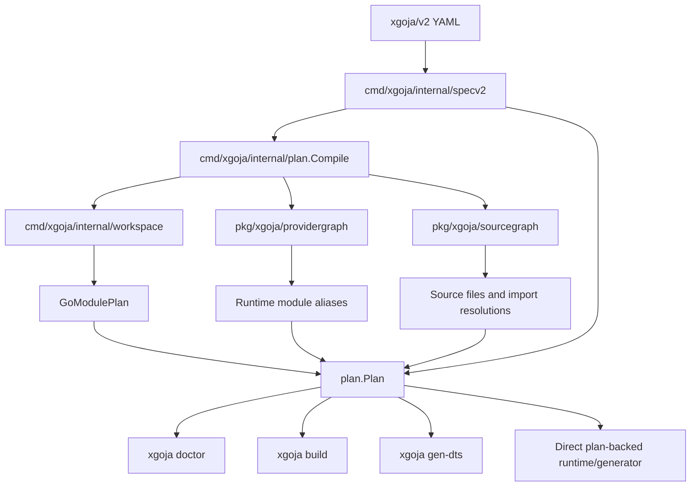
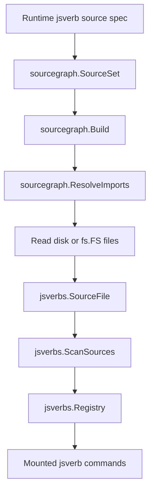

# New XGoja: Source Graphs, Provider Plans, and the V2 Runtime Compiler

This report explains the design and implementation of the new `xgoja` architecture in `go-go-goja`. The work starts from a concrete TypeScript and jsverbs problem, then grows into a native `xgoja/v2` planner that understands providers, Go modules, runtime-module aliases, source sets, command surfaces, generated artifacts, migration from v1, and TypeScript bundling from both disk and embedded filesystems.

> [!summary]
> - The new architecture treats xgoja as a Go-backed JavaScript runtime compiler: it plans Go provider packages, goja-executed JavaScript/TypeScript source, command surfaces, declarations, assets, and generated binaries before execution or generation.
> - The core implementation is split into explicit layers: `specv2` for the user-facing schema, `workspace` for Go module resolution, `providergraph` for selected provider capabilities, `sourcegraph` for source files and imports, and `plan` for the composed v2 build/runtime view.
> - TypeScript support is no longer only a direct filesystem feature. `jsverbs` now carries `fs.FS` origin metadata, and `pkg/tsscript` can bundle provider or embedded TypeScript helper imports without materializing files on disk.
> - The current command cutover is incremental: `doctor`, `build`, and `gen-dts` can consume v2 specs through the planner, while `build` and `gen-dts` still bridge into the existing generator until direct `plan.Plan` consumption is finished.

The source repository is `/home/manuel/workspaces/2026-06-10/goja-xgoja-ts-support/go-go-goja`. The main architecture ticket is `/home/manuel/workspaces/2026-06-10/goja-xgoja-ts-support/go-go-goja/ttmp/2026/06/12/XGOJA-ARCH-001--xgoja-source-graph-and-bundler-architecture/`.

The most important ticket documents are:

- `design/01-xgoja-source-graph-and-bundler-architecture.md`, the original architecture proposal for source graphs, provider graphs, plans, and workspace resolution.
- `design/02-xgoja-v2-spec-and-migration-architecture.md`, the v2 schema and migration architecture.
- `reference/01-investigation-diary.md`, the chronological implementation diary through the current command cutover.

## Why the architecture changed

The first TypeScript implementation made `.ts` files executable in `xgoja run`, jsverbs, and HTTP hot reload. That implementation was useful because it introduced a small compiler facade in `pkg/tsscript` and kept the existing goja runtime intact. TypeScript was compiled before goja saw the source. The runtime did not become Node.js, and the provider module system stayed Go-backed.

That first implementation also exposed a structural issue. xgoja had several places that needed to answer the same questions, but each place answered them locally:

- Which files belong to this source set?
- Is a source file loaded from disk, from an embedded filesystem, or from a provider-shipped `fs.FS`?
- Does `import "./helper"` resolve to another local source file?
- Does `require("express")` refer to a Go-backed runtime module selected by the xgoja spec?
- Which Go modules are required by selected providers?
- Should a generated temporary `go.mod` use a local replacement discovered from `go.work`?
- Which source roots should hot reload watch?
- Which runtime-module aliases should TypeScript externalize rather than bundle?

Before the new architecture, these answers lived in multiple command paths. `ScanDir` knew about disk files. `ScanFS` knew about embedded/provider files, but initially did not preserve enough origin metadata for TypeScript bundling. `xgoja run` derived TypeScript externals from selected runtime modules. jsverbs TypeScript configuration relied more heavily on explicit `typescript.external` fields. Generated builds copied embedded source directories and rewrote runtime paths. `gen-dts` created a temporary Go module with its own module-resolution behavior. `doctor` validated the build spec but did not show the full module/source plan.

The design shift is to make planning explicit. xgoja now moves toward a pipeline where a spec is loaded, defaults are applied, Go modules are resolved, providers are selected, source sets are discovered, imports are classified, commands and artifacts are planned, and only then do generation, declaration generation, doctor output, or runtime command mounting consume the result.

The key point is not that every implementation detail changed at once. The key point is that the system now has an architectural boundary named `Plan`.

## The design rule for v2

The v2 design uses one central rule:

> If code runs in goja, xgoja may compile or bundle it. If code runs somewhere else, build it outside xgoja and include the result as static assets or generated files.

This rule keeps v2 small. The old draft could have become a general JavaScript bundler configuration with fields for platform, format, target, package manager, install policy, browser loaders, polyfills, and other settings. The implemented v2 schema deliberately avoids that surface. xgoja owns the compiler profile for code executed by goja. Users declare intent: providers, runtime modules, goja-executed sources, command surfaces, workspace behavior, and artifacts.

A normal v2 spec therefore looks like this:

```yaml
schema: xgoja/v2
name: typescript-jsverbs

app:
  name: typescript-jsverbs

go:
  module: xgoja.generated/typescript-jsverbs
  version: "1.26"

workspace:
  mode: auto

providers:
  - id: http
    import: github.com/go-go-golems/go-go-goja/pkg/xgoja/providers/http

runtime:
  modules:
    - provider: http
      name: express
      as: express

sources:
  - id: sites
    kind: jsverbs
    from:
      dir: ./verbs
    language: typescript
    compile:
      mode: runtime
      bundle: true

commands:
  - id: verbs
    type: builtin.jsverbs
    sources: [sites]

  - id: serve
    type: provider.command-set
    provider: http
    name: serve
    mount: serve
    sources: [sites]

artifacts:
  - id: binary
    type: binary
    output: dist/typescript-jsverbs

  - id: declarations
    type: dts
    output: js/types/xgoja-modules.d.ts
    strict: true
```

There are no ordinary fields for `platform: browser`, `format: esm`, or `target: es2022`. Those are not user-facing decisions for xgoja-managed goja code in the v2 MVP. If a future use case needs an escape hatch, it should be added explicitly and narrowly.

## The implementation sequence

The implementation was split into small layers. Each layer either introduced one planning primitive or moved one existing command path closer to v2.

| Step | Area | Main result |
| --- | --- | --- |
| 1-5 | Architecture and task planning | Defined xgoja as a Go-backed JavaScript runtime compiler and expanded the v2 hard-cutover backlog. |
| 6 | `specv2` | Added the native strict v2 schema package. |
| 7-9 | Migration | Added v1-to-v2 conversion, `xgoja migrate-spec`, migration coverage, and user docs. |
| 10 | `workspace` | Added Go module/workspace resolution from `go.work`, explicit replacements, CLI replacements, and versions. |
| 11 | `providergraph` | Added provider selection, runtime module alias planning, command-set resolution, and TypeScript descriptor checks over existing provider APIs. |
| 12 | `sourcegraph` | Added source-set discovery, disk/provider origins, local import resolution, runtime alias classification, and path escape diagnostics. |
| 13-15 | TypeScript source origins | Added `fs.FS` TypeScript bundling, carried `RootFS` through jsverbs, and routed app-level jsverb scanning through `sourcegraph`. |
| 16 | `plan` | Added the v2 plan compiler that composes spec, workspace, provider graph, source graph, commands, artifacts, and runtime aliases. |
| 17-18 | Generated module planning | Wired workspace `GoModulePlan` into generated `go.mod` rendering, build, gen-dts, and doctor module diagnostics. |
| 19 | V2 doctor | Routed v2 specs through planner-backed doctor diagnostics. |
| 20 | V2 build | Let `xgoja build` accept v2 specs through a bridge into the existing generator. |
| 21 | V2 gen-dts | Let `xgoja gen-dts` accept v2 specs through the same planner bridge and sidecar model. |

Important implementation commits include:

- `2b9873166f7bf464f181d347f21fbf3a357aec47` — `jsverbs: bundle TypeScript sources from fs`
- `d8b40f02977f0f47e6f04f2c2215547847597fb8` — `xgoja: scan jsverbs through source graph`
- `5b4bfd1429fca081642afe0364e9fd0fef232e93` — `xgoja: render generated go.mod from workspace plan`
- `a9497668c7b7d4ec00205d1f124390e746594d1f` — `xgoja: show module plan in doctor`
- `309d8e92c29ebff3435b46996a96023d01330013` — `xgoja: route v2 specs through doctor planner`
- `65b4a122b54e5c4df1d2b9cbbfd06cfbda3ecb2d` — `xgoja: build v2 specs through planner bridge`
- `12ebd15c29fd340b0e53401fe65206a6ddcd0a9d` — `xgoja: generate dts from v2 planner bridge`

## The new architecture at a glance

The new architecture has five planning layers. Each layer has a narrow responsibility.



`specv2` answers what the user declared. `workspace` answers where required Go modules come from. `providergraph` answers which provider capabilities are selected. `sourcegraph` answers which source files exist and how their imports resolve. `plan` composes those answers into one object that commands can consume.

The current plan type is intentionally transparent:

```go
// cmd/xgoja/internal/plan/plan.go
type Plan struct {
    Config         specv2.Config
    GoModules      *workspace.Plan
    ProviderGraph  *providergraph.Graph
    SourceGraph    *sourcegraph.Graph
    Commands       []CommandPlan
    Artifacts      []ArtifactPlan
    RuntimeAliases []string
}
```

This shape preserves the subgraphs instead of hiding them behind a single flattened DTO. That matters during the cutover because `doctor` wants diagnostic rows, `build` wants generated `go.mod` inputs, `gen-dts` wants provider information, and the future direct generator will want source and artifact plans.

## The v2 schema: intent, not mechanics

`cmd/xgoja/internal/specv2/types.go` defines the native schema. Its package comment states the design directly: v2 is an intent-level planner input for providers, Go-backed runtime modules, goja-executed sources, command surfaces, and generated artifacts. It does not expose general-purpose browser or Node bundler knobs.

The top-level type is concise:

```go
type Config struct {
    Schema    string                 `yaml:"schema" json:"schema"`
    Name      string                 `yaml:"name" json:"name"`
    App       AppSpec                `yaml:"app,omitempty" json:"app,omitempty"`
    Go        GoSpec                 `yaml:"go,omitempty" json:"go,omitempty"`
    Workspace WorkspaceSpec          `yaml:"workspace,omitempty" json:"workspace,omitempty"`
    Providers []ProviderSpec         `yaml:"providers,omitempty" json:"providers,omitempty"`
    Runtime   RuntimeSpec            `yaml:"runtime,omitempty" json:"runtime,omitempty"`
    Sources   []SourceSpec           `yaml:"sources,omitempty" json:"sources,omitempty"`
    Commands  []CommandSurfaceSpec   `yaml:"commands,omitempty" json:"commands,omitempty"`
    Artifacts []ArtifactSpec         `yaml:"artifacts,omitempty" json:"artifacts,omitempty"`
    Profiles  map[string]ProfileSpec `yaml:"profiles,omitempty" json:"profiles,omitempty"`
    BaseDir   string                 `yaml:"-" json:"-"`
}
```

The separation is important:

- `providers` are Go packages that contribute xgoja capabilities.
- `runtime.modules` selects Go-backed CommonJS modules from those providers.
- `sources` declares jsverbs, scripts, help, and assets with explicit origins.
- `commands` declares user-facing command surfaces.
- `artifacts` declares generated outputs such as binaries and declaration files.
- `workspace` declares local Go module resolution behavior.

The source shape encodes the central source-set idea:

```go
type SourceSpec struct {
    ID         string         `yaml:"id" json:"id"`
    Kind       SourceKind     `yaml:"kind" json:"kind"`
    From       SourceFromSpec `yaml:"from" json:"from"`
    Include    []string       `yaml:"include,omitempty" json:"include,omitempty"`
    Exclude    []string       `yaml:"exclude,omitempty" json:"exclude,omitempty"`
    Extensions []string       `yaml:"extensions,omitempty" json:"extensions,omitempty"`
    Language   string         `yaml:"language,omitempty" json:"language,omitempty"`
    Compile    *CompileSpec   `yaml:"compile,omitempty" json:"compile,omitempty"`
}

type SourceFromSpec struct {
    Dir       string              `yaml:"dir,omitempty" json:"dir,omitempty"`
    Provider  *ProviderSourceRef  `yaml:"provider,omitempty" json:"provider,omitempty"`
    Workspace *WorkspaceSourceRef `yaml:"workspace,omitempty" json:"workspace,omitempty"`
}
```

A source can come from a local directory, a provider source reference, or a workspace module path. This gives the planner enough information to build a graph without forcing every command to rediscover origins differently.

The loader uses strict YAML fields. That is not a cosmetic choice. Strict loading is how the v2 implementation enforces the simplified design. A spec that tries to put old broad compiler settings under `compile.platform` is rejected instead of silently ignored.

## Migration: v1 remains input, not the long-term runtime schema

The hard cutover does not delete the existing world immediately. It introduces a migration path and then moves normal commands to v2 planning.

The migration package maps old `buildspec.BuildSpec` values into `specv2.Config`:

| V1 concept | V2 concept |
| --- | --- |
| `packages[]` | `providers[]` |
| `modules[]` | `runtime.modules[]` |
| builtin command toggles | `commands[]` entries such as `builtin.run` and `builtin.jsverbs` |
| `commandProviders[]` | `commands[]` entries with `type: provider.command-set` |
| `jsverbs[]` | `sources[]` with `kind: jsverbs` |
| `help.sources[]` | `sources[]` with `kind: help` |
| `assets[]` | `sources[]` with `kind: assets` plus artifacts |
| `target` | `artifacts[]` |
| `packages[].replace` | provider module replacement plus workspace warning |

The command surface is `xgoja migrate-spec`. It supports separate output, in-place migration, backups, check mode, and warning output. The important design point is that v1 parsing is isolated here. Long-term, normal `doctor`, `build`, and `gen-dts` should reject v1 with a migration diagnostic rather than treating v1 as a parallel execution model.

The migration tests cover all current `examples/xgoja/*/xgoja.yaml` files. The coverage deliberately unmarshals example YAML directly instead of requiring every external `replace` target to exist on the local machine. That makes migration coverage about schema conversion rather than about whether sibling provider checkouts happen to be present.

The migration also strips old TypeScript compiler-profile details. Runtime module aliases that were previously listed as TypeScript externals are reported as warnings because v2 derives them from selected runtime modules.

## Workspace resolution: planning generated Go modules

xgoja generates temporary Go modules for builds and declaration sidecars. Those modules need to import the selected provider packages and the xgoja runtime packages. During local development, many of those imports should resolve to workspace-local directories instead of downloaded versions.

The new workspace package, `cmd/xgoja/internal/workspace`, handles this. It discovers `go.work`, reads workspace modules, reads each module's `go.mod`, and produces a `GoModulePlan` for every required module.

The resolver precedence is explicit:

1. Explicit replacement in the spec.
2. CLI replacement.
3. Local module discovered from `go.work`.
4. Versioned module requirement.

That precedence supports both stable generated builds and local development. A generated `go.mod` can now include a versioned requirement plus a local replace when the resolver finds a workspace module:

```go
require github.com/go-go-golems/go-go-goja v0.0.0

replace github.com/go-go-golems/go-go-goja => /home/manuel/workspaces/2026-06-10/goja-xgoja-ts-support/go-go-goja
```

The implementation was first added as an independent resolver, then wired into existing generated module rendering. `generate.Options` now accepts `GoModules *workspace.Plan`, and `RenderGoMod` can render planned requirements and replacements. Both `xgoja build` and `xgoja gen-dts` sidecars use the same plan, so generated binaries and declaration generation no longer drift in module-resolution behavior.

`xgoja doctor` also reports module-resolution rows:

- `module_path`
- `version`
- `local_dir`
- `resolution_kind`
- `resolution_source`
- `required_by`

This is a practical diagnostic improvement. Users can see what the generated Go module will do before running a full build.

## Provider graph: selected capabilities over existing provider APIs

Provider packages are central to xgoja. A provider can contribute Go-backed CommonJS modules, command sets, jsverb source trees, help sources, assets, TypeScript descriptors, host services, and runtime initializers. The new architecture does not replace this API. It builds a graph over it.

`pkg/xgoja/providergraph` validates selected providers, selected runtime modules, aliases, and provider command sets against the existing `providerapi.ProviderRegistry`.

The provider graph has several jobs:

- It ensures a selected module belongs to a selected provider.
- It computes the runtime alias for each selected module.
- It rejects duplicate aliases.
- It resolves provider command sets.
- It can expose TypeScript module descriptors for declaration generation.
- It gives the source graph the list of runtime aliases that should be treated as Go-backed module imports.

The alias rule matters. A runtime module can be selected with an explicit `as`, can have a provider default alias, or can fall back to its module name. Once the graph computes that alias, TypeScript and sourcegraph code should not require users to duplicate it in `typescript.external`.

This is the point where xgoja differs from a normal JavaScript-only bundler. A bare import such as `express` can be a Go-backed runtime module. The planner must know that before import resolution runs.

## Source graph: files, origins, and imports

`pkg/xgoja/sourcegraph` gives xgoja a single source inventory. It represents source sets, source files, origins, and import resolutions.

The core types are small:

```go
type SourceSet struct {
    ID         string
    Kind       SourceKind
    Origin     Origin
    Include    []string
    Exclude    []string
    Extensions []string
    Language   string
}

type Origin struct {
    Kind     OriginKind
    Dir      string
    FS       fs.FS
    Root     string
    Provider string
    Source   string
}

type File struct {
    SourceSetID string
    Kind        SourceKind
    Origin      Origin
    OriginKind  OriginKind
    Path        string
    AbsPath     string
}
```

The graph supports disk origins, provider `fs.FS` origins, and embedded `fs.FS` origins. Disk files keep an absolute path. Filesystem-backed files keep the origin and a source-set-relative path.

The stable key is not an absolute path. It is the source-set ID plus the file's logical path. This is important because provider and embedded files may not have meaningful OS paths. A provider source file under `verbs/site.ts` should be represented as `site.ts` inside the provider source set, not as an implementation-specific embedded path.

Import resolution is deliberately focused. It recognizes local relative imports and runtime module aliases. Unknown bare imports fail during planning.

```go
func (g *Graph) resolveFileImports(file File, contents string) ([]ImportResolution, error) {
    imports := parseImports(contents)
    out := make([]ImportResolution, 0, len(imports))
    for _, specifier := range imports {
        if strings.HasPrefix(specifier, ".") {
            target, err := g.resolveLocal(file, specifier)
            if err != nil {
                return nil, err
            }
            out = append(out, ImportResolution{From: file.Path, Specifier: specifier, Kind: ImportLocal, TargetPath: target.Path})
            continue
        }
        if g.aliases[specifier] {
            out = append(out, ImportResolution{From: file.Path, Specifier: specifier, Kind: ImportRuntime, Alias: specifier})
            continue
        }
        return nil, fmt.Errorf("%s imports unknown bare specifier %q", file.Path, specifier)
    }
    return out, nil
}
```

Local resolution probes TypeScript and JavaScript extensions plus index files, and it rejects path escapes from the source root. This gives source planning concrete safety properties:

- `./helper` can resolve to `helper.ts`, `helper.js`, or an index file.
- `../outside` is rejected if it escapes the source set.
- `express` is accepted only if `express` is a selected runtime module alias.
- Unknown bare imports are errors until package bundling is intentionally supported.

The import parser is intentionally lightweight. It is good enough for planner diagnostics and source graph construction. Execution and bundling still rely on the existing jsverbs parser and esbuild where appropriate.

## TypeScript from `fs.FS`: the embedded/provider fix

The concrete implementation issue behind the architecture was TypeScript helper imports from embedded or provider-shipped jsverb sources. Disk TypeScript worked because esbuild could resolve imports from a real `ResolveDir`. Provider and embedded files are loaded from `fs.FS`, so they do not have the same disk directory semantics.

The new primitive is `pkg/tsscript.BundleVirtualEntryFS`:

```go
func BundleVirtualEntryFS(root fs.FS, src Source, opts Options) (*Artifact, error) {
    if root == nil {
        return nil, fmt.Errorf("typescript fs bundle root is required")
    }
    entryPath := cleanVirtualPath(sourcePath(src))
    loader := LoaderForPath(entryPath)
    plugin := fsResolverPlugin(root)
    result := api.Build(api.BuildOptions{
        Stdin: &api.StdinOptions{
            Contents:   string(src.Contents),
            ResolveDir: "/" + path.Dir(entryPath),
            Sourcefile: entryPath,
            Loader:     loader,
        },
        Bundle:   true,
        Write:    false,
        External: append([]string(nil), opts.External...),
        Plugins:  []api.Plugin{plugin},
        // defaults omitted
    })
    return artifactFromBuildResult("typescript fs bundle", entryPath, result)
}
```

The esbuild plugin intercepts relative imports, resolves them against logical paths inside the `fs.FS`, probes known extensions and index files, and loads the matched file back from the filesystem. Runtime aliases stay external, so a provider-backed import such as `express` remains a `require("express")` call for the Go-backed runtime module.

This primitive is wired into jsverbs through origin metadata. `pkg/jsverbs` now carries `RootFS` on `SourceFile`, `FileSpec`, and `RuntimeTransformInput`. `ScanFS` creates an `fs.Sub` root and attaches it to every source file. The TypeScript runtime transform checks whether `RootFS` exists. If it does, it uses `BundleVirtualEntryFS`; otherwise disk sources keep using the disk bundler.

This preserves the existing jsverbs runtime behavior while fixing the missing source-origin information. It also keeps overlay-before-bundling behavior intact. The runtime transform receives the original TypeScript plus the jsverbs prelude and overlay, then bundles that composed source.

The important invariant is:

> jsverb metadata scanning may transform TypeScript to JavaScript for parsing, but runtime loading compiles the original TypeScript source plus the jsverbs overlay so invocation registration remains correct.

## Graph-backed jsverbs scanning

After `RootFS` metadata existed, app-level jsverbs scanning moved from direct `ScanDir` and `ScanFS` calls to a sourcegraph-backed adapter. The lower-level jsverbs helpers still exist, but xgoja app command mounting now discovers files through `pkg/xgoja/sourcegraph` first.

The flow is:



This was a careful bridge, not a rewrite of jsverbs. jsverbs still owns parsing command metadata and creating runtime loaders. The app layer now owns source discovery and import classification before handing file contents into `jsverbs.ScanSources`.

One important bug appeared during the first full test run after this change. Generated-program tests lost provider/http jsverb command fields and failed with errors such as:

```text
Error: unknown flag: --name
Error: unknown flag: --http-listen
```

The cause was strict sourcegraph import classification during scan-time. Provider source files referenced provider modules that were not selected in the immediate runtime module list used by the scan. The metadata parser therefore did not see the command fields expected by tests. The fix was to pass all registered provider module names/default aliases as scan-time runtime aliases, while keeping actual runtime initialization responsible for whether a module is selected when invoked.

That distinction is precise:

- Scan-time import classification should not lose command metadata merely because a provider source references a known provider module.
- Runtime execution should still fail if a verb tries to require a module that was not selected into the runtime.

## Plan compilation: the composition boundary

`cmd/xgoja/internal/plan.Compile` is the current composition boundary for v2.

Its work is sequential:

```go
func Compile(opts Options) (*Plan, error) {
    cfg := opts.Config
    if cfg.BaseDir == "" {
        cfg.BaseDir = opts.StartDir
    }
    if report := specv2.Validate(&cfg); report.HasErrors() {
        return nil, fmt.Errorf("invalid xgoja/v2 spec")
    }

    providerGraph, err := buildProviderGraph(opts.Providers, cfg)
    goModules, err := buildGoModulePlan(cfg, opts.StartDir, opts.CLIReplace)
    sourceGraph, err := buildSourceGraph(cfg, opts.Providers, goModules, providerGraph.RuntimeModuleAliases())

    err = sourceGraph.ResolveImports(func(file sourcegraph.File) ([]byte, error) {
        return readSourceGraphFile(file)
    })

    return &Plan{
        Config:         cfg,
        GoModules:      goModules,
        ProviderGraph:  providerGraph,
        SourceGraph:    sourceGraph,
        Commands:       commandPlans(cfg.Commands),
        Artifacts:      artifactPlans(cfg.Artifacts),
        RuntimeAliases: providerGraph.RuntimeModuleAliases(),
    }, nil
}
```

This order matters. Provider graph must run before source import resolution because sourcegraph needs runtime aliases. Workspace planning must run before workspace-backed sources can be resolved to local directories. Source graph resolution must run before doctor/build paths can report source errors.

The planner also normalizes provider package import paths to module roots. This fixed a concrete gen-dts failure where the planner initially produced a bad requirement like:

```text
github.com/go-go-golems/go-go-goja/pkg/xgoja/providers/core v0.0.0
```

The requirement should be for the module root, not the provider package import path. The current inference trims common package path markers such as `/pkg/`, `/cmd/`, and `/internal/`, and handles `/xgoja` suffixes. This is an interim rule. A future v2 schema may add an explicit provider module path field to avoid inference.

## Command cutover: doctor, build, and gen-dts

The command cutover is incremental. This is deliberate because `build` and `gen-dts` already have substantial generator and sidecar behavior.

### `xgoja doctor`

`doctor` is the safest command to route through v2 first. It now detects `schema: xgoja/v2`, loads the strict v2 config, creates a synthetic provider registry, compiles a plan, and emits diagnostic rows for modules and sources.

The synthetic registry exists because the standalone xgoja CLI cannot dynamically import arbitrary provider packages at doctor time. It can validate spec structure, workspace resolution, disk source planning, runtime aliases, command/artifact shape, and some provider references, but it cannot validate real provider code unless that provider is linked in or described by a future manifest.

That limitation should be visible in future diagnostics. It is correct as an interim bridge, but it is not a substitute for provider manifests or generated sidecar validation.

### `xgoja build`

`build` now accepts v2 specs through `loadBuildSpecOrV2Plan`. For v2 input, it compiles the plan and converts the result into the existing generator `buildspec` shape through `cmd/xgoja/v2_bridge.go`.

The bridge maps:

- v2 providers to generator packages;
- v2 runtime modules to generator modules;
- v2 jsverb/help/asset sources to old source sections;
- v2 builtin commands to old command toggles;
- v2 provider command sets to old command-provider entries;
- the first v2 binary artifact to the current singular build target.

This is not the final generator architecture. It is a cutover bridge that lets v2 specs exercise the planner and existing generator without rewriting output generation in one step.

### `xgoja gen-dts`

`gen-dts` also accepts v2 through the planner bridge. It still uses a generated sidecar module that imports real provider packages. That sidecar model is valuable because declaration generation must see actual provider registrations and TypeScript descriptors.

The current v2 gen-dts implementation still requires `--out`. A near-term improvement is to use the v2 `artifacts` entry with `type: dts` as the default output when `--out` is omitted.

## What is implemented today

The current implementation supports several important behaviors:

- Native `schema: xgoja/v2` DTOs with strict loading, defaults, validation, and rendering.
- V1-to-v2 migration via `xgoja migrate-spec`.
- Migration coverage for current example specs.
- Go workspace resolution from `go.work` and explicit/CLI replacements.
- Generated `go.mod` rendering from a shared `GoModulePlan`.
- Provider graph validation over existing provider APIs.
- Source graph discovery for disk, provider `fs.FS`, and embedded origins.
- Local import resolution with extension/index probing and path escape prevention.
- Runtime module alias classification for source imports.
- `fs.FS` TypeScript bundling for provider/embedded helper imports.
- App-level jsverbs scanning through sourcegraph before jsverbs metadata parsing.
- V2 `plan.Compile` as a shared composition boundary.
- V2-aware `doctor`, `build`, and `gen-dts` command paths.

The implementation also keeps existing working behavior in place. Lower-level `jsverbs.ScanDir`, `ScanFS`, and `ScanSources` remain available. The generated runtime model remains usable. The current generator is not removed yet. That makes the cutover reviewable.

## What remains unfinished

The architecture is not complete. The current state has deliberate bridge code and known limitations.

The most important unfinished work is direct generator consumption of `plan.Plan`. Today, v2 `build` and `gen-dts` compile the v2 plan and then convert it into the legacy `buildspec` model. That bridge should be retired once generation can consume providers, sources, commands, artifacts, and Go module plans directly.

The examples and docs still need migration to native v2 specs. Migration tooling exists and is tested, but the repository's example files should be updated when the command cutover is ready.

Normal v1 command execution paths still exist during the transition. The target is stricter: v1 should remain accepted by `xgoja migrate-spec`, while normal `doctor`, `build`, and `gen-dts` should eventually require v2.

V2 doctor uses a synthetic provider registry. That is useful for static planning, but it cannot fully validate provider-shipped sources or real provider module descriptors. Provider manifests or generated sidecar checks should close that gap.

Multi-artifact orchestration is not finished. The bridge currently chooses the first binary artifact for build target behavior. A direct plan-backed generator should handle multiple artifacts intentionally.

The v2 schema currently infers provider Go module roots from provider import paths. This works for the current repository layout but should probably become explicit for providers whose package path does not encode the module root in a conventional way.

## Important failure modes discovered during implementation

The diary is useful because it records real failures, not only final behavior. Several failures shaped the design.

### Strict enum coverage forced explicit source-kind behavior

Several commit attempts failed because the `exhaustive` linter required all `specv2.SourceKind` cases. This happened in defaulting and bridge code. The useful effect is that `assets`, `help`, `script`, and `jsverbs` cannot accidentally share behavior through a silent default path. The code must state whether a source kind is supported, ignored, or rejected in each context.

### Example migration could not depend on external replace paths

The all-example migration test first used `buildspec.LoadFile`, which validates local replacement paths. Some examples point to sibling checkouts that did not exist in this workspace. The test was changed to unmarshal v1 YAML directly and set `BaseDir`, then render and strict-load v2. That makes migration coverage independent from local filesystem availability.

### Check mode is byte-for-byte rendered form

An early already-v2 `--check` test failed because hand-authored v2 YAML was semantically valid but not byte-for-byte equal to `specv2.Render`. That clarified the current behavior: check mode is a rendered-form check, not a semantic equivalence check.

### Sourcegraph import strictness affected command metadata

Graph-backed jsverbs scanning initially caused generated-program tests to fail with missing flags. The sourcegraph was too strict about provider source imports during scan-time metadata extraction. The fix was to include all registered provider module names and default aliases as scan-time aliases, while leaving runtime module selection strict during execution.

### Planner module-path inference was too literal

V2 gen-dts first generated a bad module requirement by treating a provider package import path as a Go module path. The planner now normalizes provider imports to module roots. This fixed the immediate failure, but it also identified a schema issue: provider package import and provider module path are related but not identical concepts.

## How to review the implementation

A reviewer should start with the planning layers before reading command bridges.

1. Read `cmd/xgoja/internal/specv2/types.go`, `load.go`, `defaults.go`, `validate.go`, and `migrate_v1.go` to understand the v2 schema and migration rules.
2. Read `cmd/xgoja/internal/workspace/workspace.go` to understand Go module resolution and replacement precedence.
3. Read `pkg/xgoja/providergraph/graph.go` to understand provider selection, runtime aliases, and command sets.
4. Read `pkg/xgoja/sourcegraph/graph.go` to understand source identity, origins, local import resolution, and runtime import classification.
5. Read `pkg/tsscript/fs_bundle.go`, `pkg/jsverbs/model.go`, `pkg/jsverbs/scan.go`, and `pkg/xgoja/app/typescript.go` to understand embedded/provider TypeScript bundling.
6. Read `cmd/xgoja/internal/plan/plan.go` to see how the subgraphs compose.
7. Read `cmd/xgoja/cmd_doctor.go`, `cmd/xgoja/cmd_build.go`, `cmd/xgoja/cmd_gen_dts.go`, and `cmd/xgoja/v2_bridge.go` to understand current command cutover behavior.

The most useful validation commands from the implementation diary are:

```bash
go test ./cmd/xgoja ./cmd/xgoja/internal/plan ./cmd/xgoja/internal/specv2 ./cmd/xgoja/internal/generate -count=1

go test ./pkg/xgoja/sourcegraph ./pkg/xgoja/app ./cmd/xgoja/internal/generate ./pkg/jsverbs ./pkg/tsscript -count=1

go test ./pkg/jsverbs ./pkg/xgoja/app ./pkg/tsscript -count=1

docmgr doctor --ticket XGOJA-ARCH-001 --stale-after 30
```

## Working rules for the next phase

The next phase should keep the same design discipline.

- New command behavior should consume `plan.Plan` directly instead of adding more local interpretation of specs.
- V1 should remain migration input only. Do not add new normal-command features to the v1 path unless they are needed to preserve migration behavior.
- Runtime-module aliases should be derived from provider/runtime selections. Do not require users to repeat them manually as TypeScript externals.
- Source-set-relative paths should remain graph identities. Absolute paths are origin metadata, not stable graph keys.
- Provider/embedded TypeScript should use `fs.FS` roots for helper import resolution. Do not write provider sources to temporary disk locations just to make esbuild resolution work.
- Unknown bare imports should stay errors until package dependency support is intentionally designed.
- Generated `go.mod` behavior should be shared between build and gen-dts sidecars through the same module plan.

## Near-term implementation plan

The remaining cutover work is concrete.

1. Migrate repository examples and docs to native `schema: xgoja/v2` specs.
2. Add a user-facing v2 reference page, likely `cmd/xgoja/doc/17-xgoja-v2-reference.md`.
3. Add end-to-end generated binary tests for filesystem TypeScript jsverbs, embedded TypeScript jsverbs, provider TypeScript jsverbs, and overlay-before-bundling behavior.
4. Improve v2 doctor output for commands, artifacts, provider-source placeholders, and discovered `go.work` paths.
5. Use v2 `type: dts` artifact output as the default for `xgoja gen-dts` when `--out` is omitted.
6. Replace `v2_bridge.go` with direct `plan.Plan` generator consumption.
7. Hard-remove normal v1 execution paths from `doctor`, `build`, and `gen-dts`, while keeping `xgoja migrate-spec` as the v1 entry point.
8. Decide whether v2 providers need an explicit Go module path field or whether provider manifests should carry that information.

## Closing

The new xgoja architecture is a move from command-specific source handling to explicit planning. The core runtime remains goja plus Go-backed modules. The major change is that source origins, provider capabilities, Go module resolution, runtime aliases, command surfaces, and artifacts are now represented before commands execute generation or runtime work.

That planning boundary is the foundation for the rest of the cutover. It makes TypeScript helper imports from embedded/provider filesystems possible, makes workspace-local provider development visible in generated `go.mod` files, gives doctor a richer diagnostic surface, and lets v2 become the native schema without preserving v1 as a long-term internal model.

The current bridge-based implementation is an intermediate state, but it is a useful one. It proves that v2 specs can drive doctor, build, and declaration generation through the planner while existing generator code remains stable. The next engineering task is to remove the bridge by making generation consume `plan.Plan` directly.
