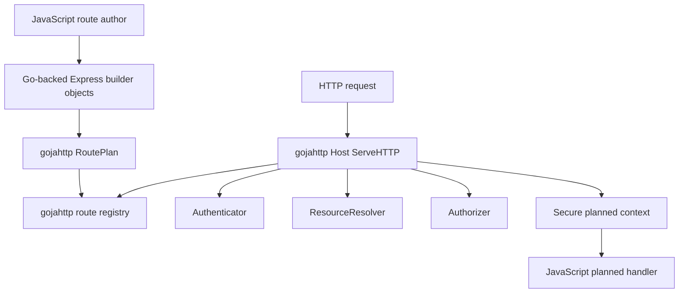
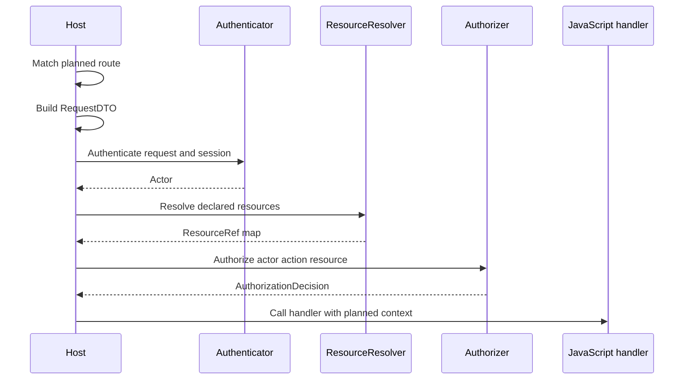

# go-go-goja Express Auth: Go-Backed Fluent Route Plans

This report explains the authentication work implemented in `go-go-goja` on branch `task/goja-express-auth`. The work adds a planned route path to the existing Express-style HTTP module. JavaScript authors get a fluent API, but the security-critical state is stored in Go objects, validated by Go code, and enforced by the `gojahttp.Host` before the handler runs.

> [!summary]
> - The implementation adds a typed `RoutePlan` model in `pkg/gojahttp`, then dispatches planned routes through authentication, resource resolution, and authorization before JavaScript handler execution.
> - The public JavaScript API is a staged fluent builder: `app.route(...).auth(...).resource(...).allow(...).handle(...)`.
> - The builder objects are Go-backed. `.auth(...)` rejects plain JavaScript objects and only accepts values returned by `express.user()`. `.resource(...)` only accepts values returned by `express.resource(type)`.
> - The Express module still supports raw `app.get(pattern, handler)` routes. Planned routes are the new path for auth-sensitive endpoints.

## Why this note exists

The original request was to add proper authentication to the `express` module in `go-go-goja`. The existing module was intentionally small. It let JavaScript register handlers with `app.get`, `app.post`, `app.patch`, and related methods, then let `pkg/gojahttp.Host` match the route and call one JavaScript handler with `(req, res)`. That was enough for examples, static sites, and lightweight HTTP tools, but it did not provide a host-owned authentication boundary.

The design process considered two approaches. The first approach used a staged route builder that compiles an explicit route security plan. The second approach stayed closer to Express by adding middleware stacks and routers. After discussing type validation and runtime safety, the implementation selected the staged builder approach. The reason is precise: auth declarations should not be arbitrary JavaScript maps that the Go side must defensively parse. They should be Go-owned builder/spec objects whose identity and contents can be validated at registration time.

The result is not a full Express clone. It is still an Express-style module with a focused secure route API. The important change is that the host can now distinguish a raw route from a planned route, and planned routes execute through a security sequence before JavaScript business logic runs.

## The implemented API

A public planned route explicitly declares that it is public before registering a handler:

```javascript
const express = require("express")
const app = express.app()

app.route("GET", "/healthz")
  .public()
  .handle((_ctx, res) => res.json({ ok: true }))
```

An authenticated route requires an actor and declares an action:

```javascript
app.route("GET", "/me")
  .auth(express.user().required())
  .allow("user.self.read")
  .handle((ctx, res) => {
    res.json({ id: ctx.actor.id, kind: ctx.actor.kind })
  })
```

A resource-bound route declares how the route binds HTTP adapter values to a domain resource request:

```javascript
app.route("PATCH", "/orgs/:orgId/projects/:projectId")
  .auth(express.user().required())
  .resource(
    express.resource("project")
      .idFromParam("projectId")
      .tenantFromParam("orgId")
      .mustExist()
  )
  .allow("project.update")
  .handle((ctx, res) => {
    const project = ctx.resource("project")
    res.json({ project: project.id, tenant: project.tenantId })
  })
```

The resource builder names are deliberately specific. `idFromParam("projectId")` means the route plan reads the resource identifier from the HTTP route parameter named `projectId`. `tenantFromParam("orgId")` means the tenant boundary value is read from the route parameter named `orgId`. These methods do not perform access control. They only describe typed value extraction from the HTTP adapter layer. The actual resource lookup and permission decision remain in Go host interfaces.

## The central design decision

The central design decision is that JavaScript gets fluent syntax, while Go owns the data structures. This matters because the authentication boundary should fail early, fail closed, and produce explicit errors when route declarations are malformed.

A less strict API could accept plain JavaScript objects:

```javascript
app.route("GET", "/me")
  .auth({ required: true })
  .allow("user.self.read")
  .handle(handler)
```

That shape is flexible, but every call site becomes a parsing problem. The Go implementation must check object shape, optional fields, field types, nested values, unknown keys, defaults, and conflicting keys. It also becomes harder to know whether a value was produced by the trusted API or hand-constructed by route code.

The implemented API rejects that pattern. `.auth(...)` expects an object returned by `express.user()`. `.resource(...)` expects an object returned by `express.resource(type)`. The Go module stores the backing specs in a per-loader `builderStore`, keyed by the actual Goja object pointer. This gives runtime type validation without requiring JavaScript classes, prototypes, or schema parsing.

The key implementation is in `modules/express/auth_builders.go`:

```go
type builderStore struct {
    authSpecs     sync.Map // map[*goja.Object]*gojahttp.SecuritySpec
    resourceSpecs sync.Map // map[*goja.Object]*gojahttp.ResourceSpec
}
```

The store is created when the `express` module loader initializes. `express.user()` creates a JavaScript object and stores a pointer to a Go `SecuritySpec` behind it. `express.resource(type)` does the same with `ResourceSpec`. Later, `.auth(value)` and `.resource(value)` look up the object in the store. If the object is not present, the call fails.

This is the boundary that turns a dynamic JavaScript API into a typed Go-owned route declaration.

## Architecture

The implementation has three layers:

1. `modules/express` exposes the JavaScript API and compiles fluent builder calls into a `gojahttp.RoutePlan`.
2. `pkg/gojahttp` stores planned routes, validates route plans, and enforces authentication/resource/authorization before handler execution.
3. The embedding Go application provides `Authenticator`, `ResourceResolver`, and `Authorizer` implementations through `gojahttp.HostOptions.Auth`.



The module does not define a user store. It defines the contract that a user store must satisfy. This is an important separation. The `express` module should not decide whether users come from SQLite, Postgres, Redis-backed sessions, OIDC, bearer tokens, Keycloak, or application-specific services. It only declares that a route requires a user actor and that a host authenticator must produce one.

## RoutePlan: the host-owned contract

The central data structure is `RoutePlan` in `pkg/gojahttp/auth_plan.go`:

```go
type RoutePlan struct {
    Name      string
    Method    string
    Pattern   string
    Security  SecuritySpec
    Resources []ResourceSpec
    Action    string
}
```

A `RoutePlan` is not a handler. It is the contract that must be satisfied before the handler runs. It records the HTTP method, route pattern, security mode, resources touched by the route, and action to authorize. Planned routes are stored in the same route registry as raw routes, but with `Route.Plan` populated.

The security mode is intentionally small in the MVP:

```go
type SecurityMode string

const (
    SecurityModePublic SecurityMode = "public"
    SecurityModeUser   SecurityMode = "user"
)
```

This is enough to distinguish public routes from routes that require an authenticated user. System routes, capability routes, CSRF, audit, and body schema validation were left out of the MVP because they can be added after the host-owned route planning and dispatch path is stable.

Resource binding is represented by `ResourceSpec` and `ValueSource`:

```go
type ResourceSpec struct {
    Name      string
    Type      string
    ID        ValueSource
    Tenant    *ValueSource
    MustExist bool
}

type ValueSource struct {
    Kind  ValueSourceKind
    Key   string
    Value string
}
```

The `ValueSource` is where HTTP adapter coupling is intentionally localized. The route can say that `project.id` comes from the `projectId` path parameter and `project.tenant` comes from the `orgId` path parameter. The resource resolver receives the resolved values, not an instruction to inspect `req.params` directly.

## Validation before registration

`ValidateRoutePlan` normalizes the method and path, checks that a route declares a security mode, requires `.allow(action)` for user-authenticated routes, and verifies that resource parameter references exist in the route pattern.

The validation logic is in `pkg/gojahttp/auth_plan.go`:

```go
func ValidateRoutePlan(plan RoutePlan) (RoutePlan, error) {
    plan.Method = strings.ToUpper(strings.TrimSpace(plan.Method))
    plan.Pattern = cleanPath(plan.Pattern)
    plan.Name = strings.TrimSpace(plan.Name)
    plan.Action = strings.TrimSpace(plan.Action)

    switch plan.Security.Mode {
    case SecurityModePublic:
        plan.Security.Required = false
    case SecurityModeUser:
        plan.Security.Required = true
        if plan.Action == "" {
            return RoutePlan{}, fmt.Errorf(
                "planned user route %s %s requires .allow(action)",
                plan.Method,
                plan.Pattern,
            )
        }
    default:
        return RoutePlan{}, fmt.Errorf(
            "planned route %s %s must declare .public() or .auth(...) before .handle(...)",
            plan.Method,
            plan.Pattern,
        )
    }

    // Resource source validation follows.
}
```

The parameter validation is not cosmetic. It catches a common route bug early:

```javascript
app.route("PATCH", "/projects/:projectId")
  .auth(express.user().required())
  .resource(express.resource("project").idFromParam("id"))
  .allow("project.update")
  .handle(handler)
```

This route references `id`, but the path contains `:projectId`. The implementation rejects the route during registration instead of letting the first matching request fail later or letting the handler accidentally use a different identifier.

The key validation rule is: planned route declarations should fail before the server starts accepting traffic whenever the mistake is knowable at registration time.

## Host auth services

The MVP adds three host-facing interfaces:

```go
type AuthOptions struct {
    Authenticator Authenticator
    Resources     ResourceResolver
    Authorizer    Authorizer
}

type Authenticator interface {
    Authenticate(ctx context.Context, req *http.Request, session *SessionDTO, spec SecuritySpec) (*Actor, error)
}

type ResourceResolver interface {
    ResolveResource(ctx context.Context, req ResourceRequest) (*ResourceRef, error)
}

type Authorizer interface {
    Authorize(ctx context.Context, req AuthorizationRequest) (AuthorizationDecision, error)
}
```

This is the current answer to the user-store question: the implementation does not provide a user store backend. It defines `Authenticator` as the boundary. The application that embeds `gojahttp.Host` provides an authenticator that knows how to map a request, session, bearer token, or cookie to an `Actor`.

A host wires this in through `HostOptions`:

```go
host := gojahttp.NewHost(gojahttp.HostOptions{
    Auth: gojahttp.AuthOptions{
        Authenticator: myAuthenticator,
        Resources:     myResourceResolver,
        Authorizer:    myAuthorizer,
    },
})
```

The module therefore supports several backend strategies without hard-coding any of them:

- A session-backed authenticator can use `SessionDTO.ID` to look up a user in a database or cache.
- A bearer-token authenticator can parse `Authorization` headers and return an actor from token claims or token introspection.
- An OIDC or Keycloak integration can validate identity upstream and expose the result through the same `Actor` shape.
- Tests and examples can provide in-memory fakes without changing the Express API.

The current code does not implement those adapters yet. That is a deliberate line. The route auth mechanism should not prescribe user persistence.

## Request execution sequence

The request path begins in the existing `Host.ServeHTTP` flow. Static mounts still run first. The host still matches a route, creates or reuses a session, parses the request body, builds a `RequestDTO`, and creates a `Response` wrapper. The new branch is after route matching and request DTO construction: if `route.Plan != nil`, the host dispatches through the planned route path.

The planned dispatch function is `servePlannedRoute` in `pkg/gojahttp/planned_dispatch.go`:

```go
func (h *Host) servePlannedRoute(w http.ResponseWriter, r *http.Request, route Route, req *RequestDTO) {
    res := NewResponse(w, h.renderer)
    envelope, status, err := h.buildSecureEnvelope(r.Context(), r, req, route.Plan)
    if err != nil {
        h.writePlannedError(w, res, status, err)
        return
    }
    ret, err := h.owner.Call(r.Context(), "http-planned-handler", func(ctx context.Context, vm *goja.Runtime) (any, error) {
        result, err := route.Handler(goja.Undefined(), envelope.JSObject(vm), res.JSObject(vm))
        // Promise and return-value handling follows.
    })
}
```

The important work happens in `buildSecureEnvelope`. It performs the following sequence:

1. Check the route plan exists.
2. If the route is public, proceed without an actor.
3. If the route requires a user, call `Authenticator.Authenticate`.
4. Resolve each declared resource through `ResourceResolver.ResolveResource`.
5. Authorize the declared action through `Authorizer.Authorize`.
6. Build a secure context object for JavaScript.
7. Invoke the JavaScript handler only after the preceding steps succeed.



This sequence is the main security property. The handler does not run until authentication, resource resolution, and authorization have completed successfully.

## Secure context shape

Planned handlers receive `(ctx, res)` rather than `(req, res)`. The response object is the same Go-backed response wrapper used by raw handlers. The context object is built from the secure envelope:

```go
func (e *secureEnvelope) JSObject(vm *goja.Runtime) *goja.Object {
    obj := vm.NewObject()
    _ = obj.Set("request", e.Request.Map())
    _ = obj.Set("actor", actorJSMap(e.Actor))
    _ = obj.Set("body", e.Body)
    _ = obj.Set("params", e.Request.Params)
    _ = obj.Set("resources", resourceJSMap(e.Resources))
    _ = obj.Set("action", e.Plan.Action)
    _ = obj.Set("routeName", e.Plan.Name)
    _ = obj.Set("resource", func(name string) goja.Value {
        resource := e.Resources[name]
        if resource == nil {
            return goja.Null()
        }
        return vm.ToValue(resourceRefJSMap(resource))
    })
    return obj
}
```

One implementation detail mattered during testing. Passing Go structs directly into Goja did not expose the lower-case JavaScript properties expected by the handler tests. For example, JavaScript expected `ctx.actor.id`, not a Go-shaped field. The fix was to convert `Actor` and `ResourceRef` to explicit maps with JavaScript property names such as `id`, `kind`, `tenantId`, and `claims`.

That choice makes the API contract explicit. It also avoids accidental exposure of Go field naming and keeps the JavaScript context stable if the internal Go structs later gain fields.

## Error mapping

The planned route path maps auth failures to HTTP statuses:

| Condition | Status | Implementation behavior |
| --- | ---: | --- |
| Missing `Authenticator` for user route | 500 | Host misconfiguration. |
| `ErrUnauthenticated` or nil actor | 401 | Credentials are missing or invalid. |
| `ErrForbidden` or denied decision | 403 | Actor exists but lacks permission. |
| `ErrNotFound` from resource resolver | 404 | Resource could not be resolved. |
| Unknown auth/resource/authorizer error | 500 | Backend or integration failure. |

The host exposes detailed internal errors only in development mode for 500-class planned route errors. This matches the existing dev/prod distinction for JavaScript handler errors.

## The staged builder implementation

The builder is implemented in `modules/express/auth_builders.go`. It has three route stages:

1. `needsSecurityObject`: route has method and pattern, but no security mode.
2. `needsPolicyObject`: route has authenticated security mode and can accept resources and action.
3. `needsHandlerObject`: route is valid enough to expose `.handle(...)`.

The JavaScript API reflects these stages because each stage is a different Go-created object with different methods. Before `.public()` or `.auth(...)`, there is no `.handle(...)` property.

```go
func (b *routeBuilder) needsSecurityObject() goja.Value {
    obj := b.vm.NewObject()
    _ = obj.Set("public", func() goja.Value {
        b.plan.Security = gojahttp.SecuritySpec{Mode: gojahttp.SecurityModePublic}
        return b.needsHandlerObject()
    })
    _ = obj.Set("auth", func(value goja.Value) (goja.Value, error) {
        spec, err := b.store.authSpec(b.vm, value)
        if err != nil {
            return nil, err
        }
        b.plan.Security = spec
        return b.needsPolicyObject(), nil
    })
    return obj
}
```

The policy stage exposes `.resource(...)` and `.allow(...)`:

```go
func (b *routeBuilder) needsPolicyObject() goja.Value {
    obj := b.vm.NewObject()
    _ = obj.Set("resource", func(value goja.Value) (goja.Value, error) {
        spec, err := b.store.resourceSpec(b.vm, value)
        if err != nil {
            return nil, err
        }
        b.plan.Resources = append(b.plan.Resources, spec)
        return obj, nil
    })
    _ = obj.Set("allow", func(action string) (goja.Value, error) {
        b.plan.Action = strings.TrimSpace(action)
        return b.needsHandlerObject(), nil
    })
    return obj
}
```

The final stage registers the compiled route plan:

```go
func (b *routeBuilder) needsHandlerObject() goja.Value {
    obj := b.vm.NewObject()
    _ = obj.Set("handle", func(handler goja.Value) error {
        fn, ok := goja.AssertFunction(handler)
        if !ok {
            return fmt.Errorf("planned route .handle(...) requires a function")
        }
        if err := b.registrar.start(b.vm); err != nil {
            return err
        }
        return b.registrar.host.RegisterPlanned(b.plan, fn)
    })
    return obj
}
```

This is the point where the Express module hands control to `gojahttp`. `RegisterPlanned` validates the route plan and stores it in the registry.

## What was tested

The work added tests at three levels.

### Route plan validation tests

`pkg/gojahttp/auth_plan_test.go` verifies that:

- A planned route must declare a security mode.
- Public routes normalize method and path.
- User routes require `.allow(action)`.
- Resource specs that reference missing route params fail validation.
- Planned routes store a `Plan` on matched registry routes.

### Host dispatch tests

`pkg/gojahttp/planned_dispatch_test.go` verifies that:

- Public planned routes dispatch with `ctx.params`.
- Authenticated planned routes call the authenticator and authorizer.
- Unauthenticated routes return 401 and do not invoke the handler.
- Resource routes resolve `ID` and `TenantID` from route params.
- Resource lookup failures map to 404.
- Authorizer backend errors map to 500.

### Express builder integration tests

`modules/express/auth_builders_integration_test.go` verifies that:

- `app.route(...).public().handle(...)` works through the JavaScript API.
- `express.user().required()` produces an accepted auth spec.
- `express.resource("project").idFromParam(...).tenantFromParam(...)` produces an accepted resource spec.
- `.auth({ required: true })` is rejected.
- `.handle(...)` is unavailable before the security mode stage.

### Provider coverage

`pkg/xgoja/providers/http/http_test.go` now includes a provider-level test that registers a planned public route through the xgoja HTTP provider and an externally supplied `gojahttp.Host`. This verifies that generated runtime integration can load the planned route API through `require("express")`.

## Validation results

The targeted validation command passed:

```bash
go test ./pkg/gojahttp ./modules/express ./pkg/xgoja/providers/http -count=1
```

The broader suite passed with VCS stamping disabled:

```bash
GOFLAGS=-buildvcs=false go test ./... -count=1
```

A plain broad run failed in generated xgoja build tests because temporary generated workspaces could not provide VCS stamping information to `go build`:

```text
error obtaining VCS status: exit status 128
    Use -buildvcs=false to disable VCS stamping.
```

That failure was documented in the ticket diary. It was not caused by the planned auth route implementation. The same test suite passed when Go was instructed not to stamp VCS metadata into generated binaries.

## Commits produced

The work was committed incrementally:

| Commit | Purpose |
| --- | --- |
| `6af0bbd` | Planned implementation phases in the docmgr ticket. |
| `99a2da3` | Added `gojahttp` planned route auth model. |
| `e19ea0d` | Added planned route dispatch and secure context. |
| `3b1220f` | Added Express fluent auth route builders. |
| `13d4675` | Documented Express planned auth routes and TypeScript declarations. |
| `2ee50b5` | Added provider coverage and example route script. |
| `f31a391` | Completed phase bookkeeping in the ticket. |

The implementation diary is in:

```text
/home/manuel/workspaces/2026-06-12/goja-express-auth/go-go-goja/ttmp/2026/06/12/XGOJA-EXPRESS-AUTH--add-proper-authentication-to-express-http-module/reference/01-investigation-diary.md
```

## What is not implemented yet

The MVP intentionally leaves several features for follow-up work.

### No user store backend

The module does not provide a built-in user database, session store, password login flow, or OIDC adapter. It exposes `Authenticator` as the integration point. A later package could provide a reusable session-backed authenticator, but the `express` module itself should not own identity storage.

A likely follow-up package shape is:

```go
type SessionUserStore interface {
    UserForSession(ctx context.Context, sessionID string) (*gojahttp.Actor, error)
}
```

An adapter could then implement `gojahttp.Authenticator` and be used in examples or simple applications.

### No body schema validation

`.body(...)` was discussed but left out of the MVP. Body validation is valuable, but it is not required to prove the security route path. It should become a separate builder stage backed by a Go-owned schema registry.

### No CSRF enforcement

`.csrf()` was also left out of the MVP. It matters for browser session authentication on unsafe methods. It should be added before recommending cookie-authenticated planned routes for production browser applications.

### No audit sink

`.audit(...)` was left out of the MVP. The design direction is still clear: JavaScript should declare audit event names, while Go emits structured audit events through a host-provided `AuditSink`.

### No strict raw-route rejection

Raw `app.get`, `app.post`, and related methods still work. A future strict host mode should be able to reject raw routes in production or at least report them clearly in route diagnostics.

### No Express middleware or routers

A separate design document explores middleware stacks and routers, but the selected implementation path did not add them. The planned route API should stabilize first.

## Implementation rules that emerged

The work produced several rules that should guide future changes.

- Security route declarations should be Go-backed objects, not plain JavaScript maps.
- Planned route registration should fail when errors are knowable at registration time.
- HTTP adapter binding should be explicit and narrow. `idFromParam` and `tenantFromParam` extract values; they do not perform domain policy.
- Resource resolution and authorization should remain host-owned interfaces.
- Planned handlers should receive a context that exposes only the resolved security state they need.
- Raw Express-style routes should remain for compatibility, but docs should recommend planned routes for auth-sensitive endpoints.
- Follow-up features such as body validation, CSRF, and audit should extend the route plan rather than bypass it.

## Review guide

A reviewer should read the code in this order:

1. `pkg/gojahttp/auth_plan.go` defines the route contract and host auth interfaces.
2. `pkg/gojahttp/planned_dispatch.go` enforces the contract at request time.
3. `modules/express/auth_builders.go` exposes the Go-backed fluent API.
4. `modules/express/auth_builders_integration_test.go` shows the intended JavaScript authoring shape.
5. `pkg/doc/18-express-module.md` explains the user-facing API.
6. `examples/xgoja/15-express-planned-auth/scripts/server.js` provides a compact route declaration reference.

The most important correctness question is whether any planned authenticated route can reach its JavaScript handler without successful authentication and authorization. In the current implementation, the handler is invoked only after `buildSecureEnvelope` returns successfully.

## Closing status

The current branch has a working MVP for Go-backed fluent planned auth routes. It does not yet provide a production user store backend, CSRF protection, body validation, or audit emission. Those are appropriate follow-up tasks because the core mechanism now exists: JavaScript declares a typed plan through Go-backed builder objects, and the Go host enforces that plan before executing JavaScript handler code.
