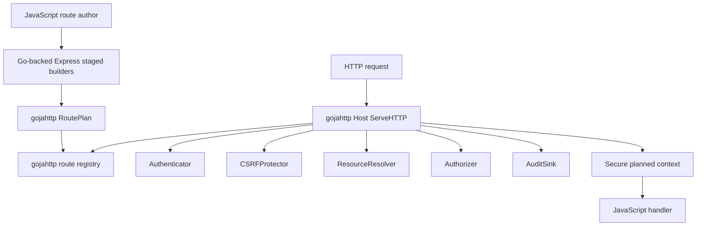
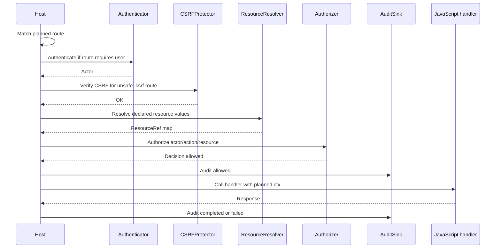

# go-go-goja Express Auth: Go-Backed Fluent Route Plans

This report wraps up the Express authentication work implemented in `go-go-goja` on branch `task/goja-express-auth`. The final implementation is no longer just an MVP side path: the Express verb helpers have been hard-cut over to planned route builders, planned routes now support host-owned auth/resource/authorization/CSRF/audit enforcement, strict hosts can reject raw routes, and the examples include both a route-authoring sketch and a runnable Go-owned auth host.

> [!summary]
> - JavaScript now declares route intent through staged Go-backed builders: `app.get(...).public().handle(...)` or `app.patch(...).auth(...).resource(...).csrf().allow(...).audit(...).handle(...)`.
> - Go owns the security-critical route plan, validates it at registration time, and enforces it in `pkg/gojahttp.Host` before JavaScript handlers run.
> - The old `app.get(path, handler)` style was intentionally removed from the Express verb helpers. Public routes must say `.public()`; protected routes must declare auth policy before `.handle(...)`.
> - The host-side production user/session system is deliberately not built into Express. The module exposes interfaces; applications or future optional packages provide Keycloak/OIDC, sessions, user storage, resource resolution, authorization, CSRF, audit, and capabilities.

## Why this note exists

The original request was to add proper authentication to the `express` module in `go-go-goja`. Before this work, the module was intentionally small: JavaScript could register handlers with methods like `app.get`, `app.post`, and `app.patch`, and `pkg/gojahttp.Host` would match the route and call the JavaScript handler. That was enough for examples and small HTTP tools, but it had no host-owned authentication boundary. A route author had to remember to do security work manually inside JavaScript.

The new design reverses that responsibility. JavaScript describes what kind of route it is, what resource it touches, which action is required, whether CSRF is required, and what audit event should be emitted. Go stores that declaration in a `RoutePlan` and runs the security pipeline before the handler is invoked.

The implementation deliberately avoids accepting arbitrary JavaScript objects as security declarations. A dynamic object like `{ required: true }` is easy to write but hard to trust: Go would have to parse and validate object shape, defaults, nested fields, unknown keys, and conflicting options. Instead, `express.user()` and `express.resource(type)` return Go-backed JavaScript objects. The builder accepts only those trusted objects.

## Final JavaScript API shape

The final public-route shape is explicit:

```javascript
const express = require("express")
const app = express.app()

app.get("/healthz")
  .public()
  .audit("health.checked")
  .handle((_ctx, res) => res.json({ ok: true }))
```

The final protected-route shape is also explicit:

```javascript
app.patch("/orgs/:orgId/projects/:projectId")
  .auth(express.user().required())
  .resource(
    express.resource("project")
      .idFromParam("projectId")
      .tenantFromParam("orgId")
      .mustExist()
  )
  .csrf()
  .allow("project.update")
  .audit("project.updated")
  .handle((ctx, res) => {
    const project = ctx.resource("project")
    res.json({ updated: project.id, tenant: project.tenantId })
  })
```

A current-user route can be minimal while still going through Go-owned authentication and authorization:

```javascript
app.get("/me")
  .auth(express.user().required())
  .allow("user.self.read")
  .audit("user.self.read")
  .handle((ctx, res) => {
    res.json({ id: ctx.actor.id, kind: ctx.actor.kind })
  })
```

The important API rule is now simple: `.handle(...)` is not available until the route has chosen a security mode. `.public()` is a security declaration too; it says the route is intentionally public.

## The hard cutover

A major decision during implementation was to stop preserving the old Express verb overloads. The names `app.get`, `app.post`, `app.put`, `app.patch`, `app.delete`, and `app.all` remain, but they now return staged planned-route builders. This old form is intentionally invalid:

```javascript
app.get("/healthz", (_req, res) => res.json({ ok: true }))
```

The replacement is:

```javascript
app.get("/healthz")
  .public()
  .handle((_ctx, res) => res.json({ ok: true }))
```

This was a breaking change, but it made the API safer and easier to explain. Keeping old raw-route overloads beside the new planned-route API would make it too easy for applications to accidentally create unauthenticated routes that look visually similar to secured routes. The generic `app.route(method, pattern)` escape hatch remains for unusual or dynamic methods, but it also returns the planned builder.

## Architecture

The implementation has three main layers:

1. `modules/express` exposes the JavaScript API and compiles fluent calls into Go-owned route plans.
2. `pkg/gojahttp` stores planned routes, validates plans, and dispatches requests through the security pipeline.
3. The embedding Go application provides host services through `gojahttp.HostOptions.Auth`.



The Express module still does not define a user store. That separation is intentional. Express should not own Keycloak, passwords, sessions, tenant membership, or database schema. Express owns route declaration. `gojahttp` owns route-plan enforcement. The application or future optional packages own identity, session, policy, and persistence.

## RoutePlan: the host-owned contract

The central data structure lives in `pkg/gojahttp/auth_plan.go`:

```go
type RoutePlan struct {
    Name      string
    Method    string
    Pattern   string
    Security  SecuritySpec
    Resources []ResourceSpec
    Action    string
    CSRF      CSRFSpec
    Audit     AuditSpec
}
```

The plan is the contract that must be satisfied before a handler runs. It records:

- route method and pattern,
- public versus authenticated-user security mode,
- resources and value sources,
- required action,
- CSRF requirement,
- audit event name.

Resource binding is intentionally adapter-shaped, not policy-shaped. A route can say that a `project` resource ID comes from `:projectId` and the tenant boundary comes from `:orgId`; it does not decide whether the actor is allowed to update that project. The host `ResourceResolver` and `Authorizer` make those decisions.

## Host auth interfaces

The host services are in `pkg/gojahttp/auth_plan.go`:

```go
type AuthOptions struct {
    Authenticator Authenticator
    Resources     ResourceResolver
    Authorizer    Authorizer
    CSRF          CSRFProtector
    Audit         AuditSink
}
```

The current interfaces are deliberately small:

```go
type Authenticator interface {
    Authenticate(ctx context.Context, req *http.Request, session *SessionDTO, spec SecuritySpec) (*Actor, error)
}

type ResourceResolver interface {
    ResolveResource(ctx context.Context, req ResourceRequest) (*ResourceRef, error)
}

type Authorizer interface {
    Authorize(ctx context.Context, req AuthorizationRequest) (AuthorizationDecision, error)
}

type CSRFProtector interface {
    VerifyCSRF(ctx context.Context, req CSRFRequest) error
}

type AuditSink interface {
    RecordAudit(ctx context.Context, event AuditEvent) error
}
```

A host wires them like this:

```go
host := gojahttp.NewHost(gojahttp.HostOptions{
    RejectRawRoutes: true,
    Auth: gojahttp.AuthOptions{
        Authenticator: myAuthenticator,
        Resources:     myResourceResolver,
        Authorizer:    myAuthorizer,
        CSRF:          myCSRFProtector,
        Audit:         myAuditSink,
    },
})
```

This is the seam that lets different applications use the same Express planned-route API with different auth backends. A demo can use an in-memory bearer token. A production app can use Keycloak/OIDC plus server-side sessions. A test can provide tiny fakes.

## Request execution sequence

A planned route request follows one host-owned sequence:

```text
match route
  -> build RequestDTO
  -> authenticate actor, if required
  -> verify CSRF, if required and method is unsafe
  -> resolve declared resources
  -> authorize declared action
  -> emit allowed audit event
  -> call JavaScript handler with secure ctx and res
  -> emit completed or failed audit event
```



If any pre-handler step fails, the handler is not invoked. Authentication failures map to 401, authorization and CSRF failures map to 403, resource-not-found maps to 404, and host misconfiguration/backend failures map to 500.

## Secure context shape

Planned handlers receive `(ctx, res)` rather than the raw `(req, res)` used by earlier raw routes. The context contains the safe, resolved view of the request:

```javascript
ctx.actor              // authenticated actor, or null for public routes
ctx.params             // route params
ctx.body               // parsed request body
ctx.resources          // resolved resources map
ctx.resource("project") // convenient lookup
ctx.action             // declared action
ctx.routeName          // declared or generated route name
ctx.request            // request DTO details
```

The implementation explicitly maps Go structs to JavaScript-facing property names such as `id`, `kind`, `tenantId`, and `claims`. This avoids accidentally exposing Go field naming or internal implementation details.

## Strict raw-route rejection

The host now supports:

```go
gojahttp.HostOptions{RejectRawRoutes: true}
```

When this option is enabled, matched routes without a `RoutePlan` are rejected at request time. This gives production hosts a practical fail-closed mode without changing the low-level `Host.Register` signature. Static mounts are unaffected because they are not registry routes.

Route descriptors were also expanded so tools can inspect whether a route is planned and what its security metadata is. That makes migration and diagnostics easier: a host can list routes, identify raw routes, and decide whether to enable strict rejection.

## CSRF and audit

The final implementation includes the planned CSRF and audit hooks that were originally deferred.

`.csrf()` marks a route as requiring host-owned CSRF verification. The host only calls the verifier for unsafe methods, and it does so after authentication but before resource resolution and authorization. This is the right default for cookie/session-authenticated browser routes because the actor being authenticated is not enough to prove the request was intentional.

`.audit(event)` declares an audit event name. The host emits best-effort audit records through `AuditSink` for allowed, denied, completed, and failed outcomes. JavaScript does not write security audit records directly; it declares intent and Go emits the record with actor/resource/action/status context.

Best-effort audit was chosen for this pass: audit sink errors do not change successful business responses. A future production host package may add a strict audit mode for compliance-sensitive deployments.

## Documentation and examples

The user-facing docs now include:

- `pkg/doc/18-express-module.md` — main Express module reference.
- `pkg/doc/29-express-auth-user-guide.md` — auth framework user guide.
- `pkg/doc/30-migrate-express-apps-to-planned-auth.md` — migration tutorial for the hard cutover.

The examples now include:

- `examples/xgoja/15-express-planned-auth/` — compact JavaScript route-authoring reference.
- `examples/xgoja/16-express-auth-host/` — runnable Go-owned auth host with fake authenticator, resource resolver, authorizer, CSRF protector, audit sink, strict raw-route rejection, smoke mode, and manual serve mode.

The runnable host example is important because it demonstrates the intended layering. The Go host owns security services; JavaScript owns route declarations and business handlers.

## Validation status

The final implementation passed targeted validation:

```bash
go test ./pkg/gojahttp ./modules/express ./pkg/xgoja/providers/http -count=1
go test ./examples/xgoja/16-express-auth-host/cmd/host ./pkg/gojahttp ./modules/express ./pkg/xgoja/providers/http -count=1
make -C examples/xgoja/16-express-auth-host smoke
```

The broader suite passed with the known generated-build workaround:

```bash
GOFLAGS=-buildvcs=false go test ./... -count=1
```

The remaining validation caveat is unrelated to Express auth semantics: generated temporary xgoja build workspaces can fail Go VCS stamping unless `-buildvcs=false` is used. The recommended follow-up is to make xgoja generated/temp builds pass `-buildvcs=false` internally.

## Commits produced

The work was committed incrementally:

| Commit | Purpose |
| --- | --- |
| `6af0bbd` | Planned implementation phases in the docmgr ticket. |
| `99a2da3` | Added `gojahttp` planned route auth model. |
| `e19ea0d` | Added planned route dispatch and secure context. |
| `3b1220f` | Added Express fluent auth route builders. |
| `13d4675` | Documented Express planned auth routes. |
| `2ee50b5` | Added provider coverage and planned auth example. |
| `f31a391` | Completed phase bookkeeping. |
| `cdf7b1b` | Planned hard cutover for Express verb helpers. |
| `4492723` | Hard-cut Express verb helpers to planned routes. |
| `de09c15` | Added Express auth help guides. |
| `4f42a55` | Added strict raw route rejection option. |
| `61c858d` | Added planned route CSRF and audit hooks. |
| `f852a21` | Added runnable Express auth host example. |
| `5d0c7fd` | Imported Keycloak/OIDC host auth notes for the next phase. |

The implementation diary is in:

```text
/home/manuel/workspaces/2026-06-12/goja-express-auth/go-go-goja/ttmp/2026/06/12/XGOJA-EXPRESS-AUTH--add-proper-authentication-to-express-http-module/reference/01-investigation-diary.md
```

## What is now finished

The Express route declaration and enforcement foundation is finished for this phase:

- Go-backed staged route builders exist.
- Verb helpers now require planned-route declaration.
- Public/authenticated/resource-bound route plans are validated.
- Host dispatch enforces authentication, resource resolution, authorization, CSRF, and audit before or around handler execution.
- Strict raw-route rejection is available.
- Docs, help pages, tests, and examples have been updated.
- A runnable host example demonstrates the integration shape.

This is the point where Express planned auth can be treated as the framework boundary.

## What remains outside this phase

The next phase is not more Express syntax. It is the actual host-side user/auth system.

That means an opinionated production stack such as:

- Keycloak as IdP,
- OIDC Authorization Code + PKCE,
- server-side application sessions,
- normalized app user records,
- tenant and membership storage,
- explicit Go authorization functions,
- persistent audit sink,
- capability tokens for invites/email verification/password reset/API tokens,
- body/schema validation,
- negative authorization tests.

A simpler dev/demo stack should also exist:

- in-memory users,
- password or bearer demo login,
- in-memory sessions,
- in-memory resources,
- explicit demo authorizer,
- in-memory audit capture,
- smoke tests that show login, protected route access, CSRF denial, mutation success, and logout.

The important boundary remains the same: production identity and user storage should not be moved into `modules/express`. They should live in optional host-side packages or application code that implements the `gojahttp` interfaces.

## Final working rule

For future work, keep this rule intact:

> Express route authors declare intent. Go host code enforces security. Application packages own identity, sessions, users, tenants, capabilities, and policy.

That rule is what keeps the JavaScript API pleasant without letting the JavaScript layer become the security boundary.

---

## Follow-up: porting the Express auth branch across the xgoja/v2 merge

After PR #73 landed on `origin/main`, the Express auth branch had to be merged across the new `xgoja/v2` configuration and example layout. The merge was not just a mechanical rebase: the xgoja examples were renumbered, the native schema changed to `schema: xgoja/v2`, several older xgoja help pages were deleted, and new TypeScript/protobuf examples occupied the old Express-auth example numbers.

> [!summary]
> - The Express auth examples were moved from `15/16/17` to `17/18/19` so the new protobuf and TypeScript xgoja examples can remain `15` and `16`.
> - The new TypeScript xgoja HTTP example had to be updated to the hard-cutover Express API: `app.get(path).public().handle(...)` instead of `app.get(path, handler)`.
> - The build-VCS stamping issue is now fixed on `origin/main`; the branch no longer needs the `GOFLAGS=-buildvcs=false` workaround for normal `go test ./...`.

### What changed during the port

The merge brought in the xgoja/v2 planner and the new example numbering from `origin/main`. The main conflict was that this branch had added Express-auth examples as `15-express-planned-auth`, `16-express-auth-host`, and `17-express-keycloak-auth-host`, while `origin/main` now uses those slots for:

| Number | `origin/main` example | Express-auth branch resolution |
| --- | --- | --- |
| `15` | `15-protobuf-builder-provider` | Kept from `origin/main`. |
| `16` | `16-typescript-jsverbs` | Kept from `origin/main`, then updated to planned Express routes. |
| `17` | free after the new v2 examples | Moved `15-express-planned-auth` here. |
| `18` | free after the new v2 examples | Moved `16-express-auth-host` here. |
| `19` | free after the new v2 examples | Moved `17-express-keycloak-auth-host` here. |

The concrete path changes are:

```text
examples/xgoja/15-express-planned-auth        -> examples/xgoja/17-express-planned-auth
examples/xgoja/16-express-auth-host          -> examples/xgoja/18-express-auth-host
examples/xgoja/17-express-keycloak-auth-host -> examples/xgoja/19-express-keycloak-auth-host
```

All user-facing help pages and example READMEs were updated to reference the new paths:

```text
pkg/doc/18-express-module.md
pkg/doc/29-express-auth-user-guide.md
pkg/doc/30-migrate-express-apps-to-planned-auth.md
pkg/doc/31-express-auth-examples.md
examples/xgoja/README.md
```

The `examples/xgoja/README.md` learning path now has the xgoja/v2 examples first and the Express-auth examples after them:

```text
15. 15-protobuf-builder-provider
16. 16-typescript-jsverbs
17. 17-express-planned-auth
18. 18-express-auth-host
19. 19-express-keycloak-auth-host
```

### The extra fix: TypeScript HTTP example used the old Express API

The only semantic code fix found during the port was in the newly merged TypeScript xgoja example. Its `verbs/sites.ts` used the old raw Express handler overload:

```ts
app.get("/healthz", (_req: unknown, res: any) => {
  res.json({ ok: true, site: "typescript-demo", version })
})
```

Because the Express auth branch intentionally hard-cuts verb helpers, that route must now be planned explicitly:

```ts
app.get("/healthz")
  .public()
  .handle((_ctx: unknown, res: any) => {
    res.json({ ok: true, site: "typescript-demo", version })
  })
```

Running the TypeScript example smoke regenerated `examples/xgoja/16-typescript-jsverbs/js/types/xgoja-modules.d.ts`, which is a useful confirmation that the generated declarations now expose the planned-route builder types (`RouteNeedsSecurity`, `RouteNeedsHandler`, `PlannedContext`, `UserAuthBuilder`, and resource specs) instead of the removed raw handler overloads.

### What was hard to figure out

The first hard part was separating true conflicts from old-number collisions. The merge looked large because xgoja/v2 moved or deleted many files, but most of that was upstream work. The actual Express-auth work was narrow: keep the new xgoja/v2 docs and examples, move the Express-auth examples after them, and fix stale paths.

The second hard part was deciding what to do with conflicts in old xgoja docs and generated tests. `origin/main` intentionally deleted several old tutorial pages and replaced them with v2 docs such as `migrating-to-xgoja-v2` and `xgoja-v2-reference`, so the right resolution was to keep the deletion rather than revive obsolete v1 tutorials. For `cmd/xgoja/internal/generate/generate_test.go`, the branch only had tiny Express route syntax edits, while `origin/main` had a broader v2 planner rewrite. The right resolution was to take the v2 version and then search for stale raw Express route calls elsewhere.

The third hard part was remembering that the new TypeScript example is not part of the Express-auth branch historically, but it imports `express` and therefore must obey the new hard-cutover API. The quick check that caught it was:

```bash
rg 'app\.get\([^\n]+,' examples/xgoja pkg/xgoja/providers/http cmd/xgoja/internal/generate
```

That found `examples/xgoja/16-typescript-jsverbs/verbs/sites.ts`, which was then converted and validated.

### Validation after the port

The merged branch now validates without the old build-VCS workaround:

```bash
go test ./... -count=1
make -C examples/xgoja/16-typescript-jsverbs smoke
make -C examples/xgoja/18-express-auth-host smoke
make -C examples/xgoja/19-express-keycloak-auth-host smoke
```

The targeted auth and docs checks also passed:

```bash
go test ./pkg/gojahttp ./modules/express ./pkg/gojahttp/auth/... ./pkg/xgoja/providers/http ./examples/xgoja/18-express-auth-host/cmd/host ./examples/xgoja/19-express-keycloak-auth-host/cmd/host -count=1
go run ./cmd/goja-repl help express-auth-user-guide
go run ./cmd/goja-repl help express-auth-examples
docmgr doctor --ticket XGOJA-HOST-AUTH --stale-after 30
docmgr doctor --ticket XGOJA-EXPRESS-AUTH --stale-after 30
```

### Documentation that should be improved

The docs are good enough for the PR, but a few improvements would make future merges and feature branches easier:

1. **Add an xgoja/v2 example-numbering rule.** `examples/xgoja/README.md` should explicitly say that new examples should append after the current learning path and should check `origin/main` before choosing a number. This would have made the `15/16/17` collision obvious earlier.

2. **Add a planned-Express migration note to the TypeScript xgoja docs.** The TypeScript example now demonstrates the planned API, but the v2 TypeScript docs could mention that generated declarations reflect the installed provider API. If a provider hard-cuts an API, TypeScript examples should regenerate sidecar `.d.ts` files and update call sites together.

3. **Add a small PR-merge checklist for branches touching examples.** A useful checklist would be:
   - fetch `origin/main`,
   - compare `examples/xgoja/README.md`,
   - check for duplicate example numbers,
   - run `rg 'app\.(get|post|put|patch|delete|all)\([^\n]+,'` when Express is touched,
   - run the affected example smoke targets,
   - regenerate generated declarations when provider APIs changed.

4. **Make `xgoja doctor` surface stale provider API examples if possible.** This is a larger improvement, but stale raw Express usage in a TypeScript jsverb was only caught by smoke. If `doctor` can cheaply parse or compile TypeScript sources with generated declarations, it could catch this kind of provider API mismatch earlier.

5. **Document the distinction between xgoja examples and host-only examples.** `17-express-planned-auth`, `18-express-auth-host`, and `19-express-keycloak-auth-host` are under `examples/xgoja`, but they are not all native `xgoja.yaml` build fixtures. The README now hints at this, but a clearer section would help readers understand which examples are xgoja generated-binary examples and which are host integration examples.

### Current status after the port

The Express auth branch is now rebased/merged over the xgoja/v2 mainline without losing the planned-auth work. The remaining PR shape is cleaner than before because `origin/main` also fixed the generated build VCS stamping issue. The branch now contains:

- planned Express route builders and hard-cut verb helpers,
- host-side auth packages,
- dev-auth and Keycloak examples renumbered after the v2 xgoja examples,
- consolidated Glazed help pages,
- automated dev and Keycloak smokes,
- compatibility with the new xgoja/v2 examples and TypeScript declaration generation.

The main follow-up is not a code blocker: improve docs/checklists so future feature branches can merge across xgoja example/documentation reorganizations with less archaeology.
