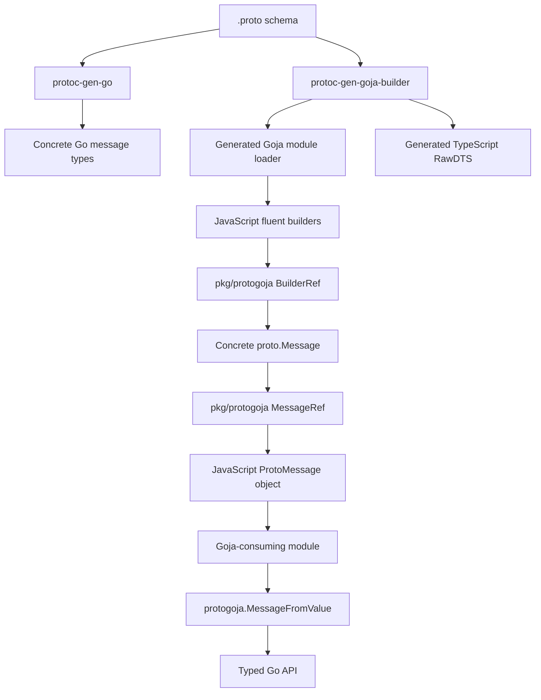
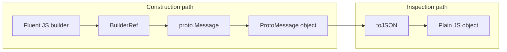

# go-go-goja Protobuf Builders: Goja-Native Fluent Proto Construction

This report explains the in-progress `GOJA-PB-001` work in `go-go-goja`: a reusable protobuf builder system for Goja programs. The work starts from a concrete problem in JavaScript bindings for protobuf-heavy Go APIs. A Go API wants a real `proto.Message`; JavaScript authors want a fluent, discoverable construction API; JSON/protojson conversion is useful as an interoperability path but too weak as the primary internal representation.

The implementation has moved beyond the runtime foundation. JavaScript-visible message objects carry hidden Go protobuf references, mutable generated-style builders carry hidden `BuilderRef` state, and `cmd/protoc-gen-goja-builder` now emits first-generation Go companion files. Those files expose message namespaces, fluent builders, enum exports, hidden prototype tokens, TypeScript `RawDTS`, CommonJS loaders, native-module wrappers, and message-type registration helpers. This note records the architecture as it stands now, the reasoning behind it, and the remaining implementation path.

> [!summary]
> - The project introduces `pkg/protogoja`, a reusable bridge between Goja values and concrete Go `proto.Message` values.
> - The first committed layer is `MessageRef`: a Go-backed JavaScript `ProtoMessage` object with `typeName`, `toJSON()`, `clone()`, and `equals(other)`.
> - The second committed layer is `BuilderRef`: a mutable protobuf builder runtime used by generated fluent methods for `Set`, `Add`, `Put`, `Clear`, `Build`, and `Clone`.
> - The generator now emits first-generation Goja native module helpers: namespaces, fluent builders, enum exports, prototype tokens, TypeScript declarations, and host integration functions.

## Why this work exists

The immediate trigger came from planning Goja bindings for `sessionstream`. `sessionstream` is protobuf-first: commands, backend events, UI events, and timeline entities are concrete protobuf messages. A direct JavaScript binding can accept plain objects and convert them through protojson:

```javascript
hub.submit("session-1", "ChatStartInference", {
  prompt: "Explain ordinals",
})
```

The Go side can decode that object by serializing it to JSON and asking the schema registry to unmarshal the bytes into the registered command message. This is correct enough for a first binding, but it makes plain JavaScript objects the primary construction representation. The code then has to recover type information later.

A better representation is to construct the protobuf message directly inside the Goja runtime:

```javascript
const chat = require("sessionstream.examples.chatdemo.v1")

const cmd = chat.StartInferenceCommand.builder()
  .prompt("Explain ordinals")
  .build()

hub.submit("session-1", "ChatStartInference", cmd)
```

In this form, `cmd` is not a plain object. It is a JavaScript object whose public API is small and stable, but whose hidden Go reference contains a concrete `*chatv1.StartInferenceCommand`. A consuming Goja module can extract the message with `protogoja.MessageFromValue(value)`, validate the descriptor, clone it, and pass it into the Go API without protojson.

The design belongs in `go-go-goja`, not in `sessionstream`, because the pattern is reusable. Any Goja-consuming module that needs typed protobuf values can use the same generated builders.

## The architecture in one view

The project has two layers: a runtime layer and a generation layer. Both now exist. The runtime layer owns conversion and hidden-reference contracts; the generation layer emits companion Go files that expose those contracts as JavaScript and TypeScript APIs.



The generated module is not supposed to replace `protoc-gen-go`. It depends on the Go message types that `protoc-gen-go` emits. Its job is to expose a JavaScript construction API for those types and a TypeScript declaration surface for editor support.

The runtime layer contains the general rules that every generated module should share:

- A built message is represented by a Go-backed object carrying a hidden `MessageRef`.
- A builder owns mutable protobuf state until `Build()` is called.
- `Build()` returns a clone of the current state, not the builder's internal message pointer.
- JavaScript numbers used for 64-bit integer fields are rejected when they exceed the JavaScript safe integer range.
- Message fields accept built `ProtoMessage` values or generated builder objects whose built message has the exact expected descriptor.
- Plain object acceptance is not a general fallback. It belongs only to explicit JSON-shaped protobuf types such as `google.protobuf.Struct` and `google.protobuf.Value`, which are planned for a later phase.

## The first committed boundary: `MessageRef`

The first implementation commit is `eb0269d1874a68867c7d70080fc66c797246dbf5` (`Add protogoja message refs`). It adds `pkg/protogoja/ref.go` and tests.

The central type is small:

```go
type MessageRef struct {
    msg      proto.Message
    typeName protoreflect.FullName
}
```

The important rule is clone-on-boundary. `NewMessageRef` clones the input message before storing it. `MessageRef.Message()` clones again before returning a message to a caller.

```go
func NewMessageRef(msg proto.Message) (*MessageRef, error) {
    if msg == nil {
        return nil, fmt.Errorf("protogoja: nil proto message")
    }
    cloned := proto.Clone(msg)
    return &MessageRef{
        msg:      cloned,
        typeName: cloned.ProtoReflect().Descriptor().FullName(),
    }, nil
}

func (r *MessageRef) Message() proto.Message {
    if r == nil || r.msg == nil {
        return nil
    }
    return proto.Clone(r.msg)
}
```

This rule is not an implementation detail. It is the representation contract. A value returned from `.build()` should behave as a stable built value. If the builder later mutates its internal state, the previously built value should not change. If a consuming Go API extracts the message and mutates its copy, the JavaScript-visible object should not change.

`ToValue` wraps a protobuf message as a JavaScript object:

```go
func ToValue(vm *goja.Runtime, msg proto.Message) (*goja.Object, error) {
    if vm == nil {
        return nil, fmt.Errorf("protogoja: nil runtime")
    }
    ref, err := NewMessageRef(msg)
    if err != nil {
        return nil, err
    }
    obj := vm.NewObject()
    if err := attachMessageRef(vm, obj, ref); err != nil {
        return nil, err
    }
    // Define public API: typeName, toJSON, clone, equals.
    return obj, nil
}
```

The hidden reference is attached with `DefineDataProperty` as non-writable, non-enumerable, and non-configurable. This matters because the hidden Go reference should not appear in `Object.keys(msg)`, JSON output, or ordinary inspection paths. JavaScript sees the public `ProtoMessage` API; Go can still recover the concrete protobuf message.

```go
func MessageFromValue(value goja.Value) (proto.Message, bool) {
    ref, ok := MessageRefFromValue(value)
    if !ok {
        return nil, false
    }
    msg := ref.Message()
    return msg, msg != nil
}
```

The tests verify the boundary directly:

- Mutating the original Go message after wrapping does not affect the JavaScript value.
- Mutating an extracted Go message does not affect later extractions.
- `toJSON()` returns a normal JavaScript object using protojson's camelCase mapping.
- `clone()` returns a distinct JavaScript object carrying an equal protobuf message.
- `equals(other)` returns true only for protobuf-equivalent message refs.
- The hidden reference property is not enumerable.

This is the foundational contract for every later generated builder.

## The second committed boundary: `BuilderRef`

The second implementation commit is `05f5bd484bf028c27429c6f108ec944d45413d95` (`Add protogoja builder refs`). It starts `pkg/protogoja/builder.go`.

`BuilderRef` owns mutable protobuf state. It is not the final generated fluent API. It is the runtime helper that generated fluent methods will call.

```go
type BuilderRef struct {
    msg  proto.Message
    desc protoreflect.MessageDescriptor
}
```

A generated method such as this:

```javascript
chat.UserMessageAcceptedEvent.builder()
  .messageId("m1-user")
  .role("user")
  .streaming(false)
  .build()
```

can later compile to Go code that calls common runtime helpers:

```go
_ = builderObj.Set("messageId", func(call goja.FunctionCall) goja.Value {
    if err := ref.Set(vm, fieldMessageID, call.Argument(0)); err != nil {
        panic(vm.NewGoError(err))
    }
    return call.This
})
```

The generated method name gives JavaScript authors a typed fluent surface. The shared `BuilderRef.Set` code keeps protobuf conversion rules in one package.

### Builder lifecycle methods

The initial builder lifecycle is:

```go
func NewBuilder(msg proto.Message) (*BuilderRef, error)
func (b *BuilderRef) Descriptor() protoreflect.MessageDescriptor
func (b *BuilderRef) Set(vm *goja.Runtime, field protoreflect.FieldDescriptor, value goja.Value) error
func (b *BuilderRef) Add(vm *goja.Runtime, field protoreflect.FieldDescriptor, value goja.Value) error
func (b *BuilderRef) Put(vm *goja.Runtime, field protoreflect.FieldDescriptor, key, value goja.Value) error
func (b *BuilderRef) Clear(field protoreflect.FieldDescriptor) error
func (b *BuilderRef) Build() proto.Message
func (b *BuilderRef) Clone() (*BuilderRef, error)
```

`Set` handles singular fields, repeated fields, and map replacement. `Add` appends to a repeated field. `Put` sets one map entry. `Clear` clears a field. `Build` returns a clone of the current state.

The validation rule is descriptor ownership. A field descriptor passed to a builder must belong to the builder's message descriptor:

```go
func (b *BuilderRef) validateField(field protoreflect.FieldDescriptor) error {
    if b == nil || b.msg == nil || b.desc == nil {
        return fmt.Errorf("protogoja: nil builder")
    }
    if field == nil {
        return fmt.Errorf("protogoja: nil field descriptor")
    }
    if field.ContainingMessage().FullName() != b.desc.FullName() {
        return fmt.Errorf(
            "protogoja: field %s does not belong to %s",
            field.FullName(), b.desc.FullName(),
        )
    }
    return nil
}
```

Generated code should only pass the right field descriptors, but runtime validation is still useful. It catches generator bugs, hand-written module mistakes, and future generic-builder usage.

## Field conversion as the real design center

The long-term generator is mostly a field conversion system. The JavaScript API is fluent, but every fluent method eventually answers the same question: can this `goja.Value` become the protobuf value required by this field descriptor?

The current implementation handles several field families:

| Field kind | Current support |
|---|---|
| `bool` | Requires a JavaScript boolean. |
| `string` | Requires a JavaScript string. |
| `int32`, `sint32`, `sfixed32` | Accepts integer numbers or base-10 strings, with range checks. |
| `int64`, `sint64`, `sfixed64` | Accepts integer numbers or base-10 strings, with safe-integer checks for numbers. |
| `uint32`, `fixed32` | Accepts unsigned integer numbers or base-10 strings, with range checks. |
| `uint64`, `fixed64` | Accepts unsigned integer numbers or base-10 strings, with safe-integer checks for numbers. |
| `float`, `double` | Accepts numeric values. |
| `bytes` | Accepts `[]byte` from Go export paths or base64 strings. |
| `enum` | Accepts enum names or known enum numbers. |
| `message` | Accepts a `ProtoMessage` wrapper with the exact expected descriptor. |
| repeated fields | `Set` replaces from an array-like value; `Add` appends one value. |
| map fields | `Set` replaces from object keys; `Put` inserts or replaces one entry. |

The 64-bit integer behavior is one of the most important early decisions. JavaScript numbers cannot represent every 64-bit integer exactly. The runtime therefore rejects numeric values outside the safe integer range and asks callers to pass strings for large values:

```go
func checkedInteger(field protoreflect.FieldDescriptor, value float64) (int64, error) {
    if math.IsNaN(value) || math.IsInf(value, 0) || math.Trunc(value) != value {
        return 0, fmt.Errorf("protogoja: %s expected integer, got %v", field.FullName(), value)
    }
    if value < float64(math.MinInt64) || value > float64(math.MaxInt64) {
        return 0, fmt.Errorf("protogoja: %s value %v outside int64 range", field.FullName(), value)
    }
    if math.Abs(value) > float64(1<<53-1) {
        return 0, fmt.Errorf(
            "protogoja: %s number %.0f outside JavaScript safe integer range; pass a string",
            field.FullName(), value,
        )
    }
    return int64(value), nil
}
```

This is stricter than a broad coercion model. It makes wrong values fail at the setter call instead of letting precision loss enter the protobuf message.

## Why JSON remains useful but secondary

`MessageRef.toJSON()` still uses `protojson`. That does not contradict the goal of avoiding JSON as the construction path. JSON remains useful for inspection, logging, tests, debugging, and user-facing output. It should not be the primary way a Goja module receives typed protobuf payloads from another Goja module.

The difference is the direction of travel:



The construction path preserves descriptors and concrete message types. The inspection path produces ordinary JavaScript data when ordinary JavaScript data is appropriate.

## The planned compiler plugin

The current runtime code is useful, but it is not the final user experience. The planned plugin, `cmd/protoc-gen-goja-builder`, should generate companion Go files next to `protoc-gen-go` output.

A generated package should provide host-facing functions such as:

```go
func NewGojaLoader(opts ...gojapb.Option) require.ModuleLoader
func RegisterGojaModule(reg *require.Registry, opts ...gojapb.Option)
func GojaModule(opts ...gojapb.Option) modules.NativeModule
func TypeScriptModule(moduleName string) *spec.Module
func RegisterMessageTypes(reg *gojapb.Registry)
```

A generated JavaScript module should expose message namespaces:

```javascript
const pb = require("fixture.v1")

const msg = pb.Example.builder()
  .name("demo")
  .sequenceId("9007199254740993")
  .enabled(true)
  .addTag("alpha")
  .build()
```

Each message namespace should carry both a public type name and hidden prototype/schema information. This lets consuming modules register schemas without requiring stringly typed protobuf names:

```javascript
schemas.registerCommand("ChatStartInference", chat.StartInferenceCommand)
```

The Go side can extract a prototype token from the namespace object, just as it can extract a built message from a `ProtoMessage` object.

## Generated TypeScript declarations

The generated JavaScript API needs TypeScript declarations. `go-go-goja` already has the right path for this. `pkg/tsgen/spec.Module` includes `RawDTS`, and `pkg/xgoja/dtsgen` can bundle provider module declarations while rewriting module aliases.

The generator should therefore emit a `TypeScriptModule(moduleName string) *spec.Module` function with raw declaration text:

```ts
interface ProtoMessage<TTypeName extends string = string> {
  readonly typeName: TTypeName;
  toJSON(): unknown;
  clone(): ProtoMessage<TTypeName>;
  equals(other: unknown): boolean;
}

interface StartInferenceCommand
  extends ProtoMessage<"sessionstream.examples.chatdemo.v1.StartInferenceCommand"> {}

interface StartInferenceCommandBuilder {
  prompt(value: string): this;
  clearPrompt(): this;
  build(): StartInferenceCommand;
  clone(): StartInferenceCommandBuilder;
}

export const StartInferenceCommand: {
  readonly typeName: "sessionstream.examples.chatdemo.v1.StartInferenceCommand";
  builder(): StartInferenceCommandBuilder;
  is(value: unknown): value is StartInferenceCommand;
  clone(value: StartInferenceCommand): StartInferenceCommand;
};
```

The declarations are not cosmetic. They are the user interface for the generated builders. They make field names, enum values, repeated helpers, oneof alternatives, and map helpers visible to the author before the script runs.

## What has been committed so far

The implementation has expanded from a runtime experiment into a working first generated-builder slice.

| Commit | Purpose |
|---|---|
| `5aa1150` | Creates the design ticket and initial project plan. |
| `eb0269d` | Adds `pkg/protogoja` message references and `ProtoMessage` JS objects. |
| `1b08223` | Records the Phase 1 diary entry. |
| `05f5bd4` | Adds the first `BuilderRef` runtime helper slice. |
| `7281fb9` | Records the BuilderRef diary entry. |
| `2f07026` | Accepts generated builder refs as message-field inputs. |
| `b3deaf4` | Adds the first `protoc-gen-goja-builder` skeleton. |
| `43a13e4` | Adds compile testing for generated companion Go files. |
| `2100678` | Generates initial Goja namespace and builder APIs. |
| `db84885` | Tests generated builders through Goja runtime calls. |
| `5495137` | Generates Goja enum export objects. |
| `bcaf348` | Adds generated message prototype tokens. |
| `611dfc7` | Generates TypeScript `RawDTS` descriptors. |
| `0342d57` | Generates host integration helpers for loader/module/message registration. |

The current code paths are:

- `/home/manuel/workspaces/2026-06-12/goja-sessionstream/go-go-goja/pkg/protogoja/ref.go`
- `/home/manuel/workspaces/2026-06-12/goja-sessionstream/go-go-goja/pkg/protogoja/ref_test.go`
- `/home/manuel/workspaces/2026-06-12/goja-sessionstream/go-go-goja/pkg/protogoja/builder.go`
- `/home/manuel/workspaces/2026-06-12/goja-sessionstream/go-go-goja/pkg/protogoja/builder_test.go`
- `/home/manuel/workspaces/2026-06-12/goja-sessionstream/go-go-goja/pkg/protogoja/prototype.go`
- `/home/manuel/workspaces/2026-06-12/goja-sessionstream/go-go-goja/pkg/protogoja/prototype_test.go`
- `/home/manuel/workspaces/2026-06-12/goja-sessionstream/go-go-goja/cmd/protoc-gen-goja-builder/main.go`
- `/home/manuel/workspaces/2026-06-12/goja-sessionstream/go-go-goja/cmd/protoc-gen-goja-builder/main_test.go`
- `/home/manuel/workspaces/2026-06-12/goja-sessionstream/go-go-goja/cmd/protoc-gen-goja-builder/internal/generator/generator.go`
- `/home/manuel/workspaces/2026-06-12/goja-sessionstream/go-go-goja/cmd/protoc-gen-goja-builder/internal/generator/options.go`
- `/home/manuel/workspaces/2026-06-12/goja-sessionstream/go-go-goja/cmd/protoc-gen-goja-builder/testdata/fixture_goja.pb.go.golden`
- `/home/manuel/workspaces/2026-06-12/goja-sessionstream/go-go-goja/ttmp/2026/06/12/GOJA-PB-001--protobuf-compiler-plugin-for-generated-goja-fluent-builders/design-doc/01-generated-goja-protobuf-fluent-builders-design.md`
- `/home/manuel/workspaces/2026-06-12/goja-sessionstream/go-go-goja/ttmp/2026/06/12/GOJA-PB-001--protobuf-compiler-plugin-for-generated-goja-fluent-builders/reference/01-investigation-diary.md`

The focused validation commands now include the runtime package, generator, TypeScript renderer, and xgoja DTS integration:

```bash
go test ./pkg/protogoja -count=1
go test ./cmd/protoc-gen-goja-builder ./pkg/protogoja -count=1
go test ./pkg/tsgen/... ./pkg/xgoja/dtsgen ./cmd/protoc-gen-goja-builder ./pkg/protogoja -count=1
```

The code commits also passed the repository pre-commit hook. That hook ran linting, `go generate ./...`, and `go test ./...`.

## Failure modes already found

The current diary records two useful implementation failures.

### `protoreflect.Map.Clear` clears one key

The first version of map replacement assumed that `protoreflect.Map.Clear()` cleared the entire map. The actual API requires a key:

```text
pkg/protogoja/builder.go:159:2: not enough arguments in call to pbMap.Clear
  have ()
  want (protoreflect.MapKey)
```

The fix was to iterate the map and clear keys one at a time before applying replacement entries:

```go
pbMap := b.msg.ProtoReflect().Mutable(field).Map()
pbMap.Range(func(key protoreflect.MapKey, _ protoreflect.Value) bool {
    pbMap.Clear(key)
    return true
})
```

This is worth preserving because the full generated builder will need reliable map replacement semantics. Repeated fields use `List.Truncate(0)`; map fields require explicit key iteration.

### Lint caught an unused test helper

The first BuilderRef commit attempt failed because `fieldByName` in `builder_test.go` was unused. This is not a design issue, but it is a useful workflow detail: the repository pre-commit hook is strict enough to catch small cleanup problems before they enter history.

```text
pkg/protogoja/builder_test.go:118:6: func fieldByName is unused (unused)
```

The fix was to remove the helper and its import, rerun the focused package test, and retry the commit.

## What has changed since the first report

The largest change is that the generator now exists. `cmd/protoc-gen-goja-builder` uses `protogen` and emits one `*_goja.pb.go` companion file per selected proto file. The first generated output is tested as a golden file, compiled in a temporary module, executed through Goja runtime calls, rendered through `pkg/tsgen/render`, and bundled through `pkg/xgoja/dtsgen`.

The earlier open task about accepting generated builder refs as message field input is complete. A fluent generated API can now accept either a built message or a builder object where the target protobuf field expects a message:

```javascript
const child = pb.Child.builder().name("child")

const parent = pb.Parent.builder()
  .child(child)          // builder input is accepted
  .build()
```

The runtime now has that hidden builder reference contract. `protogoja.AttachBuilderRef` attaches a non-enumerable mutable builder reference to generated builder objects, and `protogoja.BuilderRefFromValue` lets trusted generated code and runtime conversion helpers recover it. Message-field conversion builds a cloned snapshot from the child builder before assigning it to the parent, so later child-builder mutations do not affect the parent.

The larger remaining work is:

- Improve map support with explicit delete helpers and deliberate JavaScript `Map` input handling.
- Add oneof helpers: one setter per alternative, `which<Oneof>()`, and `clear<Oneof>()`.
- Add optional field helpers: `has<Field>()` and `clear<Field>()`, using protobuf presence rather than zero values.
- Add well-known type support for `Timestamp`, `Duration`, `Any`, `Struct`, `Value`, `ListValue`, wrapper types, and `FieldMask`.
- Add package-level aggregation helpers for multi-file proto packages if file-scoped helpers prove too verbose.
- Complete TypeScript declarations for oneof helpers once oneof runtime support exists.


## The generated companion file now exists

The earlier report described `protoc-gen-goja-builder` as planned work. That has changed. The repository now contains a `cmd/protoc-gen-goja-builder` command built on `google.golang.org/protobuf/compiler/protogen`. Its generator package parses plugin options and emits one Go companion file per generated proto file.

The current generated file is intentionally file-scoped. If the source is `fixture/v1/fixture.proto`, the generated file is `fixture/v1/fixture_goja.pb.go`. File-scoped helper names include the proto-file identifier, for example:

```go
func GojaBuilderFileFixtureProtoModuleName() string
func GojaBuilderFileFixtureProtoMessageTypes() []string
func GojaBuilderFileFixtureProtoTypeScriptModule(moduleName string) *spec.Module
func NewGojaBuilderFileFixtureProtoLoader(moduleName string) require.ModuleLoader
func RegisterGojaBuilderFileFixtureProtoModule(reg *require.Registry, moduleName string) error
func GojaBuilderFileFixtureProtoModule(moduleName string) modules.NativeModule
func RegisterGojaBuilderFileFixtureProtoMessageTypes(register func(string, proto.Message) error) error
```

The names are longer than the first design sketch, but they avoid collisions when a Go package contains several `.proto` files. Package-level aggregation helpers can still be added later if the file-scoped API feels too verbose.

## Generated message namespaces

For each protobuf message, the generator emits a namespace constructor:

```go
func NewModuleManifestGojaNamespace(vm *goja.Runtime) (*goja.Object, error)
```

The returned object is the value that should be exported from the generated CommonJS module. It has the public JavaScript shape:

```typescript
export const ModuleManifest: MessageNamespace<
  ModuleManifest,
  ModuleManifestBuilder
>;
```

At runtime, the namespace contains:

- `typeName`: the full protobuf message name.
- `builder()`: creates a new fluent builder object.
- `from(value)`: validates and re-wraps a built `ProtoMessage` of the same protobuf type.
- `is(value)`: checks whether an arbitrary value is a built message of this type.
- `clone(value)`: clones and re-wraps a built message of this type.

The namespace also carries a hidden prototype token. This is separate from built messages and builders. The token is for APIs that need a schema/type handle, not a concrete payload.

```go
prototype, ok := protogoja.MessagePrototypeFromValue(namespaceValue)
msg := prototype.NewMessage()
```

This enables APIs such as schema registries to accept a generated namespace value and recover the concrete protobuf type without asking JavaScript code to create a dummy message.

## Generated fluent builders

For each protobuf message, the generator emits a builder constructor:

```go
func NewModuleManifestGojaBuilder(vm *goja.Runtime) (*goja.Object, error)
```

The generated builder object carries a hidden `*protogoja.BuilderRef` and exposes fluent JavaScript methods. For the hashiplugin `ModuleManifest` fixture, the TypeScript surface is representative:

```typescript
export interface ModuleManifestBuilder {
  moduleName(value: string): this;
  clearModuleName(): this;
  version(value: string): this;
  clearVersion(): this;
  exports(value: ExportSpec[]): this;
  clearExports(): this;
  capabilities(value: string[]): this;
  clearCapabilities(): this;
  doc(value: string): this;
  clearDoc(): this;
  build(): ModuleManifest;
  clone(): ModuleManifestBuilder;
}
```

The generated setter methods do not duplicate protobuf conversion logic. They look up the protobuf field descriptor and call the shared runtime helper:

```go
field := (&ModuleManifest{}).ProtoReflect().Descriptor().Fields().ByName("module_name")
if err := builder.Set(vm, field, call.Argument(0)); err != nil {
    panic(vm.NewGoError(err))
}
return obj
```

This keeps conversion policy in `pkg/protogoja`. Generated code owns the JavaScript method names and descriptor wiring; runtime code owns correctness for scalars, enums, bytes, messages, repeated fields, maps, and future well-known types.

## Builder refs can now compose message fields

The runtime now accepts generated builder objects anywhere a message field expects a protobuf message. That means this composition pattern is supported:

```javascript
const exportSpec = pb.ExportSpec.builder()
  .name("run")
  .kind(pb.ExportKind.EXPORT_KIND_FUNCTION)

const manifest = pb.ModuleManifest.builder()
  .moduleName("demo")
  .exports([exportSpec])
  .build()
```

When the parent builder receives the child builder, `pkg/protogoja` builds a cloned snapshot of the child message and validates the descriptor against the parent field. Mutating the child builder later does not mutate the message already inserted into the parent.

This follows the same stability rule as built message refs: all public boundaries return cloned protobuf messages unless ownership is deliberately internal to a mutable builder.

## Generated enum exports

For each enum, the generator emits a JavaScript enum export object. For the hashiplugin fixture, the generated TypeScript declaration has this form:

```typescript
export const ExportKind: {
  readonly typeName: "hashiplugin.contract.v1.ExportKind";
  readonly EXPORT_KIND_UNSPECIFIED: 0;
  readonly EXPORT_KIND_FUNCTION: 1;
  readonly EXPORT_KIND_OBJECT: 2;
};

export type ExportKindValue = 0 | 1 | 2;
```

This lets JavaScript authors write:

```javascript
const spec = pb.ExportSpec.builder()
  .name("run")
  .kind(pb.ExportKind.EXPORT_KIND_FUNCTION)
  .build()
```

The runtime enum conversion still also accepts enum names as strings where appropriate. Generated enum objects exercise the numeric path. TypeScript declarations currently model generated enum setter inputs as `EnumValue | keyof typeof Enum`, matching the runtime support for numeric values and enum-name strings.

## Generated TypeScript declarations

The generator now emits a `spec.Module` descriptor with `RawDTS`:

```go
func GojaBuilderFileJsmoduleProtoTypeScriptModule(moduleName string) *spec.Module
```

This descriptor can be rendered directly:

```go
out, err := render.Bundle(&spec.Bundle{
    Modules: []*spec.Module{GojaBuilderFileJsmoduleProtoTypeScriptModule("hashiplugin.contract.v1")},
})
```

It can also be attached to a provider module and bundled through `pkg/xgoja/dtsgen`. The test suite validates both paths.

The generated declaration includes:

- `ProtoMessage<TTypeName>`.
- `MessageNamespace<TMessage, TBuilder>`.
- One interface per built message type.
- One builder interface per message type.
- One enum object and enum value union per enum.
- Repeated fields as arrays.
- Map fields as `Record<string, T>`.
- 64-bit integer fields as `number | string`.
- Bytes fields as `Uint8Array | string`.

Oneof-specific declarations are intentionally not emitted yet. The ticket still has oneof runtime helper work open, and the declaration generator should not promise methods that do not exist at runtime.

## Host integration helpers

Generated companion files now include host integration helpers. A raw require registry can install a generated module directly:

```go
reg := require.NewRegistry()
err := RegisterGojaBuilderFileJsmoduleProtoModule(reg, "hashiplugin.contract.v1")
```

A host can also obtain a `modules.NativeModule` wrapper:

```go
mod := GojaBuilderFileJsmoduleProtoModule("hashiplugin.contract.v1")
```

That wrapper implements the normal `modules.NativeModule` shape and also exposes a TypeScript descriptor method. This makes generated protobuf modules fit the existing `go-go-goja` module and DTS conventions.

Finally, hosts can register protobuf message types through a callback:

```go
err := RegisterGojaBuilderFileJsmoduleProtoMessageTypes(func(name string, msg proto.Message) error {
    registry[name] = msg
    return nil
})
```

This hook is useful for schema registries and consuming modules. It provides the list of generated protobuf message types without requiring JavaScript code to instantiate them.

## Testing now covers generated output end to end

The generator tests now cover more than string comparison.

1. A synthetic descriptor request produces stable golden output.
2. A real protobuf descriptor from `pkg/hashiplugin/contract` produces generated code that compiles in a temporary Go module.
3. A generated temporary test creates a Goja runtime, calls generated namespace and builder functions, builds concrete protobuf messages, and extracts them through `protogoja.MessageFromValue`.
4. The generated enum export path is tested by passing a generated enum constant into a generated enum field setter.
5. The generated prototype token path is tested by extracting `MessagePrototypeRef` from a namespace object.
6. The generated TypeScript descriptor is rendered through `pkg/tsgen/render` and through `pkg/xgoja/dtsgen`.
7. Generated host integration helpers are tested by invoking the loader, inspecting exports, checking the native module wrapper, and registering generated message types.

The key focused validation commands are now:

```bash
go test ./cmd/protoc-gen-goja-builder ./pkg/protogoja -count=1
go test ./pkg/tsgen/... ./pkg/xgoja/dtsgen ./cmd/protoc-gen-goja-builder ./pkg/protogoja -count=1
```

The code commits also passed the repository pre-commit hook, which runs linting, `go generate ./...`, and `go test ./...`.

## Working rules for the rest of the project

The implementation should keep these rules stable:

- Built messages should be stable values. Mutation must go through builders, not through public JavaScript object fields.
- Go APIs should receive cloned messages unless ownership is explicitly transferred.
- Generated fluent methods should call shared runtime helpers before any direct-assignment optimization is attempted.
- Plain objects should not become a general message-field input path. Use `ProtoMessage` refs, builder refs, or explicit JSON-shaped well-known types.
- Numeric conversion should reject silent precision loss. Large 64-bit values should be passed as strings or, once tested, BigInts.
- TypeScript declarations are part of the API contract. Generated methods without generated declarations are incomplete.

## Current status

The project is now in the first generated-builder stage. The runtime representation is in place, the compiler plugin exists, and generated companion files can create Goja module exports that build real protobuf messages. Generated messages can be consumed by Go through `protogoja.MessageFromValue`; generated namespaces carry hidden prototype tokens recoverable through `protogoja.MessagePrototypeFromValue`; generated modules can provide TypeScript descriptors through `RawDTS`.

The next substantive work is either to deepen protobuf field coverage in `pkg/protogoja`—maps, oneofs, optional presence, and well-known types—or to add more complete examples and package-level integration helpers around the generated module surface.
