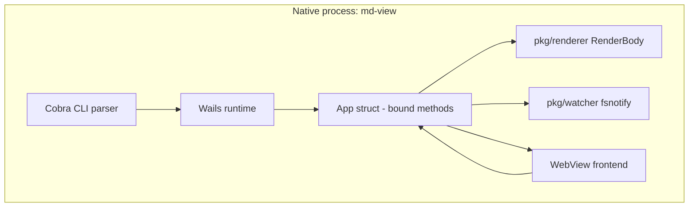
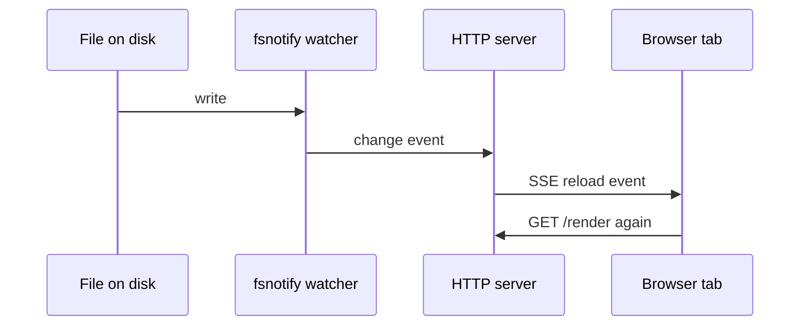
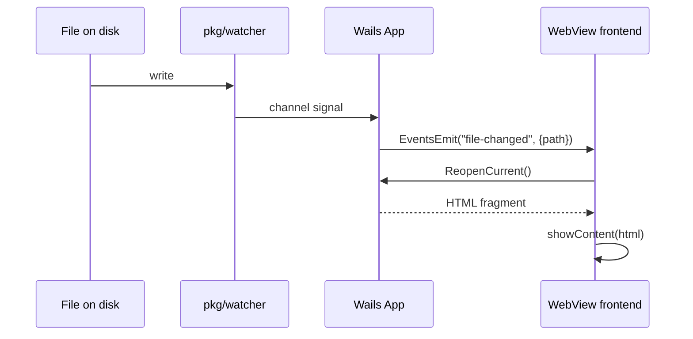
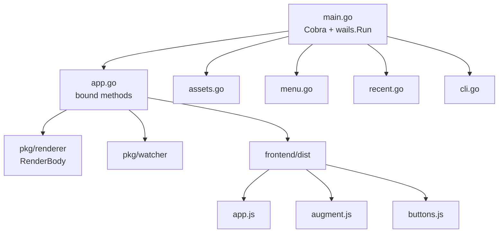

# Replacing md-view with a Wails v2 Desktop Application: A Technical Deep Dive

This note explains the replacement of `md-view` from a daemon-driven browser application into a single native desktop application built with Wails v2. The goal is not to restate a changelog. The goal is to preserve the technical shape of the system so that a future reader can understand what changed, why it changed, what parts survived the rewrite, what parts were deleted, how the new command path works, how the rendering pipeline is structured, and where the remaining limitations are.

The source repository is `/home/manuel/code/wesen/2026-05-07--md-server`. The replacement work was designed and tracked in the MD-WAILS ticket workspace under `ttmp/2026/06/13/MD-WAILS--port-md-view-to-a-wails-v2-desktop-application/`. The implementation ended with a single `md-view` binary produced by `wails build`, with the daemon, Unix-socket protocol, HTTP server, and PID/port/socket state files removed from the repo.

> [!summary]
> - `md-view` is now a **single Wails desktop binary**, not a CLI that spawns or reuses a daemon plus browser.
> - The **renderer survived** the rewrite. The important structural change was extracting `RenderBody`, which returns a chrome-free HTML fragment consumed by a stable frontend shell.
> - The new app preserves the primary CLI contract: `md-view view <file> [--dark]` opens the file in a native window.
> - Live reload, relative image serving, Mermaid rendering, recent files, drag-and-drop, reMarkable upload, and toolbar buttons were all rebuilt around the Wails bridge and static embedded frontend assets.
> - One known limitation remains on this Linux machine: Wails' `SingleInstanceLock` did not deduplicate second launches over D-Bus, so a second `md-view view ...` opened a second window. This is acceptable for the current project state and is documented, not hidden.

## Why this note exists

The rewrite is significant enough that reading the code alone is an inefficient way to recover the system design. The old system and the new system solve the same problem, but they solve it through fundamentally different process models. In the old architecture, the browser was outside the application and the daemon mediated every rendered view. In the new architecture, the WebView is inside the application and the Go runtime owns the full lifecycle. That difference changes the build, the command path, the trust boundaries, the rendering contract, the frontend's responsibilities, and the failure modes.

A future reader needs more than a list of commits. They need a compact model of the architecture and its reasons. The replacement also surfaced a few non-obvious lessons:

- a Wails production binary must be built with `wails build`, not plain `go build`, because Wails injects the build tags that make the runtime boot correctly
- the renderer's real reusable asset was not the full HTML page, but the Markdown-to-fragment core later exposed as `RenderBody`
- frontend enhancement code that used to run once per page load must become re-runnable in a fragment-swapping WebView
- Linux single-instance behavior depends on D-Bus in ways that do not always produce the expected deduplication behavior

Those are exactly the kinds of details that disappear if they are not written down.

## The starting point: what md-view used to be

The old `md-view` was a three-process design:

1. a short-lived CLI process
2. a long-lived background daemon
3. the user's browser

When you ran `md-view view README.md`, the command path was:

```mermaid
flowchart LR
    A[md-view CLI] --> B[ensureDaemonRunning]
    B --> C[PID / port / socket files]
    A --> D[Unix socket JSON command]
    D --> E[daemon]
    E --> F[/render HTTP endpoint]
    F --> G[browser tab]
    E --> H[/events SSE]
    H --> G
```

This architecture was simple to explain operationally but expensive in process structure. The CLI had to know how to find or start the daemon. The daemon had to own a socket path and a port file. The renderer had to emit a complete HTML document with CSS and scripts inlined or served via `/static/*`. Live reload used SSE. Relative images used a `/file/<abs-path>` handler guarded by an allow-list. Browser selection, browser window management, and focus behavior were all external concerns.

The key packages were:

- `pkg/commands/` — command orchestration (`view`, `serve`, `stop`, `status`)
- `pkg/daemon/` — PID / port / socket state in `~/.local/state/md-view/`
- `pkg/protocol/` — newline-delimited JSON over a Unix socket
- `pkg/server/` — `/render`, `/events`, `/file`, `/upload-remarkable`, `/raw`
- `pkg/renderer/` — Goldmark + Chroma + frontmatter + Mermaid + static asset embedding
- `pkg/watcher/` — fsnotify wrapper feeding the SSE stream

The old model worked. The rewrite does not exist because the old model was broken. It exists because the process boundaries were no longer desirable.

## Why Wails was the right replacement

Wails occupies a very specific design space: a Go program plus a platform-native WebView in one process, with a bridge that exposes Go methods to JavaScript and an event system for Go-originated UI updates. That shape fits `md-view` almost exactly because the existing repo already had the most important prerequisite: the renderer was pure enough to be separated from the transport.

The old daemon model used HTTP because the browser lived outside the process. Once the browser becomes an embedded WebView, HTTP is no longer the natural transport. The right transport becomes the Wails bridge:

- **Bound methods** for request/response calls initiated by the frontend
- **Events** for Go-initiated UI changes such as menu actions, drag-and-drop, watcher-driven reloads, and startup file-open flows

There was also a practical reason to prefer Wails over a browser-only model: the desktop app gets a native window title, native file-open/save dialogs, native drag-and-drop, a real menu bar, and a cleaner user-facing story. The primary command still reads `md-view view README.md`, but the experience is now a first-class application window instead of a browser tab.

## The new process model

The replacement collapses the old process graph into a single application process:



There is still a CLI entry point, but it is now just the way the application is launched. It no longer speaks to a second process. The important distinction is this:

- the CLI survives as a *surface*
- the daemon disappears as an *implementation*

That is the heart of the replacement.

## The surviving core: the renderer

The deepest structural success of the rewrite is that `pkg/renderer` survived. The frontmatter parsing, Goldmark pipeline, syntax-highlighting setup, and relative image-path rewriting were all already conceptually separate from HTTP.

The crucial refactor was this one:

- **Old world:** `Render(filePath, opts) -> full standalone HTML page`
- **New world:** `RenderBody(filePath, opts) -> { Frontmatter, Body, Title }`

This split matters because the desktop frontend no longer wants the renderer to produce a full page. It wants the renderer to produce just the content fragment that belongs inside `#content`. The stable page shell — toolbar, dropzone, sidebar, theme button, runtime script, Mermaid library, augmentation hooks — lives in `frontend/dist/index.html`.

That changed the contract of the renderer without discarding the renderer's logic.

### The fragment contract

`RenderBody` performs these steps:

1. read the file from disk
2. split YAML frontmatter from Markdown body
3. render Markdown with Goldmark and class-based Chroma highlighting
4. rewrite relative images to `/file/<abs-path>` URLs
5. resolve a title from explicit option, frontmatter `Title`, or filename
6. return frontmatter HTML, body HTML, and title separately

In pseudocode:

```go
func RenderBody(filePath string, opts Options) (*BodyHTML, error) {
    data := os.ReadFile(filePath)
    fm, body, hasFM := extractFrontmatter(data)

    md := goldmark.New(
        extension.GFM,
        highlighting.WithStyle("github"),
        highlighting.WithFormatOptions(chroma_html.WithClasses(true)),
    )

    rendered := md.Convert(body)
    rendered = rewriteImagePaths(rendered, filePath, opts.Port)

    title := opts.Title
    if title == "" && hasFM && fm.Title != "" { title = fm.Title }
    if title == "" { title = filepath.Base(filePath) }

    frontmatterHTML := ""
    if hasFM { frontmatterHTML = formatFrontmatterHTML(fm) }

    return &BodyHTML{
        Frontmatter: frontmatterHTML,
        Body:        rendered,
        Title:       title,
    }, nil
}
```

The legacy `Render` function survived as a thin wrapper during the transition so that `pkg/server` could keep compiling until the cutover. Once the cutover happened and `pkg/server` was deleted, `RenderBody` became the conceptual center of the renderer package.

## The frontend shell

The frontend is not a React application. It is static HTML, CSS, and JavaScript, embedded into the binary and served by Wails. That was a deliberate choice. The UI is small enough that a framework would add more structure than value.

The shell consists of:

- `frontend/dist/index.html` — toolbar, dropzone, content area, sidebar
- `frontend/dist/app.js` — Open button, theme toggle, event listeners, content swap logic
- `frontend/dist/augment.js` — copy-button and Mermaid enhancement logic, re-runnable after each content swap
- `frontend/dist/buttons.js` — fixed-position buttons for reMarkable upload, copy-path, and download
- `frontend/dist/base.css`, `dark.css`, generated `chroma.css`, generated `ui.css`, and the app chrome `style.css`

### Why the shell must be stable

The frontend does not get replaced per file. Only `#content` gets replaced. This is one of the central differences between the browser model and the WebView model.

In the old daemon architecture, the renderer produced a full page, so every file open or refresh effectively started from a clean document. Inline scripts could run once and be done. In the Wails model, the page shell persists. This means any enhancement that depends on the content DOM must be **re-runnable**.

That requirement produced `augment.js` and `buttons.js`.

## Re-runnable augmentation: the copy button and Mermaid

The original browser version injected copy buttons and Mermaid rendering through scripts that ran once when the page loaded. That pattern breaks when only `#content` is replaced.

The fix was architectural, not cosmetic:

- `augment.js` exposes `window.MDSAugmentPage()`
- `showContent(html)` calls `MDSAugmentPage()` after `content.innerHTML = html`
- the same path is reused after live reloads (`file-changed` → `ReopenCurrent` → `showContent`)

The augmentation work is split into two idempotent passes:

1. inject copy buttons into code blocks, skipping Mermaid code blocks
2. convert Mermaid fenced code blocks into rendered SVG diagrams

This structure matters because the order of operations is observable. An early version ran copy-button injection before Mermaid conversion without skipping `language-mermaid`, which left a stray copy button beside each diagram. The fix was not to suppress the symptom visually, but to make the augmentation logic classify Mermaid blocks as diagrams, not code-copy targets.

### Theme-sensitive re-rendering

Mermaid diagrams must be re-rendered on theme change, not just on file change. The frontend therefore exposes `MDSMermaidRerender(theme)` and calls it from the theme-toggle path.

This is a case where the stable shell is a benefit rather than a burden. The frontend can keep the diagram state in-place and re-render when needed, rather than forcing a full window reload.

## Live reload without SSE

The daemon model used SSE over `/events`. The desktop model uses `pkg/watcher` plus Wails events.

The old flow was:



The new flow is:



The conceptual change is subtle but important. The watcher no longer signals a transport endpoint. It signals the application directly. The frontend no longer performs a network fetch. It invokes a bound method.

That is a cleaner responsibility split.

## Relative image serving through `AssetServer.Handler`

Relative image support survived almost unchanged at the renderer level because `rewriteImagePaths` was already rewriting to a `/file/...` URL space.

What changed was who serves that URL.

In the daemon version, `pkg/server.handleFileServing` validated the path against an allow-list and then called `http.ServeContent`. In the desktop version, `App.ServeReferencedFile` is registered as the Wails `AssetServer.Handler`, so requests the embedded frontend cannot satisfy fall through to it.

The handler logic mirrors the old server:

1. accept only `/file/<abs-path>`
2. resolve the absolute path
3. verify it sits inside an allowed directory
4. reject everything else with 403
5. serve the file via `http.ServeContent`

The allow-list itself is populated on `openPath`: when a file is opened, its directory is registered as allowed.

This was verified directly:

- a rendered image under the file's directory returned **200**
- a fetch of `/file/etc/passwd` returned **403**

The most important implementation detail is the prefix check:

```go
if absPath == dir || strings.HasPrefix(absPath, dir+string(filepath.Separator)) {
    return true
}
```

The `+separator` part is what prevents `/tmp/foo` from implicitly authorizing `/tmp/foobar`.

## Menus, drag-and-drop, and recent files

The menu bar follows the Wails event model exactly:

- File → Open… calls `app.OpenFile()` and emits `file-opened` on success or `file-error` on failure
- File → Close emits `close-file`
- View → Toggle Theme flips the backend theme and emits `theme-changed`

This is not optional style. It is the required split between Go and the DOM. Menu callbacks run in Go, so they must emit events if the frontend needs to react.

Drag-and-drop follows the same pattern. `OnFileDrop` opens the first Markdown-looking file and emits `file-opened`.

Recent files are persisted to JSON under `os.UserConfigDir()/md-view/recent.json`, replacing the old daemon's PID/port/socket state files with a much smaller and more relevant persistent artifact.

The persistence model is straightforward:

- load on startup
- push each opened file to the front, deduplicating and capping at 10
- save on shutdown

That design is sufficient for a single-window viewer. If crash-safety ever matters, saving after each `pushRecent` would be the next refinement.

## The new CLI command path

The old CLI was a command router into the daemon. The new CLI is an application launcher.

The root command is now Cobra-based at the repo root and exposes:

- `md-view` — open an empty window
- `md-view view <file>` — open that file in the window
- `md-view view --dark <file>` — open it in dark mode

The important startup problem is timing. The CLI argument is known before `wails.Run`, but the file cannot be opened until the WebView exists.

That is why the app has `PendingOpen` and `PendingDark`, and why `OnDomReady` exists.

In pseudocode:

```go
func runDesktop(file string, dark bool) error {
    app := NewApp()
    app.PendingOpen = file
    app.PendingDark = dark
    if dark { app.theme = "dark" }

    return wails.Run(&options.App{
        OnStartup:  app.Startup,
        OnDomReady: app.OnDomReady,
        OnShutdown: app.Shutdown,
        Bind:       []interface{}{app},
        // ... assets, menu, drag-and-drop ...
    })
}
```

And later:

```go
func (a *App) OnDomReady(ctx context.Context) {
    if a.PendingOpen == "" { return }

    file := a.PendingOpen
    dark := a.PendingDark
    a.PendingOpen = ""
    a.PendingDark = false

    if dark {
        a.theme = "dark"
        runtime.EventsEmit(a.ctx, "theme-changed", a.theme)
    }

    html, err := a.openPath(file)
    if err != nil {
        runtime.EventsEmit(a.ctx, "file-error", err.Error())
        return
    }

    runtime.EventsEmit(a.ctx, "file-opened", map[string]string{
        "html":  html,
        "path":  a.currentFile,
        "title": a.currentFileTitle(),
    })
}
```

This is the core of drop-in compatibility. It does not depend on the single-instance machinery. It is the first-launch path.

## `SingleInstanceLock`: wired correctly, not deduplicating here

Wails' built-in `SingleInstanceLock` was wired exactly as documented. The callback receives `options.SecondInstanceData` and parses the second process's `os.Args` to reopen the file in the first window.

The code is correct by the documented API. The behavior on this Linux machine did not match the desired outcome.

Specifically:

- a first `build/bin/md-view view README.md` opened `md-view: README.md`
- a second `build/bin/md-view view /tmp/md-view-phase2.md --dark` opened a **second** native window instead of forwarding to the first instance and exiting

Investigation showed that Wails' Linux single-instance path uses **D-Bus** (`internal/frontend/desktop/linux/single_instance.go`). The second process should detect that the D-Bus name is already taken, forward its args, and exit. In this environment it did not do so.

This is not being hidden or rephrased. It is a known limitation.

The practical consequence is acceptable because the user explicitly confirmed that multiple windows are fine. The primary CLI contract still holds: each `md-view view <file>` opens the file in a native desktop window. The deduplication behavior remains a future investigation if single-window behavior becomes important.

## Build-system cutover: why `wails build` is mandatory

One of the most important technical findings of the rewrite is this one:

> A Wails production binary is **not** correctly produced by plain `go build` with only `-tags webkit2_41`.

A direct `go build` produced a binary that launched with this runtime error:

```
Error: Wails applications will not build without the correct build tags.
```

This matters because it changes every build path:

- local `make build`
- CI compile checks
- GoReleaser
- documentation

The fix was to repoint the project to `wails build`, and to give GoReleaser the equivalent tag set explicitly.

The Makefile now builds like this:

```make
build: frontend-css
	wails build -tags webkit2_41 -s
```

And the CSS generator is part of the build pipeline because the embedded frontend links generated assets.

This is the kind of detail that is easy to miss if you only test through `wails dev`, which injects the necessary flow automatically.

## The cutover itself

The old packages were removed cleanly:

- `cmd/md-view/`
- `pkg/commands/`
- `pkg/daemon/`
- `pkg/protocol/`
- `pkg/server/`

The surviving codebase is much smaller conceptually:



This cutover also reduced the direct dependency surface. `glazed` disappeared when the old CLI orchestration was removed. The direct dependencies are now much closer to the true architecture:

- Cobra
- Wails
- Goldmark
- Chroma
- fsnotify
- logcopter

That is a cleaner project shape.

## The final feature set

As of the current implementation, `md-view` provides:

- `md-view view <file> [--dark]`
- native desktop window
- Goldmark rendering with class-based Chroma syntax highlighting
- frontmatter rendering
- Mermaid diagrams
- dual-theme light/dark page + code styling
- live reload on file write
- relative image serving via `/file/...` allow-list
- menu bar
- drag-and-drop
- recent-files persistence
- copy-to-clipboard for code blocks
- copy-path / download / reMarkable toolbar buttons
- reMarkable upload through `remarquee`

The practical validation summary is stronger than a design-only report because each major behavior was exercised:

- file rendering in the window
- CSS/theme flip via computed styles and screenshots
- Mermaid rendering to SVG
- live reload after on-disk edits
- image fetch 200 / traversal 403
- recent-files JSON persisted to disk
- production binary built with `wails build` launches and opens files
- reMarkable upload landed on the device/cloud

## Remaining limitations and follow-up work

The major known limitation is the Linux D-Bus single-instance behavior. The code remains in place because it is the documented Wails mechanism and may work on other setups, but it is not relied upon for correctness.

Secondary follow-ups:

- add a favicon or 204 handler to silence the recurring favicon 404
- persist the theme preference alongside recent files
- verify `/file/...` path handling on macOS and Windows
- decide whether GoReleaser should continue using explicit Wails build tags or delegate to a dedicated Wails packaging path

## Working rules distilled from the rewrite

The following rules are the durable engineering results of the project:

1. If the browser moves inside the process, remove the network transport unless it still solves a real problem.
2. Preserve the renderer as a pure component. Change the output contract only as much as the embedding model requires.
3. In a stable-shell WebView frontend, all DOM augmentation must be re-runnable after fragment swaps.
4. Menu callbacks and other Go-originated UI actions must emit events. They cannot update the DOM directly.
5. Relative file serving requires an allow-list. Prefix checks must include a path separator.
6. A Wails production build must be built through Wails (or with the full Wails tag set), not plain `go build`.
7. Treat platform-specific single-instance behavior as an integration point that must be verified on the target platform, not as a property guaranteed by the API alone.

## Source material

The most relevant implementation notes live in:

- `/home/manuel/code/wesen/2026-05-07--md-server/ttmp/2026/06/13/MD-WAILS--port-md-view-to-a-wails-v2-desktop-application/design-impl-guide/01-wails-port-analysis-design-and-implementation-guide.md`
- `/home/manuel/code/wesen/2026-05-07--md-server/ttmp/2026/06/13/MD-WAILS--port-md-view-to-a-wails-v2-desktop-application/reference/01-investigation-diary.md`
- `/home/manuel/code/wesen/2026-05-07--md-server/ttmp/2026/06/13/MD-WAILS--port-md-view-to-a-wails-v2-desktop-application/sources/01-wails-single-instance-lock-api.md`
- `/home/manuel/code/wesen/2026-05-07--md-server/ttmp/2026/06/13/MD-WAILS--port-md-view-to-a-wails-v2-desktop-application/sources/02-wails-cobra-integration-discussion-1271.md`
- `/home/manuel/code/wesen/2026-05-07--md-server/ttmp/2026/06/13/MD-WAILS--port-md-view-to-a-wails-v2-desktop-application/sources/03-wails-cli-with-app-discussion-3098.md`

Related vault context:

- [[ARTICLE - Wails v2 Desktop Applications - Technical Deep Dive]]
- [[ARTICLE - Wails v3 JavaScript Go Bridge and Build System - Technical Deep Dive]]

## Closing

The most important thing to understand about this rewrite is that it was not a frontend rewrite. It was a process-model rewrite.

The old application treated the browser as an external consumer reached through HTTP. The new application treats the WebView as an internal surface reached through method calls and events. Once that shift is understood, the rest of the implementation follows logically:

- the daemon disappears
- the renderer becomes a fragment producer
- SSE becomes a Wails event
- relative images move to an asset handler
- toolbar actions become bound methods
- the CLI becomes a launcher instead of a daemon client

That is the real design. The code is just its concrete form.
