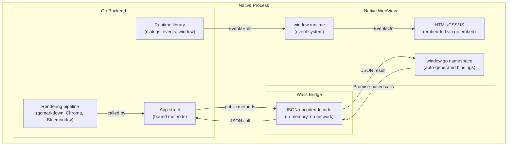
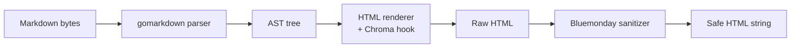

# Building Desktop Applications with Wails v2 and Go: A Technical Deep Dive

This article is a detailed technical analysis of building a cross-platform desktop application with Wails v2 and Go. It covers the Wails runtime architecture, the Go–JavaScript communication bridge, the Markdown rendering pipeline, and every non-obvious detail that emerged during implementation. The reference application is a Markdown file viewer that opens `.md` files, renders them to styled HTML with syntax-highlighted code blocks, and displays the result in a native desktop window.

The target audience is a developer who writes Go and wants to understand exactly what Wails does, how the bridge works, what the build produces, and where the sharp edges are. This is not a getting-started tutorial. It is a technical document that explains the system so that you can reason about it, extend it, and debug it.

> [!summary]
> - Wails v2 runs Go and a platform-native WebView in the same process. Communication between Go and JavaScript travels through an in-memory JSON bridge — no HTTP server, no IPC pipe, no network overhead.
> - The Go backend owns all business logic. The JavaScript frontend is a thin presentation layer. Bound Go struct methods appear as JavaScript functions that return Promises.
> - Menu callbacks run in Go and cannot update the DOM directly. They must emit Wails events that the frontend listens for. This is the single most common source of "my menu doesn't work" bugs.
> - The Markdown rendering pipeline (gomarkdown parser → AST → Chroma-highlighted HTML → Bluemonday sanitization) runs entirely in Go and is testable without a GUI.
> - On Linux, Wails v2 requires `libwebkit2gtk-4.1-dev` and `libsoup-3.0-dev`, and the build must use `-tags webkit2_41`.

## Why this note exists

Wails occupies a specific niche: it lets you write desktop applications in Go with a web frontend, producing a single binary that is an order of magnitude smaller than an equivalent Electron application. The documentation covers the basics well, but several architectural details only become visible when you build and debug a real application. This article records those details so that the next developer does not have to rediscover them.

## When to use Wails

Use Wails when:

- you have Go business logic (file I/O, parsing, data transformation) that you want to drive from a desktop UI
- you want a single-binary distribution with no external runtime dependencies
- you need native file dialogs, window management, and drag-and-drop support
- binary size matters (Wails produces ~13 MB; Electron produces ~150 MB)

Do not use Wails when:

- you need a pure-native widget set (Wails renders HTML in a WebView; use Qt or GTK instead)
- your frontend is complex enough to require server-side rendering or a Node.js runtime
- you need multi-window state synchronization beyond what Wails events provide
- you are targeting platforms where the native WebView is unavailable or severely restricted

## The Wails runtime architecture

A Wails application consists of three layers: the Go backend, the Wails bridge, and the WebView frontend. All three run in the same operating system process.



The bridge is the core mechanism. When JavaScript calls a bound Go method, the following sequence occurs:

1. JavaScript invokes `window['go']['main']['App']['OpenFile']()`.
2. The bridge encodes the call as a JSON payload containing the method name and arguments.
3. The bridge routes the payload to the registered Go struct method.
4. The Go method executes and returns a value (or an error).
5. The bridge encodes the result as JSON and sends it back.
6. The JavaScript Promise resolves with the result (or rejects with the error).

This is an in-memory operation. There is no HTTP server, no WebSocket, no pipe. The call travels through a function call boundary, not a network boundary. For typical method calls (returning strings, structs, lists), the round-trip takes sub-millisecond.

### The native WebView per platform

Wails does not bundle a browser. It uses the operating system's native web rendering engine:

| Platform | Engine | Notes |
|----------|--------|-------|
| Windows | WebView2 (Chromium-based) | Pre-installed on Windows 10/11; auto-updates via Windows Update |
| macOS | WKWebView (WebKit) | Built into macOS; same engine as Safari |
| Linux | WebKitGTK | Requires `libwebkit2gtk-4.1-dev` (or `-4.0-dev`); must be installed separately |

On Linux, the WebView version matters. Wails v2.12 defaults to webkit2gtk-4.0. Newer Linux distributions (Ubuntu 24.04+) ship webkit2gtk-4.1. To build against 4.1, pass `-tags webkit2_41` to the build command. The build will fail with a pkg-config error if the wrong `-dev` package is installed.

### The `context.Context` requirement

Every Wails runtime function — `OpenFileDialog`, `EventsEmit`, `WindowSetTitle` — requires a `context.Context`. This context is provided in the `OnStartup` callback and must be saved as a struct field on the App struct. If you call a runtime function before the context is set, the application will panic.

```go
type App struct {
    ctx context.Context // Must be saved in startup()
}

func (a *App) startup(ctx context.Context) {
    a.ctx = ctx // This assignment is mandatory
}
```

This is the single most important initialization rule in a Wails application. Every runtime call depends on this context.

## The Go–JavaScript communication model

Wails provides two communication channels between Go and JavaScript. Understanding the distinction between them is essential for correct application design.

### Channel 1: Bound methods (JS → Go)

When you pass a struct instance to the `Bind` option in `wails.Run()`, Wails scans the struct for public methods (those starting with an uppercase letter) and generates JavaScript wrapper functions for each one. These wrappers appear under `window['go']['<package>']['<StructName>']['<MethodName>']`.

Each generated wrapper returns a JavaScript Promise. If the Go method returns `(ResultType, error)`, the Promise resolves with the result on success or rejects with the error string on failure.

```go
// Go
func (a *App) OpenFile() (string, error) {
    // ... open file dialog, read and render ...
    return htmlContent, nil
}
```

```javascript
// JavaScript (auto-generated binding)
export function OpenFile() {
    return window["go"]["main"]["App"]["OpenFile"]();
}
```

The binding generation happens when you run `wails dev` or `wails build`. Wails creates a `wailsjs/` directory inside the frontend directory with `.js` and `.d.ts` files. These files should not be edited manually — they are regenerated on every build.

### Channel 2: Events (Go → JS and JS → Go)

Events enable pub/sub communication. The Go backend can emit events that the frontend listens for, and vice versa. This channel is necessary when the Go side initiates an action whose result must update the DOM — for example, when a menu callback opens a file and needs to display the rendered HTML.

```go
// Go: emit an event
runtime.EventsEmit(a.ctx, "file-opened", map[string]string{
    "html":  htmlContent,
    "path":  filePath,
    "title": filename,
})
```

```javascript
// JavaScript: listen for the event
runtime.EventsOn('file-opened', (data) => {
    document.getElementById('content').innerHTML = data.html;
});
```

### Why both channels exist

Bound methods are for request/response communication initiated by the frontend. The frontend calls a method, waits for the result, and updates the UI. Events are for communication initiated by the Go side (or for cases where the Go side must push data to the frontend without a corresponding frontend request).

The critical case where you must use events instead of bound methods is **menu callbacks**. When the user clicks a menu item, the callback runs in Go. The callback can call `app.OpenFile()` and receive the rendered HTML, but it cannot update the DOM — Go code has no access to the DOM. The only way to send the result to the frontend is to emit an event.

This is the most common mistake when building Wails applications: calling a bound method from a menu callback, receiving the result in Go, and then discarding it because there is no way to pass it to the frontend. The correct pattern is to emit an event from the menu callback and let the frontend handle the DOM update.

```go
// WRONG: result is discarded, UI never updates
fileMenu.AddText("Open…", keys.CmdOrCtrl("o"), func(_ *menu.CallbackData) {
    _, _ = app.OpenFile() // HTML returned but never displayed
})

// CORRECT: emit event so frontend can update the DOM
fileMenu.AddText("Open…", keys.CmdOrCtrl("o"), func(_ *menu.CallbackData) {
    html, err := app.OpenFile()
    if err != nil {
        runtime.EventsEmit(app.ctx, "file-error", err.Error())
        return
    }
    if html != "" {
        runtime.EventsEmit(app.ctx, "file-opened", map[string]string{
            "html":  html,
            "path":  app.currentFile,
            "title": app.currentFileTitle(),
        })
    }
})
```

## The Markdown rendering pipeline

The rendering pipeline converts raw Markdown text into sanitized, syntax-highlighted HTML. It runs entirely in Go and is testable without a GUI.

The pipeline has four stages: parse, render, highlight, and sanitize.



### Stage 1: Parse Markdown into an AST

The `gomarkdown/markdown` parser converts Markdown text into an abstract syntax tree. Each node in the tree represents a structural element: `Heading`, `Paragraph`, `CodeBlock`, `Link`, `Image`, `Table`, and so on.

The parser is configured with a set of extensions that determine which Markdown features are recognized:

```go
extensions := parser.CommonExtensions | parser.AutoHeadingIDs |
    parser.NoEmptyLineBeforeBlock | parser.Footnotes |
    parser.Attributes | parser.SuperSubscript
p := parser.NewWithExtensions(extensions)
doc := p.Parse(mdContent)
```

The key extensions and what they enable:

| Extension | Effect |
|-----------|--------|
| `CommonExtensions` | Baseline CommonMark plus tables, fenced code blocks, autolinks, strikethrough |
| `AutoHeadingIDs` | Generate `id` attributes on headings (`# Title` → `<h1 id="title">`) |
| `Footnotes` | Support `[^1]` footnote syntax with back-references |
| `Attributes` | Support `{#id .class}` attribute blocks before elements |
| `SuperSubscript` | Support `2^10^` superscript and `H~2~O` subscript |

### Stage 2: Render AST to HTML (with syntax highlighting hook)

The HTML renderer walks the AST and produces HTML for each node. The critical integration point is `RenderNodeHook` — a function that intercepts specific node types before the default renderer processes them.

```go
func createRenderer() *html.Renderer {
    opts := html.RendererOptions{
        Flags:          html.CommonFlags | html.HrefTargetBlank,
        RenderNodeHook: chromaRenderHook,
    }
    return html.NewRenderer(opts)
}
```

The `chromaRenderHook` function checks whether the current node is a `*ast.CodeBlock`. If it is, the hook renders the code with Chroma syntax highlighting and returns `true` to prevent the default renderer from also processing the node. If it is not a code block, the hook returns `false`, and the default renderer handles the node normally.

```go
func chromaRenderHook(w io.Writer, node ast.Node, entering bool) (ast.WalkStatus, bool) {
    codeBlock, ok := node.(*ast.CodeBlock)
    if !ok {
        return ast.GoToNext, false // Let default renderer handle it
    }
    if !entering {
        return ast.GoToNext, true // Skip exit pass for leaf nodes
    }
    // Render with Chroma instead of default plain-text output
    highlighted, err := highlightCode(string(codeBlock.Literal), string(codeBlock.Info))
    if err != nil {
        // Fallback to plain text
        fmt.Fprintf(w, "<pre><code>%s</code></pre>", escapeHTML(string(codeBlock.Literal)))
        return ast.GoToNext, true
    }
    io.WriteString(w, highlighted)
    return ast.GoToNext, true
}
```

The `entering` parameter distinguishes between entering a node (before its children are rendered) and leaving a node (after its children). For leaf nodes like `CodeBlock` that have no children, rendering only on entry is correct.

### Stage 3: Chroma syntax highlighting

The `highlightCode` function uses Chroma to produce syntax-highlighted HTML. Chroma is a pure Go library that supports over 200 programming languages. It works in three steps: lex the source into tokens, style the tokens according to a color scheme, and format the result as HTML with CSS classes.

```go
func highlightCode(source, lang string) (string, error) {
    lexer := lexers.Get(lang)            // Try explicit language
    if lexer == nil {
        lexer = lexers.Analyse(source)   // Try to detect language
    }
    if lexer == nil {
        lexer = lexers.Fallback           // Give up, use plain text
    }
    lexer = chroma.Coalesce(lexer)        // Merge adjacent tokens of same type

    formatter := chromahtml.New(
        chromahtml.WithClasses(true),     // Use CSS classes, not inline styles
        chromahtml.TabWidth(4),
        chromahtml.WrapLongLines(true),
    )

    style := styles.Get("github")         // GitHub-style color scheme
    iterator, _ := lexer.Tokenise(nil, source)
    
    var buf bytes.Buffer
    formatter.Format(&buf, style, iterator)
    return buf.String(), nil
}
```

The `WithClasses(true)` option is important. It tells Chroma to output `<span class="chroma k">` instead of `<span style="color: #cf222e">`. Class-based output is smaller, caches better, and enables theme switching (the same HTML can be styled differently by swapping a CSS file).

### Stage 4: HTML sanitization with Bluemonday

The final stage runs the rendered HTML through Bluemonday's `UGCPolicy()` (User-Generated Content policy). This policy allows safe HTML elements and attributes while stripping dangerous ones like `<script>`, `<iframe>`, and `onclick` handlers.

The default UGC policy is restrictive. Several attributes must be explicitly allowed for the rendering pipeline to work correctly:

```go
policy := bluemonday.UGCPolicy()
policy.AllowAttrs("class").OnElements("code", "span", "pre", "div")  // Chroma CSS classes
policy.AllowAttrs("style").OnElements("span")                        // Chroma inline fallback
policy.AllowElements("sup", "sub")                                   // Super/subscript
policy.AllowAttrs("id").OnElements("h1", "h2", "h3", "h4", "h5", "h6")  // Heading anchors
policy.AllowAttrs("target").OnElements("a")                          // target="_blank" on links
safeHTML := policy.SanitizeBytes(rawHTML)
```

The `target` attribute requires explicit allowance because Bluemonday strips it by default as a security precaution (preventing `target="_blank"` without `rel="noopener"`). Since gomarkdown's `HrefTargetBlank` flag adds `target="_blank"` to all links, the attribute must be whitelisted or links will lose their new-tab behavior.

## The frontend: vanilla JS with the Wails runtime

The frontend is plain HTML, CSS, and JavaScript with no framework. This section explains the two non-obvious requirements: how to call Go methods and how to handle the Wails runtime initialization timing.

### Calling Go methods from JavaScript

Wails injects a `window.go` namespace into the WebView. Bound struct methods appear under `window.go[<package>][<Struct>][<Method>]`. For a struct named `App` in the `main` package:

```javascript
// Call the OpenFile method
window['go']['main']['App']['OpenFile']()
    .then((html) => {
        document.getElementById('content').innerHTML = html;
    })
    .catch((err) => {
        console.error('Failed to open file:', err);
    });
```

ES module `import` syntax does not work in a regular `<script>` tag in a vanilla JS Wails frontend. The Wails-generated bindings in `wailsjs/go/main/App.js` use `export function`, which requires `<script type="module">`. However, module scripts have stricter CORS and loading behavior that can conflict with Wails' asset serving. The reliable approach is to call `window.go` directly.

### Initialization timing

The `window.go` namespace is not available immediately when the page loads. It is injected by the Wails runtime after the WebView initializes. If your JavaScript calls `window.go` before it exists, you will get a TypeError.

The solution is to defer application initialization until `window.go` is available:

```javascript
window.addEventListener('DOMContentLoaded', () => {
    const checkReady = setInterval(() => {
        if (window['go'] && window['go']['main']) {
            clearInterval(checkReady);
            // Now safe to call Go methods
            initializeApp();
        }
    }, 50);
});
```

An alternative is to load the Wails runtime script explicitly:

```html
<script src="/wails/runtime.js"></script>
```

This makes `runtime.EventsOn` and other runtime functions available. However, `window.go` may still not be populated at the time the script loads, so the polling approach is the most robust.

### Dark/light theme implementation

The theme system uses CSS custom properties scoped by a `data-theme` attribute on the `<body>` element:

```css
:root {
    --bg-primary: #ffffff;
    --text-primary: #1f2328;
    --code-bg: #f6f8fa;
}

[data-theme="dark"] {
    --bg-primary: #0d1117;
    --text-primary: #e6edf3;
    --code-bg: #161b22;
}
```

The Go side stores the current theme as a string field on the App struct. The `ToggleTheme` method flips the value and returns the new theme name. The frontend calls this method and applies the result:

```javascript
themeBtn.addEventListener('click', () => {
    window['go']['main']['App']['ToggleTheme']()
        .then((theme) => {
            document.body.setAttribute('data-theme', theme);
            themeBtn.textContent = theme === 'dark' ? '☀️ Light' : '🌙 Dark';
        });
});
```

Chroma syntax highlighting CSS requires special handling for dark mode. The generated CSS uses `.chroma` as the base selector for both light and dark themes. Dark mode styles are wrapped in a `[data-theme="dark"]` selector:

```css
/* Light theme (default) */
.chroma .k { color: #cf222e }     /* Keyword */

/* Dark theme */
[data-theme="dark"] {
    .chroma .k { color: #ff7b72 }  /* Keyword - dark variant */
}
```

The Chroma formatter generates `.chroma.light` and `.chroma.dark` class prefixes by default. These must be normalized to `.chroma` (via search-and-replace) because the HTML output uses only the `.chroma` class, not `.chroma.light` or `.chroma.dark`.

## Application state persistence

The application persists two categories of state: the recent files list and the current theme. Theme persistence is not yet implemented; recent files are stored as a JSON array in the XDG config directory.

### Recent files

The recent files list is stored at `~/.config/markdown-viewer/recent.json` on Linux (or the platform equivalent returned by `os.UserConfigDir()`). The file contains a JSON array of absolute file paths, ordered most-recent-first, limited to 10 entries.

```go
func (a *App) configPath() string {
    configDir, err := os.UserConfigDir()
    if err != nil {
        home, _ := os.UserHomeDir()
        return filepath.Join(home, "."+appName)
    }
    return filepath.Join(configDir, appName)
}
```

The list is loaded when the App struct is created (`NewApp()`) and saved when the application shuts down (`shutdown()`). Adding a file removes any duplicate entry, prepends the path, and trims the list to 10 items.

## File drop handling

Wails v2 supports native file drag-and-drop when the `DragAndDrop` option is enabled:

```go
err := wails.Run(&options.App{
    // ...
    DragAndDrop: &options.DragAndDrop{
        EnableFileDrop: true,
    },
})
```

When a file is dropped onto the window, Wails calls the `OnFileDrop` method on the bound App struct. The method receives the drop coordinates and a slice of file paths:

```go
func (a *App) OnFileDrop(x, y int, paths []string) {
    for _, path := range paths {
        ext := strings.ToLower(filepath.Ext(path))
        if ext == ".md" || ext == ".markdown" || ext == ".mdown" || ext == ".mkd" {
            html, err := a.openFileAtPath(path)
            if err != nil {
                continue
            }
            runtime.EventsEmit(a.ctx, "file-opened", map[string]string{
                "html":  html,
                "path":  path,
                "title": filepath.Base(path),
            })
            return
        }
    }
}
```

File drop uses the event channel, not the bound method channel. The Go side opens the file, renders the HTML, and emits a `file-opened` event. The frontend listens for this event and updates the DOM. This is the same pattern used by menu callbacks — the Go side produces data, the event delivers it to the frontend, and the frontend displays it.

## The build process

### Development mode

```bash
wails dev -tags "webkit2_41"
```

This starts a development server with hot reload. Frontend changes (HTML, CSS, JS) reload instantly. Go changes trigger a rebuild and application restart. The Wails bindings in `wailsjs/` are regenerated automatically.

### Production build

```bash
wails build -s -tags "webkit2_41"
```

The `-s` flag skips the frontend build step (useful when the frontend has no build step, as in this vanilla JS project). The `-tags "webkit2_41"` flag selects the webkit2gtk-4.1 bindings on Linux.

The build process:

1. Scan Go structs for bound methods → generate TypeScript and JavaScript bindings
2. Build the frontend (if a build command is specified in `wails.json`)
3. Compile the Go binary with `-ldflags="-s -w"` for smaller output
4. Embed the frontend assets into the Go binary via `//go:embed all:frontend/dist`
5. Produce a single native executable

The resulting binary is ~13 MB on Linux. It contains the Go runtime, the Wails runtime, the WebView bindings, and all frontend assets. There are no external file dependencies.

### The `go:embed` directive

The `//go:embed all:frontend/dist` directive in `main.go` tells the Go compiler to include all files from the `frontend/dist/` directory in the compiled binary. The `all:` prefix includes subdirectories. At runtime, the embedded files are accessible as a read-only filesystem (`embed.FS`).

```go
//go:embed all:frontend/dist
var assets embed.FS
```

When the application starts, Wails serves these files to the WebView. The WebView loads `index.html` from the embedded filesystem and then loads CSS and JavaScript relative to that file. In development mode, assets are loaded from disk instead, enabling hot reload.

## Common failure modes

### The context is nil

**Symptom:** Application panics on startup or when clicking a button that calls a runtime function.

**Cause:** The `ctx` field on the App struct was not set in the `startup` callback.

**Fix:** Always save the context:

```go
func (a *App) startup(ctx context.Context) {
    a.ctx = ctx
}
```

### Bound method not appearing in JavaScript

**Symptom:** `window.go.main.App.MyMethod` is `undefined`.

**Cause:** One of three reasons:
1. The method name does not start with an uppercase letter (Go visibility rules apply).
2. The struct was not passed to `Bind` in `wails.Run()`.
3. The bindings have not been regenerated (run `wails dev` or `wails generate module`).

### Menu callback does not update the UI

**Symptom:** Clicking a menu item appears to do nothing.

**Cause:** The menu callback called a Go method and discarded the result. Go code cannot update the DOM.

**Fix:** Emit a Wails event from the menu callback and listen for it in the frontend. See the section "Why both channels exist" above.

### Struct fields missing in TypeScript

**Symptom:** A Go struct returned from a bound method appears in JavaScript with missing fields.

**Cause:** Go struct fields must have `json` tags for Wails to include them in the generated TypeScript definitions:

```go
type FileInfo struct {
    Name string `json:"name"`  // ✅ Will appear in TypeScript
    Size int64                // ❌ Will be missing
}
```

### Blank window on Linux

**Symptom:** The application window opens but shows a blank page.

**Cause:** The webkit2gtk development package is not installed.

**Fix:** Install the package and use the correct build tag:

```bash
sudo apt install libwebkit2gtk-4.1-dev libsoup-3.0-dev
wails build -tags "webkit2_41"
```

### Bluemonday strips valid attributes

**Symptom:** Rendered HTML is missing attributes like `target="_blank"` on links or `id` on headings.

**Cause:** Bluemonday's default UGC policy strips most attributes. Each attribute must be explicitly allowed.

**Fix:** Add `policy.AllowAttrs("target").OnElements("a")` and similar calls for each attribute you need.

### Chroma CSS classes do not match

**Symptom:** Code blocks appear without syntax highlighting colors.

**Cause:** The Chroma formatter generates `.chroma.light` and `.chroma.dark` class selectors, but the HTML output uses only the `.chroma` class.

**Fix:** Post-process the generated Chroma CSS to replace `.chroma.light` with `.chroma` and wrap `.chroma.dark` rules inside `[data-theme="dark"] { ... }`.

## Project file reference

| File | Lines | Purpose |
|------|-------|---------|
| `main.go` | ~70 | Entry point: Wails configuration, asset embedding, menu, DragAndDrop option |
| `app.go` | ~229 | App struct with 6 bound methods, file drop handler, recent files persistence |
| `render.go` | ~153 | Markdown→HTML pipeline: gomarkdown parser, Chroma hook, Bluemonday sanitizer |
| `render_test.go` | ~121 | 7 unit tests covering headings, code blocks, tables, XSS, links, blockquotes |
| `frontend/dist/index.html` | ~46 | HTML shell with toolbar, error bar, drop zone, content div |
| `frontend/dist/app.js` | ~187 | Frontend logic: Go method calls, event listeners, theme toggle, recent files |
| `frontend/dist/style.css` | ~340 | GitHub-like typography, light/dark themes, layout |
| `frontend/dist/chroma.css` | ~156 | Chroma syntax highlighting CSS for github and github-dark styles |
| `wails.json` | ~20 | Wails project configuration |

## Dependency analysis

| Dependency | Version | Purpose |
|------------|---------|---------|
| `github.com/wailsapp/wails/v2` | v2.12.0 | Desktop framework: WebView, bridge, runtime, build system |
| `github.com/gomarkdown/markdown` | v0.0.0-20260417 | Markdown parser and HTML renderer (parser, ast, html sub-packages) |
| `github.com/alecthomas/chroma/v2` | v2.26.1 | Syntax highlighting (lexers, formatters, styles sub-packages) |
| `github.com/microcosm-cc/bluemonday` | v1.0.27 | HTML sanitizer (UGCPolicy for safe user-generated content) |

The dependency graph is shallow. All four direct dependencies have minimal transitive dependencies beyond the Go standard library. The `chroma` library is the largest, shipping lexers and styles for hundreds of languages, but only the lexers and styles that are actually referenced at runtime are compiled into the binary.

## Open questions

- The theme preference is not persisted across sessions. It should be stored alongside the recent files list in the XDG config directory.
- Image paths in Markdown files are not resolved relative to the source file. An `AssetsHandler` in the Wails options could intercept requests for image files and serve them from the Markdown file's directory, but this requires careful security validation of the resolved path.
- The application does not support live reloading when the open file changes on disk. A `fsnotify` watcher could detect changes and re-render automatically.
- The Chroma CSS generation is a manual build step. If the Chroma style is changed, the CSS must be regenerated and the `.chroma.light` / `.chroma.dark` selectors must be normalized again. A `go:generate` directive could automate this.

## Working rules

- All business logic lives in Go. The frontend never sees raw Markdown — only rendered HTML.
- Every menu callback that needs to update the UI must emit a Wails event. Never discard a Go method return value in a menu callback.
- The `context.Context` from `startup` must be saved as a struct field. Every runtime call depends on it.
- HTML sanitization is mandatory. Never serve raw gomarkdown output to the WebView without Bluemonday sanitization.
- The Chroma CSS must be regenerated if the Chroma style or version changes. The generated selectors must be normalized from `.chroma.light` / `.chroma.dark` to `.chroma`.
- On Linux, always build with `-tags "webkit2_41"` if webkit2gtk-4.1 is installed.

## Related notes

- [[ARTICLE - Playbook - Self-Contained Go Wasm and JavaScript Browser Applications|Go/Wasm Browser Playbook]] — a related pattern for browser applications using Go compiled to WebAssembly instead of native desktop
