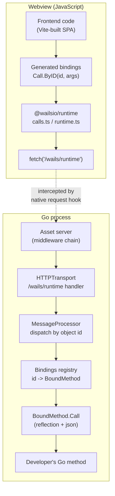
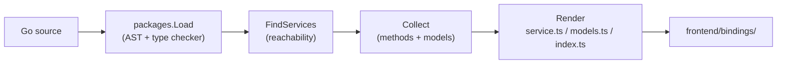
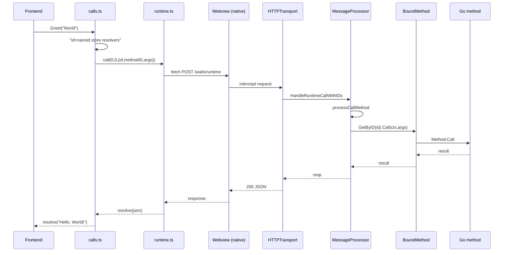
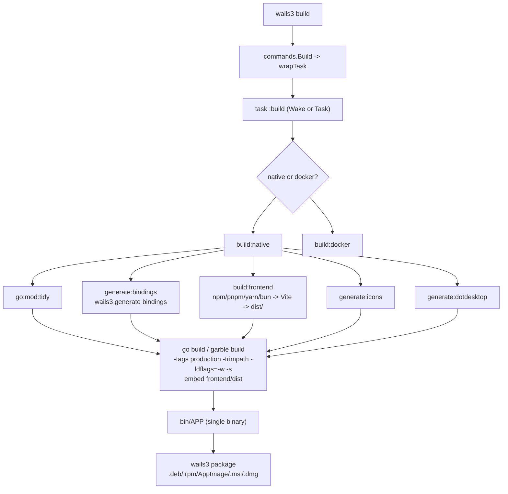

# Wails v3: The JavaScript↔Go Bridge and Build System — A Technical Deep Dive

This article is a detailed technical analysis of how Wails v3 connects a Go backend to a web frontend, and how it compiles the two into a single native binary. It is the successor to [[ARTICLE - Wails v2 Desktop Applications - Technical Deep Dive|the Wails v2 deep dive]], and the most important thing to understand up front is that **v3 is not an incremental upgrade of v2's bridge**. The communication mechanism is fundamentally different. Where v2 injected a `window.go` namespace and marshaled calls through an in-memory function boundary, v3 routes every call through an HTTP request intercepted by the native webview.

The analysis is grounded in a complete read of the v3 source tree (`v3/0.0.0-alpha.101` at time of writing). Every architectural claim is anchored to a concrete file. The reference investigation is the docmgr ticket `WAILS-BRIDGE`, whose design document and captured sources sit at `ttmp/2026/06/13/WAILS-BRIDGE--wails-v3-javascript-go-bridge-build-system-internals/`.

The target audience is an engineer who writes Go and JavaScript and wants to understand exactly how a Wails v3 binding call travels from a frontend `await` to a Go method and back, how the build turns that into one binary, and where the design departs from v2.

> [!summary]
> - **The v3 bridge is HTTP, not in-memory function calls.** The frontend `fetch`es `/wails/runtime`; the native webview intercepts the request and hands it to a Go `http.Handler`. There is a `Transport` interface for replacing this with WebSocket or a mobile JS bridge.
> - **Methods are identified by integer, not by name.** Each bound method gets a 32-bit FNV-1a hash of its fully qualified name. The frontend calls `$Call.ByID(298191698, ...)`. This is what makes obfuscated builds possible.
> - **Bindings are generated by static analysis, not by reflection at runtime.** A generator reads the Go AST/type checker at build time and emits TypeScript. The runtime binding table is rebuilt by reflection at startup. The two agree on IDs because both hash the FQN the same way.
> - **The build is a Taskfile pipeline, not a monolithic `go build`.** `wails3 build` delegates to a Taskfile that runs binding generation, the frontend build, asset generation, and the Go compiler in parallel where possible.
> - **The frontend is embedded with `go:embed` and served by a Go asset server.** The webview never touches the filesystem; it loads everything from an in-memory `embed.FS` over a virtual host.

## Why this note exists

Wails v3 is a substantial rewrite that also adds mobile (iOS/Android) targets, an obfuscation mode, a custom transport abstraction, and a pluggable asset server. The official documentation describes these features at a usage level, but the architectural picture — *why* a call is an HTTP request, *how* numeric IDs survive binary obfuscation, *why* the build is a Taskfile — only becomes visible by reading the source. This article records that picture so the next engineer can reason about the system instead of treating it as a black box.

A second reason: v2 intuition actively misleads in v3. If you assume the `window.go` namespace exists, you will not find it. If you assume names travel on the wire, you will misread the generated bindings. This article foregrounds the differences.

## When Wails v3 is the right tool

Use Wails v3 when:

- you want a single-binary Go application with a web frontend, and you also need to target iOS or Android from the same codebase
- you need a custom IPC transport (WebSocket, server mode opened in a real browser, an embedded device protocol)
- you want to ship an obfuscated binary that does not leak Go package and method names
- you want the frontend served by a controllable Go asset server with middleware

Stay on v2, or look elsewhere, when:

- you depend on v2's `window.go` synchronous namespace and cannot migrate to the async `Call.ByID` model
- you need the stability of a released v2 (v3 is alpha at the time of writing)
- your target platform's native webview is unavailable or heavily restricted and you cannot use the server/mobile transports

## The central idea: the webview as a request interceptor

The cleanest way to understand the v3 bridge is to stop thinking about a "bridge" as a special channel and instead see it as **ordinary HTTP, served by the Go process, but with the webview rewired so that every request lands in a Go handler instead of on the network.**

Every desktop platform exposes a hook that lets the embedding application intercept and synthesize web requests. Wails v3 uses all three:

| Platform | Interception hook | Virtual origin |
|----------|-------------------|----------------|
| Windows | WebView2 `WebResourceRequested` + `AddWebResourceRequestedFilter("*", ALL)` | `http://wails.localhost` |
| macOS | `WKURLSchemeHandler` registered for the `wails` scheme | `wails://localhost` |
| Linux | WebKitGTK `webkit_web_context_register_uri_scheme` | `wails://localhost` |

The Go side is identical for all three. Each platform's window code translates its native request type into a Go `http.Request`/`http.ResponseWriter` and pushes it onto a channel drained by the application. From the Go handler's perspective, the webview is just another HTTP client — except the bytes never leave the process.

This single design decision is the source of most of v3's properties. Because the bridge is HTTP, it can be replaced with any other transport that implements the `Transport` interface. Because the request body is JSON, the same `encoding/json` machinery handles argument marshaling. Because the webview owns the origin, the frontend code is plain `fetch`-based JavaScript that would work in a real browser too.

## The two halves of a running application

A running v3 desktop application contains these process-local components:



The boundary that matters is between the JavaScript execution environment and the Go execution environment. No Go pointer crosses it. Every value is serialized to JSON on the way over and deserialized on the way back. The webview cannot read Go memory, and Go cannot synchronously read a JavaScript variable.

The reverse direction — Go initiating communication — uses **events**, not return values, and is covered later.

## Part I — The binding model

### Services are the unit of binding

A **service** is a pointer to a named Go struct whose exported methods are exposed to the frontend. Wails v3 removed v2's ability to bind bare functions; the struct-with-methods form is required because it gives both the generator and the runtime a stable type to introspect.

```go
// v3/pkg/application/services.go
type Service struct {
    instance any
    options  ServiceOptions
}

func NewService[T any](instance *T) Service {
    return Service{instance, DefaultServiceOptions}
}
```

`NewService` is generic so a static analyzer can confirm at compile time that `T` is a concrete named type. The instance is stored as `any` because the binding engine works through `reflect`, which does not need the static type. A service is registered declaratively through `application.Options.Services`, or imperatively through `App.RegisterService` at runtime. Both append to the same internal slice, drained during startup.

A service may optionally implement three lifecycle methods, recognized by interface:

- `ServiceName() string` — overrides the name used in logs.
- `ServiceStartup(ctx context.Context, options ServiceOptions) error` — called during `App.Run`, in registration order, before any events are dispatched.
- `ServiceShutdown() error` — called during shutdown in reverse registration order.

These names are deliberately excluded from the set of bound methods, both by the runtime scanner and by the binding generator, so a method named `ServiceShutdown` never produces a frontend binding.

### BoundMethod: the runtime descriptor of one callable method

When the application starts, each service's methods are scanned into `BoundMethod` values. This struct is the central data structure of the bridge:

```go
// v3/pkg/application/bindings.go
type BoundMethod struct {
    Method       reflect.Value // live, callable reflect.Value bound to the instance
    Name         string        // short name, e.g. "Greet"
    FQN          string        // "pkgpath.TypeName.Method"
    Inputs       []*Parameter
    Outputs      []*Parameter
    marshalError func(error) []byte
    ID           uint32        // FNV-1a hash of the FQN
    needsContext bool          // first param is context.Context
    isVariadic   bool          // cached at registration
}
```

Three fields drive behavior at call time:

- **`ID`** is a 32-bit FNV-1a hash of the fully qualified name. The frontend calls methods by this number. Hashing the name rather than a method pointer is what makes obfuscated builds work.
- **`needsContext`** is `true` when the method's first parameter is `context.Context`. At call time the engine synthesizes this argument; the frontend never sends it. This is how a service method receives the calling window and a cancellable context.
- **`Method`** is a `reflect.Value` already bound to the specific service instance. Calling `boundMethod.Method.Call(args)` invokes the developer's method on the right receiver.

### The registry and its invariants

The `Bindings` struct holds two maps over the same methods, keyed two ways:

```go
type Bindings struct {
    boundMethods  map[string]*BoundMethod // keyed by FQN
    boundByID     map[uint32]*BoundMethod // keyed by ID
    methodAliases map[uint32]uint32       // optional ID remapping
}
```

The fast path is `GetByID(id)`, used when the frontend sends a numeric `methodID`. The compatibility path is `Get(name)`, used when bindings are generated with `-usenames` or when calling by name is required. `Bindings.Add` enforces two invariants and fails loudly if either breaks:

- **No duplicate FQN.** Two services of the same type are rejected. You must wrap additional instances in dedicated structs.
- **No hash collision.** If two different FQNs hash to the same 32-bit ID, registration is rejected. This is rare but must fail closed, because a collision would silently route calls to the wrong method.

## Build-time binding generation

The binding table populated at runtime is only half the story. The other half is the TypeScript (or JavaScript) file the frontend imports, and that file is generated at build time by a static analyzer that reads the Go source — not by reflecting at runtime.

### Why generation and reflection are separate

The runtime `Bindings` table is built by reflection because at runtime only the compiled types are available. But reflection cannot produce good TypeScript: it cannot see struct field names after JSON tags transform them, it cannot read doc comments, and it cannot emit a `.d.ts` file. The generator solves these by reading the **source** through `golang.org/x/tools/go/packages`, which exposes the parsed AST and the type-checked `types.Package`.

The consequence: the generator runs once, during `wails3 generate bindings`, writing files into `frontend/bindings/`. The runtime binding table is rebuilt every startup. The two must agree on method IDs. They do, because both compute the ID the same way — FNV-1a of the FQN.

### The generator pipeline

The generator lives in `v3/internal/generator/`. Its pipeline:

1. **Load packages** via `packages.Load` with resolved build flags.
2. **Find services** through a static analyzer that identifies bound types reachable from `NewService`/`NewServiceWithOptions`/`RegisterService` or listed in `Options.Services`.
3. **Collect** methods, their input/output types, and every transitively-referenced struct (a "model"). Collection is concurrent, one goroutine per service, joined with a `sync.WaitGroup`.
4. **Render** TypeScript/JavaScript, one file per service plus a `models.ts` and `index.ts` per package.



Models are emitted **after** services because a service method can reference a struct in a different package; the collector must finish scanning every service before it knows the full model set.

### What a generated binding looks like

Given a trivial service:

```go
// in package github.com/example/app
type GreetService struct{ prefix string }
func (g *GreetService) Greet(name string) string { return g.prefix + name }
```

the generator emits, at `frontend/bindings/github.com/example/app/greetservice.js`:

```js
// This file is automatically generated. DO NOT EDIT
import {Call as $Call, CancellablePromise as $CancellablePromise} from "/wails/runtime.js";

export function Greet(name) {
    return $Call.ByID(298191698, name);
}
```

The number `298191698` is `FNV1a("github.com/example/app.GreetService.Greet")`. Every generated function is a one-liner that calls `$Call.ByID` with the method's numeric ID and the forwarded arguments. In TypeScript mode the generator additionally emits types and a sibling `models.ts`:

```ts
import { Call as $Call, CancellablePromise as $CancellablePromise } from "@wailsio/runtime";
import * as $models from "./models.js";

export function RegisterNotificationCategory(category: $models.NotificationCategory): $CancellablePromise<void> {
    return $Call.ByID(2917562919, category);
}
```

### The Go→TypeScript type mapping

The renderer maps Go types to TypeScript in `v3/internal/generator/render/type.go`. The aggregate mapping, with the JSON behavior that the frontend actually observes:

| Go type | TypeScript | Notes |
|---------|-----------|-------|
| `string` | `string` | |
| `bool` | `boolean` | |
| `int`, `int8..64`, `uint*`, `float*` | `number` | All numeric widths collapse to IEEE 754 double |
| `[]byte` | `string` (base64) | A `Create.ByteSlice` helper decodes back to bytes |
| `[]T` | `T[]` | Nil slices marshal to `null`; a `Create.Array` helper normalizes |
| `map[K]V` | `{ [_ in K]?: V }` | Non-string marshalable keys render in quoted form |
| `struct` / named type | `interface` or alias | Emitted into `models.ts`; cross-package types become imports |
| `*T` | `T` (nullable where noted) | Pointers do not exist in JS; nil becomes `null` |
| `time.Time` | `string` | Marshals to RFC3339 |
| `error` (return) | promise rejection | Becomes a thrown `RuntimeError` |
| `context.Context` (input) | *(omitted)* | Synthesized by the engine |
| `any` / `interface{}` | `any` | |

A subtlety: the generator emits helper converters in a generated `Create` namespace (`Create.Array`, `Create.ByteSlice`) so the frontend can normalize the `null`-for-nil-slice behavior of `encoding/json` before handing data to UI code.

### Unsupported types

Some Go types cannot cross the boundary because they have no JSON representation the engine could reconstruct:

- `chan T` — channels have no serializable form.
- `func(...)` — function values cannot be transmitted.
- Unexported struct fields — `encoding/json` ignores them.
- Interfaces other than `any`/`interface{}` — the concrete type is unknown to the caller.
- Bare pointers other than to structs.

The documented workaround for resources like file handles is to return an opaque ID and keep the real resource in a server-side map keyed by that ID.

## Part II — The runtime call path, end to end

This is the core of the bridge: a single call traced from the moment the frontend invokes a binding to the moment the promise resolves.

### Step 1: the generated function runs

When the frontend calls `Greet("World")`, the generated function body executes `$Call.ByID(298191698, "World")`. Nothing else happens in the generated file; all real work is in the runtime.

### Step 2: `Call` allocates a promise and a call-id

`Call` lives in `v3/internal/runtime/desktop/@wailsio/runtime/src/calls.ts`. It generates a unique `call-id` with `nanoid`, creates a `CancellablePromise` via `withResolvers`, and stores the resolvers in a module-level `Map` keyed by id:

```ts
// calls.ts (abridged)
export function Call(options: CallOptions): CancellablePromise<any> {
    const id = generateID();
    const result = CancellablePromise.withResolvers<any>();
    callResponses.set(id, { resolve: result.resolve, reject: result.reject });
    const request = call(CallBinding, Object.assign({ "call-id": id }, options));
    request.then(res => { callResponses.delete(id); result.resolve(res); },
                 err => { callResponses.delete(id); result.reject(err); });
    return result.promise;
}
```

The `call-id` is the correlation key. Calls are asynchronous and many can be in flight, so the engine cannot rely on request order to match responses to callers. The `CallOptions` type is a discriminated union: a call provides either a `methodID` (number) or a `methodName` (string), never both.

### Step 3: serialize and dispatch

The actual sending happens in `runtime.ts`. `newRuntimeCaller(object, windowName)` returns a closure that calls `runtimeCallWithID`:

```ts
// runtime.ts (abridged)
async function runtimeCallWithID(objectID, method, windowName, args) {
    if (customTransport) return customTransport.call(objectID, method, windowName, args);
    const body = { object: objectID, method };
    if (args != null) body.args = args;
    const headers = { "x-wails-client-id": clientId, "Content-Type": "application/json" };
    if (windowName) headers["x-wails-window-name"] = windowName;
    const bodyStr = JSON.stringify(body);
    let response;
    if (bodyStr.length > CHUNK_THRESHOLD) response = await sendChunked(url, headers, bodyStr);
    else response = await fetch(url, { method: 'POST', headers, body: bodyStr });
    if (!response.ok) throw new Error(await response.text());
    return response.headers.get("Content-Type")?.includes("application/json") ? response.json() : response.text();
}
```

Two details are easy to miss but important. First, **`object` and `method` are integers.** The runtime groups every capability into numbered "objects" (`Call=0`, `Clipboard=1`, `Window=6`, …). A binding call is `object=0` (`Call`), `method=0` (`CallBinding`). This is a compact, stable wire protocol that never depends on strings. Second, **chunking.** `CHUNK_THRESHOLD` is 512 KB. Bodies larger than this are split and sent serially with `x-wails-chunk-*` headers, because WebView2's `WebResourceRequested` event does not reliably deliver request bodies larger than roughly 2 MB.

### Step 4: the transport hands off to the MessageProcessor

The default transport is `HTTPTransport` (`v3/pkg/application/transport_http.go`), wired into the asset server as an HTTP middleware. When a `POST` arrives at `/wails/runtime`, `processBody` parses it and calls the message processor:

```go
// transport_http.go (abridged)
func (t *HTTPTransport) processBody(rw http.ResponseWriter, r *http.Request, bodyBytes []byte) {
    var body request
    json.Unmarshal(bodyBytes, &body)
    resp, err := t.messageProcessor.HandleRuntimeCallWithIDs(r.Context(), &RuntimeRequest{
        Object:            *body.Object,
        Method:            *body.Method,
        Args:              &Args{body.Args},
        WebviewWindowID:   uint32(windowId),
        WebviewWindowName: windowName,
        ClientID:          clientId,
    })
    if err != nil { t.httpError(rw, err); return }
    t.json(rw, resp)
}
```

The `request` struct uses `*int` pointers for `Object` and `Method` so the transport can distinguish "field absent" from "field zero". There is a fallback branch that parses query parameters; this exists for WebKitGTK 6.0, which sometimes delivers POST bodies as query parameters for custom URI schemes — a platform quirk handled at the transport boundary so the rest of the system never sees it.

### Step 5: the MessageProcessor dispatches by object

`HandleRuntimeCallWithIDs` (`v3/pkg/application/messageprocessor.go`) is the switchboard. It resolves the target window from headers, then switches on `req.Object`:

```go
switch req.Object {
case windowRequest:      return m.processWindowMethod(req, targetWindow)
case clipboardRequest:   return m.processClipboardMethod(req)
case dialogRequest:      return m.processDialogMethod(req, targetWindow)
case eventsRequest:      return m.processEventsMethod(req, targetWindow)
case callRequest:        return m.processCallMethod(ctx, req, targetWindow)   // binding calls
case systemRequest:      return m.processSystemMethod(req)
case cancelCallRequest:  return m.processCallCancelMethod(req)
// ... application, contextmenu, screens, browser, ios, android
}
```

A binding call is `object == 0` (`callRequest`), landing in `processCallMethod`. Before invoking, the processor registers the call's `context.CancelFunc` in a `runningCalls` map keyed by call-id. This is what makes cancellation work: a later `CancelCall` message pulls the cancel function out and calls it.

### Step 6: BoundMethod.Call — reflection and unmarshaling

`BoundMethod.Call` (`v3/pkg/application/bindings.go`) is where Go finally runs. It turns a slice of `json.RawMessage` into the right Go argument types, invokes the method via reflection, and normalizes the return values:

```go
// bindings.go (abridged)
func (b *BoundMethod) Call(ctx context.Context, args []json.RawMessage) (result any, err error) {
    defer handlePanic(handlePanicOptions{skipEnd: 5})   // panics become CallError
    argCount := len(args)
    if b.needsContext { argCount++ }
    if argCount != len(b.Inputs) {
        return nil, &CallError{Message: "...expects N arguments...", Kind: TypeError}
    }

    var argBuffer [8]reflect.Value              // stack-allocated for <= 8 args
    callArgs := argBuffer[:argCount]
    base := 0
    if b.needsContext {
        callArgs[0] = reflect.ValueOf(ctx)      // synthesized, never from the wire
        base++
    }
    for index, arg := range args {
        value := reflect.New(b.Inputs[base+index].ReflectType)
        if err = json.Unmarshal(arg, value.Interface()); err != nil {
            return nil, &CallError{Message: "...could not parse argument...", Kind: TypeError}
        }
        callArgs[base+index] = value.Elem()
    }

    callResults := b.Method.Call(callArgs)      // or CallSlice for variadic
    // partition results into values and errors; first error -> CallError(RuntimeError)
}
```

Three details matter for performance and correctness:

- **The argument buffer is stack-allocated for up to eight arguments.** Most service methods take few arguments; avoiding a heap allocation here matters under load. Larger argument counts fall back to a heap slice.
- **Panics are recovered.** A panic inside the developer's method is caught and converted into a `CallError` rather than crashing the process. The bridge never lets a service panic propagate to the main loop.
- **Variadic methods use `CallSlice`, not `Call`.** `reflect.Value.CallSlice` is the only way to pass a variadic tail as a single slice. The `isVariadic` flag is cached at registration so this check costs one boolean read per call.

The return-value partitioning is subtle. A Go method can return any combination of values and errors — `(User, error)`, `(int, string, error)`. The engine collects non-error outputs into a single value or a slice, and collects errors separately. If any error is non-nil, the call fails with a `CallError` of kind `RuntimeError`; otherwise the collected values are returned and `encoding/json` marshals them on the way back out.

### Step 7: the response returns

`processCallMethod` returns the Go result to `processBody`, which JSON-marshals it and writes the HTTP response. Back in the webview, the `fetch` promise resolves, the `request.then` handler in `Call` fires, the stored resolvers are invoked, and the developer's `await Greet("World")` evaluates to the returned value. The round trip is complete.

### The full sequence



## The transport abstraction and webview interception

### The Transport interface

`Transport` is an interface with three methods, and optional companion interfaces extend it:

```go
type Transport interface {
    Start(ctx context.Context, messageProcessor *MessageProcessor) error
    JSClient() []byte
    Stop() error
}
// Optional: AssetServerTransport (serve static assets too)
// Optional: TransportHTTPHandler (plug into the asset server middleware)
// Optional: WailsEventListener (deliver Go->JS events yourself)
```

A transport receives runtime call requests, feeds them to the `MessageProcessor`, and returns responses. The default is `HTTPTransport`. The existence of this interface is why v3 can target server mode (a real HTTP server opened in a browser), WebSocket deployments, and mobile — all without changing application code.

### The middleware chain

During initialization the app builds a chain of HTTP middlewares and hands them to the asset server, in order:

1. The user's optional `Assets.Middleware`.
2. A fixed middleware serving `/wails/runtime.js`, `/wails/transport.js`, and `/wails/custom.js`.
3. The transport's own handler that routes `/wails/runtime` POSTs to the message processor.

This is why `fetch("/wails/runtime")` reaches the message processor: the asset server serves every request for the embedded frontend, and the transport's middleware intercepts the runtime endpoint before passing anything else through to the static file handler.

### Per-platform interception in detail

**Windows.** WebView2 is configured to treat `http://wails.localhost/` as application-owned content. The code registers a filter for all resource contexts and supplies a callback:

```go
// v3/pkg/application/webview_window_windows.go
chromium.AddWebResourceRequestedFilter("*", edge.COREWEBVIEW2_WEB_RESOURCE_CONTEXT_ALL)
chromium.WebResourceRequestedCallback = w.processRequest
```

`processRequest` inspects the URI, rejects anything not under `http://wails.localhost`, stamps the `x-wails-window-id` header, wraps the native request/response in a Go `webview.Request`, and pushes it onto a channel. Every byte the frontend loads — HTML, CSS, JS, and the `/wails/runtime` POST — flows through this one callback.

**macOS.** WKWebView cannot serve local content over `http://` without a custom scheme handler. Wails registers a handler for the `wails` scheme:

```objc
// v3/pkg/application/webview_window_darwin.go (Objective-C bridge)
[config setURLSchemeHandler:delegate forURLScheme:@"wails"];
```

The delegate implements `startURLSchemeTask:` / `stopURLSchemeTask:`. Each task is an asset request handed to the same Go asset server. The frontend loads from `wails://localhost`, and `fetch` calls against that origin are served by the handler.

**Linux.** WebKitGTK exposes `webkit_web_context_register_uri_scheme` (and, in the GTK4 / WebKitGTK 6.0 path, the `WebKitURISchemeRequest` callback). Wails registers a custom scheme and funnels requests into the same asset server pipeline. As noted above, WebKitGTK 6.0 sometimes delivers POST bodies as query parameters; the transport parses both forms.

The unifying observation: **all three platforms reduce to the same Go HTTP handler.** The platform code only translates between the webview's native request type and Go's `http.Request`/`http.ResponseWriter`. This is why the transport and message processor are platform-independent.

### The Android transport (alternative path)

On Android, WebView cannot deliver `fetch` POST bodies through `shouldInterceptRequest`, so the default HTTP transport is unusable. Wails detects the Android `JavascriptInterface` bridge at runtime:

```ts
// runtime.ts (abridged)
const androidBridge = typeof window.wails?.invokeAsync === "function" ? window.wails : null;
if (androidBridge) {
    customTransport = {
        call(objectID, method, windowName, args) {
            // invoke via androidBridge.invokeAsync(id, payload)
            // resolve via window._wailsAndroidCallback
        }
    };
}
```

The Java side receives the payload, forwards it to Go through JNI, and invokes `_wailsAndroidCallback` with the response. From the Go side, the same `MessageProcessor.HandleRuntimeCallWithIDs` runs; only the transport differs.

## Events: Go to JavaScript (and back)

Method calls are request/response. Many real interactions are not: the backend emits a progress update, a window resizes, the system goes to sleep. Wails uses a separate event system for these.

### The EventProcessor

Custom events are managed by `EventProcessor` (`v3/pkg/application/events.go`). It holds a map of event name to listeners and an optional `dispatchEventToWindows` callback. A listener has a countdown: `On` is infinite, `Once` is a one-shot, `OnMultiple` is a fixed count. `Emit` fans out to Go listeners and to windows in parallel goroutines.

### How an event reaches JavaScript

`dispatchEventToWindows` is wired to `EventIPCTransport.DispatchWailsEvent`, which snapshots the window list and calls `window.DispatchWailsEvent(event)` on each. A window serializes the event to JSON and executes a JavaScript snippet through the platform's `execJS`/`InvokeSync` mechanism:

```js
// conceptual JS injected into the webview
window._wails.dispatchWailsEvent({ name: "file-progress", data: { line: 42 } });
```

`window._wails.dispatchWailsEvent` (defined in the bundled `runtime.js`) looks up the registered JS listeners and invokes each. The frontend subscribes with `Events.On`:

```ts
import { Events } from '@wailsio/runtime';
Events.On('file-progress', (data) => console.log(data.line));
```

The reverse direction uses the same wire format: the frontend calls the `Events` runtime object, which sends an `object=3` (`eventsRequest`) message; `processEventsMethod` on the Go side feeds it into the `EventProcessor`.

### A deadlock worth knowing about

`EventIPCTransport.DispatchWailsEvent` deliberately snapshots the window list under a read lock and releases the lock **before** dispatching. The source comment explains why: `DispatchWailsEvent` calls `ExecJS`, which calls `InvokeSync`, which blocks until the main thread runs the JS. If the read lock were held during that call, a pending write-lock acquisition (from window creation or removal) would block the main thread, and the synchronous JS invocation could never complete — a classic re-entrant lock deadlock. Snapshot-then-release is the fix.

This matters in practice: naively holding the lock during dispatch will deadlock a busy app the first time a window is created while an event is in flight.

## Errors, cancellation, and the promise model

### CallError: three error kinds

Errors during a binding call are normalized into a `CallError`:

```go
type CallError struct {
    Message string    `json:"message"`
    Cause   any       `json:"cause,omitempty"`
    Kind    ErrorKind `json:"kind"`
}

const (
    ReferenceError ErrorKind = "ReferenceError"   // unknown method name
    TypeError      ErrorKind = "TypeError"        // wrong arg count or unmarshal failure
    RuntimeError   ErrorKind = "RuntimeError"     // method returned a non-nil error
)
```

The kind maps onto a JavaScript `Error` subclass. A `TypeError` surfaces as a JS `TypeError`; a method that returned a Go `error` surfaces as a thrown `RuntimeError`. The `Cause` carries the marshaled error body produced by the service's optional `MarshalError` function, so applications can attach structured error detail.

### CancellablePromise

The frontend never receives a plain `Promise` from a binding; it receives a `CancellablePromise`. This subclass adds `cancel()` and an `oncancelled` hook. When the user cancels a call, `Call` sends a `CancelCall` message (`object=10`) carrying the call-id; the Go side looks up the `context.CancelFunc` in `runningCalls` and invokes it. The Go method sees cancellation through its `context.Context` (`ctx.Done()`), so it can abort long work, close files, and roll back. Passing `context.Context` as the first parameter of a service method is not a stylistic nicety — it is the cancellation channel.

## Obfuscated bindings

Shipping a desktop binary exposes the fully qualified names of every bound method in the generated bindings and, transitively, in the binary's symbol table. Wails v3 supports an obfuscated mode that removes method names from the wire protocol and from the Go binary.

The obfuscation has two halves. First, **name removal on the wire**: with `-obfuscated`, the generator emits bindings that call methods by numeric ID only and generates a Go file, `wails_obfuscated.gen.go`, that calls `application.RegisterBindingMethodID(method, id)` for every bound method, registering a stable, generator-assigned ID that does not depend on the FQN. Second, **binary obfuscation**: the build invokes [garble](https://github.com/burrowers/garble) instead of `go build`, which renames packages, types, and methods in the compiled output. Because FQNs are mangled, the FNV-hash IDs computed from them would change — which is exactly why the generator pre-assigns and registers explicit IDs.

At startup, `getMethods` checks the `registeredBindingMethodIDs` map first; a registered ID wins over the FNV hash. The frontend and backend therefore agree on IDs that survive name mangling, while in a normal build both sides agree on the FNV hash. Either way they agree, because both are produced by the same generator run.

## Part III — The build system

A Wails v3 binary is produced by orchestrating three tools: the Wails CLI (`wails3`), a task runner (Task or Wake), and the Go toolchain. The user types `wails3 build`. What follows is, in order: generate TypeScript/JavaScript bindings; build the frontend; generate platform assets; compile the Go program with `go build` (or `garble build`), embedding the frontend via `go:embed`.

The whole sequence is data-driven by Taskfiles that ship with every project. This is the second large departure from v2, where `wails build` did everything internally.

### The CLI surface

The CLI is defined in `v3/cmd/wails3/main.go`. The relevant subcommands:

| Command | What it does |
|---------|--------------|
| `wails3 build` | Builds the binary for the current platform |
| `wails3 dev` | Runs with hot-reload against a Vite dev server |
| `wails3 package` | Builds then packages (installer/AppImage/dmg) |
| `wails3 generate bindings` | Runs the binding generator |
| `wails3 generate icons` | Produces `.ico`/`.icns` from a source image |
| `wails3 generate runtime` | Builds the bundled `runtime.js` from TS sources |
| `wails3 task <name>` | Runs a Taskfile task |
| `wails3 tool package/sign/lipo/...` | Low-level packaging and signing primitives |

`wails3 build` does **not** compile directly. `commands.Build` translates the command into a Taskfile task name and delegates:

```go
// v3/internal/commands/task_wrapper.go (abridged)
func Build(buildFlags *flags.Build, otherArgs []string) error {
    if buildFlags.Tags != ""      { otherArgs = append(otherArgs, "EXTRA_TAGS="+buildFlags.Tags) }
    if buildFlags.Obfuscated       { otherArgs = append(otherArgs, "OBFUSCATED=true") }
    if buildFlags.GarbleArgs != "" { otherArgs = append(otherArgs, "GARBLE_ARGS="+buildFlags.GarbleArgs) }
    return wrapTask("build", otherArgs)
}
```

`wrapTask` resolves the target OS/arch, picks the task name (e.g. `linux:build`), and either runs it through Wake (when `WAILS_USE_WAKE=true`) or shells out to `wails3 task <name>`.

### Why a task runner

The build has platform branches (Windows, macOS, Linux, iOS, Android), frontend package managers (npm, pnpm, yarn, bun), optional steps (signing, obfuscation, icon sets), and expensive steps that should be cached (frontend builds). Encoding all of that in Go would be brittle. Instead, Wails ships a Taskfile per project, and the CLI is a thin dispatcher. The project's root `Taskfile.yml` includes a common Taskfile and one per platform.

### The common build tasks

The shared tasks ship in `v3/internal/commands/build_assets/Taskfile.tmpl.yml` and are copied into a project's `build/Taskfile.yml` at `wails3 init`. Four tasks matter for a build:

**`generate:bindings`** runs the generator, rerunning only when Go source or module files change (the `sources`/`generates` keys are the cache inputs). `-clean=true` regenerates into a dot-prefixed temp directory and syncs files individually into `frontend/bindings/`, which avoids a Vite/chokidar rename loop and a Windows "access denied" error when a file watcher holds the directory open.

**`build:frontend`** depends on the binding task (so bindings are always fresh before the frontend bundles them), installs deps if needed, and runs the frontend's build script (`npm run build` / `build:dev`) — typically Vite producing `frontend/dist`.

**The platform build** (`linux:build` as representative) chooses a native or Docker path and then runs the Go compiler:

```yaml
linux:build:native:
  deps: [ common:go:mod:tidy, common:build:frontend, common:generate:icons, generate:dotdesktop ]
  cmds:
    - '{{ garble or go }} build {{BUILD_FLAGS}} -o {{OUTPUT}}'
  env: { GOOS: linux, CGO_ENABLED: 1, GOARCH: '{{.ARCH}}' }
```

The build flags change binary behavior and are worth understanding:

- **`-tags production`** — selects the production asset server and the minified runtime.
- **`-trimpath`** — strips the developer's local filesystem paths from the binary.
- **`-ldflags="-w -s"`** — strips DWARF debug info and the symbol table, shrinking the binary.
- **`-buildvcs=false`** — prevents Go from embedding VCS revision info.
- **`CGO_ENABLED=1`** — required on Linux because WebKitGTK is a C library accessed through CGO. This is also why Linux builds fall back to Docker when no C compiler is present.

### Frontend embedding

The compiled binary contains the frontend because `main.go` embeds it:

```go
//go:embed frontend/dist
var assets embed.FS

func main() {
    app := application.New(application.Options{
        Assets: application.AssetOptions{
            Handler: application.AssetFileServerFS(assets),
        },
    })
    // ...
}
```

`go:embed frontend/dist` compiles the entire `frontend/dist` tree into the binary as an `embed.FS`. At runtime the webview requests `/`, `/index.html`, `/assets/index-*.js`, and the asset server reads each file out of the in-memory `embed.FS` — no filesystem access, no external files.

Two assets are served by Wails itself: `/wails/runtime.js` (the Wails runtime, with a minified production build and an unminified dev build selected by build tag), and `/wails/transport.js` (emitted by `Transport.JSClient()`; a no-op for the default transport).

### Build tags and modes

| Tag | Effect |
|-----|--------|
| `production` | Production asset server, minified runtime, stripped paths |
| (debug, default) | Dev asset server, unminified runtime with source maps |
| `server` | Headless HTTP server (no native GUI); enables browser access |
| `gtk3` | (Linux) legacy GTK3 + WebKit2GTK 4.1 instead of GTK4 |
| `wails_obfuscated` | Pairs with garble; enables obfuscated binding registration |

The `server` mode is notable: the same application code compiles without a webview. The binary runs a plain HTTP server serving both assets and the runtime endpoint, so the same Wails app can be opened in a regular browser or deployed to a container.

### Cross-compilation, CGO, and packaging

Windows and macOS webviews are accessed through system frameworks; Linux's WebKitGTK is a C library requiring `CGO_ENABLED=1` plus a C compiler. The Linux Taskfile detects three conditions and falls back to a Docker container when any holds: building on a non-Linux host, no C compiler, or target architecture differing from the host. The Docker image (`wails-cross`) contains the GTK development headers and a compiler; `wails3 tool docker-mounts` generates the volume-mount flags needed to expose the Go module cache and any `replace` directives.

`wails3 package` runs the platform `package` task after a successful build, delegating to dedicated generators: on Linux, `nfpm` produces `.deb`/`.rpm`/`.apk`/Arch packages and `wails3 generate appimage` produces an AppImage; on Windows, an NSIS installer or MSIX; on macOS, an `.app` bundle and `.dmg`. Signing wraps platform-specific code signing (macOS notarization, Windows Authenticode, Linux PGP for debs/rpms).

### The end-to-end build flow



## Key API reference

### Go side

| Symbol | File | Purpose |
|--------|------|---------|
| `application.New` | `v3/pkg/application/application.go` | Construct the app from `Options` |
| `application.Service` / `NewService[T]` | `v3/pkg/application/services.go` | Wrapper and generic constructor |
| `application.Bindings` | `v3/pkg/application/bindings.go` | The bound-method registry |
| `BoundMethod.Call` | `v3/pkg/application/bindings.go` | Invoke a method from `json.RawMessage` args |
| `MessageProcessor.HandleRuntimeCallWithIDs` | `v3/pkg/application/messageprocessor.go` | Entry point for every runtime call |
| `application.HTTPTransport` | `v3/pkg/application/transport_http.go` | Default transport; serves `/wails/runtime` |
| `application.Transport` (interface) | `v3/pkg/application/transport.go` | Implement to replace the transport |
| `application.RegisterBindingMethodID` | `v3/pkg/application/bindings.go` | Register a stable obfuscated method id |
| `hash.Fnv` | `v3/internal/hash/fnv.go` | FNV-1a 32-bit hash for method ids |
| `generator.Generator.Generate` | `v3/internal/generator/generate.go` | Binding generation entry point |
| `commands.Build` | `v3/internal/commands/task_wrapper.go` | CLI binding for `wails3 build` |

### Frontend side (`@wailsio/runtime`)

| Symbol | File (under `src/`) | Purpose |
|--------|---------------------|---------|
| `Call`, `ByID`, `ByName` | `calls.ts` | Invoke a bound method by id or name |
| `RuntimeError` | `calls.ts` | Thrown when a Go method returns an error |
| `CancellablePromise` | `cancellable.ts` | Promise subclass with `cancel()` |
| `newRuntimeCaller`, `runtimeCallWithID` | `runtime.ts` | Serialize and send via transport |
| `setTransport` | `runtime.ts` | Install a custom transport |
| `objectNames` | `runtime.ts` | Frozen map of object id → name |
| `Events.On/Once/Emit` | `events.ts` | Frontend event API |

## Decision records

### Decision: numeric method IDs over names on the wire

- **Context:** The frontend must identify which Go method to call.
- **Options:** send `pkg.Type.Method` strings; send a 32-bit id.
- **Decision:** send a numeric id by default; allow names as a fallback.
- **Rationale:** numbers are smaller, faster to compare, and do not leak Go package/type names into the shipped frontend. They also make obfuscation tractable.
- **Consequences:** the id must be stable and agreed by both sides. FNV-1a of the FQN provides that by default; obfuscated builds override it with a registered id.
- **Status:** accepted

### Decision: HTTP fetch as the default transport

- **Context:** The webview and the Go process must exchange messages.
- **Options:** a proprietary native message bus per platform; WebSocket; HTTP `fetch` to a virtual host intercepted by the webview.
- **Decision:** HTTP `fetch` to `/wails/runtime`, intercepted by the webview's native request hook, with a `Transport` interface allowing replacement.
- **Rationale:** every modern webview exposes a request-interception hook. Using it lets the bridge reuse the standard `fetch` API and a standard Go `http.Handler`, which is testable and debuggable with ordinary browser tooling. The tradeoff — a request body size cap on WebView2 — is worked around with chunking.
- **Consequences:** the transport is the single point of platform divergence; mobile needs a different transport (Android JS bridge). The `Transport` interface absorbs that.
- **Status:** accepted

### Decision: static-analysis code generation for frontend bindings

- **Context:** the frontend needs typed bindings.
- **Options:** reflect at runtime and emit on the fly; statically analyze Go source and emit at build time.
- **Decision:** static analysis at build time.
- **Rationale:** reflection cannot see doc comments, JSON tag spelling, or produce `.d.ts`. Source analysis produces richer, type-correct output and runs once per change rather than on every startup.
- **Consequences:** two sources of truth (generator output and the runtime table) must agree on method ids. They do, because both derive the id from the FQN (or from a registered id in obfuscated mode).
- **Status:** accepted

### Decision: task-driven, data-defined builds

- **Context:** builds vary by platform, package manager, and optional steps.
- **Options:** encode the whole build in Go; ship a Taskfile and make the CLI a dispatcher.
- **Decision:** ship Taskfiles per project; the CLI delegates via `wrapTask`.
- **Rationale:** a declarative Taskfile is editable by users without rebuilding the CLI, and Wake can cache it content-addressably. Platform differences live in platform Taskfiles rather than in Go branching.
- **Consequences:** the build's behavior is defined in YAML, not Go; engineers must read both the CLI dispatch and the Taskfiles to trace a build.
- **Status:** accepted

## Common failure modes

### The `window.go` namespace does not exist (v2 → v3 migration)

**Symptom:** frontend code from a v2 app fails with `window.go is undefined`.

**Cause:** v3 removed the `window.go` namespace. Methods are called through the generated `@wailsio/runtime` `Call.ByID`, not through `window.go[package][Struct][Method]`.

**Fix:** regenerate v3 bindings and import them; replace `window.go.main.App.X()` with `import { X } from './bindings/.../app.js'` then `await X()`.

### A binding call silently routes to the wrong method

**Symptom:** a frontend call invokes a different Go method than expected.

**Cause:** a hash collision between two method FQNs, which `Bindings.Add` rejects at startup — so this should never reach production. If it does, registration was bypassed or the error was swallowed.

**Fix:** rename one method. The startup error message names both colliding FQNs.

### A large argument payload is truncated on Windows

**Symptom:** calls with arguments larger than ~2 MB fail or arrive truncated on WebView2.

**Cause:** WebView2's `WebResourceRequested` does not reliably deliver large request bodies.

**Fix:** the runtime chunks payloads above 512 KB automatically; ensure you are not bypassing `Call` (which performs the chunking). For truly large data, stream via events instead of return values.

### Event dispatch deadlocks when creating a window

**Symptom:** the app hangs when a new window is opened while events are being emitted.

**Cause:** holding the windows lock during `ExecJS`/`InvokeSync` creates a re-entrant deadlock against window creation.

**Fix:** this is already fixed in `EventIPCTransport.DispatchWailsEvent`, which snapshots the window list before dispatch. If you write a custom event transport, do the same — never hold a window lock across a synchronous JS call.

### Obfuscated build breaks after a rename

**Symptom:** after renaming a service method, an obfuscated build's frontend calls the wrong method or fails.

**Cause:** the registered obfuscated IDs changed because the generator reassigned them, but stale generated frontend bindings were not regenerated.

**Fix:** always regenerate bindings and rebuild together. The Taskfile's `generate:bindings` → `build` dependency enforces this; do not skip it.

## Working rules

- The bridge is HTTP. Treat runtime calls like HTTP requests: batch when possible, stream large data via events, and keep methods fast.
- Every service method that does long or cancellable work should take `context.Context` as its first parameter. That is the cancellation channel.
- Bind structs, not functions. Functions are not supported in v3.
- Never hold a window lock across a synchronous JavaScript invocation. Snapshot, release, then dispatch.
- Regenerate bindings and rebuild together. The two sides must agree on method IDs.
- On Linux, `CGO_ENABLED=1` and a C compiler are mandatory; the build falls back to Docker otherwise.
- Use numeric IDs (the default). Reserve name-based calls for tooling and debug paths.
- Obfuscated builds pre-register IDs via `RegisterBindingMethodID`; never assume the FNV hash is stable across an obfuscated build.

## Important project docs

- Design document and investigation diary: `ttmp/2026/06/13/WAILS-BRIDGE--wails-v3-javascript-go-bridge-build-system-internals/`
- Captured external sources (WebView2, WKWebView, WebKitGTK, garble, FNV, go:embed): `…/WAILS-BRIDGE--…/sources/`
- v3 GTK4 / WebKitGTK 6.0 implementation tracker: `/home/manuel/code/others/wails/IMPLEMENTATION.md`

## Open questions

- The iOS transport and its Xcode overlay generation are still stabilizing; this article summarizes iOS only at the dispatch level and does not cover the native bridge details.
- The `server` build mode's production hardening (auth, rate limiting) is not documented here and may warrant a separate playbook.
- Whether Wake supersedes Task as the default executor is an open product decision; both paths are maintained today.

## Related notes

- [[ARTICLE - Wails v2 Desktop Applications - Technical Deep Dive|Wails v2 Deep Dive]] — the predecessor. v2 uses an in-memory JSON bridge with a `window.go` namespace and a monolithic `wails build`; comparing the two articles makes the v3 rewrite's scope concrete.
- [[ARTICLE - Playbook - Self-Contained Go Wasm and JavaScript Browser Applications|Go/Wasm Browser Playbook]] — a related pattern for browser applications using Go compiled to WebAssembly instead of a native webview.
