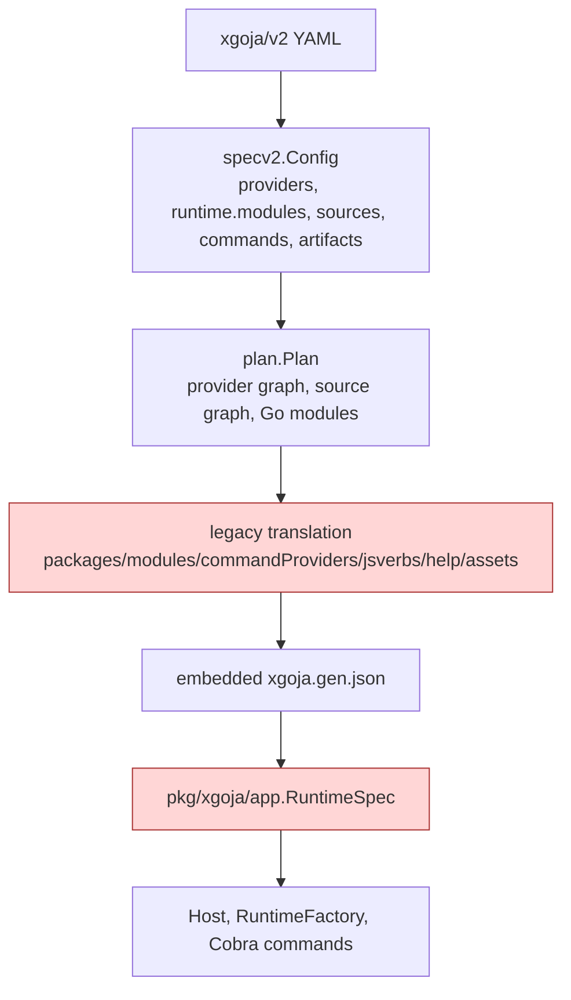
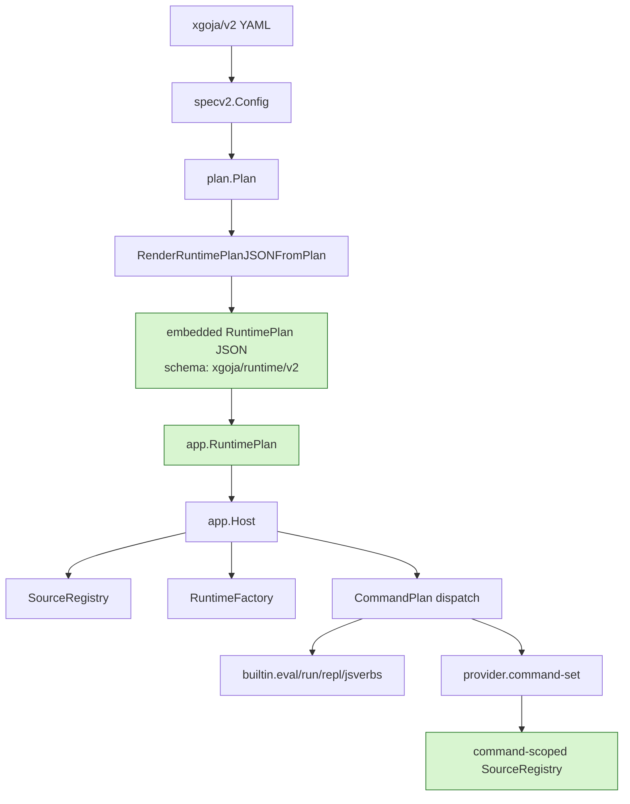

# xgoja v2 RuntimePlan Hard Cutover — A Technical Deep Dive

This article records the xgoja v2 RuntimePlan cutover in `go-go-goja`: why it was necessary, how the runtime representation changed, how provider command sources became command-scoped, and what the final architecture now guarantees. The source implementation lives in `/home/manuel/workspaces/2026-06-12/goja-sessionstream/go-go-goja` on branch `task/xgoja-v2-runtime-cutover`.

The reference ticket is `GOJA-XGOJA-V2-RUNTIME-001`, stored under `go-go-goja/ttmp/2026/06/13/GOJA-XGOJA-V2-RUNTIME-001--replace-legacy-xgoja-runtime-metadata-bridge-with-v2-native-runtime-plan/`. The main source documents are the design guide `design-doc/01-xgoja-v2-native-runtime-plan-design-and-implementation-guide.md` and the implementation diary `reference/01-investigation-diary.md`.

> [!summary]
> - **The cutover removed the active legacy generated-runtime representation.** Generated binaries now embed `app.RuntimePlan` JSON with schema `xgoja/runtime/v2`; active runtime code rejects old top-level keys such as `packages`, `modules`, `commandProviders`, `jsverbs`, `help`, and `assets`.
> - **The central runtime concepts are now the same concepts users write in `xgoja/v2`.** Providers, `runtime.modules`, unified `sources`, `commands`, and `artifacts` survive planning, generation, embedding, decoding, and command construction without being reshaped into an older DTO.
> - **Provider command sets receive command-scoped sources through `SourceRegistry`.** HTTP `serve` now scans and hot-reloads only the jsverb sources declared on the `provider.command-set` command.
> - **Generated package APIs now name the runtime plan directly.** Runtime packages expose `EmbeddedRuntimePlanJSON` and `DecodeRuntimePlan`; generated binary fragments use `runtime_plan.gen.go`; generated build workspaces write `xgoja.runtime.json`.
> - **Legacy remains only where it is intentionally historical.** Migration code and migration docs still discuss v1 names because they read old specs. Normal runtime, generator, provider, and example paths are RuntimePlan-native.

## Why this note exists

The xgoja v2 work was not a small field rename. It corrected a structural mismatch between the configuration model that users wrote and the runtime model that generated binaries executed. Before the cutover, xgoja accepted `schema: xgoja/v2` YAML, validated it with the v2 planner, and then translated it into a legacy generated-runtime shape before embedding it into the generated Go program. That translation layer used older names and older assumptions. It could not represent all v2 semantics.

The immediate failure was concrete. A generated HTTP server could declare a provider command set with explicit source scoping:

```yaml
commands:
  - id: serve
    type: provider.command-set
    provider: http
    name: serve
    mount: serve
    sources: [sites]
```

The v2 schema preserved `commands[].sources`. The planner preserved the command. The generated binary did not. During generation, the command was converted into a legacy `commandProviders` entry that had no source binding. The resulting CLI could expose a `serve` command without the expected jsverb subcommands and without the correct HTTP serve flags for the selected site.

A one-field patch would have fixed that single symptom. The project deliberately did not take that path. The durable fix was to remove the compatibility translation layer and make generated runtime metadata v2-native all the way to `app.NewHost`, `app.NewRootCommand`, provider command setup, source scanning, help loading, and asset resolution.

## The architecture before the cutover

The pre-cutover pipeline had two different representations in one path. The first representation was the public v2 schema. The second was a legacy generated-runtime DTO.



The v2 schema already had the right vocabulary:

| v2 concept | Purpose |
| --- | --- |
| `providers[]` | The Go packages compiled into the generated binary. |
| `runtime.modules[]` | The provider modules exposed to JavaScript through `require()`. |
| `sources[]` | The jsverb, help, asset, and script source sets available to generated runtime features. |
| `commands[]` | The built-in and provider-owned CLI command surfaces. |
| `artifacts[]` | The generated binary, runtime package, dts output, and embedded source outputs. |

The legacy generated-runtime DTO did not share that shape. It separated sources into buckets, represented built-in commands as an object rather than a list, represented provider commands separately from built-in commands, and used provider/package terminology from an older API. That mismatch meant every new v2 feature had to pass through conversion code before runtime code could see it.

The important point is not that the old names were inconvenient. The old representation was less expressive than the v2 representation. Once `commands[].sources` mattered, the loss became visible.

## The final architecture

The final architecture removes the active translation step. The generated runtime plan is a runtime-focused subset of the v2 configuration. It keeps fields needed at execution time and omits build-only fields such as provider import paths, module versions, replacement paths, and source base directories.



The current `RuntimePlan` is defined in `pkg/xgoja/app/runtime_plan.go`. Its shape is intentionally close to the v2 concepts:

```go
const RuntimePlanSchema = "xgoja/runtime/v2"

type RuntimePlan struct {
    Schema    string         `json:"schema"`
    Name      string         `json:"name"`
    App       AppPlan        `json:"app,omitempty"`
    Target    TargetPlan     `json:"target"`
    Providers []ProviderPlan `json:"providers,omitempty"`
    Runtime   RuntimeSection `json:"runtime,omitempty"`
    Sources   []SourcePlan   `json:"sources,omitempty"`
    Commands  []CommandPlan  `json:"commands,omitempty"`
    Artifacts []ArtifactPlan `json:"artifacts,omitempty"`
}
```

The hard-cutover property is enforced during decode. `RuntimePlan.UnmarshalJSON` rejects old top-level keys instead of translating them:

```go
for _, key := range []string{
    "appName", "envPrefix", "configFile",
    "packages", "modules", "commandProviders",
    "jsverbs", "help", "assets",
} {
    if _, ok := payload[key]; ok {
        return fmt.Errorf("runtime plan uses removed legacy key %q", key)
    }
}
```

This is an important design decision. Without rejection, old generated metadata could keep working silently, and the repository would have two runtime contracts again. Rejection makes stale generated output visible immediately.

## RuntimePlan as the execution contract

The public `xgoja/v2` YAML is a build-time input. It includes details needed to generate Go code: provider imports, registration function names, module versions, replacement paths, workspace behavior, and source roots relative to a spec file. The generated binary does not need all of that. At runtime it needs to know which already-compiled providers are present, which modules are selected, which source sets are embedded or referenced, and which commands should appear.

The RuntimePlan is therefore not a byte-for-byte copy of `xgoja.yaml`. It is an execution contract. A minimal generated plan looks like this:

```json
{
  "schema": "xgoja/runtime/v2",
  "name": "http-serve-jsverbs",
  "app": { "name": "http-serve-jsverbs" },
  "target": { "kind": "xgoja", "output": "dist/http-serve-jsverbs" },
  "providers": [{ "id": "go-go-goja-http" }],
  "runtime": {
    "modules": [
      { "provider": "go-go-goja-http", "name": "express", "as": "express" }
    ]
  },
  "sources": [
    {
      "id": "local-sites",
      "kind": "jsverbs",
      "path": "xgoja_embed/jsverbs/local-sites",
      "embed": true
    }
  ],
  "commands": [
    {
      "id": "http-serve",
      "type": "provider.command-set",
      "provider": "go-go-goja-http",
      "name": "serve",
      "mount": "serve",
      "sources": ["local-sites"]
    }
  ],
  "artifacts": [
    { "id": "binary", "type": "binary", "output": "dist/http-serve-jsverbs" }
  ]
}
```

The generated host uses the plan directly. `Host` owns the RuntimePlan, a provider registry, a runtime factory, and a source registry. Command attachment iterates the single `commands[]` list rather than separately attaching built-ins and provider commands from different DTO fields.

```go
for _, command := range h.RuntimePlan.runtimeCommands() {
    h.AttachCommandPlan(root, command)
}
h.AttachModules(root)
h.AttachSelectedModules(root)
h.AttachTypes(root)
```

This loop is small, but it changes the system boundary. A command is now a command plan regardless of whether it is `builtin.eval`, `builtin.jsverbs`, or `provider.command-set`. Mounting, naming, source scoping, and provider selection all live in one list.

## SourceRegistry: the runtime source API

Removing the legacy DTO was necessary but not sufficient. Runtime subsystems still needed a shared way to look up sources by kind and by command scope. The result is `SourceRegistry`, implemented in `pkg/xgoja/app/source_registry.go` and exposed to providers through `pkg/xgoja/providerapi/sources.go`.

```go
type SourceRegistry interface {
    ListSources() []RuntimeSourceDescriptor
    ListSourcesByKind(kind RuntimeSourceKind) []RuntimeSourceDescriptor
    SourceByID(id string) (RuntimeSourceDescriptor, bool)
    JSVerbs() JSVerbSourceSet
}
```

The registry has two responsibilities:

- It presents provider-neutral source descriptors so subsystems do not need to know the internal `RuntimePlan` layout.
- It scopes provider command sources by the source IDs declared on the command.

The scoping operation is explicit:

```go
func (r *SourceRegistry) Scoped(sourceIDs []string) *SourceRegistry {
    if len(sourceIDs) == 0 {
        return NewSourceRegistry(r.providers, r.embeddedJSVerbs, r.sources)
    }
    wanted := map[string]struct{}{}
    for _, id := range sourceIDs {
        wanted[strings.TrimSpace(id)] = struct{}{}
    }
    filtered := []SourcePlan{}
    for _, source := range r.sources {
        if _, ok := wanted[source.ID]; ok {
            filtered = append(filtered, source)
        }
    }
    return NewSourceRegistry(r.providers, r.embeddedJSVerbs, filtered)
}
```

The key behavior is straightforward: a provider command sees all sources only when the command declares no source IDs. When it declares source IDs, it sees exactly that subset. This preserves the v2 command contract and prevents unselected source roots from leaking into provider command behavior.

## Provider command sets after the cutover

Provider command sets are where the cutover matters most. A provider command can create arbitrary Cobra/Glazed commands, and those commands may use the xgoja runtime factory to run JavaScript. Before the cutover, provider command setup received a jsverb-specific source adapter. That was a useful interim API, but it was not the final model.

The final `CommandSetContext` carries `Sources` as the source authority:

```go
type CommandSetContext struct {
    Context         context.Context
    PackageID       string
    Name            string
    Mount           string
    Config          json.RawMessage
    Host            HostServices
    Providers       *ProviderRegistry
    RuntimeFactory  RuntimeFactory
    SelectedModules []ModuleDescriptor
    Sources         SourceRegistry
}
```

Provider code can now ask the registry for the source kind it needs:

```go
func newCommandSet(ctx providerapi.CommandSetContext) (*providerapi.CommandSet, error) {
    jsverbSources := ctx.Sources.JSVerbs()
    registries, err := jsverbSources.ScanAllJSVerbSources()
    if err != nil {
        return nil, err
    }
    // Build commands from the scoped registries.
}
```

The removal of `ctx.JSVerbs` was important. Keeping both APIs would invite new providers to use the older jsverb-only field. The final context says that source access is a registry operation, not a special field per source kind.

## HTTP serve as the proving case

The HTTP provider's `serve` command is the clearest end-to-end test of the new model. It is a provider command set, it depends on jsverb sources, it creates generated CLI subcommands, and it can run a long-lived server with hot reload.

The v2 configuration declares the relationship directly:

```yaml
runtime:
  modules:
    - provider: go-go-goja-http
      name: express
      as: express

sources:
  - id: local-sites
    kind: jsverbs
    from:
      dir: ./verbs

commands:
  - id: http-serve
    type: provider.command-set
    provider: go-go-goja-http
    name: serve
    mount: serve
    sources: [local-sites]
```

At runtime, the HTTP provider obtains jsverb sources through the command-scoped registry:

```go
func serveCommandJSVerbSources(ctx providerapi.CommandSetContext) (providerapi.JSVerbSourceSet, error) {
    if ctx.Sources == nil {
        return nil, fmt.Errorf("http serve command requires command-scoped runtime sources")
    }
    jsverbSources := ctx.Sources.JSVerbs()
    if jsverbSources == nil || len(jsverbSources.ListJSVerbSources()) == 0 {
        return nil, fmt.Errorf("http serve command requires configured jsverb sources")
    }
    return jsverbSources, nil
}
```

The same scoped source set is used for three operations:

```go
registries, err := jsverbSources.ScanAllJSVerbSources()
watchRoots := defaultServeHotReloadWatchRoots(jsverbSources)
if sourceSetHasTypeScript(jsverbSources) { ... }
```

This prevents a subtle class of bugs. It would not be enough to scope the initial command discovery if hot reload later rescanned every source in the application. Source scoping must apply to command creation, reload rescans, watch roots, and TypeScript watch extension selection.

## Generated runtime packages

xgoja can generate an importable Go runtime package instead of only compiling a standalone binary. That package is used by host applications that want to embed an xgoja runtime in their own process and lifecycle. Before the final cleanup, the package decoded a RuntimePlan but still exposed generic or legacy-looking metadata names.

The generated runtime package now exposes RuntimePlan-specific names:

```go
const EmbeddedRuntimePlanJSON = `{ ... }`

func DecodeRuntimePlan() (*app.RuntimePlan, error) {
    runtimePlan := &app.RuntimePlan{}
    if err := json.Unmarshal([]byte(EmbeddedRuntimePlanJSON), runtimePlan); err != nil {
        return nil, err
    }
    return runtimePlan, nil
}
```

The ergonomic host API remains stable:

```go
bundle, err := xgojaruntime.NewBundle(xgojaruntime.Options{})
rt, err := bundle.NewRuntime(ctx)
```

This distinction matters. Direct metadata access is explicitly RuntimePlan-based. Host applications that only need a runtime still use `NewBundle` and `NewRuntime` without manually decoding JSON.

The generated source fragment path was updated in the same way. Generated source fragments now use `runtime_plan.gen.go`, and generated build workspaces write `xgoja.runtime.json` instead of `xgoja.gen.json`.

## The workspace resolution rule

A separate but related part of the work was preserving `workspace.mode: auto`. v2 specs should not require every local provider to carry a hand-written replacement path when a parent `go.work` already covers the module. The planner already computes Go module resolution. The generator now relies on that plan instead of requiring provider-level `module.replace` entries.

The rule is:

1. explicit provider replacement wins;
2. CLI replacement such as `--xgoja-replace` can override go-go-goja itself;
3. `workspace.mode: auto` can resolve matching local modules from `go.work`;
4. otherwise the generated module uses a versioned dependency.

This rule is visible in `xgoja doctor`, which reports the selected resolution source. It matters because xgoja examples often live inside a multi-module workspace. Without workspace-aware generation, examples become fragile and accumulate local path boilerplate.

## Why old metadata is rejected, not migrated at runtime

The runtime decoder could have supported both the old and new shapes. It could have accepted `packages`, translated them to `providers`, accepted top-level `modules`, translated them to `runtime.modules`, and accepted `commandProviders`, translated them to `commands[]`. That is exactly the path the project rejected.

A hard cutover has three benefits:

- Stale generated output fails immediately. If a generated binary embeds old metadata, the error names the removed key.
- Runtime code only has one representation to reason about. Tests, providers, and generated packages do not need to preserve compatibility branches.
- Migration remains quarantined. The migration command can still read old v1 build specs, but normal generated runtimes do not become a second migration layer.

The migration code remains in `cmd/xgoja/internal/migratebuildspec` and `cmd/xgoja/internal/specv2/migrate_v1.go`. That code is intentionally historical. It is not part of the active runtime path.

## Implementation sequence

The work landed in focused commits. The sequence matters because each phase removed one layer of ambiguity before the next phase depended on it.

| Commit | Step | What changed |
| --- | --- | --- |
| `556ed5c` | Scoped source regression | Added generated-binary test coverage for provider command source scoping and preserved command source IDs through the interim path. |
| `617b977` | RuntimePlan metadata | Generated metadata switched to `schema: xgoja/runtime/v2` with no legacy top-level keys. |
| `8bcc367` | SourceRegistry | Added provider-facing source registry and command-scoped source lookup. |
| `f09788a` | Runtime consumers | Host-owned `SourceRegistry`, help/assets/jsverb consumers, and command attachment moved to RuntimePlan concepts. |
| `08f1264` | HTTP serve | HTTP serve consumed `ctx.Sources` and scoped hot reload to command sources. |
| `84a200c` | Runtime package API | Generated runtime packages exposed RuntimePlan-specific metadata APIs. |
| `5f414bd` | Docs | User guide, v2 reference, migration guide, provider docs, and examples were updated. |
| `207bead` | Legacy removal | Active RuntimePlan compatibility fields, decode paths, `ctx.JSVerbs`, legacy generated names, and old active test metadata were removed. |
| `6eb8d3d` | Fixture update | TypeScript declaration fixture was regenerated after final smoke validation. |

This ordering kept the code review surface manageable. Early commits introduced tests and intermediate compatibility where needed. Later commits removed the compatibility once all consumers had been migrated.

## Validation results

The final implementation passed full repository validation through the pre-commit hook on commit `207bead`: lint, `go generate ./...`, and `go test ./...`. Focused validation also passed:

```bash
go test ./cmd/xgoja/internal/... ./cmd/xgoja ./pkg/xgoja/... -count=1
go test ./cmd/xgoja/internal/generate ./cmd/xgoja ./pkg/xgoja/app ./pkg/xgoja/providerapi ./pkg/xgoja/providers/http ./pkg/xgoja/providers/host ./pkg/gojahttp ./modules/express -count=1
```

The example smoke sweep passed for the self-contained examples:

```text
01-core-provider PASS
02-host-provider PASS
03-single-runtime-modules PASS
04-module-sections PASS
05-command-provider PASS
06-runtime-filesystem PASS
07-embedded-jsverbs PASS
08-provider-shipped-jsverbs PASS
10-embedded-assets-fs PASS
13-http-serve-jsverbs PASS
14-generated-runtime-package PASS
15-protobuf-builder-provider PASS
16-typescript-jsverbs PASS
```

`09-provider-shipped-help-docs` failed because the workspace did not contain the required sibling `loupedeck` checkout. The error was a missing `go.mod` at `/home/manuel/workspaces/2026-06-12/goja-sessionstream/loupedeck/go.mod`, not a RuntimePlan failure. Its `doctor` and `list-modules` steps succeeded before `go mod tidy` failed on the missing replacement target.

Help validation also passed for the main docs:

```bash
go run ./cmd/xgoja help overview
go run ./cmd/xgoja help user-guide
go run ./cmd/xgoja help xgoja-v2-reference
go run ./cmd/xgoja help migrating-to-xgoja-v2
go run ./cmd/xgoja help provider-runtime-config-and-host-services
go run ./cmd/xgoja help tutorial-protobuf-builder-provider
go run ./cmd/xgoja help buildspec-reference
```

The final ticket bundle was uploaded to reMarkable:

```text
/ai/2026/06/13/GOJA-XGOJA-V2-RUNTIME-001/GOJA XGOJA V2 Runtime Cutover Final.pdf
```

## Failure modes exposed by the work

The cutover exposed several useful failure modes.

### Field-preserving patches are not enough when the representation is wrong

The first bug could have been patched by adding `Sources []string` to an old provider command DTO. That would have preserved one field but left the runtime with two concepts for commands. The next v2 field would have required another patch. The project instead removed the lower-fidelity representation.

The general rule is: if an intermediate representation cannot express the source model without accumulating special cases, replace the intermediate representation.

### Source scoping has to cover every source-dependent operation

HTTP serve required more than command discovery. Hot reload also rescans sources, derives default watch roots, and changes watch extensions when TypeScript is enabled. All of those operations must use the same scoped source set. If one path uses the global source list, the command can observe files it did not declare.

The resulting rule is: once a command has a scoped `SourceRegistry`, every source-derived operation inside that command must use that registry.

### Tests can preserve old architecture longer than production code

Many active app tests still supplied old generated JSON after the generator had moved to RuntimePlan output. Those tests kept the compatibility decoder alive. The final removal required converting tests to v2 RuntimePlan JSON, not just changing production code.

The resulting rule is: a hard cutover is incomplete until active tests stop depending on compatibility decode paths.

### Migration code must be intentionally quarantined

The broad rename briefly touched migration-only code. That was wrong. Migration packages need old names because their job is to read old input and produce v2 output. The final sweep had to distinguish active runtime code from historical migration code.

The resulting rule is: keep migration support in migration packages, but do not let runtime code become a second migration path.

## Current source map

The most important files after the cutover are:

| File | Responsibility |
| --- | --- |
| `pkg/xgoja/app/runtime_plan.go` | RuntimePlan DTO, removed-key rejection, runtime module/source/command helpers. |
| `pkg/xgoja/app/source_registry.go` | Runtime source lookup, kind filtering, command scoping, provider-facing descriptors. |
| `pkg/xgoja/app/command_providers.go` | Provider command-set attachment and scoped `CommandSetContext`. |
| `pkg/xgoja/providerapi/commands.go` | Provider command context and runtime factory interfaces. |
| `pkg/xgoja/providerapi/sources.go` | Provider-facing `SourceRegistry` and `RuntimeSourceDescriptor`. |
| `pkg/xgoja/providers/http/serve.go` | HTTP serve provider using command-scoped sources and scoped hot reload. |
| `cmd/xgoja/internal/generate/templates.go` | RuntimePlan JSON rendering from `plan.Plan`. |
| `cmd/xgoja/internal/generate/templates/main.go.tmpl` | Generated binary main template using runtime-plan naming. |
| `cmd/xgoja/internal/generate/templates/runtime_package.go.tmpl` | Runtime package template exposing `EmbeddedRuntimePlanJSON` and `DecodeRuntimePlan`. |
| `cmd/xgoja/doc/17-xgoja-v2-reference.md` | Authoritative v2 user-facing reference. |

## Working rules for future xgoja changes

The cutover leaves a set of rules that should guide future work.

- Runtime code should consume `app.RuntimePlan`, not v2 YAML structs and not migration build-spec structs.
- Generated runtime JSON should use `schema: xgoja/runtime/v2` and should not contain old top-level keys.
- Provider command sets should use `ctx.Sources`; they should not assume all application sources are visible.
- Source consumers should ask for sources by kind through `SourceRegistry` rather than iterating RuntimePlan slices directly.
- Generated runtime package metadata APIs should use RuntimePlan naming.
- Migration code may mention legacy fields, but normal runtime/generator/provider docs should describe v2 concepts as authoritative.
- Example smoke tests should be treated as generated-output tests. If a fixture changes after a provider API update, regenerate it deliberately and commit the result.

## What remains outside this cutover

The sessionstream chatbot example remains deferred. Earlier work started draft files under `sessionstream/examples/goja-chatdemo-server` and provider/runtime wiring in sessionstream, but the user explicitly deferred that work until after the go-go-goja xgoja cutover. That decision was correct. The runtime foundation needed to be stable before sessionstream could depend on it.

There is one external example precondition: `examples/xgoja/09-provider-shipped-help-docs` requires a sibling loupedeck checkout. The example should either document that precondition more explicitly or skip gracefully when the checkout is absent.

## Closing

The xgoja v2 cutover changed the generated runtime from a translated legacy shape into a direct execution plan. The important result is not just cleaner names. The important result is that v2 semantics now survive the full path from YAML to generated Go code to provider command execution. Commands carry source IDs. Providers receive scoped registries. Runtime packages expose RuntimePlan metadata. Stale generated output fails when it contains removed keys.

That is the condition the system needed before continuing with larger generated applications such as the sessionstream chatbot server. The runtime contract is now explicit enough for provider authors, generated package embedders, and example maintainers to build on it without depending on a hidden compatibility layer.
