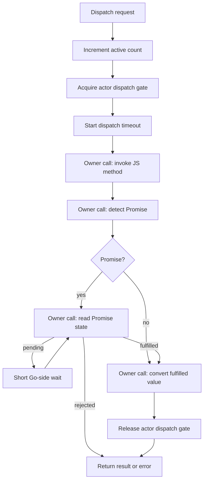

# Go Go Objects: Async Behavior in Durable Objects

This article explains the async behavior implemented in `go-go-objects`. The focus is narrow: what happens when a Durable Object JavaScript handler returns a Promise, how the Go runtime waits for that Promise without violating goja ownership rules, how actor-level serialization is preserved, and how errors and timeouts behave when a handler crosses an `await` boundary.

The work matters because Durable Objects code is naturally written with `async` handlers. A runtime that calls a JavaScript method and immediately converts its return value does not implement the semantics JavaScript authors expect. It returns the Promise object, not the fulfilled value. It misses rejected Promises. It may start another event on the same object while the first event is still incomplete. Correct async behavior is therefore not one feature; it is a set of invariants that must hold together.

> [!summary]
> - A Durable Object dispatch now ends when the returned handler value is settled and converted, not when the first JavaScript method call returns.
> - Promise detection, Promise state reads, Promise result reads, rejection inspection, and result conversion all run on the goja runtime owner.
> - A per-actor dispatch gate serializes same-object events across invocation, Promise settlement, and conversion.
> - Sync and async failures preserve the same durable error codes when the underlying Go-backed error is the same.

## The problem async support had to solve

The first Durable Objects implementation handled synchronous JavaScript correctly. The actor invoked a method on the object instance, received a `goja.Value`, and converted it into a `Result`. That is sufficient for code such as:

```javascript
increment(by = 1) {
  const current = this.state.storage.get("count") || 0;
  const next = current + by;
  this.state.storage.put("count", next);
  return next;
}
```

It is not sufficient for code such as:

```javascript
async increment(by = 1) {
  await Promise.resolve();
  const current = this.state.storage.get("count") || 0;
  const next = current + by;
  this.state.storage.put("count", next);
  return next;
}
```

The second method returns a Promise. The final value is not available at the point where the JavaScript function returns to Go. The runtime has to recognize that the returned value is a Promise, wait for it to settle, and then continue with either the fulfilled value or the rejection reason.

This requirement applies to all dispatch kinds that call user JavaScript:

| Dispatch kind | JavaScript entry point | Async behavior |
| --- | --- | --- |
| RPC | Any object method named by the route. | Await returned Promise and encode fulfilled value as JSON. |
| Fetch | `fetch(req)`. | Await returned Promise and convert fulfilled value into a fetch response. |
| Alarm | `alarm()`. | Await returned Promise and treat fulfillment as successful alarm completion. |

The implementation deliberately does not introduce async storage methods. `state.storage` remains synchronous. `transaction(fn)` remains synchronous-only. The async milestone is about handler completion, not about changing the storage API.

## The event lifecycle

The core implementation lives in `pkg/durableobjects/actor.go`. The important function is `Actor.Dispatch`.

```go
func (a *Actor) Dispatch(ctx context.Context, env Envelope) (Result, error) {
    a.active.Add(1)
    a.touch()
    defer func() {
        a.touch()
        a.active.Add(-1)
    }()

    release, err := a.acquireDispatch(ctx)
    if err != nil {
        return Result{}, err
    }
    defer release()

    return a.withInterrupt(ctx, func(ctx context.Context) (Result, error) {
        raw, err := a.invokeDispatch(ctx, env)
        if err != nil {
            return Result{}, err
        }
        settled, err := a.awaitDispatchValue(ctx, raw)
        if err != nil {
            return Result{}, err
        }
        return a.convertDispatchValue(ctx, settled)
    })
}
```

The function expresses the event lifecycle in four phases:

1. Mark the actor active so idle eviction cannot close it while work is in progress.
2. Acquire the per-actor dispatch gate so no second dispatch enters the object during this event.
3. Invoke the JavaScript handler and wait for the returned value to settle if it is a Promise.
4. Convert the settled value into a Durable Objects result.

The order is significant. The dispatch gate is acquired before `withInterrupt` starts the timeout and VM interrupt timer. A queued request waiting behind another dispatch should not spend its dispatch timeout budget while it is not yet running. The timeout is for the accepted event: invocation, Promise settlement, and conversion.



The diagram shows why async dispatch is an actor-level concept. The runtime cannot treat Promise waiting as a small helper bolted onto conversion. Promise waiting changes when the event is considered complete.

## Owner-thread access rules

A `goja.Runtime` is not safe to inspect from arbitrary goroutines. `go-go-goja` exposes `RuntimeOwner.Call()` so Go code can schedule a callback onto the runtime owner and access the VM inside that callback.

The async implementation follows a strict rule:

> A goroutine outside the runtime owner may hold an opaque `goja.Value` or `*goja.Promise` reference, but every operation that inspects or exports it must run inside `RuntimeOwner.Call()`.

That rule affects more code than the initial method call. The following operations are owner-thread operations:

- calling the JavaScript method;
- checking whether the returned `goja.Value` exports to `*goja.Promise`;
- reading `promise.State()`;
- reading `promise.Result()`;
- inspecting a rejection object;
- converting a fulfilled RPC value to JSON;
- converting a fulfilled fetch value to `FetchResponse`.

The final implementation reflects this boundary. Promise detection is itself an owner callback:

```go
ret, err := a.runtime.Owner.Call(ctx, "durable-object.promise-detect",
    func(_ context.Context, vm *goja.Runtime) (any, error) {
        promise, ok := value.Export().(*goja.Promise)
        if !ok {
            return awaitValueState{value: value}, nil
        }
        return awaitValueState{promise: promise}, nil
    })
```

This replaced an earlier version that called `value.Export()` outside the owner. That earlier version looked small, but it violated the runtime ownership model. `Export()` can inspect VM-managed state. The correct place for it is inside the owner callback.

Promise polling follows the same rule:

```go
ret, err := a.runtime.Owner.Call(ctx, "durable-object.promise-state",
    func(_ context.Context, vm *goja.Runtime) (any, error) {
        return promiseSnapshot{
            state:  promise.State(),
            result: promise.Result(),
        }, nil
    })
```

The Go goroutine coordinates the loop and the context wait. The owner callback reads the Promise state.

## Promise settlement loop

The Promise settlement loop is intentionally simple. It polls state through the owner, waits briefly if the Promise is pending, and exits on fulfillment, rejection, or context cancellation.

```go
for {
    select {
    case <-ctx.Done():
        return nil, timeoutOrContextError(ctx)
    default:
    }

    snapshot := readPromiseStateOnOwner(ctx, promise)

    switch snapshot.state {
    case goja.PromiseStatePending:
        wait 5 milliseconds or until ctx.Done()
    case goja.PromiseStateRejected:
        return nil, promiseRejectedError(ctx, snapshot.result)
    case goja.PromiseStateFulfilled:
        return snapshot.result, nil
    }
}
```

The loop does not block the owner thread while the Promise is pending. It runs a short owner callback, leaves the owner, waits briefly in Go, and tries again. This matters because Promise settlement may require other owner callbacks to run. For example, a Go-backed async module may resolve a Promise by posting a callback onto the runtime owner. If the wait loop held the owner continuously, that settlement callback could not run.

The loop is bounded by the dispatch context. If the handler returns a Promise that never settles, the dispatch returns `CodeTimeout`.

```javascript
pending() {
  return new Promise(() => {});
}
```

The regression test uses a 10ms timeout and asserts that the result is a timeout rather than success.

## Dispatch timeout semantics

The existing option is named `CPUTimeout`, and the CLI flag is `--cpu-timeout`. After async support, this budget covers more than synchronous JavaScript CPU time. It covers the full accepted dispatch lifecycle:

- JavaScript method invocation;
- Promise settlement wait;
- result conversion.

The implementation uses `withInterrupt` to create a dispatch-scoped context. If the timeout expires, it interrupts the VM and causes the dispatch to fail with `CodeTimeout`.

```go
func (a *Actor) withInterrupt(parent context.Context, fn func(context.Context) (Result, error)) (Result, error) {
    dispatchCtx, cancel := context.WithTimeout(parent, a.cpuTimeout)
    defer cancel()

    timeoutErr := coded(CodeTimeout, "durable object CPU budget exceeded")
    timer := time.AfterFunc(a.cpuTimeout, func() {
        a.runtime.VM.Interrupt(timeoutErr)
    })
    defer func() {
        _ = timer.Stop()
        a.runtime.VM.ClearInterrupt()
    }()

    return fn(dispatchCtx)
}
```

The name `CPUTimeout` is now historically accurate but conceptually incomplete. A future release may add `DispatchTimeout` as a clearer name. The current behavior is documented as a JavaScript CPU and Promise settlement timeout.

## Actor serialization across awaits

The most important concurrency fix was adding actor-level serialization across Promise waits. `RuntimeOwner.Call()` serializes one VM callback at a time. It does not know that a Durable Object event continues after a callback returns a pending Promise. Without an actor-level gate, this sequence is possible:

```text
Dispatch A invokes async method and receives pending Promise.
Dispatch A leaves RuntimeOwner.Call and starts polling.
Dispatch B enters RuntimeOwner.Call and invokes another method on the same JS instance.
Dispatch A's timeout timer is still active while Dispatch B runs.
```

That sequence violates the current runtime contract. `go-go-objects` does not implement Cloudflare-style event interleaving or input gates. It promises one active dispatch per object. The actor therefore needs a separate gate around the whole event lifecycle.

The gate is a `chan struct{}` with capacity one:

```go
type Actor struct {
    dispatchGate chan struct{}
}
```

`Manager.startActor` initializes it when the actor is created:

```go
actor := &Actor{
    id: id,
    className: className,
    runtime: rt,
    storage: storage,
    manager: m,
    cpuTimeout: m.opts.CPUTimeout,
    dispatchGate: make(chan struct{}, 1),
}
```

The gate is context-aware:

```go
select {
case a.dispatchGate <- struct{}{}:
    return func() { <-a.dispatchGate }, nil
case <-ctx.Done():
    return nil, timeoutOrContextError(ctx)
}
```

This preserves cancellation for queued callers. A request that cannot acquire the actor before its context expires returns an error instead of waiting indefinitely.

The regression test is based on a read-then-write async method:

```javascript
async asyncReadThenIncrement() {
  const current = this.state.storage.get("count") || 0;
  await Promise.resolve();
  const next = current + 1;
  this.state.storage.put("count", next);
  return next;
}
```

If multiple calls to this method interleave, they can read the same `current` value and then write the same `next` value. The test dispatches sixteen concurrent calls to one object and asserts that the final value is sixteen. The test is not about SQLite. It is about the actor event boundary.

## Error behavior across await boundaries

Async error handling has to preserve the same error contract as sync handling. A bad request should not become a generic execution error just because it happens after an `await`.

Consider this method:

```javascript
async badStorageAfterAwait() {
  await Promise.resolve();
  this.state.storage.put("", 1);
}
```

The empty key is invalid. The storage layer returns a durable `CodeBadRequest` error. In synchronous code, `preserveCodeOrWrap` can recover that error from the thrown goja exception. In async code, the error becomes the rejected Promise value.

The key detail is how goja represents Go errors in JavaScript. `goja.Runtime.NewGoError(err)` creates a JavaScript `GoError` object. That object has a `message`, and it also has a `value` property containing the original Go error.

The runtime now inspects that property on the owner thread:

```go
func durableErrorFromValue(vm *goja.Runtime, value goja.Value) *Error {
    if durableErr := durableErrorFromExport(value.Export()); durableErr != nil {
        return durableErr
    }
    obj := value.ToObject(vm)
    for _, key := range []string{"value", "cause", "error"} {
        child := obj.Get(key)
        if durableErr := durableErrorFromExport(child.Export()); durableErr != nil {
            return durableErr
        }
    }
    return nil
}
```

The regression test asserts that `badStorageAfterAwait` returns `CodeBadRequest`. This gives sync and async handlers the same error-code behavior for the same underlying Go-backed error.

## Fetch and alarm behavior

The Promise-awaiting layer sits before result conversion, so it applies uniformly to RPC, fetch, and alarms.

For fetch handlers, the fulfilled value is converted into a `FetchResponse` after settlement:

```javascript
fetch(req) {
  if (req.path === "/async-count") {
    return Promise.resolve({
      status: 202,
      headers: { "X-Async": "yes" },
      body: String(this.state.storage.get("count") || 0),
    });
  }
}
```

The test verifies that the response status, header, and body come from the fulfilled value, not from the unresolved Promise object.

For alarm handlers, fulfillment means completion. The alarm path does not need an RPC payload or HTTP response body, but it still needs to wait for effects to happen:

```javascript
async alarm() {
  await Promise.resolve();
  const current = this.state.storage.get("alarmCount") || 0;
  this.state.storage.put("alarmCount", current + 1);
}
```

If the runtime returned immediately after receiving the Promise, the scheduler could treat the alarm as complete before the storage update happened. Awaiting the Promise makes alarm completion correspond to handler completion.

## Why transactions remain synchronous

The storage API is synchronous by design in this milestone. This is most visible in `state.storage.transaction(fn)`. The callback must complete synchronously; returning a pending Promise is rejected.

The reason is correctness. A SQLite transaction has a concrete lifetime. If a JavaScript callback enters a transaction, awaits, and later resumes, then the runtime must define what happens to the transaction while the handler is suspended. It must define how cancellation works, how locks are held, how other object events interact with the transaction, and what happens if the Promise never settles.

The current implementation avoids those unresolved semantics. It rejects async transaction callbacks. A future async storage design should be explicit about transaction lifetime and output gating. It should not appear accidentally as a side effect of supporting async handlers.

## What is intentionally not implemented

The current async behavior is useful, but it is not full Cloudflare Durable Objects compatibility. The runtime does not implement:

- input gates;
- output gates;
- `blockConcurrencyWhile`;
- event interleaving during awaits;
- async storage APIs;
- distributed placement;
- Workers request/response classes.

This boundary is important. The runtime now waits for returned handler Promises. It does not let other same-object events run during those waits. That is the correct conservative behavior for this implementation because it preserves actor state correctness without inventing partial gate semantics.

## Testing strategy

The tests added for async behavior are behavioral tests. They do not assert implementation details such as the name of an owner callback. They assert the externally visible contract.

| Test | Contract |
| --- | --- |
| `TestAsyncRPCDispatchAwaitsFulfilledPromise` | An async RPC method returns its fulfilled value. |
| `TestAsyncRPCDispatchPropagatesRejectedPromise` | A rejected Promise becomes a dispatch error. |
| `TestAsyncRPCDispatchPreservesCodedRejectedErrors` | A Go-backed durable error after `await` preserves its code. |
| `TestAsyncRPCDispatchPendingPromiseTimesOut` | A never-settling Promise fails with `CodeTimeout`. |
| `TestAsyncRPCDispatchSerializesPendingPromisesPerActor` | Concurrent async same-object events do not interleave and lose updates. |
| `TestAsyncTransactionCallbackStillRejected` | Storage transactions remain synchronous-only. |
| `TestAsyncFetchDispatchAwaitsFulfilledPromise` | Fetch conversion uses the fulfilled response value. |
| Alarm tests | Async alarm effects complete before the dispatch is considered done. |

The most important test is the serialization test. It encodes the runtime's current concurrency contract. If a future implementation introduces input gates and intentional interleaving, that test will need to be replaced by more specific gate tests. Until then, it protects the invariant that one object processes one dispatch lifecycle at a time.

## Operational behavior

From a user perspective, async support changes what JavaScript authors can write. A handler can now be expressed naturally as an async function:

```javascript
class Counter {
  async increment(by = 1) {
    await Promise.resolve();
    const current = this.state.storage.get("count") || 0;
    const next = current + by;
    this.state.storage.put("count", next);
    return next;
  }
}
```

The caller still sees a normal RPC response:

```json
{"ok":true,"result":1}
```

If the handler never settles, the caller receives a timeout. If the handler rejects, the caller receives an error envelope. If the rejection wraps a durable error, the error code is preserved.

The same behavior applies when the runtime is used through xgoja. The `durableobjects.rpc(...)` and `durableobjects.fetch(...)` module functions block on the Go side until the object handler has settled. The xgoja module API is synchronous from the caller's point of view, but the object handler implementation may be asynchronous.

## Implementation rules that should remain stable

The async implementation produced several rules that should remain visible in future work.

- A Durable Object dispatch is complete only after invocation, Promise settlement, and result conversion have completed.
- `RuntimeOwner.Call()` protects goja VM access; it does not define Durable Object event boundaries.
- Every operation that inspects a `goja.Value` or `goja.Promise` must run on the runtime owner.
- Same-object dispatches remain serialized across awaits until an explicit gate/interleaving design replaces that behavior.
- Go-backed durable errors must preserve their error codes across both synchronous throws and asynchronous Promise rejections.
- A dispatch timeout currently includes Promise settlement time.
- Storage transactions remain synchronous-only until the runtime has an explicit async transaction design.

## Future work

The next async milestone should be chosen deliberately. The most likely candidates are:

1. **Rename or alias the timeout.** `CPUTimeout` now describes a dispatch settlement budget, not just CPU execution time.
2. **Factor Promise awaiting into go-go-goja.** The actor implementation now contains an owner-safe Promise waiting pattern that may be useful outside Durable Objects.
3. **Design input and output gates.** This is a separate concurrency model. It should have its own design document and tests.
4. **Define async storage semantics.** Async storage should specify transaction lifetime, cancellation, and ordering before implementation.
5. **Add external async API examples.** A timer-backed or HTTP-backed example would exercise Promise settlement paths beyond `Promise.resolve()`.

The current state is a sound first async implementation. It gives JavaScript authors Promise-aware RPC, fetch, and alarm handlers while preserving the actor invariants that keep local state correct.
