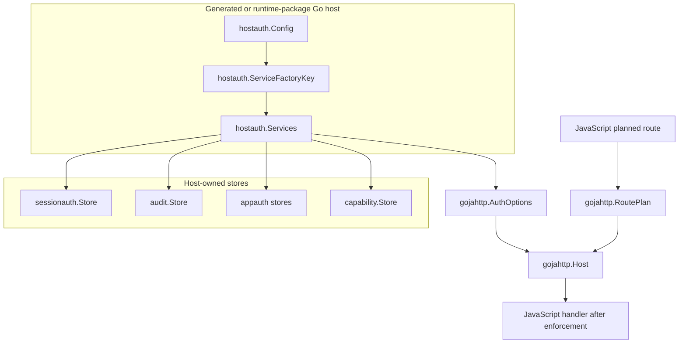
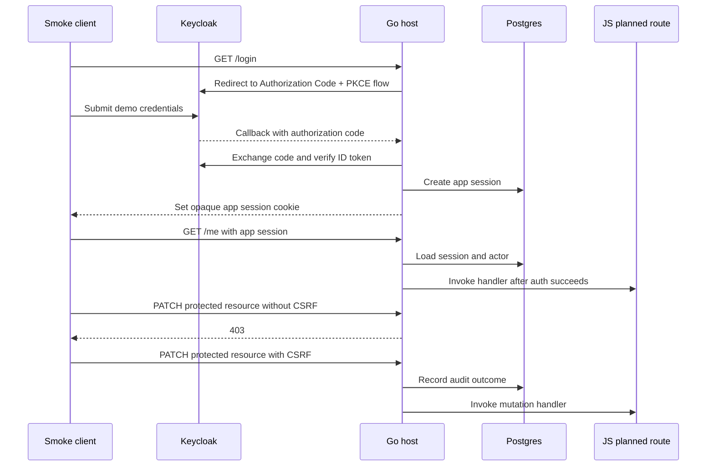
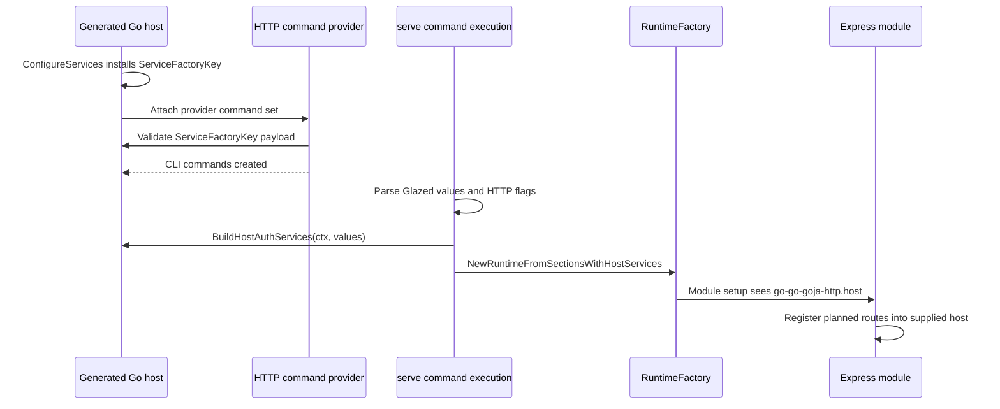
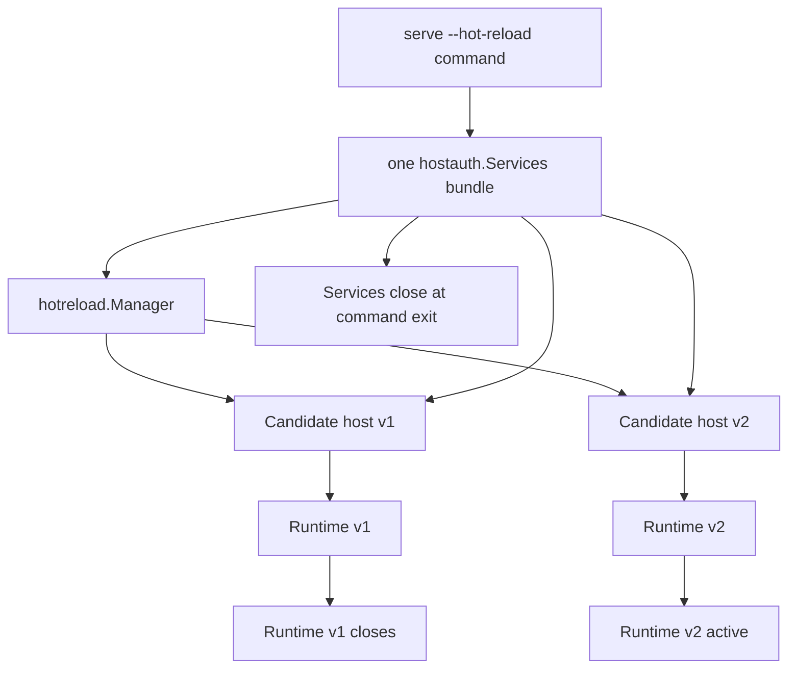

# go-go-goja Express Auth: From Planned Routes to Generated Host Auth

This is the generated-host authentication branch of the [[go-go-goja]] project map.

This report records the work completed after [[ARTICLE - go-go-goja Express Auth - Go Backed Fluent Route Plans]]. The earlier article described the hard cutover from raw Express handlers to Go-backed planned route builders. The current branch has moved beyond that boundary. It now contains durable auth stores, production-shaped Keycloak/Postgres validation, xgoja/v2 runtime compatibility, command-scoped HTTP serving, provider-level HTTP host configuration, a reusable `hostauth` package, HTTP `serve` integration for generated auth services, hot reload support, and a runtime-package generated-host example.

The central design has not changed: JavaScript declares route intent, and Go owns security enforcement. What changed is the surrounding infrastructure. The branch now shows how a generated xgoja host can construct sessions, stores, audit sinks, resource resolvers, and authorizers without putting that machinery inside the Express JavaScript module.

> [!summary]
> - Express planned routes remained the public API boundary: `.public().handle(...)` for public routes and `.auth(...).allow(...).handle(...)` for protected routes.
> - Host authentication moved from hand-written example wiring into reusable packages: SQL session, audit, capability, and appauth stores; `hostauth` config resolution; store builders; session manager builders; and lazy service factories.
> - xgoja HTTP `serve` can now consume a generated-host auth service factory, build `gojahttp.AuthOptions` after command values are parsed, and pass an auth-enabled `gojahttp.Host` into Express through the existing host-service boundary.
> - The new `examples/xgoja/21-generated-host-auth` runtime-package example proves the generated-host path with memory and SQLite store smokes while leaving OIDC, generated binary template injection, and YAML authorization policy as explicit follow-ups.

## Why this report exists

The earlier report ended with a correct but incomplete system. Express routes had a safe declaration language, and `pkg/gojahttp.Host` had a security pipeline. That established the route-level contract. It did not yet answer the operational question: how does a generated xgoja host build and reuse the auth services that the route pipeline needs?

That question matters because generated xgoja hosts are not the same as custom Go HTTP hosts. A custom host can instantiate every dependency in `main.go`, build a `gojahttp.Host`, install login handlers, open databases, and then load JavaScript routes. A generated host goes through xgoja command providers, runtime module selection, generated runtime metadata, embedded source registries, and Glazed command values. Auth services must fit that lifecycle without forcing JavaScript route files to know about databases or secrets.

The answer implemented in this phase is a staged host-owned flow:

1. Generated or custom Go code injects a lazy `hostauth.ServiceFactoryKey` into xgoja host services.
2. The HTTP `serve` command discovers the factory during command construction but does not open databases yet.
3. When the command runs, after Glazed values and flags exist, the provider builds concrete auth services.
4. The provider creates or reuses a `gojahttp.Host` with HTTP settings plus `gojahttp.AuthOptions`.
5. Express receives that host through `go-go-goja-http.host` and registers planned routes into it.
6. Requests execute through the existing `gojahttp` planned-route pipeline before JavaScript handlers run.

This design keeps responsibility boundaries narrow. Express remains the route declaration API. The HTTP provider owns serving and host selection. `hostauth` owns config resolution and auth service construction. The embedding Go application owns deployment policy and environment values.

## Timeline of the work after the first report

The progress after the original article is easier to understand as phases rather than individual commits. Several phases overlapped, but each one changed a distinct part of the system.

| Phase | Main result | Representative commits |
| --- | --- | --- |
| Persistent host auth stores | Added behavior contracts and SQL-backed stores for sessions, audit, capabilities, and app-owned auth data. | `22eb7d6`, `304f833`, `8821692`, `a9d2809`, `3cea895` |
| Production-shaped Keycloak/Postgres validation | The Keycloak example now exercises Postgres-backed sessions, audit, appauth, and capability infrastructure. | `e53d063`, `c962de2`, `7c5f525` |
| xgoja/v2 and source registry compatibility | The Express branch was carried over the xgoja/v2 runtime-plan architecture and command-scoped source registries. | `617b977`, `8bcc367`, `08f1264`, `84a200c`, `207bead`, `bf81e9f` |
| HTTP provider host configuration | The generated HTTP provider gained explicit host options: `enabled`, `listen`, `dev-errors`, and `reject-raw-routes`. | `3f0aefb`, `0866665` |
| Generated-host auth design | A new ticket captured the config and lifecycle design for generated-host auth sessions and stores. | `5c60a45` |
| `pkg/xgoja/hostauth` | Added provider-neutral config resolution, store builders, service builders, and lookup helpers. | `2dee4df`, `cc32556`, `5276bfb` |
| HTTP `serve` auth integration | The provider can now build auth services lazily and pass auth-enabled hosts into Express, including hot reload candidates. | `addd553` |
| Generated-host runtime-package example | Added `examples/xgoja/21-generated-host-auth` with memory and SQLite smokes. | `c7d2a54` |

The final branch state includes the generated-host auth implementation and its documentation commits through `b66baea`.

## The system boundary after the new work

The planned route API is still the starting point. A JavaScript route now says whether it is public or authenticated, and protected routes must name an action before `.handle(...)` becomes available:

```javascript
app.get("/me")
  .auth(express.user().required())
  .allow("user.self.read")
  .handle((ctx, res) => res.json({ actor: ctx.actor.id, action: ctx.action }));
```

That route does not know how sessions are stored, where audit records go, or how Keycloak subjects map to app users. The newer work makes those host concerns configurable and reusable without changing the route declaration.



The important distinction is that `hostauth.Config` is infrastructure configuration. It is not JavaScript route configuration. It is not an authorization policy language. It tells the Go host how to build sessions, cookies, stores, and auth interface adapters.

## Durable stores: making the host side testable and persistent

The first large post-report improvement was persistence. The earlier design exposed interfaces such as `sessionauth.Store`, `audit.Store`, `capability.Store`, and app-owned auth stores. Interfaces are useful only if implementations can be tested against stable behavior. The branch therefore added reusable contract tests before expanding the SQL implementations.

The contract packages live under `pkg/gojahttp/auth/internal/*test`. They specify behavior that every implementation must preserve:

| Contract package | What it fixes in place |
| --- | --- |
| `sessionauthtest` | Session create, get, touch, rotate, revoke, expiry, CSRF, MFA timestamp, and clone behavior. |
| `audittest` | Audit records preserve normalized fields, timestamps, status, actor/resource data, and redaction boundaries. |
| `capabilitytest` | Capability issue/redeem behavior remains hash-based, expiring, and single-use. |
| `appauthtest` | Users, Keycloak subjects, memberships, roles, resources, disabled state, revoked state, and clone isolation behave consistently. |

These contracts matter because in-memory and SQL stores fail in different ways. Memory stores can accidentally share caller-owned maps or slices. SQL stores can lose timestamp precision, mishandle nulls, or deserialize empty lists differently from absent lists. The contracts force both categories to behave like the same store from the caller's point of view.

### SQL session store

`pkg/gojahttp/auth/sessionauth/sqlstore` implements `sessionauth.Store` over `database/sql`. It supports SQLite for fast local tests and Postgres for production-shaped validation. The store handles the normal app-session lifecycle:

```text
Create(session)
Get(sessionID)
Touch(sessionID, idle deadline update)
Rotate(oldID, newSession)
Revoke(sessionID)
```

The critical operation is rotation. A session rotation must not leave both the old and new session valid. The SQL implementation performs delete-and-insert in one transaction so the session identity changes atomically from the store's point of view.

The store schema preserves fields required by planned auth, Keycloak normalization, CSRF, and future MFA freshness:

| Field category | Why it is stored |
| --- | --- |
| Session identity | The opaque app session ID is the browser-facing credential. |
| Actor identity | Planned route handlers receive `ctx.actor` only after host authentication succeeds. |
| Tenant and claims data | Authorization and app user loading need stable actor context. |
| CSRF token | Unsafe planned routes with `.csrf()` need request-bound verification. |
| MFA timestamp | Routes can require freshness with `express.user().required().mfaFresh("10m")`. |
| Expiry and revocation | Idle timeout, absolute timeout, logout, and disabled-user handling all depend on this state. |

A later security review also tightened details around empty tenant lists and disabled OIDC users. Empty tenant lists are persisted as arrays rather than ambiguous nulls, and disabled OIDC users fail authentication instead of being treated as valid actors.

### SQL audit store

`pkg/gojahttp/auth/audit/sqlstore` persists normalized audit records. The store is intentionally below the normalization boundary: `audit.Sink` decides what fields to redact and normalize, while `audit/sqlstore` stores the resulting record.

The schema indexes operational query paths such as time, outcome, event name, actor ID, resource identity, and tenant ID. That gives an operator a direct way to answer questions such as:

```sql
select created_at, event, outcome, actor_id, route_name, reason
from auth_audit_records
where actor_id = 'user:demo@example.test'
order by created_at desc
limit 20;
```

A follow-up security scanner pass also reduced logged request header metadata in `audit.LogSink`. That change reflects the same boundary: audit should carry useful operational facts without expanding the sensitive data surface.

### SQL capability and appauth stores

The branch also added SQL stores for capability tokens and app-owned auth data.

Capabilities are stored by hash. The raw token is returned once at issue time and is not persisted in plaintext. Redemption checks purpose, expiry, revocation, and single-use state. This matters for flows such as invites, email verification, password reset, and one-time download authorization.

The appauth SQL store covers the app-owned side of authorization: users, Keycloak subject mappings, tenants, memberships, roles, resources, disabled state, and revoked state. The implementation remains behind appauth interfaces. Express does not gain a YAML policy language, and `gojahttp` does not learn domain-specific access rules. The application can use appauth as a starter shape or replace it with domain services.

## Keycloak/Postgres smoke: validating the production path

The Keycloak example advanced from a browser-login sketch to a production-shaped validation path. The smoke now starts Keycloak and a Postgres service, logs in through Authorization Code + PKCE, creates an opaque app session, verifies CSRF behavior, checks resource authorization, logs out, and verifies denial after logout.

The important change is that Postgres is used for the Go host's application auth state. It is not merely Keycloak's internal database. The smoke validates the Go-side stores through real driver behavior.



The same test path validates several design choices at once:

- Keycloak tokens remain server-side; the browser receives an app session cookie, not provider tokens.
- Planned routes use the same `gojahttp.AuthOptions` interface whether the underlying identity comes from dev auth, Keycloak, or a test fake.
- CSRF is enforced by the host before unsafe JavaScript handlers run.
- Audit records are persisted after normalization, not reconstructed from raw request data later.
- Appauth and capability stores can be backed by SQL without changing JavaScript route declarations.

## xgoja/v2 compatibility: making the auth branch survive the runtime-plan cutover

The branch also crossed a major xgoja internal change. xgoja moved from older runtime spec structures to `app.RuntimePlan`, command-scoped source registries, and generated runtime-package APIs based on the v2 plan.

This affected Express auth because HTTP serving is a provider command set. The provider command must discover jsverb sources, build CLI commands for those verbs, create runtimes, initialize selected modules, and keep the runtime alive while HTTP traffic is served. If command source scoping is wrong, the `serve` command can miss routes, load the wrong files, or fail hot reload rescans.

The relevant xgoja changes established three invariants:

1. `CommandSetContext.Sources` is the source of truth for provider command sources.
2. `CommandSetContext.Host` exposes the same generated-host service bag that module setup receives.
3. `RuntimeFactory.NewRuntimeFromSectionsWithHostServices` can apply per-runtime host-service overlays such as a candidate HTTP host.

These invariants are what later made generated-host auth possible. The HTTP `serve` command can now discover the auth factory through `CommandSetContext.Host` and can pass concrete per-runtime services into module setup when the command executes.

## HTTP provider host configuration

Before generated-host auth could be wired in, the HTTP provider needed a small explicit host configuration surface. That work added fields under the HTTP runtime module config:

```yaml
runtime:
  modules:
    - provider: go-go-goja-http
      name: express
      config:
        enabled: true
        listen: 127.0.0.1:8787
        dev-errors: false
        reject-raw-routes: true
```

These fields configure HTTP infrastructure. They do not configure route behavior or authorization policy.

| Field | Meaning |
| --- | --- |
| `enabled` | Whether the provider-owned HTTP host should listen. |
| `listen` | TCP listen address for provider-owned serving. |
| `dev-errors` | Whether 500-class JavaScript errors include development details. |
| `reject-raw-routes` | Whether matched raw routes are rejected instead of executed. |

This small config surface was deliberate. Auth sessions, stores, OIDC, cookies, and app-owned authorization have different lifecycles from basic HTTP serving. Putting all of that into the HTTP provider module config would conflate two layers. The later `hostauth` package handles auth infrastructure while the HTTP provider remains responsible for serving and host selection.

## `hostauth`: a provider-neutral auth construction package

The main new package is `pkg/xgoja/hostauth`. It is provider-neutral: the package does not import the HTTP provider. This avoids dependency cycles and keeps the package usable by generated runtime packages, custom hosts, future providers, and tests.

The package has four responsibilities:

1. Parse and resolve generated-host auth configuration.
2. Build memory, SQLite, and Postgres store bundles behind existing Go interfaces.
3. Build `sessionauth.Manager` and `gojahttp.AuthOptions`.
4. Expose typed host-service lookup helpers for lazy factories and concrete services.

### Config and resolved config

The input config is intentionally small:

```go
type Config struct {
    Mode    Mode          `yaml:"mode" json:"mode"`
    Session SessionConfig `yaml:"session" json:"session"`
    Stores  StoresConfig  `yaml:"stores" json:"stores"`
}
```

The supported modes are:

| Mode | Current behavior |
| --- | --- |
| `none` | Resolve config but do not build stores or auth options. |
| `dev` | Build session, audit, appauth, and capability services using configured stores. |
| `oidc` | Reserved and explicitly not implemented in this phase. |

Store config uses a default block and per-store overrides:

```go
type StoresConfig struct {
    Default    StoreConfig `yaml:"default" json:"default"`
    Session    StoreConfig `yaml:"session" json:"session"`
    Audit      StoreConfig `yaml:"audit" json:"audit"`
    AppAuth    StoreConfig `yaml:"appauth" json:"appauth"`
    Capability StoreConfig `yaml:"capability" json:"capability"`
}
```

The field-level inheritance rule is precise. A per-store block inherits from `default`, but explicit `dsn` clears inherited `dsn-env`, explicit `dsn-env` clears inherited `dsn`, and `apply-schema` uses `*bool` so omitted and explicit `false` remain distinct.

An illustrative host config shape is:

```yaml
auth:
  mode: dev
  session:
    cookie:
      allow-insecure-http: false
      same-site: lax
      path: /
  stores:
    default:
      driver: sqlite
      dsn-env: AUTH_DB_DSN
      apply-schema: true
    audit:
      driver: memory
    capability:
      dsn-env: CAPABILITY_DB_DSN
```

This is host application config, not a supported top-level `xgoja/v2` schema block yet. The generated-host example constructs `hostauth.Config` directly in Go and reads the SQLite DSN from environment variables.

### Store bundles

`BuildStores(ctx, cfg)` constructs a `StoreBundle`:

```go
type StoreBundle struct {
    Session    sessionauth.Store
    Audit      audit.Store
    AppAuth    AppAuthStores
    Capability capability.Store
    Closers    []func(context.Context) error
}
```

The builders support memory, SQLite, and Postgres. SQL stores sharing the same `(driver, dsn)` reuse one `*sql.DB` handle, which avoids creating four independent pools when all stores use the same database. Schema application is per-store and controlled by resolved config.

The cleanup rule is direct: if construction fails after opening resources, opened resources are closed. `StoreBundle.Close(ctx)` runs closers in reverse order during normal shutdown.

### Service factory

`hostauth.NewServiceFactory` returns a lazy builder:

```go
func NewServiceFactory(opts BuilderOptions) *Builder
```

The factory exists because xgoja command providers are created before command execution. At command construction time, it is safe to validate that a factory exists. It is not safe to open databases, resolve environment DSNs, or apply schemas. Those operations happen inside `BuildHostAuthServices`:

```go
func (b *Builder) BuildHostAuthServices(ctx context.Context, vals *values.Values) (*Services, error)
```

The current implementation resolves config, builds stores for `mode=dev`, builds a session manager, and constructs `gojahttp.AuthOptions`:

```go
func BuildAuthOptions(
    sessionManager *sessionauth.Manager,
    stores *StoreBundle,
    auditSink gojahttp.AuditSink,
) gojahttp.AuthOptions {
    var options gojahttp.AuthOptions
    if sessionManager != nil {
        options.Authenticator = sessionManager
        options.CSRF = sessionManager
    }
    if auditSink != nil {
        options.Audit = auditSink
    }
    if stores != nil {
        if stores.AppAuth.Resources != nil {
            options.Resources = appauth.Resolver{Store: stores.AppAuth.Resources}
        }
        if stores.AppAuth.Memberships != nil {
            options.Authorizer = appauth.Authorizer{Memberships: stores.AppAuth.Memberships}
        }
    }
    return options
}
```

That mapping connects generated-host infrastructure to planned-route enforcement. The Express route still declares `.auth(...).allow(...)`; the host-created auth options decide whether the request can proceed.

## Host services: two keys with different timing

The new package defines two host-service keys:

| Key | Value | Timing |
| --- | --- | --- |
| `hostauth.ServiceFactoryKey` | A lazy `ServiceFactory`. | Installed by the generated or custom Go host before command construction. |
| `hostauth.ServicesKey` | Concrete `*hostauth.Services`. | Passed into a runtime overlay after command execution builds services. |

The distinction is essential. `ServiceFactoryKey` can exist early because it is only a builder. `ServicesKey` exists only after config resolution, store construction, and session manager creation.



This sequence solves the timing problem without adding implicit global state. The host owns the factory. The command provider owns the moment when the factory is executed. The runtime overlay carries the concrete objects to modules that need them.

## HTTP `serve` integration

The HTTP provider now consumes `hostauth` without making `hostauth` depend on the HTTP provider. The normal serve path follows this logic:

```text
if no hostauth factory exists:
    create runtime exactly as before
else:
    build hostauth services after command values are parsed
    decode HTTP settings
    create gojahttp.Host with HTTP settings + auth options
    pass that host as go-go-goja-http.host
    pass concrete auth services as hostauth.ServicesKey
    create runtime with per-runtime host-service overlay
```

The provider also preserves custom external HTTP hosts. If the base host services already contain `go-go-goja-http.host`, the non-hot-reload path does not overlay a generated host. This avoids creating two singleton HTTP host values and preserves custom host ownership.

The helper shape in `pkg/xgoja/providers/http/serve.go` captures the integration:

```go
func hostOptionsWithAuth(cfg settings, authServices *hostauth.Services) gojahttp.HostOptions {
    opts := hostOptions(cfg)
    if authServices != nil {
        opts.Auth = authServices.AuthOptions
    }
    return opts
}
```

The resulting host is still the normal `gojahttp.Host`. Nothing in Express changes. Planned route registration goes into the supplied host, and request handling follows the same security pipeline described in the first report.

## Hot reload with shared auth services and candidate hosts

Hot reload needed a separate lifecycle decision. A hot reload manager creates a new candidate runtime and candidate HTTP host for each reload attempt. Auth services should not be rebuilt per candidate if they contain database handles and session managers that must remain stable across reloads.

The implemented rule is:

- Build one command-level `hostauth.Services` bundle when the hot reload serve command starts.
- Attach its `AuthOptions` to `hotreload.Options.HostOptions` so each candidate host is auth-enabled.
- Create one candidate `gojahttp.Host` per reload.
- Pass the candidate host plus shared auth services into the runtime overlay.
- Close the shared auth services when the command exits, not when a candidate runtime is retired.



This keeps runtime replacement independent from auth store lifetime. A broken reload can be rejected without losing sessions or closing database pools used by the active runtime.

## The generated-host example

The new `examples/xgoja/21-generated-host-auth` example proves the generated-host path. It is a runtime-package example rather than a generated binary template change. That choice keeps the example explicit: the generated package supplies providers, embedded jsverbs, runtime plan metadata, and command attachment; `cmd/host/main.go` supplies host service injection.

The xgoja spec selects the HTTP provider and embeds local jsverbs into a runtime package:

```yaml
runtime:
  modules:
    - provider: go-go-goja-http
      name: express
      config:
        reject-raw-routes: true
        dev-errors: false
sources:
  - id: local-sites
    kind: jsverbs
    from:
      dir: ./verbs
commands:
  - id: http-serve
    type: provider.command-set
    name: serve
    mount: serve
    provider: go-go-goja-http
    sources:
      - local-sites
artifacts:
  - id: runtime-package
    type: runtime-package
    output: internal/xgojaruntime
    package: xgojaruntime
    sources:
      - local-sites
```

The host injects the factory:

```go
bundle, err := xgojaruntime.NewBundle(xgojaruntime.Options{
    ConfigureServices: func(services *app.HostServices) {
        configureErr = services.SetHostService(
            hostauth.ServiceFactoryKey,
            hostauth.NewServiceFactory(hostauth.BuilderOptions{Config: authConfig}),
        )
    },
})
```

The example supports two store modes:

| Mode | How it is selected | Purpose |
| --- | --- | --- |
| Memory | Default. | Fast local proof that generated-host auth services are wired. |
| SQLite | `XGOJA_AUTH_STORE=sqlite` and `XGOJA_AUTH_SQLITE_DSN=/path/to.db`. | Persistent local proof without committing DSNs to YAML. |

The smoke target runs both modes. It generates the runtime package, starts `serve sites demo`, verifies public routes, and asserts that `/me` returns `401` without a session cookie. That 401 is important evidence: the route registered successfully, the host auth pipeline ran, and the request was denied before the JavaScript handler could return actor data.

## Documentation changes

The documentation now reflects the larger architecture:

| Document | New material |
| --- | --- |
| `cmd/xgoja/doc/11-provider-runtime-config-and-host-services.md` | Explains lazy generated-host auth services and `hostauth.ServiceFactoryKey`. |
| `cmd/xgoja/doc/17-xgoja-v2-reference.md` | Documents runtime-package auth injection, store inheritance shape, secure cookie defaults, and deferred top-level `auth:` schema. |
| `pkg/doc/29-express-auth-user-guide.md` | Points planned-auth readers to `pkg/xgoja/hostauth` and the generated-host example. |
| `pkg/doc/31-express-auth-examples.md` | Adds the generated-host auth smoke alongside dev-auth and Keycloak examples. |
| `examples/xgoja/21-generated-host-auth/README.md` | Explains the runtime-package host, memory/SQLite modes, and manual route checks. |

The docs are careful about a current limitation: the illustrative `auth:` YAML shape is host application configuration, not a first-class `xgoja/v2` schema block. That distinction prevents readers from assuming that generated binaries already parse top-level auth config automatically.

## Validation status

The branch now has validation at several levels.

| Validation level | Command or check | Result |
| --- | --- | --- |
| Generated-host auth smoke | `make -C examples/xgoja/21-generated-host-auth smoke` | Passed for memory and SQLite modes. |
| Existing no-auth HTTP serve smoke | `make -C examples/xgoja/13-http-serve-jsverbs smoke` | Passed. |
| Focused packages | `go test ./pkg/xgoja/hostauth ./pkg/xgoja/app ./pkg/xgoja/providers/http ./examples/xgoja/21-generated-host-auth/... -count=1` | Passed. |
| Full repository tests | `go test ./... -count=1` | Passed. |
| Targeted vulnerability scan | `GOWORK=off go run golang.org/x/vuln/cmd/govulncheck@latest ./pkg/xgoja/hostauth ./pkg/xgoja/providers/http ./examples/xgoja/21-generated-host-auth/...` | No called vulnerabilities found. |
| Ticket health | `docmgr doctor --ticket XGOJA-GENERATED-HOST-AUTH-CONFIG --stale-after 30` | Passed. |
| Pre-commit and pre-push hooks | lint, `go generate ./...`, `go test ./...` | Passed during commits and pushes. |

The remaining warnings from GitHub are repository dependency advisories on the default branch, not vulnerabilities called by the targeted generated-host auth packages according to `govulncheck`.

## Current implementation status

The current branch is no longer just an Express route-auth branch. It is now a coherent host-auth foundation for xgoja-generated HTTP servers.

| Area | Status |
| --- | --- |
| Planned Express routes | Done. Hard cutover remains in place. |
| Host-owned auth enforcement | Done. `gojahttp.Host` enforces auth, resource resolution, authorization, CSRF, and audit before handlers run. |
| Reusable auth helper packages | Done for dev auth, session auth, Keycloak auth, appauth, audit, and capability helpers. |
| SQL session store | Done with SQLite tests and Postgres path. |
| SQL audit store | Done with redaction-preserving sink behavior. |
| SQL capability store | Done. |
| SQL appauth store | Done. |
| Keycloak/Postgres smoke | Done for production-shaped browser login, sessions, audit, appauth, and capability store wiring. |
| xgoja/v2 runtime-plan compatibility | Done. Legacy runtime spec compatibility was removed. |
| HTTP provider host config | Done for `enabled`, `listen`, `dev-errors`, and `reject-raw-routes`. |
| `pkg/xgoja/hostauth` | Done for config resolution, stores, session manager, auth options, service factory, and lookup helpers. |
| HTTP `serve` consumption of hostauth | Done for normal serve and hot reload. |
| Generated-host runtime-package example | Done with memory and SQLite smokes. |
| Top-level `auth:` in `xgoja/v2` YAML | Deferred. |
| Generated binary template auth injection | Deferred. |
| OIDC/Keycloak generated-host config | Deferred. |
| YAML authorization policy DSL | Deferred. |

## Open work

Only two tasks remain open in the active `XGOJA-GENERATED-HOST-AUTH-CONFIG` ticket:

1. **Optional containerized Postgres smoke.** The current tests cover Postgres constructors and the Keycloak/Postgres example path, but the `hostauth` generated-host package does not yet have a dedicated fast containerized Postgres smoke. This is useful if it can be made reliable and not too slow.
2. **Explicit closer failure-path tests.** Store construction already includes cleanup paths, and service closure works on normal shutdown. The remaining test should force a post-store-build failure and assert that closers run exactly as intended.

The larger deferred work is intentionally outside this ticket:

- `auth.mode=oidc` generated-host configuration,
- OIDC transaction-store design,
- MFA freshness update flows after provider login,
- first-class top-level `auth:` schema in `xgoja/v2`,
- generated binary template injection for auth factories,
- secret-manager integrations beyond environment references,
- YAML policy DSL or other declarative authorization layer.

Those items should be implemented only after the current library/provider/runtime-package foundation remains stable under review.

## Working rules that emerged

The branch now has a set of practical rules for future work.

- Express should continue to declare route intent only. It should not parse arbitrary auth objects, own user storage, or decide app authorization policy.
- `gojahttp.RoutePlan` should remain the host-owned contract that the request pipeline enforces before handler invocation.
- xgoja provider config should distinguish infrastructure from application policy. HTTP provider config can describe serving behavior; auth stores and session policy belong in hostauth or host-owned config.
- Lazy factories are the correct shape when command providers need early discovery but late resource construction.
- Store adapters should stay behind existing Go interfaces and must satisfy behavior contracts before being used in examples.
- Generated-host examples should avoid committed DSNs and secrets. Environment references are the current acceptable boundary.
- Runtime-package examples are the right place to prove new generated-host service patterns before changing generated binary templates.

## Closing status

The first report established the planned-route security boundary. The work since then built the host infrastructure around that boundary. The result is a system that can run protected Express routes in custom hosts, Keycloak-backed hosts, and generated runtime-package hosts while keeping the same JavaScript route API.

The most important technical outcome is that generated xgoja HTTP servers now have a path to host-owned authentication without moving authentication into JavaScript and without turning the HTTP provider into an auth framework. The provider discovers a lazy service factory, builds services at command execution time, constructs an auth-enabled `gojahttp.Host`, and lets Express register planned routes into that host. The remaining work is narrower: add explicit lifecycle tests, decide how much schema/template sugar should exist, and then design the OIDC-generated-host phase on top of the session/store foundation that now exists.
