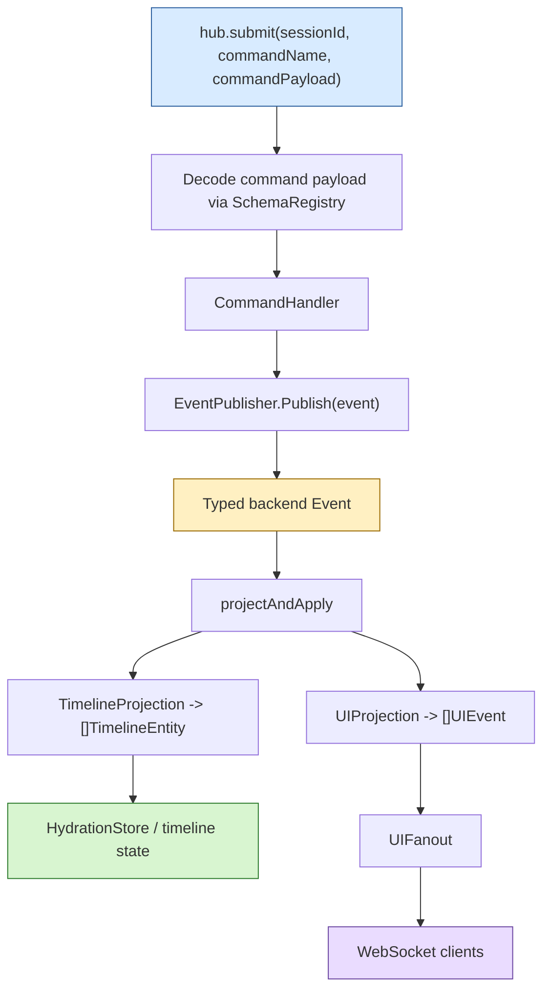
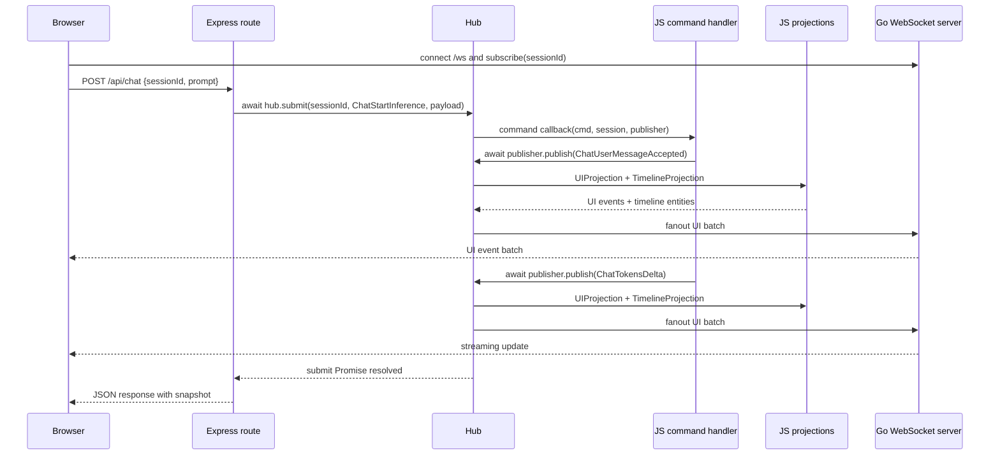

# goja-sessionstream — A Deep Dive into xgoja Sessionstream Integration

This article explains the implementation of `goja-sessionstream`: the Goja and xgoja integration layer that exposes the `sessionstream` event runtime to JavaScript, generated xgoja binaries, protobuf-backed builders, browser-facing HTTP applications, WebSocket fanout, and Redis-backed cross-process event distribution. The implementation lives in `/home/manuel/workspaces/2026-06-12/goja-sessionstream/sessionstream` on branch `task/goja-sessionstream`. The active pull request is `https://github.com/go-go-golems/sessionstream/pull/8`.

The project is not only a binding layer. It is a complete path from typed backend events to JavaScript application code and then to live browser UI updates. JavaScript defines commands, projections, HTTP routes, and application behavior. Go owns the runtime invariants: schema validation, protobuf encoding, session state, event ordering, projection execution, hydration, WebSocket transport, and optional Watermill-backed distribution. xgoja ties those pieces into generated binaries and generated runtime packages.

> [!summary]
> - **The Goja module exposes `require("sessionstream")` as a typed JavaScript API.** JavaScript registers protobuf schemas, creates hubs, registers command handlers and projections, submits commands, publishes events, snapshots timeline state, and mounts a Go-backed WebSocket server.
> - **The JavaScript API is Promise-native.** `hub.submit(...)`, `hub.publish(...)`, and command/projection publisher calls return Promises; JavaScript handlers and projections may also return Promises, and rejected Promises become ordinary sessionstream callback errors.
> - **The xgoja chatdemo is a real generated web application.** It combines Express-style routing, embedded browser assets, generated protobuf builders, the sessionstream Hub, Go WebSocket transport, delayed streaming, and a separate trace pane.
> - **The Redis/Watermill example proves the host-service boundary.** Go owns Redis clients, Watermill publisher/subscriber lifecycle, and cross-process fanout; JavaScript continues to publish typed sessionstream events through the same `hub` and `publisher` APIs.
> - **The architecture deliberately avoids misleading queue APIs.** There is no local `hub.enqueue(...)`; distributed command submission is not hidden behind an in-memory abstraction. The current distributed path is event-oriented.

## Why this project exists

`sessionstream` is an event-driven runtime for session-oriented applications. A session receives commands, command handlers publish typed backend events, projections derive UI events and timeline entities from those backend events, and transports deliver UI updates to connected clients. The Go implementation already had the core runtime pieces: schemas, hubs, handlers, projections, hydration, ordinals, WebSocket transport, and optional event bus support.

The missing layer was an application-authoring surface that allowed JavaScript to compose those pieces inside xgoja-generated applications. xgoja already provides compile-time Goja module composition, provider registration, generated binaries, generated runtime packages, embedded assets, jsverb command discovery, HTTP provider commands, and TypeScript declaration output. `goja-sessionstream` connects `sessionstream` to that environment so a JavaScript file can define an application like this:

```js
const express = require("express")
const ss = require("sessionstream")
const pb = require("sessionstream.examples.chatdemo.v1")
const assets = require("fs:assets")

const schemas = ss.schemas()
  .registerCommand("ChatStartInference", pb.StartInferenceCommand)
  .registerEvent("ChatUserMessageAccepted", pb.UserMessageAcceptedEvent)
  .registerUIEvent("ChatMessageAccepted", pb.ChatMessageUpdate)
  .registerTimelineEntity("ChatMessage", pb.ChatMessageEntity)

const hub = ss.hub({ schemas })

hub.command("ChatStartInference", async (cmd, session, pub) => {
  await pub.publish("ChatUserMessageAccepted",
    pb.UserMessageAcceptedEvent.builder()
      .messageId("m1")
      .role("user")
      .content(cmd.payload.prompt)
      .streaming(false)
      .build())
})
```

This code is short because most of the correctness is not in JavaScript. The schema registry validates names and payload types. The protobuf builder returns values the Go side can decode. The Hub assigns ordinals, persists timeline entities, invokes projections, and fans out UI batches. The WebSocket server handles subscription and delivery. xgoja embeds the JavaScript and browser assets into a binary and exposes a `serve` command.

The implementation target was therefore precise: JavaScript should describe application behavior, and Go should enforce sessionstream semantics. The boundary should be typed enough to make malformed events fail early, flexible enough to support asynchronous JavaScript, and explicit enough that distributed infrastructure is owned by the host rather than hidden in the script.

## The core runtime: commands, events, projections, and timeline entities

The underlying Go runtime is centered on `pkg/sessionstream.Hub`. The Hub owns the schema registry, hydration store, session registry, command registry, projections, fanout, optional event bus, projection error policies, observers, and ordinal state. Its construction path is intentionally option-based:

```go
type HubOption func(*Hub) error

func NewHub(opts ...HubOption) (*Hub, error) {
    h := &Hub{
        reg:                NewSchemaRegistry(),
        store:              newNoopHydrationStore(),
        sessions:           newSessionRegistry(nil),
        commands:           newCommandRegistry(),
        projectionPolicies: ProjectionPolicies{UI: ProjectionErrorPolicyFail, Timeline: ProjectionErrorPolicyFail},
        localOrdinal:       map[SessionId]uint64{},
    }
    for _, opt := range opts {
        if opt == nil {
            continue
        }
        if err := opt(h); err != nil {
            return nil, err
        }
    }
    return h, nil
}
```

The important design point is that the Hub remains a Go runtime object. The JavaScript module does not reimplement sessionstream. It constructs a Hub with Go options and then installs JavaScript callbacks as Go interfaces.

A command submission follows a fixed sequence:

1. Decode the submitted payload as a registered command protobuf message.
2. Load or create the session.
3. Invoke the registered command handler.
4. Let the handler publish one or more backend events.
5. Apply each backend event to the session timeline.
6. Run the UI projection and timeline projection.
7. Store timeline entities and advance cursors.
8. Fan out UI events to connected transports.
9. Return an error if command handling or projection processing failed according to the configured policy.

The event path is separated from the command path. Commands are requests to perform work. Events are typed records of what happened. Projections consume events to derive views. This separation is what makes the Redis example possible: a process can publish a typed event to Redis, another process can consume it, assign a local projection ordinal, update its view, and fan out to its own WebSocket clients without running the original command handler.



The Go runtime also exposes `SetUIFanout`. This is not a general mutation API; it exists for xgoja composition. In a generated xgoja app, JavaScript usually creates the Hub first and then asks another native module to create a WebSocket server from that Hub. The WebSocket module needs to attach a Go fanout to a Hub that already exists. `SetUIFanout` makes that order legal without forcing JavaScript into a Go-specific construction sequence.

```go
// SetUIFanout attaches or replaces the live UI fanout for this hub.
//
// Most Go callers should prefer WithUIFanout at construction time. This setter
// exists for dynamic hosts such as Goja/xgoja where JavaScript first creates a
// Hub, then asks another native module to create a Go-backed WebSocket server
// that should receive future projected UI events.
func (h *Hub) SetUIFanout(f UIFanout) error {
    if f == nil {
        return fmt.Errorf("ui fanout is nil")
    }
    h.fanout = f
    return nil
}
```

## The JavaScript module boundary

The Goja binding lives in `pkg/js/modules/sessionstream`. It exposes `require("sessionstream")` and provides a small set of high-level constructors and adapters:

| JavaScript API | Go responsibility |
| --- | --- |
| `ss.schemas()` | Create and wrap `sessionstream.SchemaRegistry`. |
| `schemas.registerCommand(...)` | Bind a symbolic command name to a protobuf message builder token. |
| `schemas.registerEvent(...)` | Bind backend event names to protobuf message types. |
| `schemas.registerUIEvent(...)` | Bind UI event names to protobuf message types. |
| `schemas.registerTimelineEntity(...)` | Bind timeline entity kinds to protobuf message types. |
| `ss.hub({ schemas, fanout, projectionPolicy })` | Construct `*sessionstream.Hub` with schema, hydration, fanout, host-supplied options, and projection policy. |
| `hub.command(name, fn)` | Adapt a JavaScript callback to `sessionstream.CommandHandler`. |
| `hub.uiProjection(fn)` | Adapt a JavaScript callback to `sessionstream.UIProjection`. |
| `hub.timelineProjection(fn)` | Adapt a JavaScript callback to `sessionstream.TimelineProjection`. |
| `hub.submit(sessionId, name, payload)` | Decode a command payload and call `Hub.Submit`. |
| `hub.publish(sessionId, name, payload)` | Decode an event payload and call `Hub.Publish`. |
| `hub.run()` | Start the configured event-bus consumer, if any. |
| `hub.snapshot(sessionId)` | Return a JavaScript view of timeline state. |
| `ss.webSocket.server(hub)` | Wrap the Go WebSocket transport and connect it to the Hub fanout. |

The module does not accept arbitrary JSON as a permanent internal representation. It accepts JavaScript objects only at the edge, converts them into registered protobuf messages, and then hands those messages to the Go runtime. This is visible in `api_hub.go`:

```go
m.mustSet(obj, "submit", func(sessionID, name string, payload goja.Value) goja.Value {
    msg, err := m.jsValueToProto(schemas, schemaKindCommand, name, payload)
    if err != nil {
        panic(m.vm.NewGoError(err))
    }
    callCtx := runtimebridge.CurrentOwnerContext(m.vm)
    return m.promiseFromGo(callCtx, "sessionstream.submit", func(ctx context.Context) error {
        return hub.Submit(ctx, ss.SessionId(sessionID), name, msg)
    })
})
```

The same pattern applies to `hub.publish(...)` and publisher-level `pub.publish(...)`. JavaScript sees a Promise. Go receives a typed protobuf message and a context that is safe for the current runtime owner.

This design makes schema registration central. A schema registry entry is the contract between JavaScript, Go, and protobuf JSON. If JavaScript tries to submit a command name that was not registered, or if the payload cannot be decoded as the registered protobuf type, the binding fails before the Hub processes the command.

## Promise-native callbacks and runtime owner safety

The first version of the binding could have exposed only synchronous JavaScript callbacks. That would have been too limited for real applications. Web handlers, model calls, timers, database calls, and event buses all naturally produce asynchronous JavaScript code. The final API is Promise-native:

```js
hub.command("ChatStartInference", async (cmd, session, pub) => {
  const answer = await model.ask(cmd.payload.prompt)
  await pub.publish("ChatInferenceFinished",
    pb.InferenceFinishedEvent.builder()
      .messageId("assistant-1")
      .text(answer)
      .content(answer)
      .status("done")
      .streaming(false)
      .build())
})

await hub.submit("demo", "ChatStartInference",
  pb.StartInferenceCommand.builder().prompt("hello").build())
```

The implementation has two directions of Promise handling.

First, Go operations called from JavaScript return Promises. `promiseFromGo` creates a Goja Promise, runs the Go operation without blocking the JavaScript stack, and posts settlement back onto the runtime owner:

```go
func (m *moduleRuntime) promiseFromGo(ctx context.Context, label string, run func(context.Context) error) goja.Value {
    promise, resolve, reject := m.vm.NewPromise()
    settle := func(err error) {
        if err != nil {
            _ = reject(m.vm.ToValue(err.Error()))
            return
        }
        _ = resolve(goja.Undefined())
    }
    services, ok := runtimebridge.Lookup(m.vm)
    if !ok || services.Owner == nil {
        settle(run(ctx))
        return m.vm.ToValue(promise)
    }
    go func() {
        err := run(ctx)
        _ = services.PostWithCustomContext(ctx, label+".settle", func(context.Context, *goja.Runtime) {
            settle(err)
        })
    }()
    return m.vm.ToValue(promise)
}
```

Second, JavaScript callbacks invoked by Go may themselves return Promises. `callJSCallback` invokes the JavaScript function on the runtime owner, detects Promise results, waits for settlement, and maps rejection to a Go error with a label such as `sessionstream.uiProjection.ChatUserMessageAccepted`:

```go
func (m *moduleRuntime) callJSCallback(
    ctx context.Context,
    label string,
    call func(*goja.Runtime) (goja.Value, error),
    finish func(*goja.Runtime, goja.Value) (any, error),
) (any, error) {
    if m.runtimeOwner != nil {
        ret, err := m.runtimeOwner.Call(ctx, label, func(callCtx context.Context, vm *goja.Runtime) (any, error) {
            value, err := call(vm)
            if err != nil {
                return nil, err
            }
            if promise, ok := value.Export().(*goja.Promise); ok {
                return callbackPromise{Promise: promise, Reentrant: callCtx == ctx}, nil
            }
            return finish(vm, value)
        })
        if err != nil {
            return nil, err
        }
        if pending, ok := ret.(callbackPromise); ok {
            if pending.Reentrant && pending.Promise.State() == goja.PromiseStatePending {
                return nil, fmt.Errorf("%s returned a pending Promise during a synchronous owner call; use Promise-returning submit/publish from JavaScript or call from Go", label)
            }
            return m.awaitPromise(ctx, label, pending.Promise, finish)
        }
        return ret, nil
    }
    // direct fallback omitted
}
```

The reentrant pending-Promise check is important. A Go callback can be invoked while the runtime owner is already executing a synchronous owner call. If the callback returns a pending Promise in that state, the system cannot wait for it without blocking the same execution context needed to settle it. The error tells the caller to use the Promise-returning JavaScript API path or call from Go in a way that can yield to the owner loop.

The owner context also matters for HTTP handlers. Express handlers execute inside Go-backed HTTP infrastructure but need to call back into the Goja runtime safely. The binding uses `runtimebridge.CurrentOwnerContext(m.vm)` for `hub.submit`, `hub.publish`, snapshots, run, and shutdown. That preserves the runtime-owner context when JavaScript calls sessionstream from an Express route.

## The callback adapters

The callback adapters are intentionally small. They translate JavaScript function signatures into Go interfaces and keep the conversion rules local.

A command handler receives three JavaScript values:

```js
hub.command("ChatStartInference", async (cmd, session, pub) => {
  await pub.publish("ChatUserMessageAccepted", payload)
})
```

The Go adapter turns this into a `sessionstream.CommandHandler`:

```go
func (m *moduleRuntime) commandHandler(schemas *ss.SchemaRegistry, fn goja.Callable) ss.CommandHandler {
    return func(ctx context.Context, cmd ss.Command, sess *ss.Session, pub ss.EventPublisher) error {
        _, err := m.callJSCallback(ctx, "sessionstream.command."+cmd.Name, func(vm *goja.Runtime) (goja.Value, error) {
            cmdValue, err := m.commandToJS(cmd)
            if err != nil {
                return nil, err
            }
            publisher := m.wrapPublisher(schemas, cmd.SessionId, pub)
            return fn(goja.Undefined(), cmdValue, m.sessionToJS(sess), publisher)
        }, nil)
        return err
    }
}
```

A UI projection receives an event, the session, and a read-only timeline view. It returns an array of UI events:

```js
h.uiProjection((event) => {
  if (event.name === "ChatTokensDelta") {
    return [{ name: "ChatAssistantDelta", payload: ... }]
  }
  return []
})
```

The Go adapter decodes the returned array by reading `name` and `payload` from each item, then converting the payload through the registered UI event schema. A timeline projection follows the same pattern but returns items with `kind`, `id`, `payload`, and optional `tombstone`.

These adapters keep JavaScript ergonomic while preserving typed runtime state. JavaScript does not need to construct Go structs. Go does not need to trust untyped JavaScript objects beyond the decode boundary.

## The xgoja provider

The xgoja provider lives in `pkg/js/modules/sessionstream/provider`. It registers the module under package ID `sessionstream` and exposes TypeScript declarations for xgoja declaration bundles. The provider uses xgoja host services to accept host-supplied Hub options:

```go
const (
    PackageID      = "sessionstream"
    HostServiceKey = "sessionstream.host-options.v1"
)

type HostOptions struct {
    HubOptions []ss.HubOption
}
```

Registration wires the module factory like this:

```go
func Register(registry *providerapi.ProviderRegistry) error {
    return registry.Package(PackageID, providerapi.Module{
        Name:         ssmodule.ModuleName,
        DefaultAs:    ssmodule.ModuleName,
        Description:  "sessionstream Hub, schemas, projections, fanout, and WebSocket helpers exposed as require(\"sessionstream\").",
        ConfigSchema: configSchema,
        TypeScript:   ssmodule.TypeScriptModule(),
        NewModuleFactory: func(ctx providerapi.ModuleSetupContext) (require.ModuleLoader, error) {
            hostOpts, err := hostOptionsFromServices(ctx.Host)
            if err != nil {
                return nil, err
            }
            return ssmodule.NewLoader(ssmodule.Options{
                RuntimeOwner:      ctx.RuntimeOwner,
                DefaultHubOptions: hostOpts.HubOptions,
            }), nil
        },
    })
}
```

This is the boundary used by the Redis example. The generated runtime package does not need to know about Redis. The JavaScript application does not need to know about Redis. The custom Go host injects `sessionstream.WithEventBus(...)` as a default Hub option through host services, and every JavaScript-created Hub receives that option.

```mermaid
flowchart TD
    XGOJA["xgoja generated runtime package"] --> HOST["custom Go host"]
    HOST --> SERVICES["app.HostServices"]
    SERVICES --> PROVIDER["sessionstream provider"]
    PROVIDER --> LOADER["NewLoader(DefaultHubOptions)"]
    LOADER --> JS["require(\"sessionstream\")"]
    JS --> HUB["ss.hub({ schemas })"]
    HUB --> OPTS["HubOptions applied"]
    OPTS --> BUS["WithEventBus(pub, sub, topic)"]

    style SERVICES fill:#d8ebff,stroke:#2b5f9e
    style BUS fill:#fff0c2,stroke:#9a6a00
```

The provider therefore has a clear responsibility: expose the module to xgoja, pass runtime-owner services to the binding, and translate host services into module defaults. It does not own Redis, HTTP listeners, or WebSocket lifecycle.

## The protobuf contract

The chatdemo uses protobuf messages as the application schema. The source contract is `examples/chatdemo/proto/sessionstream/examples/chatdemo/v1/chat.proto`.

The command type is small:

```proto
message StartInferenceCommand {
  string prompt = 1;
}
```

The backend events describe the stages of a fake streaming inference run:

```proto
message UserMessageAcceptedEvent {
  string message_id = 1;
  string role = 2;
  string content = 3;
  bool streaming = 4;
}

message InferenceStartedEvent {
  string message_id = 1;
  string prompt = 2;
  string role = 3;
  string content = 4;
  string status = 5;
  bool streaming = 6;
}

message TokensDeltaEvent {
  string message_id = 1;
  string role = 2;
  string chunk = 3;
  string text = 4;
  string content = 5;
  string status = 6;
  bool streaming = 7;
}

message InferenceTraceEvent {
  string message_id = 1;
  string stage = 2;
  string detail = 3;
  int64 elapsed_ms = 4;
}
```

The UI and timeline messages are separate from backend events:

```proto
message ChatMessageUpdate {
  string message_id = 1;
  string role = 2;
  string prompt = 3;
  string chunk = 4;
  string text = 5;
  string content = 6;
  string status = 7;
  bool streaming = 8;
  string ordinal = 9;
}

message ChatMessageEntity {
  string message_id = 1;
  string role = 2;
  string prompt = 3;
  string text = 4;
  string content = 5;
  string status = 6;
  bool streaming = 7;
}
```

This separation is not cosmetic. Backend events record application facts. UI events are transport-facing updates. Timeline entities are durable view state. A trace event can appear in the UI trace pane without becoming a timeline entity. A token delta can update both a live UI event and a timeline entity. A finished event can mark the UI message complete and persist the final content.

The generated protobuf Goja builders make JavaScript authoring practical:

```js
pb.TokensDeltaEvent.builder()
  .messageId(assistantID)
  .role("assistant")
  .chunk(chunk)
  .text(accumulated)
  .content(accumulated)
  .status("streaming")
  .streaming(true)
  .build()
```

The builder returns a value understood by `protogoja.MessageFromValue`, so the sessionstream binding can pass a real protobuf message into Go. Plain JavaScript objects are still accepted when they can be decoded by the registered protobuf schema, but builders are the preferred path because they make the intended message type explicit at the call site.

## The generated xgoja chatdemo server

The self-contained server lives in `examples/goja-chatdemo-server`. It is defined by `xgoja.yaml`, JavaScript in `verbs/chatbot.js`, browser assets in `assets/public`, and a smoke client in `cmd/smoke-client`.

The xgoja spec selects five providers:

```yaml
providers:
  - id: go-go-goja-host
    import: github.com/go-go-golems/go-go-goja/pkg/xgoja/providers/host
  - id: go-go-goja-http
    import: github.com/go-go-golems/go-go-goja/pkg/xgoja/providers/http
  - id: go-go-goja-core
    import: github.com/go-go-golems/go-go-goja/pkg/xgoja/providers/core
  - id: sessionstream
    import: github.com/go-go-golems/sessionstream/pkg/js/modules/sessionstream/provider
  - id: sessionstream-chatdemo
    import: github.com/go-go-golems/sessionstream/pkg/js/modules/chatdemo/provider
```

The runtime modules expose assets, Express, timers, the sessionstream API, and the generated chatdemo protobuf builders:

```yaml
runtime:
  modules:
    - provider: go-go-goja-host
      name: fs
      as: fs:assets
      config:
        embedded:
          allow: true
          mounts:
            - asset: app-assets
              mount: /app
    - provider: go-go-goja-http
      name: express
      as: express
    - provider: go-go-goja-core
      name: timer
      as: timer
    - provider: sessionstream
      name: sessionstream
      as: sessionstream
    - provider: sessionstream-chatdemo
      name: sessionstream.examples.chatdemo.v1
      as: sessionstream.examples.chatdemo.v1
```

The commands expose both normal jsverbs and the HTTP provider's `serve` command set:

```yaml
commands:
  - id: verbs
    type: builtin.jsverbs
    name: verbs
    sources: [sites]
  - id: serve
    type: provider.command-set
    provider: go-go-goja-http
    name: serve
    mount: serve
    sources: [sites]
```

The current command shape is therefore explicit:

```bash
examples/goja-chatdemo-server/dist/goja-chatdemo-server \
  serve chatbot serve \
  --http-listen 127.0.0.1:18789
```

The JavaScript `serve` verb builds the actual web application:

```js
function serve() {
  const app = express.app()
  hub = configureHub()
  wsServer = ss.webSocket.server(hub)
  hub.run()

  app.get("/", (_req, res) => res.type("text/html").send(assets.readFileSync("/app/public/index.html", "utf8")))
  app.staticFromAssetsModule("/assets", assets, "/app/public")
  app.get("/api/config", (_req, res) => res.json({ ok: true, defaultSessionId: sessionId }))
  app.get("/healthz", (_req, res) => res.json({ ok: true, app: "goja-chatdemo-server", connections: wsServer.connections().length }))
  app.post("/api/chat", async (req, res) => {
    const body = req.body || {}
    const sid = String(body.sessionId || sessionId)
    const prompt = String(body.prompt || "")
    if (!prompt) {
      res.status(400).json({ ok: false, error: "prompt is required" })
      return
    }
    await hub.submit(sid, "ChatStartInference", pb.StartInferenceCommand.builder().prompt(prompt).build())
    res.json({ ok: true, sessionId: sid, snapshot: hub.snapshot(sid) })
  })
  app.mount("/ws", wsServer)
}
```

The route setup demonstrates the intended division of responsibilities. JavaScript defines routes and application behavior. `fs:assets` serves embedded HTML, CSS, and browser JavaScript. `ss.webSocket.server(hub)` creates a Go WebSocket handler. `hub.submit(...)` starts the sessionstream command path. `hub.snapshot(...)` returns timeline state after command completion. The browser receives ongoing UI events through `/ws`.

The command handler publishes a staged event sequence. It accepts the user message, starts assistant inference, emits custom trace events, publishes token deltas with delays, and finishes the message:

```js
h.command("ChatStartInference", async (cmd, _session, pub) => {
  const prompt = String(cmd.payload.prompt || "")
  const userID = nextMessageId("user")
  const assistantID = nextMessageId("assistant")
  const answer = fakeAnswer(prompt)
  const startedAt = Date.now()
  const midpoint = Math.max(1, Math.floor(answer.length / 2))
  const chunks = [answer.slice(0, midpoint), answer.slice(midpoint)]

  await publishWithDelay(pub, "ChatUserMessageAccepted", ...)
  await publishWithDelay(pub, "ChatInferenceStarted", ...)
  await publishTraceEvent(pub, assistantID, "planning", "Custom protobuf trace: planning a fake response", startedAt)

  let accumulated = ""
  for (const chunk of chunks) {
    accumulated += chunk
    await publishTraceEvent(pub, assistantID, "chunk", `Custom protobuf trace: publishing ${chunk.length} characters`, startedAt)
    await publishWithDelay(pub, "ChatTokensDelta", ...)
  }

  await pub.publish("ChatInferenceFinished", ...)
})
```

The `timer` module is used to make streaming visible during manual testing. Without delay, the browser would receive the full event sequence too quickly for a human to observe intermediate states.

## UI projections and timeline projections in the chatdemo

The chatdemo registers both UI and timeline projections. The UI projection is optimized for the browser event stream. It emits `ChatMessageAccepted`, `ChatAssistantStarted`, `ChatAssistantDelta`, `ChatAssistantFinished`, and `ChatInferenceTrace` UI events. The trace event is routed to a separate pane in the browser instead of mutating the assistant message.

```js
h.uiProjection((event) => {
  const p = event.payload
  if (event.name === "ChatInferenceTrace") {
    return [{ name: "ChatInferenceTrace", payload: p }]
  }
  if (event.name === "ChatTokensDelta") {
    return [{ name: "ChatAssistantDelta", payload: pb.ChatMessageUpdate.builder()
      .messageId(p.messageId)
      .role(p.role)
      .chunk(p.chunk)
      .text(p.text)
      .content(p.content)
      .status(p.status)
      .streaming(true)
      .build() }]
  }
  return []
})
```

The timeline projection is optimized for persisted state. It turns user messages, inference start events, deltas, and finished events into `ChatMessage` entities. It intentionally ignores trace events:

```js
h.timelineProjection((event, _session, view) => {
  const p = event.payload
  if (event.name === "ChatInferenceTrace") {
    return []
  }
  if (event.name === "ChatTokensDelta" || event.name === "ChatInferenceFinished") {
    return [{ kind: "ChatMessage", id: p.messageId, payload: pb.ChatMessageEntity.builder()
      .messageId(p.messageId)
      .role(p.role)
      .text(p.text || p.content)
      .content(p.content || p.text)
      .status(p.status)
      .streaming(Boolean(p.streaming))
      .build() }]
  }
  return []
})
```

This split is one of the most important pieces of the implementation. Live UI updates and durable timeline state are related, but they are not the same structure. Trace events are visible to the browser but do not become chat messages. Token deltas update both live UI and timeline state. The final event completes the durable entity.

## The browser transport path

The browser side is intentionally simple. It connects to `/ws`, subscribes to the `demo` session or a query-parameter session id, posts prompts to `/api/chat`, and receives UI event batches over the WebSocket. The server returns a snapshot after `hub.submit(...)` resolves, but the visible streaming behavior comes from the WebSocket fanout.

The transport path is:



The response from `/api/chat` is not the only result of the command. The result is the event stream plus the updated timeline. That is why `hub.submit(...)` resolves after command handling and local projection work completes, but UI updates may already have been delivered over WebSocket while the handler was publishing events.

## Redis and Watermill integration

The Redis example lives in `examples/goja-redis-chatdemo-server`. It uses the same JavaScript app and browser assets as the regular chatdemo, but it changes the Go host shape. Instead of generating a standalone binary directly, the xgoja spec emits a `runtime-package` artifact:

```yaml
artifacts:
  - id: runtime
    type: runtime-package
    output: internal/xgojaruntime
    package: xgojaruntime
    sources: [sites, redis-tools]
  - id: embedded-assets
    type: embedded-assets
    sources: [app-assets]
```

The custom Go host imports that generated package, creates Redis and Watermill resources, injects a sessionstream host service, and attaches the generated commands:

```go
bundle, err := chatdemoruntime.NewBundle(chatdemoruntime.Options{
    Out: os.Stdout,
    ConfigureServices: func(services *app.HostServices) {
        _ = services.SetHostService(ssprovider.HostServiceKey, ssprovider.HostOptions{
            HubOptions: []ss.HubOption{bridge.HubOption()},
        })
    },
})

root := &cobra.Command{
    Use:   "redis-chatdemo",
    Short: "xgoja chatdemo host wired to Redis-backed Watermill events",
    PersistentPreRunE: func(cmd *cobra.Command, _ []string) error {
        return bridge.Open(cmd.Context())
    },
}
bundle.AttachDefaultCommands(root)
```

The Redis bridge opens a Redis client, a Watermill Redis Streams publisher, and a Redis Streams subscriber. The subscriber is configured with an empty consumer group:

```go
subscriber, err := redisstream.NewSubscriber(redisstream.SubscriberConfig{
    Client:                        redisClient,
    Consumer:                      b.settings.ConsumerID,
    ConsumerGroup:                 "",
    FanOutOldestId:                "$",
    BlockTime:                     time.Second,
    DisableIndefiniteInitialBlock: true,
    ShouldStopOnReadErrors:        func(error) bool { return false },
    CheckConsumersInterval:        30 * time.Second,
    NackResendSleep:               time.Second,
    ClaimInterval:                 30 * time.Second,
    ClaimBatchSize:                32,
    MaxIdleTime:                   time.Minute,
    ConsumerTimeout:               5 * time.Minute,
}, logger)
```

The empty `ConsumerGroup` is the semantic choice that makes cross-process browser fanout work. Every server process receives every event from the Redis stream and can fan it out to its own connected WebSocket clients. A shared consumer group would have different semantics: only one process would receive each event.

The event bus adapter serializes events as an envelope containing name, session id, and protobuf JSON payload:

```go
type eventEnvelope struct {
    Name      string          `json:"name"`
    SessionID string          `json:"sessionId"`
    Payload   json.RawMessage `json:"payload"`
}
```

Publishing sets Watermill metadata as well:

```go
msg.Metadata.Set(MetadataKeyEventName, ev.Name)
msg.Metadata.Set(MetadataKeySessionID, string(ev.SessionId))
msg.Metadata.Set(MetadataKeyPartitionKey, PartitionKeyForSession(ev.SessionId))
msg.Metadata.Set(MetadataKeyPublishedOrd, "0")
```

Consuming decodes the envelope, assigns an ordinal, observes the consumed event, and projects it locally:

```go
func (c *eventConsumer) handleMessage(ctx context.Context, msg *message.Message) error {
    ev, err := decodeEventEnvelope(c.hub.reg, msg.Payload)
    if err != nil {
        c.hub.reportError(ctx, ErrorRecord{Kind: ErrorKindDecode, Err: err, RawMessage: append([]byte(nil), msg.Payload...), Metadata: cloneWatermillMetadata(msg.Metadata)})
        return nil
    }
    ord, err := c.ordinals.Next(ctx, ev.SessionId, msg.Metadata)
    if err != nil {
        c.hub.reportError(ctx, ErrorRecord{Kind: ErrorKindOrdinal, SessionId: ev.SessionId, EventName: ev.Name, Err: err, RawMessage: append([]byte(nil), msg.Payload...), Metadata: cloneWatermillMetadata(msg.Metadata)})
        return err
    }
    ev.Ordinal = ord
    _, err = c.hub.projectAndApply(ctx, ev)
    return err
}
```

The important point is that command execution is not distributed by this feature. The current Redis path distributes events. A CLI command can run a command handler in its own short-lived process and publish the resulting events to Redis, but that is not the same as sending a command envelope to a durable command consumer. This distinction is documented in the example because it affects operational expectations.

## Redis-only CLI verbs

The Redis example also contains `examples/goja-redis-chatdemo-server/verbs/redis_tools.js`. These jsverbs are included only in the Redis host's `verbs` command source set:

```yaml
sources:
  - id: sites
    kind: jsverbs
    from:
      dir: ../goja-chatdemo-server/verbs
  - id: redis-tools
    kind: jsverbs
    from:
      dir: ./verbs

commands:
  - id: verbs
    type: builtin.jsverbs
    sources: [sites, redis-tools]
  - id: serve
    type: provider.command-set
    provider: go-go-goja-http
    name: serve
    sources: [sites]
```

This source split matters. The HTTP server should only see the `sites` source so it exposes `serve chatbot serve`. The Redis CLI should see both `sites` and `redis-tools` so it can expose operational verbs such as:

```bash
go run ./examples/goja-redis-chatdemo-server/cmd/redis-host \
  verbs redis publish-trace \
  --session-id demo \
  --message-id cli-trace \
  --stage cli \
  --detail "injected from the Redis CLI"
```

The Redis CLI verbs use the same sessionstream JavaScript API:

```js
async function publishTrace(options) {
  const sid = String(options.sessionId || sessionId)
  const messageID = String(options.messageId || "cli-trace")
  const stage = String(options.stage || "cli")
  const detail = String(options.detail || "custom trace event injected from the Redis CLI")
  const elapsedMs = Number(options.elapsedMs || 0)
  const hub = newHub()
  await hub.publish(sid, "ChatInferenceTrace", pb.InferenceTraceEvent.builder()
    .messageId(messageID).stage(stage).detail(detail).elapsedMs(elapsedMs).build())
  return `published ChatInferenceTrace ${stage} for ${messageID} to session ${sid}`
}
```

The command affects a running browser because the custom host injected Redis-backed Hub options into the CLI runtime as well as the server runtime. In the plain in-memory chatdemo, the same command would publish only inside the short-lived CLI process.

## Why there is no local enqueue API

During implementation, a local `hub.enqueue(...)` API was considered and removed. The final API intentionally exposes `hub.submit(...)` and `hub.publish(...)`, both Promise-native, but does not expose a local in-memory enqueue operation.

The reason is semantic accuracy. A local enqueue API inside a single Goja process would look like distributed command submission without providing distributed command semantics. It would not define a command envelope, a topic, a consumer group, retry policy, deduplication policy, failure storage, or ownership model. It would also blur the difference between command handling and event distribution.

The final design keeps these operations separate:

| Operation | Current API | Semantics |
| --- | --- | --- |
| Submit a command in the current Hub | `await hub.submit(sessionId, commandName, payload)` | Runs the command handler and local projection path for the current runtime. |
| Publish a backend event | `await pub.publish(eventName, payload)` or `await hub.publish(sessionId, eventName, payload)` | Publishes a typed event through the current Hub's configured publisher path. |
| Consume distributed events | `hub.run()` with `WithEventBus(...)` | Subscribes to the configured bus topic and locally projects consumed events. |
| Submit commands across processes | Not implemented | Requires a separate command-bus envelope, consumer model, retry model, and failure semantics. |

This is one of the more important architecture boundaries in the project. The implementation delivers a real cross-process event fanout path without pretending it has implemented a distributed command bus.

## Runtime package versus generated binary

The project uses two xgoja deployment shapes.

The regular chatdemo uses a generated binary artifact:

```yaml
artifacts:
  - id: binary
    type: binary
    output: dist/goja-chatdemo-server
    sources: [sites]
  - id: embedded-assets
    type: embedded-assets
    sources: [app-assets]
```

This is appropriate when xgoja can own the application host. The generated binary imports selected providers, embeds sources and assets, constructs the runtime plan, and exposes CLI commands.

The Redis chatdemo uses a generated runtime package:

```yaml
artifacts:
  - id: runtime
    type: runtime-package
    output: internal/xgojaruntime
    package: xgojaruntime
    sources: [sites, redis-tools]
```

This is appropriate when the application needs custom Go infrastructure. The generated package exposes `NewBundle`, `AttachDefaultCommands`, `NewRuntime`, `WriteTypeScriptDeclarations`, and provider registration. The hand-written host owns Redis, Watermill, lifecycle, and host-service injection.

The distinction is practical:

| Deployment shape | Best for | Ownership boundary |
| --- | --- | --- |
| Generated binary | A self-contained server where xgoja can own the process and HTTP command surface. | xgoja owns the host; JavaScript owns app setup. |
| Runtime package + custom host | A server that needs custom Go infrastructure, long-lived clients, auth, databases, event buses, or lifecycle hooks. | Go owns infrastructure and lifecycle; xgoja owns runtime composition; JavaScript owns app behavior. |

The Redis example demonstrates the second shape without changing the JavaScript application. That is the main value of host services: infrastructure can be injected at the Go boundary without adding Redis concepts to application JavaScript.

## How to run and validate the implementation

The normal chatdemo can be built and served with:

```bash
cd /home/manuel/workspaces/2026-06-12/goja-sessionstream/sessionstream
make -C examples/goja-chatdemo-server build
examples/goja-chatdemo-server/dist/goja-chatdemo-server \
  serve chatbot serve \
  --http-listen 127.0.0.1:18789
```

The smoke test builds the generated binary, starts it, posts a prompt, listens on the WebSocket, and verifies that an assistant completion arrives:

```bash
make -C examples/goja-chatdemo-server smoke
```

The Redis version starts Redis, generates the runtime package, runs two server processes, posts to one process, listens on the other process, and verifies cross-process fanout:

```bash
make -C examples/goja-redis-chatdemo-server smoke
```

The core Go tests used during implementation include:

```bash
go test ./pkg/js/modules/sessionstream ./pkg/js/modules/sessionstream/provider ./pkg/sessionstream -count=1
go test ./examples/goja-redis-chatdemo-server/cmd/redis-host ./examples/goja-chatdemo-server/cmd/smoke-client -count=1
go test ./... -count=1
```

The final branch validation also ran:

```bash
GOWORK=off /tmp/glazed-lint ./...
make -C examples/goja-chatdemo-server smoke
make -C examples/goja-redis-chatdemo-server smoke
```

The latest PR branch contains the dependency bump to `github.com/go-go-golems/go-go-goja v0.9.5` and the Redis host lint fix. The lint fix removed direct environment-variable reads and raw Cobra root flags from the CLI code after `glazed-lint` rejected both. The current Redis host uses fixed example defaults and opens Redis resources through `PersistentPreRunE`, keeping generated xgoja child commands intact.

## Important files

| File | Role |
| --- | --- |
| `pkg/js/modules/sessionstream/module.go` | Goja module loader and exported module surface. |
| `pkg/js/modules/sessionstream/api_hub.go` | JavaScript Hub API: `submit`, `publish`, `snapshot`, `command`, projections, `run`, `shutdown`. |
| `pkg/js/modules/sessionstream/api_callbacks.go` | Command, UI projection, and timeline projection callback adapters. |
| `pkg/js/modules/sessionstream/api_promises.go` | Promise-native Go operations and Promise-aware callback handling. |
| `pkg/js/modules/sessionstream/api_websocket.go` | WebSocket server binding for JavaScript-created hubs. |
| `pkg/js/modules/sessionstream/provider/provider.go` | xgoja provider registration and host-service integration. |
| `pkg/sessionstream/hub.go` | Core Hub runtime, options, registration, submission, projection, fanout. |
| `pkg/sessionstream/bus.go` | Watermill event publishing, event envelope encoding, metadata, bus options. |
| `pkg/sessionstream/consumer.go` | Event-bus subscriber loop, envelope decoding, ordinal assignment, projection application. |
| `examples/chatdemo/proto/sessionstream/examples/chatdemo/v1/chat.proto` | Chatdemo protobuf command/event/UI/timeline schema. |
| `examples/goja-chatdemo-server/verbs/chatbot.js` | Main JavaScript application: schemas, Hub, command handler, projections, Express routes. |
| `examples/goja-chatdemo-server/xgoja.yaml` | Generated binary configuration. |
| `examples/goja-chatdemo-server/assets/public/app.js` | Browser client for `/api/chat` and `/ws`. |
| `examples/goja-redis-chatdemo-server/xgoja.yaml` | Runtime-package configuration plus separate Redis CLI source. |
| `examples/goja-redis-chatdemo-server/cmd/redis-host/main.go` | Custom Go host that injects Redis/Watermill Hub options. |
| `examples/goja-redis-chatdemo-server/verbs/redis_tools.js` | Redis-only operational jsverbs. |

## Design decisions and consequences

### JavaScript composes behavior; Go enforces invariants

The binding does not make JavaScript responsible for event ordering, protobuf decoding, hydration, or WebSocket fanout correctness. JavaScript registers behavior and returns typed values. Go validates and applies them. This keeps the JavaScript application small while preserving the existing sessionstream runtime guarantees.

### Promise-native APIs are the default

The final JavaScript API uses `await hub.submit(...)` and `await pub.publish(...)`. There are no public `submitSync`, `publishSync`, `submitAsync`, or `publishAsync` variants. This avoids an API split where users must remember which variant is safe inside an HTTP handler or asynchronous command callback. The Go implementation preserves completion semantics by resolving the Promise after the Go operation completes.

### Rejected Promises are callback errors

A Promise rejection from a command handler, UI projection, or timeline projection is treated like a synchronous JavaScript throw. The error label includes the callback kind and event or command name. This is important for projection policy: rejected async projections should be subject to the same fail-or-advance behavior as synchronous projection errors.

### The WebSocket fanout is dynamically attached

`Hub.SetUIFanout` exists because xgoja JavaScript creates objects in a different order than a pure Go constructor path. JavaScript creates a Hub, then creates a WebSocket server from that Hub. The Go WebSocket binding attaches the fanout after Hub construction.

### Redis support is host-owned

The Redis example does not put Redis configuration into JavaScript. It also does not make the sessionstream provider instantiate Redis clients from module config. The custom host owns Redis resources and injects only a `HubOption`. This preserves the provider boundary and keeps JavaScript portable between in-memory and Redis-backed hosts.

### Event distribution is not command distribution

The Watermill integration distributes backend events. It does not provide a distributed command bus. This prevents the project from promising retries, command ownership, idempotency, or failure handling that it has not implemented.

## Current limitations and open design questions

The current implementation is strong enough to support a generated chat server and a Redis-backed cross-process fanout demo, but several boundaries remain explicit.

First, xgoja HTTP `serve` currently mirrors jsverb package and verb structure. The command is `serve chatbot serve`, not just `serve`. That is accurate for multi-verb source sets but verbose for a single server entrypoint. This is tracked upstream as `https://github.com/go-go-golems/go-go-goja/issues/79`.

Second, the Redis example uses fixed example defaults for Redis address, topic, and consumer id after `glazed-lint` rejected ad-hoc environment reads and raw Cobra flags in CLI code. A more complete CLI surface should express these settings as Glazed command fields or use xgoja's config/env middleware in a way that satisfies the repository lint rules.

Third, a true distributed command bus is not implemented. If needed, it should be designed separately with a command envelope, topic model, consumer ownership rules, retry semantics, deduplication, failure recording, and observability.

Fourth, the chatdemo uses `fakeAnswer(prompt)`. A real model-backed chatbot would replace that function with a Geppetto or model-provider call while keeping the same event/projection structure.

## Recommended implementation sequence for future work

A future engineer extending this project should work in this order:

1. Start with the protobuf schema. Define backend events separately from UI events and timeline entities.
2. Register schemas in JavaScript before creating the Hub.
3. Implement the command handler as an async function that publishes typed backend events.
4. Implement the UI projection and timeline projection separately. Decide explicitly which backend events should affect durable timeline state.
5. Add a smoke client that exercises both the HTTP command path and the WebSocket fanout path.
6. If distribution is required, generate a runtime package and write a custom Go host that injects `sessionstream.WithEventBus(...)` through provider host services.
7. Keep operational CLI verbs in a separate source set when they only make sense for the distributed host.
8. Run `go test ./...`, `glazed-lint`, and both chatdemo smokes before pushing.

The most common mistake would be to move infrastructure concerns into JavaScript because it is easy to call `require(...)` from the app file. The durable boundary is different: JavaScript should decide what the application does; Go should own infrastructure clients, lifecycle, and runtime options.

## Closing

`goja-sessionstream` turns `sessionstream` into an xgoja-native application runtime. The binding exposes a compact JavaScript surface, but the implementation is built around Go-owned correctness: typed protobuf schemas, owner-safe Promise handling, projection policies, event ordinals, WebSocket fanout, and optional Watermill-backed event distribution.

The result is a usable pattern for generated web applications. A single JavaScript source can register schemas, define commands and projections, mount routes, serve embedded assets, and stream updates to a browser. When the application needs distributed infrastructure, the same JavaScript can run inside a custom Go host that injects Redis-backed event bus options. That separation is the main architectural result of the project.
