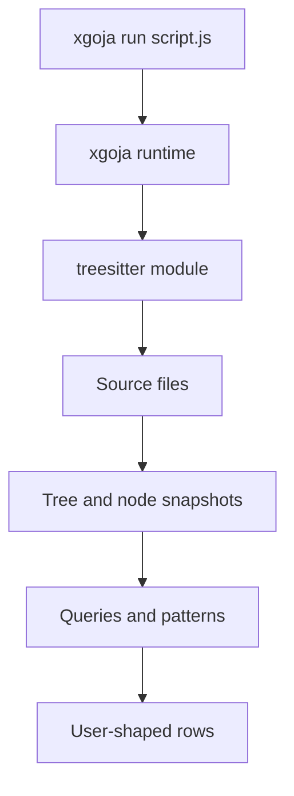

# goja-treesitter: A Generic Tree-sitter Runtime for goja and xgoja

`goja-treesitter` is a Go-backed JavaScript runtime module that exposes tree-sitter parsing, querying, structural matching, fluent repository scans, and xgoja command packaging to scripts running inside `goja`. The project is not just a binding layer around tree-sitter. It is an attempt to define a stable division of responsibility between a small Go core and a flexible JavaScript analysis layer.

The most important design decision is that the Go core stays generic. It understands languages, parsers, trees, nodes, queries, patterns, matches, files, rows, and scan items. It does not understand packages, routes, handlers, React components, endpoints, modules, classes as semantic entities, or any project-specific concept. Those meanings are registered at runtime by JavaScript helpers or bundled into xgoja jsverbs. This choice determines the shape of every major subsystem in the project.

> [!summary]
> - `goja-treesitter` provides a Go-backed `require("treesitter")` module for `goja` and xgoja, with parser/tree/node wrappers, tree-sitter queries, structural matcher patterns, and fluent scan builders.
> - The architecture uses hidden Go references behind JavaScript wrapper objects. JavaScript sees ordinary objects and methods, while Go retains typed ownership of parsers, trees, queries, nodes, patterns, and builders.
> - Source-analysis semantics live in JavaScript: supported jsverbs, runtime helper registration, query bundles, and project-specific scripts. The Go layer remains a language-neutral kernel.
> - The generated xgoja host now includes supported jsverbs, provider help docs, native metadata commands under `ts`, and a separate single-binary query-bundle example.

## Why this project exists

Tree-sitter provides incremental concrete syntax trees for many programming languages. Go provides efficient bindings through `github.com/tree-sitter/go-tree-sitter`. `goja` provides an embeddable ECMAScript runtime. xgoja packages Go-backed modules, host services, JavaScript verbs, and help docs into generated binaries. `goja-treesitter` connects these pieces so that repository analysis can be written in JavaScript while using Go-owned parser and query objects.

The problem is not merely "call tree-sitter from JavaScript." A direct binding would expose low-level parser objects and leave every script to solve the same surrounding problems: file traversal, row normalization, source span conversion, query lifecycle, AST exploration, structural matching, helper registration, command packaging, and prompt-context rendering. The project builds those surrounding pieces while preserving a small generic center.

The project also addresses a common failure mode in source-analysis tools: they become hardcoded around a particular language or organization too early. Once a tool knows what a "handler" or "route" is, the core becomes difficult to reuse. `goja-treesitter` avoids that by making the core generic and placing semantic concepts in JavaScript helpers. A user can define a `route` helper, an `outline` row mapper, a `markdown` renderer, or a small pattern DSL without asking the Go module to grow another first-class concept.

The repository path is:

```text
/home/manuel/workspaces/2026-06-14/goja-treesitter/goja-treesitter
```

The main ticket and design workspace is:

```text
ttmp/2026/06/14/GOJA-TS-001--goja-treesitter-fluent-tree-sitter-bindings-and-norvig-style-unifying-matcher-for-goja
```

The implementation is currently active and substantial. The completed work includes the runtime module, parser/tree/node snapshots, query execution, matcher kernel, helper registry, fluent scan builder, supported jsverbs, outline/context commands, provider help docs, native metadata commands, and a single-binary xgoja query-bundle example.

## The core contract

The public JavaScript module is `require("treesitter")`. It currently supports language aliases `go`, `javascript`, and `js`. The core contract can be summarized as a set of objects and operations:

| Concept | JavaScript surface | Go ownership |
| --- | --- | --- |
| Language registry | `ts.languages()`, `ts.about()` | `languageRegistry` maps names to `*tree_sitter.Language`. |
| Parser | `ts.parser(language)` | `parserRef` owns a `*tree_sitter.Parser`. |
| Tree | `parser.parse(source)`, `ts.parse(language, source)` | `treeRef` owns the tree-sitter tree, source bytes, and a root snapshot. |
| Node | `tree.rootNode()`, `node.children`, `node.field(name)` | `nodeRef` points to an immutable `TSNode` snapshot. |
| Query | `ts.query(language, source)` | `queryRef` owns a compiled `*tree_sitter.Query`. |
| Query rows | `tree.queryRows(query, file?)` | Go executes query and normalizes canonical row maps. |
| Pattern | `ts.pattern`, `ts.v`, `ts.field`, `ts.deep`, `ts.where` | `patternRef` stores structural matcher instructions. |
| Match | `tree.match`, `tree.matchAll` | Go traverses node snapshots and produces match result objects. |
| Helper registry | `ts.helper`, `ts.definePattern`, `ts.defineRow`, `ts.defineRenderer` | `moduleRuntime` stores per-runtime callable registries. |
| Fluent scan | `ts.scan(...)`, `ts.from(tree)` | `scanBuilderRef` and `treeBuilderRef` collect filters and row mappers. |

The system is deliberately not a TypeScript AST library, a Go package indexer, or a static-analysis framework with a fixed domain model. It is a runtime for building those things in JavaScript.

## Architecture overview

The implementation has three layers:

1. The Go native module in `pkg/`.
2. The xgoja provider and generated host integration in `pkg/xgoja/providers/treesitter/` and `cmd/goja-treesitter/`.
3. JavaScript verbs and examples in `jsverbs/treesitter/`, `examples/scripts/`, and `examples/query-bundle/`.

The data path for a typical command is:

```mermaid
flowchart TD
  CLI[Generated xgoja command]
  JSVerb[Supported jsverb]
  Runtime[xgoja goja runtime]
  Module[require("treesitter")]
  Parser[Go parser/query/matcher core]
  Rows[Canonical rows]
  Glazed[Glazed output]

  CLI --> JSVerb
  JSVerb --> Runtime
  Runtime --> Module
  Module --> Parser
  Parser --> Rows
  Rows --> Glazed
```

A direct script path omits the jsverb command layer:



This separation is important. The native module does not need to know whether it is being used from a CLI command, a custom xgoja script, a generated query-bundle binary, or an interactive runtime. It exposes the same parser/query/matcher/scan primitives in every case.

## Hidden references and Go-owned JavaScript objects

The binding pattern follows the same principle used in related goja modules such as `goja-bleve`: JavaScript objects are wrappers around Go references. The wrapper is a normal `goja.Object`, but it contains a hidden non-enumerable property named `__treesitter_ref`. Go uses that property to recover the typed object.

The central code is in `pkg/runtime.go`:

```go
const hiddenRefKey = "__treesitter_ref"

type refKind string

const (
    refKindParser      refKind = "parser"
    refKindTree        refKind = "tree"
    refKindNode        refKind = "node"
    refKindQuery       refKind = "query"
    refKindPattern     refKind = "pattern"
    refKindTreeBuilder refKind = "treeBuilder"
    refKindScanBuilder refKind = "scanBuilder"
)

type refBase struct {
    api    *moduleRuntime
    kind   refKind
    closed bool
}
```

Every Go-owned object embeds or includes a `refBase`. The `moduleRuntime` installs exports and provides helper methods for wrapping and unwrapping values:

```go
func (m *moduleRuntime) attachRef(o *goja.Object, ref any) {
    _ = o.Set(hiddenRefKey, ref)
    _ = o.DefineDataProperty(
        hiddenRefKey,
        o.Get(hiddenRefKey),
        goja.FLAG_FALSE,
        goja.FLAG_FALSE,
        goja.FLAG_FALSE,
    )
}

func getTypedRef[T any](m *moduleRuntime, v goja.Value, expected string) (*T, error) {
    ref := m.getRef(v)
    if ref == nil {
        return nil, fmt.Errorf("treesitter: expected %s wrapper, got value without Go reference", expected)
    }
    typed, ok := ref.(*T)
    if !ok {
        return nil, fmt.Errorf("treesitter: expected %s wrapper, got %T", expected, ref)
    }
    return typed, nil
}
```

This design solves a concrete binding problem. Without hidden typed references, every Go method that receives a JavaScript value would have to inspect arbitrary object shapes and defensively interpret maps. With hidden references, `Tree.query(query)` can require a real `queryRef`, `Tree.match(pattern)` can require a real `patternRef`, and helper registration can validate that a registered pattern factory returns an actual pattern wrapper.

The important invariant is that JavaScript gets ergonomic method calls while Go retains type safety at the API boundary. A user can write:

```javascript
const q = ts.query("go", "(function_declaration name: (identifier) @name)");
const tree = ts.parse("go", source);
const rows = tree.queryRows(q, "hello.go");
```

Go does not need to parse that query object as a map. It unwraps the hidden reference and obtains `*queryRef`.

## Parser, tree, and node snapshots

The parser layer is small. `ts.parser(language)` creates a `parserRef` with a `*tree_sitter.Parser`, the selected language object, and the canonical language name. `Parser.parse(source)` returns a `Tree` wrapper.

`pkg/api_tree.go` shows the important step:

```go
func (m *moduleRuntime) parseTree(parser *parserRef, source []byte) (*goja.Object, error) {
    tree := parser.parser.Parse(source, nil)
    if tree == nil {
        return nil, fmt.Errorf("treesitter: parser returned nil tree")
    }
    root := snapshotNode(tree.RootNode(), source, defaultSnapshotDepth)
    ref := &treeRef{
        refBase:  refBase{api: m, kind: refKindTree},
        tree:     tree,
        langName: parser.langName,
        source:   append([]byte(nil), source...),
        root:     root,
    }
    return m.treeObject(ref), nil
}
```

The tree owns both the live tree-sitter tree and a snapshot of the root node. The snapshot is not an accidental cache. It is a deliberate API contract. Node wrappers expose text, spans, children, fields, parents, and sibling navigation even after the `Tree` is closed. That behavior is tested and documented.

The snapshot type is defined in `pkg/types.go`:

```go
type TSNode struct {
    Kind      string
    StartByte int
    EndByte   int
    StartRow  int
    StartCol  int
    EndRow    int
    EndCol    int
    IsNamed   bool
    IsError   bool
    IsMissing bool
    Children  []*TSNode

    Parent     *TSNode
    Index      int
    FieldName  string
    FieldNames []string
    Fields     map[string]*TSNode
}
```

This data structure is the basis for the JavaScript `Node` surface:

```javascript
node.kind
node.text
node.startByte
node.endByte
node.startRow
node.startCol
node.endRow
node.endCol
node.isNamed
node.children
node.child(0)
node.field("name")
node.parent()
node.nextSibling()
node.prevSibling()
node.toString()
```

The snapshot captures field names with `FieldNameForChild`. This matters because tree-sitter grammars often encode semantic relationships through named fields. A Go function declaration has a `name` field. A call expression has a `function` field. A pattern API that cannot refer to fields would force users to rely on child positions, which are brittle across grammar changes.

The node snapshot policy has tradeoffs. It makes JavaScript usage safe and simple, but it stores a tree-shaped copy of the parse result up to `defaultSnapshotDepth`. The current implementation uses a depth limit of 128. That is sufficient for ordinary source files and test fixtures, but large generated files or very deep syntax trees may eventually need explicit limits, diagnostics, or lazy node wrapping. Those hardening tasks remain open in Phase 11.

## Query execution and canonical rows

Tree-sitter queries are the fastest path for grammar-shaped captures. `ts.query(language, source)` compiles a query and returns a Go-backed `Query` wrapper. `tree.query`, `tree.queryMatches`, and `tree.queryRows` run it against a tree.

The compile path in `pkg/api_query.go` is direct:

```go
q, qerr := tree_sitter.NewQuery(lang, querySource)
if qerr != nil {
    return nil, fmt.Errorf(
        "treesitter: query parse error at %d:%d: %s",
        qerr.Row, qerr.Column, qerr.Message,
    )
}
```

The execution path uses `go-tree-sitter v0.25.0` APIs:

```go
captureNames := query.query.CaptureNames()
cursor := tree_sitter.NewQueryCursor()
defer cursor.Close()

iter := cursor.Matches(query.query, root, tree.source)
for match := iter.Next(); match != nil; match = iter.Next() {
    snap := queryMatchSnapshot{Index: uintToClampedInt(match.PatternIndex)}
    for _, capture := range match.Captures {
        idx := uintToClampedInt(uint(capture.Index))
        name := ""
        if idx >= 0 && idx < len(captureNames) {
            name = captureNames[idx]
        }
        snap.Captures = append(snap.Captures, queryCaptureSnapshot{
            Name:  name,
            Index: idx,
            Node:  snapshotNode(&capture.Node, tree.source, defaultSnapshotDepth),
        })
    }
    out = append(out, snap)
}
```

The normalized row shape is intentionally canonical and compact:

```go
rows = append(rows, map[string]any{
    "file":       fileName,
    "language":   tree.langName,
    "query":      query.source,
    "matchIndex": match.Index,
    "capture":    capture.Name,
    "kind":       node.Kind,
    "text":       node.sourceText(tree.source),
    "startByte":  node.StartByte,
    "endByte":    node.EndByte,
    "startRow":   node.StartRow,
    "startCol":   node.StartCol,
    "endRow":     node.EndRow,
    "endCol":     node.EndCol,
})
```

The project explicitly removed compatibility aliases from earlier experimental directions. Rows use canonical field names such as `startRow` and `endCol`; users who want alternate names can map rows in JavaScript. This keeps the native row contract stable and small.

A direct query looks like this:

```javascript
const q = ts.query("go", "(function_declaration name: (identifier) @name)");
const tree = ts.parse("go", source);
try {
  const rows = tree.queryRows(q, "hello.go");
  console.log(rows);
} finally {
  tree.close();
  q.close();
}
```

The supported `query query` jsverb wraps this pattern for files and directories. It adds file resolution, `--query-file`, `--values`, `--context-lines`, `--include-text`, globs, recursion, and excludes. That logic belongs in JavaScript because it is command behavior, not core parser behavior.

## The structural matcher kernel

Queries are excellent when the grammar pattern can be described in tree-sitter query syntax. They are less convenient when a match needs JavaScript logic, reusable helper factories, conditional bindings, or equality between two captured nodes. The matcher subsystem handles those cases.

The matcher is implemented as a small pattern algebra. The pattern kinds are:

```go
const (
    patternKindNode     patternKind = "node"
    patternKindVariable patternKind = "variable"
    patternKindWildcard patternKind = "wildcard"
    patternKindField    patternKind = "field"
    patternKindAlt      patternKind = "alt"
    patternKindNot      patternKind = "not"
    patternKindGuard    patternKind = "guard"
    patternKindDeep     patternKind = "deep"
    patternKindWhere    patternKind = "where"
    patternKindMatcher  patternKind = "matcher"
    patternKindBind     patternKind = "bind"
)
```

The JavaScript surface is constructor-based:

```javascript
ts.pattern("function_declaration", ...children)
ts.variable("name")
ts.v("name")
ts.wildcard()
ts.field("name", pattern)
ts.alt(...patterns)
ts.not(pattern)
ts.guard(pattern, fn)
ts.deep(pattern)
ts.where(fn)
ts.matcher(fn)
pattern.as("bindingName")
```

A simple function-name binding pattern is:

```javascript
const pat = ts.pattern(
  "function_declaration",
  ts.field("name", ts.v("name"))
);

const matches = tree.matchAll(pat);
```

The matcher traverses node snapshots. For each node, it clones the initial match state and attempts the pattern. If the match succeeds, the cloned state becomes the result. This is the key part of `treeMatchAll`:

```go
for _, node := range walkNodes(tree.root) {
    state := base.clone()
    if state.match(pattern, node) {
        results = append(results, matchResult{Node: node, Bindings: state.bindings})
    }
}
```

The state stores two kinds of pre-bindings:

```go
type matchState struct {
    api      *moduleRuntime
    source   []byte
    bindings map[string]*TSNode
    strings  map[string]string
}
```

A variable binding can bind a node, compare against an existing node binding, or compare a node's source text against an initial string binding. This allows command-line match invocations to pass JSON string bindings without constructing node objects.

Lambda matchers are the most important recent addition. `ts.where(fn)` is a predicate pattern. `ts.matcher(fn)` receives a match context and can bind nodes explicitly through `ctx.bind(name, node)`. The `.as(name)` method wraps any pattern in a binding pattern. These features let users build small DSLs without introducing a public S-expression pattern language.

A design-doc style matcher example is now bundled in `examples/query-bundle/jsverbs/queries.js`:

```javascript
"go.recursive-functions": {
  language: "go",
  kind: "pattern",
  title: "Go directly recursive functions",
  makePattern: () => ts.pattern("function_declaration",
    ts.field("name", ts.v("fn")),
    ts.deep(ts.pattern("call_expression", ts.field("function", ts.v("fn"))))
  ),
  row: ({ item, match }) => ({
    query: "go.recursive-functions",
    file: item.file,
    language: item.language,
    kind: "recursive-function",
    name: match.bindings.fn.text,
    startRow: match.node.startRow,
    startCol: match.node.startCol,
  }),
}
```

That example expresses a relationship that is awkward in a single raw tree-sitter query: the function name and the callee name must be the same binding.

## Runtime helper registry

The helper registry is the mechanism that keeps the Go core generic while still making scripts concise. Each `moduleRuntime` has four registries:

```go
type moduleRuntime struct {
    vm      *goja.Runtime
    langReg *languageRegistry

    helpers   map[string]goja.Callable
    patterns  map[string]goja.Callable
    rows      map[string]goja.Callable
    renderers map[string]goja.Callable

    helperObj *goja.Object
    rowObj    *goja.Object
    renderObj *goja.Object
}
```

The public API is:

```javascript
ts.helper(name, fn)
ts.definePattern(name, fn)
ts.defineRow(name, fn)
ts.defineRenderer(name, fn)
ts.h.<name>(...args)
ts.row.<name>(input, ...args)
ts.render.<name>(rows, ...args)
```

`ts.helper` registers item metadata helpers for scan items. `ts.definePattern` registers pattern factories and exposes them under `ts.h`. `ts.defineRow` registers row mappers and exposes them under `ts.row`. `ts.defineRenderer` registers renderers and exposes them under `ts.render`.

The registry is per goja runtime. That is a deliberate isolation boundary. A generated CLI invocation gets a fresh runtime. A script can define helpers for that run without mutating global process state for a different runtime. Provider-shipped helper libraries can still be loaded into a runtime when needed, but the fundamental unit of helper registration is the runtime.

A typical helper script looks like this:

```javascript
ts.helper("basename", item => item.file.split(/[\\/]/).pop());

ts.defineRow("function", ({ item, row }, options) => ({
  file: item.file,
  base: item.meta.basename,
  name: row.text,
  label: options && options.prefix ? `${options.prefix}${row.text}` : row.text,
  line: row.startRow + 1,
}));

const rows = ts.scan({ language: "go", files: ["../../testdata/fixtures"], recurse: true })
  .with("basename")
  .query(q)
  .rows(input => ts.row.function(input, { prefix: "fn:" }));
```

The variadic row and renderer wrappers matter. An earlier implementation forwarded only the first argument to `ts.row.*` and `ts.render.*`, which meant option objects were silently dropped. That was fixed so registered row helpers can receive context arguments such as `{ includeBody, template, contextLines }`.

## Fluent scan builders

The fluent scan API is the bridge between file traversal and analysis. The generic scan item is:

```go
type scanItem struct {
    File     string
    Language string
    Source   []byte
    Tree     *treeRef
    Meta     map[string]any
}
```

In JavaScript, it appears as:

```javascript
{
  file,
  language,
  source,
  tree,
  root,
  meta,
}
```

The builder supports:

```javascript
ts.scan(languageOrOptions, files?)
  .with(...helpers)
  .mapItem(fn)
  .whereItem(fn)
  .where(patternOrPredicate)
  .query(query)
  .rows(mapper?)
  .render(renderer)
```

The scan process has four phases:

1. Resolve files from explicit paths, directories, language defaults, include globs, excludes, and recursion settings.
2. Parse each file into a tree and construct a `ScanItem`.
3. Apply item helpers, item mappers, and item predicates to populate and filter `item.meta`.
4. Apply query, pattern, or predicate filters and convert results into rows.

The builder is generic. It does not know what an outline row is. It only knows that a query produces query-row inputs, a pattern produces match inputs, and a predicate produces node inputs. Row helpers then shape the output.

A complete pipeline can stay entirely in JavaScript:

```javascript
const q = ts.query("go", "(function_declaration name: (identifier) @name)");
try {
  const rows = ts.scan({ language: "go", files: ["./pkg"], recurse: true, exclude: "vendor/**" })
    .with("basename")
    .whereItem(item => item.source.length < 500000)
    .query(q)
    .rows(input => ts.row.function(input));
} finally {
  q.close();
}
```

There are two caveats to understand. First, scan execution is currently sequential and JavaScript-driven; there is no benchmark proving native Go command replacements would be faster. Second, builder filters are additive producers rather than a full relational pipeline with intersection semantics. That is enough for the current supported use cases, but complex composition semantics should be designed before adding backtracking-heavy matchers or multi-stage row joins.

## Supported jsverbs

The repository includes supported jsverbs under `jsverbs/treesitter/`. These are embedded into the generated host by `cmd/goja-treesitter/xgoja.yaml` and covered by smoke tests.

| File | Command | Purpose |
| --- | --- | --- |
| `jsverbs/treesitter/ast.js` | `ast ast` | Parse files and dump ASTs as JSON, S-expression/Lisp, or compact text. |
| `jsverbs/treesitter/query.js` | `query query` | Run a raw tree-sitter query over files and emit capture rows. |
| `jsverbs/treesitter/scan.js` | `scan scan` | Run a named query over source files with summaries. |
| `jsverbs/treesitter/match.js` | `match match` | Run JavaScript pattern expressions over files. |
| `jsverbs/treesitter/outline.js` | `outline outline` | Produce stable outline rows for Go and JavaScript files. |
| `jsverbs/treesitter/context.js` | `tools source-context` | Render compact Markdown context for prompts and reviews. |

These commands are not examples in the loose sense. They are the supported CLI surface of the generated host. The repository also contains `examples/scripts/`, which are runnable documentation and not scanned as supported commands.

The outline and context commands demonstrate the helper-registry architecture. They contain Go and JavaScript outline queries, row helpers, renderers, and options such as `--max-bytes`, `--include-body`, `--include-comments`, `--row-template`, `--heading-level`, and `--context-lines`. They remain intentionally small. They are useful prompt-context tools, not complete language indexers.

One subtle CLI detail is `--row-template`. The obvious flag name would be `--template`, but the generated Glazed CLI already owns `--template` for output rendering. A jsverb field named `template` caused command mounting failures. The project therefore uses `rowTemplate` in JavaScript and `--row-template` on the CLI.

## xgoja provider integration

The provider package is `pkg/xgoja/providers/treesitter`. It registers three provider outputs:

1. The `treesitter` runtime module.
2. A provider help source named `runtime-api`.
3. A provider-owned command set named `tools`, mounted by default as `ts`.

The module registration in `treesitter.go` includes:

```go
providerapi.Module{
    Name:        treesitter.ModuleName,
    DefaultAs:   treesitter.ModuleName,
    Description: treesitter.ModuleDoc(),
    TypeScript:  treesitter.ModuleTypeScript(),
    NewModuleFactory: func(providerapi.ModuleSetupContext) (require.ModuleLoader, error) {
        return treesitter.NewLoader(), nil
    },
}
```

The help source registration adds embedded Glazed help topics from `pkg/xgoja/providers/treesitter/doc/`. The generated host can serve topics such as:

```bash
goja-treesitter help goja-treesitter-runtime-api
goja-treesitter help goja-treesitter-query-scan
goja-treesitter help goja-treesitter-matcher
goja-treesitter help goja-treesitter-prompt-context
goja-treesitter help goja-treesitter-native-ts-commands
```

The native command set currently exposes metadata commands:

```bash
goja-treesitter ts languages --output json
goja-treesitter ts about --output json
```

This command set does not replace the jsverbs. It validates the provider-owned command plumbing and establishes a namespace for future Go-native commands if benchmarks or UX justify them. The project explicitly decided not to assume native command performance improvements without measurement.

## TypeScript declarations

`pkg/module.go` implements `modules.TypeScriptDeclarer` and provides handwritten RawDTS declarations. The declarations include parsers, queries, nodes, source rows, matcher patterns, scan builders, row inputs, helper registries, and `ScanOptions`.

The important stable types include:

```typescript
export interface ScanItem {
  file: string;
  language: string;
  source: string;
  tree: Tree;
  root: Node;
  meta: Record<string, any>;
}

export interface RowInput {
  item: ScanItem;
  node?: Node;
  row?: SourceRow;
  match?: MatchResult;
  capture?: Capture;
}

export interface ScanBuilder {
  with(...helpers: string[]): ScanBuilder;
  mapItem(fn: (item: ScanItem, ctx?: any) => Record<string, any> | void): ScanBuilder;
  whereItem(fn: (item: ScanItem, ctx?: any) => boolean): ScanBuilder;
  where(filter: PatternLike | Query): ScanBuilder;
  query(query: Query): ScanBuilder;
  rows<T = RowInput>(mapper?: (input: RowInput) => T): T[];
  render(renderer: string | ((rows: any[]) => string)): string;
}
```

The DTS is not generated from Go reflection. It is handwritten to describe the JavaScript-facing surface. That is acceptable at this stage, but it creates a maintenance obligation. If the runtime API changes, the declarations must be updated. A future improvement would be a snapshot test against `goja-treesitter types` output or a generated DTS test fixture.

## The single-binary query bundle example

The newest example is `examples/query-bundle`. It is a complete xgoja build spec that creates a standalone binary named `source-query-bundle`. The binary embeds:

- the `treesitter` module,
- host filesystem access,
- a curated JavaScript query catalog,
- local help docs,
- commands to list, run, and render the bundled queries.

The commands are:

```bash
source-query-bundle queries list
source-query-bundle queries run <files-or-dirs...>
source-query-bundle queries markdown <files-or-dirs...>
```

The catalog contains both raw queries and matcher examples:

| Query name | Kind | Purpose |
| --- | --- | --- |
| `go.functions` | query | Go function declaration names. |
| `go.methods` | query | Go method declaration names. |
| `go.types` | query | Go type names from type specs. |
| `go.imports` | query | Go import path string literals. |
| `go.calls` | query | Simple identifier calls. |
| `go.returning-functions` | pattern | Functions containing return statements. |
| `go.recursive-functions` | pattern | Functions that directly call themselves. |
| `go.ctx-identifiers` | pattern | Identifier uses named `ctx`. |
| `js.functions` | query | JavaScript function declarations. |
| `js.classes` | query | JavaScript class declarations. |
| `js.imports` | query | JavaScript import statements. |
| `js.exports` | query | JavaScript export statements. |
| `js.suspicious-names` | pattern | Identifiers beginning with `tmp`, `debug`, or `hack`. |

This example is the clearest demonstration of the distribution model. A team can define a query catalog in JavaScript, build one binary, and distribute that binary to users who do not need to know xgoja or tree-sitter query syntax.

The example includes a generated nested host so it can be run immediately with `go run .` from `examples/query-bundle/`. Its `go.mod` uses relative replaces:

```go
replace github.com/go-go-golems/go-go-goja => ../../../go-go-goja
replace github.com/go-go-golems/goja-treesitter => ../..
```

That makes the example portable within the current workspace layout. It is still a checked-in generated host, so maintainers should regenerate it when the xgoja spec or query catalog changes.

## Implementation chronology

The implementation history shows a major design correction midway through the project. The first functional implementation included query packs and Oak/YAML compatibility ideas. Those were later removed. The forward design became a generic tree-sitter core plus runtime-registered JavaScript helpers.

The major commits are:

| Commit | Meaning |
| --- | --- |
| `9a1faca` | Added the initial design ticket. |
| `a8b63de` | Added the native module shell, language registry, and xgoja provider skeleton. |
| `7808d41` | Added parser, tree, and node snapshot APIs. |
| `ba9480f` | Added the xgoja AST inspection tool. |
| `8eba1dd` | Added query, scan, and matcher tools in the earlier phase. |
| `3e6cefd` | Refocused docs on fluent goja analysis. |
| `aeed703` | Defined generic helper registry design. |
| `4ade9db` | Removed public PAIP syntax direction. |
| `5d37c9e` | Removed pack compatibility implementation. |
| `66ca493` | Added helper registry and lambda matchers. |
| `930789b` | Added generic scan builder. |
| `b7cc994` | Added outline and context verbs. |
| `a7c89de` | Enriched outline/context flags and snippets. |
| `cc2a579` | Added runtime API help and examples. |
| `f8d65e2` | Added native `ts` command-set foundation. |
| `dc98549` | Added the xgoja query-bundle example. |

The history matters because the final architecture is cleaner than the starting direction. The project now has fewer compatibility obligations and a stronger core boundary.

## Design decisions that matter

### The core is generic

This decision keeps the module reusable. The Go code does not define a package model, route model, symbol model, or component model. It defines syntax-tree operations and generic scan items. JavaScript creates domain meanings.

If this decision were reversed, the Go package would grow every time a new analysis domain appeared. That would make the core harder to test and harder to reuse. The current design lets a user ship a custom query bundle or helper script without changing Go code.

### Nodes are snapshots

A live tree-sitter node depends on the lifetime of the underlying tree. Exposing live nodes directly into JavaScript would make lifecycle errors common. `goja-treesitter` snapshots nodes into `TSNode` values and exposes those snapshots.

The cost is memory. The benefit is predictable JavaScript behavior. A user can close a tree and still read node properties that were already captured. The project chooses safety and simplicity for the current API.

### Queries and matchers are separate tools

Tree-sitter queries are efficient and grammar-native. Matchers are flexible and JavaScript-extensible. The project supports both because they solve different problems.

A query is the right tool for "capture all function names." A matcher is the right tool for "find functions whose body contains a call to the same name" or "bind identifiers that satisfy a JavaScript predicate." The fluent scan builder can accept both.

### Helper registration is runtime-local

Helpers are stored on `moduleRuntime`, not in package globals. This keeps generated CLI invocations and scripts isolated. It also makes it possible to load different helper DSLs in different xgoja runtimes.

### Supported jsverbs remain useful

The project considered native Go command replacements, but did not assume they would be faster. The supported source-analysis commands remain JS-backed. They are easier to extend and are close to the runtime helper model. Native `ts` commands currently provide metadata and command-set plumbing.

### Query bundles are the distribution pattern

The query-bundle example shows a practical path for teams: define a catalog, generate one binary, distribute that binary. This avoids overloading the main CLI with every possible query while still giving users a complete executable.

## Current user-facing commands

The main generated host supports:

```bash
goja-treesitter ast ast ...
goja-treesitter query query ...
goja-treesitter scan scan ...
goja-treesitter match match ...
goja-treesitter outline outline ...
goja-treesitter tools source-context ...
goja-treesitter ts languages ...
goja-treesitter ts about ...
```

The query-bundle example supports:

```bash
source-query-bundle queries list
source-query-bundle queries run <sources...>
source-query-bundle queries markdown <sources...>
```

The direct runtime examples include:

```bash
cd cmd/goja-treesitter
GOWORK=off go run . run ../../examples/scripts/direct-run.js
GOWORK=off go run . run ../../examples/scripts/fluent-helpers.js
```

## Validation state

The current validation commands used throughout the project are:

```bash
GOWORK=off go test ./...
GOWORK=off go build ./...
(cd cmd/goja-treesitter && xgoja doctor -f xgoja.yaml && GOWORK=off go build .)
(cd examples/query-bundle && xgoja doctor -f xgoja.yaml && GOWORK=off go build .)
```

The test coverage includes direct module tests, parser/tree tests, query tests, matcher tests, helper registry tests, generated xgoja smoke tests, provider registration tests, and query-bundle example smoke tests.

The project is not release-hardened. The open tasks include benchmarks, lifecycle/leak tests, large-repo limits, binary/text file detection, timeout/cancellation, deterministic output ordering, CI jobs, and release configuration.

## Known limitations and open engineering work

The current project is useful, but it is not finished. The important open items are technical, not cosmetic.

### Large-repository safety

The scanner currently reads and parses files according to language defaults, globs, excludes, and recursion. Hardening still needs:

- maximum file byte limits at the core scan layer,
- maximum match and capture limits,
- timeout or cancellation support,
- binary/text file detection,
- clearer diagnostics for skipped files,
- benchmarks on repositories of increasing size.

### Snapshot memory model

Snapshotting every node up to depth 128 is simple and safe. It may be expensive for large files or high-volume scans. A future design could snapshot only captured nodes, lazily wrap nodes, or expose a configurable snapshot policy. Any change must preserve the JavaScript lifecycle contract or explicitly document a new one.

### Matcher completeness

The matcher deliberately avoids complex sequence/repetition/backtracking operators for now. `seq`, `repeat`, and `optional` remain deferred until there are tests that define their exact semantics and performance behavior.

### Builder composition semantics

Multiple `.where()` and `.query()` calls currently behave as additive result producers. That is useful for many simple scans, but it is not a complete relational pipeline. If users expect intersection, joins, or staged filters over prior results, those semantics need a design pass.

### Body extraction in outline/context

The outline/context verbs currently use conservative body extraction. Some query shapes return the name node rather than the enclosing declaration node, so `--include-body` can fall back to captured text. A richer outline implementation should pair `@definition` captures with `@name` captures and use the definition node for bodies and snippets.

### Generated host policy for examples

`examples/query-bundle` checks in the generated host for immediate usability. That is convenient, but it creates a regeneration obligation. The repository should decide whether generated example hosts are committed artifacts or generated-on-demand outputs.

## Working rules for future development

The project has a clear direction. Future work should follow these rules:

- Keep Go core concepts generic: parser, tree, node, query, pattern, match, scan item, row.
- Put language and project semantics in JavaScript helpers, jsverbs, or query bundles.
- Do not reintroduce Oak/YAML compatibility or public PAIP syntax unless a new design explicitly requires it.
- Do not claim native Go commands are faster until benchmarks prove it.
- Keep supported jsverbs distinct from examples in docs and tests.
- Add tests at the level where behavior is promised: module tests for runtime APIs, generated-host smoke tests for commands, and example smoke tests for bundled binaries.
- Prefer explicit row schemas over compatibility aliases.
- Treat `--row-template` as the row-label flag; `--template` belongs to Glazed output rendering.

## Why the project is technically interesting

`goja-treesitter` is interesting because it chooses a small core and a rich extension layer. Many source-analysis tools become rigid because they hardcode semantic categories too soon. This project instead exposes a syntax runtime and lets users define the next layer in JavaScript.

That design is visible in the code. Hidden refs keep Go object ownership precise. Node snapshots make JavaScript lifecycle safe. Query rows give a stable data shape. Matchers cover cases that raw queries do not express well. Runtime helper registries give users a place to define domain concepts. xgoja packaging turns those scripts into commands and binaries.

The result is a project with several valid usage modes:

1. A library mode: `require("treesitter")` inside a goja runtime.
2. A command mode: supported jsverbs in the generated `goja-treesitter` host.
3. A prompt-context mode: outline and Markdown context generation.
4. A distribution mode: single-purpose query-bundle binaries.
5. A future provider-command mode: native `ts` commands where Go implementation is justified.

Those modes share one core. That is the architectural achievement of the project so far.

## Related files

Key implementation files:

- `/home/manuel/workspaces/2026-06-14/goja-treesitter/goja-treesitter/pkg/module.go`
- `/home/manuel/workspaces/2026-06-14/goja-treesitter/goja-treesitter/pkg/runtime.go`
- `/home/manuel/workspaces/2026-06-14/goja-treesitter/goja-treesitter/pkg/types.go`
- `/home/manuel/workspaces/2026-06-14/goja-treesitter/goja-treesitter/pkg/api_parser.go`
- `/home/manuel/workspaces/2026-06-14/goja-treesitter/goja-treesitter/pkg/api_tree.go`
- `/home/manuel/workspaces/2026-06-14/goja-treesitter/goja-treesitter/pkg/api_query.go`
- `/home/manuel/workspaces/2026-06-14/goja-treesitter/goja-treesitter/pkg/api_matcher.go`
- `/home/manuel/workspaces/2026-06-14/goja-treesitter/goja-treesitter/pkg/api_helpers.go`

Supported jsverbs:

- `/home/manuel/workspaces/2026-06-14/goja-treesitter/goja-treesitter/jsverbs/treesitter/ast.js`
- `/home/manuel/workspaces/2026-06-14/goja-treesitter/goja-treesitter/jsverbs/treesitter/query.js`
- `/home/manuel/workspaces/2026-06-14/goja-treesitter/goja-treesitter/jsverbs/treesitter/scan.js`
- `/home/manuel/workspaces/2026-06-14/goja-treesitter/goja-treesitter/jsverbs/treesitter/match.js`
- `/home/manuel/workspaces/2026-06-14/goja-treesitter/goja-treesitter/jsverbs/treesitter/outline.js`
- `/home/manuel/workspaces/2026-06-14/goja-treesitter/goja-treesitter/jsverbs/treesitter/context.js`

xgoja and provider integration:

- `/home/manuel/workspaces/2026-06-14/goja-treesitter/goja-treesitter/cmd/goja-treesitter/xgoja.yaml`
- `/home/manuel/workspaces/2026-06-14/goja-treesitter/goja-treesitter/pkg/xgoja/providers/treesitter/treesitter.go`
- `/home/manuel/workspaces/2026-06-14/goja-treesitter/goja-treesitter/pkg/xgoja/providers/treesitter/commands.go`
- `/home/manuel/workspaces/2026-06-14/goja-treesitter/goja-treesitter/pkg/xgoja/providers/treesitter/doc/`

Examples:

- `/home/manuel/workspaces/2026-06-14/goja-treesitter/goja-treesitter/examples/scripts/direct-run.js`
- `/home/manuel/workspaces/2026-06-14/goja-treesitter/goja-treesitter/examples/scripts/fluent-helpers.js`
- `/home/manuel/workspaces/2026-06-14/goja-treesitter/goja-treesitter/examples/query-bundle/`

Ticket and project docs:

- `/home/manuel/workspaces/2026-06-14/goja-treesitter/goja-treesitter/ttmp/2026/06/14/GOJA-TS-001--goja-treesitter-fluent-tree-sitter-bindings-and-norvig-style-unifying-matcher-for-goja/design-doc/01-goja-treesitter-architecture-design-and-implementation-guide.md`
- `/home/manuel/workspaces/2026-06-14/goja-treesitter/goja-treesitter/ttmp/2026/06/14/GOJA-TS-001--goja-treesitter-fluent-tree-sitter-bindings-and-norvig-style-unifying-matcher-for-goja/reference/01-investigation-diary.md`
- `/home/manuel/workspaces/2026-06-14/goja-treesitter/goja-treesitter/ttmp/2026/06/14/GOJA-TS-001--goja-treesitter-fluent-tree-sitter-bindings-and-norvig-style-unifying-matcher-for-goja/tasks.md`

## Closing assessment

`goja-treesitter` has reached the point where its core architecture is coherent and demonstrable. The native module exposes parser, tree, node, query, matcher, helper, and scan primitives. The generated host exposes supported commands. The documentation explains the runtime. The query-bundle example shows how to package a focused source-analysis binary.

The remaining work is mostly hardening and productization: large-repo limits, benchmarks, CI, release configuration, more examples, and sharper diagnostics. Those tasks matter, but they do not change the central design. The central design is already in place: Go owns syntax-tree primitives and lifecycle-sensitive objects; JavaScript owns analysis meaning; xgoja turns the combination into scripts, commands, and binaries.
