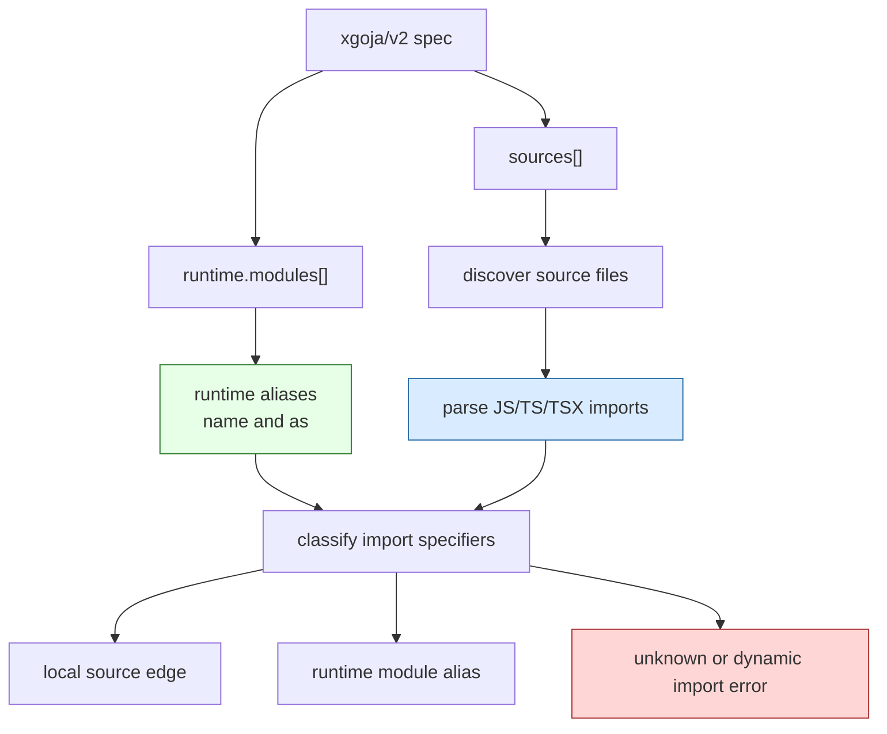
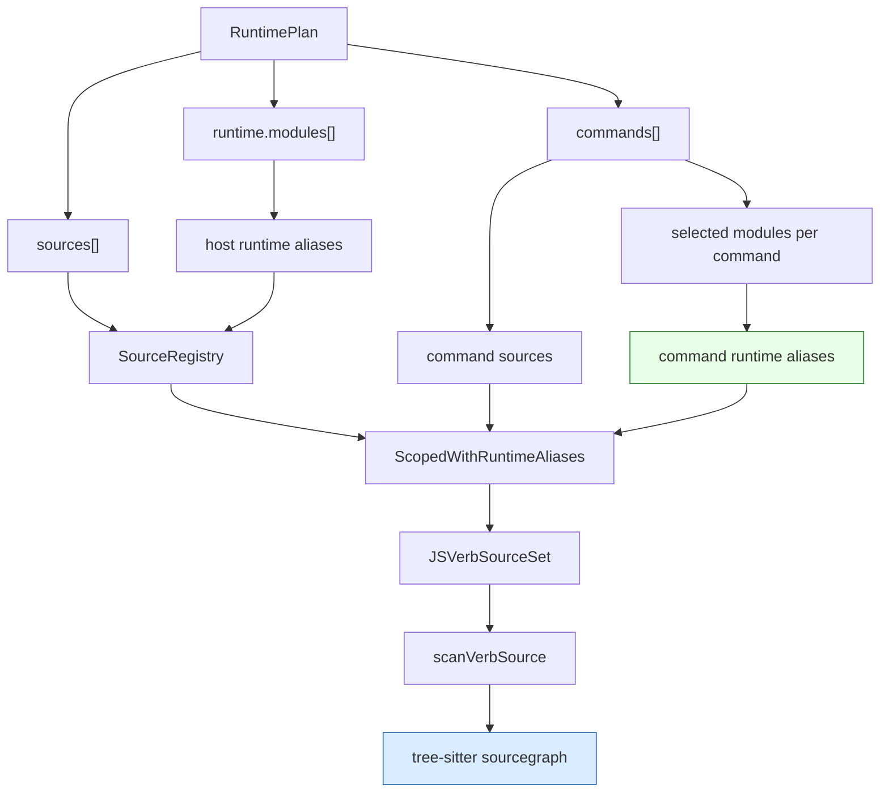

# xgoja Sourcegraph Tree-sitter Import Resolution — A Technical Deep Dive

This article records the xgoja sourcegraph import-resolution work in `go-go-goja`: why regex-based import scanning was not sufficient, how the team compared Goja's parser, esbuild, and tree-sitter, how the final implementation uses tree-sitter JavaScript and TypeScript grammars, and why RuntimePlan alias propagation had to be fixed at the same time. The implementation lives in `/home/manuel/workspaces/2026-06-12/goja-sessionstream/go-go-goja` on branch `task/xgoja-sourcegraph-parser`.

The main ticket is `GOJA-XGOJA-SOURCEGRAPH-PARSER-001`, stored under `go-go-goja/ttmp/2026/06/14/GOJA-XGOJA-SOURCEGRAPH-PARSER-001--replace-xgoja-sourcegraph-regex-import-scanning-with-parser-backed-runtime-alias-resolution/`. The central implementation commit is `bf00208 Add parser-backed xgoja sourcegraph imports`, followed by `744dc6b Diary: record sourcegraph parser implementation` and `8d6d81d Docs: explain xgoja sourcegraph imports`.

> [!summary]
> - **xgoja sourcegraph import extraction moved from regex matching to tree-sitter parsing.** The new implementation parses JavaScript, ESM, TypeScript, and TSX source files and extracts literal import specifiers from concrete syntax tree nodes.
> - **The source graph now rejects non-literal dynamic imports.** A generated xgoja app needs a closed static dependency graph, so `require(["fs", "assets"].join(":"))` is rejected while `require("fs:assets")` is accepted when the runtime alias is selected.
> - **RuntimePlan aliases are now propagated into runtime source scans.** Provider command sets no longer rely on provider-wide default aliases; they receive aliases selected by their command's RuntimePlan modules.
> - **The work produced a broad regression example.** `examples/xgoja/17-sourcegraph-runtime-aliases` combines JS and TS jsverbs, local imports, colon runtime aliases, embedded assets, host FS, HTTP serve, builtin jsverbs, and DTS generation.
> - **The practical rule is simple.** Every source dependency that xgoja must validate should appear as a literal import specifier, and every bare specifier should correspond to a selected runtime module name or alias.

## Why this note exists

xgoja v2 made source sets and runtime modules first-class concepts. A generated app no longer treats JavaScript files as incidental inputs that are copied into a binary. It has a `RuntimePlan` with named `sources[]`, selected `runtime.modules[]`, command-scoped source lists, and artifacts that embed or compile those sources. That model requires xgoja to understand enough of the JavaScript and TypeScript import graph to answer three questions before generation completes:

1. Is this import local to the same source set?
2. Is this import a selected runtime module alias?
3. Is this import an unknown bare specifier that should fail early?

The old implementation answered these questions by extracting import-looking strings with a regular expression. That worked for a narrow set of code patterns. It did not match the semantics of the source language, and it did not provide a reliable basis for sourcegraph validation. The regex could match text inside comments or strings, miss supported import forms, and treat dynamic calls as if they were ordinary static dependencies.

The visible failure was a runtime alias with punctuation:

```js
const assets = require("fs:assets")
```

The generated runtime could expose a host filesystem module under the alias `fs:assets`, but the sourcegraph could reject the same string as an unknown bare specifier in some runtime scan paths. That failure was not only a parser problem. It also revealed that some runtime scans used provider-wide aliases rather than the configured aliases from `runtime.modules[].as`. The durable fix therefore had two parts: parse source code correctly, and pass the correct RuntimePlan aliases into every sourcegraph validation path.

## The role of sourcegraph in xgoja

The sourcegraph package sits between the v2 specification and the generated runtime. It discovers files in configured source sets, reads executable JavaScript-like files, extracts import specifiers, resolves local imports, and classifies runtime imports. Its output is not a bundle. It is a validation graph and file list that later stages use to decide what must be embedded, copied, scanned, or rejected.

The relevant package is:

```text
pkg/xgoja/sourcegraph
```

The central API shape is compact:

```go
func Build(sources []SourceSet, opts Options) (*Graph, error)
func (g *Graph) ResolveImports(readFile func(File) ([]byte, error)) error
func (g *Graph) ImportResolutions(file File) []ImportResolution
```

The graph has a small classification vocabulary:

```go
type ImportKind string

const (
    ImportLocal   ImportKind = "local"
    ImportRuntime ImportKind = "runtime"
    ImportUnknown ImportKind = "unknown"
)
```

A resolved local import records a target source file. A resolved runtime import records an alias. Unknown bare imports fail before generation proceeds.



The important architectural point is that sourcegraph validates what the generated binary will be able to execute. If a source file imports `./helper`, that helper must exist inside the source set. If it imports `express`, the runtime must select an `express` module. If it imports `fs:assets`, the runtime must select a module with `as: fs:assets`. The graph is the place where those facts are checked together.

## The regex implementation and its limitations

Before this work, sourcegraph used a single regular expression:

```go
var importRE = regexp.MustCompile(
    `(?m)(?:import\s+(?:[^"']+\s+from\s+)?|require\()\s*["']([^"']+)["']`,
)
```

This expression encoded a partial view of JavaScript syntax. It could find simple patterns such as:

```js
import x from "./x"
const fs = require("fs:assets")
```

It did not represent the language grammar. Source files can import dependencies through side-effect imports, export-from declarations, literal dynamic imports, TypeScript import types, TSX files, and CommonJS calls. A regex-based scanner has to approximate each form manually. It also has no syntactic context, so it cannot reliably tell whether an import-looking string appears in executable code, in a comment, or as data inside a string literal.

The specific failure modes were:

| Source form | Why regex is insufficient |
| --- | --- |
| `import "./setup"` | Side-effect imports do not have a `from` clause. |
| `export { x } from "./x"` | Export declarations also create sourcegraph dependencies. |
| `await import("./dynamic")` | Literal dynamic imports are static enough to validate but have a different syntax node. |
| `require(["fs", "assets"].join(":"))` | Non-literal dynamic requires should not be converted into a fake static edge. |
| `const s = "require('x')"` | Import-looking text inside a string should not create an edge. |
| `import type { T } from "./types"` | TypeScript-specific syntax should parse as TypeScript, not as invalid JavaScript. |
| `.tsx` files | JSX and TypeScript syntax must be handled by the right grammar. |

The regex was not the only issue. Runtime scan paths also needed correct aliases. The sourcegraph could only accept `fs:assets` if it received `fs:assets` as an allowed runtime alias. A provider may expose a module named `fs`, but the configured runtime can mount it under `fs:assets` or `fs:host`. The configured alias is the value source files import.

## The parser comparison

The ticket preserved four experiments under:

```text
go-go-goja/ttmp/2026/06/14/GOJA-XGOJA-SOURCEGRAPH-PARSER-001--.../scripts
```

Those experiments compared three possible parser strategies.

### Goja parser

The Goja parser is already used elsewhere in `go-go-goja`, especially in `pkg/jsparse`. It can parse ordinary Goja-compatible JavaScript and produce an AST. It was worth testing first because it is already part of the runtime ecosystem.

The experiment showed that Goja parses CommonJS calls:

```text
"const x = require(\"fs:assets\");" -> <nil>
```

But it rejects ESM and dynamic import syntax:

```text
"import assets from \"fs:assets\";"   -> Unexpected reserved word
"import \"./setup.js\";"              -> Unexpected reserved word
"export { x } from \"./x.js\";"       -> Unexpected reserved word
"const x = await import(\"./x.js\");" -> Unexpected reserved word
```

That made Goja's parser unsuitable as the sole sourcegraph parser. It could help with CommonJS, but xgoja source sets include JavaScript and TypeScript modules that use modern import syntax.

### Esbuild

Esbuild does not expose a public AST parser API. Its public Go API exposes `Build`, `Transform`, and `Context`. A no-write `api.Build` call with `Bundle: true` and `Metafile: true` can be used as an import collector if runtime aliases are marked external.

The experiment produced useful data. Without externals, esbuild rejected runtime aliases:

```text
ERR: Could not resolve "fs:assets"
ERR: Could not resolve "express"
```

With externals configured, it recorded import edges:

```text
path="fs:assets" kind=require-call external=true
path="express" kind=require-call external=true
path="./dynamic.js" kind=dynamic-import external=false
```

For TypeScript it handled ESM syntax and external aliases correctly:

```text
path="fs:assets" kind=import-statement external=true
path="./more.js" kind=import-statement external=false
```

Esbuild was a viable solution, especially for TypeScript. The drawback was that sourcegraph would have to invoke a build-oriented resolver and then reinterpret a metafile back into xgoja's sourcegraph semantics. Sourcegraph does not need bundling, tree shaking, code transformation, or package resolution. It needs syntactic import extraction and xgoja-specific classification.

### Tree-sitter JavaScript

The repository already depended on tree-sitter for JavaScript analysis:

```text
github.com/tree-sitter/go-tree-sitter
github.com/tree-sitter/tree-sitter-javascript
```

The JavaScript grammar parsed and extracted the forms that Goja rejected:

```text
require("fs:assets")           -> fs:assets
import assets from "fs:assets" -> fs:assets
import "./setup.js"            -> ./setup.js
export { x } from "./x.js"     -> ./x.js
await import("./x.js")         -> ./x.js
```

It also avoided false positives in string literals and comments:

```js
const s = "require('not-real')"; // import "also-not-real"
```

No import edge should come from that source. Tree-sitter gives the scanner node kinds and field names, so the collector can distinguish a `string` node under an `arguments` node from a string literal used as ordinary data.

### Tree-sitter TypeScript and TSX

The decisive experiment added `github.com/tree-sitter/tree-sitter-typescript@v0.23.2` in a temporary module. The package exposes:

```go
LanguageTypescript()
LanguageTSX()
```

The TypeScript grammar parsed the source without errors and extracted the expected static imports:

```text
hasError=false
import type { Thing } from "./types" -> ./types
import { helper } from "./helper"    -> ./helper
import assets from "fs:assets"       -> fs:assets
export { more } from "./more"        -> ./more
await import("./dynamic")            -> ./dynamic
require("fs:host")                   -> fs:host
require(["fs", "assets"].join(":")) -> dynamic=true
```

The TSX grammar also parsed JSX/TSX source without errors:

```text
hasError=false
react
fs:assets
./Widget
```

This result made tree-sitter the best fit. It provides the syntactic structure sourcegraph needs without invoking a bundler. It supports the JavaScript, TypeScript, and TSX source shapes xgoja expects. It also lets sourcegraph reject non-literal dynamic imports deliberately.

## The implemented parser

The implementation lives in:

```text
pkg/xgoja/sourcegraph/imports.go
```

The scanner is intentionally small. It does not try to understand every JavaScript expression. It extracts only the syntactic forms that can contribute static import edges.

```go
type importSpec struct {
    Specifier string
    Kind      string
    Dynamic   bool
}
```

`Specifier` is the literal import string, such as `./helper` or `fs:assets`. `Kind` records where the edge came from, such as `import`, `export`, `require`, or `import` for dynamic import calls. `Dynamic` marks a call where sourcegraph saw `require(...)` or `import(...)` but the first argument was not a string literal.

The parser chooses a grammar by extension:

```go
func languageForPath(filename string) *tree_sitter.Language {
    switch strings.ToLower(path.Ext(filename)) {
    case ".ts", ".mts", ".cts":
        return tree_sitter.NewLanguage(tree_sitter_typescript.LanguageTypescript())
    case ".tsx":
        return tree_sitter.NewLanguage(tree_sitter_typescript.LanguageTSX())
    default:
        return tree_sitter.NewLanguage(tree_sitter_javascript.Language())
    }
}
```

The collector rejects syntax errors before collecting imports:

```go
if root.HasError() {
    return nil, fmt.Errorf("parse %s: syntax errors while collecting imports", filename)
}
```

This is a design choice. Sourcegraph validation should not silently continue after parsing an executable source file with syntax errors. A generated binary should fail at plan/build time rather than embed a source set whose dependency graph is unknown.

The collector walks named CST nodes and handles exactly three cases:

```go
switch n.Kind() {
case "import_statement":
    if specifier, ok := staticSourceField(n, source); ok {
        add(importSpec{Kind: "import", Specifier: specifier})
    }
case "export_statement":
    if specifier, ok := staticSourceField(n, source); ok {
        add(importSpec{Kind: "export", Specifier: specifier})
    }
case "call_expression":
    // require("...") or import("...")
}
```

For import and export declarations, tree-sitter exposes the source string as a field named `source`. The scanner only reads that field:

```go
func staticSourceField(n *tree_sitter.Node, source []byte) (string, bool) {
    sourceNode := n.ChildByFieldName("source")
    if sourceNode == nil || sourceNode.Kind() != "string" {
        return "", false
    }
    return unquoteTreeSitterString(sourceNode.Utf8Text(source)), true
}
```

For call expressions, the scanner checks the function node and the first argument:

```go
fn := n.ChildByFieldName("function")
fnText := strings.TrimSpace(fn.Utf8Text(source))
if fnText != "require" && fnText != "import" {
    return
}
args := n.ChildByFieldName("arguments")
if specifier, ok := firstArgumentStringLiteral(args, source); ok {
    add(importSpec{Kind: fnText, Specifier: specifier})
    return
}
add(importSpec{Kind: fnText, Dynamic: true})
```

This distinction is important. In this source:

```js
require(["fs", "assets"].join(":"))
```

there are string literals in the syntax tree, but none of them is the first argument string literal to `require`. The import specifier is not statically known. The scanner therefore records a dynamic import rather than incorrectly inferring `fs` or `assets` as dependencies.

## Resolution after parsing

Parsing produces `importSpec` values. Resolution still happens in `graph.go`. This separation keeps responsibilities clear: `imports.go` understands syntax, and `graph.go` understands xgoja sourcegraph semantics.

The updated resolution path is:

```go
func (g *Graph) resolveFileImports(file File, contents string) ([]ImportResolution, error) {
    imports, err := parseImports(file.Path, []byte(contents))
    if err != nil {
        return nil, err
    }
    out := make([]ImportResolution, 0, len(imports))
    for _, imp := range imports {
        if imp.Dynamic {
            return nil, fmt.Errorf("%s contains dynamic non-literal %s import", file.Path, imp.Kind)
        }
        specifier := imp.Specifier
        // local, runtime alias, or error
    }
    return out, nil
}
```

Local imports are resolved inside the same source set. Sourcegraph checks common JavaScript and TypeScript extensions and index files:

```go
for _, ext := range []string{".ts", ".tsx", ".mts", ".cts", ".js", ".jsx", ".mjs", ".cjs"} {
    candidates = append(candidates, base+ext)
}
for _, index := range []string{"index.ts", "index.tsx", "index.js", "index.jsx"} {
    candidates = append(candidates, path.Join(base, index))
}
```

Bare imports are accepted only when they match configured runtime aliases:

```go
if g.aliases[specifier] {
    out = append(out, ImportResolution{
        From: file.Path,
        Specifier: specifier,
        Kind: ImportRuntime,
        Alias: specifier,
    })
    continue
}
return nil, fmt.Errorf("%s imports unknown bare specifier %q", file.Path, specifier)
```

This means the following source code is valid only if `fs:assets` appears in the graph's runtime alias set:

```js
const assets = require("fs:assets")
```

That runtime alias set is the second half of the work.

## RuntimePlan alias propagation

The original user-visible failure happened in a generated app that had this runtime configuration:

```yaml
runtime:
  modules:
    - provider: go-go-goja-host
      name: fs
      as: fs:assets
      config:
        embedded:
          allow: true
          mounts:
            - asset: web-assets
              mount: /app
```

JavaScript source imported the selected alias:

```js
const assets = require("fs:assets")
```

The planner already knows the alias, and `Plan.RuntimeAliases` includes it. But runtime source scans in provider command-set paths used provider-wide capabilities in some places. Provider-wide capabilities can tell us that a provider has a module named `fs`. They cannot tell us that this generated app selected the alias `fs:assets` for a particular command.

The fix added runtime aliases to `SourceRegistry`:

```go
type SourceRegistry struct {
    providers       *providerapi.ProviderRegistry
    embeddedJSVerbs fs.FS
    sources         []SourcePlan
    runtimeAliases  []string
}
```

The host-level registry receives aliases from all runtime modules:

```go
sourceRegistry := NewSourceRegistryWithRuntimeAliases(
    providers,
    opts.EmbeddedJSVerbs,
    runtimePlan.allSources(),
    runtimePlanModuleAliases(runtimePlan.runtimeModules()),
)
```

Provider command sets get a scoped registry with aliases from the modules selected by that command:

```go
selected, err := h.selectedModulesForCommandProvider(instance)
sourceRegistry := h.SourceRegistry.ScopedWithRuntimeAliases(instance.Sources, moduleAliases(selected))
```

Then `SourceRegistry.JSVerbs()` passes those aliases into the jsverb source set:

```go
func (r *SourceRegistry) JSVerbs() providerapi.JSVerbSourceSet {
    return newJSVerbSourceSet(
        r.providers,
        r.embeddedJSVerbs,
        filterSourcesByKind(r.sources, SourceKindJSVerbs),
        r.runtimeAliases,
    )
}
```

This preserves the v2 command-scoping model. A command sees only the sources it declares and only the runtime aliases selected for that command's module set. There is no ambient grant of every possible provider alias.



## The regression example

A new example was added under:

```text
examples/xgoja/17-sourcegraph-runtime-aliases
```

The example is deliberately broad. It is not a minimal unit test. It is a generated-app smoke test that exercises the full path from v2 spec to generated binary to runtime source scanning.

It includes:

- JavaScript jsverbs with `require("./helper.js")`.
- TypeScript jsverbs with `import { format } from "./format"`.
- Literal colon aliases such as `require("fs:assets")`.
- Embedded assets served through the host `fs` provider alias `fs:assets`.
- Express HTTP serving through the `go-go-goja-http` provider command set.
- Builtin `verbs` command execution.
- Provider-backed `serve` command execution.
- A generated DTS artifact.

The key runtime fragment is:

```yaml
runtime:
  modules:
    - provider: go-go-goja-host
      name: fs
      as: fs:assets
      config:
        embedded:
          allow: true
          mounts:
            - asset: web-assets
              mount: /app
    - provider: go-go-goja-http
      name: express
sources:
  - id: js-site
    kind: jsverbs
    from:
      dir: ./verbs-js
  - id: ts-tools
    kind: jsverbs
    from:
      dir: ./verbs-ts
    language: typescript
    compile:
      mode: runtime
      bundle: true
  - id: web-assets
    kind: assets
    from:
      dir: ./assets
```

The JavaScript route source uses literal aliases and local imports:

```js
const express = require("express")
const assets = require("fs:assets")
const { decorate } = require("./helper.js")
```

The TypeScript source also imports a local helper and runtime aliases:

```ts
import { format } from "./format"

const assets = require("fs:assets")
const express = require("express")
```

The smoke target validates the generated app as a binary:

```makefile
smoke: doctor build builtin-smoke serve-smoke prove-self-contained
```

The smoke covers three properties that unit tests alone do not cover:

1. The generated binary can be built from the v2 spec.
2. Runtime source scans inside provider commands accept literal aliases.
3. The binary can run away from the original source tree, proving assets and jsverb sources were embedded as intended.

## The test suite

The sourcegraph tests now cover the grammar and resolution properties that motivated the change.

The colon alias regression is explicit:

```go
writeFile(t, filepath.Join(root, "site.js"), `const assets = require("fs:assets")
import db from "db:readonly"
`)

graph, err := Build(..., Options{
    RuntimeModuleAliases: []string{"fs:assets", "db:readonly"},
})
```

The parser-backed coverage includes TypeScript, TSX, side-effect imports, export-from imports, literal dynamic imports, and string/comment false positives:

```ts
import type { Thing } from "./types"
import { helper } from "./helper"
import assets from "fs:assets"
import "./setup"
export { more } from "./more"
const dynamic = await import("./dynamic")
const commented = "require('not-real')" // import "also-not-real"
export const View = () => <section>{helper}</section>
```

The expected resolutions are:

| Import | Resolution |
| --- | --- |
| `./types` | local `types.ts` |
| `./helper` | local `helper.ts` |
| `fs:assets` | runtime alias |
| `./setup` | local `setup.ts` |
| `./more` | local `more.ts` |
| `./dynamic` | local `dynamic.ts` |

The false positives do not appear in the resolution list. This is the essential difference between parsing and string matching: sourcegraph now reads the syntax tree, not arbitrary text.

The dynamic import diagnostic is also tested:

```go
writeFile(t, filepath.Join(root, "site.js"), `const assets = require(["fs", "assets"].join(":"))`)
err = graph.ResolveImports(readSourceFile)
if err == nil || !strings.Contains(err.Error(), "dynamic non-literal require import") {
    t.Fatalf("expected dynamic import error, got %v", err)
}
```

## User-facing source rules

The xgoja v2 reference now documents static import graph validation. The rule is not specific to tree-sitter; it follows from the generated-app model.

Executable source sets are parsed during planning so xgoja can validate local helper imports and runtime module aliases before generating a binary. Accepted static forms include:

```js
const assets = require("fs:assets")
import express from "express"
import "./setup"
export { helper } from "./helper"
await import("./dynamic")
```

Bare specifiers must match a selected `runtime.modules[].name` or `runtime.modules[].as` alias. Aliases may contain punctuation such as `fs:assets`. Source files should use the literal alias. A dynamic expression hides the dependency from the graph and is rejected:

```js
// Avoid: sourcegraph cannot validate this dependency statically.
require(["fs", "assets"].join(":"))
```

This rule improves generated-app reliability. A generated binary should not rely on a runtime import that the planner never saw. If a dependency is part of the source graph, it should be visible as syntax.

## Validation

The focused validation suite passed:

```bash
go test ./cmd/xgoja/internal/plan ./pkg/xgoja/sourcegraph ./pkg/xgoja/app ./pkg/xgoja/providers/http -count=1
```

The broader xgoja validation passed:

```bash
go test ./cmd/xgoja/internal/... ./cmd/xgoja ./pkg/xgoja/... -count=1
```

The generated example smoke passed:

```bash
make -C examples/xgoja/17-sourcegraph-runtime-aliases smoke
```

The pre-commit and pre-push hooks also ran lint, `go generate ./...`, and `go test ./...`. One important failure occurred before the final commit: the copied experiment scripts in the ticket directory were all `package main` files in the same directory, so `go test ./...` saw multiple `main` declarations. The fix was to add `//go:build ignore` to the standalone experiment scripts. They remain runnable with `go run path/to/script.go`, but they are excluded from package builds.

The sourcegraph PR is open as:

```text
https://github.com/go-go-golems/go-go-goja/pull/77
```

## Design consequences

The implementation has several consequences that matter for future xgoja work.

First, sourcegraph is now a syntax-aware validation layer. It should remain focused on import extraction and xgoja classification. It should not become a bundler, type checker, or package manager. TypeScript compilation still belongs to the TypeScript runtime compile path. Sourcegraph needs only enough syntax to build the dependency graph.

Second, RuntimePlan is the only correct source of configured aliases. Provider capabilities describe what modules a provider can offer. RuntimePlan modules describe what this generated app selected and how source files should import those modules. The distinction matters whenever aliases are renamed or scoped per command.

Third, dynamic import policy is now explicit. Literal dynamic imports are accepted because the dependency is visible. Non-literal dynamic imports are rejected because sourcegraph cannot validate the dependency. If future xgoja modes need dynamic runtime imports, they should introduce an explicit opt-in policy rather than weakening generated-app validation by default.

Fourth, examples should cover integration paths, not only library-level functions. The sourcegraph bug appeared in a generated HTTP serve command, not in a standalone parser call. The `17-sourcegraph-runtime-aliases` example is valuable because it exercises planner, generator, embedded assets, runtime module aliases, provider command sets, JS source scanning, TypeScript source scanning, and self-contained binary behavior in one place.

## Working rules

The work suggests a stable set of engineering rules for xgoja source handling:

- Treat source files as syntax, not text. Use parsers for dependency extraction whenever the result affects generated runtime behavior.
- Keep parsing and resolution separate. Parser code should extract import specs; sourcegraph resolution should decide local/runtime/unknown classification.
- Validate runtime imports against configured RuntimePlan aliases. Provider capability aliases are not a substitute for selected module aliases.
- Reject non-literal dynamic imports in generated-app sourcegraph validation. A generated binary should not contain hidden dependencies.
- Test parser behavior with real syntax forms. Include ESM, CommonJS, TypeScript, TSX, side-effect imports, export-from imports, literal dynamic imports, comments, and strings.
- Include at least one generated-binary smoke test for sourcegraph changes. Parser unit tests cannot prove command-provider runtime scans receive the right alias set.

## Related files and tickets

| Path | Role |
| --- | --- |
| `pkg/xgoja/sourcegraph/imports.go` | Tree-sitter-backed import collector. |
| `pkg/xgoja/sourcegraph/graph.go` | Sourcegraph resolution and dynamic import diagnostics. |
| `pkg/xgoja/sourcegraph/graph_test.go` | Parser-backed sourcegraph regression coverage. |
| `pkg/xgoja/app/source_registry.go` | Runtime alias propagation into source scans. |
| `pkg/xgoja/app/command_providers.go` | Command-selected aliases for provider command source registries. |
| `pkg/xgoja/app/jsverb_sources.go` | JSVerb source scans receive runtime aliases from `SourceRegistry`. |
| `cmd/xgoja/internal/plan/plan_test.go` | Planner coverage for configured `runtime.modules[].as` aliases. |
| `examples/xgoja/17-sourcegraph-runtime-aliases` | Broad generated-app regression example. |
| `cmd/xgoja/doc/17-xgoja-v2-reference.md` | User-facing static import graph rules. |
| `ttmp/2026/06/14/GOJA-XGOJA-SOURCEGRAPH-PARSER-001--...` | Design, diary, experiments, tasks, and changelog. |

This work is a continuation of the xgoja v2 RuntimePlan cutover. The RuntimePlan cutover made sources and runtime modules explicit. The tree-sitter sourcegraph work makes the import graph precise enough to enforce that model for JavaScript and TypeScript source files.
