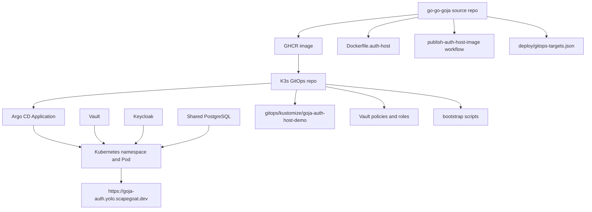
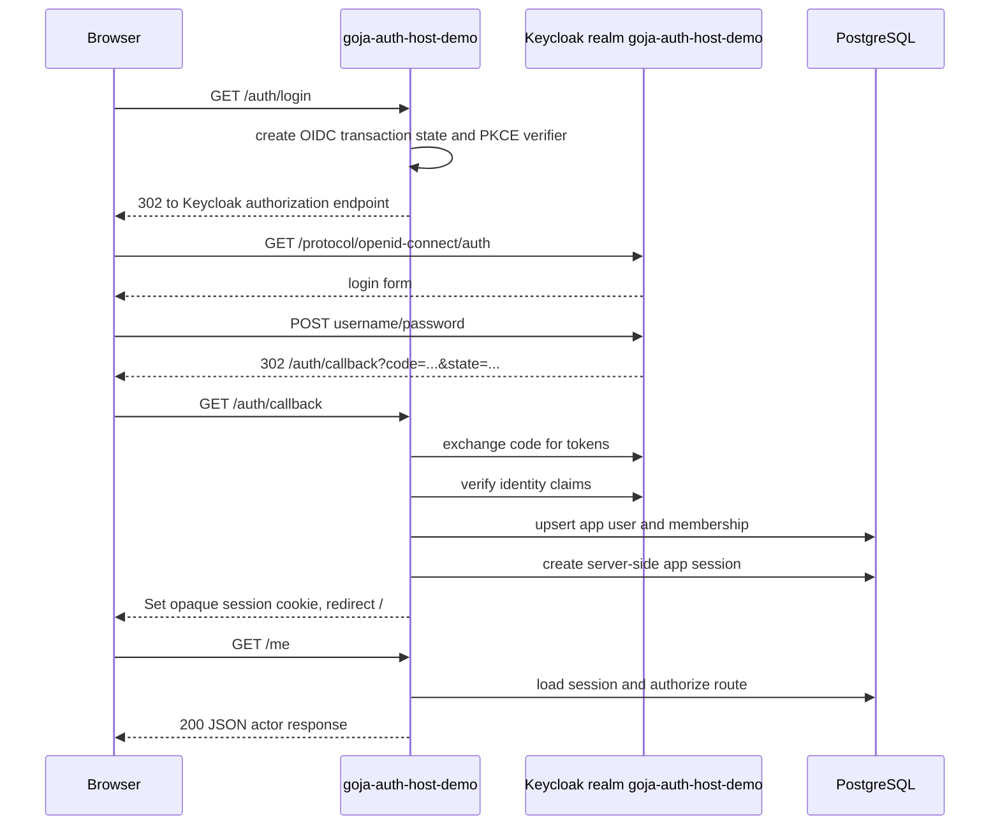

# xgoja Keycloak Auth Host — Production Deployment Deep Dive

This report explains how the `go-go-goja` Keycloak-backed HTTP auth host was taken from an example directory to a running HTTPS service on the `yolo.scapegoat.dev` K3s cluster. The result is live at `https://goja-auth.yolo.scapegoat.dev`, uses the real cluster Keycloak server, stores runtime secrets through Vault Secrets Operator, persists auth data in shared PostgreSQL, and is reconciled by Argo CD.

The purpose of the report is not to record every command that was typed. The purpose is to explain the technical system that now exists: why each boundary exists, how the pieces depend on each other, where the first rollout failed, and what a future generated `xgoja serve` OIDC implementation should learn from this temporary deployment.

> [!summary]
> The temporary deployment is live and validated. `goja-auth-host-demo` runs from `ghcr.io/go-go-golems/go-goja-auth-host:sha-ba77afc`, authenticates through `https://auth.yolo.scapegoat.dev/realms/goja-auth-host-demo`, reads secrets from Vault/VSO, uses shared PostgreSQL for sessions and auth stores, and passes the public Keycloak smoke test.
>
> The most important engineering lesson is that deployment is a contract across source code, image metadata, GitOps manifests, Vault paths, Keycloak realm state, and Argo CD reconciliation. Each layer must agree on names, URLs, secret keys, and command arguments.

## Current deployed state

The live deployment now has the following shape:

```text
Public URL:          https://goja-auth.yolo.scapegoat.dev
Argo CD app:         goja-auth-host-demo
Namespace:           goja-auth-host-demo
Image:               ghcr.io/go-go-golems/go-goja-auth-host:sha-ba77afc
Keycloak issuer:     https://auth.yolo.scapegoat.dev/realms/goja-auth-host-demo
Keycloak client:     goja-auth-host-demo
Redirect URI:        https://goja-auth.yolo.scapegoat.dev/auth/callback
Vault runtime path:  kv/apps/goja-auth-host-demo/prod/runtime
Vault pull path:     kv/apps/goja-auth-host-demo/prod/image-pull
Database:            goja_auth_host_demo
Database role:       goja_auth_host_demo_app
```

The public smoke test completed the full browser-oriented flow:

```text
ok public health                200
ok async return                 200
ok async send                   200
ok me before login              401
ok login page                   200
ok keycloak form login          200
ok login redirected to host     https://goja-auth.yolo.scapegoat.dev/
ok me after login               200
ok session after login          200
ok project missing csrf         403
ok project update               200
ok project missing              404
ok invite issue                 200
ok invite accept                200
ok invite accept reused         409
ok logout                       204
ok me after logout              401
```

The final smoke result was:

```json
{"status":"PASS","actorId":"user:dc900749-ba1e-4af7-adae-7d3489dd080a","csrfChecked":true,"inviteChecked":true}
```

The demo user exists in Keycloak. The username is `demo-user`. The password is intentionally stored in Vault rather than in documentation:

```bash
export VAULT_ADDR=https://vault.yolo.scapegoat.dev
export VAULT_TOKEN="$(cat ~/.vault-token)"
vault kv get -field=demo_password kv/apps/goja-auth-host-demo/prod/runtime
```

## Why this deployment exists

`go-go-goja` can embed a JavaScript runtime into Go and expose HTTP route construction through the `express` module. The auth subsystem adds planned routes, CSRF enforcement, server-side sessions, app authorization, audit logging, and capability tokens. The repository already had enough code to run a Keycloak-backed auth host locally in `examples/xgoja/19-express-keycloak-auth-host`. It did not have the production path needed to run that host on the cluster.

The important distinction is between route intent and host infrastructure.

JavaScript declares route intent. A route script can say that `PATCH /orgs/o1/projects/p1` needs a project resource, a role check, CSRF, and audit logging. It does not create the Keycloak client. It does not open a PostgreSQL connection. It does not decide whether cookies are secure. Those responsibilities belong to the Go host and the deployment environment.

The Go host provides infrastructure. It mounts the Express module, owns the `http.ServeMux`, constructs `gojahttp.NewHost`, wires the auth stores, registers the OIDC login/callback/logout handlers, and serves health probes. Kubernetes then gives that host a network identity, secrets, a database DSN, TLS ingress, and a reconciliation loop.

The production work was therefore not a single code change. It was a deployment contract across several systems.

## The six-system deployment contract

The working system crosses six boundaries. Each boundary has a different source of truth and a different failure mode.



The contracts are concrete:

| Boundary | Source of truth | Contract |
| --- | --- | --- |
| Source repo to image | `Dockerfile.auth-host` | Build `./examples/xgoja/19-express-keycloak-auth-host/cmd/host` and copy `scripts/server.js` into `/app/server.js`. |
| Image to GitOps | `deploy/gitops-targets.json` and the GitOps deployment manifest | The image tag in Kubernetes must match a pushed GHCR tag. |
| GitOps to cluster | `gitops/applications/goja-auth-host-demo.yaml` and `gitops/kustomize/goja-auth-host-demo/` | Argo renders and applies the namespace, VSO resources, Job, Deployment, Service, and Ingress. |
| Vault to Pod | `VaultStaticSecret` resources and Vault KV paths | The Kubernetes Secret must contain `dsn`, `public_base_url`, `keycloak_issuer`, `keycloak_client_id`, and `keycloak_client_secret`. |
| Keycloak to Pod | Keycloak realm/client state | The issuer, client ID, client secret, and redirect URI must match the host's public URL. |
| PostgreSQL to auth stores | DB bootstrap Job and runtime DSN | The database and role must exist before the app starts applying auth-store schemas. |

This is the central operational invariant:

```text
A running auth host requires agreement between public URL, Keycloak redirect URI,
Vault runtime secret keys, PostgreSQL DSN, image ENTRYPOINT, Kubernetes args,
and Argo target revision.
```

If one field drifts, the system may still build and deploy, but authentication will fail at runtime.

## Source repository changes

The source-side implementation stayed intentionally close to example 19. It did not promote the example into a new top-level `cmd/goja-auth-host` command. Instead, the temporary deployment builds directly from:

```text
/home/manuel/workspaces/2026-06-12/goja-express-auth/go-go-goja/examples/xgoja/19-express-keycloak-auth-host/cmd/host
```

That choice kept the deployment scoped while still proving the production stack. The source changes made example 19 operationally usable rather than merely demonstrative.

### Glazed command surface

The host was converted from raw flag parsing to a Glazed root with a `serve` subcommand. The deployed program now exposes environment-backed settings for the values Kubernetes supplies through secrets:

| Setting | Environment variable | Production value source |
| --- | --- | --- |
| `--listen` | `LISTEN_ADDR` | Deployment args (`:8080`) |
| `--script` | `SCRIPT_PATH` | Deployment args (`/app/server.js`) |
| `--issuer` | `KEYCLOAK_ISSUER` | Vault runtime secret |
| `--client-id` | `KEYCLOAK_CLIENT_ID` | Vault runtime secret |
| `--client-secret` | `KEYCLOAK_CLIENT_SECRET` | Vault runtime secret |
| `--public-base-url` | `PUBLIC_BASE_URL` | Vault runtime secret |
| `--redirect-url` | `KEYCLOAK_REDIRECT_URL` | optional override |
| `--session-db-dsn` | `SESSION_DB_DSN` | Vault runtime secret `dsn` |
| `--audit-db-dsn` | `AUDIT_DB_DSN` | Vault runtime secret `dsn` |
| `--app-db-dsn` | `APPAUTH_DB_DSN` | Vault runtime secret `dsn` |
| `--capability-db-dsn` | `CAPABILITY_DB_DSN` | Vault runtime secret `dsn` |

The `public-base-url` setting is the most important production field. The program listens on `:8080` inside the Pod, but the browser-visible origin is `https://goja-auth.yolo.scapegoat.dev`. OIDC callback URLs must be derived from the browser-visible origin, not from the listen address.

The redirect resolution logic enforces that invariant:

```go
func resolveRedirectURL(settings serveSettings) (string, error) {
    if redirectURL := strings.TrimSpace(settings.RedirectURL); redirectURL != "" {
        return redirectURL, requireAllowedURLScheme(redirectURL, settings.AllowInsecureHTTP)
    }
    publicBase := strings.TrimRight(strings.TrimSpace(settings.PublicBaseURL), "/")
    if publicBase == "" {
        return "", errors.New("public-base-url or redirect-url is required")
    }
    if err := requireAllowedURLScheme(publicBase, settings.AllowInsecureHTTP); err != nil {
        return "", err
    }
    return publicBase + "/auth/callback", nil
}
```

The production rule is strict: HTTPS is required unless `--allow-insecure-http=true` is explicitly set for localhost development. That prevents a cluster deployment from accidentally producing insecure cookies or non-HTTPS redirect URLs.

### Host composition

The host composition follows the existing example 19 design. It creates the four auth store subsystems, discovers the Keycloak provider, mounts the JavaScript route declarations, and then serves through a standard library `http.Server`.

The important Go call graph is:

```text
serve command
  -> decode Glazed settings
  -> resolve redirect URL
  -> newAppStore(Postgres or memory)
  -> newCapabilityService(Postgres or memory)
  -> newSessionManager(Postgres or memory)
  -> newAuditSink(Postgres or log sink)
  -> keycloakauth.New(...)
  -> gojahttp.NewHost(HostOptions{Auth: ...})
  -> engine.NewRuntimeFactoryBuilder().WithModules(express.NewRegistrar(host))
  -> run /app/server.js inside goja.Runtime
  -> register /auth/login, /auth/callback, /auth/logout, /auth/session
  -> serveWithShutdown(http.Server)
```

The host uses `gojahttp.NewHost` with these auth responsibilities:

```go
host := gojahttp.NewHost(gojahttp.HostOptions{
    Dev:             true,
    RejectRawRoutes: true,
    Auth: gojahttp.AuthOptions{
        Authenticator: sessions,
        CSRF:          sessions,
        Resources:     appauth.Resolver{Store: appStores.store},
        Authorizer:    appauth.Authorizer{Memberships: appStores.store},
        Audit:         auditSink,
    },
})
```

This code is the boundary between the JavaScript route plan and the Go enforcement layer. JavaScript declares that a route needs authentication, CSRF, a resource, a role, and an audit entry. The Go host owns the implementations that satisfy those requirements.

### Signal-aware server lifecycle

The first local smoke runs completed the authentication flow, but cleanup had to kill the host process because `ListenAndServe` did not shut down after SIGTERM. The final host uses a bounded graceful shutdown helper:

```go
func serveWithShutdown(ctx context.Context, server *http.Server) error {
    serveCtx, stop := signal.NotifyContext(ctx, os.Interrupt, syscall.SIGTERM)
    defer stop()

    errCh := make(chan error, 1)
    go func() {
        if err := server.ListenAndServe(); err != nil && !errors.Is(err, http.ErrServerClosed) {
            errCh <- err
            return
        }
        errCh <- nil
    }()

    select {
    case err := <-errCh:
        return err
    case <-serveCtx.Done():
    }

    shutdownCtx, cancel := context.WithTimeout(context.Background(), 5*time.Second)
    defer cancel()
    if err := server.Shutdown(shutdownCtx); err != nil {
        return err
    }
    return <-errCh
}
```

This is production behavior, not a local convenience. Kubernetes terminates Pods with SIGTERM. A server that ignores SIGTERM can produce slow rollouts, noisy smoke tests, and delayed cleanup. The same fix was applied to sibling example HTTP servers that used direct `ListenAndServe` calls.

### Container image

The temporary image is built by `Dockerfile.auth-host`:

```dockerfile
FROM golang:1.26-bookworm AS builder
WORKDIR /src

COPY go.mod go.sum ./
RUN go mod download

COPY . .
RUN CGO_ENABLED=0 go build -ldflags="-s -w" -o /out/goja-auth-host ./examples/xgoja/19-express-keycloak-auth-host/cmd/host

FROM gcr.io/distroless/static-debian12:nonroot
WORKDIR /app
COPY --from=builder /out/goja-auth-host /app/goja-auth-host
COPY examples/xgoja/19-express-keycloak-auth-host/scripts/server.js /app/server.js

EXPOSE 8080
ENTRYPOINT ["/app/goja-auth-host", "serve"]
CMD ["--listen", ":8080", "--script", "/app/server.js"]
```

The ENTRYPOINT choice mattered during deployment. Since `serve` is already part of ENTRYPOINT, Kubernetes must not pass `serve` again in `args`. The first live Pod did exactly that and crashed with:

```text
Too many arguments
Error: Too many arguments
```

The fix was to make Kubernetes pass only flags:

```yaml
args:
  - --listen
  - :8080
  - --script
  - /app/server.js
```

This is now a documented deployment rule for this image.

## GitOps and Kubernetes runtime

The K3s GitOps package lives in:

```text
/home/manuel/code/wesen/2026-03-27--hetzner-k3s/gitops/kustomize/goja-auth-host-demo/
```

The package contains:

```text
namespace.yaml
serviceaccount.yaml
db-bootstrap-serviceaccount.yaml
vault-connection.yaml
vault-auth.yaml
db-bootstrap-vault-auth.yaml
runtime-secret.yaml
image-pull-secret.yaml
postgres-admin-secret.yaml
db-bootstrap-script-configmap.yaml
db-bootstrap-job.yaml
deployment.yaml
service.yaml
ingress.yaml
```

The `kustomization.yaml` orders all of these resources as a single package:

```yaml
namespace: goja-auth-host-demo
resources:
  - namespace.yaml
  - serviceaccount.yaml
  - db-bootstrap-serviceaccount.yaml
  - vault-connection.yaml
  - vault-auth.yaml
  - db-bootstrap-vault-auth.yaml
  - runtime-secret.yaml
  - image-pull-secret.yaml
  - postgres-admin-secret.yaml
  - db-bootstrap-script-configmap.yaml
  - db-bootstrap-job.yaml
  - deployment.yaml
  - service.yaml
  - ingress.yaml
```

The Deployment reads the same runtime Secret into each component that needs the database:

```yaml
- name: SESSION_DB_DSN
  valueFrom:
    secretKeyRef:
      name: goja-auth-host-demo-runtime
      key: dsn
- name: AUDIT_DB_DSN
  valueFrom:
    secretKeyRef:
      name: goja-auth-host-demo-runtime
      key: dsn
- name: APPAUTH_DB_DSN
  valueFrom:
    secretKeyRef:
      name: goja-auth-host-demo-runtime
      key: dsn
- name: CAPABILITY_DB_DSN
  valueFrom:
    secretKeyRef:
      name: goja-auth-host-demo-runtime
      key: dsn
```

This is acceptable for the demo because all four store families can share one application database and role. The Go process still constructs separate store implementations and applies each schema independently. The separation is logical at the package level and shared at the database-credential level.

The readiness and liveness probes both use `/healthz`:

```yaml
readinessProbe:
  httpGet:
    path: /healthz
    port: http
livenessProbe:
  httpGet:
    path: /healthz
    port: http
```

The Ingress exposes one hostname:

```text
goja-auth.yolo.scapegoat.dev
```

cert-manager issued the TLS certificate `goja-auth-host-demo-tls`. The live `curl` check returned:

```text
HTTP/2 200
content-type: application/json

{"example":"keycloak-auth-host","ok":true}
```

## Vault and secret delivery

The deployment uses Vault Secrets Operator instead of hardcoding secrets in GitOps. There are three Kubernetes-facing secret flows:

| Secret | Vault path | Used by |
| --- | --- | --- |
| `goja-auth-host-demo-runtime` | `kv/apps/goja-auth-host-demo/prod/runtime` | app Deployment and DB bootstrap Job |
| `goja-auth-host-demo-ghcr-pull` | `kv/apps/goja-auth-host-demo/prod/image-pull` | app ServiceAccount image pull |
| `goja-auth-host-demo-postgres-admin` | `kv/infra/postgres/cluster` | DB bootstrap Job |

The runtime secret contains both application configuration and generated database credentials:

```text
database
dsn
keycloak_client_id
keycloak_client_secret
keycloak_issuer
password
public_base_url
username
```

The secret is produced by:

```text
/home/manuel/code/wesen/2026-03-27--hetzner-k3s/scripts/bootstrap-goja-auth-host-demo-runtime-secrets.sh
```

That script preserves existing generated database passwords unless `FORCE_ROTATE` is set. It constructs a PostgreSQL DSN in URL form:

```text
postgres://<user>:<password>@postgres.postgres.svc.cluster.local:5432/goja_auth_host_demo?sslmode=disable
```

The image-pull secret is produced by:

```text
/home/manuel/code/wesen/2026-03-27--hetzner-k3s/scripts/bootstrap-goja-auth-host-demo-image-pull-secret.sh
```

It writes the fields needed for a `kubernetes.io/dockerconfigjson` Secret. The VSO transformation renders `.dockerconfigjson` directly in Kubernetes.

Two Vault Kubernetes auth roles are involved:

```text
goja-auth-host-demo
goja-auth-host-demo-db-bootstrap
```

The app role can read runtime and image-pull paths. The bootstrap role can read the shared Postgres admin path and the app runtime path. This separation limits what the DB bootstrap service account can read.

## PostgreSQL bootstrap and schema ownership

The app uses the shared cluster PostgreSQL service. The GitOps package includes a sync-hook Job that creates or updates the database role, creates the database if needed, and grants ownership:

```sh
psql -d postgres -v ON_ERROR_STOP=1 <<SQL
DO $$
BEGIN
  IF NOT EXISTS (SELECT FROM pg_roles WHERE rolname = '${GOJA_AUTH_HOST_DEMO_DB_USER}') THEN
    EXECUTE format('CREATE ROLE %I LOGIN PASSWORD %L', '${GOJA_AUTH_HOST_DEMO_DB_USER}', '${GOJA_AUTH_HOST_DEMO_DB_PASSWORD}');
  ELSE
    EXECUTE format('ALTER ROLE %I WITH LOGIN PASSWORD %L', '${GOJA_AUTH_HOST_DEMO_DB_USER}', '${GOJA_AUTH_HOST_DEMO_DB_PASSWORD}');
  END IF;
END
$$;
SQL
```

The Job completed successfully during rollout. After that, the app process connected with the application DSN and each auth store applied its own schema. The logs confirmed this sequence:

```text
using Postgres-backed appauth users/resources
using Postgres-backed capability tokens
using Postgres-backed app sessions
using Postgres-backed audit records
serving Keycloak auth example on :8080
Keycloak issuer: https://auth.yolo.scapegoat.dev/realms/goja-auth-host-demo
OIDC redirect URL: https://goja-auth.yolo.scapegoat.dev/auth/callback
```

This sequence matters. The database and role must exist before the app can apply store schemas. The schemas are app-owned; the database bootstrap Job is only responsible for database and role provisioning.

## Keycloak state

The live deployment uses the real cluster Keycloak server:

```text
https://auth.yolo.scapegoat.dev
```

The current demo state was created with `kcadm.sh`, not Terraform. The live realm and client are:

```text
Realm:   goja-auth-host-demo
Client:  goja-auth-host-demo
Type:    confidential browser client
Redirect URI:
  https://goja-auth.yolo.scapegoat.dev/auth/callback
Web origin:
  https://goja-auth.yolo.scapegoat.dev
```

The client secret was stored in Vault under `keycloak_client_secret`. The app receives it through `KEYCLOAK_CLIENT_SECRET`.

Manual Keycloak provisioning was acceptable for a temporary demo because the goal was to prove the full production path. It is not the preferred long-term state. If this demo remains active or becomes a template, the realm and client should move into the Terraform Keycloak repository so the identity layer is reproducible.

## Argo CD behavior

The committed Argo Application targets `main`:

```yaml
source:
  repoURL: https://github.com/wesen/2026-03-27--hetzner-k3s.git
  targetRevision: main
  path: gitops/kustomize/goja-auth-host-demo
```

The live Application was temporarily patched to target the feature branch:

```text
targetRevision: task/clubmed-prod-gitops
```

This allowed validation before merging the GitOps branch. Argo reached:

```text
Synced Healthy rev=c504b5812180f8012db4d611bb03fed3e6a20c82 liveTarget=task/clubmed-prod-gitops
```

After the branch is merged, the live Application should be switched back to `main`. Otherwise the cluster will continue tracking the feature branch even though the committed desired state says `main`.

## End-to-end request flow

The login flow is a sequence of concrete HTTP requests and server-side state transitions.



The browser receives an opaque app session cookie. It does not receive the Keycloak tokens. That design keeps token handling inside the Go host and its server-side stores.

The planned-route enforcement path uses the same session:

```text
PATCH /orgs/o1/projects/p1
  -> find planned route
  -> require authenticated session
  -> require CSRF token
  -> resolve resource project:p1
  -> check membership role for tenant o1
  -> emit audit record
  -> execute JS handler
```

The public smoke verified both the positive and negative cases: unauthenticated `/me` returns 401, missing CSRF returns 403, valid CSRF updates the project, missing resource returns 404, invite reuse returns 409, and logout removes the authenticated session.

## What failed during rollout

The rollout produced several failures that are now useful acceptance criteria for future deployments.

### Vault token not exported

The first Vault seed attempt failed because `VAULT_TOKEN` was not in the environment:

```text
VAULT_TOKEN required
```

The fix was to use the local Vault token file:

```bash
export VAULT_ADDR=https://vault.yolo.scapegoat.dev
export VAULT_TOKEN="$(cat ~/.vault-token)"
```

A durable runbook should make this explicit and should mention `vault login -method=oidc role=operators` for fresh operator sessions.

### GHCR deploy token not exported

The image-pull secret bootstrap requires a token with package read access. The first run failed with:

```text
missing required environment variable: GITHUB_DEPLOY_PAT
```

The fix used the current GitHub CLI token for this operator session:

```bash
GITHUB_DEPLOY_PAT="$(gh auth token)" GITHUB_DEPLOY_USERNAME=wesen \
  ./scripts/bootstrap-goja-auth-host-demo-image-pull-secret.sh
```

The script does not print the token. It writes the Docker auth fields into Vault.

### ENTRYPOINT and Kubernetes args duplicated `serve`

The first Pod crashed because the Dockerfile and Deployment both supplied the subcommand:

```text
ENTRYPOINT ["/app/goja-auth-host", "serve"]
args:
  - serve
  - --listen
  - :8080
```

The process parsed the second `serve` as an unexpected positional argument and exited. The corrected Deployment passes flags only.

This failure is important because it is not caught by `docker run image --help`. The local image smoke still works when the image ENTRYPOINT includes `serve`. Kubernetes command composition must be checked separately.

### Argo continued an older operation

After pushing the Deployment args fix, Argo remained in a running operation against the previous revision. Clearing the operation and hard-refreshing allowed it to sync revision `c504b58`.

The operational lesson is that branch-based live validation can require manual Argo intervention. The committed Application should still target `main`; the branch override is only for pre-merge validation.

### HEAD is not a login check

`curl -I /auth/login` sends a HEAD request. The login handler accepts GET. HEAD returned 405, which is correct for the current route wiring. A GET request returned the expected 302 to Keycloak:

```text
HTTP/2 302
location: https://auth.yolo.scapegoat.dev/realms/goja-auth-host-demo/protocol/openid-connect/auth?...redirect_uri=https%3A%2F%2Fgoja-auth.yolo.scapegoat.dev%2Fauth%2Fcallback...
```

Runbooks should check `/auth/login` with GET, not HEAD.

## The generated-host gap

This deployment intentionally uses example 19 directly. It does not prove that the fully generated `xgoja serve` path can run OIDC. That gap is known and tracked separately.

The key source fact is that `pkg/xgoja/hostauth/resolve.go` rejects OIDC mode with `ErrOIDCNotImplemented`. The CLI can expose an `auth-mode=oidc` option, but the resolver currently fails when asked to build it. GitHub issue #82 records the needed work: support production OIDC in the fully generated `serve` host.

The temporary deployment therefore validates the auth stack and platform path, not the final generated-host UX. The desired future state is:

```text
xgoja-generated host
  -> generated route bundle
  -> hostauth.Config{Mode: oidc}
  -> OIDC provider discovery
  -> Postgres-backed stores
  -> same Kubernetes/Vault/Keycloak deployment contract
```

The current state is:

```text
example 19 host
  -> JavaScript route script copied into image
  -> direct keycloakauth.New wiring
  -> Postgres-backed stores
  -> Kubernetes/Vault/Keycloak deployment contract
```

This distinction should remain explicit in every permanent document. The deployment is successful, but it is a temporary implementation path.

## Documentation consequences

The deployment changed the documentation priorities. Before the live rollout, the missing docs looked like reference gaps: hostauth config, store drivers, serve internals, and two help trees that did not link to each other. After the live rollout, the documentation gap is also operational.

The next docs should include:

1. A host integration guide that explains `gojahttp.NewHost`, auth options, OIDC handlers, store construction, and graceful shutdown.
2. A `hostauth.Config` reference that states that `ModeOIDC` is not implemented in the generated path yet.
3. An auth stores reference that explains session, audit, appauth, and capability persistence.
4. A `serve` command reference that explains how generated hosts are assembled.
5. A deployment tutorial for Kubernetes that includes GHCR, GitOps, Vault, Keycloak, PostgreSQL, Argo, TLS, and smoke validation.
6. A short `xgoja help` production runbook that generated-host users can discover from the `xgoja` binary.

The documentation improvement plan in the ticket now contains these new production lessons. The most important addition is that `public-base-url` must be treated as a first-class host setting. The redirect URL is derived from the public base URL; the listen address is not used for browser-facing OIDC redirects.

## Review guide

Start with the source repo:

```text
/home/manuel/workspaces/2026-06-12/goja-express-auth/go-go-goja
```

Important files:

```text
Dockerfile.auth-host
.github/workflows/publish-auth-host-image.yaml
deploy/gitops-targets.json
examples/xgoja/19-express-keycloak-auth-host/cmd/host/main.go
examples/xgoja/19-express-keycloak-auth-host/cmd/host/main_test.go
examples/xgoja/19-express-keycloak-auth-host/scripts/keycloak_smoke.py
examples/xgoja/19-express-keycloak-auth-host/scripts/smoke.sh
ttmp/2026/06/16/XGOJA-AUTH-DEPLOY--deploy-an-xgoja-generated-keycloak-auth-host-to-yolo-scapegoat-dev/
```

Then inspect the GitOps repo:

```text
/home/manuel/code/wesen/2026-03-27--hetzner-k3s
```

Important files:

```text
gitops/applications/goja-auth-host-demo.yaml
gitops/kustomize/goja-auth-host-demo/deployment.yaml
gitops/kustomize/goja-auth-host-demo/runtime-secret.yaml
gitops/kustomize/goja-auth-host-demo/image-pull-secret.yaml
gitops/kustomize/goja-auth-host-demo/postgres-admin-secret.yaml
gitops/kustomize/goja-auth-host-demo/db-bootstrap-job.yaml
gitops/kustomize/goja-auth-host-demo/ingress.yaml
gitops/projects/demo-apps.yaml
scripts/bootstrap-goja-auth-host-demo-runtime-secrets.sh
scripts/bootstrap-goja-auth-host-demo-image-pull-secret.sh
vault/policies/kubernetes/goja-auth-host-demo.hcl
vault/policies/kubernetes/goja-auth-host-demo-db-bootstrap.hcl
vault/roles/kubernetes/goja-auth-host-demo.json
vault/roles/kubernetes/goja-auth-host-demo-db-bootstrap.json
```

Validate the cluster state:

```bash
kubectl -n argocd get application goja-auth-host-demo
kubectl -n goja-auth-host-demo get pods,svc,ingress,certificate,vaultauth,vaultstaticsecret
curl -fsS https://goja-auth.yolo.scapegoat.dev/healthz
```

Validate auth behavior:

```bash
cd /home/manuel/workspaces/2026-06-12/goja-express-auth/go-go-goja
python3 examples/xgoja/19-express-keycloak-auth-host/scripts/keycloak_smoke.py \
  --base-url https://goja-auth.yolo.scapegoat.dev \
  --username demo-user \
  --password "$(VAULT_TOKEN=$(cat ~/.vault-token) vault kv get -field=demo_password kv/apps/goja-auth-host-demo/prod/runtime)"
```

## Current risks and next steps

The deployment is live and functional, but it is not the final architecture.

The remaining risks are precise:

- The live Argo Application currently tracks `task/clubmed-prod-gitops` for pre-merge validation. After the GitOps branch is merged, the live app should track `main` again.
- The Keycloak realm and client were created manually with `kcadm.sh`. If the demo remains active, they should move into the Terraform Keycloak repository.
- The OIDC transaction store remains in-memory in the current `keycloakauth` handler. Keep replicas at one until transaction state is durable or sticky routing is explicitly chosen.
- `Dockerfile.auth-host` bakes `serve` into ENTRYPOINT. That works, but it must be documented because Kubernetes `args` must not repeat the subcommand.
- The app remains an example-based temporary deployment. The long-term target is generated `xgoja serve` OIDC support.

The immediate next steps are:

1. Merge the K3s GitOps branch and switch the live Argo Application back to `main`.
2. Decide whether the `goja-auth-host-demo` Keycloak realm/client should be represented in Terraform.
3. Write the permanent `pkg/doc` and `cmd/xgoja/doc` pages identified by the updated documentation improvement plan.
4. Continue issue #82 so a fully generated OIDC host can replace the temporary example-host deployment.
5. Decide whether to keep or retire the demo user after review.

## Key points

- The deployed service proves the production auth stack: Keycloak OIDC, server-side sessions, CSRF, app authorization, audit records, capability tokens, PostgreSQL persistence, Vault secret delivery, TLS ingress, and Argo CD reconciliation.
- The deployed service does not prove generated `auth.mode=oidc`; that path still returns `ErrOIDCNotImplemented` and remains tracked by issue #82.
- `public-base-url` is a required production concept. The bind address is not the browser origin and must not determine OIDC redirects.
- Image command contracts matter. If an image ENTRYPOINT includes the subcommand, Kubernetes `args` must pass only flags.
- Smoke tests should exercise the real browser flow, not just health probes. The reusable `keycloak_smoke.py` script is now validated against public HTTPS.
- Durable documentation should distinguish the temporary example-based deployment from the desired generated-host architecture.

## Related notes

- [[ARTICLE - go-go-goja Express Auth - From Planned Routes to Generated Host Auth]]
- [[ARTICLE - go-go-goja Express Auth - Go Backed Fluent Route Plans]]
- [[ARTICLE - xgoja - HTTP Serve, Hot Reload, and Runtime Service Architecture]]
- [[ARTICLE - Report - Terraform Managed Vault Admin Access Through Keycloak OIDC]]
- [[PROJ - Vault on K3s - Auth and Secret Delivery Platform]]
