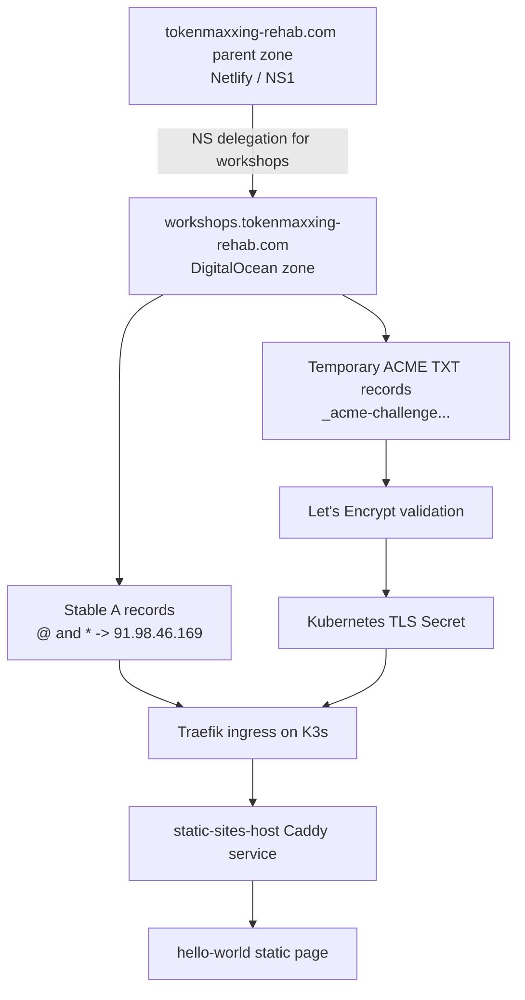
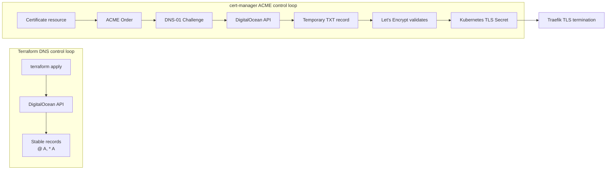
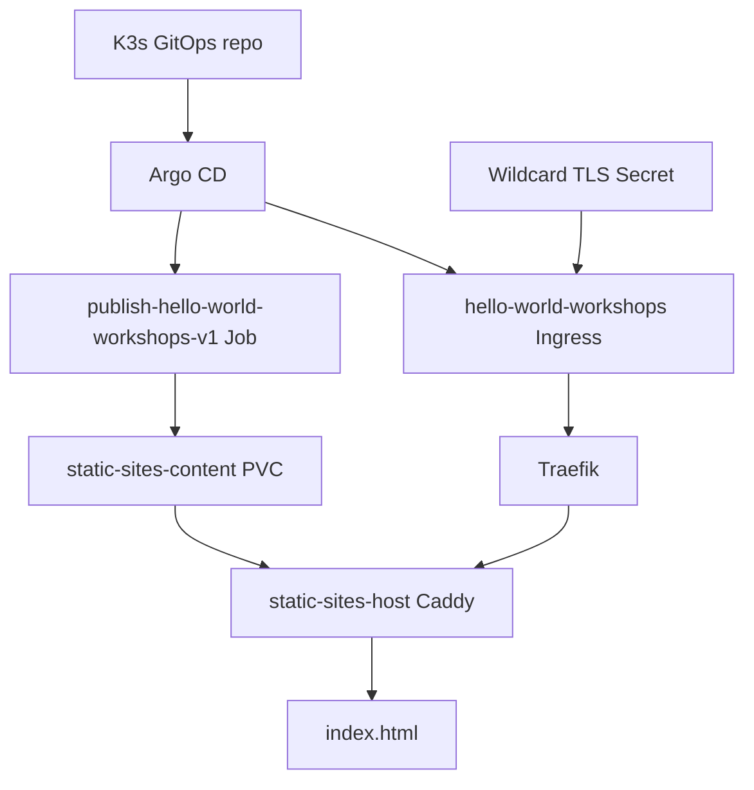

> [!note] Provider- and wildcard-specific
> This zone is DigitalOcean (`digitalocean_record`). `hyperslop.systems` is Cloudflare
> (`cloudflare_dns_record`), where the value field is `content`, MX `priority` is a separate
> argument, `tags` cannot be set on the current plan, and values must not carry a trailing dot.
>
> The DNS-01 challenge here is required because the certificate is a **wildcard**, and it is
> what forces a DNS provider credential into the cluster. A single hostname uses HTTP-01 and
> needs no such credential — see
> [[Projects/2026/07/31/PROJECT REPORT - Hyperslop Mailing List - Double Opt-In Service from Zero to Production]].

# Workshops Wildcard DNS and TLS — DigitalOcean Delegation Deep Dive

This report explains the rollout of `*.workshops.tokenmaxxing-rehab.com` onto the Hetzner K3s cluster. The deployed proof is `https://hello-world.workshops.tokenmaxxing-rehab.com/`, a static smoke-test page served by the cluster's shared `static-sites-host` service over a Let's Encrypt wildcard certificate.

The work looks small from the outside: one subdomain, one certificate, one static page. The actual system crosses several control planes. Netlify hosts the parent domain. DigitalOcean hosts the delegated workshops subdomain. Terraform manages stable DNS records. cert-manager performs ACME DNS-01 validation inside Kubernetes. Argo CD reconciles the static-site manifests. Traefik terminates TLS and routes to Caddy. Each part has a specific responsibility, and the rollout succeeded because those responsibilities were kept separate.

> [!summary]
> The live endpoint `https://hello-world.workshops.tokenmaxxing-rehab.com/` returns `HTTP/2 200` with a valid Let's Encrypt certificate covering `*.workshops.tokenmaxxing-rehab.com` and `workshops.tokenmaxxing-rehab.com`.
>
> The parent domain remains with Pierre in Netlify/NS1. Only `workshops.tokenmaxxing-rehab.com` is delegated to DigitalOcean. That delegation gives our Terraform and cert-manager workflows authority over all records below `workshops` without moving the entire domain.
>
> The central technical lesson is that stable visitor DNS and temporary ACME challenge DNS are different operations. Terraform creates long-lived `A` records. cert-manager creates short-lived `_acme-challenge` TXT records during certificate issuance and renewal.

## Current deployed state

The live state is concrete and verified.

```text
Live URL:              https://hello-world.workshops.tokenmaxxing-rehab.com/
Parent zone:           tokenmaxxing-rehab.com, hosted through Netlify/NS1
Delegated child zone:  workshops.tokenmaxxing-rehab.com, hosted in DigitalOcean
K3s ingress IP:        91.98.46.169
Argo CD app:           hello-world-workshops
Namespace:             static-sites
TLS secret:            workshops-tokenmaxxing-rehab-wildcard-tls
Certificate resource:  Certificate/static-sites/workshops-tokenmaxxing-rehab-wildcard-tls
Certificate issuer:    ClusterIssuer/letsencrypt-prod-dns01-digitalocean
Backend service:       static-sites/static-sites-host:http
Smoke-test content:    /srv/sites/hello-world.workshops.tokenmaxxing-rehab.com/current/index.html
```

The validation output showed the expected public DNS path:

```text
$ dig +short NS workshops.tokenmaxxing-rehab.com
ns2.digitalocean.com.
ns3.digitalocean.com.
ns1.digitalocean.com.

$ dig +short hello-world.workshops.tokenmaxxing-rehab.com A
91.98.46.169
```

The cluster state was also healthy:

```text
static-sites-host       Synced        Healthy
hello-world-workshops   Synced        Healthy
```

cert-manager issued the wildcard certificate:

```text
certificate.cert-manager.io/workshops-tokenmaxxing-rehab-wildcard-tls   True
order.acme.cert-manager.io/workshops-tokenmaxxing-rehab-wildcard-tls-1-387464127   valid
```

The certificate details are important because they prove the wildcard, the base host, and renewal scheduling are all correct:

```text
Not Before:   2026-06-17T16:51:01Z
Not After:    2026-09-15T16:51:00Z
Renewal Time: 2026-08-16T16:51:00Z
Subject:      CN = workshops.tokenmaxxing-rehab.com
Issuer:       Let's Encrypt YR2
SANs:         DNS:*.workshops.tokenmaxxing-rehab.com, DNS:workshops.tokenmaxxing-rehab.com
```

The HTTPS smoke test completed at the application layer:

```text
HTTP/2 200
server: Caddy
content-type: text/html; charset=utf-8
```

and the body contained:

```html
<h1>Hello from workshops.tokenmaxxing-rehab.com</h1>
<p>Host: <code>hello-world.workshops.tokenmaxxing-rehab.com</code></p>
```

## Why the solution uses delegation

The original problem was not simply to point a hostname at the cluster. A wildcard HTTPS deployment has two DNS requirements.

The first requirement is visitor routing. A browser resolving `hello-world.workshops.tokenmaxxing-rehab.com` must get the K3s ingress IP. This is a stable DNS record problem. It is solved with ordinary `A` records:

```text
workshops.tokenmaxxing-rehab.com                  A 91.98.46.169
*.workshops.tokenmaxxing-rehab.com                A 91.98.46.169
```

The second requirement is ACME domain validation. Let's Encrypt will not issue `*.workshops.tokenmaxxing-rehab.com` through HTTP-01. Wildcard certificates require DNS-01. During issuance, cert-manager must create temporary TXT records below:

```text
_acme-challenge.workshops.tokenmaxxing-rehab.com
```

A process in Kubernetes therefore needs programmatic write access to the authoritative DNS provider for that name. The parent domain was hosted by Pierre in Netlify. We could have installed a Netlify-specific cert-manager webhook, but that would introduce a new cluster component and require storing a Netlify API token. We chose a different boundary: delegate the full `workshops.tokenmaxxing-rehab.com` subdomain to DigitalOcean.

That decision gives the system one DNS provider for every record below `workshops`. Terraform can manage stable routing records in DigitalOcean, and cert-manager can manage temporary ACME TXT records in DigitalOcean using the already-existing cluster issuer.



The parent zone only needs NS records. It does not need a wildcard delegation. Once `workshops.tokenmaxxing-rehab.com` is delegated, DigitalOcean is authoritative for all names below that point, including `hello-world.workshops...`, `*.workshops...`, and `_acme-challenge.workshops...`.

## The two control loops

The most important implementation detail is that Terraform and cert-manager do different work.

Terraform does not run inside K3s during certificate issuance. K3s does not run Terraform to renew a certificate. Terraform applies stable desired state to DigitalOcean DNS. cert-manager later performs ACME challenge operations through the DigitalOcean API using an in-cluster Kubernetes Secret.



This separation is why the rollout was done in order. First the DigitalOcean zone was created with Terraform. Then Pierre delegated the subdomain from Netlify. Only then was it safe for cert-manager to issue the wildcard certificate. If the certificate existed before public DNS delegation was correct, cert-manager could still create Kubernetes `Order` and `Challenge` resources, but Let's Encrypt would not reliably see the expected TXT record through public DNS.

## DNS architecture

The DNS architecture has one parent zone and one delegated child zone.

| DNS name | Provider | Purpose |
| --- | --- | --- |
| `tokenmaxxing-rehab.com` | Netlify / NS1 | Parent domain controlled by Pierre. |
| `workshops.tokenmaxxing-rehab.com` | DigitalOcean | Delegated child zone controlled by our Terraform and cert-manager workflows. |
| `hello-world.workshops.tokenmaxxing-rehab.com` | DigitalOcean | Smoke-test hostname resolved by wildcard `A` record. |
| `_acme-challenge.workshops.tokenmaxxing-rehab.com` | DigitalOcean | ACME DNS-01 validation name used by cert-manager. |

Pierre's final required parent-zone records were:

```text
workshops  NS  ns1.digitalocean.com.
workshops  NS  ns2.digitalocean.com.
workshops  NS  ns3.digitalocean.com.
```

The rollout initially exposed a typo in this delegation. The parent zone returned:

```text
ns3.digitalocean.com.
ns12digitalocean.com.
ns1.digitalocean.com.
```

The invalid `ns12digitalocean.com.` record had to become `ns2.digitalocean.com.`. `dig +trace` made the typo visible because it showed the delegation returned by the parent authoritative nameserver. After the fix, all four NS1 parent nameservers returned the correct delegation.

The DigitalOcean child zone was created by Terraform in:

```text
/home/manuel/code/wesen/terraform/dns/zones/workshops-tokenmaxxing-rehab-com/envs/prod
```

The key Terraform resource is simple:

```hcl
resource "digitalocean_domain" "workshops" {
  name = var.zone_name
}
```

The stable records are deliberately minimal:

```hcl
locals {
  records = {
    apex_a = {
      type  = "A"
      name  = "@"
      value = var.cluster_ingress_ipv4
      ttl   = 3600
    }
    wildcard_a = {
      type  = "A"
      name  = "*"
      value = var.cluster_ingress_ipv4
      ttl   = 3600
    }
  }
}
```

The `@` record makes `workshops.tokenmaxxing-rehab.com` usable. The `*` record makes single-label subdomains such as `hello-world.workshops.tokenmaxxing-rehab.com` resolve to the same cluster IP.

The apply created three resources:

```text
DigitalOcean zone: workshops.tokenmaxxing-rehab.com
A record:          workshops.tokenmaxxing-rehab.com -> 91.98.46.169
A record:          *.workshops.tokenmaxxing-rehab.com -> 91.98.46.169
```

The resulting DigitalOcean record ids were:

```text
digitalocean_record.records["apex_a"]     = 1822609641
digitalocean_record.records["wildcard_a"] = 1822609640
```

A post-apply Terraform plan returned no changes.

## Certificate architecture

The cluster already had a DigitalOcean DNS-01 issuer:

```yaml
apiVersion: cert-manager.io/v1
kind: ClusterIssuer
metadata:
  name: letsencrypt-prod-dns01-digitalocean
spec:
  acme:
    server: https://acme-v02.api.letsencrypt.org/directory
    privateKeySecretRef:
      name: letsencrypt-prod-dns01-digitalocean-account-key
    solvers:
      - dns01:
          digitalocean:
            tokenSecretRef:
              name: digitalocean-dns
              key: access-token
```

That issuer reads `cert-manager/digitalocean-dns` and calls the DigitalOcean API directly. It was already used for `*.storybook.yolo.scapegoat.dev` and `*.hosting.yolo.scapegoat.dev`. The new certificate followed the same pattern:

```yaml
apiVersion: cert-manager.io/v1
kind: Certificate
metadata:
  name: workshops-tokenmaxxing-rehab-wildcard-tls
spec:
  secretName: workshops-tokenmaxxing-rehab-wildcard-tls
  issuerRef:
    name: letsencrypt-prod-dns01-digitalocean
    kind: ClusterIssuer
  dnsNames:
    - workshops.tokenmaxxing-rehab.com
    - "*.workshops.tokenmaxxing-rehab.com"
```

The certificate lives in the `static-sites` namespace because the Ingress that uses the secret also lives in `static-sites`. Kubernetes TLS secrets are namespaced. Traefik reads the secret named by the Ingress from the same namespace as the Ingress object. A certificate in a different namespace would not satisfy this Ingress.

cert-manager issued the certificate after delegation was corrected. The ACME `Order` reached `valid`, the `CertificateRequest` reached `Ready=True`, and the final Kubernetes Secret was created as `workshops-tokenmaxxing-rehab-wildcard-tls`.

The renewal time is worth recording:

```text
Renewal Time: 2026-08-16T16:51:00Z
```

That date is the next important operational test. If renewal succeeds, the DigitalOcean token, zone delegation, and cert-manager issuer remain valid. If renewal fails, the first checks should be the parent NS delegation and the DigitalOcean token available to cert-manager.

## GitOps and static site architecture

The cluster already had a shared static-site hosting pattern. The long-running web server is `static-sites-host`, a Caddy deployment in the `static-sites` namespace. Site-specific packages write content to a shared PVC under a path keyed by the full host name.

For the smoke test, the package is:

```text
gitops/kustomize/hello-world-workshops/
  kustomization.yaml
  publish-job.yaml
  ingress.yaml
```

The Argo CD Application is:

```text
gitops/applications/hello-world-workshops.yaml
```

The publisher Job uses the public `busybox:1.36` image, so it does not need a GHCR image or a Vault-backed image-pull secret. Its job is to create one file:

```text
/srv/sites/hello-world.workshops.tokenmaxxing-rehab.com/releases/v1/index.html
```

and update the current pointer:

```text
/srv/sites/hello-world.workshops.tokenmaxxing-rehab.com/current -> releases/v1
```

The Ingress uses the host `hello-world.workshops.tokenmaxxing-rehab.com`, the wildcard TLS secret, and the `static-sites-host` backend:

```yaml
spec:
  ingressClassName: traefik
  tls:
    - hosts:
        - hello-world.workshops.tokenmaxxing-rehab.com
      secretName: workshops-tokenmaxxing-rehab-wildcard-tls
  rules:
    - host: hello-world.workshops.tokenmaxxing-rehab.com
      http:
        paths:
          - path: /
            pathType: Prefix
            backend:
              service:
                name: static-sites-host
                port:
                  name: http
```

The flow from Git to the served page is:



The repository does not necessarily auto-create every new `gitops/applications/*.yaml` file. The new `hello-world-workshops` Application was therefore bootstrapped once with `kubectl apply -f gitops/applications/hello-world-workshops.yaml`. After that, Argo CD owned reconciliation.

## Rollout sequence

The successful rollout followed this sequence.

### 1. Create the DigitalOcean zone with Terraform

Terraform initialized, planned, and applied the new DNS environment. The plan showed three additions: the DigitalOcean domain and two A records. The apply succeeded and a follow-up plan returned no changes.

This step had to happen before Pierre's delegation. A delegated child zone should already answer when the parent starts pointing at it.

### 2. Ask Pierre to delegate `workshops`

Pierre added NS records in the parent Netlify/NS1 zone. The intended records were:

```text
workshops  NS  ns1.digitalocean.com.
workshops  NS  ns2.digitalocean.com.
workshops  NS  ns3.digitalocean.com.
```

The first attempt had the typo `ns12digitalocean.com.`. The failure mode was visible in `dig +trace`. Once corrected, the parent zone returned all three DigitalOcean nameservers.

### 3. Push and sync K3s GitOps changes

The K3s changes were committed and pushed:

```text
78f0ec6 Add workshops wildcard static site
3cc12b1 Record workshops live validation
```

The `static-sites-host` Application reconciled the new `Certificate`. The `hello-world-workshops` Application was created and reconciled the publish Job and Ingress.

### 4. Wait for cert-manager issuance

cert-manager created a `CertificateRequest`, ACME `Order`, and DNS-01 challenge. Once the DigitalOcean TXT records were visible to Let's Encrypt, the order became valid and the TLS secret was written.

### 5. Validate HTTP and TLS

The final checks were deliberately layered:

```bash
dig +short NS workshops.tokenmaxxing-rehab.com
dig +short hello-world.workshops.tokenmaxxing-rehab.com A
kubectl -n static-sites get certificate workshops-tokenmaxxing-rehab-wildcard-tls
kubectl -n static-sites get job publish-hello-world-workshops-v1
curl -Iv https://hello-world.workshops.tokenmaxxing-rehab.com/
curl -fsS https://hello-world.workshops.tokenmaxxing-rehab.com/
openssl s_client -connect hello-world.workshops.tokenmaxxing-rehab.com:443 \
  -servername hello-world.workshops.tokenmaxxing-rehab.com
```

Layered validation matters because a failure at one layer can produce symptoms at another. A browser TLS failure may be caused by DNS delegation, ACME challenge failure, missing Kubernetes Secret, wrong Ingress namespace, or Traefik not seeing the secret. The commands above isolate those layers.

## Failure modes and diagnostics

The rollout produced one actual external failure and one implementation-time manifest failure.

### Parent NS typo

The live delegation initially contained:

```text
ns12digitalocean.com.
```

The correct value was:

```text
ns2.digitalocean.com.
```

The diagnostic command was:

```bash
dig +trace hello-world.workshops.tokenmaxxing-rehab.com A
```

The trace showed exactly what the parent zone returned. This is better than only checking recursive resolver output because resolver caches can obscure where an incorrect delegation originated.

### YAML heredoc failure in the publisher Job

The first version of the Kubernetes Job used an inline shell heredoc to write `index.html`. The YAML was malformed because the heredoc body and YAML indentation interacted incorrectly. Kustomize reported:

```text
MalformedYAMLError: yaml: line 42: could not find expected ':' in File: publish-job.yaml
```

The fix was to write the file with explicit `printf` lines inside the shell block. This kept every line within the YAML block scalar and avoided a here-doc terminator that had to appear at a particular indentation level.

```sh
{
  printf '%s\n' '<!doctype html>'
  printf '%s\n' '<html lang="en">'
  printf '%s\n' '  <body>'
  printf '%s\n' '    <h1>Hello from workshops.tokenmaxxing-rehab.com</h1>'
  printf '%s\n' '  </body>'
  printf '%s\n' '</html>'
} >"${tmp}/index.html"
```

The broader rule is simple: when generating files inside Kubernetes YAML command blocks, prefer syntax whose indentation is entirely local to the shell command. Avoid nested syntaxes that have their own column-sensitive delimiters unless they are carefully tested with `kubectl kustomize`.

## Operational rules

The rollout establishes a reusable pattern for externally owned domains that need K3s wildcard TLS.

1. Delegate a subdomain, not the whole parent domain, when the parent is owned by another operator. This gives the cluster enough authority without expanding the scope of the DNS handoff.
2. Create the delegated child zone before the parent delegation is changed. The child nameservers should answer before public traffic can reach them.
3. Keep stable routing records in Terraform. These records express long-lived infrastructure state.
4. Let cert-manager manage ACME TXT records. These records are temporary protocol artifacts and should not be represented as normal Terraform-managed records.
5. Use `dig +trace` when delegation looks wrong. It shows the parent-to-child authority handoff directly.
6. Keep TLS secrets in the same namespace as the Ingress that consumes them.
7. Use a small static smoke-test hostname before attaching a real application. It validates DNS, ACME, Ingress, backend routing, and content serving without introducing application-specific behavior.

## Open issues

The live system is working. There are still repository and process issues to clean up.

The Terraform DNS commit exists on a branch with an unrelated name:

```text
311011d Add workshops tokenmaxxing DNS zone
branch: task/docsctl-goja-dbus-publisher
```

That branch should be merged, renamed, cherry-picked, or PR'd into the intended Terraform branch. The live Terraform state is already applied, so losing the code change would create an infrastructure-as-code drift problem.

The K3s repository also had unrelated pre-existing modified files under:

```text
ttmp/2026/06/06/...
```

Those were not part of this rollout. They should not be mixed into future commits for the workshops work.

The initial reMarkable bundle was uploaded before final live validation. The docmgr ticket now contains final validation evidence, but a refreshed reMarkable upload would be useful if the PDF copy is meant to be the durable review artifact.

## Key file references

K3s GitOps repository:

```text
/home/manuel/code/wesen/2026-03-27--hetzner-k3s/gitops/kustomize/static-sites-host/workshops-wildcard-certificate.yaml
/home/manuel/code/wesen/2026-03-27--hetzner-k3s/gitops/kustomize/static-sites-host/kustomization.yaml
/home/manuel/code/wesen/2026-03-27--hetzner-k3s/gitops/applications/hello-world-workshops.yaml
/home/manuel/code/wesen/2026-03-27--hetzner-k3s/gitops/kustomize/hello-world-workshops/publish-job.yaml
/home/manuel/code/wesen/2026-03-27--hetzner-k3s/gitops/kustomize/hello-world-workshops/ingress.yaml
```

Terraform repository:

```text
/home/manuel/code/wesen/terraform/dns/zones/workshops-tokenmaxxing-rehab-com/envs/prod/main.tf
/home/manuel/code/wesen/terraform/dns/zones/workshops-tokenmaxxing-rehab-com/envs/prod/variables.tf
/home/manuel/code/wesen/terraform/dns/zones/workshops-tokenmaxxing-rehab-com/envs/prod/outputs.tf
/home/manuel/code/wesen/terraform/dns/zones/workshops-tokenmaxxing-rehab-com/envs/prod/versions.tf
```

Docmgr ticket:

```text
/home/manuel/code/wesen/2026-03-27--hetzner-k3s/ttmp/2026/06/17/HK3S-0030--add-workshops-tokenmaxxing-rehab-wildcard-to-k3s/
```

## Closing

The finished deployment is small but complete. A hostname under an externally owned parent domain now reaches the K3s cluster, receives a valid wildcard certificate, routes through Traefik, and serves static content from the shared Caddy host. The value of the work is not only the hello-world page. The value is the repeatable pattern: delegate a subdomain, manage the child zone in Terraform, let cert-manager perform DNS-01 in the same provider, and validate the rollout layer by layer.

That pattern is now available for future workshop sites. A new site under `*.workshops.tokenmaxxing-rehab.com` should not need a new DNS design or a new wildcard certificate. It should need only content publication and an Ingress or routing rule that consumes the existing wildcard TLS secret.
