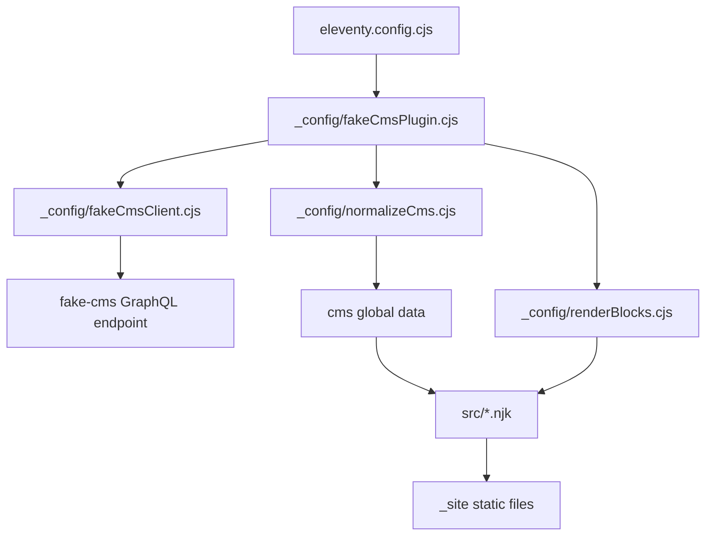

# Fake CMS 11ty Frontend — GraphQL to Static Site Deep Dive

This report explains the implementation of an Eleventy frontend for the `fake-cms` GraphQL server. The repository is `/home/manuel/code/wesen/2026-06-17--fake-cms-site`. The final frontend lives under `frontend/`, and the validated implementation builds a static site from the seeded CMS database at `testdata/cms.db`.

The work is important because it turns the backend workshop API into the missing frontend exercise. The Go service provides a read-only GraphQL model of a legacy WordPress + Yoast media CMS. The Eleventy frontend consumes that model at build time, normalizes it, renders block-structured content, and emits static HTML pages for articles, taxonomy archives, author pages, section pages, a homepage, and `sitemap.xml`.

> [!summary]
> The final implementation builds **140 article pages** and **190 total files** from `./fake-cms serve --path testdata/cms.db`.
>
> The core design is a **project-local Eleventy plugin** that owns data fetching, normalization, filters, and shortcodes, while the page templates remain visible under `frontend/src/` for workshop teaching.
>
> The most important correction was to target the **executable GraphQL schema**, not only the checked-in SDL. The running server does not currently expose `site`, `pages`, typed taxonomy filters, or typed `SEO.og/twitter` objects exactly as the aspirational docs suggest.

## Current implemented state

The frontend has a complete local implementation and validation suite.

```text
Repo:             /home/manuel/code/wesen/2026-06-17--fake-cms-site
Frontend:         frontend/
Backend command:  ./fake-cms serve --path testdata/cms.db --addr :8080
Frontend build:   cd frontend && CMS_ENDPOINT=http://localhost:8080/graphql npm run build
Unit tests:       cd frontend && npm test
Integration:      cd frontend && npm run test:integration
Final commit:     0a36271
```

The implementation was committed in focused steps:

| Commit | Purpose |
| --- | --- |
| `ed4d647` | Scaffolded the Eleventy project and proved pagination with hardcoded global data. |
| `4c22f98` | Added the GraphQL client, cursor pagination, contract smoke script, and CMS normalization. |
| `b3a652d` | Added the seven-variant block renderer and unit tests. |
| `5396e9e` | Wired the project-local Eleventy plugin to real CMS data. |
| `bf29d6d` | Added visible archive, tag, author, homepage, and sitemap templates. |
| `aa30a23` | Added end-to-end integration acceptance checks. |
| `0a36271` | Documented validation and completed the ticket diary/tasks. |

The frontend file layout is intentionally explicit:

```text
frontend/
├── _config/
│   ├── fakeCmsClient.cjs       # GraphQL HTTP client and current query shapes
│   ├── fakeCmsPlugin.cjs       # Eleventy plugin boundary
│   ├── normalizeCms.cjs        # URL derivation, indexes, sitemap URLs
│   └── renderBlocks.cjs        # CMS block-union renderer
├── scripts/
│   ├── contract-smoke.mjs      # quick executable-schema check
│   └── integration-build.mjs   # end-to-end acceptance test
├── src/
│   ├── _includes/
│   │   ├── article-card.njk
│   │   ├── base.njk
│   │   └── head.njk
│   ├── articles.njk
│   ├── author.njk
│   ├── category.njk
│   ├── index.njk
│   ├── pages.njk
│   ├── post-type.njk
│   ├── sitemap.xml.njk
│   ├── styles.css
│   └── tag.njk
└── test/
    ├── normalizeCms.test.mjs
    └── renderBlocks.test.mjs
```

## Why this project exists

The fake CMS backend exists to teach a realistic static-site-generator integration. A trivial content API would not exercise the decisions that matter in a real CMS migration. This API has cursor pagination, nested relationships, taxonomy URL conventions, SEO metadata, media references, and a GraphQL union for content blocks. The frontend exercise must therefore do real work.

The frontend exists to prove the workshop contract end-to-end:

- every article becomes a static page at `/<postTypeSlug>/<slug>/`
- tag pages use `/rubrique/<slug>/`, not `/tag/<slug>/`
- category pages use `/archives/<slug>/`
- author pages use `/author/<slug>/`
- body content is rendered from typed blocks, not raw HTML
- `seo.jsonLd` is emitted as JSON-LD in the document head
- `sitemap.xml` covers the generated pages

The project also teaches an important implementation discipline: the static site must target the schema the server actually executes. The checked-in SDL and docs are useful, but the build breaks against the executable GraphQL schema. This distinction shaped the corrected design.

## Eleventy in this project

Eleventy is a static site generator. Its runtime model is build-time data plus templates producing files. After the build, no Node process is required to serve the generated site. The output directory is `_site/`.

The relevant Eleventy concepts are small but precise.

**Global data** makes values available to every template. In this project, the `cms` global data object is produced by an async function:

```js
eleventyConfig.addGlobalData("cms", async () => {
  const raw = await fetchCms({ endpoint, pageSlugs });
  return normalizeCms(raw, { site });
});
```

Eleventy evaluates this function before rendering templates. The result is visible as `cms` in Nunjucks templates.

**Pagination** is the page-generation mechanism. A template can render once for each item in a data array:

```yaml
---
pagination:
  data: cms.articles
  size: 1
  alias: article
permalink: "/{{ article.urlPath }}/"
layout: base.njk
---
```

If `cms.articles` contains 140 articles, this one template writes 140 article pages. The `alias` variable is the current article for that render. The `permalink` determines the output path.

**Filters** transform values in templates. This project registers filters for URL segments, post-type slugs, absolute URLs, and JSON serialization.

**Shortcodes** render larger reusable fragments. This project registers `renderBlocks`, which receives a list of CMS blocks and returns HTML.

**Plugins** package Eleventy configuration. The plugin in this project is local to `frontend/_config/fakeCmsPlugin.cjs`. It is not published as an npm package because the backend schema is still evolving. This is the right boundary for the current state: the plugin contains reusable behavior, and the templates remain visible for workshop participants.

## Plugin boundary: what belongs in the plugin and what does not

The project uses a project-local plugin, not a black-box site generator. That choice is deliberate. The plugin owns reusable integration behavior. The templates own page structure.

| Belongs in the plugin | Belongs in templates |
| --- | --- |
| GraphQL endpoint option handling | Article page markup |
| `addGlobalData("cms", ...)` | Homepage layout |
| CMS fetch + normalization | Tag/category/author archive structure |
| URL and JSON filters | Section headings and card placement |
| `renderBlocks` shortcode registration | Visual presentation decisions |

This split makes the implementation useful for a workshop. Students can inspect `src/articles.njk`, `src/tag.njk`, and `src/sitemap.xml.njk` and understand how the static files are produced. The parts that are repetitive or correctness-sensitive are centralized in `_config/`.



The plugin is small enough to read in one pass. It resolves options, registers global data, registers filters, and exposes the renderer.

```js
module.exports = function fakeCmsPlugin(eleventyConfig, options = {}) {
  const endpoint = options.endpoint || process.env.CMS_ENDPOINT || "http://localhost:8080/graphql";
  const site = options.site || {
    name: "Fake CMS 11ty Frontend",
    baseUrl: process.env.SITE_URL || "http://localhost:8081",
  };
  const pageSlugs = options.pageSlugs || [];

  eleventyConfig.addGlobalData("cms", async () => {
    const raw = await fetchCms({ endpoint, pageSlugs });
    return normalizeCms(raw, { site });
  });

  eleventyConfig.addFilter("postTypeSlug", postTypeSlug);
  eleventyConfig.addFilter("pathSegment", pathSegment);
  eleventyConfig.addFilter("json", value => JSON.stringify(value, null, 2));
  eleventyConfig.addFilter("absoluteUrl", path => { /* base URL join */ });
  eleventyConfig.addShortcode("renderBlocks", blocks => renderBlocks(blocks));
};
```

The plugin function itself stays synchronous. The asynchronous work is inside `addGlobalData`. That matters because Eleventy can await async global data during the build without requiring the whole plugin registration path to become an async configuration problem.

## The executable GraphQL contract

The first design pass assumed the checked-in SDL and API docs exactly matched the running server. The corrected implementation did not make that assumption. It started the server and queried the executable schema.

The workshop command must point at the seeded database:

```bash
./fake-cms serve --path testdata/cms.db --addr :8080
```

Running `./fake-cms serve` without `--path testdata/cms.db` uses `cms.db`, which may be empty in a working tree. That was observed during validation: the default database returned zero articles. The seeded database returned 140 articles.

The executable schema currently supports these root fields for the frontend:

```graphql
article(id: ID, slug: String): Article
page(id: ID, slug: String): Page
articles(first: Int, after: String, postType: String, filter: String): ArticleConnection!
categories: [Category]
tags: [Tag]
authors: [Author]
```

Important current limitations:

- there is no executable `site` field
- there is no executable `pages` list
- `categories`, `tags`, and `authors` do not take `first`
- taxonomy article filters are not exposed as typed input objects
- `SEO.og`, `SEO.twitter`, and `SEO.breadcrumbs` are weak strings in the executable schema
- `seo.jsonLd` is the reliable structured SEO payload

The block query must use the `Block` interface spread:

```graphql
blocks {
  __typename
  ... on Block { id order }
  ... on ParagraphBlock { text align }
  ... on HeadingBlock { level text anchor }
  ... on ImageBlock { media { id url alt width height } caption link size }
  ... on ListBlock { ordered items }
  ... on QuoteBlock { text citation }
  ... on EmbedBlock { provider url caption }
  ... on GalleryBlock { images { id url alt width height } columns }
}
```

Selecting `order` directly on `BlockUnion` fails. The contract smoke script verifies that this invalid query still fails, so the project will catch accidental regression back to the first draft's invalid fragment.

## Fetching and pagination

The GraphQL client lives in `frontend/_config/fakeCmsClient.cjs`. It has one low-level function and several content-specific functions.

The low-level function posts a GraphQL document and rejects both HTTP failures and GraphQL errors:

```js
async function gql(endpoint, query, variables = {}) {
  const response = await fetch(endpoint, {
    method: "POST",
    headers: { "content-type": "application/json" },
    body: JSON.stringify({ query, variables }),
  });
  if (!response.ok) {
    throw new Error(`GraphQL HTTP ${response.status}: ${await response.text()}`);
  }
  const payload = await response.json();
  if (payload.errors?.length) {
    throw new Error(`GraphQL errors:\n${JSON.stringify(payload.errors, null, 2)}`);
  }
  return payload.data;
}
```

Article fetching follows Relay-style cursor pagination:

```text
articles = []
after = null
loop:
  page = query articles(first: 50, after: after)
  append page.edges[].node to articles
  if page.pageInfo.hasNextPage is false: break
  after = page.pageInfo.endCursor
```

This is not optional. Offset pagination is not part of the API contract. The `after` cursor returned by the server is the continuation token for the next request.

The current implementation fetches all articles once and groups them client-side. That decision follows from the executable schema. The aspirational docs describe taxonomy filters, but the running schema does not expose the typed filter object. Client-side grouping keeps the frontend correct today.

## Normalization

The normalizer lives in `frontend/_config/normalizeCms.cjs`. It performs the transformations that templates should not repeat.

Normalization has four responsibilities.

First, it derives stable URL paths:

```js
BEST_CASES      -> best-cases
SLIDER_DE_UNE   -> slider-de-une
```

```js
article.urlPath  = `${postTypeSlug(article.postType)}/${encodeURIComponent(article.slug)}`
tag.urlPath      = `rubrique/${encodeURIComponent(tag.slug)}`
category.urlPath = `archives/${encodeURIComponent(category.slug)}`
author.urlPath   = `author/${encodeURIComponent(author.slug)}`
```

Second, it adds entity kinds and derived fields so templates do not need to infer them.

Third, it builds indexes:

```js
articlesByPostType
articlesByTagSlug
articlesByCategorySlug
articlesByAuthorSlug
```

Fourth, it builds `sitemapUrls`, the list used by `src/sitemap.xml.njk`.

This normalization step is a correctness boundary. URL conventions belong here because they are shared by templates, tests, sitemap generation, and future links. If each template constructed URLs independently, `/rubrique/` could regress to `/tag/` in one page family while appearing correct elsewhere.

## Rendering CMS blocks

The CMS does not return article bodies as HTML. It returns an ordered list of typed blocks. The renderer in `frontend/_config/renderBlocks.cjs` is therefore the central content transformation.

The renderer is pure JavaScript. It does not know about Eleventy and does not fetch data. It receives blocks and returns an HTML string.

```text
renderBlocks(blocks):
  sort blocks by order
  render each block by __typename
  join fragments with newlines
```

Each block type has a distinct branch:

| Block type | Rendered shape |
| --- | --- |
| `ParagraphBlock` | `<p class="align-...">...</p>` |
| `HeadingBlock` | clamped `<h2>` through `<h6>` with optional `id` |
| `ImageBlock` | `<figure class="block-image">...` |
| `ListBlock` | `<ol>` or `<ul>` with `<li>` children |
| `QuoteBlock` | `<blockquote class="block-quote">...` |
| `EmbedBlock` | `<figure class="block-embed block-embed-provider">...` |
| `GalleryBlock` | `<ul class="block-gallery columns-n">...` |

The renderer escapes text and attributes. It clamps heading levels so invalid CMS data cannot produce nonsensical heading tags. It throws on unknown block types:

```js
default:
  throw new Error(`Unknown CMS block type: ${block?.__typename}`);
```

That failure mode is intentional. Dropping unknown content silently would make a schema change appear successful while losing article content. A build-time error is the correct behavior for this workshop baseline.

## Templates and output shape

The visible templates under `frontend/src/` show how Eleventy maps normalized data into pages.

`src/articles.njk` paginates over `cms.articles` and writes article pages:

```yaml
pagination:
  data: cms.articles
  size: 1
  alias: article
permalink: "/{{ article.urlPath }}/"
layout: base.njk
```

`src/tag.njk` paginates over `cms.tags` and writes `/rubrique/<slug>/` pages. It reads article lists from `cms.articlesByTagSlug[tag.slug]`.

`src/category.njk` writes `/archives/<slug>/` pages and reads `cms.articlesByCategorySlug[category.slug]`.

`src/author.njk` writes `/author/<slug>/` pages and reads `cms.articlesByAuthorSlug[author.slug]`.

`src/post-type.njk` writes post-type index pages such as `/actualites/` and `/best-cases/`.

`src/sitemap.xml.njk` writes `sitemap.xml` using normalized URLs and local archive URLs.

The shared head partial, `src/_includes/head.njk`, handles SEO. It detects whether the current rendering context has `article.seo` or `cmsPage.seo` and emits JSON-LD with explicit serialization:

```njk

<script type="application/ld+json">{{ currentSeo.jsonLd | json | safe }}</script>

```

This is necessary because `seo.jsonLd` arrives as a JavaScript object after GraphQL JSON decoding. Printing it directly would risk producing `[object Object]`. The `json` filter is the serialization boundary.

## Validation architecture

Validation is split into unit tests, a contract smoke script, and a full integration script.

Unit tests cover pure logic:

```bash
cd frontend
npm test
```

Current unit tests cover:

- `postTypeSlug`
- `pathSegment`
- normalization and `/rubrique/` URLs
- sitemap URL generation
- HTML escaping
- heading-level clamping
- all seven block branches
- unknown block failure

The contract smoke checks the executable GraphQL contract against an already running backend:

```bash
CMS_ENDPOINT=http://localhost:8080/graphql npm run contract:smoke
```

The integration script starts the Go backend itself:

```bash
cd frontend
npm run test:integration
```

It performs the full acceptance pass:

```mermaid
flowchart TD
    Start[Test script] --> Server[Start go run ./cmd/fake-cms serve --path testdata/cms.db]
    Server --> Health[Wait for /healthz]
    Health --> Count[Query articles totalCount]
    Count --> Build[Run Eleventy build]
    Build --> Inspect[Inspect _site files]
    Inspect --> A1[Article page count equals totalCount]
    Inspect --> A2[No /tag/ output]
    Inspect --> A3[/rubrique/ output exists]
    Inspect --> A4[Sitemap covers generated pages]
    Inspect --> A5[Article JSON-LD parses]
```

The current verified integration result is:

```text
integration ok: 140 article pages, 190 files
```

The integration script originally printed the success message but timed out. The cause was process cleanup. `go run` starts a compiled child process; killing only the parent process can leave the child server alive. The fix was to spawn `go run` as a detached process group and kill the process group in `finally`:

```js
const server = spawn("go", ["run", "./cmd/fake-cms", "serve", ...], {
  cwd: repoRoot,
  detached: true,
});

process.kill(-server.pid, "SIGTERM");
```

This detail matters because integration tests must clean up after themselves. A test that leaves a server listening on its port will make the next run unreliable.

## The data was sufficient

The user allowed additional seeding from prior `20minutes-media.com` research if the site did not contain enough data. It was not necessary. The seeded database already contains 140 articles, enough to test pagination, post types, tag archives, author pages, category pages, encoded slugs, block rendering, and sitemap generation.

The generated output includes article paths such as:

```text
/actualites/reportage-engag%C3%A9--oenobiol-72/
/best-cases/enqu%C3%AAte-engag%C3%A9--oenobiol-20/
/etudes/reportage-historique--hbo-104/
/rubrique/audience/
/archives/actualites/
/author/adminclic-clic-com/
```

The accented slugs are URL-encoded by `pathSegment`. This is safe for static hosting and avoids ambiguous filesystem behavior. A future visual-polish pass could decide whether raw UTF-8 directory names are preferable, but the current implementation is technically correct and covered by tests.

## Known backend contract issue

The repository has a backend/schema alignment issue that the frontend works around. `schema.graphql` and some API docs describe fields that are not currently present in `internal/graphql/schema.go`.

The frontend therefore uses these workarounds:

| Backend gap | Frontend workaround |
| --- | --- |
| No `site` query | site metadata comes from Eleventy plugin options. |
| No `pages` list | optional `CMS_PAGE_SLUGS` fetches known pages individually. |
| No typed taxonomy filter input | fetch all articles once and build indexes client-side. |
| `categories/tags/authors` take no `first` arg | query them without arguments. |
| Weak `seo.og/twitter/breadcrumbs` strings | rely on `seo.jsonLd` for structured SEO. |

The best long-term fix is to align the executable GraphQL schema with the checked-in SDL, or update the SDL/docs to match the executable schema. Until that happens, the frontend should keep its contract smoke test.

A separate validation issue also exists in the repository: `go test ./...` sees old debug scripts under `ttmp/.../scripts/debug` with multiple `func main()` definitions in one package. This is unrelated to the frontend. The application packages pass with:

```bash
go test $(go list ./... | grep -v '/ttmp/')
```

## How to view the result

Run the backend from the repository root:

```bash
./fake-cms serve --path testdata/cms.db --addr :8080
```

Run the frontend from a second terminal:

```bash
cd frontend
npm install
CMS_ENDPOINT=http://localhost:8080/graphql npm run serve
```

Open the URL Eleventy prints, usually:

```text
http://localhost:8081/
```

Useful pages:

```text
http://localhost:8081/
http://localhost:8081/rubrique/audience/
http://localhost:8081/archives/actualites/
http://localhost:8081/author/adminclic-clic-com/
http://localhost:8081/sitemap.xml
```

## Working rules extracted from the project

Several reusable rules came out of this implementation.

**Verify the executable contract before designing the client.** SDL files and prose docs can drift. A static build fails against the server that runs, not against the schema that was intended.

**Use Eleventy pagination for CMS entity pages.** A single template with `pagination.size: 1` is the right way to render one output file per CMS item.

**Normalize once before templates.** URL rules, taxonomy indexes, and sitemap lists should be computed in JavaScript modules, not repeated across templates.

**Keep workshop templates visible.** A plugin should package data fetching and helpers. It should not hide the page-generation mechanism from the learner unless the goal is a one-command demo rather than an implementation exercise.

**Render GraphQL unions with explicit branches.** Each block variant deserves a distinct rendering branch. Unknown variants should fail loudly.

**Serialize JSON-LD deliberately.** A GraphQL JSON scalar becomes a JavaScript value. The template must convert it with `JSON.stringify` before placing it in a `<script type="application/ld+json">` tag.

**Test the generated files, not just the functions.** The integration test inspects `_site/` because the real acceptance target is a directory of files.

## Open questions

The implementation is complete enough for the workshop baseline, but several decisions remain open.

- Should the backend be fixed to expose `site`, `pages`, typed SEO objects, and taxonomy filters exactly as `schema.graphql` describes?
- Should encoded slugs remain the canonical output, or should the static site emit raw UTF-8 path segments for readability?
- Should `EmbedBlock` render provider-specific iframes for YouTube and other providers, or stay as safe linked figures?
- Should the integration script become part of CI, given that it starts a Go server and performs a full Eleventy build?
- Should old `ttmp` debug scripts receive build tags so `go test ./...` passes without excluding `ttmp`?

## Final status

The project reached the workshop acceptance target. The frontend builds from the seeded fake CMS server with no manual data entry, emits all article pages, creates `/rubrique/` tag pages, avoids `/tag/`, injects valid JSON-LD, renders all seven block types through tested branches, and writes a sitemap covering generated pages.

The most important technical result is not only the static site. It is the implementation shape: a small project-local Eleventy plugin, a verified GraphQL contract, a normalization layer, visible teaching templates, and an integration test that checks the generated files. That structure is durable enough to extend after the backend schema is aligned.
