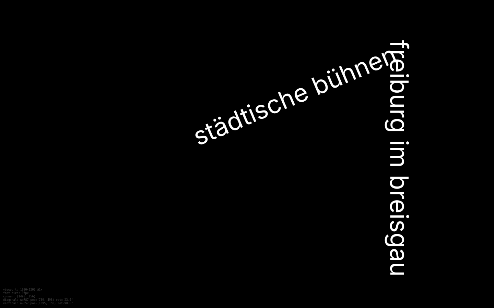
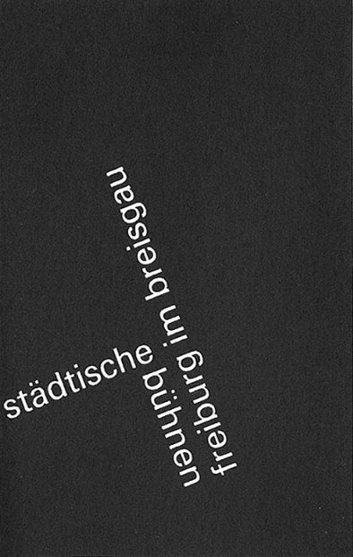
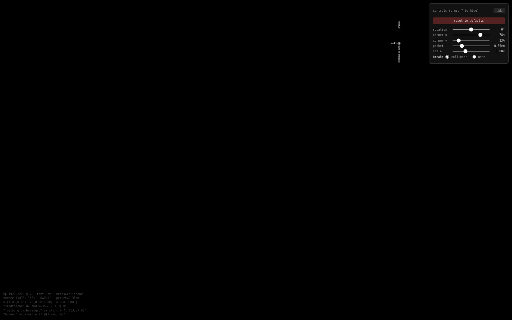
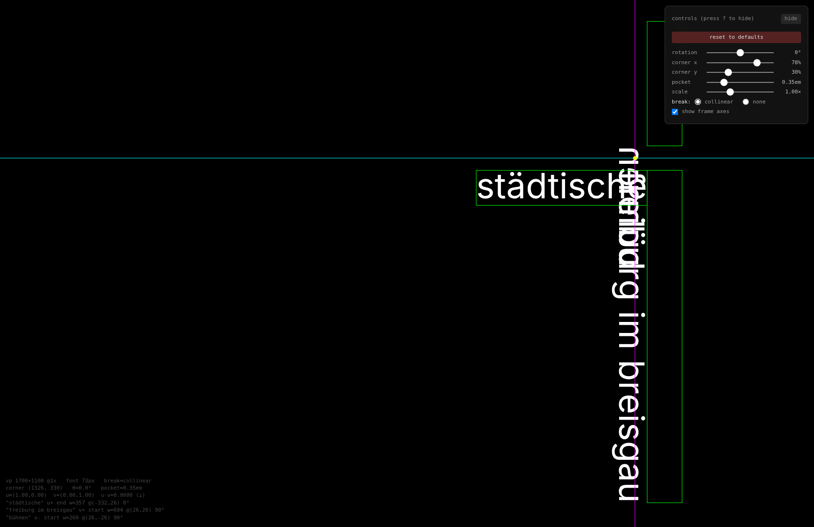
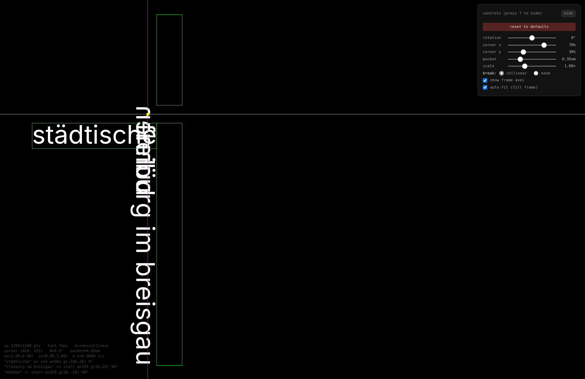
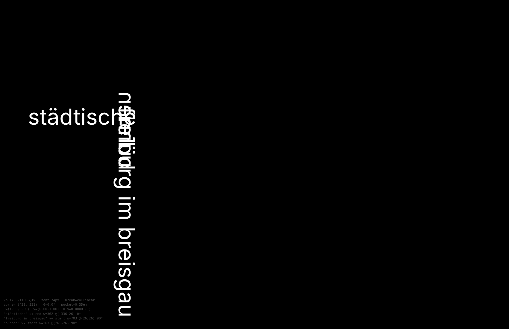

# Perpendicular Text Composition on Canvas — A Frame + Run Engine with Structural Orthogonality

This article is a technical analysis of a typographic poster engine that places two lines of text at a shared corner so that they are always perpendicular, so that the whole structure can be rotated as a unit, and so that the composition fills the containing frame regardless of aspect ratio. The reference implementation lives in `/home/manuel/code/wesen/2026-06-16--learn-grids-2/ruder-poster/` — a self-contained Vite + TypeScript + pnpm project that measures text with `@chenglou/pretext` and renders on an HTML5 canvas.

The central lesson is about how to make an invariant cheap. The first implementation computed the angle of the second text line from the angle of the first and drifted to 113° instead of 90°. The final implementation derives the second axis from the first by construction, so the two texts are perpendicular because of how the data is defined, not because of a calculation that has to come out right. The perpendicularity check in the logs reads `0.000000` at every rotation. That is the difference between a target and a guarantee.

The work continues two threads already present in this vault: [[ARTICLE - Ruder Typography Plates on Canvas - From Pretext Measurement to a Fluent DSL|the Ruder Typography Plates article]], which established the measurement-and-draw discipline on the same canvas, and [[ARTICLE - Pretext Print Layout - Building a Swiss Typography Rendering System for Dense Programming Reports|the Pretext Print Layout system]]. This article is narrower. It is about one composition — two perpendicular lines meeting at a corner — and the geometry, the solver, and the state management needed to make that composition rotatable, responsive, and interactive.


## Why this note exists

The triggering problem was a poster in the Emil Ruder tradition: the words `städtische bühnen` set on a diagonal and the words `freiburg im breisgau` set perpendicular to them, the two meeting at a corner in the upper-right with a small square pocket of negative space between them. The poster is pure typography on a black ground. There are no images, no rules, no decoration. The entire visual charge comes from scale, orientation, and the right angle where the two lines meet.

Two requirements made this non-trivial. First, the perpendicularity had to survive arbitrary rotation of the whole composition. Second, the composition had to fill the browser window at any aspect ratio, including a narrow portrait viewport where the diagonal text breaks and the second word redistributes onto the perpendicular axis. The note preserves the geometry and the algorithms that satisfy both requirements so that the pattern can be reused for any two-axis perpendicular text layout.

> [!summary]
> - Perpendicularity is a structural property of the data, not a computed target. One orthonormal frame is defined at the corner; the second axis is the perpendicular of the first, derived once and never stored independently.
> - Rotation is a single transform applied once about the corner. All text is placed in local frame coordinates where the axes are the unit basis.
> - The pocket of negative space is a pure translation along the orthogonal axis, made possible by `textBaseline = 'top'`, which puts the top edge of each glyph box at local `y = 0`.
> - Font size and corner position are solved jointly by a closed-form fill-the-frame calculation, not by a fit-only search. Each run is pinned to a different edge of the frame.

## The composition and its invariant

The composition consists of two pieces of German text:

- `TEXT_A = 'städtische bühnen'`
- `TEXT_B = 'freiburg im breisgau'`

In the wide layout, `TEXT_A` lies on one axis and `TEXT_B` lies on the perpendicular axis. The two meet at a corner point `C`. A pocket of size `s` separates them so that the corner reads as a small square of negative space rather than as a collision. The whole structure can be rotated by an angle `θ` about `C`.

The invariant is the right angle. Whatever else changes — the rotation, the font size, which text breaks, the aspect ratio of the frame — the two axes must remain perpendicular. The first implementation treated this as a number to compute (`angle₂ = angle₁ + π/2`) and composed it with a global rotation inconsistently, producing a measured angle of 113° in landscape and 98° in portrait. The pocket read as a trapezoid.



The failure mode is general. Whenever an invariant is expressed as a calculation that must come out right, floating-point composition, sign errors, and inconsistent application of the global transform will eventually break it. The fix is to remove the calculation. Define the second axis as the perpendicular of the first and never write it down independently.

## The frame: one angle, two derived axes

The engine defines a local orthonormal frame anchored at the corner. The frame has one free angular parameter, `θ`, which is the rotation of the whole composition. From `θ` the two axes are derived:

- `u = (cos θ, sin θ)` — the primary axis, along which `TEXT_A` runs.
- `v = (−sin θ, cos θ)` — the perpendicular axis, along which `TEXT_B` runs. This is `u` rotated by `+π/2`.

The axes are a 90° rotation of each other by definition. Their dot product is `cos θ·(−sin θ) + sin θ·cos θ = 0` for every `θ`. No code path can break the right angle because no code path computes it.

The frame is drawn by applying the canvas transform exactly once:

```typescript
ctx.translate(C.x, C.y)
ctx.rotate(θ)
// now the local x-axis is u and the local y-axis is v
```

After this transform, all placement happens in local coordinates where `u = (1, 0)` and `v = (0, 1)`. The global rotation does not interact with per-run placement. This is what makes rotation cheap: it is one matrix multiplication applied to the whole composition, not a per-element calculation.

## Runs: text placed on an axis

A run is the unit of placed text. It carries the string, its measured width, the axis it lives on, the direction it reads, and which end touches the corner.

```typescript
type Run = {
  text: string
  width: number           // measured advance width in CSS pixels
  axis: 'u' | 'v'
  dir: 1 | -1             // +1 reads along +axis, -1 reads against
  anchor: 'start' | 'end' // which end is at the corner
}
```

The wide layout has two runs:

```typescript
[
  { text: 'städtische bühnen',   axis: 'u', dir:  1, anchor: 'end'   },
  { text: 'freiburg im breisgau', axis: 'v', dir:  1, anchor: 'start' },
]
```

`TEXT_A` is end-anchored on `u`, so its right tip touches the corner and it extends to the left. `TEXT_B` is start-anchored on `v`, so its top touches the corner and it extends downward. The pocket separates them.

The narrow layout — the one that makes the composition responsive — has three runs. `TEXT_A` splits at the space. The first word stays on the `u` axis. The second word jumps to the `v` axis and reads in the opposite direction from `TEXT_B`, so the two are collinear but on opposite sides of the corner:

```typescript
[
  { text: 'städtische',          axis: 'u', dir:  1, anchor: 'end'   },
  { text: 'freiburg im breisgau', axis: 'v', dir:  1, anchor: 'start' },
  { text: 'bühnen',              axis: 'v', dir: -1, anchor: 'start' },
]
```



This is the responsive behavior. The composition does not scale uniformly and it does not flatten its angle at narrow widths. It restructures: a word moves from one axis to the other, and the pocket that was between the two texts becomes the gap between the two fragments of `TEXT_A`. The right angle is preserved throughout because the run list is the only thing that changes; the frame is unchanged.

## Placing a run in the local frame

Placement in the local frame reduces to three rules: the pocket shift, the anchor pullback, and the stacking cursor.

The **pocket shift** moves a run off the corner along the axis perpendicular to its own. A run on the `u` axis is shifted by `+s` in the local `v` direction, so its top edge sits `s` away from the `u` axis. A run on the `v` axis is shifted by `+s` in the local `u` direction. This works cleanly because `textBaseline = 'top'` makes `fillText(text, 0, 0)` draw with the top edge of the glyph box at local `y = 0`. The pocket is a pure translation; no font-metric arithmetic is needed to size the gap.

The **anchor pullback** decides which end of the run is at the corner. A start-anchored run grows away from the corner, so its near end is at distance `along` from the corner. An end-anchored run has its far end at the corner, so it is pulled back by its own width: the effective offset is `along − width`.

The **stacking cursor** lays out multiple runs on the same axis. The crucial detail, which cost a full debugging cycle, is that the cursor must be independent per `(axis, dir)`. A single cursor per axis is wrong because a `dir = -1` run on the `v` axis would inherit the offset accumulated by the `dir = +1` run and be pushed off the screen.

The placement function, with the three rules applied:

```typescript
function placeRuns(runs, pocketPx) {
  const cursor = {
    u: { [+1]: pocketPx, [-1]: pocketPx },
    v: { [+1]: pocketPx, [-1]: pocketPx },
  }
  return runs.map(run => {
    const along = cursor[run.axis][run.dir]
    cursor[run.axis][run.dir] += run.width + pocketPx
    const pullback = run.anchor === 'end' ? run.width : 0
    const signed = run.dir * (along - pullback)
    const ox = run.axis === 'u' ? signed : pocketPx
    const oy = run.axis === 'u' ? pocketPx : signed
    return { ...run, ox, oy, angle: run.axis === 'u' ? 0 : Math.PI / 2 }
  })
}
```

Each placed run carries its local origin `(ox, oy)` and its local rotation (`0` for the `u` axis, `π/2` for the `v` axis). Rendering applies the per-run transform inside the already-rotated frame.

## The bug that the logs caught

The first version of `placeRuns` used one cursor per axis. The console log, emitted on every compute, showed the consequence immediately:

```
run "bühnen" axis=v dir=- anchor=start ... box=(1526,-887)→(1607,-617) fit=false
solve: chosen fontSize=8px
```

`bühnen` is a `dir = -1` run on the `v` axis. With a shared cursor, its starting offset inherited the width of `freiburg im breisgau`, placing it at local `y = -76` and, at larger font sizes, off the top of the screen. The fit check rejected every trial size above 8px, and the solver collapsed to a font size of 8 pixels.



The instrumentation was the deciding factor. The log printed the screen-space bounding box of each run at every trial size, so the failing run and the failing coordinate were visible without a debugger. Pairing the log with the screenshot and handing both to a vision model produced the fix directly: maintain independent cursors per `(axis, dir)`. After the fix, the solver landed at 69–73px and the perpendicularity check read `0.000000`.

The lesson is that layout code benefits from a log line per placed element giving its measured width, its local origin, and its screen-space bounding box. Layout bugs are coordinate bugs. They are fast to find when the coordinates are printed and slow to find when they are not.

## Solving for font size and corner jointly

The first solver was a binary search over font size. At each trial size it measured the runs, placed them at a user-supplied corner, transformed their boxes to screen space, and checked that each fit inside the frame with a margin. The search found the largest font that fit.

The result was correct but unsatisfying. At a 1700×1100 frame with the corner at `(1326, 330)`, the solver found a 73px font — and left 969 pixels of empty black on the left, because `TEXT_A` extended only 357 pixels left of the corner. The composition was as large as it could be without overflowing, but it was not filling the frame.



The problem is that fit-only solving treats the corner as a fixed input. The reference poster fills the frame because each run reaches a different edge. The fix is to solve for font size and corner position jointly by pinning each run to an edge.

Text advance width scales linearly with font size for a fixed font family and weight, so each run has a constant ratio of width to font size. Measuring each run once at a reference size of 100px gives the ratios:

- `kL` — length of `städtische` per 1px of font, on the `u` axis, leftward.
- `kU` — length of `bühnen` per 1px of font, on the `v` axis, upward.
- `kD` — length of `freiburg im breisgau` per 1px of font, on the `v` axis, downward.

For the collinear layout at 100px the measurement gives `kL = 4.891`, `kU = 3.560`, `kD = 9.504`. Pin the leftward run to the left margin, the upward run to the top margin, and the downward run to the bottom margin. The vertical fill constraint is `(kU + kD + 2·pocket) · s ≤ H − mt − mb`, where the two pocket terms account for the gap between each run and the corner. The horizontal fill constraint is `(kL + pocket) · s ≤ W − ml − mr`. The font size is the smaller of the two, and the corner follows from the pins:

```
sV = (H − mt − mb) / (kU + kD + 2·pocket)
sH = (W − ml − mr) / (kL + pocket)
fontSize = round(min(sV, sH) · scale)
Cx = ml + kL·s + pocket·s
Cy = mt + (kU + pocket)·s
```

At 1700×1100 this gives `sV = 73.5`, `sH = 307.6`, so the vertical constraint binds, the font size is 74px, and the corner moves to `(429, 331)`. The left void disappears. `städtische` reaches the left margin, `freiburg im breisgau` reaches the bottom margin, and `bühnen` reaches the top margin.



The closed-form solve replaced the binary search. It is exact where the search was approximate, and it is `O(1)` measurements where the search was `O(log n)`. More importantly, it encodes the compositional idea — each run aims at a different edge — directly into the math, so a frame-filling composition is the default rather than something the user has to tune by hand.

The solver has one known limitation. It places the corner in the axis-aligned frame and does not account for the global rotation. At `θ = 0` this is exact. At large rotations the rotated bounding box of the composition is smaller than the axis-aligned estimate, so the composition no longer fills the frame as tightly. A rotation-aware solve would place the corner against the rotated bounding box. This is future work; for the rotations a poster typically uses (under 30°) the error is small.

## State: a reducer with persistence

The controls — rotation, corner position, pocket, scale, break mode, frame overlay, auto-fit — are all fields of one serializable state object. The state transitions through a reducer, and the store persists to `localStorage` so a refresh restores the last configuration.

```typescript
type PosterParams = {
  rotation: number          // degrees, -180..180
  cornerX: number           // 0..1, used when autoFit is off
  cornerY: number           // 0..1, used when autoFit is off
  pocket: number            // em
  scale: number             // multiplier on the solved font size
  breakMode: 'none' | 'collinear'
  fontSizeOverride: number | null
  autoFit: boolean
  showFrame: boolean
}
```

The store is deliberately dependency-free. A reducer store with `getState`, `dispatch`, and `subscribe`, plus a `load`/`save` pair around `localStorage`, is roughly forty lines. It does what a state library does for a single-screen application, without the dependency, and the reducer signature `(state, action) → state` keeps every transition auditable.

The render path is a pure function of the state and the viewport. `compute(params, vp)` returns a `Computed` object carrying the font size, the font shorthand, the placed runs, and the frame. `render(ctx, computed)` draws it. Neither holds mutable state. This is what makes resize handling and slider response cheap: a slider dispatches an action, the store notifies, the subscriber calls `compute` and `render` with the new state, and the canvas reflects the change on the next frame.

## The measurement contract

The font shorthand string is the single source of truth for measurement and drawing. `prepareWithSegments(text, font)` from `@chenglou/pretext` measures the advance width of a string using the same `CanvasRenderingContext2D.measureText` call that the canvas renderer uses internally. Because the measurement and the drawing go through the same shaping engine with the same font string, the measured width of a run and the drawn width of that run are the same number.

This contract has two requirements. The font must be loaded before the final measurement, because a fallback font gives different widths than the real one. And the shorthand string must be byte-identical between the call to `prepareWithSegments` and the assignment to `ctx.font`. The engine enforces both: it renders immediately on load with whatever font is available so the canvas is never blank, then refines once `document.fonts.ready` resolves and one `requestAnimationFrame` tick has passed. A blank canvas is treated as a bug, not as a loading state.

## Working rules

- Express invariants structurally. If two quantities must be perpendicular, derive the second from the first. Do not compute it and hope the floating point cooperates.
- Apply a global transform once, at the root. Per-element placement then happens in local coordinates where the math is simple and sign errors are local.
- Log one line per placed element with its width, local origin, and screen-space box. Layout bugs are coordinate bugs; they yield quickly to printed coordinates.
- Treat position and size as a joint solve when the composition must fill a frame. Fit-only solving leaves voids; edge-pinned solving eliminates them.
- Measure and draw with the same font string. The contract is what makes canvas typography exact; violating it reintroduces drift.
- Keep render pure. `render(state, viewport) → canvas` makes every other concern — persistence, resize, slider response — a matter of calling the function again.

## Open questions

- The fill solver is rotation-unaware. At large rotations the composition underfills the frame. A solver that places the corner against the rotated bounding box would close this gap.
- The `none` break mode has no upward run, so the vertical pin is one-sided and the top of the frame is unfilled. Whether this is the intended wide-layout behavior or a gap to close is a design decision.
- The edge-pin assignment is fixed: leftward to the left, upward to the top, downward to the bottom. Generalizing to an arbitrary assignment of runs to edges would express more compositions through the same solver.

## Related notes

- [[ARTICLE - Ruder Typography Plates on Canvas - From Pretext Measurement to a Fluent DSL]] — the measurement-and-draw discipline on the same canvas, across seven compositions.
- [[ARTICLE - Pretext Print Layout - Building a Swiss Typography Rendering System for Dense Programming Reports]] — Pretext as a DOM-free measurement library.
- [[ARTICLE - Constraint-Based Layout on Canvas - Cassowary + Pretext + React]] — constraint-based positioning on canvas.

## Source

- Repository: `/home/manuel/code/wesen/2026-06-16--learn-grids-2/ruder-poster/`
- Ticket: `ttmp/2026/06/19/RUDER-PRETEXT-POSTER--emil-ruder-typographic-poster-with-pretext-js-diagonal-vertical-composition/`
- Key files: `src/geometry.ts`, `src/composition.ts`, `src/store.ts`, `src/controls.ts`, `src/main.ts`


