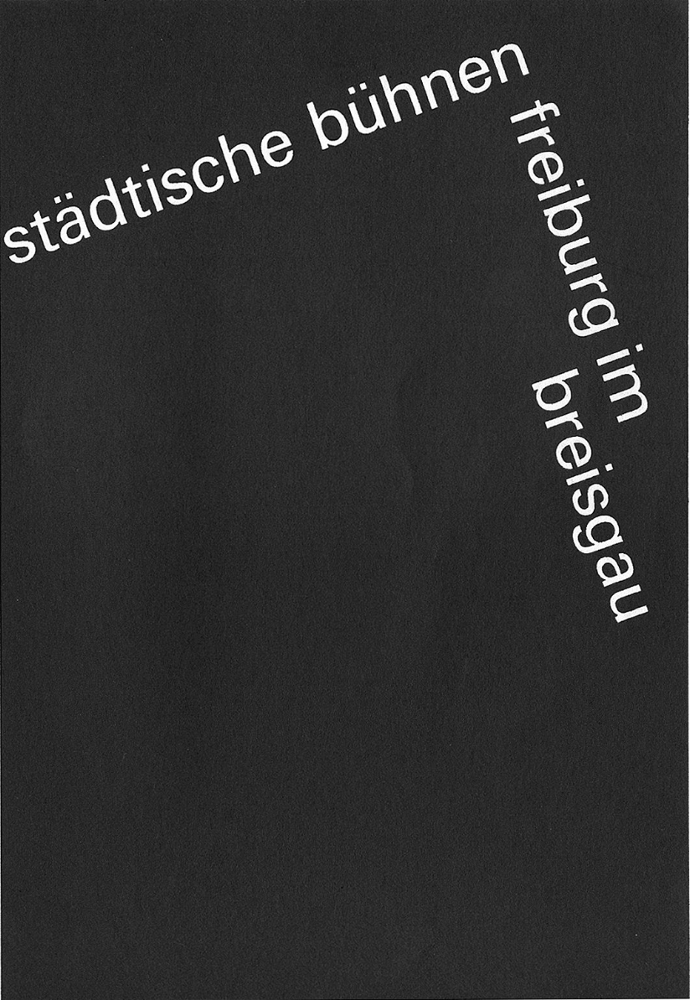
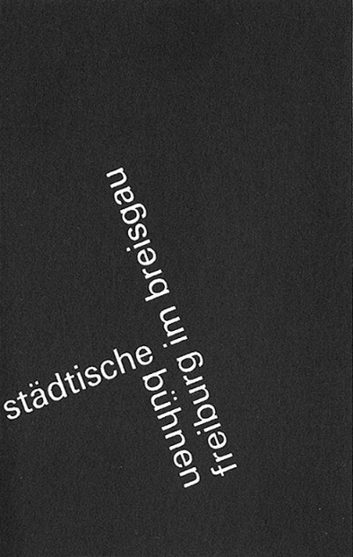
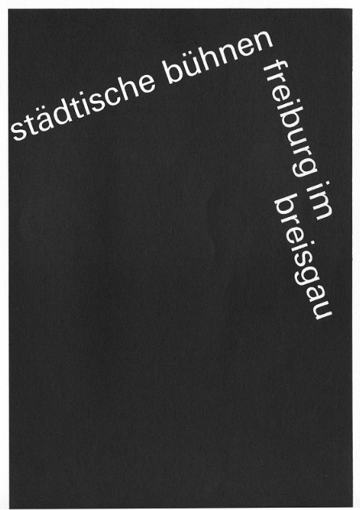
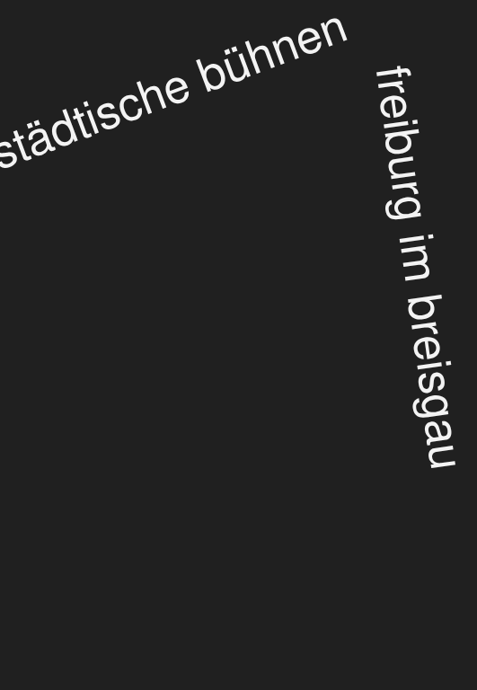
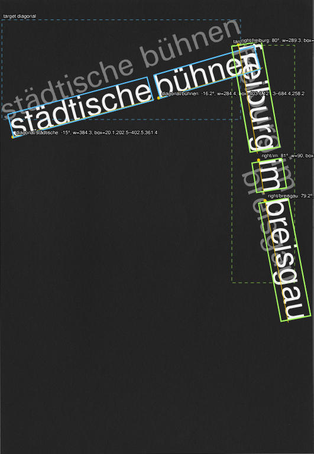
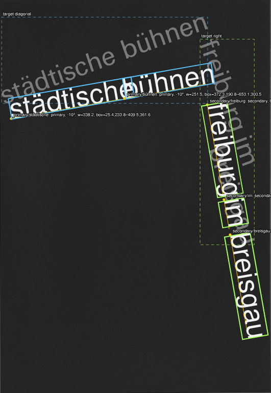
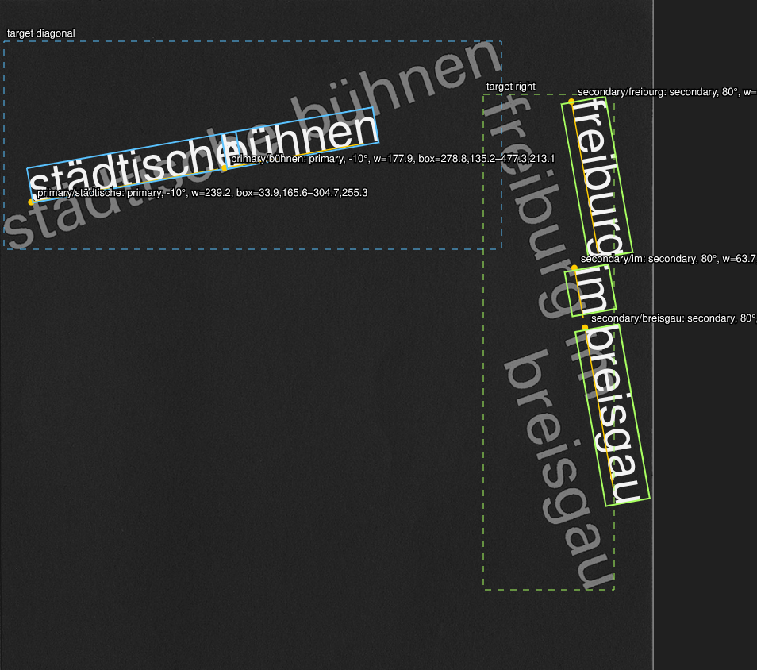
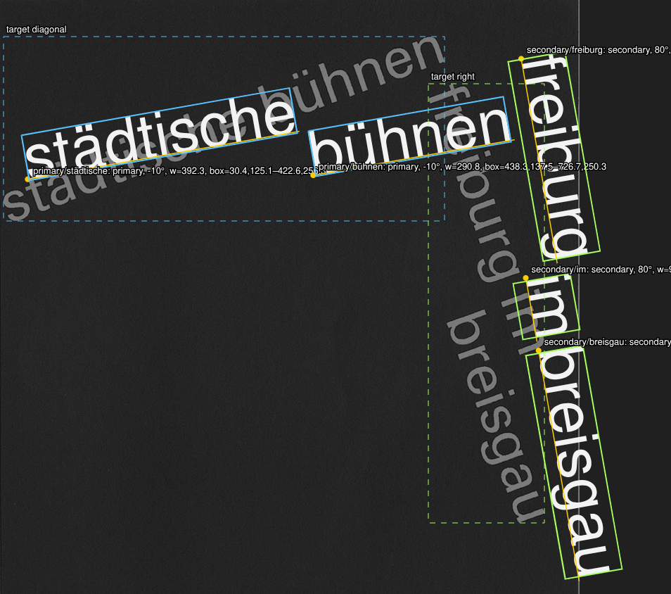
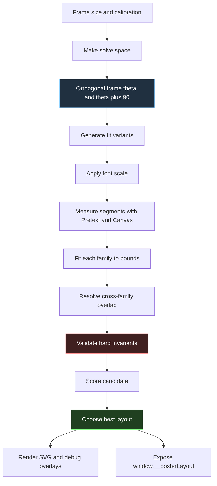

# Responsive Orthogonal Typography Solver — Pretext Poster Fitting Deep Dive

This article explains the design and implementation of a responsive typographic poster solver built in `/home/manuel/code/wesen/2026-06-16--learn-grids-2/pretext-typographic-poster`. The project began with a single reference image containing the phrases `städtische bühnen` and `freiburg im breisgau`, then changed into a more general problem: build an algorithm that can produce compositions in that typographic family while preserving structural invariants under frame resize and font-size changes.

The implementation is a self-contained Vite, TypeScript, and pnpm application. It uses `@chenglou/pretext` for text advance measurement, Canvas `TextMetrics` for ink boxes, SVG for rendering, and a solver that searches over fitting strategies. The important technical decision is that the two text directions are not independently tuned. A single user-controlled angle `θ` defines the primary direction, and the secondary direction is derived as `θ + 90°`. Orthogonality is therefore a property of the data model, not a visual preference checked after rendering.

The project follows two related articles already in this vault: [[ARTICLE - Ruder Typography Plates on Canvas - From Pretext Measurement to a Fluent DSL|Ruder Typography Plates on Canvas]] and [[ARTICLE - Perpendicular Text Composition on Canvas - A Frame + Run Engine|Perpendicular Text Composition on Canvas]]. Those notes document canvas-based composition and structural perpendicularity. This note focuses on a different part of the problem: responsive fitting. It explains how measured word segments, hard constraints, and scored layout candidates fit together into a solver that can adapt when the poster frame changes.

> [!summary]
> - The solver treats the reference images as examples of a typographic system, not as a single fixed bitmap to copy.
> - The two text directions are exactly orthogonal by construction: `primaryAngle = θ`, `secondaryAngle = θ + 90°`.
> - Each phrase is decomposed into measured segments. Segments can stay inline, move to parallel baselines, or shift as part of a fitting strategy.
> - The current fitting loop generates candidate layouts, measures them, fits them to bounds, resolves overlap, validates invariants, scores the result, and returns the best candidate.
> - The next important step is optical scoring: anchor bands, hinge quality, baseline rhythm, proportional gutters, and stronger preferences derived from example images.



## Why this note exists

The source image is a black typographic composition with white lowercase grotesk text. The image has no interface elements, no decorative marks, and no illustration. Its structure is entirely defined by text size, baseline direction, spacing, and the relationship between two phrase groups. That makes it a useful test case for a text layout algorithm because every placement decision is visible.

The first implementation question was direct: how can a web app reproduce the reference? That framing was too narrow. A fixed reproduction can be achieved with constants, but constants do not explain how the composition should adapt to a different frame, a different font size, or a different segmentation strategy. The project therefore moved from reproduction to example-driven generation. The reference and user-provided configurations are treated as examples of the desired class of layouts.

The technical problem is now this:

- Given a poster frame of arbitrary dimensions.
- Given two phrase groups that must remain orthogonal.
- Given measured text segments with real font metrics.
- Choose positions, line offsets, and possibly a reduced font size so that text stays in bounds, does not overlap, and still resembles the example family.

The current implementation solves the hard constraints. It also records enough diagnostics to explain why a particular layout was chosen. The remaining work is to improve the soft scoring terms so the valid result is also the most typographically convincing result.

## The example set

The project uses eight images as the current evidence set. They are copied into the vault so this article can be read independently of the working repository. The first three images describe the typographic family. The remaining images document implementation states and solver behavior.

| Image | Role | Path |
|---|---|---|
| Original reference | Main example for the typographic family | `assets/pretext-orthogonal-typography-solver/01-reference-example.png` |
| Configuration A | User-provided counterexample / alternative | `assets/pretext-orthogonal-typography-solver/02-configuration-a.png` |
| Configuration B | User-provided closer configuration | `assets/pretext-orthogonal-typography-solver/03-configuration-b.png` |
| Latest adaptive default | Current default output of the solver | `assets/pretext-orthogonal-typography-solver/04-latest-adaptive-default-render.png` |
| Responsive stress render | Output after forcing an oversized requested font | `assets/pretext-orthogonal-typography-solver/05-responsive-fit-stress-render.png` |
| Initial render | Early rigid-run render before segmentation | `assets/pretext-orthogonal-typography-solver/06-initial-render-before-segmentation.png` |
| Segmented render | Intermediate segmented render before the full orthogonal fitting model | `assets/pretext-orthogonal-typography-solver/07-current-segmented-render.png` |
| Orthogonal segmented render | First render after introducing the `θ` / `θ + 90°` frame | `assets/pretext-orthogonal-typography-solver/08-orthogonal-segmented-render.png` |

### Reference and user configurations

The original reference establishes the vocabulary: black field, lowercase grotesk text, a strong diagonal primary phrase, and a secondary phrase that turns the composition into a right-angle typographic construction.


Configuration A and configuration B were useful because they showed that the target should not be treated as one immutable bitmap. Configuration A demonstrates a composition that satisfies some structural ideas but does not preserve the same corner relationship. Configuration B is closer to the desired typographic family because it keeps the two phrase groups organized around a shared orthogonal relationship.





### Implementation progression

The first implementation pass placed the phrases as rigid runs. This made the geometry simple, but it was too limited: a rigid run cannot express line breaks, parallel baselines, or word-level fitting strategies.



The next pass decomposed the phrases into segments. The primary phrase could be represented as `städtische` plus `bühnen`; the secondary phrase could be represented as `freiburg`, `im`, and `breisgau`. This moved the project from fixed text transforms to measured segment placement.



The following pass introduced the orthogonal frame. Instead of controlling the two directions independently, the solver controls one angle `θ` and derives the other as `θ + 90°`. This is the first version where the main angle invariant belongs to the data model.



### Current adaptive output and stress output

The latest adaptive default render is not intended to be a pixel-perfect copy. It is evidence that the algorithm can produce an in-family composition while preserving the hard constraints in the live poster frame.



The stress render is a stronger test because it starts from an impossible request: the requested font size is too large for the current frame. The solver responds by selecting a different fitting strategy and reducing the actual font size until the hard constraints pass.



## The hard constraints

The project distinguishes hard constraints from soft scoring preferences. A hard constraint must pass for the layout to be considered valid. A soft preference expresses typographic quality among valid layouts.

The hard constraints are:

1. The two text directions are exactly `90°` apart.
2. No measured segment may overlap a segment from the other text family.
3. No measured segment may extend outside the current poster frame margin.
4. The frame dimensions are live inputs to the solver.
5. Font-size changes are live inputs to the solver.

These constraints are represented in TypeScript by `LayoutViolation`:

```ts
export type LayoutViolation =
  | { type: 'angle-not-orthogonal'; observedDeg: number }
  | { type: 'overlap'; a: string; b: string }
  | { type: 'out-of-bounds'; id: string; side: 'left' | 'right' | 'top' | 'bottom'; amount: number }
```

The structure matters. A violation is not a boolean failure. It identifies the failed invariant and carries enough data for debug output. This makes the solver inspectable. When a frame resize produces a different fit strategy, the debug panel and `console.log` output can show whether the selected layout passed because overlap was resolved, because font size was reduced, or because a different segmentation strategy was chosen.

## The primary data model

The application code separates calibration, measured runs, solved layout, and diagnostics. The core types live in `pretext-typographic-poster/src/composition/types.ts`.

The `Calibration` type contains user-adjustable design parameters:

```ts
export type Calibration = {
  fontFamily: string
  fontWeight: number
  fontSizeAtReference: number
  letterSpacingAtReference: number
  globalRotationDeg: number
  primaryStart: Point
  secondaryStart: Point
  boundsMarginAtReference: number
  primaryWordGap: number
  secondaryWordGap: number
  primarySecondLineOffset: number
  secondaryMiddleLineOffset: number
  secondaryLastLineOffset: number
  background: string
  foreground: string
}
```

This type is deliberately not a list of absolute SVG transforms. It describes the controls that are meaningful for this problem: text size, tracking, global rotation, family start points, word gaps, line offsets, and bounds margin. The final transforms are derived later.

The solved layout returns more information than the renderer needs:

```ts
export type PosterLayout = {
  width: number
  height: number
  scale: number
  calibration: Calibration
  frame: OrthogonalFrame
  runs: MeasuredTextRun[]
  violations: LayoutViolation[]
  fit: FitDiagnostics
}
```

The renderer needs `runs`, `width`, `height`, and colors. The debug panel needs everything else. This is the correct direction of dependency: the solver owns layout facts; the renderer receives them.

## Orthogonality as a frame

The orthogonal frame is implemented in `src/composition/frame.ts`:

```ts
export function makeOrthogonalFrame(thetaDeg: number): OrthogonalFrame {
  return {
    thetaDeg,
    primaryAngleDeg: thetaDeg,
    secondaryAngleDeg: thetaDeg + 90,
  }
}
```

This function is small because the design decision is already encoded in the type relationship. The secondary angle is not an independent slider. It is not a calibrated constant. It is derived from the primary angle every time.

The validator then checks the angle relationship:

```ts
const observed = angleBetweenFamilies(frame)
if (Math.abs(observed - 90) > 0.001) {
  violations.push({ type: 'angle-not-orthogonal', observedDeg: observed })
}
```

The check is still useful, but it is not the main source of correctness. The main source of correctness is that the second angle is derived from the first. The check protects future refactors from accidentally reintroducing independent angles.

The current debug output for a valid layout contains:

```json
{
  "thetaDeg": -10,
  "primaryAngleDeg": -10,
  "secondaryAngleDeg": 80
}
```

The relation is exact in the model. Rendering, anti-aliasing, and screenshot rasterization can still produce visual ambiguity, but the layout data preserves the invariant.

## Segment measurement

The solver does not measure whole paragraphs. It measures individual word segments:

- `primary/städtische`
- `primary/bühnen`
- `secondary/freiburg`
- `secondary/im`
- `secondary/breisgau`

This segmentation is central to the fitting behavior. A single rigid text node can only move, rotate, and scale. A segmented phrase can remain inline in one candidate and move selected words to parallel baselines in another candidate.

Measurement happens in `src/composition/measure.ts`. Pretext provides the advance width:

```ts
const prepared = prepareWithSegments(input.text, font, {
  letterSpacing: input.letterSpacing,
})
const advanceWidth = measureNaturalWidth(prepared)
```

Canvas metrics provide the ink box:

```ts
ctx.font = font
const metrics = ctx.measureText(input.text)

const inkLeft = metrics.actualBoundingBoxLeft || 0
const inkRight = metrics.actualBoundingBoxRight || advanceWidth
const inkAscent = metrics.actualBoundingBoxAscent || input.fontSize * 0.74
const inkDescent = metrics.actualBoundingBoxDescent || input.fontSize * 0.22
```

The two measurements answer different questions. The Pretext advance width tells the solver how far the next segment should advance along a baseline. The Canvas ink box tells the validator whether visible glyphs stay inside bounds and whether two segments overlap.

The measured segment is converted into a rotated polygon by `rotatedInkBox(...)` in `src/composition/geometry.ts`. That polygon is later used by the overlap validator. This is more precise than checking only an axis-aligned bounding rectangle because the words are rotated.

## The solve pipeline

The current solver lives in `src/composition/solve.ts`. The public entry point is:

```ts
export function solvePosterLayout(
  viewport: Size,
  calibration: Calibration = DEFAULT_CALIBRATION,
  faithfulScale = true,
): PosterLayout {
  const space = faithfulScale
    ? makeFaithfulSpace(viewport, calibration)
    : makeAdaptiveSpace(viewport, calibration)
  return solveResponsive(space)
}
```

There are two frame modes:

- `faithfulScale` keeps the original `824 × 1193` reference frame and scales the rendered SVG.
- Adaptive mode uses the current poster frame dimensions as the solver rectangle.

The user clarified that resizing should mean resizing the typographic poster frame, not only scaling a fixed design. The application therefore defaults to adaptive mode. Fixed reference mode remains in the debug panel because it is still useful for comparing against the original example.

The responsive solve loop is the heart of the current implementation:

```ts
function solveResponsive(baseSpace: SolveSpace): PosterLayout {
  const frame = makeOrthogonalFrame(baseSpace.calibration.globalRotationDeg)
  const fontScales = [1, 0.96, 0.92, 0.88, 0.84, 0.8, 0.74, 0.68, 0.62, 0.56, 0.5, 0.44, 0.38]
  let best: PosterLayout | undefined
  let candidatesTried = 0

  for (const fontScale of fontScales) {
    const space = scaleSolveSpace(baseSpace, fontScale)
    for (const variant of wrapVariants(space)) {
      candidatesTried += 1
      const candidate = solveCandidate(space, variant)
      const violations = validateLayout(candidate.runs, space.width, space.height, space.margin, frame)
      const layout = makeLayout(space, frame, candidate.runs, violations, variant, fontScale, candidatesTried)

      if (!best || scoreLayout(layout) < scoreLayout(best)) best = layout
    }
  }

  return best ?? makeLayout(...)
}
```

This is not an optimization solver in the mathematical programming sense. It is an enumerated search over a finite set of candidate strategies and font scales. The benefit is that every candidate is concrete, measurable, and inspectable. If a better typographic strategy is needed, a new candidate family can be added and scored.

## Candidate strategies

A candidate strategy determines how the segments are allowed to move before validation. The current strategy generator explores three dimensions:

1. Whether the second primary word moves to a parallel line.
2. Whether the secondary words stay inline, move left, move right, or fan across offsets.
3. Whether the secondary family stays anchored or shifts down/sideways.

The generator begins with arrays of offsets:

```ts
const primaryOffsets = [
  base.primarySecondLineOffset,
  base.primarySecondLineOffset + em * 0.75,
  base.primarySecondLineOffset - em * 0.75,
]

const secondaryOffsets = [
  { mid: base.secondaryMiddleLineOffset, last: base.secondaryLastLineOffset, name: 'secondary-inline' },
  { mid: base.secondaryMiddleLineOffset - em * 0.55, last: base.secondaryLastLineOffset - em * 0.55, name: 'secondary-left-line' },
  { mid: base.secondaryMiddleLineOffset + em * 0.55, last: base.secondaryLastLineOffset + em * 0.55, name: 'secondary-right-line' },
  { mid: base.secondaryMiddleLineOffset - em * 0.55, last: base.secondaryLastLineOffset + em * 0.55, name: 'secondary-fan' },
]
```

The solver then crosses those options with a small set of secondary start shifts. Each generated variant receives a human-readable strategy name such as:

```text
primary-inline/secondary-right-line/shifted
primary-break/secondary-right-line/anchored
```

The strategy name appears in `window.__posterLayout.fit`. This is important because responsive behavior should not be opaque. When the frame changes, the developer should be able to see whether the solver kept the primary inline, moved the secondary stack, or reduced font size.

## Measuring and placing a candidate

A candidate becomes concrete in `solveCandidate(...)`:

```ts
function solveCandidate(space: SolveSpace, variant: WrapVariant): Candidate {
  let primaryStart = space.calibration.primaryStart
  let secondaryStart = add(space.calibration.secondaryStart, variant.secondaryStartShift)
  let runs = measureComposition(primaryStart, secondaryStart, space, variant)

  for (let i = 0; i < 8; i += 1) {
    const before = signature(runs)
    ;({ primaryStart, secondaryStart, runs } = fitFamilyBounds(primaryStart, secondaryStart, runs, space, variant))
    ;({ secondaryStart, runs } = resolveFamilyOverlaps(primaryStart, secondaryStart, runs, space, variant))
    ;({ primaryStart, secondaryStart, runs } = fitFamilyBounds(primaryStart, secondaryStart, runs, space, variant))
    if (signature(runs) === before) break
  }

  return { primaryStart, secondaryStart, runs }
}
```

The stages are ordered deliberately.

First, the solver measures the composition with the current variant. Second, it fits each family independently to the frame bounds. Third, it resolves cross-family overlap. Fourth, it fits bounds again because overlap resolution can move a family. The loop repeats until the integer-rounded signature of the measured boxes stops changing or the iteration limit is reached.

This is a practical iterative fitting loop. It does not guarantee a global optimum. It does guarantee that each candidate is transformed through the same sequence of correction stages before scoring.

## Bounds fitting

Bounds fitting is performed per family, not globally. This is a critical detail. If the solver computes one combined bounding box and shifts the entire composition, one family can fix another family’s overflow while introducing a different overflow somewhere else. Per-family fitting lets the primary and secondary groups satisfy the frame independently before overlap resolution is considered.

The shift is computed from the measured ink box:

```ts
function boundsShift(runs: MeasuredTextRun[], space: SolveSpace): Point {
  const bbox = combinedBox(runs)
  let dx = 0
  let dy = 0
  if (bbox.x1 < space.margin) dx += space.margin - bbox.x1
  if (bbox.x2 > space.width - space.margin) dx -= bbox.x2 - (space.width - space.margin)
  if (bbox.y1 < space.margin) dy += space.margin - bbox.y1
  if (bbox.y2 > space.height - space.margin) dy -= bbox.y2 - (space.height - space.margin)
  return { x: dx, y: dy }
}
```

The function does not inspect the rendered SVG. It uses measured geometry. This is necessary for responsive fitting because the decision has to be made before rendering.

## Overlap validation

Overlap validation is implemented with polygon intersection in `src/composition/validation.ts`. Each measured segment has four rotated ink-box corners. The validator checks segment pairs across the two families and uses a separating-axis test:

```ts
function polygonsIntersect(a: Point[], b: Point[]): boolean {
  return !hasSeparatingAxis(a, b) && !hasSeparatingAxis(b, a)
}
```

The current validator ignores same-family overlaps because same-family segments are placed sequentially along a measured baseline and are expected to share phrase rhythm. Cross-family overlap is the important failure mode because it breaks the relationship between the diagonal phrase group and the secondary phrase group.

The separating-axis test is a good fit here because every ink box is a convex quadrilateral. There is no need to rasterize or inspect pixels. The validation uses the same coordinate system as the solver.

## Scoring candidates

After a candidate is measured, corrected, and validated, the solver assigns a score. Lower scores are better.

```ts
function scoreLayout(layout: PosterLayout): number {
  const violationScore = layout.violations.reduce((sum, violation) => {
    if (violation.type === 'overlap') return sum + 100_000
    if (violation.type === 'out-of-bounds') return sum + 25_000 + violation.amount * 250
    return sum + 100_000
  }, 0)
  const actualFontSize = layout.runs[0]?.fontSize ?? layout.fit.actualFontSize
  const fontPenalty = Math.max(0, layout.fit.requestedFontSize - actualFontSize) * 80
  const bbox = layout.runs.length > 0 ? combinedBox(layout.runs) : { x1: 0, y1: 0, x2: layout.width, y2: layout.height }
  const areaPenalty = ((bbox.x2 - bbox.x1) * (bbox.y2 - bbox.y1)) / Math.max(1, layout.width * layout.height)
  return violationScore + fontPenalty + areaPenalty
}
```

The score has three current components:

- Violations dominate the score. A candidate with overlap or bounds failure should lose to a valid candidate even if it preserves more font size.
- Font-size reduction is penalized. The solver should keep type as large as possible after satisfying hard constraints.
- Occupied area contributes a small compactness penalty.

The variant’s own `complexity` is added in `makeLayout(...)`. Complexity penalizes disruptive strategies such as breaking the primary phrase or shifting the secondary family. This prevents the solver from choosing a complex layout when a simpler valid layout is available.

## Responsive behavior

The responsive behavior can be demonstrated through the diagnostics rather than screenshots. In a small frame, the solver selected a shifted secondary-line strategy and reduced font size:

```json
{
  "frame": "480×280",
  "requestedFontSize": 42,
  "actualFontSize": 31.08,
  "strategy": "primary-inline/secondary-right-line/shifted",
  "violations": []
}
```

In a larger frame, the solver preserved the requested size:

```json
{
  "frame": "954×844",
  "requestedFontSize": 59.42665549036043,
  "actualFontSize": 59.42665549036043,
  "strategy": "primary-inline/secondary-right-line/shifted",
  "violations": []
}
```

After forcing an oversized requested font, the solver changed strategy and scaled down:

```json
{
  "strategy": "primary-break/secondary-right-line/anchored",
  "requestedFontSize": 127.3428331936295,
  "actualFontSize": 86.59312657166807,
  "fontScale": 0.68,
  "violations": []
}
```

These traces show the intended behavior. A resize changes the solver rectangle. A font-size change changes the requested size. The solver then searches candidate strategies and returns the best valid result it can find.

## Debug surface

The debug surface is part of the architecture. It is not only a development convenience. Responsive fitting is difficult to reason about from the rendered output alone because a valid visual result can be produced by several different strategy choices.

`src/main.ts` exposes three important diagnostics:

```ts
window.__posterLayout
window.__posterSetCalibration({ fontSizeAtReference: 180 })
console.log('[poster-layout] fit', layout.fit)
```

The debug panel also exposes controls for:

- global rotation `θ`,
- bounds margin,
- font size,
- tracking,
- primary and secondary start points,
- word gaps,
- segment line offsets,
- reference overlay opacity,
- fixed reference frame mode.

The most important output is `layout.fit`:

```ts
export type FitDiagnostics = {
  strategy: string
  requestedFontSize: number
  actualFontSize: number
  fontScale: number
  score: number
  candidatesTried: number
}
```

This turns fitting into an observable process. A future scoring change can be evaluated by comparing `strategy`, `score`, and `candidatesTried` across the same frame and calibration inputs.

## The current limitation: validity is not yet typographic quality

The current solver is good at finding valid layouts. The external image-QA feedback confirmed that the latest outputs are broadly in the same typographic family as the examples. It also identified the next problem: valid layout is not enough.

The next scoring pass should add optical criteria:

1. **Primary single-baseline preference.** Keep `städtische bühnen` on one baseline whenever that is feasible.
2. **Secondary stack rhythm.** Prefer `freiburg`, `im`, and `breisgau` as a three-segment stack with consistent baseline spacing.
3. **Optical gutters.** Penalize text that approaches the frame edge too closely, even if it remains technically in bounds.
4. **Hinge quality.** Reward layouts where the tail of the primary phrase approaches the head of the secondary group with a controlled gap.
5. **Anchor bands.** Keep the primary and secondary families near target regions derived from the examples.
6. **Shared-edge alignment.** Reward secondary segments that share a consistent optical edge.
7. **Visual mass balance.** Penalize layouts where all text collapses into one corner unless the example preset explicitly calls for that.

The current score function knows about violations, font size, compactness, and variant complexity. It does not yet know about hinge quality, stack rhythm, or example-derived anchor bands. That is the next technical frontier.

## A proposed next scoring model

A better score function should keep hard constraints separate from soft preferences. The function can still return one number, but the implementation should preserve the distinction.

```ts
type ScoreBreakdown = {
  hard: {
    overlap: number
    bounds: number
    orthogonality: number
  }
  typography: {
    fontSize: number
    primarySegmentation: number
    secondaryRhythm: number
    anchorBands: number
    edgeInsets: number
    hinge: number
    edgeAlignment: number
    massBalance: number
  }
}
```

The hard part of the score should dominate. A layout with overlap should not win because it has a better hinge. After the hard constraints pass, the typographic score can decide between valid candidates.

The external feedback suggests this ordering:

```text
hard constraints
  - exact 90°
  - no overlap
  - no out-of-bounds
soft objectives
  1. maximize shared font size
  2. prefer primary single baseline
  3. prefer secondary three-segment stack with even baseline rhythm
  4. keep families near target anchor bands
  5. maintain optical edge insets
  6. optimize hinge gap and hinge alignment
  7. reward secondary shared-edge alignment
  8. balance visual mass across the frame
```

The values can be computed from existing data. The solver already has segment anchors, segment angles, ink boxes, frame dimensions, and font size. It needs a few additional derived quantities: baseline endpoints, projected distances to target bands, and baseline-step variance for the secondary group.

## Architecture diagram



The diagram shows why the renderer remains simple. All decisions happen before rendering. SVG receives a list of solved text segments and transforms. It does not decide whether words should break, whether the font size should shrink, or whether a layout is valid.

## Current project status

The implementation is active and has been committed in stages:

| Commit | Purpose |
|---|---|
| `18a9682` | Created the ticket and initial prototype. |
| `2976000` | Implemented the orthogonal segmented solver. |
| `8a4155d` | Added adaptive frame fitting search. |
| `cb2dd91` | Recorded external example-driven typography QA. |

The current code paths are:

- App root: `/home/manuel/code/wesen/2026-06-16--learn-grids-2/pretext-typographic-poster`
- Solver: `src/composition/solve.ts`
- Types: `src/composition/types.ts`
- Orthogonal frame: `src/composition/frame.ts`
- Validation: `src/composition/validation.ts`
- Measurement: `src/composition/measure.ts`
- Geometry: `src/composition/geometry.ts`
- Debug UI and runtime logging: `src/main.ts`
- Renderer: `src/render/SvgPoster.ts`
- Ticket docs: `ttmp/2026/06/19/PRETEXT-TYPOGRAPHIC-POSTER--pretext-typographic-poster-vite-app`

The build command passes:

```bash
cd /home/manuel/code/wesen/2026-06-16--learn-grids-2/pretext-typographic-poster
pnpm build
```

The current runtime validation examples report `violations: []` for normal and stress cases.

## Failure modes preserved by the project

Several failure modes shaped the current design.

### Independent angles break the main invariant

If the primary and secondary directions are separately controlled, the interface can produce invalid compositions. The fix is to expose only `θ` and derive the secondary angle. The validator still checks orthogonality, but the data model prevents most failures before validation.

### Fixed-reference scaling is not responsive layout

A fixed `824 × 1193` viewBox can scale visually, but the typography does not re-solve against the new frame. The user clarified that resizing means changing the poster frame itself. The default is now adaptive solving, with fixed-reference mode available only as a debug option.

### Bounds fitting cannot be global only

A global shift of all text can solve one overflow while preserving another. Fitting primary and secondary families independently gives the solver more control and makes the correction stage easier to reason about.

### The first valid candidate is not necessarily the best candidate

The solver originally returned when it found the first valid result. That was robust but not sensitive to typographic quality. The current implementation evaluates all candidates and chooses the lowest score. This creates room for future optical scoring.

### Validation without diagnostics is insufficient

A boolean `valid` result would not explain why a layout changed after resize. The project therefore exposes strategy names, font scale, actual font size, score, candidate count, and concrete violations.

## Working rules for the next iteration

The next iteration should preserve these rules:

- Keep `θ` as the only rotation input for the two-family relationship.
- Never split inside a word.
- Measure before placing and validate before rendering.
- Treat examples as scoring evidence, not as fixed coordinate targets.
- Separate hard constraints from soft typographic preferences.
- Expose every solver decision in `window.__posterLayout.fit` or a richer diagnostics object.
- Prefer adding candidate generators and score terms over adding one-off coordinate fixes.

## Near-term next steps

The next code changes should be concrete and measurable:

1. Add anchor bands for the primary and secondary families.
2. Add hinge-gap scoring using the primary tail and secondary head.
3. Add secondary stack rhythm scoring using baseline-step variance.
4. Add edge-inset scoring with proportional gutters.
5. Add a preference term for primary single-baseline layouts.
6. Add a `ScoreBreakdown` object so debugging can show why a candidate won.
7. Add JSON export/import for calibration and scoring weights.
8. Add example presets derived from the reference images.

These steps will move the solver from valid responsive layout toward example-driven typographic quality. The important distinction is that the system should not only avoid failure. It should choose layouts for explicit typographic reasons.

## Related notes

- [[ARTICLE - Ruder Typography Plates on Canvas - From Pretext Measurement to a Fluent DSL]]
- [[ARTICLE - Perpendicular Text Composition on Canvas - A Frame + Run Engine]]
- `ttmp/2026/06/19/PRETEXT-TYPOGRAPHIC-POSTER--pretext-typographic-poster-vite-app/design-doc/01-pretext-typographic-poster-app-design-and-implementation-guide.md`
- `/home/manuel/code/wesen/2026-06-16--learn-grids-2/pretext-typographic-poster`
