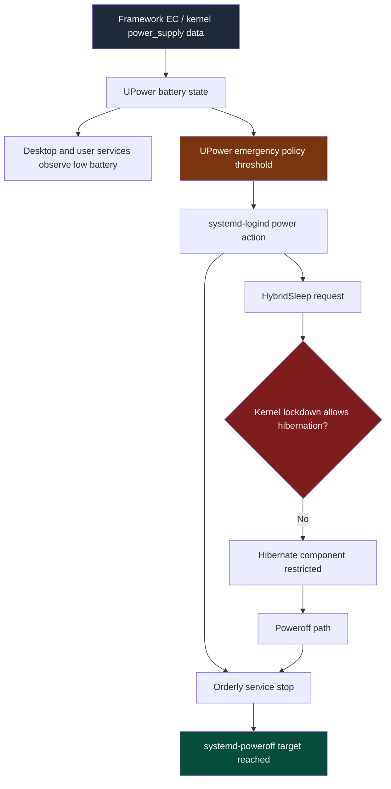

# Framework False Battery Shutdown: Kernel Lockdown and Power Policy Deep Dive

This report analyzes a laptop shutdown that first looked like a crash but was recorded by the operating system as a clean `systemd-logind` poweroff. The incident is useful because it connects several low-level Linux subsystems that are usually debugged separately: UPower battery policy, `systemd-logind` shutdown handling, kernel lockdown under Secure Boot, Framework embedded-controller access, and user-session services that merely observed the bad battery state.

> [!summary]
> - The machine did not hard-crash. Journald recorded an orderly poweroff from `systemd-logind` at `2026-06-18 20:15:31` and a new boot at `20:16`.
> - The likely trigger was a false low or critical battery reading. `tracker-miner-f` paused for low battery seconds before `logind` powered the system off, while the battery later reported `74%` and charging.
> - The configured emergency action was `CriticalPowerAction=HybridSleep`; Secure Boot enabled kernel lockdown, and lockdown restricts hibernation paths used by hybrid sleep.
> - The durable fix is not one setting. It is a policy change away from `HybridSleep`, reduction of unnecessary background services, firmware/EC investigation, and better monitoring for future false battery telemetry.

## Why this report exists

The immediate user-visible event was abrupt: the machine shut down and then came back after a reboot. The important diagnostic distinction is that Linux preserved enough journal data to show a controlled shutdown sequence. A controlled shutdown has different causes and different remedies than a kernel panic, GPU reset, thermal cutoff, or sudden power loss.

The incident also exposed a configuration hazard. UPower was configured to take `HybridSleep` at the action threshold. On a Secure Boot system, the kernel may enter lockdown mode. Lockdown restricts hibernation because resume-from-disk can reintroduce kernel memory state from persistent storage. If the system believes the battery is at the emergency threshold and the configured action uses hibernation, the failure mode can become destructive even when the battery reading itself is false.

## Evidence summary

The first command established the timeline:

```text
Now: 2026-06-18T20:19:30-04:00
Uptime: up 3 minutes

Last boots/shutdowns:
runlevel (to lvl 5)   6.8.0-124-generi Thu Jun 18 20:16   still running
reboot   system boot  6.8.0-124-generi Thu Jun 18 20:16   still running
shutdown system down  6.8.0-124-generi Thu Jun 18 20:15 - 20:16  (00:00)
```

The previous boot journal then showed a normal poweroff path:

```text
Jun 18 20:15:31 f systemd-logind[2060]: The system will power off now!
Jun 18 20:15:31 f systemd-logind[2060]: System is powering down.
Jun 18 20:15:42 f systemd[1]: Finished systemd-poweroff.service - System Power Off.
Jun 18 20:15:42 f systemd[1]: Reached target poweroff.target - System Power Off.
Jun 18 20:15:42 f systemd[1]: Shutting down.
Jun 18 20:15:42 f systemd-shutdown[1]: Syncing filesystems and block devices.
```

Seconds before the shutdown, a user-session indexer logged that it had observed a low battery state:

```text
Jun 18 20:15:11 f tracker-miner-f[3447807]: Running on LOW Battery, pausing
```

The current battery state after reboot contradicted the idea that the battery had actually been empty:

```text
state:               charging
warning-level:       none
energy:              37.9148 Wh
energy-full:         50.8662 Wh
energy-rate:         22.6072 W
time to full:        34.4 minutes
percentage:          74%
capacity:            92.4692%
```

The kernel log around the same period contained repeated Framework embedded-controller communication errors:

```text
cros_ec_lpcs cros_ec_lpcs.0: bad packet checksum 4d
fw-fanctrl[3704426]: EC result 7 (INVALID_CHECKSUM)
cros_ec_lpcs cros_ec_lpcs.0: packet too long (36226 bytes, expected 32)
Lockdown: ectool: raw io port access is restricted; see man kernel_lockdown.7
```

The hibernation path was also restricted:

```text
Lockdown: systemd-logind: hibernation is restricted; see man kernel_lockdown.7
```

These facts support one conclusion more strongly than the alternatives: the system believed it had reached a critical power condition, attempted a configured emergency policy, and completed a clean poweroff. The false reading is the root trigger; the policy and lockdown behavior explain why the response was disruptive.

## The shutdown path

The shutdown path can be described as a sequence of state transitions. The details matter because each subsystem has a different responsibility and a different remediation surface.



The embedded controller and kernel `power_supply` interfaces provide the raw data. UPower converts those readings into policy states such as low, critical, and action-level. User-session services can observe the same state and change their behavior; `tracker-miner-f` did this by pausing indexing. That observation is diagnostically useful, but it is not a cause of shutdown. The shutdown authority was `systemd-logind`, which logged that the system would power off.

The configured emergency action was recorded in `/etc/UPower/UPower.conf`:

```ini
UsePercentageForPolicy=true
PercentageLow=20
PercentageCritical=5
PercentageAction=2
CriticalPowerAction=HybridSleep
```

The same file documents the accepted actions:

```ini
# Possible values are:
# PowerOff
# Hibernate
# HybridSleep
#
# If HybridSleep isn't available, Hibernate will be used
# If Hibernate isn't available, PowerOff will be used
```

This matters because `Suspend` and `deep sleep` are not valid UPower critical actions in this configuration. Deep sleep is a kernel suspend-to-RAM mode selected under `/sys/power/mem_sleep`, not a UPower emergency action string.

## Secure Boot, kernel lockdown, and hibernation

Secure Boot verifies the boot chain before Linux starts. On Ubuntu systems, Secure Boot commonly causes the kernel to enter lockdown mode. Lockdown restricts operations that would let a process, including a privileged process, alter or inspect kernel state in ways that undermine the boot-chain trust model.

The incident produced two lockdown-related messages:

```text
Lockdown: ectool: raw io port access is restricted; see man kernel_lockdown.7
Lockdown: systemd-logind: hibernation is restricted; see man kernel_lockdown.7
```

The first message concerns raw hardware access. Tools such as `ectool` and Framework EC tooling may need low-level access to the embedded controller. Under lockdown, raw I/O paths are restricted unless the access path is mediated by accepted kernel interfaces.

The second message concerns hibernation. Hibernation writes a memory image to persistent storage and later resumes from it. Under kernel lockdown, this is restricted because the resume image becomes part of the trusted kernel execution state. If the image is not protected according to the kernel's security expectations, resuming from it would bypass part of the trust chain that Secure Boot is intended to enforce.

Normal suspend-to-RAM is a different mechanism. The system reported:

```text
/sys/power/state: freeze mem
/sys/power/mem_sleep: s2idle [deep]
SecureBoot enabled
```

The bracketed value indicates the active memory sleep mode. In this case, normal `systemctl suspend` should use `mem` with `deep` selected. That path is not the hibernation path that appeared in the lockdown log. The problem is specifically `HybridSleep`, because hybrid sleep includes a hibernation component.

## Why `tracker-miner-f` appeared in the logs

`tracker-miner-f` is GNOME Tracker's filesystem indexer, usually represented by the user service `tracker-miner-fs-3.service`. It scans files and metadata for GNOME search. On an i3 session it is often unnecessary, but it can still run because packages and user unit presets are installed independently of the current window manager.

In this incident, the important line was:

```text
tracker-miner-f[3447807]: Running on LOW Battery, pausing
```

That line shows that the low-battery state was visible to ordinary user-session software before the poweroff. It does not show that Tracker initiated the shutdown. The actor that initiated the shutdown was `systemd-logind`, as shown by:

```text
systemd-logind[2060]: The system will power off now!
```

After the incident, the Tracker and speech-dispatcher user units were disabled for this user by masking them locally:

```text
tracker-miner-fs-3.service  masked, inactive
speech-dispatcher.socket    masked, inactive
```

Masking was necessary because the unit files were enabled globally. A per-user disable was insufficient: systemd reported that the unit files were still enabled in global scope and could still be started automatically.

## Service cleanup performed and pending

The first cleanup removed two user-session services that were not needed for the current i3 workflow:

```bash
systemctl --user mask --now tracker-miner-fs-3.service speech-dispatcher.socket
```

The resulting state was:

```text
UNIT FILE                  STATE  PRESET
tracker-miner-fs-3.service masked enabled
speech-dispatcher.socket   masked enabled

User active states:
inactive
inactive
```

Several system services were identified as optional for this machine, but they could not be disabled through the non-interactive agent environment because `sudo` required a terminal password:

```text
bluetooth.service            enabled enabled
gnome-remote-desktop.service enabled enabled
ModemManager.service         enabled enabled
```

The intended manual command is:

```bash
sudo systemctl disable --now gnome-remote-desktop.service bluetooth.service ModemManager.service
```

This cleanup does not solve the false battery reading by itself. It reduces unrelated background activity and removes services that were not useful in the current desktop environment. The false telemetry path remains an EC, firmware, kernel-driver, or polling interaction issue until proven otherwise.

## Failure-mode analysis

The strongest evidence points to a false battery telemetry event. A real critical battery event would be consistent with UPower policy and `logind` poweroff, but it is inconsistent with the post-reboot battery state of `74%` charging and with the user's confirmation that the reading was false.

The repeated EC errors are relevant because they occurred near the incident window and appeared frequently in the previous boot's kernel tail:

```text
cros_ec_lpcs cros_ec_lpcs.0: bad packet checksum 98
cros_ec_lpcs cros_ec_lpcs.0: packet too long (512 bytes, expected 32)
fw-fanctrl: EC result 7 (INVALID_CHECKSUM)
Lockdown: ectool: raw io port access is restricted
```

The errors do not prove that `fw-fanctrl` caused the false battery reading. They do prove that EC communication was noisy enough to be a serious suspect. The Framework EC is involved in platform telemetry, and user-space tools that poll or command the EC can compete with kernel interfaces or expose firmware bugs. A careful investigation should compare kernel logs with and without `fw-fanctrl` enabled.

The hibernation restriction is a separate but compounding issue. A false critical reading should still lead to a safe, predictable emergency action. `HybridSleep` was a poor action for this system because it depends on hibernation, and hibernation was restricted by lockdown. A safer policy is to avoid hibernation-dependent emergency actions unless hibernation is deliberately configured and tested under Secure Boot.

## Recommended configuration changes

The first change is to replace `HybridSleep` as the UPower critical action. The least surprising setting is:

```ini
CriticalPowerAction=PowerOff
```

This does not prevent a false reading from being disruptive, but it removes the ambiguous hibernation path. A clean poweroff is destructive to unsaved work, but it is a valid documented action and does not depend on lockdown-sensitive hibernate resume mechanics.

A second possible change is to make the action threshold harder to hit:

```ini
PercentageLow=20
PercentageCritical=5
PercentageAction=1
```

This is a tradeoff. Lowering `PercentageAction` reduces the probability that a transient false low reading trips the emergency action, but it also leaves less time when the battery is genuinely depleted. It should not be used as the only mitigation.

A third option is to switch from percentage-based policy to time-based policy:

```ini
UsePercentageForPolicy=false
TimeLow=1200
TimeCritical=300
TimeAction=120
```

This helps only if the false reading is isolated to percentage or capacity reporting. If the EC reports a false energy rate, false energy-now value, or false capacity level, time-based policy may still become wrong. The better default is to keep percentage policy unless logs show that percentage is uniquely unreliable.

## Firmware and EC investigation plan

The most important preventive work is firmware and EC validation. The commands are straightforward:

```bash
fwupdmgr refresh --force
fwupdmgr get-updates
fwupdmgr update
```

After firmware is current, the next test is to observe whether EC checksum errors continue under normal use:

```bash
journalctl -k -f | grep -Ei 'cros_ec|checksum|packet too long|ectool|fw-fanctrl'
```

If the errors continue and false readings recur, temporarily disable Framework fan-control tooling:

```bash
sudo systemctl disable --now fw-fanctrl.service
```

Then repeat the same kernel-log watch. A useful result would be a clear before-and-after comparison:

| Test condition | Expected observation | Interpretation |
|---|---|---|
| `fw-fanctrl` enabled | EC checksum errors continue | Fan-control polling remains a suspect. |
| `fw-fanctrl` disabled | EC checksum errors stop or sharply decrease | Fan-control interaction is likely involved. |
| `fw-fanctrl` disabled | EC checksum errors continue | Firmware, kernel driver, or another EC client remains a suspect. |
| Firmware updated | False readings stop | Firmware bug or EC state issue was likely fixed. |

This test should be run long enough to cover ordinary workloads, charging transitions, suspend/resume cycles, and unplug/replug events. One clean minute is not enough evidence.

## Battery telemetry logging

If the problem recurs, the most useful artifact is a local time-series log of battery state. This loop records the kernel `power_supply` view every ten seconds:

```bash
while true; do
  date -Is
  cat /sys/class/power_supply/BAT1/capacity
  cat /sys/class/power_supply/BAT1/status
  cat /sys/class/power_supply/BAT1/capacity_level
  sleep 10
done | tee ~/battery-watch.log
```

A more complete version should capture energy and power fields when they exist:

```bash
while true; do
  printf '%s ' "$(date -Is)"
  for f in capacity capacity_level status energy_now energy_full power_now voltage_now; do
    if [ -r "/sys/class/power_supply/BAT1/$f" ]; then
      printf '%s=%s ' "$f" "$(cat "/sys/class/power_supply/BAT1/$f")"
    fi
  done
  printf '\n'
  sleep 10
done | tee ~/battery-watch.log
```

The log should be correlated with kernel messages:

```bash
journalctl -k --since '2026-06-18 19:30' --until '2026-06-18 20:16' \
  | grep -Ei 'cros_ec|checksum|packet too long|battery|power|hibernate|lockdown'
```

The goal is to distinguish three cases:

- The capacity value jumps to a low value and then returns to normal.
- The capacity value stays normal, but UPower derives a low state from another field.
- The kernel values stay normal, but user-space policy receives or caches a wrong value.

Each case points to a different layer.

## Working rules for this machine

The current working rules are deliberately conservative:

- Use `systemctl suspend` for normal sleep, because the system reports `mem` sleep support and currently selects `deep` mode.
- Do not use `HybridSleep` as the emergency battery action while Secure Boot lockdown restricts hibernation.
- Treat `tracker-miner-f` as an observer, not the shutdown cause. It can be disabled for i3 cleanliness, but it is not the policy engine.
- Treat EC checksum errors as actionable evidence. They should be measured before and after firmware updates or `fw-fanctrl` changes.
- Keep service cleanup separate from power-policy debugging. Disabling unused services reduces noise but should not be credited as a battery telemetry fix unless it changes the EC error pattern.

## Open questions

The incident leaves several questions that require new data:

- Did UPower receive a false percentage, false time remaining, false capacity level, or a transient device-state change?
- Does `fw-fanctrl` increase EC checksum errors, or are the errors present without it?
- Is the Framework BIOS and EC firmware fully current?
- Does normal suspend with `deep` selected resume reliably across repeated cycles?
- Would changing `CriticalPowerAction=PowerOff` and lowering `PercentageAction` sufficiently reduce risk, or is a custom debounced low-battery watcher needed?

## Recommended next steps

1. Change `/etc/UPower/UPower.conf` from `CriticalPowerAction=HybridSleep` to `CriticalPowerAction=PowerOff`, then restart UPower.
2. Run `fwupdmgr get-updates` and apply available Framework firmware updates.
3. Manually disable unused system services that required interactive `sudo`: `gnome-remote-desktop.service`, `bluetooth.service`, and `ModemManager.service`.
4. Monitor kernel EC errors for at least one normal work session.
5. If EC errors continue, temporarily disable `fw-fanctrl.service` and compare logs.
6. If another false reading occurs, preserve `~/battery-watch.log` and the matching `journalctl -b` window before reboot logs rotate.

## Key points

- A clean `systemd-logind` poweroff is not the same failure class as a kernel panic or hard power loss.
- UPower emergency actions are limited to `PowerOff`, `Hibernate`, and `HybridSleep`; `deep` is a suspend mode, not an emergency action string.
- Secure Boot can enable kernel lockdown, and lockdown restricts hibernation unless the resume path satisfies the kernel's security requirements.
- False battery telemetry should be fixed at the firmware, EC, or polling layer, but the emergency action should also be made robust against false input.
- The incident is best understood as two interacting problems: a false low-battery signal and a poor emergency action for a Secure Boot system.
