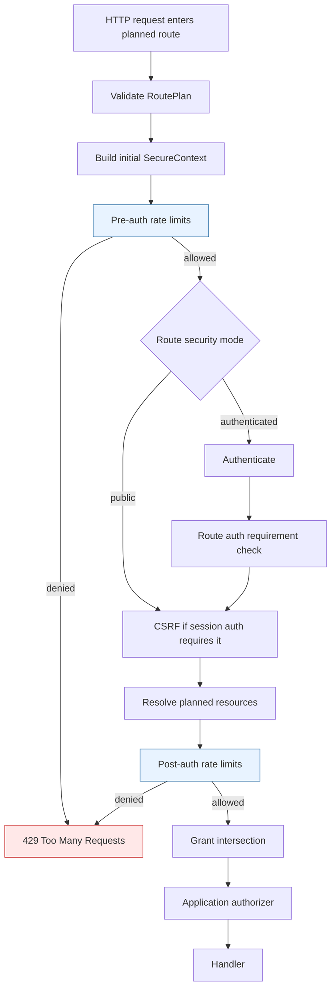
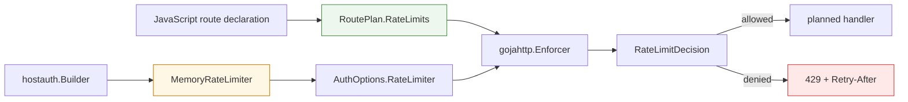

# go-go-goja Planned Route Rate Limiting: Deep Dive

This report explains the planned-route rate limiting work in `go-go-goja`: why it was added, how it is represented in route plans, how it is enforced in `gojahttp.Enforcer`, how JavaScript and Go route authors declare limits, and how generated xgoja hosts receive a default limiter. The source implementation landed primarily in commit `1486dbbba2a840d879c4087be2f28faf67986458` (`gojahttp: add planned route rate limiting`) and was documented in the `XGOJA-PROGRAMMATIC-AUTH-DESIGN` implementation diary.

The important design decision was to treat rate limiting as a route security primitive. It is not a middleware convention, not a handler-local helper, and not a special case for login endpoints. A planned route now carries typed rate-limit policy data in its `RoutePlan`, and the enforcer evaluates that policy as part of the same host-owned pipeline that performs authentication, CSRF checks, resource resolution, authorization, and audit.

> [!summary]
> - Rate limits are compiled into `RoutePlan` as typed `RateLimitSpec` values rather than assembled inside JavaScript handlers.
> - Enforcement is split into pre-auth and post-auth stages so cheap IP/route limits can run before authentication while actor/resource limits run after the relevant context exists.
> - JavaScript authors use fluent Go-owned builders such as `express.rateLimit("public.limited").perMinute(1).byIP().byRoute()`.
> - Generated hostauth services now create a default in-memory limiter, but production hosts can replace it through `gojahttp.AuthOptions.RateLimiter`.

## Why this work exists

The programmatic authentication design made rate limiting impossible to ignore. API tokens, device authorization flows, refresh-token endpoints, and login endpoints are all sensitive to repeated requests. A token endpoint that has no request budget is vulnerable to brute-force and resource-consumption pressure. A device-code polling endpoint that has no request budget can be called too frequently by both legitimate and malicious clients. A public route that performs expensive work can be abused even if it does not require authentication.

The first observation from the design diary was that rate limiting should not be scoped narrowly to token or device endpoints. OWASP API4 is about unrestricted resource consumption across an API surface. Authentication routes are important instances of the problem, but the abstraction belongs at the route level. The same application should be able to declare budgets for public reads, session-user writes, agent calls, tenant-scoped resources, and future native auth endpoints.

The second observation was that JavaScript route handlers are the wrong place to compute limiter bucket keys. Handler code has access to request details, but it should not concatenate security-sensitive key material such as IPs, actor IDs, route templates, tenant IDs, resource IDs, and headers. That work belongs to the host-owned route plan and enforcer. JavaScript should declare intent; Go should normalize, validate, and enforce it.

The third observation was about timing. Some rate-limit keys are available before authentication. The route method, route pattern, remote IP, route parameters, headers, and parsed body fields can be inspected without knowing who the caller is. Other keys require authenticated or resolved context. Actor IDs require authentication. Resource keys require resource resolution. A single limiter pass either runs too early to support actor/resource quotas or too late to protect public and auth-sensitive endpoints. The implementation therefore uses two enforcement stages.

## The route contract before rate limiting

Planned routes in `gojahttp` are not free-form handler registrations. A route registration builds a `RoutePlan`, and that plan is validated before the route can execute. The plan already carried the major security declarations:

```go
type RoutePlan struct {
    Name      string
    Method    string
    Pattern   string
    Security  SecuritySpec
    Resources []ResourceSpec
    Action    string
    CSRF      CSRFSpec
    Audit     AuditSpec
}
```

Rate limiting extended this contract by adding another planned-route field:

```go
type RoutePlan struct {
    Name       string
    Method     string
    Pattern    string
    Security   SecuritySpec
    Resources  []ResourceSpec
    Action     string
    CSRF       CSRFSpec
    Audit      AuditSpec
    RateLimits []RateLimitSpec
}
```

This placement matters. A rate limit declared in the route plan is visible to validation, introspection, generated host wiring, tests, and future route descriptors. It is not hidden inside handler code. It is also evaluated before the handler runs, so a rate-limited request cannot accidentally execute application logic and then discover that it should have been denied.

The implementation files to read first are:

- `/home/manuel/workspaces/2026-06-12/goja-express-auth/go-go-goja/pkg/gojahttp/ratelimit.go`
- `/home/manuel/workspaces/2026-06-12/goja-express-auth/go-go-goja/pkg/gojahttp/enforcer.go`
- `/home/manuel/workspaces/2026-06-12/goja-express-auth/go-go-goja/pkg/gojahttp/auth_plan.go`
- `/home/manuel/workspaces/2026-06-12/goja-express-auth/go-go-goja/modules/express/auth_builders.go`

## The data model

The rate limiting data model is centered on four concepts: a policy, a window, a limit, and a key. The policy names the budget. The window defines the time period. The limit defines how many requests fit into that window. The key determines which requests share the same bucket.

```go
type RateLimitSpec struct {
    Policy   string
    Limit    int
    Window   time.Duration
    Burst    int
    KeyParts []RateLimitKeyPart
    FailOpen bool
}
```

A route can carry multiple `RateLimitSpec` values. That is intentional. A route may need one broad public budget and one narrower authenticated budget. For example, a route could limit all calls from an IP address before authentication and then separately limit each authenticated actor after authentication.

The key is assembled from typed key parts:

```go
type RateLimitKeyPart struct {
    Kind RateLimitKeyKind
    Key  string
}
```

The supported key kinds are:

```go
const (
    RateLimitKeyIP          RateLimitKeyKind = "ip"
    RateLimitKeyRoute       RateLimitKeyKind = "route"
    RateLimitKeyActor       RateLimitKeyKind = "actor"
    RateLimitKeyParam       RateLimitKeyKind = "param"
    RateLimitKeyTenantParam RateLimitKeyKind = "tenantParam"
    RateLimitKeyHeader      RateLimitKeyKind = "header"
    RateLimitKeyBodyField   RateLimitKeyKind = "bodyField"
    RateLimitKeyResource    RateLimitKeyKind = "resource"
)
```

This set is deliberately concrete. The route author does not supply a string interpolation template. The author selects normalized dimensions that the enforcer understands. This keeps the route declaration expressive without moving key construction into JavaScript.

### What each key part means

| Key part | Available stage | Meaning |
|---|---:|---|
| `ip` | pre-auth | The request IP from `RequestDTO.IP` or `http.Request.RemoteAddr`. |
| `route` | pre-auth | The normalized method and route pattern, such as `GET /limited`. |
| `param` | pre-auth | A named route parameter from the router match. |
| `tenantParam` | pre-auth | A route parameter that is semantically a tenant key. |
| `header` | pre-auth | A canonicalized request header. |
| `bodyField` | pre-auth | A field from the parsed request body when available. |
| `actor` | post-auth | The authenticated actor kind and ID. |
| `resource` | post-auth | A resolved resource by name from `SecureContext.Resources`. |

The design does not assume that all limits are identity-based. Public APIs need IP and route limits. Authenticated APIs often need actor, tenant, and resource limits. The typed key model supports both.

## Validation and normalization

A rate-limit declaration is validated during route-plan validation. This gives invalid route declarations an early failure mode. A route with an unknown route parameter in a limiter key should not start serving traffic.

The validation function is `normalizeRateLimitSpec` in `pkg/gojahttp/ratelimit.go`. It performs several operations:

1. It trims the policy name.
2. It derives a default policy name from method and pattern when no policy is provided.
3. It requires a positive `Limit`.
4. It requires a positive `Window`.
5. It rejects negative burst values.
6. It supplies a default key of route plus IP when no key parts are provided.
7. It validates key-specific requirements.

The validation rules are important because they define what JavaScript route authors can and cannot express. A route parameter key must name a parameter that exists in the route pattern. A header key is canonicalized. A resource key must name a resource because resources live in a map by logical route resource name.

A simplified version of the validation logic is:

```go
func normalizeRateLimitSpec(plan RoutePlan, spec RateLimitSpec) (RateLimitSpec, error) {
    spec.Policy = strings.TrimSpace(spec.Policy)
    if spec.Policy == "" {
        spec.Policy = strings.ToLower(plan.Method + " " + plan.Pattern)
    }
    if spec.Limit <= 0 {
        return RateLimitSpec{}, error("positive limit required")
    }
    if spec.Window <= 0 {
        return RateLimitSpec{}, error("positive window required")
    }
    if len(spec.KeyParts) == 0 {
        spec.KeyParts = []RateLimitKeyPart{{Kind: Route}, {Kind: IP}}
    }

    for each key part:
        trim key
        validate key requirements
        canonicalize header names

    return spec, nil
}
```

The default key matters. If a route author writes a minimal limit, the route should not collapse all callers into one global bucket unless that is explicit. The default route-plus-IP key is a safer development default because it isolates callers by route and IP.

## Pre-auth and post-auth stages

The central technical idea in this implementation is staged enforcement. The stage is inferred from the key parts. If a spec includes `actor` or `resource`, it must run after authentication and resource resolution. Otherwise it can run before authentication.

```go
func rateLimitStage(spec RateLimitSpec) RateLimitStage {
    for _, part := range spec.KeyParts {
        switch part.Kind {
        case RateLimitKeyActor, RateLimitKeyResource:
            return RateLimitStagePostAuth
        case RateLimitKeyIP, RateLimitKeyRoute, RateLimitKeyParam,
             RateLimitKeyTenantParam, RateLimitKeyHeader,
             RateLimitKeyBodyField:
            continue
        }
    }
    return RateLimitStagePreAuth
}
```

The exhaustive linter forced this switch to enumerate every known key kind. That was a useful constraint. It makes the stage decision explicit when a new key kind is added. If a future implementation adds `RateLimitKeyCredential`, the compiler and linter should force the author to decide whether it is pre-auth or post-auth.

The enforcer calls the limiter twice:

```go
sec := &SecureContext{...}
checkRateLimits(..., RateLimitStagePreAuth)

authenticate
check route auth requirements
verify CSRF if needed
resolve resources

sec.Resource = firstPlannedResource(...)
checkRateLimits(..., RateLimitStagePostAuth)

check grants
authorize
```

This order is significant. Pre-auth limits protect the system before expensive or sensitive work begins. Post-auth limits run after the enforcer has the actor and resource context needed for finer quotas.



## Limiter interface

The host owns the limiter backend through `AuthOptions.RateLimiter`:

```go
type RateLimiter interface {
    CheckRateLimit(ctx context.Context, req RateLimitRequest) (RateLimitDecision, error)
}
```

The request passed to a limiter contains the normalized key and enough metadata for observability or advanced backends:

```go
type RateLimitRequest struct {
    HTTPRequest *http.Request
    Request     *RequestDTO
    Plan        RoutePlan
    Spec        RateLimitSpec
    Stage       RateLimitStage
    Key         string
    KeyParts    map[string]string
    Actor       *Actor
    Resource    *ResourceRef
    Resources   map[string]*ResourceRef
}
```

The decision type allows the limiter to report retry and budget metadata:

```go
type RateLimitDecision struct {
    Allowed    bool
    RetryAfter time.Duration
    Reason     string
    Limit      int
    Remaining  int
    ResetAt    time.Time
}
```

The first implementation includes an in-memory fixed-window limiter. The interface is intentionally more general than the memory implementation. Production deployments can implement a Redis-backed or database-backed limiter without changing route declarations.

## MemoryRateLimiter

`MemoryRateLimiter` is a small fixed-window implementation for tests, examples, and local generated hosts. It is not a distributed production limiter. Its job is to make the route primitive usable immediately while keeping the backend replaceable.

The limiter stores buckets in memory:

```go
type MemoryRateLimiter struct {
    mu      sync.Mutex
    now     func() time.Time
    buckets map[string]memoryRateBucket
}

type memoryRateBucket struct {
    windowStart time.Time
    count       int
}
```

The bucket key is the policy name plus the normalized route key:

```go
bucketKey := req.Spec.Policy + "|" + req.Key
```

The algorithm is fixed-window counting:

```go
func CheckRateLimit(req RateLimitRequest) RateLimitDecision {
    limit := effectiveRateLimit(req.Spec)
    if limit <= 0 || req.Spec.Window <= 0 {
        return Allowed
    }

    bucket := buckets[policy + "|" + key]
    if bucket is absent or expired or from the future {
        bucket = new bucket starting now
    }

    resetAt := bucket.windowStart + spec.Window
    if bucket.count >= limit {
        return Denied with RetryAfter = resetAt - now
    }

    bucket.count++
    store bucket
    return Allowed with Remaining = limit - bucket.count
}
```

`Burst` is implemented as an addition to the limit:

```go
func effectiveRateLimit(spec RateLimitSpec) int {
    if spec.Limit <= 0 {
        return 0
    }
    if spec.Burst > 0 {
        return spec.Limit + spec.Burst
    }
    return spec.Limit
}
```

This is not a token-bucket burst model. It is a simple fixed-window allowance. That is adequate for a development backend and keeps the first implementation easy to test. If production needs precise burst semantics, the `RateLimiter` interface can support that in a different backend.

## Key construction

The enforcer builds a deterministic key from key parts. It first evaluates every declared part into a map, then sorts the part names, and finally joins them into a stable string.

```go
func buildRateLimitKey(...) (string, map[string]string) {
    parts := map[string]string{}
    for _, part := range spec.KeyParts {
        name := rateLimitPartName(part)
        parts[name] = rateLimitPartValue(..., part)
    }

    keys := sorted map keys
    segments := []string{}
    for _, key := range keys {
        segments = append(segments, key+"="+parts[key])
    }
    return strings.Join(segments, "|"), parts
}
```

The stable ordering makes tests deterministic and helps operations. The limiter backend receives both the final key string and the key-parts map. A backend can use the string directly, or it can log/inspect the individual dimensions.

Example key for a public route:

```text
ip=192.0.2.50|route=GET /limited
```

Example key for an authenticated route:

```text
actor=user:u1|route=POST /me/run
```

Example key for a resource-aware route:

```text
actor=agent:agt_123|resource:project=project:p1
```

Missing values do not panic. They normalize to strings such as `missing`, `anonymous`, or `unknown`. This is important because limiter enforcement should fail predictably. Validation catches invalid declarations; runtime key extraction handles absent runtime values in a deterministic way.

## Error handling, Retry-After, and audit

When a limiter denies a request, the enforcer returns `RateLimitError`. This error implements `Is` so `errors.Is(err, ErrRateLimited)` works.

```go
type RateLimitError struct {
    Policy     string
    RetryAfter time.Duration
    Reason     string
}

func (e *RateLimitError) Is(target error) bool {
    return target == ErrRateLimited
}
```

`statusForAuthError` maps `ErrRateLimited` to `429 Too Many Requests`. The planned HTTP error writer also sets the `Retry-After` header when the limiter provides a positive retry duration:

```go
if rateErr := (*RateLimitError)(nil); errors.As(err, &rateErr) && rateErr.RetryAfter > 0 {
    w.Header().Set("Retry-After", strconv.Itoa(int(rateErr.RetryAfter.Seconds()+0.999)))
}
```

Audit integration adds rate-limit metadata when an audit event exists for the route. The enforcer records the policy name and retry-after seconds, but it does not expose raw bucket keys as audit attributes. This is a useful redaction boundary: policy names are operationally useful, while bucket keys may contain IP addresses, user IDs, tenant IDs, or header values.

```go
if errors.As(err, &rateErr) {
    attributes["rateLimitPolicy"] = rateErr.Policy
    attributes["retryAfterSeconds"] = ceil(rateErr.RetryAfter.Seconds())
}
```

## Go route API

Go route authors use `gojahttp.RateLimit(policy)` to build `RateLimitSpec` values:

```go
app.Get("/limited").
    Public().
    RateLimit(gojahttp.RateLimit("public").PerMinute(1).ByIP().ByRoute().Spec()).
    HandleJSON(func(ctx context.Context, sec *gojahttp.SecureContext) (any, error) {
        return map[string]any{"ok": true}, nil
    })
```

The Go builder exposes the same key concepts as the underlying data model:

```go
func RateLimit(policy string) RateLimitBuilder
func (b RateLimitBuilder) Limit(count int, window time.Duration) RateLimitBuilder
func (b RateLimitBuilder) PerSecond(count int) RateLimitBuilder
func (b RateLimitBuilder) PerMinute(count int) RateLimitBuilder
func (b RateLimitBuilder) PerHour(count int) RateLimitBuilder
func (b RateLimitBuilder) Burst(count int) RateLimitBuilder
func (b RateLimitBuilder) ByIP() RateLimitBuilder
func (b RateLimitBuilder) ByRoute() RateLimitBuilder
func (b RateLimitBuilder) ByActor() RateLimitBuilder
func (b RateLimitBuilder) ByParam(param string) RateLimitBuilder
func (b RateLimitBuilder) ByTenantParam(param string) RateLimitBuilder
func (b RateLimitBuilder) ByHeader(header string) RateLimitBuilder
func (b RateLimitBuilder) ByBodyField(field string) RateLimitBuilder
func (b RateLimitBuilder) ByResource(name string) RateLimitBuilder
func (b RateLimitBuilder) FailOpen(value bool) RateLimitBuilder
func (b RateLimitBuilder) Spec() RateLimitSpec
```

The staged Go route builder accepts `.RateLimit(...)` both before and after `.Allow(...)`. That mirrors audit and CSRF. A route author can attach rate limits while still building the route security contract, and the accumulated plan is validated when registered.

## JavaScript Express API

JavaScript route authors use a Go-owned builder object:

```javascript
app.get("/limited")
  .public()
  .rateLimit(express.rateLimit("public.limited").perMinute(1).byIP().byRoute())
  .handle((_ctx, res) => res.json({ ok: true }));
```

The important property is that `.rateLimit(...)` does not accept arbitrary JavaScript maps. `express.rateLimit("...")` returns an object whose state is stored by Go in `builderStore.rateLimitSpecs`. When `.rateLimit(...)` is called, the Express binding checks that the object came from the rate-limit builder. A plain object such as `{ policy: "bad", limit: 1 }` is rejected.

This follows the same API design used elsewhere in `go-go-goja` planned routes:

- `express.user()` returns a Go-owned auth spec builder.
- `express.resource("project")` returns a Go-owned resource spec builder.
- `express.rateLimit("policy")` returns a Go-owned rate-limit spec builder.

The JavaScript-facing API includes:

```typescript
export function rateLimit(policy: string): RateLimitBuilder;

export interface RateLimitBuilder {
  limit(count: number, window: string): RateLimitBuilder;
  window(duration: string): RateLimitBuilder;
  perSecond(count: number): RateLimitBuilder;
  perMinute(count: number): RateLimitBuilder;
  perHour(count: number): RateLimitBuilder;
  burst(count: number): RateLimitBuilder;
  byIP(): RateLimitBuilder;
  byRoute(): RateLimitBuilder;
  byActor(): RateLimitBuilder;
  byParam(param: string): RateLimitBuilder;
  byTenantParam(param: string): RateLimitBuilder;
  byHeader(header: string): RateLimitBuilder;
  byBodyField(field: string): RateLimitBuilder;
  byResource(name: string): RateLimitBuilder;
  failOpen(value: boolean): RateLimitBuilder;
}
```

This gives JavaScript authors enough vocabulary to express useful policies without exposing the internal key-building algorithm.

## Generated host wiring

Generated hostauth services now create a default in-memory limiter:

```go
auditSink := audit.Sink{Store: stores.Audit}
rateLimiter := gojahttp.NewMemoryRateLimiter()
authOptions := BuildAuthOptions(sessionManager, stores, auditSink, rateLimiter, apiTokenService)
```

The service bundle stores the limiter in `Services.RateLimiter`, and `BuildAuthOptions` assigns it to `gojahttp.AuthOptions.RateLimiter`.

This wiring matters for generated xgoja examples. A JavaScript route can declare `.rateLimit(...)` and run under the generated host without custom Go code. If a host declares rate limits but no limiter is configured, the enforcer fails closed with an internal error. That behavior is deliberate: a route that declares a security budget should not silently run without that budget.

The current default is suitable for development, examples, and smoke tests. A production generated host should eventually support a configured distributed limiter. The route declaration should not need to change when the backend changes.



## Tests and what they prove

The rate limiting work added tests at several levels. Each level proves a different property of the design.

### Route-plan validation tests

`pkg/gojahttp/ratelimit_test.go` includes tests that validate route-plan normalization and rejection of invalid keys. `TestValidateRoutePlanNormalizesRateLimits` proves that policies and parameter keys are normalized. `TestValidateRoutePlanRejectsInvalidRateLimitParam` proves that a limiter key cannot reference a route parameter that does not exist.

This is important because invalid route declarations should fail at registration or validation time, not during live traffic.

### Enforcer tests

`TestEnforcerPreAuthRateLimitDeniesPublicRoute` proves that public routes can be denied before authentication. It sends two requests from the same remote address to a route with limit `1` and verifies that the second request returns `429`.

`TestEnforcerPostAuthRateLimitUsesActor` proves that actor-keyed policies run after authentication. It uses an authenticator that returns actor `u1`, attaches a limit keyed by actor and route, and verifies that the second request is denied.

These tests are the core correctness tests for staged enforcement.

### Express integration tests

`modules/express/ratelimit_integration_test.go` proves that JavaScript declarations compile into route plans and execute through the host. The test registers:

```javascript
app.get("/limited")
  .public()
  .rateLimit(express.rateLimit("public.limited").perMinute(1).byIP().byRoute())
  .handle((_ctx, res) => res.json({ ok: true }));
```

It then verifies that the route descriptor contains `public.limited` and that the second matching request returns `429`.

The same file includes `TestExpressRateLimitRejectsPlainObject`, which proves the builder boundary. A plain JavaScript object passed to `.rateLimit(...)` is rejected. This is a security and maintainability property, not just an API preference.

### Generated-host wiring tests

The hostauth builder tests verify that generated hostauth services include a `RateLimiter` and wire it into `AuthOptions`. This keeps generated xgoja examples usable without hand-written Go host code.

## Design invariants

The implementation establishes several invariants that future work should preserve.

- A route with rate limits must run with a configured limiter. If no limiter exists, the enforcer fails closed.
- JavaScript route authors declare rate limits through builder objects, not arbitrary maps.
- Rate-limit keys are built by Go from typed key parts.
- Pre-auth limits must not depend on actor or resolved resource context.
- Post-auth limits may depend on actor and resolved resources.
- A denied request returns `429 Too Many Requests` and may include `Retry-After`.
- Audit metadata may include policy and retry timing, but should not expose raw bucket keys by default.
- The in-memory limiter is for development and tests; production can replace it through `AuthOptions.RateLimiter`.

These invariants are more important than any individual method name. If future work changes builder names or adds limiter backends, the same enforcement model should remain intact.

## Failure modes and implementation lessons

Two concrete implementation issues appeared during the work.

The first issue came from route descriptors. `RouteDescriptor.RateLimitPolicies` was initially added as a `[]string`. Existing tests compared route descriptors directly, and a slice field makes a Go struct non-comparable. The field was changed to a comma-separated string populated with `strings.Join(...)`. This kept descriptors simple and preserved existing comparison patterns.

The second issue came from the exhaustive linter. The first commit attempt failed because `rateLimitStage` did not explicitly enumerate every `RateLimitKeyKind`. The fix was to list both post-auth key kinds and all pre-auth key kinds in the switch. This made the stage decision more robust.

These were not incidental details. They show how repository constraints shape implementation quality. Comparable descriptors keep tests simple. Exhaustive switches make future key kinds harder to add incorrectly.

## What the system does not solve yet

The implementation creates the route primitive and a development backend. It does not yet provide every production feature.

The current memory limiter is process-local. It does not coordinate across multiple server instances. A production deployment should provide a distributed `RateLimiter`, likely backed by Redis, a database, or another shared service.

The current burst behavior is simple. It adds `Burst` to the fixed-window limit. A future backend may implement token-bucket or leaky-bucket semantics while keeping the same route declaration.

The current default generated-host behavior creates an in-memory limiter. Future generated-host config should allow production limiter configuration and may support default policies injected by host config.

The current audit metadata records the policy and retry timing. It does not include full limiter keys. That is the safer default, but some operators may want structured, redacted key dimensions for debugging. That should be added deliberately, with a redaction policy.

`RateLimitKeyBodyField` exists, but body parsing semantics should be reviewed before it becomes a heavily promoted public API. Body-derived limiter keys depend on when and how request bodies are parsed, size-limited, and normalized.

## Relationship to programmatic auth

Rate limiting was implemented first in the programmatic-auth sequence, before `AuthResult`, agents, API tokens, and route auth restrictions. That ordering was correct. Programmatic credentials increase the need for request budgets, but the rate-limit primitive itself is independent of API tokens.

Once API tokens landed, the post-auth limiter became more valuable. Actor-keyed limits can now apply to token-authenticated agents. The route can declare `express.agent()` and a rate limit keyed by actor and route. The enforcer authenticates the bearer token into an agent `AuthResult`, checks route auth requirements, resolves resources if needed, and then evaluates actor/resource budgets.

This creates a coherent route contract:

```javascript
app.get("/agent/reports/:reportId")
  .auth(express.agent())
  .rateLimit(express.rateLimit("agent.report.read").perMinute(60).byActor().byRoute())
  .allow("report.read")
  .audit("agent.report.read")
  .handle((ctx, res) => {
    res.json({ reportId: ctx.params.reportId, actor: ctx.actor, auth: ctx.auth });
  });
```

The route declaration states four separate facts:

- the caller must be an agent;
- the caller is limited to 60 reads per minute for this route;
- the action is `report.read`;
- the call is audited as `agent.report.read`.

The JavaScript handler does not implement any of those checks. It receives a secure context after the host-owned pipeline succeeds.

## Recommended review path

A reviewer should read the implementation in this order:

1. `pkg/gojahttp/ratelimit.go` for the data model, validation, key construction, and memory limiter.
2. `pkg/gojahttp/enforcer.go` for enforcement ordering, error handling, and audit metadata.
3. `pkg/gojahttp/auth_plan.go` for route-plan integration.
4. `pkg/gojahttp/app.go` for Go builder ergonomics.
5. `modules/express/auth_builders.go` for JavaScript builder state and plain-object rejection.
6. `modules/express/typescript.go` for the JavaScript-facing type surface.
7. `pkg/xgoja/hostauth/builder.go` and `pkg/xgoja/hostauth/services.go` for generated-host wiring.
8. `pkg/gojahttp/ratelimit_test.go` and `modules/express/ratelimit_integration_test.go` for the intended behavior.

The most important thing to verify is not whether the memory limiter is sophisticated. It is intentionally simple. The important thing is whether the route contract, stage ordering, key construction, error mapping, and builder boundaries are correct.

## Future work

The next rate-limit-specific work should be implementation of a production backend and generated-host configuration for it. The current `RateLimiter` interface is sufficient for a first Redis or SQL backend, but the implementation should define clear behavior for clock source, TTL, concurrent increments, and fail-open policy.

A second useful direction is policy defaults. Generated hosts could inject default limits for common auth-sensitive endpoints, and applications could define named policies once rather than repeating numeric budgets in every route. That should not replace route-level declarations; it should complement them.

A third direction is better operational visibility. Rate-limit denials should be easy to observe, but raw keys should not leak sensitive identifiers unnecessarily. A future audit/logging layer can expose structured key dimensions with explicit redaction rules.

A fourth direction is example coverage. The upcoming client-side fetch/auth work should include a server+agent smoke test that uses `express.agent()` and `.rateLimit(...)` together. That example should demonstrate the intended pattern for programmatic agents calling protected routes.

## Key takeaways

Rate limiting became a planned-route primitive because the route plan is the right place to declare security intent. JavaScript route authors should be able to say what budget applies to a route, but Go should validate that declaration, construct bucket keys, choose the enforcement stage, call the limiter backend, map denials to HTTP responses, and record audit metadata.

The two-stage model is the central design. Pre-auth limits protect unauthenticated and public surfaces. Post-auth limits enforce actor and resource budgets. Both stages use the same `RateLimitSpec` model, so route authors do not learn two APIs.

The in-memory limiter is deliberately modest. It proves the interface, enables tests, and supports local generated hosts. The durable design is the `RateLimiter` interface plus `RoutePlan.RateLimits`. That is the part production backends should preserve.
