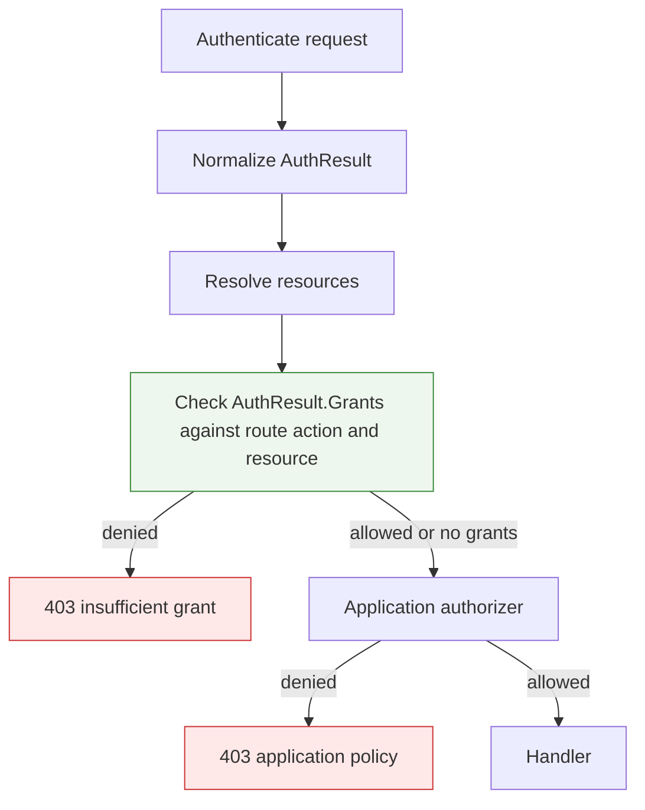
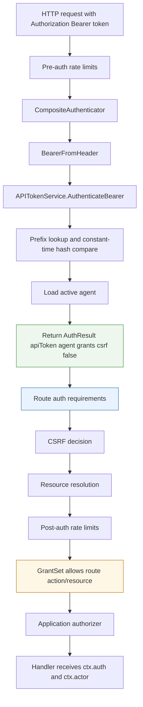
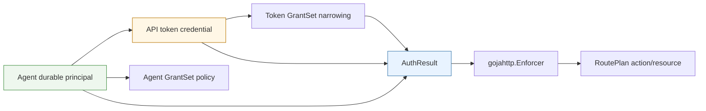

# go-go-goja Programmatic Auth After Rate Limiting: Deep Dive

This report explains the programmatic authentication work that followed the planned-route rate limiter implementation in `go-go-goja`. The rate limiter established an important premise: route security belongs in the compiled route plan and in the host-owned enforcer, not inside JavaScript handlers. The later work applies the same premise to authentication metadata, automation identities, typed grants, API-token credentials, generated-host wiring, JavaScript provisioning builders, and route-level principal restrictions.

The result is a coherent path for agent-based API access. A generated host can create an automation agent, issue an API token, authenticate `Authorization: Bearer ...` requests into a typed `AuthResult`, skip browser CSRF for bearer credentials, enforce grants before application authorization, and restrict specific routes to agent principals or session users. JavaScript still declares intent through fluent builders. Go owns credential parsing, token hashing, route enforcement, resource authorization, redaction, and lifecycle state.

> [!summary]
> - `AuthResult` separates credential metadata from actor identity and gives the enforcer a non-secret representation of how a request authenticated.
> - `GrantSet` and `programauth.Agent` make automation identity explicit: credentials prove possession; agents carry ownership, lifecycle, and policy.
> - API tokens are opaque `ggpat_<prefix>_<secret>` credentials; only hashes are stored, raw values are returned once at issuance, and bearer auth is header-only.
> - Generated hostauth services now carry programauth stores/services and expose fluent JavaScript builders for `auth.grants`, `auth.agents`, and `auth.tokens`.
> - Route auth requirements let routes distinguish agent principals from browser session users before CSRF, resource resolution, authorization, and handler execution continue.

## Why this phase exists

Rate limiting solved request budgets. It did not solve caller identity. A rate-limited route can still only know whether a request is allowed to proceed under a budget; it cannot answer what credential family authenticated the request, which durable principal owns the credential, whether browser CSRF should apply, or which grants constrain the caller. Those questions became the next implementation target.

Before this work, planned-route authentication returned only an `Actor`. That was enough for a browser-session user route, but it was not enough for programmatic access. An API token needs additional metadata: method, principal kind, credential ID, credential hint, grants, scopes, and CSRF behavior. Putting all of that into `Actor.Claims` would mix credential state with principal identity. It would also make JavaScript-visible data the source of route enforcement, which is the opposite of the planned-route design.

The implementation therefore introduced a richer, non-secret authentication result and then built the programmatic-auth model around it. The sequence was deliberate:

1. Add `AuthResult` and redacted `ctx.auth` projection.
2. Add typed grants and durable automation agents.
3. Add API-token issuance, storage, revocation, and bearer authentication.
4. Wire generated hostauth services and expose safe JavaScript builders.
5. Add route auth restrictions for agent/session principal families.

Each step validates one layer before relying on it in the next layer.

## The baseline after rate limiting

After rate limiting, planned routes had a host-owned enforcement pipeline. A route plan could carry auth, resource, action, CSRF, audit, and rate-limit declarations. The enforcer validated the plan, checked pre-auth rate limits, authenticated when required, verified CSRF when appropriate, resolved resources, checked post-auth rate limits, authorized the action, and only then invoked the handler.

The next auth work reused that pipeline. It did not add separate middleware stacks or JavaScript-side checks. This matters because programmatic auth needs consistent ordering. Token grants must be checked after resource resolution, because tenant/resource-constrained grants need a concrete resource. Route principal restrictions must be checked after authentication, because they depend on `AuthResult.Method` and `AuthResult.PrincipalKind`. CSRF must be conditional on authentication method, because browser sessions and bearer API tokens have different CSRF properties.

The key files for this phase are:

- `/home/manuel/workspaces/2026-06-12/goja-express-auth/go-go-goja/pkg/gojahttp/auth_plan.go`
- `/home/manuel/workspaces/2026-06-12/goja-express-auth/go-go-goja/pkg/gojahttp/enforcer.go`
- `/home/manuel/workspaces/2026-06-12/goja-express-auth/go-go-goja/pkg/gojahttp/grants.go`
- `/home/manuel/workspaces/2026-06-12/goja-express-auth/go-go-goja/pkg/gojahttp/auth/programauth/agent.go`
- `/home/manuel/workspaces/2026-06-12/goja-express-auth/go-go-goja/pkg/gojahttp/auth/programauth/token.go`
- `/home/manuel/workspaces/2026-06-12/goja-express-auth/go-go-goja/pkg/xgoja/providers/hostauth/programmatic.go`
- `/home/manuel/workspaces/2026-06-12/goja-express-auth/go-go-goja/modules/express/auth_builders.go`

## AuthResult: credential metadata without secrets

The first post-rate-limiter step was `AuthResult`. The old interface returned an `Actor`. The new optional interface returns an `AuthResult`:

```go
type ResultAuthenticator interface {
    AuthenticateResult(ctx context.Context, req *http.Request, session *SessionDTO, spec SecuritySpec) (AuthResult, error)
}
```

The existing `Authenticator` interface remains supported:

```go
type Authenticator interface {
    Authenticate(ctx context.Context, req *http.Request, session *SessionDTO, spec SecuritySpec) (*Actor, error)
}
```

The enforcer prefers `ResultAuthenticator` when available. If an authenticator only implements the old interface, the enforcer adapts it into a session-user `AuthResult`:

```go
func authenticateResult(ctx context.Context, authenticator Authenticator, req *http.Request, session *SessionDTO, spec SecuritySpec) (AuthResult, error) {
    if resultAuthenticator, ok := authenticator.(ResultAuthenticator); ok {
        return resultAuthenticator.AuthenticateResult(ctx, req, session, spec)
    }
    actor, err := authenticator.Authenticate(ctx, req, session, spec)
    if err != nil {
        return AuthResult{}, err
    }
    if actor == nil {
        return AuthResult{}, ErrUnauthenticated
    }
    return AuthResult{
        Actor: actor,
        Method: AuthMethodSession,
        PrincipalKind: PrincipalKindUser,
        PrincipalID: actor.ID,
        CSRFRequired: true,
    }, nil
}
```

This compatibility adapter is the reason existing session-auth hosts continued to work. The new structure became available to new authenticators without forcing every old authenticator to change at once.

The `AuthResult` type is intentionally non-secret:

```go
type AuthResult struct {
    Actor          *Actor
    Method         AuthMethod
    PrincipalKind  PrincipalKind
    PrincipalID    string
    CredentialID   string
    CredentialHint string
    Grants         GrantSet
    Scopes         []string
    CSRFRequired   bool
}
```

The comment in `auth_plan.go` states the invariant: raw bearer tokens, token hashes, refresh-token identifiers, device codes, and other credentials must never be stored here. `AuthResult` is safe to project into JavaScript and audit metadata because it carries identifiers and hints, not secrets.

## Method and principal kind

`AuthResult` separates how the request authenticated from what kind of principal it represents.

```go
type AuthMethod string

const (
    AuthMethodNone        AuthMethod = "none"
    AuthMethodSession     AuthMethod = "session"
    AuthMethodAPIToken    AuthMethod = "apiToken"
    AuthMethodAccessToken AuthMethod = "accessToken"
)

type PrincipalKind string

const (
    PrincipalKindUser    PrincipalKind = "user"
    PrincipalKindAgent   PrincipalKind = "agent"
    PrincipalKindService PrincipalKind = "service"
)
```

The distinction is necessary. A user can be represented by a browser session today and a future access token later. An agent can authenticate with an API token today and a future OAuth/device credential later. A route may care about the method, the principal kind, or both.

For example:

- A route declared with `express.agent()` cares that the principal kind is `agent`, not necessarily that the credential is an API token.
- A route declared with `express.sessionUser()` cares that the method is `session` and the principal kind is `user`.
- A future route might accept a user access token but reject browser sessions.

The type model keeps those cases expressible without encoding them into ad hoc strings.

## CSRF moves into authentication metadata

Browser session authentication and bearer-token authentication have different CSRF behavior. A browser session relies on cookies and must be protected for unsafe methods. An API token supplied through the `Authorization` header does not need browser-session CSRF verification in the same way.

The implementation encodes this difference in `AuthResult.CSRFRequired`. Legacy session authentication adapts to `CSRFRequired: true`. API-token authentication returns `CSRFRequired: false`.

The enforcer then checks:

```go
if plan.CSRF.Required && isUnsafeMethod(httpReq.Method) && shouldVerifyCSRF(plan.Security.Mode, sec.Auth) {
    verify CSRF
}

func shouldVerifyCSRF(mode SecurityMode, auth AuthResult) bool {
    if mode == SecurityModePublic {
        return true
    }
    return auth.CSRFRequired
}
```

The public-route branch is important. A public unsafe route that declares `.csrf()` still runs CSRF verification, because there is no authenticated result that can opt out. The opt-out applies to authenticated routes whose authenticator explicitly returns `CSRFRequired: false`.

## Redacted ctx.auth projection

`SecureContext` now carries `Auth AuthResult`, and planned JavaScript handlers receive a redacted `ctx.auth` projection. This projection is diagnostic context. It is not the authorization mechanism. Authorization has already happened before the handler runs.

A handler can inspect safe fields:

```javascript
app.get("/agent/reports/:reportId")
  .auth(express.agent())
  .allow("report.read")
  .handle((ctx, res) => {
    res.json({
      method: ctx.auth.method,
      principalKind: ctx.auth.principalKind,
      principalId: ctx.auth.principalId,
      credentialHint: ctx.auth.credentialHint,
      scopes: ctx.auth.scopes
    });
  });
```

The handler never receives the raw bearer token or token hash. The implementation also copies scope slices during normalization and projection so JavaScript cannot mutate host-owned slices.

The main correctness rule is: `ctx.auth` explains the already-authenticated caller; it does not authorize the request. Route authorization remains in the enforcer through grants and the application authorizer.

## Typed grants

The next layer was the permission model for programmatic credentials. The implementation added `gojahttp.Grant` and `gojahttp.GrantSet`:

```go
type Grant struct {
    Action       string
    TenantID     string
    ResourceType string
    ResourceID   string
}

type GrantSet struct {
    Grants []Grant
}
```

A grant is more structured than an OAuth-style scope string. The action is required. Tenant and resource fields are optional constraints. Empty tenant/resource fields act as wildcards for that dimension; populated fields must match exactly. The action `*` is allowed and still respects tenant/resource constraints.

The implementation provides normalization:

```go
func (s GrantSet) Normalize() (GrantSet, error) {
    seen := map[string]Grant{}
    for _, grant := range s.Grants {
        grant = normalizeGrant(grant)
        if grant.Action == "" {
            return GrantSet{}, fmt.Errorf("grant action is required")
        }
        if grant.ResourceID != "" && grant.ResourceType == "" {
            return GrantSet{}, fmt.Errorf("grant action %q resource id requires resource type", grant.Action)
        }
        seen[grant.ScopeString()] = grant
    }
    return sorted unique grants
}
```

It also provides matching:

```go
func (s GrantSet) AllowsResource(action, tenantID, resourceType, resourceID string) bool {
    for _, grant := range s.Grants {
        if grant.Action != "*" && grant.Action != action {
            continue
        }
        if grant.TenantID != "" && grant.TenantID != tenantID {
            continue
        }
        if grant.ResourceType != "" && grant.ResourceType != resourceType {
            continue
        }
        if grant.ResourceID != "" && grant.ResourceID != resourceID {
            continue
        }
        return true
    }
    return false
}
```

This is the internal authority. Scope strings are a projection for storage, logs, protocol boundaries, and JavaScript-safe metadata:

```go
func (g Grant) ScopeString() string {
    parts := []string{}
    if g.TenantID != "" {
        parts = append(parts, "tenant", g.TenantID)
    }
    if g.ResourceType != "" {
        parts = append(parts, "resource", g.ResourceType)
        if g.ResourceID != "" {
            parts = append(parts, g.ResourceID)
        }
    }
    parts = append(parts, g.Action)
    return strings.Join(parts, ":")
}
```

The implementation deliberately keeps typed grants in `gojahttp` rather than only in `programauth`. `AuthResult` needs to carry grants, and putting grants in a subpackage would create dependency pressure in the wrong direction. The core enforcer can understand grants without depending on API-token or agent services.

## Grant enforcement in the enforcer

Once `AuthResult` can carry grants, the enforcer can enforce them. The check happens after resource resolution and before the application authorizer:

```go
sec.Resource = firstPlannedResource(plan, sec.Resources)
if plan.Action != "" && len(sec.Auth.Grants.Grants) > 0 && !sec.Auth.Grants.Allows(plan.Action, sec.Resource) {
    return sec, http.StatusForbidden, fmt.Errorf("%w: insufficient grant for %s", ErrForbidden, plan.Action)
}
```

The placement is precise. The enforcer needs a resolved resource before it can evaluate tenant/resource-bound grants. It must run before the application authorizer and handler so a token with insufficient grants cannot reach application code.

The application authorizer still runs after the grant check. Grants narrow what the credential can request. The application authorizer decides whether the actor is allowed by application policy. Both can deny. A request must pass both.



## Agents: durable automation principals

API tokens should not be the identity. They are credentials. The durable identity is an agent.

The `programauth.Agent` model captures that:

```go
type Agent struct {
    ID          string
    Name        string
    Kind        AgentKind
    OwnerUserID string
    TenantID    string
    DisabledAt  *time.Time
    CreatedBy   string
    CreatedAt   time.Time
    UpdatedAt   time.Time
    Policy      gojahttp.GrantSet
}
```

Supported agent kinds include personal, service, device, CI, and integration agents:

```go
const (
    AgentKindPersonal    AgentKind = "personal"
    AgentKindService     AgentKind = "service"
    AgentKindDevice      AgentKind = "device"
    AgentKindCI          AgentKind = "ci"
    AgentKindIntegration AgentKind = "integration"
)
```

The model gives future administration code concrete lifecycle operations: create an agent, list agents, disable an agent, inspect ownership, inspect tenant association, and inspect policy. It also gives authentication code a stable actor projection:

```go
func (a Agent) Actor() *gojahttp.Actor {
    claims := map[string]any{"name": a.Name, "kind": string(a.Kind)}
    if a.OwnerUserID != "" {
        claims["ownerUserId"] = a.OwnerUserID
    }
    if a.TenantID != "" {
        claims["tenantId"] = a.TenantID
    }
    return &gojahttp.Actor{
        ID: a.ID,
        Kind: string(gojahttp.PrincipalKindAgent),
        TenantIDs: tenantIDs(a.TenantID),
        Claims: claims,
    }
}
```

The agent service rejects disabled agents for active-auth use:

```go
func (s AgentService) GetAgent(ctx context.Context, id string) (Agent, error) {
    agent, err := s.Store.GetAgent(ctx, strings.TrimSpace(id))
    if err != nil {
        return Agent{}, err
    }
    if agent.Disabled() {
        return Agent{}, ErrAgentDisabled
    }
    return agent, nil
}
```

This gives disablement immediate effect for future token authentications. A stored token can still exist, but authentication fails when the agent is disabled.

## API tokens: opaque credentials backed by agents

With `AuthResult`, grants, and agents in place, the first credential family could be implemented. API tokens are opaque bearer credentials. The format is:

```text
ggpat_<prefix>_<secret>
```

The prefix exists for lookup and diagnostics. It is not sufficient for authentication. The secret is random. The stored record keeps only the token hash and redacted metadata:

```go
type APIToken struct {
    ID            string
    Name          string
    AgentID       string
    SubjectUserID string
    TokenHash     []byte
    TokenPrefix   string
    CreatedBy     string
    CreatedAt     time.Time
    UpdatedAt     time.Time
    ExpiresAt     *time.Time
    LastUsedAt    *time.Time
    RevokedAt     *time.Time
    Grants        gojahttp.GrantSet
}
```

The list/detail projection omits the raw value and hash:

```go
type APITokenView struct {
    ID             string
    Name           string
    AgentID        string
    SubjectUserID  string
    TokenPrefix    string
    CredentialHint string
    CreatedBy      string
    CreatedAt      time.Time
    UpdatedAt      time.Time
    ExpiresAt      *time.Time
    LastUsedAt     *time.Time
    RevokedAt      *time.Time
    Scopes         []string
}
```

Only issuance returns the raw token value:

```go
type IssuedAPIToken struct {
    Token APITokenView
    Value string
}
```

This boundary is one of the most important security properties in the implementation. Store records need hashes. Admin/list APIs need redacted metadata. The raw token is returned once so the caller can store it in a secret manager or local credential file. Later list/revoke calls do not expose it.

## Token hashing and prefix lookup

The default hasher is SHA-256:

```go
type SHA256TokenHasher struct{}

func (SHA256TokenHasher) HashAPIToken(raw string) ([]byte, error) {
    sum := sha256.Sum256([]byte(raw))
    return sum[:], nil
}
```

The implementation also supports an HMAC hasher with a pepper:

```go
type HMACTokenHasher struct{ Pepper []byte }
```

Authentication uses prefix lookup plus constant-time hash comparison:

```go
prefix, err := PrefixFromAPIToken(raw)
hash, err := s.hasher().HashAPIToken(raw)
candidates, err := s.Store.FindAPITokenByPrefix(ctx, prefix)

for _, token := range candidates {
    if subtle.ConstantTimeCompare(token.TokenHash, hash) != 1 {
        continue
    }
    check revoked
    check expired
    load agent
    touch token
    return AuthResult{...}
}
```

The prefix narrows the candidate set. It does not authenticate the request. Authentication requires hashing the complete raw token and comparing it with the stored hash in constant time.

## Header-only bearer authentication

The bearer parser accepts only the `Authorization` header. It rejects the `access_token` query parameter, duplicate authorization headers, malformed schemes, and empty tokens:

```go
func BearerFromHeader(r *http.Request) (string, bool, error) {
    if r.URL != nil && r.URL.Query().Has("access_token") {
        return "", false, fmt.Errorf("%w: access_token query parameter is not accepted", gojahttp.ErrUnauthenticated)
    }
    values := r.Header.Values("Authorization")
    if len(values) == 0 {
        return "", false, nil
    }
    if len(values) != 1 {
        return "", false, fmt.Errorf("%w: duplicate authorization header", gojahttp.ErrUnauthenticated)
    }
    fields := strings.Fields(values[0])
    if len(fields) != 2 || !strings.EqualFold(fields[0], "Bearer") || strings.TrimSpace(fields[1]) == "" {
        return "", false, fmt.Errorf("%w: malformed bearer token", gojahttp.ErrUnauthenticated)
    }
    return fields[1], true, nil
}
```

This rule avoids token leakage through URLs, logs, browser history, caches, and referrers. It also makes future credential families inherit a clear transport rule: planned-route bearer credentials belong in the `Authorization` header.

## API-token authentication result

A successful API-token authentication returns an agent-backed `AuthResult`:

```go
return gojahttp.AuthResult{
    Actor:          agent.Actor(),
    Method:         gojahttp.AuthMethodAPIToken,
    PrincipalKind:  gojahttp.PrincipalKindAgent,
    PrincipalID:    agent.ID,
    CredentialID:   token.ID,
    CredentialHint: token.CredentialHint(),
    Grants:         grants,
    Scopes:         grants.ScopeStrings(),
    CSRFRequired:   false,
}, nil
```

This result drives the rest of the planned-route pipeline. `PrincipalKindAgent` allows `express.agent()` routes to admit the caller. `Grants` allow the enforcer to check route action/resource intersection. `CSRFRequired: false` lets token-authenticated unsafe requests skip browser-session CSRF checks. `CredentialHint` can be projected safely into audit and diagnostics.

## Composite bearer/session authentication

Generated and custom hosts often need both session auth and bearer auth. The `CompositeAuthenticator` provides that behavior:

```go
type CompositeAuthenticator struct {
    Session   gojahttp.Authenticator
    APITokens BearerAuthenticator
}
```

The order is intentional. Bearer credentials are checked first. If a bearer token is present, it must authenticate as a bearer token. If no bearer token is present, the authenticator falls back to session authentication.

```go
raw, ok, err := BearerFromHeader(req)
if err != nil {
    return AuthResult{}, err
}
if ok {
    return APITokens.AuthenticateBearer(ctx, raw, spec)
}
return session authentication result
```

This order avoids ambiguous requests. A request with a bad bearer token should not silently become a session request. It should fail as an invalid bearer request.

## Generated hostauth service wiring

After API tokens existed, generated hostauth services needed to own programauth stores and services. `hostauth.Services` now includes:

```go
AgentStore    programauth.AgentStore
APITokenStore programauth.APITokenStore
Agents        programauth.AgentService
APITokens     programauth.APITokenService
```

The builder constructs memory stores and services during hostauth service creation:

```go
agentStore := programauth.NewMemoryAgentStore()
apiTokenStore := programauth.NewMemoryAPITokenStore()
agentService := programauth.AgentService{Store: agentStore, Now: b.options.Now}
apiTokenService := programauth.APITokenService{Store: apiTokenStore, Agents: agentService, Now: b.options.Now}
authOptions := BuildAuthOptions(sessionManager, stores, auditSink, rateLimiter, apiTokenService)
```

`BuildAuthOptions` installs the composite authenticator when a bearer authenticator is available:

```go
if sessionManager != nil {
    options.Authenticator = sessionManager
    options.CSRF = sessionManager
}
if bearer != nil {
    options.Authenticator = programauth.CompositeAuthenticator{Session: sessionManager, APITokens: bearer}
}
```

This keeps session CSRF support intact while allowing bearer-first authentication for planned routes. It also means generated xgoja hosts can issue and authenticate API tokens without hand-written Go host shells.

The initial stores are in-memory. That is acceptable for tests and generated local examples. Production use still needs SQL-backed agent and token stores.

## JavaScript provisioning builders

The `go-go-goja-hostauth` provider now exposes programmatic auth builders:

```javascript
const auth = require("auth");

const grants = auth.grants()
  .tenant("o1")
  .resource("project", "p1")
  .allow("project.read")
  .done();

const issued = auth.agents.create("daily-report-bot")
  .kind("ci")
  .tenantId("o1")
  .createdBy("u1")
  .grants(grants)
  .issueApiToken("daily-report-key")
  .run();
```

The grant builder stores Go state behind a JavaScript object. `.grants(...)` rejects values that were not produced by `auth.grants()`. This follows the same pattern as Express route builders and avoids accepting arbitrary JavaScript maps for security-sensitive policy.

The object returned at issuance includes the raw token value once:

```javascript
issued.token.value       // raw API token, one-time issuance only
issued.token.id          // stable credential id
issued.token.scopes      // safe scope string projection
issued.agent.id          // durable automation principal id
```

List and revoke paths return only redacted views. They do not include `value`.

```javascript
const listed = auth.tokens.api.list().agent(issued.agent.id).run();
const revoked = auth.tokens.api.revoke().id(issued.token.id).run();
```

The current JavaScript API is intentionally fluent and explicit. Side effects happen at `.run()`. Builders accumulate typed Go-owned state before `.run()`.

## Route auth requirements

The final implemented slice in this sequence added route-level auth requirements. The route already had `SecuritySpec`, but it only distinguished public versus authenticated routes. Programmatic auth needs finer route entry conditions.

The new type is:

```go
type AuthRequirement struct {
    Method        AuthMethod
    PrincipalKind PrincipalKind
}
```

It is stored on `SecuritySpec`:

```go
type SecuritySpec struct {
    Mode             SecurityMode
    Required         bool
    MFAFreshWithin   time.Duration
    AuthRequirements []AuthRequirement
}
```

Empty fields act as wildcards. `{PrincipalKind: PrincipalKindAgent}` accepts any authenticated agent, regardless of credential method. `{Method: AuthMethodSession, PrincipalKind: PrincipalKindUser}` accepts only browser-session users.

The enforcer checks requirements after authentication normalization:

```go
sec.Auth = auth
if err := checkAuthRequirements(plan.Security, auth); err != nil {
    return sec, http.StatusForbidden, err
}
actor = auth.Actor
sec.Actor = actor
```

The check is simple:

```go
for _, requirement := range spec.AuthRequirements {
    methodMatches := requirement.Method == "" || requirement.Method == auth.Method
    kindMatches := requirement.PrincipalKind == "" || requirement.PrincipalKind == auth.PrincipalKind
    if methodMatches && kindMatches {
        return nil
    }
}
return ErrForbidden
```

This keeps the route restriction local to the route plan. The application authorizer does not need to infer whether a caller is an agent or session user. The route declaration states that requirement before the app authorizer runs.

## Go and Express APIs for route restrictions

Go route authors can write:

```go
app.Get("/agent/report").
    Auth(gojahttp.Agent()).
    Allow("report.read").
    HandleJSON(handler)

app.Get("/me").
    Auth(gojahttp.SessionUser()).
    Allow("user.self.read").
    HandleJSON(handler)

app.Get("/either").
    Auth(gojahttp.AnyOf(gojahttp.Agent(), gojahttp.SessionUser())).
    Allow("report.read").
    HandleJSON(handler)
```

JavaScript route authors can write the same policy:

```javascript
app.get("/agent/report")
  .auth(express.agent())
  .allow("report.read")
  .handle(handler);

app.get("/me")
  .auth(express.sessionUser())
  .allow("user.self.read")
  .handle(handler);

app.get("/either")
  .auth(express.anyOf(express.agent(), express.sessionUser()))
  .allow("report.read")
  .handle(handler);
```

The implementation represents `anyOf` as a list of `AuthRequirement` alternatives. It does not combine methods and kinds into a cross product. That matters because alternatives must preserve OR semantics. A requirement for agent and a requirement for session user means either one is accepted; it does not mean any session agent or API-token user is accepted.

Public routes cannot carry auth requirements. `ValidateRoutePlan` rejects that combination because a public route with auth-only requirements would be ambiguous.

## End-to-end request path

The completed post-rate-limiter pipeline for an API-token agent request is:



The handler only sees the request after all host-owned checks complete. It receives `ctx.actor` and redacted `ctx.auth`, but it does not parse bearer tokens, check token hashes, decide CSRF policy, or evaluate grants.

## Data model relationships

The programmatic auth model has four distinct layers:



The distinction between these layers prevents several design errors:

- The token is not the durable principal.
- The actor is not the credential.
- Scope strings are not the internal policy authority.
- JavaScript projections are not the enforcement source.
- Route declarations are not application authorizer replacements.

Each layer has a specific responsibility.

## Security invariants established by this work

Several invariants now define programmatic auth behavior.

- Raw API-token values are returned only at issuance.
- Stored API-token records contain hashes, not raw values.
- List and revoke APIs return `APITokenView`, not store records.
- Bearer credentials are accepted only through the `Authorization` header.
- `access_token` query parameters are rejected.
- Duplicate or malformed authorization headers are rejected.
- API-token authentication loads the backing agent and fails if the agent is disabled.
- API-token authentication returns `CSRFRequired: false`; legacy session authentication returns `CSRFRequired: true`.
- Grants are checked by the enforcer after resource resolution and before application authorization.
- Route auth requirements are checked after authentication and before downstream checks.
- JavaScript builders use Go-owned state for grant, agent, token, and route auth specs.

These invariants should be preserved when device login, access tokens, refresh-token rotation, and client-side fetch/auth are added.

## Tests and what they prove

The post-rate-limiter work added tests across several layers.

`pkg/gojahttp/planned_dispatch_test.go` and `pkg/gojahttp/enforcer_test.go` cover `AuthResult` behavior, `ctx.auth` projection, mutation safety, CSRF skipping for token-like auth, and route auth requirements.

`pkg/gojahttp/grants_test.go` covers grant normalization, deterministic scope strings, matching, wildcard action semantics, and clone isolation.

`pkg/gojahttp/auth/programauth/agent_test.go` covers agent creation, validation, list filtering, disablement, actor projection, and in-memory store clone isolation.

`pkg/gojahttp/auth/programauth/token_test.go` covers API-token issuance, authentication, expiry, revocation, disabled-agent denial, bearer parser rejection cases, and redacted list behavior.

`pkg/gojahttp/api_token_integration_test.go` proves the important route-level behavior: an API-token request can call a planned route that declares CSRF without browser CSRF, and a token with insufficient grants is denied before the handler runs.

`pkg/xgoja/providers/hostauth/hostauth_test.go` covers the JavaScript provisioning builders. It verifies grant declaration, agent creation, one-time raw token return, redacted listing, and revocation from JavaScript.

`modules/express/auth_builders_integration_test.go` covers `express.agent()`, `express.sessionUser()`, and `express.anyOf(...)` route restriction behavior.

Together these tests prove that the feature is not just a storage layer. It works through the planned-route pipeline.

## Important implementation lessons

The first lesson is that compatibility interfaces can support incremental security work. `ResultAuthenticator` did not replace `Authenticator`; it extended it. This allowed the enforcer to adopt richer metadata without breaking existing session authenticators.

The second lesson is that typed policy should exist before credential storage. `GrantSet` and `Agent` landed before API tokens. That made API-token authentication produce a principled result rather than a credential-specific ad hoc structure.

The third lesson is that redaction boundaries need their own types. `APIToken` and `APITokenView` are separate because store records and JavaScript/admin projections have different secrecy requirements.

The fourth lesson is that fluent JavaScript APIs need Go-owned state. The implementation rejects arbitrary maps for security-sensitive inputs. This reduces defensive programming in handlers and keeps validation centralized.

The fifth lesson is that route restrictions should not be buried in authorizers. Application authorizers still matter, but principal-family selection belongs in the route plan when it is a route contract.

## What remains incomplete

The current implementation is a strong foundation, but it is not the complete programmatic-auth product.

The stores for agents and API tokens are currently in-memory for generated hosts. Production use needs SQL-backed stores with schema migrations, indexing, and transaction behavior.

Bearer errors do not yet emit full OAuth-style `WWW-Authenticate` challenge headers or structured error codes such as `invalid_request`, `invalid_token`, and `insufficient_scope`.

Access-token and refresh-token families are not implemented yet. Refresh-token rotation and reuse detection remain future phases.

Device authorization flow is not implemented yet. It will need device-code/user-code storage, polling rate limits, approval UI or handlers, and token exchange endpoints.

The JavaScript provisioning builders exist, but canonical server+agent examples need the client-side fetch/auth work that has now been split into `XGOJA-CLIENT-FETCH-AUTH-DESIGN`. The example should not use `exec curl`.

The time source in some JavaScript builders uses `time.Now()` directly for `expiresInDays(...)`. Future work should consider injecting host clocks for deterministic tests.

## Recommended review path

Read the implementation in this order:

1. `pkg/gojahttp/auth_plan.go` for `AuthResult`, auth methods, principal kinds, and route auth requirements.
2. `pkg/gojahttp/enforcer.go` for authentication result normalization, CSRF gating, grant enforcement, and route auth requirement enforcement.
3. `pkg/gojahttp/planned_dispatch.go` for redacted `ctx.auth` projection and status mapping.
4. `pkg/gojahttp/grants.go` for typed grant semantics.
5. `pkg/gojahttp/auth/programauth/agent.go` and `memory_store.go` for automation identity lifecycle.
6. `pkg/gojahttp/auth/programauth/token.go`, `memory_token_store.go`, and `composite.go` for API-token credential behavior.
7. `pkg/xgoja/hostauth/builder.go` and `services.go` for generated-host wiring.
8. `pkg/xgoja/providers/hostauth/programmatic.go` for JavaScript provisioning builders.
9. `modules/express/auth_builders.go`, `express.go`, and `typescript.go` for route auth restriction APIs.
10. The tests listed above for the intended behavior.

The most important review question is whether each layer owns the right responsibility. If a handler starts parsing tokens, if a JavaScript object bag starts defining grants, or if an application authorizer has to infer credential family from strings, the design has regressed.

## Relationship to the upcoming client-side fetch work

The programmatic-auth server side is now far enough along to expose a real agent-authenticated API. The missing piece is a framework-native client. The follow-up ticket `XGOJA-CLIENT-FETCH-AUTH-DESIGN` exists because an agent example should not shell out to `curl`. It should use a guarded `fetch` module and fluent client auth builders that follow the same API principles:

- explicit host capability configuration;
- Go-owned credential sources;
- redaction by construction;
- Promise-returning JavaScript APIs;
- smoke tests that run generated server and agent code.

That work will complete the documentation loop. The server side can already provision a token and enforce agent-only routes. The client side needs to acquire or read the token and call those routes through a first-class xgoja API.

## Key takeaways

The work after rate limiting turned planned-route auth from a session-user-only model into a programmatic-auth foundation. The enforcer now understands non-secret authentication results. Credentials can authenticate into durable automation principals. Grants can constrain route actions and resources. API tokens are hashed, redacted, revocable credentials. Generated hosts can provision and authenticate them. Routes can distinguish agents from session users before application code runs.

The design remains consistent with the rest of the planned-route system. JavaScript declares. Go owns. The route plan is the contract. The enforcer runs the contract. The handler receives a secure context after the contract succeeds.
