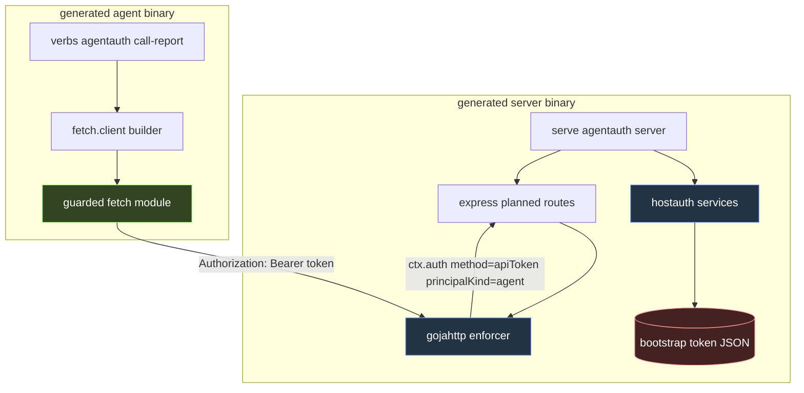
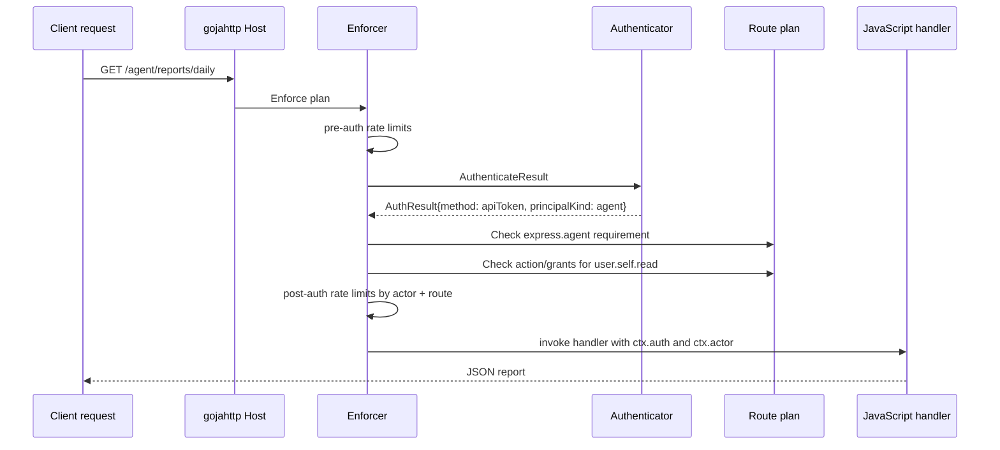
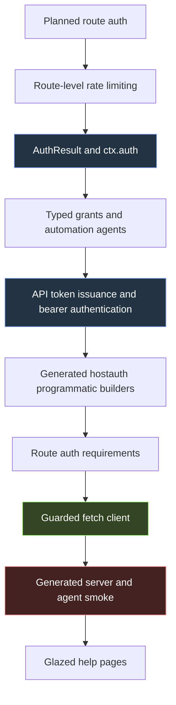

# go-go-goja Programmatic Agent Fetch Auth: End-to-End Deep Dive

This report explains the end-to-end programmatic agent authentication work in `go-go-goja`: server-side automation identities, API tokens, planned-route principal requirements, a guarded JavaScript `fetch` client, a generated server-and-agent smoke example, and the Glazed help pages that make the feature discoverable from `xgoja help`.

The work completes a missing part of the planned-auth architecture. Earlier phases made Express route security declarative and host-enforced. A JavaScript route could say that a route required a user, a resource, a CSRF token, an action, and an audit event; Go would enforce those declarations before handler code ran. Programmatic auth extends that model to non-browser callers. A generated host can now create an automation agent, issue an API token for that agent, require agent principals on selected routes, and expose a JavaScript client that reads the token through a guarded credential source and calls the protected route without using `exec` or `curl` from application code.

> [!summary]
> - Programmatic access now has explicit durable principals. An API token is a credential; an agent is the automation identity that owns lifecycle, policy, tenant, and audit identity.
> - Planned routes can now distinguish authenticated agent principals from browser session users with `express.agent()`, `express.sessionUser()`, and `express.anyOf(...)`.
> - The new `fetch` module is a guarded host capability. Generated xgoja agents must explicitly enable outbound origins, timeouts, response-size limits, and credential-source permissions.
> - The canonical smoke example builds two generated binaries: a server that provisions a token and an agent that calls the protected route through `fetch.client()`.
> - User-facing help is now split into focused Glazed pages: programmatic auth APIs, Express route auth requirements, and guarded fetch client APIs.

## Relationship to the earlier reports

This report is the third layer in a sequence of `go-go-goja` auth notes already stored in the vault.

- [[ARTICLE - go-go-goja Express Auth - Go Backed Fluent Route Plans]] explains the initial cutover from raw Express handlers to Go-backed planned routes.
- [[ARTICLE - go-go-goja Planned Route Rate Limiting - Deep Dive]] explains why rate limits became part of the route plan and how pre-auth and post-auth enforcement stages work.
- [[ARTICLE - go-go-goja Programmatic Auth After Rate Limiting - Deep Dive]] explains `AuthResult`, typed grants, automation agents, API tokens, generated hostauth programmatic builders, and route auth requirements.

The present report focuses on the end-to-end client/server path that those pieces enable. The server side can now express and enforce agent-only routes. The client side can now call those routes from generated xgoja JavaScript with a controlled HTTP capability and Go-owned credential builders. The new smoke example proves that the two halves work together in real generated binaries.

## The problem this work solves

The planned-route auth system had a strong server-side model before this phase. It could parse route declarations, reject invalid plans, authenticate browser sessions, verify CSRF, resolve resources, authorize actions, audit outcomes, and run handlers only after those checks succeeded. It later gained rate limiting and programmatic API-token authentication. That still left an important gap: JavaScript agents had no framework-native way to call authenticated HTTP APIs.

Without a client API, the example path would have been one of these incomplete solutions:

- call `curl` through `exec`, which proves that HTTP works but bypasses xgoja's capability model;
- hand-assemble `Authorization` headers inside JavaScript, which spreads raw credential handling across application code;
- skip the JavaScript agent and test only Go internals, which does not document the real generated-host user experience;
- require a Node HTTP library, which is not available in embedded goja.

The implemented solution makes outbound HTTP part of the same design language as the server side. JavaScript declares intent with fluent builders. Go owns policy, validation, credential loading, credential redaction, request execution, and route enforcement.

## The main architecture

The system is easier to understand when separated into four execution contexts.

1. The generated server binary runs the HTTP provider, the Express module, the hostauth module, and host filesystem access for a bootstrap token file.
2. The server JavaScript verb provisions an agent, issues an API token, writes the one-time token value to a file, and registers planned Express routes.
3. The generated agent binary runs a jsverbs command with only the guarded `fetch` host module enabled.
4. The agent JavaScript verb reads the token through `fetch.auth.bearer().fromFile(...).jsonPath(...)` and calls the server through `fetch.client()`.



There are two generated binaries on purpose. The server needs `auth`, `express`, and `fs:host`. The agent needs `fetch`. If a single generated runtime included both server and agent modules, the agent command would try to instantiate server-side auth services even though it is only a client. Splitting the xgoja specs makes the capability boundary explicit.

The relevant files are:

```text
examples/xgoja/22-programmatic-agent-auth/xgoja.yaml
examples/xgoja/22-programmatic-agent-auth/agent.xgoja.yaml
examples/xgoja/22-programmatic-agent-auth/verbs/server.js
examples/xgoja/22-programmatic-agent-auth/verbs/agent.js
examples/xgoja/22-programmatic-agent-auth/scripts/smoke.sh
modules/fetch/config.go
modules/fetch/fetch.go
modules/fetch/client_builder.go
modules/fetch/auth_builder.go
pkg/xgoja/providers/host/host.go
pkg/xgoja/providers/hostauth/programmatic.go
modules/express/auth_builders.go
pkg/gojahttp/enforcer.go
```

## Server-side construction

The server spec selects three providers:

```yaml
providers:
  - id: go-go-goja-host
    import: github.com/go-go-golems/go-go-goja/pkg/xgoja/providers/host
    register: Register
  - id: go-go-goja-hostauth
    import: github.com/go-go-golems/go-go-goja/pkg/xgoja/providers/hostauth
    register: Register
  - id: go-go-goja-http
    import: github.com/go-go-golems/go-go-goja/pkg/xgoja/providers/http
    register: Register
```

Its runtime modules are deliberately server-shaped:

```yaml
runtime:
  modules:
    - provider: go-go-goja-host
      name: fs
      as: fs:host
      config:
        allow: true
    - provider: go-go-goja-hostauth
      name: auth
      as: auth
      config:
        audit:
          maxLimit: 50
    - provider: go-go-goja-http
      name: express
      config:
        reject-raw-routes: true
        dev-errors: false
auth:
  mode: dev
  session:
    cookie:
      allow-insecure-http: true
  stores:
    default:
      driver: memory
```

The server can therefore write a bootstrap token file, call `require("auth")`, and register planned routes through `require("express")`. It cannot make outbound HTTP calls because the server spec does not enable `fetch`. That is not a limitation of the implementation; it is the intended capability shape for this example.

The server verb creates a durable automation identity and then creates a credential for that identity:

```javascript
const issued = auth.agents.create("daily-report-bot")
  .kind("ci")
  .tenantId("o1")
  .createdBy("server-bootstrap")
  .grants(auth.grants().allow("user.self.read").done())
  .issueApiToken("daily-report-token")
  .run();

fs.writeFileSync(tokenFile, JSON.stringify({
  agent: issued.agent,
  token: issued.token,
  note: "Raw token value is returned only at issuance. Treat this file like a secret."
}, null, 2), "utf8");
```

The raw token value appears in `issued.token.value`. This is the only point at which the raw token is available. List and revoke operations return token metadata, not the secret. The example writes the value to a local file because the generated agent must receive a credential during the smoke test. A production system would replace this with a deployment-specific secret distribution path.

## The route declarations

The server registers three routes. Each route demonstrates a different security shape.

```javascript
app.get("/healthz")
  .public()
  .audit("health.checked")
  .handle((_ctx, res) => res.json({ ok: true, example: "programmatic-agent-auth" }));
```

The health route is intentionally public. It is used by the smoke script to determine when the server is ready.

```javascript
app.get("/agent/reports/:reportId")
  .auth(express.agent())
  .rateLimit(express.rateLimit("agent-report-read").perMinute(60).byActor().byRoute())
  .allow("user.self.read")
  .audit("agent.report.read")
  .handle((ctx, res) => {
    const report = reports[ctx.params.reportId];
    if (!report) {
      res.status(404).json({ error: "unknown report" });
      return;
    }
    res.json({ ok: true, report, actor: ctx.actor, auth: ctx.auth });
  });
```

The report route is agent-only. It is not simply authenticated. It requires a principal whose kind is `agent`. It also requires the action `user.self.read`, adds an audit event, and declares an actor-and-route rate limit.

```javascript
app.get("/session-only")
  .auth(express.sessionUser())
  .allow("user.self.read")
  .audit("session.only.read")
  .handle((_ctx, res) => res.json({ ok: true, sessionOnly: true }));
```

The session-only route proves that an API token is not treated as an all-purpose substitute for a browser session. The same token that enters `/agent/reports/:reportId` must receive `403` at `/session-only`.

## Why route auth requirements are separate from grants

The route plan now has two distinct checks that both return `403` on failure:

1. The route auth requirement checks the type of authenticated principal and method. This is where `express.agent()` and `express.sessionUser()` are enforced.
2. The action/grant check determines whether the authenticated credential and actor are allowed to perform the route action.

These checks answer different questions. An agent token can have the correct action grant and still be rejected from a browser-session route. A browser session can have a valid user identity and still be rejected from an agent-only route. A token can authenticate as an agent and still be rejected when it lacks the route action.

The simplified order is:

```text
request
  -> pre-auth rate limits
  -> authenticate session or bearer API token
  -> check route auth requirement
  -> verify CSRF when the auth result requires it
  -> resolve resources
  -> check route action against grants and application authorizer
  -> post-auth rate limits
  -> audit
  -> JavaScript handler
```

This ordering is not incidental. The route auth requirement needs `AuthResult`, so it runs after authentication. CSRF needs the authentication method, because browser sessions and API tokens have different CSRF properties. Grant checks need the route action and may also need resolved resource or tenant context. Post-auth rate limits need actor or resource data when the route declares `byActor()` or `byResource(...)`.



## Agent-side construction

The agent spec is smaller than the server spec. It selects only the host provider and only the `fetch` module.

```yaml
runtime:
  modules:
    - provider: go-go-goja-host
      name: fetch
      as: fetch
      config:
        allow: true
        allowedOrigins:
          - http://127.0.0.1:*
        timeout: 5s
        maxResponseBytes: 1048576
        credentials:
          allowFiles: true
```

This is the core client-side design. Outbound HTTP is not a global default. The generated host must explicitly allow it. The config controls these security-relevant decisions:

| Field | Responsibility |
| --- | --- |
| `allow` | Enables the module. Without it, the host provider rejects `fetch`. |
| `allowedOrigins` | Restricts the URL scheme, host, and port that JavaScript can call. |
| `timeout` | Bounds request time. |
| `maxResponseBytes` | Bounds buffered response bodies. |
| `credentials.allowFiles` | Allows bearer credential sources to read local files. |
| `credentials.allowedFiles` | Can restrict credential files to exact paths when configured. |

The example allows `http://127.0.0.1:*` because the smoke picks a random local port. A production agent should use an exact origin. If it reads a token file, it should also use `credentials.allowedFiles` rather than allowing all files.

## The guarded fetch module

The fetch module has two public layers. The low-level layer is `fetch.fetch(url, options)`. It returns a Promise that resolves to a response object with `status`, `ok`, `headers`, `text()`, and `json()`.

The fluent layer is `fetch.client()`. It creates a client builder that owns base URL handling, default headers, response expectations, and authentication.

The module loader exports both layers and the `fetch.auth` namespace:

```go
modules.SetExport(exports, module.Name(), "fetch", func(call goja.FunctionCall) goja.Value {
    spec, err := module.requestSpecFromFetchCall(vm, call)
    if err != nil {
        return rejectedPromise(vm, err)
    }
    return module.asyncExecute(vm, runtimeServices, spec, expectationResponse)
})

modules.SetExport(exports, module.Name(), "client", func() *goja.Object {
    return module.newClientBuilder(vm, runtimeServices, store)
})

authObj := vm.NewObject()
modules.SetExport(authObj, module.Name()+".auth", "none", func() *goja.Object {
    return store.newNoneAuth(vm)
})
modules.SetExport(authObj, module.Name()+".auth", "bearer", func() *goja.Object {
    return store.newBearerAuth(vm, module.policy)
})
modules.SetExport(exports, module.Name(), "auth", authObj)
```

The implementation follows the existing goja runtime ownership rule. Network I/O runs in a goroutine. Resolution or rejection is posted back through `runtimebridge` so VM access remains serialized through the runtime owner.

```go
func (m Module) asyncExecute(vm *goja.Runtime, runtimeServices runtimebridge.RuntimeServices, spec requestSpec, expect expectation) goja.Value {
    promise, resolve, reject := vm.NewPromise()
    callCtx := runtimebridge.CurrentOwnerContext(vm)
    runtimeCtx := runtimeServices.Lifetime()
    go func() {
        select {
        case <-callCtx.Done():
            return
        case <-runtimeCtx.Done():
            return
        default:
        }
        data, err := m.execute(callCtx, spec)
        if err != nil {
            _ = runtimeServices.PostWithCustomContext(callCtx, "fetch.reject", func(context.Context, *goja.Runtime) {
                _ = reject(vm.NewGoError(err))
            })
            return
        }
        _ = runtimeServices.PostWithCustomContext(callCtx, "fetch.resolve", func(context.Context, *goja.Runtime) {
            value, valueErr := responseValue(vm, data, expect)
            if valueErr != nil {
                _ = reject(valueErr)
                return
            }
            _ = resolve(value)
        })
    }()
    return vm.ToValue(promise)
}
```

This code is important because fetch is asynchronous but goja is not a multi-threaded JavaScript engine. The implementation must not resolve a Promise directly from an arbitrary goroutine while touching VM state. The callback is posted back to the owner.

## Request execution policy

The `execute` function applies the host policy before performing HTTP work.

```go
u, err := policy.CheckURL(spec.URL)
if err != nil {
    return responseData{}, err
}

method := strings.ToUpper(strings.TrimSpace(spec.Method))
if method == "" {
    method = http.MethodGet
}

timeout := spec.Timeout
if timeout <= 0 {
    timeout = policy.Timeout
}

req, err := http.NewRequestWithContext(reqCtx, method, u.String(), bytes.NewReader(spec.Body))
```

`Policy.CheckURL` rejects non-HTTP schemes, missing hosts, and disallowed origins. The origin matcher supports exact origins and local wildcard ports such as `http://127.0.0.1:*`.

```go
func originPatternMatches(pattern string, u *url.URL) bool {
    if pattern == "" {
        return false
    }
    if pattern == "*" {
        return true
    }
    origin := originOf(u)
    if pattern == origin {
        return true
    }
    if strings.HasSuffix(pattern, ":*") {
        base := strings.TrimSuffix(pattern, ":*")
        return u.Scheme+"://"+u.Hostname() == base
    }
    return false
}
```

The response body is bounded with `io.LimitReader` and rejected when the configured limit is exceeded. The first implementation deliberately buffers the body because `text()` and `json()` are the target API surface. Streaming can be added later, but it would require a more complex lifetime and backpressure model.

## Credential source builders

The client-side authentication design uses Go-owned credential source objects rather than plain JavaScript maps. `fetch.auth.bearer()` returns a Go-backed builder object stored in an internal map keyed by `*goja.Object`. `client.auth(...)` accepts only values produced by `fetch.auth.*`.

```go
func (s *builderStore) credential(vm *goja.Runtime, value goja.Value) (credentialSource, error) {
    if value == nil || goja.IsUndefined(value) || goja.IsNull(value) {
        return nil, fmt.Errorf("client.auth(...) expects value returned by fetch.auth.*")
    }
    raw, ok := s.credentials.Load(value.ToObject(vm))
    if !ok {
        return nil, fmt.Errorf("client.auth(...) expects value returned by fetch.auth.*")
    }
    credential, ok := raw.(credentialSource)
    if !ok || credential == nil {
        return nil, fmt.Errorf("internal fetch auth spec has invalid type")
    }
    return credential, nil
}
```

This check prevents a route author from passing an arbitrary object such as `{ type: "bearer", token: "..." }`. The rule is intentional. Credential source policy should remain inside Go, because Go can apply file and environment restrictions consistently and keep error strings redacted.

The bearer credential source supports inline tokens, environment variables, and files:

```javascript
fetch.auth.none()
fetch.auth.bearer().token("ggpat_...")
fetch.auth.bearer().fromEnv("API_TOKEN")
fetch.auth.bearer().fromFile("/run/secrets/api-token.json").jsonPath("token.value")
```

The example uses file plus JSON path:

```javascript
const client = fetch.client()
  .baseUrl(baseUrl)
  .auth(fetch.auth.bearer().fromFile(tokenFile).jsonPath("token.value"))
  .acceptJson()
  .expectJson();
```

The credential resolution logic applies policy before reading from the host:

```go
case strings.TrimSpace(c.filePath) != "":
    if err := c.policy.CheckCredentialFile(c.filePath); err != nil {
        return "", err
    }
    data, err := os.ReadFile(c.filePath)
    if err != nil {
        return "", fmt.Errorf("read credential file %q: %w", c.filePath, err)
    }
    if strings.TrimSpace(c.jsonPath) == "" {
        value := strings.TrimSpace(string(data))
        if value == "" {
            return "", fmt.Errorf("credential file %q is empty", c.filePath)
        }
        return value, nil
    }
    value, err := extractJSONPath(data, c.jsonPath)
    if err != nil {
        return "", err
    }
    return value, nil
```

The result is a controlled path from token file to HTTP header. JavaScript names the source and the JSON path. Go validates policy, reads the file, extracts a non-empty string, and injects `Authorization: Bearer <token>`.

## Response expectations and error handling

The fluent client has three response modes:

| Mode | Behavior |
| --- | --- |
| `expectResponse()` | Return a response object even for non-2xx statuses. |
| `expectJson()` | Return parsed JSON for 2xx statuses; reject on non-2xx. |
| `expectText()` | Return text for 2xx statuses; reject on non-2xx. |

The agent example uses `expectJson()` for the main report request because success should be JSON. It uses a try/catch around the session-only route because `403` is the expected result:

```javascript
let sessionOnlyStatus = 0;
try {
  await client.get("/session-only").run();
} catch (err) {
  sessionOnlyStatus = err.status || 0;
}
```

The rejected value for HTTP status errors includes status metadata and the response body:

```go
func httpErrorValue(vm *goja.Runtime, data responseData) goja.Value {
    obj := vm.NewObject()
    _ = obj.Set("name", "HTTPError")
    _ = obj.Set("message", fmt.Sprintf("HTTP %d %s", data.Status, http.StatusText(data.Status)))
    _ = obj.Set("status", data.Status)
    _ = obj.Set("statusText", data.StatusText)
    _ = obj.Set("url", data.URL)
    _ = obj.Set("body", string(data.Body))
    return obj
}
```

This shape gives JavaScript enough information to distinguish expected authorization failures from unexpected transport failures without exposing credentials.

## The generated smoke test

The smoke test is a real generated xgoja test. It validates both xgoja specs, builds both generated binaries, starts the generated server, waits for readiness, runs the generated agent, and asserts the auth results.

```bash
make -C examples/xgoja/22-programmatic-agent-auth smoke
```

The script chooses a random local port, starts the server, and waits for `/healthz`:

```bash
"$SERVER_BIN" serve agentauth server --http-listen "$addr" --token-file "$token_file" >"$log" 2>&1 &
pid=$!

for _ in $(seq 1 100); do
  if curl -fsS "$base_url/healthz" >/dev/null 2>&1; then
    break
  fi
  if ! kill -0 "$pid" >/dev/null 2>&1; then
    cat "$log"
    exit 1
  fi
  sleep 0.1
done
```

It then validates the token bootstrap file and the unauthenticated rejection:

```bash
grep -q '"value"' "$token_file"
grep -q '"agent"' "$token_file"

status=$(curl -sS -o "$no_token_out" -w '%{http_code}' "$base_url/agent/reports/daily")
test "$status" = "401"
```

The actual JavaScript agent path is the generated agent binary, not curl:

```bash
"$AGENT_BIN" verbs agentauth call-report --base-url "$base_url" --token-file "$token_file" --report-id daily >"$agent_out"
grep -q '"ok": true' "$agent_out"
grep -q '"reportId": "daily"' "$agent_out"
grep -q '"authMethod": "apiToken"' "$agent_out"
grep -q '"principalKind": "agent"' "$agent_out"
grep -q '"sessionOnlyStatus": 403' "$agent_out"
```

Finally, the script uses curl as an external black-box assertion tool to prove that the token is rejected by the session-only route:

```bash
raw_token=$(python3 - <<PY
import json
print(json.load(open("$token_file"))["token"]["value"])
PY
)
status=$(curl -sS -H "Authorization: Bearer ${raw_token}" -o "$session_out" -w '%{http_code}' "$base_url/session-only")
test "$status" = "403"
```

The distinction matters. The smoke harness may use curl to inspect HTTP status codes from outside the system. The application-level agent example does not use `exec`, does not call curl, and does not manually build an `Authorization` header.

## What the smoke proves

The smoke validates specific security properties:

| Assertion | Security meaning |
| --- | --- |
| Token file contains `agent` and `value` | Server-side provisioning created both a durable agent and a one-time credential. |
| Agent route without token returns `401` | The route is not accidentally public. |
| Agent client returns `authMethod: "apiToken"` | Bearer authentication is recognized as API-token auth. |
| Agent client returns `principalKind: "agent"` | The credential authenticates as an automation agent, not a browser user. |
| Session-only route returns `403` for the same token | Principal-kind route restrictions are enforced independently from action grants. |

There are also properties that the smoke does not yet prove. It does not test revoked-token rejection. It does not test expired-token rejection. It does not test a valid agent token with missing grants. It does not test exact credential-file allow-listing. Those should be added as future smoke cases or lower-level tests.

## Documentation and discoverability

After the implementation, the code had three adjacent documentation areas: generated hostauth JavaScript APIs, Express planned-route auth, and client-side fetch. Leaving all new information inside one long help page would make discovery difficult. Splitting by user task is more maintainable.

The current Glazed help topology is:

| Help page | Primary question answered |
| --- | --- |
| `xgoja help generated-auth-javascript-apis` | How do generated OIDC hosts expose audit and capability-token APIs to JavaScript? |
| `xgoja help programmatic-auth-javascript-apis` | How does server-side JavaScript create agents, grants, and API tokens? |
| `xgoja help express-route-auth-requirements` | How does a route declare that it accepts agents, session users, or explicit alternatives? |
| `xgoja help guarded-fetch-client-api` | How does generated client-side JavaScript call HTTP APIs with guarded fetch and credential sources? |
| `xgoja help hostauth-config-reference` | Which generated-host auth config fields and flags exist? |
| `xgoja help auth-stores-reference` | Which store families exist and what are they responsible for? |
| `xgoja help http-serve-command-reference` | How does the generated HTTP serve command construct runtimes and mount routes? |

This split is not based on implementation packages. It is based on what a user is trying to do. A user provisioning agents should not have to read the browser-session capability-token page. A user authoring an agent-only route should not have to read fetch configuration. A user writing a client agent should start at the fetch page and follow links to programmatic auth only when they need to understand where the token came from.

The best future consolidation target is still the overlap between `hostauth-config-reference` and `auth-stores-reference`. The config page should stay focused on YAML and flags. The stores page should remain the canonical conceptual reference for sessions, audit, appauth, capability stores, and future programauth persistence. Repeating store semantics in both places will make the docs harder to keep correct.

## Implementation sequence

The implementation sequence matters because each layer depends on the previous one.



A shorter sequence would have been possible, but it would have hidden important invariants. For example, adding `fetch.client()` before `express.agent()` would produce a client with no route-level principal semantics to test. Adding agent tokens before `ctx.auth` would force handler code to infer credential details indirectly. Adding route requirements before token grants would prove only identity type, not permission enforcement.

## Security invariants

The implementation is built around several invariants that should remain stable as refresh-token families, device flows, and production stores are added.

### JavaScript declares policy; Go owns enforcement

JavaScript route code says:

```javascript
.auth(express.agent())
.allow("user.self.read")
.rateLimit(express.rateLimit("agent-report-read").perMinute(60).byActor().byRoute())
```

Go validates the resulting route plan and enforces it before the handler runs. Handler code may read `ctx.auth`, but it should not decide whether the request is authenticated, whether the principal kind is acceptable, whether CSRF is required, or whether the action is authorized.

### Credentials are not normal application data

The raw API token is returned only at issuance. It is read by the agent through a credential source builder. The builder applies host policy and injects the `Authorization` header. It presents a redacted string representation.

The rule is simple: application code may name credential sources; Go resolves and applies credentials.

### Principal kind is not the same as credential method

`AuthResult.Method` tells how a request authenticated. `AuthResult.PrincipalKind` tells what kind of principal entered the route. The separation supports current and future cases:

- API token authenticating an agent;
- browser session authenticating a user;
- future access token authenticating a user;
- future device flow issuing an agent or service credential.

A route requirement can therefore be about principal kind, method, or an explicit combination when needed.

### Host capabilities are explicit

The server spec enables filesystem, auth, and express. The agent spec enables fetch. Neither side receives every capability by default.

This is the same operating rule used elsewhere in xgoja. Filesystem access, process execution, database access, and outbound HTTP are host capabilities. They must be declared in `xgoja.yaml`, and their configuration should be as narrow as the use case allows.

## Failure modes found during implementation

The diary recorded several useful failures. They are worth preserving because they describe the real boundaries of the generated command system.

### Flags must be passed at the generated subcommand level

The first smoke attempt passed `--http-listen` at the wrong command level and failed with:

```text
Error: unknown flag: --http-listen
unknown flag: --http-listen
```

The working shape is:

```bash
programmatic-agent-auth-server serve agentauth server --http-listen 127.0.0.1:18789 --token-file /tmp/token.json
```

The flag belongs to the generated serve command path that selects the jsverb-backed server.

### JavaScript function identifiers and CLI names are not the same field

The agent verb initially used a hyphenated JavaScript function reference and failed with:

```text
Error: scan jsverb source local-verbs: agent.js references unknown function "call-report"
scan jsverb source local-verbs: agent.js references unknown function "call-report"
```

The corrected form uses a JavaScript identifier `callReport` with a CLI name `call-report`:

```javascript
__verb__("callReport", {
  name: "call-report",
  output: "text"
})
```

The CLI can expose kebab-case names; the JavaScript function reference must still be a valid identifier.

### jsverbs output modes are narrower than arbitrary JSON

The agent initially declared `output: "json"` and failed with:

```text
Error: agent.js#callReport has unsupported output mode "json"
agent.js#callReport has unsupported output mode "json"
```

The compatible path is `output: "text"` and returning formatted JSON text. The example does this because the smoke only needs stable text output for assertions.

### Client and server runtimes need different services

A single generated spec that included both hostauth and fetch failed when the agent command tried to instantiate `auth` without server-side services:

```text
Error: register module "xgoja:go-go-goja-hostauth.auth:auth": create module go-go-goja-hostauth.auth: auth module requires hostauth services
```

The fix was not to create a compatibility shim. The fix was to split the generated server and agent specs. That decision clarified the runtime boundary and reduced the agent's capability surface.

## How to run the system manually

The smoke target is the normal validation command:

```bash
cd /home/manuel/workspaces/2026-06-12/goja-express-auth/go-go-goja
make -C examples/xgoja/22-programmatic-agent-auth smoke
```

To run the server and agent manually, first build both generated binaries:

```bash
make -C examples/xgoja/22-programmatic-agent-auth build
```

Start the server in one terminal:

```bash
ADDR=127.0.0.1:18789
TOKEN_FILE=/tmp/xgoja-agent-auth-demo-token.json

examples/xgoja/22-programmatic-agent-auth/dist/programmatic-agent-auth-server \
  serve agentauth server \
  --http-listen "$ADDR" \
  --token-file "$TOKEN_FILE"
```

Run the agent in another terminal:

```bash
examples/xgoja/22-programmatic-agent-auth/dist/programmatic-agent-auth-agent \
  verbs agentauth call-report \
  --base-url "http://127.0.0.1:18789" \
  --token-file /tmp/xgoja-agent-auth-demo-token.json \
  --report-id daily
```

Expected output includes:

```json
{
  "ok": true,
  "reportId": "daily",
  "authMethod": "apiToken",
  "principalKind": "agent",
  "sessionOnlyStatus": 403
}
```

## Code review path

A reviewer should read the implementation in this order.

1. `pkg/gojahttp/auth_plan.go` and `pkg/gojahttp/enforcer.go` define the shared security context and enforcement order.
2. `pkg/gojahttp/auth/programauth/token.go` and `pkg/gojahttp/auth/programauth/agent.go` define the agent and token model.
3. `pkg/xgoja/providers/hostauth/programmatic.go` exposes server-side JavaScript builders.
4. `modules/express/auth_builders.go` and `modules/express/typescript.go` expose route auth requirements and rate-limit declarations.
5. `modules/fetch/config.go`, `modules/fetch/fetch.go`, `modules/fetch/client_builder.go`, and `modules/fetch/auth_builder.go` define the guarded client-side HTTP surface.
6. `pkg/xgoja/providers/host/host.go` wires fetch into generated host configuration.
7. `examples/xgoja/22-programmatic-agent-auth` proves the generated server and generated agent work together.

Useful validation commands are:

```bash
go test ./modules/fetch ./pkg/xgoja/providers/host
go test ./pkg/gojahttp ./modules/express ./pkg/gojahttp/auth/programauth ./pkg/xgoja/hostauth ./pkg/xgoja/providers/hostauth
go test ./...
make -C examples/xgoja/22-programmatic-agent-auth smoke
GOWORK=off go run ./cmd/xgoja help guarded-fetch-client-api
GOWORK=off go run ./cmd/xgoja help programmatic-auth-javascript-apis
GOWORK=off go run ./cmd/xgoja help express-route-auth-requirements
```

## Current status

The feature is implemented and documented at the generated-host level.

Completed pieces:

- planned-route rate limiting;
- `AuthResult` and redacted `ctx.auth` projection;
- typed grants and automation agents;
- API-token issuance, storage, revoke, and bearer authentication;
- generated hostauth programmatic JavaScript builders;
- route auth requirements for agents, session users, and alternatives;
- guarded fetch module with low-level and fluent APIs;
- generated server-and-agent smoke example without JavaScript `exec` or curl;
- Glazed help pages for the new APIs.

Important remaining work:

- SQL-backed production stores for programauth agents and API tokens;
- revoked-token, expired-token, and missing-grant cases in the generated smoke;
- stricter credential-file allow-list examples for production agents;
- access-token and rotating refresh-token families;
- future device-login credential sources once the server-side flow exists;
- possible response streaming after the bounded-buffer fetch API is stable.

## The technical result

The completed path is now coherent:

1. A generated server owns auth services.
2. Server-side JavaScript provisions an agent and issues an API token through Go-owned builders.
3. The route plan declares that a route accepts only agent principals and requires a specific action.
4. A generated agent owns only the fetch capability required to call that server.
5. Agent-side JavaScript names a credential source through a Go-owned builder and calls the API through `fetch.client()`.
6. The Go enforcer authenticates the bearer token, checks the principal requirement, checks grants, applies rate limits, records audit metadata, and only then invokes the handler.
7. The handler receives `ctx.auth` and `ctx.actor` as redacted, post-enforcement context.

This is the central design achievement. Programmatic auth is not a separate ad hoc HTTP path. It is another caller family inside the same planned-route architecture. The same route plan that supports browser sessions, CSRF, resources, authorization, audit, and rate limiting now supports automation agents and API tokens. The client side follows the same rule: JavaScript is declarative and ergonomic, while Go owns the security-critical mechanics.
