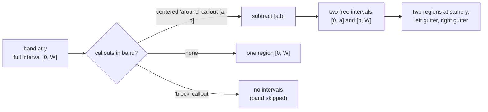
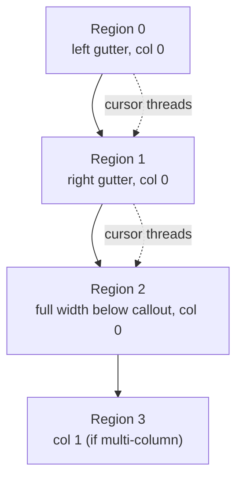
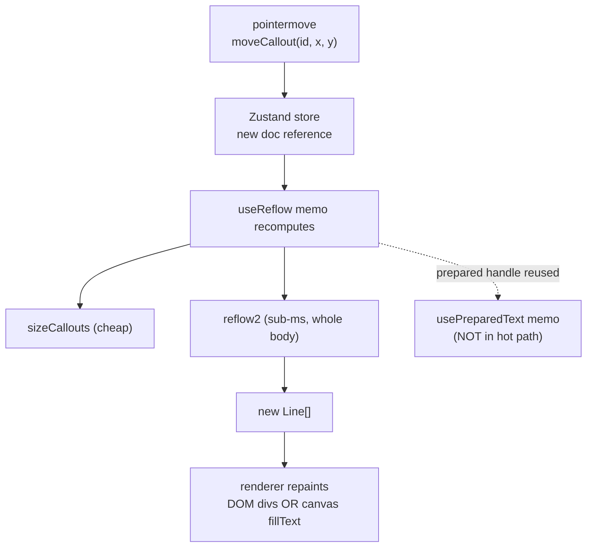

# typo-reflow-foldout: Pretext-Driven Text Reflow Architecture

This report documents the architecture of `typo-reflow-foldout`, a Vite + React + TypeScript typographic playground that recomputes text line breaks in JavaScript on every pointer-move frame, using the DOM-free text-measurement library `@chenglou/pretext` (v0.0.8). The system lets a user place "callout" blocks (citations, pull-quotes, sidenotes) at arbitrary pixel positions inside a column of body text and watch the surrounding text re-wrap around them in real time, with support for multiple columns, four placement modes, and a configurable reflow margin.

The report is written for an engineer who needs to understand, modify, or reuse the architecture. It explains the two-stage pretext API that makes per-frame reflow feasible, the region-based abstraction that generalizes single-column left/right wrapping into multi-column flow with centered "around" placement, and the three failure modes the implementation hit that are not visible in the library's documentation. The reference implementation lives at `/home/manuel/code/wesen/2026-06-20--typo-reflow-foldout`, with the full design at `ttmp/2026/06/20/TYPO-001--typographic-reflow-playground-vite-react-pretext/design-doc/01-reflow-playground-intern-design-implementation-guide.md`.

> [!summary]
> - Pretext splits text layout into a slow one-time `prepare()` pass and a fast pure-arithmetic `layout()` pass. Drag performance depends on keeping the slow pass out of the per-frame path entirely.
> - The visible layout is decomposed into free rectangular **regions** in reading order, produced by subtracting callout obstructions from each column's horizontal extent per line-band. Pretext then fills each region one line at a time.
> - Three bugs were not detectable in unit tests and required a real browser: a CSS `white-space` parity mismatch, a callout chrome parity mismatch, and a silent pretext font-cache poisoning that only manifests at narrow line widths.

## Why this project exists

![[reflow-sidebar-and-stage.png]]

*The playground: a left sidebar drives a right stage where body text reflows around draggable callout blocks in real time.*

Wrapping body text around an arbitrary box is hard to do well on the web. CSS `float` only positions a box relative to the current flow position, forces a full layout reflow on every change, and cannot wrap text on both sides of a centered box at once. CSS `shape-outside` has uneven browser support and still triggers layout reflow. CSS grid and exclusions give no per-line control.

This project takes a different approach. Instead of asking the browser to lay text out around the boxes, the application computes the line breaks itself in JavaScript, using `@chenglou/pretext` as the measurement engine. Pretext measures text using the browser's canvas `measureText` as a width oracle but performs its own segmentation, bidi handling, and line breaking in pure TypeScript. Because the measurement does not touch the DOM, the slow part of text layout (reading glyph widths) happens once, and the fast part (deciding where lines break at a given width) is pure arithmetic that runs in tens of microseconds.

That split is what makes the interaction model possible: every pointer-move event during a drag re-runs the entire line-break computation for the whole document, and the result is painted without forcing browser layout reflow. The cost is that the application owns the geometry of which spaces the text may occupy, and must keep its own font configuration byte-for-byte identical to what pretext measured.

## The pretext two-stage API

Pretext exposes its work as two stages, and every architectural decision in this project follows from respecting the boundary between them.

The **prepare stage** is slow and runs once for a given body text and font configuration. `prepareWithSegments(text, font, options)` normalizes whitespace, segments the text into grapheme-level units, measures each segment's width via canvas, applies bidi and glue rules, and returns an opaque handle. This is the only stage that touches the canvas.

The **layout stage** is fast and repeatable. `layoutNextLineRange(prepared, cursor, maxWidth)` returns the next line of text that fits in `maxWidth`, starting at `cursor`, without any DOM access. It is pure arithmetic over the cached segment widths. A `LayoutCursor` value (`{ segmentIndex, graphemeIndex }`) threads position from one line to the next.

```ts
// Slow, once per text+font:
const prepared = prepareWithSegments(bodyText, '400 16px Inter', { letterSpacing: 0 })

// Fast, per line, variable width per line:
let cursor = { segmentIndex: 0, graphemeIndex: 0 }
while (true) {
  const range = layoutNextLineRange(prepared, cursor, availableWidth)
  if (range === null) break              // text exhausted
  const line = materializeLineRange(prepared, range)
  cursor = range.end
  // place line at its (x, y)...
}
```

![[reflow-pullquote-left.png]]

*A pull-quote callout on the left; body text wraps to its right, computed one line at a time by the fast layout stage.*

The interaction model maps directly onto this split. `prepare` runs when the body text changes, the font family/size/weight changes, or letter-spacing changes. It must not run when the column resizes or a callout moves, because those only change the width passed to the fast `layout` stage. This constraint is enforced by a `useMemo` whose dependency array contains exactly the prepare inputs and nothing else, and a `PerfHud` component that counts the two stages independently so a regression (a `prepare` firing per drag frame) is visible immediately.

## The region abstraction

### Why a single-interval-per-band model is insufficient

The first version of the reflow algorithm walked the body text one line at a time. For each line it computed one available width: the column width minus whatever a left- or right-side callout consumed in that line's vertical band. This works for callouts squeezed against one margin, but it cannot express three cases the project needed.

First, a centered callout with "around" placement leaves text space on **both** its left and its right. A single available width cannot describe two disjoint horizontal intervals at the same vertical position. Second, a "block" callout consumes an entire band, forcing the text to continue below it; this is a column break, not a width reduction. Third, multiple columns require per-column geometry, because a callout in column one must not disturb the text in column zero.

The unifying observation is that the geometry problem and the text-walking problem are independent. The geometry problem is: given the columns and the callouts, what rectangular regions may the text occupy, and in what reading order? The text-walking problem is: given a sequence of regions and a prepared text handle, lay lines into each region in turn. Pretext's `layoutNextLineRange` already solves the second problem for a single contiguous region; it does not need to change. All the new expressiveness lives in the first stage.

### Stage one: geometry into regions

A **region** is a free rectangle the text may flow into.

```ts
interface Region {
  x: number       // absolute x in the grid
  y: number       // absolute y of the region's first line
  width: number   // text width for this region
  height: number  // available vertical space (Infinity for the trailing region)
  column: number  // owning column
}
```

Regions are produced in three steps. First, the column is divided into horizontal **bands** one line-height tall, from `y = 0` down to the bottom of the lowest callout. Second, for each band, the free horizontal intervals are computed by starting with the full column interval `[columnLeft, columnLeft + columnWidth]` and subtracting the horizontal extent of every callout that overlaps that band. Third, consecutive bands with identical interval lists are collapsed into one region per interval, so a stable stretch of squeezing becomes a single tall region rather than many one-line-tall regions.

The subtraction is pure one-dimensional interval arithmetic and is the entire correctness surface for "around" placement. Subtracting a hole that falls in the middle of an interval splits it into two pieces; subtracting a hole that covers the whole interval removes it; subtracting a hole at an edge trims that edge. When a centered callout carves its horizontal extent out of a band, the result is two intervals, which become two regions stacked at the same `y` — the left gutter and the right gutter.

![[reflow-around-placement.png]]

*The "around" placement: a centered callout leaves two gutters, and the body text flows into both — the case the single-interval model could not express.*



![[reflow-both-sides.png]]

*Left and right placements together: a citation on the left margin and a sidenote on the right squeeze the same band from both sides.*

The placement mode determines how a callout becomes an obstruction. `left` and `right` carve the callout's horizontal extent (plus margin) from one side. `around` carves the same extent but is the only mode that leaves intervals on both sides. `block` returns an obstruction spanning the entire column width, so the band has no free intervals and produces no regions; the text simply continues in the next band below the callout. When a callout has no explicit placement, the effective placement is derived from its horizontal center: a callout straddling the column midline is treated as `around`, otherwise `left` or `right` by center.

Two refinements matter for correctness. A callout only obstructs the column whose horizontal range it overlaps; this is enforced by a `columnOverlaps` check, without which a `block` callout in column one would also erase column zero at the same `y`. And the reflow margin (a global horizontal and vertical gap the text keeps around every callout, external to the callout's own padding and border) is applied here, in stage one, by expanding each callout's horizontal extent by `margin.x` and its vertical band overlap test by `margin.y`.

### Stage two: text into regions

Stage two walks the regions in reading order and lays lines into each. Reading order is column-major (column zero fully, then column one), and within a band that produced multiple intervals, left gutter before right gutter. The cursor threads across region boundaries, so the text is one continuous stream broken across regions rather than independent paragraphs per region.



For each region, the algorithm calls `layoutNextLineRange` up to `floor(region.height / lineHeight)` times, materializes each returned range, and emits a line at `(region.x, region.y + lineIndex * lineHeight)`. Two guards prevent infinite loops. A region whose width is below a minimum is skipped, so a near-full-width callout cannot trap the algorithm in a region too narrow for any word. And a zero-progress check breaks out of a region if `layoutNextLineRange` returns a range whose end cursor equals the start cursor — the failure mode for a single token wider than the region.

The trailing region of the last column is given height `Infinity`. Text length is unbounded, but regions are bounded by callout geometry; without an open-ended trailing region, text would be truncated at the bottom of the last scanned band. Only the **last** column's trailing region is open-ended. Earlier columns' trailing regions are bounded, so that strict-fill column distribution spills overflowing text into the next column.

## Column distribution as a strategy seam

Multi-column layout requires deciding how much body text goes into each column. The project models this as a pluggable strategy rather than a hardcoded rule.

```ts
interface ColumnDistributor {
  distribute(capacities: ColumnCapacity[], totalLines: number): number[]
}
interface ColumnCapacity {
  column: number
  regions: Region[]
  maxLines: number   // sum of line-slots across this column's regions
}
```

The shipped implementation is `StrictFillDistributor`: fill column zero to its `maxLines`, then column one, and so on, with the last column absorbing any overflow. Strict fill needs no text measurement because column capacity is pure geometry. The interface exists so a future `BalancedDistributor` — which would use pretext's `measureLineStats` to pick per-column line budgets that minimize the maximum column height, matching CSS `column-fill: balance` — can be added as a new file without touching the region or interval core.

## Keeping pretext measurement honest

Three properties must hold for the rendered output to match what pretext computed. Each is a real failure mode the project hit.

### Font configuration parity

Pretext measures text with a canvas font string. The DOM renders text with CSS. If the two disagree, the rendered glyph widths differ from the measured widths, and text overflows the boxes the layout engine assigned. The project centralizes every font value in one module so the canvas shorthand and the CSS properties are generated from the same source.

```ts
export function toPretextFont(c: FontConfig): string {
  return `${c.fontWeight} ${c.fontSize}px ${c.fontFamily}`
}
export function toLineStyle(c: FontConfig): React.CSSProperties {
  return {
    fontFamily: c.fontFamily,
    fontSize: `${c.fontSize}px`,
    fontWeight: c.fontWeight,
    lineHeight: `${c.lineHeight}px`,
    letterSpacing: `${c.letterSpacing}px`,
    whiteSpace: 'normal',
  }
}
```

Line-height is stored and applied in pixels, not as a unitless ratio, because pretext takes `lineHeight` as a pixel number. A unitless CSS `line-height` would introduce a class of off-by-fraction bugs where the measured line height and the rendered box height diverge.

The CSS `white-space` value must be `normal`, not `pre`. Pretext measures each line's width with `white-space: normal`, which collapses the trailing space at the line's break point. Rendering the same text with `white-space: pre` preserves that trailing space and makes each line approximately one space wider. At full column width the extra width is absorbed by slack; at narrow gutter widths it overflows and the browser wraps the line. The earlier choice of `pre` was wrong and was corrected after empirical comparison showed `normal` producing zero overflows and `pre` producing two.

### Callout chrome parity

Callouts are rendered with `box-sizing: border-box`, so a callout's visual width is the value set on it but its text content width is smaller by the padding and border. The box the user sees must be the box the layout engine obstructs, or the body text will collide with the callout's visual edge.

The project defines the callout chrome (padding and border) as a single constant and uses it in both places. The sizing stage measures the callout text at the **content** width (visual width minus horizontal chrome) and reports a measured height that includes vertical chrome. The rendering component applies padding and border from the same constant. Because both sides read the same numbers, the obstruction box and the visual box are identical.

```ts
export const CALLOUT_CHROME = { paddingX: 10, paddingY: 8, borderWidth: 1 } as const
// content width used for measurement:
const contentWidth = Math.max(visualWidth - CALLOUT_CHROME_H, 1)
// measured height includes chrome so it equals the rendered box:
measuredHeight = Math.max(textHeight + CALLOUT_CHROME_V, MIN_CALLOUT_HEIGHT)
```

### The font-cache poisoning failure mode

The most subtle bug, and the one most worth documenting, is that pretext caches segment widths at `prepare()` time using whatever font the canvas has active at that moment. If the named font is not yet loaded when `prepare()` runs, the canvas silently falls back to a substitute font and caches the substitute's metrics. Every line subsequently returned is then computed against the wrong widths, so the layout engine packs too many characters into each width and the browser wraps them. The failure is silent: pretext returns lines that fit "its" width, but "its" width no longer corresponds to the real font.

This bug is invisible at full column width because the too-long lines have slack and do not overflow. It only manifests when callouts force narrow line widths, as in "around" placement gutters. The project's single-column phase passed every visual test because all lines were laid at the full column width; the bug surfaced immediately when a centered callout produced two narrow gutters.

The diagnosis that isolated the cause was to import pretext directly in the running page, call `clearCache()`, run a fresh `prepareWithSegments` on the same text, and compare the returned lines to the application's cached lines. A fresh prepare returned a 43-character line at 297 pixels; the application's cached handle returned a 52-character line at 307 pixels for the same text. The cache held fallback metrics.

The fix has two parts. The font-ready gate never trusts the synchronous `document.fonts.status === 'loaded'`, which can be true before the bundled `@fontsource` faces are actually applied; it always awaits the `document.fonts.ready` promise once. And it calls `pretext.clearCache()` when fonts become ready, so the first prepare after the gate measures with the real loaded font and no stale fallback widths survive.

```ts
const [fontsReady, setFontsReady] = useState(false)
useEffect(() => {
  let alive = true
  document.fonts.ready.then(() => { if (alive) setFontsReady(true) })
  return () => { alive = false }
}, [])
useEffect(() => { if (fontsReady) clearCache() }, [fontsReady])
const prepared = useMemo(
  () => fontsReady ? prepareWithSegments(bodyText, font, { letterSpacing }) : null,
  [bodyText, font, letterSpacing, fontsReady],
)
```

This failure mode generalizes beyond pretext. Any library that caches measurements derived from an asynchronously-loaded resource (fonts, images used for intrinsic sizing, locale data) will silently cache wrong values if the first measurement races the load. The defense is the same in every case: gate the first measurement on the load promise, and clear the cache when the load completes.

## Rendering: DOM and canvas

![[reflow-canvas-perfhud.png]]

*The canvas renderer draws the same computed lines as `ctx.fillText` calls; the perf HUD shows the `prepare` and `reflow` stage counts independently.*

The same computed `Line[]` feeds two renderers. The DOM renderer places each line as an absolutely-positioned `<div>` at its `(x, y)` with its measured width, using the centralized line style so the rendered font matches the measured font. The canvas renderer draws each line with `ctx.fillText(line.text, line.x, line.y)` on a device-pixel-ratio-scaled canvas. Because pretext is renderer-agnostic — it returns lines, the caller draws them — the two renderers produce identical glyph positions, which serves as the parity check that the font configuration is correct.

A distinction the project made explicit is which layer carries the interactive callouts. Body text may be DOM elements or canvas pixels, but callouts must be real DOM elements in both modes because they own pointer-event handlers and drag handles. The callouts are therefore rendered by a `CalloutLayer` component that is always a DOM overlay above whichever body renderer is active. This makes drag and resize work in canvas mode (the earlier version rendered nothing interactive in canvas mode and drag silently failed) and removes duplicated callout-drawing logic from the canvas renderer.

The performance characteristics of the two renderers differ, and the difference matters for interaction. Pretext makes the line-break computation cheap, but in DOM mode every drag frame still pays React reconciliation of every line `<div>` (top, left, width, textContent updates plus paint), which scales with line count. Canvas mode redraws with one `clearRect` and `N` `fillText` calls and performs zero DOM mutation. For drag-heavy use, canvas is the faster renderer; DOM is the renderer that supports text selection and accessibility. The toolbar lets the user switch, and the architecture treats them as peers fed by the same layout result.

## The interaction hot path

The design constraint that shapes the state layer is that dragging a callout must mutate state cheaply. A `moveCallout` action updates one callout's `x` and `y` immutably and nothing else. That produces a new document object reference, which causes the `useReflow` memo to recompute. The memo runs `sizeCallouts` (re-sizes only the callouts, which is cheap) and `reflow2` (walks the whole body once, sub-millisecond), and returns a new `Line[]`. The renderer repaints.

The slow `prepare` is not in this path. Its memo depends only on the body text, the font, the letter-spacing, and the fonts-ready flag. Dragging a callout changes none of these, so the prepared handle is reused across every drag frame. The `PerfHud` displays both counters; during a drag the `prepare` count stays flat while the `reflow` count climbs once per frame, which is the empirical proof that the memoization boundary is correct.



## Performance measurements

The interaction hot path was measured directly with a dedicated harness that imports the real `@chenglou/pretext` and the project's own `lib/` modules (not mocks) and times each stage in a browser. The measurements settle two questions that prose cannot: how cheap is the reflow computation, and where does drag actually spend its time. The full standalone report is in the repository at `perf-report.html`; the findings below are the load-bearing ones.

> [!summary]
> - The reflow pipeline is effectively free: 15–35 microseconds per frame, roughly 500× under the 16.6 ms budget for 60 fps. Drag jank in this application cannot originate in pretext or in the region geometry.
> - Rendering is the real cost, and it is renderer-dependent. DOM mode rebuilds N absolutely-positioned `<div>` elements per frame and crosses the 16.6 ms frame budget at approximately 700 lines. Canvas mode issues N `ctx.fillText` calls on a single surface and stays under 2 ms at 2000 lines.
> - The two-stage memoization claim holds quantitatively: a one-time `prepare` on 20 000 characters costs ~6 ms, and each per-frame layout walk over the same text costs ~95 microseconds, a ratio of roughly 160×.

### The two pretext stages on different scales

`prepare` cost grows roughly linearly with text length: 200 microseconds at 500 characters, 1.5 ms at 2000, 2.6 ms at 8000, and 7.4 ms at 20 000. The per-frame layout walk over the same prepared text is one to two orders of magnitude cheaper at every length: 2.6 microseconds at 500 characters, rising to 95 microseconds at 20 000. Because drag invokes only the cheap stage, the slow stage's linear cost is irrelevant to interaction smoothness — it is paid once per edit, not per frame.

### The renderer is the bottleneck, not the math

The decisive measurement is the repaint cost. At 2000 body lines, rebuilding the DOM costs 40 milliseconds, which is nearly three 16-millisecond frames; the canvas repaint of the same 2000 lines costs 2 milliseconds. The two curves diverge linearly: DOM cost grows with line count and crosses the frame budget around 700 lines, while canvas cost stays flat enough to remain inside budget well past 2000 lines. The practical consequence is that the renderer choice — not pretext, not the region abstraction — decides whether drag stays smooth as documents grow.

![[perf-report-overview.png]]

*The standalone report: headline ratios, the two-stage bar chart, and the DOM-vs-canvas line chart with the 16.6 ms frame-budget line. DOM repaint crosses the budget around 700 lines; canvas stays well inside it.*

### What this means for the architecture

The measurements justify two decisions already in the code and one that is not yet made. The two-stage memoization boundary is correct and worth defending with a perf counter; the canvas renderer is the right default for drag-heavy or large documents; and the DOM renderer, retained for text selection and accessibility, will need line-count-aware throttling (or a switch to canvas) before it can drag smoothly past ~700 lines. None of these require changing the reflow algorithm itself.

## Validation strategy

The project uses three layers of validation, each catching a different class of bug.

Unit tests cover the pure logic with a mocked pretext that provides a deterministic monospace line-breaking model. This validates the geometry and guards — interval subtraction, region collapse, band skipping, zero-progress handling, column scoping, multi-column reading order — without depending on canvas. Ninety-seven tests cover these cases. The mocking is necessary because jsdom does not implement the canvas 2D context, so real pretext cannot run there.

A real-browser check via Playwright exercises the real pretext engine and real DOM layout, which the unit tests cannot. This is the only layer that can catch the three parity bugs above, because all three require the canvas to actually measure text and the DOM to actually render it. The application exposes a dev-only `window.__store` handle and a `window.__TYPO_LOG__` flag so the browser automation can drive the store and read computed layout values (line positions, widths, callout boxes) from the DOM and assert invariants numerically: zero lines overlap any callout, zero lines overflow the column, zero lines wrap to a second visual line.

A production build catches tooling issues that dev mode tolerates. The build failed at one point with a lightningcss minifier error on an "invalid dangling combinator"; the cause was a `.css` file containing JavaScript-style `import '@fontsource/...'` lines (no `@`) that Vite's dev plugin accepted but the minifier rejected. Moving the imports into the application entry point fixed it. Running `pnpm build` as a gate catches this class of error.

## Working rules

- Treat the prepare/layout boundary as a load-bearing wall. The fast path must never call `prepare`. A perf counter that shows `prepare` climbing during a drag is a bug, not a slow operation to optimize.
- Centralize every value that affects measurement — font shorthand, letter-spacing, line-height, callout chrome — so the measurement engine and the renderer read identical numbers. Parity bugs are caused by duplication.
- Gate the first measurement of any asynchronously-loaded resource on its load promise, and clear measurement caches when the load completes. Silent cache poisoning is the worst failure mode because the library appears to work.
- Separate geometry from text walking. Adding a new placement mode or a new column policy should be a case in the geometry stage, not a fork in the text-walking algorithm.
- Keep interactive elements in the DOM regardless of how the body is rendered. A renderer toggle that silently disables interaction is a correctness bug, not a feature gap.
- Validate with a real browser for anything that involves actual glyph measurement or DOM layout. jsdom cannot host these, and mocked engines cannot catch parity drift.

## Open questions

- Column balancing. Strict fill distributes text by capacity, which can leave the last column much shorter than the others for short documents. The `ColumnDistributor` seam is in place for a `BalancedDistributor` that uses `measureLineStats` per column, but it is not implemented.
- DOM drag performance. As line count grows, React reconciliation of every line `<div>` per frame may become the bottleneck regardless of how cheap the reflow computation is. Memoizing line components by stable key, or defaulting to the canvas renderer above a line-count threshold, are unexplored.
- Text selection and accessibility. The absolute-positioning model weakens cross-line selection and screen-reader flow. The raw body text is retained in the document model, so a hidden accessible region is a possible mitigation, but it is not built.
- Persistence. The working document lives in Zustand state and is lost on reload. The presets are code; exporting the working document to `localStorage` or JSON is a stretch goal.

## Important project docs

- Design and implementation guide: `/home/manuel/code/wesen/2026-06-20--typo-reflow-foldout/ttmp/2026/06/20/TYPO-001--typographic-reflow-playground-vite-react-pretext/design-doc/01-reflow-playground-intern-design-implementation-guide.md`
- Performance report (standalone HTML, with charts): `.../perf-report.html` — generated by `.../scripts/01-gen-perf-report.py` from data captured by `.../src/perf/main.ts` (served at `/perf.html`)
- Investigation diary (chronological, includes the three bug writeups and the perf measurement step): `.../reference/01-investigation-diary.md`
- Pretext API reference (captured upstream README): `.../sources/01-pretext-github-readme.md`

## Near-term next steps

- Implement `BalancedDistributor` behind the existing strategy seam.
- Add a Playwright smoke test that loads each preset, each placement mode, and the multi-column configuration, asserting zero overlaps, overflows, and wraps. This codifies the manual browser validation so the parity bugs cannot regress.
- Persist the working document to `localStorage`.
- Re-validate Phase 7 (multi-column) in a fresh browser session; the logic is unit-tested but the live visual confirmation was deferred when the dev server could not be kept running.
