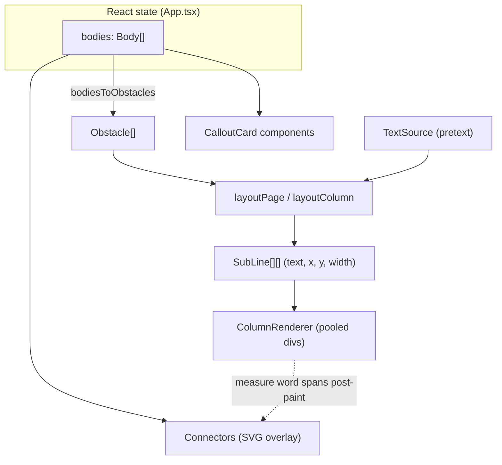
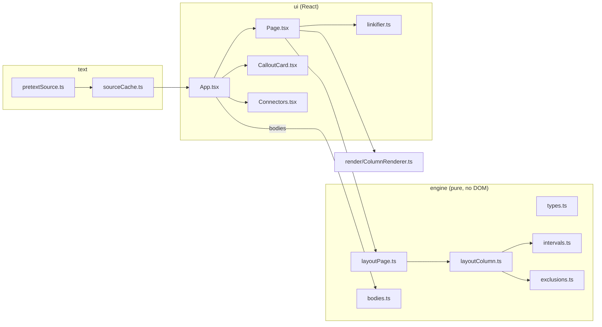

# Dynamic Reflowing Callouts: A Browser Text-Layout Engine

This article is a technical deep dive into a single afternoon's project: a web application that lays out multi-column body text and makes that text flow around rectangular "callout" cards which the user can drag, resize, open from words in the prose, and watch shove each other out of the way. The project was built in three tickets — a reflow engine (GRID-CALLOUT-001), click-to-expand definition callouts (GRID-CALLOUT-002), and a non-overlap placement solver (GRID-CALLOUT-003) — followed by two refinements: unifying the two kinds of callout into one component, and making the connector lines between a card and its originating word track that word through reflow.

The goal of this report is not to catalogue an API. It is to explain why the system is shaped the way it is. The central design decision — separating *text measurement* from *layout* from *rendering* through narrow interfaces — is what made each subsequent feature a small addition rather than a rewrite. Every later capability (definition cards, collision resolution, live connectors) is built on the fact that the engine treats a callout as nothing more than a rectangle, and treats text as a pull-based stream of measured lines.

## 1. What the system does

The application renders a page of body text in one or more columns. On top of that text the user places callouts. The text reflows around every callout in real time. There are two ways a callout comes into existence: the user clicks "+ Add callout" to drop a free card, or the user clicks a dotted-underlined word in the prose, which opens a definition card anchored to that word. Either kind can be dragged, resized, given a reflow mode, and closed. No two callouts may overlap; dragging one pushes the others aside, and opening a definition card seats it in the nearest free space. A dotted connector line links each definition card to its word and follows the word as reflow moves it.

The entire layout — which text lands on which line at which horizontal offset — is computed in JavaScript from measured glyph widths, not delegated to the browser's native float or CSS-exclusions machinery. This is the defining constraint of the project and the reason a measurement library is at its foundation.



## 2. The foundation: text measurement as a pull-based stream

Laying text out around an obstacle requires answering one question repeatedly: given a starting position in the text and a maximum width, what is the longest run of words that fits, and where does the next run begin? The browser does not expose this directly. Measuring text in the DOM means inserting nodes and reading back geometry, which is both slow and entangled with layout. The project instead uses `@chenglou/pretext`, a small zero-dependency measurement library that performs glyph measurement against a canvas context and exposes a two-phase API.

The first phase, `prepareWithSegments(text, font, options)`, runs once per unique text-and-font pair. It performs the expensive analysis: segmenting the text into words and graphemes and preparing the data structures needed for fast line breaking. The second phase, `layoutNextLine(prepared, cursor, maxWidth)`, runs once per line. It is cheap and, crucially, accepts a *different* `maxWidth` on every call. That last property is what makes reflow around obstacles possible: a single line of a column might be split into several horizontal slots of different widths, and each slot is filled by a separate `layoutNextLine` call with that slot's width.

A `cursor` is an opaque position in the prepared text:

```ts
interface Cursor { segmentIndex: number; graphemeIndex: number }
interface LineResult { text: string; width: number; end: Cursor }
```

The `graphemeIndex` is non-zero only when a break falls inside a word (for example, a long word broken mid-token). The engine never inspects the cursor's internals; it stores the `end` cursor of one line and passes it as the start of the next.

### 2.1 The TextSource seam

The engine does not depend on pretext directly. It depends on an interface:

```ts
interface TextSource {
  nextLine(cursor: Cursor, maxWidth: number): LineResult | null
}
```

This interface has a precise contract, documented in the type itself, and the contract is load-bearing:

> As long as text remains at `cursor`, `nextLine` MUST make progress — return a `LineResult` that advances `end` past `cursor`, emitting at least one grapheme even if it overflows `maxWidth`. `null` therefore means ONLY "text fully exhausted", never "this slot is too narrow".

The reason this contract matters is that the layout loop uses `null` as its single termination signal. If a `TextSource` returned `null` for a too-narrow slot instead of forcing at least one grapheme, the engine could not distinguish "this column is full" from "this particular slot was unusably thin," and would either loop forever or stop early. The pretext adapter enforces the contract by asserting progress:

```ts
export function createPretextSource(text: string, font: string, options?: PrepareOptions): TextSource {
  const prepared = prepareWithSegments(text, font, options)
  return {
    nextLine(cursor, maxWidth) {
      const line = layoutNextLine(prepared, cursor, maxWidth)
      if (line === null) return null
      if (line.end.segmentIndex === cursor.segmentIndex &&
          line.end.graphemeIndex === cursor.graphemeIndex) {
        throw new Error('pretextSource: layoutNextLine made no progress (slot too narrow?)')
      }
      return { text: line.text, width: line.width, end: line.end }
    },
  }
}
```

The seam pays off twice. First, it lets the engine be unit-tested without a browser or a canvas: the test suite supplies a monospace fake `TextSource` whose line widths are exactly `characters × cellWidth`, so every assertion about wrapping and slot-filling is exact arithmetic rather than a floating-point comparison against real font metrics. Second, it isolates the one external dependency behind a two-method surface, so a different measurement backend could be substituted without touching the layout algorithm.

## 3. The reflow engine: scanline free-interval packing

The engine's job is to convert a column geometry and a list of obstacles into a list of positioned text lines. The algorithm is a vertical sweep, one line-height at a time, that subtracts obstacles from each line to find the free horizontal slots and then pours text into those slots.

### 3.1 The coordinate model

Everything lives in one page coordinate space measured in pixels, with the origin at the top-left of the page element. A page is 900×1200 with a symmetric 32-pixel inset (`PAGE_PAD`) and a 32-pixel gutter between columns. A column carries its own geometry and the two layout parameters the sweep needs:

```ts
interface Column {
  x: number; width: number; top: number; bottom: number;
  lineHeight: number; minIntervalWidth: number;
}
```

`minIntervalWidth` is the threshold below which a free slot is discarded as too thin to hold text. Without it, a one-pixel sliver to the left of a callout would be handed to the `TextSource`, which would be forced to emit a grapheme into it, producing a column of single letters.

### 3.2 Interval subtraction

The geometric core is interval subtraction: given a base interval (the column's left and right edges) and a set of blocked intervals (the horizontal spans obstacles occupy on this line), return the remaining usable slots, left to right, dropping any narrower than `minWidth`.

```ts
export function carveTextLineSlots(base: Interval, blocked: Interval[], minWidth: number): Interval[] {
  let slots: Interval[] = [{ left: base.left, right: base.right }]
  for (const b of blocked) {
    const next: Interval[] = []
    for (const s of slots) {
      if (b.right <= s.left || b.left >= s.right) { next.push(s); continue } // no overlap
      if (b.left > s.left) next.push({ left: s.left, right: b.left })          // left remainder
      if (b.right < s.right) next.push({ left: b.right, right: s.right })      // right remainder
    }
    slots = next
  }
  return slots.filter((s) => s.right - s.left >= minWidth)
}
```

The function is pure and total: a blocked interval that misses a slot leaves it intact; a blocked interval that splits a slot produces two remainders; a blocked interval that covers a slot produces none. Because it processes blocked intervals one at a time against the current set of slots, two overlapping obstacles on the same line compose correctly.

### 3.3 Mapping an obstacle to a blocked interval

Interval subtraction needs the blocked spans for a line. Computing them is the responsibility of `exclusionIntervalFor`, which takes one obstacle, one column, and one line band, and returns the horizontal interval that obstacle forbids in that column on that band — or `null` if the obstacle does not touch this column-and-band. This function also encodes the four reflow modes.

```ts
export function exclusionIntervalFor(ob: Obstacle, column: Column, band: Band): Interval | null {
  const pad = ob.pad ?? 0
  const obTop = ob.rect.y - pad
  const obBottom = ob.rect.y + ob.rect.h + pad
  if (band.bottom <= obTop || band.top >= obBottom) return null // no vertical overlap

  const colLeft = column.x
  const colRight = column.x + column.width
  const oL = Math.max(colLeft, ob.rect.x - pad)
  const oR = Math.min(colRight, ob.rect.x + ob.rect.w + pad)
  if (oR <= oL) return null // obstacle misses this column horizontally

  switch (ob.mode) {
    case 'wrap':        return { left: oL,      right: oR }
    case 'float-left':  return { left: colLeft, right: oR }
    case 'float-right': return { left: oL,      right: colRight }
    case 'push':        return { left: colLeft, right: colRight }
  }
}
```

The vertical-overlap test is half-open (`band.bottom <= obTop || band.top >= obBottom`), which is the correct boundary handling: a band whose bottom edge exactly meets an obstacle's top edge does not overlap it, so a callout aligned to a line boundary does not spuriously block the line above it. The obstacle is clipped to the column horizontally, which is what allows a single wide callout that spans the gutter to block part of two adjacent columns: it is tested independently against each column and produces a different interval in each.

The four modes differ only in which interval they forbid:

| Mode | Blocked interval | Effect on text |
|------|------------------|----------------|
| `wrap` | the obstacle's own span | text flows on both sides of the callout |
| `float-left` | from the column's left edge to the obstacle's right | text flows only to the right |
| `float-right` | from the obstacle's left to the column's right edge | text flows only to the left |
| `push` | the whole column width | no text beside the callout; the line is fully cleared |

### 3.4 The column sweep

`layoutColumn` ties the pieces together. It sweeps from the column top to the bottom, one `lineHeight` per iteration. For each band it gathers the blocked intervals from every obstacle, carves the free slots, and fills each slot by pulling from the `TextSource`. A single cursor is shared across all slots of all bands.

```ts
export function layoutColumn(source, column, obstacles): { lines: SubLine[]; cursor: Cursor } {
  if (column.lineHeight <= 0) throw new Error('Column.lineHeight must be > 0')
  let cursor: Cursor = { segmentIndex: 0, graphemeIndex: 0 }
  let y = column.top
  const lines: SubLine[] = []
  let exhausted = false

  while (!exhausted && y + column.lineHeight <= column.bottom) {
    const band = { top: y, bottom: y + column.lineHeight }
    const blocked: Interval[] = []
    for (const ob of obstacles) {
      const ex = exclusionIntervalFor(ob, column, band)
      if (ex !== null) blocked.push(ex)
    }
    const slots = carveTextLineSlots(
      { left: column.x, right: column.x + column.width }, blocked, column.minIntervalWidth)
    for (const slot of slots) {
      const line = source.nextLine(cursor, slot.right - slot.left)
      if (line === null) { exhausted = true; break }
      lines.push({ text: line.text, x: slot.left, y, width: line.width })
      cursor = line.end
    }
    y += column.lineHeight
  }
  return { lines, cursor }
}
```

The single shared cursor is the subtle and important part. When a `wrap`-mode callout splits a band into a left slot and a right slot, the engine fills the left slot first, advances the cursor past the words it consumed, then fills the right slot starting from that cursor. The result is that reading order is preserved across the split: the prose continues left to right, then to the next slot, then down to the next line. A naive implementation that gave each slot its own cursor would duplicate text on both sides of the callout.

The guard `if (column.lineHeight <= 0)` exists because a non-positive line height would never advance `y`, producing an infinite loop. The function returns the end cursor as well as the lines, even though the current page layout does not use it; it is the hook for a future feature where text overflowing one column continues into the next.

### 3.5 The page

`layoutPage` is deliberately thin. It lays out every column against the *same* obstacle list, relying on `exclusionIntervalFor` to clip each obstacle to each column:

```ts
export function layoutPage(columns, obstacles): SubLine[][] {
  return columns.map(({ column, source }) => layoutColumn(source, column, obstacles).lines)
}
```

There is no cross-column text flow in this version — each column has its own independent text source — but a single obstacle that straddles the gutter reflows both columns automatically, because both columns see it and each clips it to its own bounds.

### 3.6 Reading a trace

A concrete trace makes the slot mechanism visible. Consider a two-column page with a `wrap`-mode callout whose rectangle overlaps the right portion of the left column on three consecutive line bands. For each of those bands, `exclusionIntervalFor` returns the callout's clipped span, `carveTextLineSlots` returns a single left-remainder slot, and `layoutColumn` emits one `SubLine` per band positioned at the column's left edge with a width equal to the gap between the column edge and the callout. Verified against real pretext measurement, a typical body line reports a width such as 410.45 pixels in the unobstructed bands and a narrower width in the obstructed bands, with more than twenty wrapped lines per column. The line positions change the instant the callout moves, because the layout is recomputed from the obstacle rectangles on every change.

## 4. Rendering: pooled divs off the layout path

Computing positions is half the problem; painting them efficiently while the user drags a callout at sixty frames per second is the other half. The renderer is an imperative pooled-`<div>` painter, deliberately kept outside React's reconciliation.

```ts
export class ColumnRenderer {
  paint(lines: SubLine[], decorate?: (el: HTMLDivElement, text: string) => void): void {
    while (this.pool.length < lines.length) {
      const el = document.createElement('div')
      el.className = 'reflow-line'
      el.style.position = 'absolute'; el.style.left = '0'; el.style.top = '0'
      el.style.whiteSpace = 'pre'; el.style.willChange = 'transform'
      this.container.appendChild(el); this.pool.push(el)
    }
    for (let i = 0; i < lines.length; i++) {
      const el = this.pool[i]!, sl = lines[i]!
      if (decorate) decorate(el, sl.text); else el.textContent = sl.text
      el.style.transform = `translate(${sl.x - this.origin.x}px, ${sl.y - this.origin.top}px)`
      el.style.width = `${sl.width}px`
      el.style.willChange = 'transform'; el.hidden = false
    }
    for (let i = lines.length; i < this.pool.length; i++) {
      const el = this.pool[i]!; el.hidden = true; el.style.willChange = ''
    }
  }
}
```

Three decisions in this class are worth stating explicitly. First, each line is positioned with a CSS `transform: translate(...)` rather than `top`/`left`. A transform is a compositor operation; changing it does not invalidate the browser's layout, so repositioning every line each frame stays cheap. Second, the divs are pooled and reused across paints; the number of DOM nodes is the high-water mark of line count, not a fresh allocation per frame. Third, `will-change: transform` is promoted on active lines and removed (`''`) on parked lines, so the compositor only holds layers for lines that are actually on screen. The pool is cleaned up explicitly through a `destroy()` method, called when the set of columns changes, to avoid orphaned divs.

The lines hold real text nodes, not painted glyphs, so native text selection and clickable spans continue to work. This becomes essential for the definition-callout feature, which needs the words to be hit-testable.

### 4.1 The React/imperative boundary

The application is a React-plus-Vite hybrid. React owns the shell, the controls, the column containers, and the callout cards — anything whose structure changes rarely. The hot path — repositioning potentially hundreds of text lines on every drag frame — is owned by the imperative `ColumnRenderer`. The boundary is the `Page` component, which renders the column container `<div>`s with React and then, in an effect, runs `layoutPage` and hands the results to the renderers:

```tsx
useEffect(() => {
  const out = layoutPage(columns, obstacles)
  const linker = createLinker(linkTerms, activeTerms ?? new Set())
  renderers.current.forEach((r, i) => r.paint(out[i]!, (el, text) => linker.decorate(el, text)))
}, [columns, obstacles, linkTerms, activeTerms])
```

This split is the reason dragging is smooth. If each text line were a React element, every drag frame would reconcile hundreds of virtual nodes. Instead, a drag frame changes one object in `obstacles`, the effect reruns, and the renderer updates DOM nodes directly with no virtual-DOM diffing.

## 5. Interaction: dragging and resizing

Dragging is handled by a `useDragResize` hook that returns a pointerdown-handler factory. The card and each of its eight resize handles call `startDrag(handle)` on pointerdown. The hook captures the pointer, listens on the window for move and up, and reports a new rectangle.

Two details make it robust. First, updates are throttled to one per animation frame: a pointermove stores the pending rectangle and schedules a `requestAnimationFrame` if one is not already pending, so a burst of pointer events collapses into one layout per frame. Second, the listeners are removed on pointerup, on pointercancel, and on component unmount, so a card removed mid-drag cannot leave dangling window listeners. The rectangle math is a separate pure function that translates a pointer delta into a new rectangle for a given handle, anchoring the opposite edge and clamping to a minimum size without inverting the rectangle.

## 6. Definition callouts: making words interactive

The second ticket added a content-driven reason for callouts to exist. Certain words in the prose carry a definition. They render as dotted-underline links; clicking one opens a card with the term's definition, anchored to the word, and the columns reflow around it.

The definitions come from a small glossary map, and only the *first* occurrence of each term in the body is linked. First-occurrence-only is a deliberate choice: a six-fold repeated lorem-ipsum paragraph contains the same words many times, and linking every occurrence would produce a sea of links and many cards competing for the same anchor.

### 6.1 The hit-testing problem

The renderer paints each line as a single `<div>` with a text node. A plain text node has no per-word structure, so no individual word is clickable. The solution is a per-repaint *linkifier* that rewrites each line's content into a mix of text nodes and `<span class="def-link" data-term="…">` elements, wrapping the first not-yet-linked occurrence of each glossary term.

```ts
export function createLinker(terms: string[], activeTerms: Set<string>) {
  const consumed = new Set<string>()
  const pattern = terms.length > 0
    ? new RegExp(`\\b(${terms.map(escapeRe).join('|')})\\b`, 'gi') : null
  return {
    decorate(el: HTMLElement, text: string): void {
      el.textContent = ''
      if (pattern === null) { el.textContent = text; return }
      pattern.lastIndex = 0
      let last = 0, linked = false, m: RegExpExecArray | null
      while ((m = pattern.exec(text)) !== null) {
        const term = m[1]!.toLowerCase()
        if (consumed.has(term)) continue            // first occurrence already linked
        consumed.add(term); linked = true
        if (m.index > last) el.appendChild(document.createTextNode(text.slice(last, m.index)))
        const span = document.createElement('span')
        span.className = activeTerms.has(term) ? 'def-link def-link-active' : 'def-link'
        span.dataset.term = term; span.textContent = m[0]
        el.appendChild(span)
        last = m.index + m[0].length
      }
      if (!linked) { el.textContent = text; return }
      if (last < text.length) el.appendChild(document.createTextNode(text.slice(last)))
    },
  }
}
```

The hard part is enforcing first-occurrence-only across the whole page, in reading order, when the page is painted column by column and the layout output carries no global character offsets. A `SubLine` knows its text but not where that text sits in the original body. The solution exploits the painting order: `Page` creates exactly one linker per full repaint and paints the columns in index order, so the linker's shared `consumed` set causes the first match — in column zero, then column one — to win. The linker is recreated on every repaint, which resets the set. The match is whole-word and case-insensitive, so "Lorem" at the start of a sentence links while "doloremque" does not.

### 6.2 From a click to a callout

Clicks are handled by event delegation on the page container. A click whose target carries a `data-term` is resolved into a word anchor expressed in page coordinates:

```ts
const handleClick = (e: React.MouseEvent) => {
  const t = e.target as HTMLElement
  const term = t?.dataset?.term
  if (!term || !onTermClick) return
  const pageRect = e.currentTarget.getBoundingClientRect()
  const r = t.getBoundingClientRect()
  onTermClick({ term, x: r.left - pageRect.left, y: r.top - pageRect.top, w: r.width, h: r.height })
}
```

The span's bounding rectangle is in viewport coordinates; subtracting the page container's rectangle converts it into the page space the obstacles and columns live in. Because the page element sits at the stage origin, page space and stage space coincide, so the resulting rectangle can be used directly to position the card. The card is placed just below the word, becomes an obstacle in `wrap` mode, and the reflow follows for free because obstacles drive the layout.

A connector line and a highlight complete the visual link: the clicked word receives a `def-link-active` background, and a non-interactive SVG overlay draws a dotted line from the word to the card.

## 7. Non-overlapping callouts: placement as a soft-constraint problem

By the third ticket, two callouts could sit on top of one another. The requirement was that they never overlap: dragging a callout should push the others aside, and opening a definition card should seat it in free space rather than on top of an existing card.

This is a placement problem with no exact closed-form solution. Each callout wants to be somewhere — near its word, or where the user dropped it — but the no-overlap constraint may make that impossible, and which callout yields is a matter of policy, not arithmetic. The chosen approach is iterative local relaxation: repeatedly push overlapping rectangles apart until none overlap, while honoring page boundaries and a notion of which callout is currently pinned.

### 7.1 One body model

The precondition for any solver is that it sees every callout at once. Before this ticket, the application kept two separate state lists — free callouts and definition callouts — merged only when handed to the engine. The ticket unified them into a single list of bodies:

```ts
export interface Body {
  id: string                        // 'free:c3' | 'def:dolor'
  kind: 'free' | 'def'
  rect: Rect
  mode: ReflowMode                  // 'wrap' for definition bodies
  term?: string                     // glossary key, for def bodies
  anchor?: { x: number; y: number } // connector target, for def bodies
}
```

Everything else is derived from `bodies`: the engine's obstacle list (`bodiesToObstacles`), the rendered cards (filtered by kind), the highlighted active terms, and the connectors. The `mode` field is carried per body specifically so that free callouts keep their per-callout reflow mode after unification; the solver ignores `mode` entirely and reads only `rect`.

### 7.2 Minimum-translation separation

Two axis-aligned rectangles that overlap interpenetrate by some amount horizontally and some amount vertically. The cheapest way to separate them is to push along the axis of smaller penetration. `overlap` computes that minimum-translation vector, folding a gap into the penetration so separated rectangles end up with clearance, and returning `null` when the rectangles are already at least `gap` apart.

```ts
export function overlap(a: Rect, b: Rect, gap = 0): MTV | null {
  const ox = Math.min(right(a), right(b)) - Math.max(a.x, b.x) + gap
  const oy = Math.min(bottom(a), bottom(b)) - Math.max(a.y, b.y) + gap
  if (ox <= 0 || oy <= 0) return null
  if (ox < oy) return { dx: (Math.sign(cx(a) - cx(b)) || 1) * ox, dy: 0 }
  return { dx: 0, dy: (Math.sign(cy(a) - cy(b)) || 1) * oy }
}
```

The `Math.sign(...) || 1` term handles the degenerate case of two rectangles with coincident centers: `Math.sign(0)` is `0`, and `|| 1` forces a deterministic direction, which avoids producing a zero-magnitude push that would leave the rectangles stuck together.

### 7.3 The relaxation solver

`relaxLayout` runs several passes. Each pass walks every unordered pair of bodies in fixed index order; for each overlapping pair it applies the minimum-translation vector. A pinned body never moves — its partner absorbs the full push — and two unpinned partners split the push evenly. After each pass, every non-pinned body is clamped back inside the page bounds. The loop stops early when a pass moves nothing.

```ts
export function relaxLayout(bodies, bounds, pinned, { gap = 8, iterations = 16 } = {}): Body[] {
  const work = bodies.map((b) => ({ ...b, rect: { ...b.rect } }))   // never mutate input
  for (let iter = 0; iter < iterations; iter++) {
    let moved = false
    for (let i = 0; i < work.length; i++) {
      for (let j = i + 1; j < work.length; j++) {
        const a = work[i]!, b = work[j]!
        const mtv = overlap(a.rect, b.rect, gap)                     // mtv separates `a` from `b`
        if (!mtv) continue
        const aPin = pinned.has(a.id), bPin = pinned.has(b.id)
        if (aPin && bPin) continue                                   // accept residual overlap
        else if (aPin) b.rect = shift(b.rect, -mtv.dx, -mtv.dy)
        else if (bPin) a.rect = shift(a.rect, mtv.dx, mtv.dy)
        else { a.rect = shift(a.rect, mtv.dx / 2, mtv.dy / 2); b.rect = shift(b.rect, -mtv.dx / 2, -mtv.dy / 2) }
        moved = true
      }
    }
    for (const bd of work) if (!pinned.has(bd.id)) bd.rect = clampToBounds(bd.rect, bounds)
    if (!moved) break
  }
  return work
}
```

The sign handling is the part most likely to be implemented backwards. `overlap(a, b)` returns the vector that moves `a` to escape `b`. Therefore, when `a` is pinned, `b` moves by the *negation* of that vector; when `b` is pinned, `a` moves by the vector itself; when neither is pinned, each moves half. The function is pure — it deep-copies each rectangle before mutating — which is a requirement, not a nicety, because React state updates depend on the input not being mutated in place. Determinism is also a requirement: the fixed pair-iteration order means identical input produces identical output, which is what makes the behavior testable and the motion stable.

This is best-effort relaxation, and the code says so. Two situations leave residual overlap after all passes: a pair where both bodies are pinned, and a free body squeezed between a pinned neighbor and a wall. These are documented and accepted rather than chased, because chasing them would introduce motion that fights the user.

### 7.4 Interaction policy through pinning

The three interactions use the same separation primitive and differ only in which bodies are pinned. The pinned set encodes the intent "this is what the user means right now; everything else yields."

| Interaction | Pinned set | Result |
|-------------|-----------|--------|
| Drag or resize a callout | the manipulated body | neighbors are pushed out of the way; the dragged body stays under the cursor |
| Open a definition / add a free callout | every existing body | only the newcomer moves; the established arrangement is left undisturbed |
| Close a callout | — (no relax) | removal cannot create overlap |
| Change a callout's mode | — (no relax) | mode is not geometry |

Pinning the dragged body during a drag is what keeps the card under the pointer; if the dragged body were free to move, the solver could push it away from the cursor, which would feel like the card resisting the user. Pinning the existing bodies on open is what prevents a newly opened card from scrambling the user's arrangement.

### 7.5 The cornered-newcomer bug

The "newcomer yields, existing pinned" policy has a failure mode that an end-to-end test caught. When a definition card opens against the page edge while every existing body is pinned, the single newcomer-only pass cannot separate it: the newcomer cannot move further into the wall, and it is forbidden from pushing the pinned bodies. The test that dragged a callout and then opened two definitions reported residual overlap, and — importantly — the test was written to assert non-overlap, not merely to take a screenshot, so the failure surfaced as a red assertion rather than a subtly wrong picture.

The fix is a two-pass placement helper. The first pass moves only the newcomer. If that leaves overlap, a second pass with nothing pinned relaxes everyone so the result is overlap-free.

```ts
export function placeNewBody(existing: Body[], nb: Body, bounds: Rect, opts?: RelaxOptions): Body[] {
  const seated = relaxLayout([...existing, nb], bounds, new Set(existing.map((b) => b.id)), opts)
  return relaxLayout(seated, bounds, new Set(), opts)
}
```

The second pass is free in the common case. `relaxLayout` early-breaks on a clean pass, so when the first pass already separated everything, the second pass performs a single no-op iteration and returns the bodies unchanged. Existing cards therefore shift only when the newcomer genuinely could not be seated otherwise. The helper has its own unit test that constructs a newcomer boxed between two pinned neighbors with no vertical room, so the second pass is actually exercised.

## 8. Unifying the two card components

The data model was unified in the third ticket, but the rendering was not: free callouts used a draggable `CalloutCard` and definition callouts used a static `DefinitionCard`. The next refinement collapsed them into a single component. A definition callout is the same `Body` as a free callout; the only differences are content (a definition shows its glossary title and body) and color (a `--def` CSS modifier). One `CalloutCard` now renders any body with drag, eight resize handles, a reflow-mode selector, and a close button. Definition cards therefore became draggable, resizable, and closable, and free callouts gained a close button they previously lacked. The close handler is a single `removeBody(id)` for both kinds.

The only subtlety is that the close button and the mode selector must stop pointerdown propagation, so that using a control does not also start a card drag. This is the same technique the mode selector already used, now applied to both controls.

## 9. Live connectors: tracking the word through reflow

A connector's word end was originally captured once, when the card opened. After any reflow that moved the word — another callout dragged in, a card opened nearby, a font change — the line pointed at empty space. The final refinement made the word end live.

The word's position is knowable only after layout, because the engine emits no per-word coordinates; the only source of truth is the rendered span. `Page` therefore measures the span after each paint and reports the live position upward:

```ts
if (onWordAnchors && pageRef.current && activeTerms && activeTerms.size > 0) {
  const pageRect = pageRef.current.getBoundingClientRect()
  const anchors: Record<string, { x: number; y: number }> = {}
  for (const term of activeTerms) {
    const span = pageRef.current.querySelector<HTMLElement>(`[data-term="${CSS.escape(term)}"]`)
    if (!span) continue
    const r = span.getBoundingClientRect()
    anchors[term] = { x: r.left + r.width / 2 - pageRect.left, y: r.bottom - pageRect.top }
  }
  onWordAnchors(anchors)
}
```

`App` stores the reported anchors in state, and the `connectors` memo prefers the live anchor over the open-time one, falling back to the stored anchor only until the first measurement. Because the card end of the connector already derives from the live body rectangle, both ends are now live.

The one hazard in this design is a render loop, and the design avoids it by construction. Setting the word-anchor state does not change any dependency of the paint effect, so the sequence is: paint, measure, set state, re-render, recompute the connectors memo, redraw the SVG — with no second paint and therefore no loop. During a drag the paint effect already runs every frame because the obstacle rectangles change, so the per-frame cost of one `querySelector` and one `getBoundingClientRect` per open definition is negligible.

## 10. Testing strategy

The test suite has two layers, and the division of labor between them is deliberate.

The unit layer covers the pure logic — interval subtraction, exclusion mapping, the column sweep, the separation solver, the linkifier — with Vitest under jsdom. The engine tests use the monospace fake `TextSource`, so wrapping assertions are exact integer arithmetic. The solver tests assert separation, immobility of pinned bodies, chain propagation through three bodies, idempotence on already-separated input, immutability of the input, and bounds containment. The final suite is fifty unit tests.

The end-to-end layer drives the real application with Playwright's bundled headless Chromium, measuring DOM geometry and asserting invariants. The non-overlap test adds a callout, drags it onto another, and asserts their bounding boxes no longer intersect; it then opens two definitions and asserts no card overlaps another; it then drags an open definition card and asserts the same. The connector-tracking test opens a definition, asserts the connector starts on the word, drags a callout to reflow that word to a different line, and asserts the connector still starts on the word and that the word actually moved.

Two practical notes came out of building the e2e layer. The system Chrome in the build environment reports an unusable GPU process, so the tests use Playwright's own bundled Chromium rather than the MCP browser. And Playwright's `fill` on a React-controlled `<input type="number">` sets the DOM value but does not trigger React's `onChange`, so font-size changes could not be driven that way; the connector-tracking test reflows the page by dragging a callout instead.

| Layer | Tool | What it proves | Example assertion |
|-------|------|----------------|-------------------|
| Unit | Vitest + jsdom + monospace fake | Pure geometry and algorithms | "a pinned body does not move; its partner takes the whole push" |
| End-to-end | Playwright headless Chromium | Real reflow, real measurement, real interaction | "all cards overlap after dragging a def card: false" |

## 11. Process: how the work was structured

The project used a documentation-and-delegation workflow. Each ticket lived in a `docmgr` workspace with an investigation diary written in a fixed format — prompt context, what was done, what worked, what did not, what was tricky, what warrants review — updated at every step. The first ticket produced an intern-facing design guide before any code; the third did the same and added a phased, test-driven implementation plan with complete code in every step.

The third ticket was implemented by subagent-driven development: a fresh implementer agent per task, followed by a spec-compliance review and then a code-quality review, with each agent also writing its own diary step. Two real defects were caught this way. The cornered-newcomer overlap was found by the end-to-end task, whose implementer correctly refused to weaken the assertion and reported the task blocked. A code-quality review of the solver flagged a test that asserted only the direction of a push, not its magnitude, on the core function; the assertion was strengthened to pin the exact value.

The discipline that made these catches possible is that the tests assert invariants, not appearances. A screenshot of overlapping cards can look almost right; an assertion that two bounding boxes do not intersect cannot be almost right.

## 12. Design decisions

The decisions that shaped the system, and the reason each was made:

- **Compute layout in JavaScript from measured widths.** The browser's float and CSS-exclusions features cannot express text flowing around a freely-positioned, draggable rectangle across columns with per-callout modes. Owning the layout makes every reflow a pure function of the obstacle rectangles.
- **Depend on a `TextSource` interface, not on pretext.** A two-method seam isolates the one external dependency and makes the engine testable without a browser.
- **Treat every callout as a rectangle.** The engine knows nothing about definitions, drag handles, or connectors. Definition cards and free cards are the same obstacle, which is why each feature was additive.
- **Paint text imperatively with pooled, transform-positioned divs.** Keeping the hot path out of React's reconciliation is what makes per-frame reflow smooth.
- **Model non-overlap as iterative relaxation with pinning, not as global optimization.** There is no exact solution; a local solver that responds to a pinned constraint produces the interactive push behavior the feature requires.
- **Express interaction policy as the choice of pinned set.** Drag, open, and add are the same separation primitive with different bodies held fixed.
- **Measure word positions after paint for live connectors.** The engine emits no per-word coordinates, so the rendered span is the only source of truth.

## 13. Limitations and future work

The system is a demo, and several boundaries are documented rather than hidden. There is no cross-column text flow; each column has an independent text source, though `layoutColumn` already returns the end cursor that such a feature would need. Text is not justified. A glossary term split across a line break is not linked at that occurrence, which is acceptable for single-word terms. The separation solver is best-effort: a sufficiently packed page can leave residual overlap, and the project does not stack, scroll, or shrink to recover. A dragged definition card keeps its connector anchored to the word's current position, which is correct, but there is no logic to re-target the connector to a column edge when the card is dragged far away. A possible future addition is a "tidy" command that runs a stronger global relaxation pass, in contrast to the local, minimally-disruptive relaxation used during interaction.

## 14. Architecture reference

The source layout, by responsibility:

| File | Responsibility |
|------|----------------|
| `app/src/engine/types.ts` | `Cursor`, `LineResult`, `TextSource`, `Interval`, `Rect`, `Band`, `ReflowMode`, `Obstacle`, `Column`, `SubLine` |
| `app/src/engine/intervals.ts` | `carveTextLineSlots` — interval subtraction |
| `app/src/engine/exclusions.ts` | `exclusionIntervalFor` — obstacle-to-blocked-interval, the mode table |
| `app/src/engine/layoutColumn.ts` | the vertical sweep and slot-filling |
| `app/src/engine/layoutPage.ts` | per-column layout against one obstacle list |
| `app/src/engine/bodies.ts` | `Body`, `overlap`, `clampToBounds`, `relaxLayout`, `placeNewBody`, `bodiesToObstacles` |
| `app/src/text/pretextSource.ts` | the pretext `TextSource` adapter and progress assertion |
| `app/src/text/sourceCache.ts` | memoization of `TextSource` creation by text and font |
| `app/src/render/ColumnRenderer.ts` | pooled-div imperative painter |
| `app/src/ui/Page.tsx` | React/imperative boundary; paint effect; click delegation; live word-anchor measurement |
| `app/src/ui/CalloutCard.tsx` | the unified card: drag, resize, mode, close, content by kind |
| `app/src/ui/useDragResize.ts` | rAF-throttled drag/resize with listener cleanup |
| `app/src/ui/rectMath.ts` | `resizeRect`, minimum-size clamping |
| `app/src/ui/Connectors.tsx` | SVG overlay drawing word-to-card lines |
| `app/src/ui/linkifier.ts` | per-repaint first-occurrence term linkifier |
| `app/src/content/glossary.ts` | the demo glossary map |
| `app/src/App.tsx` | the single `bodies` state and all interaction handlers |



The shape of this dependency graph is the project's main result. The engine package has no knowledge of React, the DOM, callouts, definitions, or connectors. It converts columns and rectangles into positioned lines. Every feature added after the engine — interactive definitions, collision resolution, unified cards, live connectors — was implemented in the UI layer by changing what rectangles get fed in and what gets drawn on top, without reopening the layout algorithm. The narrow `TextSource` and `Obstacle` interfaces are what made that possible.
