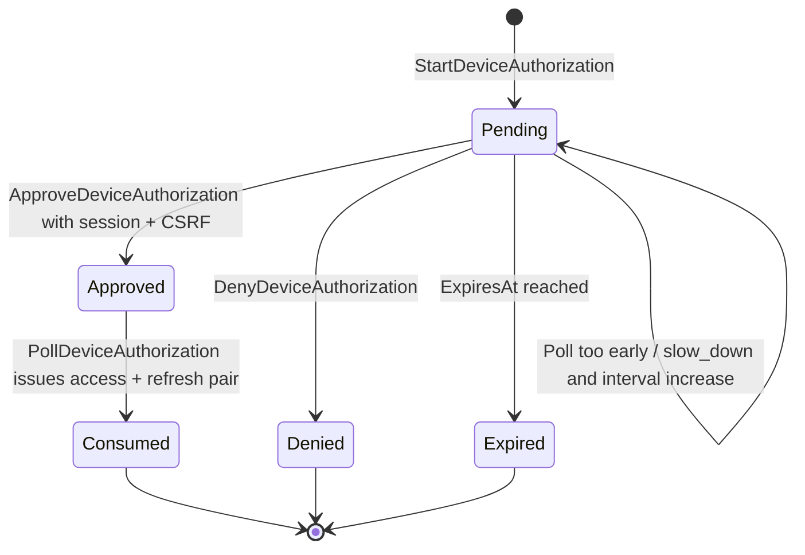
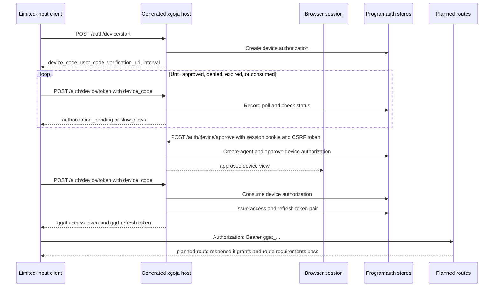

# go-go-goja Token Families and Device Authorization Flow: Deep Dive

This report explains the final programmatic-auth work that happened after the earlier end-to-end agent/fetch report. That earlier report covered automation agents, API tokens, route auth requirements, guarded client fetch, and the generated server-and-agent smoke example. The later work completes the remaining token lifecycle and device-login portions of the design: short-lived access tokens, rotating refresh-token families, browser-approved device authorization, native generated-host endpoints, help documentation, smoke coverage, final reMarkable delivery, and ticket closure.

The important change is not just that there are new token types. The auth system now distinguishes direct API tokens from OAuth-style access tokens and refresh tokens. Access tokens authenticate planned routes. Refresh tokens do not. Device codes do not. A limited-input client starts with a device code, waits for a browser session to approve a user code, and only then receives an access/refresh-token pair. This keeps route authentication narrow and keeps long-lived renewal credentials out of ordinary route handling.

> [!summary]
> - `ggat_...` access tokens are short-lived bearer credentials that authenticate planned routes as agents and set `AuthMethodAccessToken`.
> - `ggrt_...` refresh tokens rotate on every use, belong to a token family, and trigger family revocation when an already-used refresh token is presented again.
> - `ggdc_...` device codes are short-lived polling credentials. They are exchanged for access/refresh tokens only after a session + CSRF protected approval step.
> - Generated hostauth services now create in-memory agent, API-token, access-token, refresh-token, and device-code stores and mount native device endpoints before JavaScript application routes.
> - The implementation is complete enough for local generated-host demos and tests. Production hardening still needs SQL-backed programauth stores, default rate-limit policy wiring for native auth endpoints, and a richer browser approval UI.

## Relationship to the previous report

The previous vault report, [[PROJECT REPORT - go-go-goja Programmatic Agent Fetch Auth - End-to-End Deep Dive]], ended with a working generated server-and-agent example. The server created an automation agent, issued an API token, protected a route with `express.agent()`, and the generated JavaScript agent called that route through `fetch.client()` rather than through `exec curl`.

That was the first complete programmatic access path, but it was intentionally the direct-token path. API tokens are useful for service accounts, CI systems, and controlled integrations where an operator can provision a credential directly. They are not the right interface for limited-input clients that need a human to authorize them through a browser session. They also do not model short-lived access credentials with renewable sessions.

The later work adds that missing layer:

| Capability | Earlier report | New work in this report |
| --- | --- | --- |
| Durable automation principal | `programauth.Agent` | Reused by access tokens and device flow. |
| Direct programmatic credential | API token, `ggpat_...` | Still supported and remains the bootstrap/simple integration path. |
| Short-lived route credential | Not present | Access token, `ggat_...`, accepted by planned-route bearer auth. |
| Renewal credential | Not present | Refresh token, `ggrt_...`, rotates and detects reuse. |
| Browser-assisted limited-input login | Designed but not implemented | Device authorization service, store, native handlers, help docs, smoke coverage. |
| Final ticket state | Main ticket still active | `XGOJA-PROGRAMMATIC-AUTH-DESIGN` closed in `4f2e2f8`. |

The new report should be read as the completion chapter for the programmatic-auth project. It focuses on credential lifecycle semantics and the device authorization state machine rather than on the JavaScript agent fetch client.

## Source map

The core implementation lives in these files in `/home/manuel/workspaces/2026-06-12/goja-express-auth/go-go-goja`:

```text
pkg/gojahttp/auth/programauth/oauth_token.go
pkg/gojahttp/auth/programauth/memory_oauth_token_store.go
pkg/gojahttp/auth/programauth/oauth_token_test.go
pkg/gojahttp/auth/programauth/device.go
pkg/gojahttp/auth/programauth/memory_device_store.go
pkg/gojahttp/auth/programauth/device_handlers.go
pkg/gojahttp/auth/programauth/device_test.go
pkg/gojahttp/auth/programauth/device_handlers_test.go
pkg/gojahttp/auth/programauth/composite.go
pkg/xgoja/hostauth/builder.go
pkg/xgoja/hostauth/services.go
cmd/xgoja/doc/28-device-authorization-programmatic-access.md
examples/xgoja/22-programmatic-agent-auth/scripts/smoke.sh
examples/xgoja/22-programmatic-agent-auth/README.md
```

The main commits are:

```text
730b4dd programauth: add access and refresh token families
9d0d1bf docs: record access refresh token phase
4758e78 programauth: add device authorization flow
3e2981a docs: record device authorization phase
a32d3eb docs: add device authorization help and smoke coverage
4f2e2f8 docs: close programmatic auth ticket
```

The ticket docs were closed under:

```text
ttmp/2026/06/15/XGOJA-PROGRAMMATIC-AUTH-DESIGN--token-and-device-login-programmatic-api-auth-design
```

## The credential model

The completed programmatic-auth model has four credential categories. Each category has a different job, storage rule, and route-auth boundary.

| Credential | Prefix | Stored as | Authenticates planned routes | Primary use |
| --- | --- | --- | --- | --- |
| API token | `ggpat_...` | Hash + lookup prefix | Yes | Direct long-lived agent credential. |
| Access token | `ggat_...` | Hash + lookup prefix | Yes | Short-lived bearer credential issued from refresh or device flow. |
| Refresh token | `ggrt_...` | Hash + lookup prefix | No | Rotating renewal credential for access-token families. |
| Device code | `ggdc_...` | Hash + lookup prefix | No | Polling credential while a user code waits for approval. |

The prefixes are not only cosmetic. They let the bearer authenticator choose the expected parser and service before doing constant-time hash comparison. They also make invalid credential classes fail early. A refresh token presented to a planned route should not produce a route actor. A device code presented to a planned route should not produce a route actor. Only API tokens and access tokens are valid planned-route bearer credentials.

The `CompositeAuthenticator` in `pkg/gojahttp/auth/programauth/composite.go` enforces this boundary. It parses `Authorization: Bearer ...`, then tries the configured bearer authenticators. API tokens remain the default first attempt, but tokens beginning with the access-token prefix are routed to the access-token authenticator first:

```go
func (a CompositeAuthenticator) authenticateBearer(ctx context.Context, raw string, spec gojahttp.SecuritySpec) (gojahttp.AuthResult, error) {
    authenticators := []BearerAuthenticator{a.APITokens, a.AccessTokens}
    if strings.HasPrefix(strings.TrimSpace(raw), defaultAccessTokenPrefix+"_") {
        authenticators = []BearerAuthenticator{a.AccessTokens, a.APITokens}
    }

    for _, authenticator := range authenticators {
        if authenticator == nil {
            continue
        }
        result, err := authenticator.AuthenticateBearer(ctx, raw, spec)
        if err == nil {
            return result, nil
        }
        lastErr = err
    }
    return gojahttp.AuthResult{}, lastErr
}
```

This design avoids a common ambiguity once multiple bearer credential types exist. All bearer credentials arrive in the same HTTP header. The prefix tells the host which parser and service should be authoritative for that raw value.

## Access tokens

An access token is a short-lived bearer credential. Its Go record is `programauth.AccessToken`:

```go
type AccessToken struct {
    ID            string
    AgentID       string
    SubjectUserID string
    FamilyID      string
    TokenHash     []byte
    TokenPrefix   string
    CreatedAt     time.Time
    UpdatedAt     time.Time
    ExpiresAt     time.Time
    LastUsedAt    *time.Time
    RevokedAt     *time.Time
    Grants        gojahttp.GrantSet
}
```

The fields encode four important facts.

First, the access token belongs to an agent. The current implementation authenticates access tokens as `PrincipalKindAgent`, and `OAuthTokenService.AuthenticateBearer` loads the agent before returning an `AuthResult`. A disabled or missing agent makes the token unusable even if the token hash is correct.

Second, the token belongs to a family. `FamilyID` links access tokens and refresh tokens that descend from the same original issuance. This is essential for refresh reuse detection and revocation policy.

Third, the token stores only `TokenHash` and `TokenPrefix`, not the raw value. The raw `ggat_...` string is returned only when the token is issued.

Fourth, the token carries a `GrantSet`. When authentication succeeds, the route enforcer later intersects this credential grant set with the route's `.allow(...)` requirements. Possessing a valid access token is not enough to call every route.

Authentication has a small number of required steps:

```text
1. Parse the raw token as `ggat_<prefix>_<secret>`.
2. Hash the raw token with the configured token hasher.
3. Load candidate stored tokens by prefix.
4. Compare candidate hashes with constant-time comparison.
5. Reject revoked or expired tokens.
6. Load the owning agent and reject disabled agents.
7. Touch `LastUsedAt`.
8. Return `AuthResult{Method: accessToken, PrincipalKind: agent, CSRFRequired: false}`.
```

The resulting `AuthResult` is deliberately close to the API-token result, but the method is different:

```go
return gojahttp.AuthResult{
    Actor:          agent.Actor(),
    Method:         gojahttp.AuthMethodAccessToken,
    PrincipalKind:  gojahttp.PrincipalKindAgent,
    PrincipalID:    agent.ID,
    CredentialID:   token.ID,
    CredentialHint: token.CredentialHint(),
    Grants:         grants,
    Scopes:         grants.ScopeStrings(),
    CSRFRequired:   false,
}, nil
```

The distinction between `apiToken` and `accessToken` matters for audit trails. Two requests may both authenticate as agents, but the credential lifecycle and revocation semantics are not the same.

## Refresh-token families

A refresh token is not a route credential. It exists to issue a replacement access token and a replacement refresh token. Every successful refresh consumes the current refresh token and creates the next generation in the same family.

The `RefreshToken` record makes the family model explicit:

```go
type RefreshToken struct {
    ID            string
    AgentID       string
    SubjectUserID string
    FamilyID      string
    Generation    int
    TokenHash     []byte
    TokenPrefix   string
    CreatedAt     time.Time
    UpdatedAt     time.Time
    ExpiresAt     time.Time
    UsedAt        *time.Time
    RevokedAt     *time.Time
    ReplacedByID  string
    Grants        gojahttp.GrantSet
}
```

The key fields are `FamilyID`, `Generation`, `UsedAt`, `RevokedAt`, and `ReplacedByID`. Together they describe a linear sequence of refresh credentials. At any moment, exactly one non-revoked, unused refresh token should be the current token for a well-behaved client.

The refresh algorithm in `OAuthTokenService.RefreshTokenPair` is structured around reuse detection:

```text
1. Look up the refresh token by prefix and hash.
2. Reject revoked tokens.
3. Reject expired tokens.
4. If `UsedAt` is already set, revoke the entire family and return unauthenticated.
5. Prepare a replacement access token and replacement refresh token.
6. Rotate the refresh token under the refresh-store lock.
7. Store the replacement access token.
8. Return the new pair.
```

The most important operation is step 6. Rotation is implemented as a store-level operation:

```go
RotateRefreshToken(ctx, currentID, next, usedAt) (current, rotated, error)
```

The memory store checks the current token, marks it used, records `ReplacedByID`, inserts the replacement, and returns clones while holding its mutex. That store-level operation prevents a service-level check-then-update race inside the memory implementation.

```go
if current.Used() {
    return RefreshToken{}, RefreshToken{}, ErrRefreshTokenUsed
}
current.UsedAt = &usedAt
current.ReplacedByID = next.ID
current.UpdatedAt = usedAt
next.FamilyID = current.FamilyID
s.tokens[current.ID] = current
s.tokens[next.ID] = next
```

The test `TestOAuthTokenRefreshDoubleUseRevokesFamily` proves the concurrency invariant for the in-memory store. Two goroutines present the same refresh token. The expected result is one successful rotation and one unauthenticated failure. That failure path revokes the family.

```go
for range 2 {
    wg.Add(1)
    go func() {
        defer wg.Done()
        _, refreshErr := service.RefreshTokenPair(ctx, issued.RefreshValue, time.Minute, time.Hour)
        results <- refreshErr
    }()
}
```

This is the correct local property for memory-backed tests. Production SQL stores still need a transaction-capable implementation that can rotate refresh tokens and insert access tokens with the appropriate isolation guarantees.

## Why refresh tokens do not authenticate routes

The implementation explicitly rejects refresh tokens in planned-route authentication. `OAuthTokenService.AuthenticateBearer` starts by parsing the raw value with `PrefixFromAccessToken`. If the raw string is a `ggrt_...` refresh token, parsing fails and the authenticator returns `ErrUnauthenticated`.

The test `TestOAuthTokenPairIssueAuthenticateRefreshAndReuse` includes the boundary directly:

```go
if _, err := service.AuthenticateBearer(ctx, issued.RefreshValue, gojahttp.SecuritySpec{Mode: gojahttp.SecurityModeUser}); !errors.Is(err, gojahttp.ErrUnauthenticated) {
    t.Fatalf("refresh token authenticated planned route, err=%v", err)
}
```

This is one of the most important safety properties in the system. Refresh tokens are higher-value credentials because they can mint future access tokens. They should be handled only by token-refresh service code with rotation and reuse detection. They should not pass through general route authorization, handler context, or application route code.

## Device authorization

The device authorization flow starts when a limited-input client asks the server for a device code and user code. The client keeps the device code and displays the user code plus verification URI to the human user. The client polls the token endpoint until the user approves or the code expires, is denied, or is consumed.

The data model is `DeviceAuthorization`:

```go
type DeviceAuthorization struct {
    ID                      string
    ClientName              string
    DeviceCodeHash          []byte
    DeviceCodePrefix        string
    UserCodeHash            []byte
    UserCode                string
    VerificationURI         string
    VerificationURIComplete string
    CreatedAt               time.Time
    UpdatedAt               time.Time
    ExpiresAt               time.Time
    PollInterval            time.Duration
    LastPolledAt            *time.Time
    ApprovedAt              *time.Time
    DeniedAt                *time.Time
    ConsumedAt              *time.Time
    AgentID                 string
    SubjectUserID           string
    TenantID                string
    Grants                  gojahttp.GrantSet
}
```

There are two codes because there are two audiences. `DeviceCodeHash` stores the secret that the polling client presents. `UserCodeHash` stores the normalized human-entered code used by the approval endpoint. The raw device code is returned only at start time. The user code is also stored in the view because it is intended to be shown to the user during approval flows.

The default values are deliberately short and conservative for local flows:

```go
const (
    defaultDeviceCodePrefix = "ggdc"
    defaultDeviceExpiry     = 10 * time.Minute
    defaultDeviceInterval   = 5 * time.Second
)
```

The device-code state transitions are:



This state machine is implemented in `DeviceService`. It has four public operations:

| Operation | Responsibility |
| --- | --- |
| `StartDeviceAuthorization` | Create the stored device authorization, return raw `device_code` and `user_code`. |
| `PollDeviceAuthorization` | Enforce interval, return pending/slow-down errors, or issue token pair after approval. |
| `ApproveDeviceAuthorization` | Bind the authorization to a browser-session user and create the agent identity. |
| `DenyDeviceAuthorization` | Mark the code denied so future polling fails. |

The polling logic is the core of the implementation. It checks terminal states first, enforces the polling interval, records the poll, and issues tokens only if the code is approved:

```text
1. Look up device authorization by `ggdc_...` prefix and hash.
2. Reject expired, denied, or consumed device codes.
3. If the client polls before `LastPolledAt + PollInterval`, increase the interval and return `slow_down`.
4. Record the poll time.
5. If the code is not approved, return `authorization_pending` with the current interval.
6. If approved, consume the device code.
7. Issue an access/refresh-token pair for the approved agent.
```

The service returns typed errors so the HTTP layer can produce OAuth-style responses:

| Service condition | HTTP `error` value |
| --- | --- |
| Not approved yet | `authorization_pending` |
| Polling too quickly | `slow_down` |
| Expired code | `expired_token` |
| Denied code | `access_denied` |
| Consumed or invalid code | `invalid_grant` |

The handler implements those mappings in `handleDevicePollError`.

## Native generated-host endpoints

The device flow is mounted as native Go-owned HTTP handlers rather than as JavaScript Express routes. This is the right boundary for the first implementation because device polling is an authentication endpoint with precise error semantics, rate-limit expectations, and credential issuance. JavaScript route code should not have to manually manage device-code hashes, interval state, refresh-token families, or OAuth-style polling responses.

Generated hostauth now constructs the full in-memory service set in `pkg/xgoja/hostauth/builder.go`:

```go
agentStore := programauth.NewMemoryAgentStore()
apiTokenStore := programauth.NewMemoryAPITokenStore()
accessTokenStore := programauth.NewMemoryAccessTokenStore()
refreshTokenStore := programauth.NewMemoryRefreshTokenStore()
deviceStore := programauth.NewMemoryDeviceAuthorizationStore()

agentService := programauth.AgentService{Store: agentStore, Now: b.options.Now}
apiTokenService := programauth.APITokenService{Store: apiTokenStore, Agents: agentService, Now: b.options.Now}
oauthTokenService := programauth.OAuthTokenService{AccessTokens: accessTokenStore, RefreshTokens: refreshTokenStore, Agents: agentService, Now: b.options.Now}
deviceService := programauth.DeviceService{Store: deviceStore, Agents: agentService, OAuthTokens: oauthTokenService, Now: b.options.Now, VerificationURI: "/auth/device"}
```

`BuildNativeHandlers` then mounts the device endpoints before JavaScript application routes:

```go
NativeHandler{Method: "POST", Path: "/auth/device/start", Handler: deviceHandlers.StartHandler()}
NativeHandler{Method: "POST", Path: "/auth/device/token", Handler: deviceHandlers.TokenHandler()}
NativeHandler{Method: "POST", Path: "/auth/device/approve", Handler: deviceHandlers.ApproveHandler()}
```

The public endpoint contract is documented in `cmd/xgoja/doc/28-device-authorization-programmatic-access.md`:

```text
POST /auth/device/start
POST /auth/device/token
POST /auth/device/approve
```

`StartHandler` accepts JSON input with `clientName`, `tenantId`, `actions`, and an optional `verificationUri`. It returns the device code, user code, verification URI, expiry, and poll interval.

`TokenHandler` accepts either JSON or `application/x-www-form-urlencoded` input. It supports the RFC-style device grant type string:

```text
urn:ietf:params:oauth:grant-type:device_code
```

`ApproveHandler` requires a valid app session cookie and `X-CSRF-Token`. It then approves the user code on behalf of the session user. This keeps browser-origin approval under the same CSRF discipline as other session-authenticated operations.

## Device endpoint sequence

The HTTP-level sequence is:



The important boundary is visible at the end. The device code never calls planned routes. The refresh token never calls planned routes. The access token is the route credential.

## Grant handling and a review note

The intended design for device approval is grant narrowing: the device start request asks for a set of grants, and the browser approval step may approve the same set or a subset. The help page and diary describe that intended behavior.

The current `ApproveDeviceAuthorization` implementation should receive a careful review here. The code uses the requested device grants when the approval request has no explicit grants:

```go
grants := spec.Grants
if len(grants.Grants) == 0 {
    grants = device.Grants.Clone()
}
grants, err = grants.Normalize()
```

If explicit approval grants are supplied, the current service normalizes those grants but does not visibly intersect them with `device.Grants` before creating the agent. That means the implementation should be reviewed and likely adjusted so explicit approval grants cannot broaden the original device request. The intended invariant is:

```text
if approval grants are empty:
    final grants = requested device grants
else:
    final grants = intersection(requested device grants, approval grants)
```

This is a small but important correctness point because device authorization is a delegated approval flow. The user should be able to narrow what the device asked for. The user should not be able to accidentally turn the approval endpoint into a broader agent-provisioning endpoint than the original device request.

This report records the discrepancy so it is not lost. It does not invalidate the architecture, but it is the highest-priority follow-up in the device-flow service logic.

## Test coverage

The tests cover the most important state transitions and credential boundaries.

`oauth_token_test.go` covers:

- issue access/refresh-token pair;
- authenticate access token as `AuthMethodAccessToken`;
- reject refresh token as a planned-route bearer token;
- refresh token rotation;
- old refresh-token reuse;
- family revocation after reuse;
- concurrent double refresh with one success and one failure;
- access-token expiry;
- disabled-agent rejection.

`device_test.go` covers:

- device start returns device code, user code, verification URI, and default poll interval;
- first poll returns `authorization_pending`;
- immediate second poll returns `slow_down`;
- approval creates/binds an agent and subject user;
- approved poll returns access/refresh tokens;
- returned access token authenticates as an agent;
- consumed device code fails;
- expired approval fails;
- denied device poll fails.

`device_handlers_test.go` covers the HTTP layer:

- JSON device start;
- JSON pending token poll;
- session-cookie and CSRF-protected approval;
- form-encoded token request;
- successful token response with `access_token`, `refresh_token`, and `Bearer` token type.

The generated example smoke test also validates the native endpoint mounting in a real generated server binary. It does not complete browser approval because the example does not include a login UI, but it proves that `/auth/device/start` and `/auth/device/token` are reachable through generated hostauth and return pending-poll semantics.

```bash
make -C examples/xgoja/22-programmatic-agent-auth smoke
```

The smoke test also continues to validate the existing API-token agent flow through the generated JavaScript `fetch.client()` agent.

## What the final architecture now supports

The completed programmatic-auth system can support three usage modes.

### Direct API-token integration

A server-side route or bootstrap command creates an agent and issues an API token. The API token is stored in a secret manager or deployment environment and presented directly to planned routes.

This mode is simple and operationally useful for CI, scheduled jobs, and controlled service integrations. Its main risk is long-lived credential handling. That risk is mitigated by explicit agent identity, redacted token views, route grants, route auth requirements, and revocation.

### Access-token route authentication

A caller presents a short-lived access token. The planned route sees an agent actor with `AuthMethodAccessToken`, grant set, credential id, and credential hint. The route does not know or care which refresh token produced the access token.

This mode is appropriate after a device flow or future token exchange flow. The access token has a shorter lifetime and is designed to be replaced.

### Device authorization

A limited-input client starts a device authorization, polls, and receives tokens only after a browser session approves the user code. The user-facing approval path is session + CSRF protected. The polling client is rate-sensitive and receives protocol-shaped pending/slow-down responses.

This mode is appropriate for CLIs, local agents, appliances, and generated xgoja agent commands that should be authorized by a browser user without embedding browser login inside the client.

## Security properties

The work adds several security properties that are worth preserving in future changes.

- Raw access, refresh, and device token values are not stored. Stores keep hashes plus lookup prefixes.
- Hash comparisons use constant-time comparison after prefix candidate lookup.
- Refresh tokens do not authenticate planned routes.
- Device codes do not authenticate planned routes.
- Access tokens authenticate as agents and set `CSRFRequired: false` because they are bearer credentials, not browser cookies.
- Device approval requires a browser session and CSRF token.
- Refresh-token reuse revokes the token family.
- Disabled agents invalidate access-token authentication because authentication loads the agent before returning an `AuthResult`.
- Native device endpoints are mounted before application routes, so device token semantics are Go-owned and consistent.

There are also security properties still to finish before production use:

- SQL-backed programauth stores need transactional refresh rotation.
- Device-code stores need durable expiry cleanup and production indexing.
- Native auth endpoints need default route-level or middleware rate limiting.
- Approval grant narrowing should be reviewed and enforced with an explicit intersection.
- A production approval UI should show requested client name, tenant, scopes, expiry, and user-code status before approval.

## Implementation risks and future work

The project is complete at the feature-slice level, but several production-oriented tasks remain.

### SQL stores for token families

The memory store proves the model, but production deployments need durable stores. Refresh rotation should be implemented in a transaction that marks the current refresh token used, inserts the replacement refresh token, and coordinates replacement access-token insertion. The exact schema can preserve the current fields:

```text
access_tokens(id, agent_id, subject_user_id, family_id, token_hash, token_prefix, created_at, updated_at, expires_at, last_used_at, revoked_at, grants_json)
refresh_tokens(id, agent_id, subject_user_id, family_id, generation, token_hash, token_prefix, created_at, updated_at, expires_at, used_at, revoked_at, replaced_by_id, grants_json)
device_authorizations(id, client_name, device_code_hash, device_code_prefix, user_code_hash, user_code, verification_uri, verification_uri_complete, created_at, updated_at, expires_at, poll_interval_seconds, last_polled_at, approved_at, denied_at, consumed_at, agent_id, subject_user_id, tenant_id, grants_json)
```

The refresh transaction should treat `UsedAt IS NULL AND RevokedAt IS NULL` as a precondition. If the update affects zero rows because another caller already used the token, the service should revoke the family.

### Rate limiting for native endpoints

The route-plan rate limiter already exists, but native handlers are mounted outside ordinary planned routes. Device start, token poll, and approval should have default rate-limit policy wiring. The likely policy is:

- start endpoint: pre-auth by IP and route;
- token polling endpoint: by device-code prefix and IP, with slow-down semantics still handled by device state;
- approval endpoint: by session user, user-code hash, IP, and route.

This matters because device endpoints are intentionally exposed to unauthenticated callers at start and poll time.

### Approval UI

The native approval handler is sufficient for tests and for a future UI to call, but the generated example does not yet include a browser approval page. A complete local demo should include:

1. session login or dev-session creation;
2. user-code entry;
3. display of client name, tenant, requested actions, expiry, and current status;
4. approve and deny actions;
5. clear CSRF handling;
6. client poll completion with access-token route call.

### Grant narrowing fix

As noted above, explicit approval grants should be intersected with requested device grants. The tests should include a negative case where the device requests `report.read` and the approval tries to grant `admin.write`; the resulting agent/token should not receive `admin.write`.

A minimal service-level pseudocode fix is:

```text
requested = device.Grants.Normalize()
approved = spec.Grants.Normalize()

if approved is empty:
    final = requested
else:
    final = requested.Intersect(approved)

if final is empty and requested was not empty:
    reject approval or approve with no scopes according to policy
```

The policy decision is whether empty intersection should be a valid no-scope approval or a denial-like error. For programmatic API access, rejecting empty intersections is easier for clients to understand.

## Final delivery state

The final doc and delivery work is complete:

- `xgoja help device-authorization-programmatic-access` renders the new device-flow help page.
- `make -C examples/xgoja/22-programmatic-agent-auth smoke` passes with device start and pending-poll coverage.
- The final programmatic-auth bundle was uploaded to reMarkable:

```text
/ai/2026/06/20/XGOJA-PROGRAMMATIC-AUTH-DESIGN/XGOJA Programmatic Auth Final Bundle.pdf
```

- `docmgr doctor --ticket XGOJA-PROGRAMMATIC-AUTH-DESIGN --stale-after 30` passed.
- `docmgr ticket close --ticket XGOJA-PROGRAMMATIC-AUTH-DESIGN` closed the ticket.

The project now has a complete path from direct API-token agents through guarded generated clients, and a second path from browser-approved device authorization through short-lived access tokens and rotating refresh-token families.

## Key points to remember

- API tokens and access tokens both authenticate planned routes, but they represent different credential lifecycles. Audit and policy code should preserve the `AuthMethod` distinction.
- Refresh tokens are renewal credentials, not route credentials. They should stay inside token service code.
- Device codes are polling credentials, not route credentials. They should be consumed exactly once after approval.
- Refresh-token rotation must be atomic at the store level. SQL-backed implementations should not reproduce a service-level check-then-update race.
- Device approval should narrow requested grants, not broaden them. The current implementation should be reviewed for an explicit intersection step.
- Native auth endpoints need production rate limits because route-plan rate limits do not automatically apply to handlers mounted before the JavaScript route host.

## Related notes

- [[PROJECT REPORT - go-go-goja Programmatic Agent Fetch Auth - End-to-End Deep Dive]]
- [[ARTICLE - go-go-goja Programmatic Auth After Rate Limiting - Deep Dive]]
- [[ARTICLE - go-go-goja Planned Route Rate Limiting - Deep Dive]]
- [[ARTICLE - go-go-goja Express Auth - Go Backed Fluent Route Plans]]
